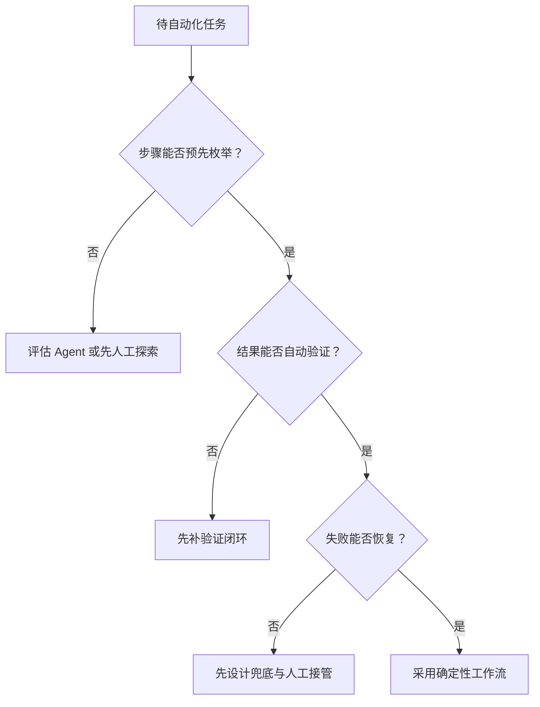

---
---
description: 工作流自动化产品设计：固定步骤编排、确定性可审计、适用场景与选型判断。
---

## 工作流自动化

工作流自动化（Workflow）让 AI 串联多个步骤和工具，把「重复的脑力劳动」变成「一条流水线」：收集 → 整理 → 生成 → 分发。与 Agent 不同，工作流的步骤由**预先编排的代码路径**调度：每一步做什么、按什么顺序在实现时写死，模型只在节点内部发挥作用（[Building Effective Agents](https://www.anthropic.com/engineering/building-effective-agents)）。

工作流的三个特征：

-   **确定性**：同一输入、同一输出，结果可预期
-   **可审计**：路径固定、责任可追溯，强合规场景天然适配
-   **成本可控**：调用次数可预测，预算可提前算清

与 [Copilot](copilot.md) 互补：Copilot 辅助人做事，工作流替人跑固定流程。Copilot 的产出是「给用户的建议」，工作流的产出是「给下游的结果」。

**一个任务是否值得做成工作流**，检查清单：

1.  步骤能否预先枚举？——能，才有固定路径可编排
2.  触发是否规律？——定时、事件驱动或固定时机，而不是随机出现
3.  结果是否可验证？——每步有校验点，坏数据能被拦住
4.  失败是否可恢复？——重试、转人工路径清晰

四条都满足，工作流是比 Agent 更便宜、更稳的选择；不满足的项目，看 [Agent 与工作流](../ai/agent.md) 再决定是否上 Agent。

**何时不要用工作流**：

-   流程本身还在变（每周都在改路径）——先人工跑，稳定后再编排
-   输出无法验证——没有验证闭环，流水线只会把错误放大
-   构建成本高于节省——先算 ROI：构建成本 / 单次节省的时间，再决定要不要自动化

**工作流与 Agent 的选型可以先过一遍最小决策树：**



这棵树把确定性、可验证和可恢复作为工作流准入条件，只有路径稳定且失败有出口时才值得编排。

## 典型场景

每类场景给「输入 → 节点 → 输出」一行示意：

-   **内容流水线**：素材链接 → 抓取/去重/大纲 → 分节生成 → 配图 → 发布排期 → 已发布文章
-   **数据流水线**：原始数据 → 清洗 → 指标计算 → 异常检测 → 报表生成 → 周报/告警
-   **运营自动化**：用户评论/工单 → 意图分类 → 生成回复建议 → 人工审核 → 已回复工单
-   **个人自动化**：新邮件/消息 → 摘要 → 规则分流（重要/待办/归档）→ 日程与待办清单

各场景的展开：

-   **内容流水线**：输入是素材（链接、选题、采访记录），节点是抓取与去重、大纲、分节生成、配图、排版，输出是待发布成品。收益在「从 0 到 1 的初稿」环节；适合选题固定、格式固定的内容团队，不适合需要强个人风格的长文
-   **数据流水线**：输入是原始数据（数据库、日志、第三方 API），节点是清洗、指标计算、异常检测、报表生成，输出是周报/告警。收益在「每天重复的取数与算指标」；异常检测节点能自动把异常转人工，是数据流水线防止「垃圾进垃圾出」的关键
-   **运营自动化**：输入是用户评论/工单，节点是意图分类、情绪识别、生成回复建议，输出是待人工审核的回复草稿。收益在「分类与起草」，审核节点不能省——面向用户的文本必须过人工
-   **个人自动化**：输入是新邮件/消息/文件，节点是摘要、规则分流、写入待办，输出是日程与清单。收益在「减少切换成本」；规则要显式可编辑，否则用户会失控

选型提示：能稳定复现的流程才值得做成工作流；每周只跑一次、每次结果都不同的任务，先用人工。

各场景的「最易出错节点 × 校验点」速查：

| 场景 | 最易出错节点 | 校验点 |
| --- | --- | --- |
| 内容流水线 | 分节生成 | 大纲与成稿一致性校验、引用链接有效性 |
| 数据流水线 | 清洗 | 空值/类型/schema 校验；异常检测节点转人工 |
| 运营自动化 | 回复起草 | 分类置信度、敏感词过滤、人工审核必过 |
| 个人自动化 | 规则分流 | 分流规则可预览、误分可手动改回 |

## 与 Agent 的区别

### 确定性 vs 灵活性光谱

| 维度 | 工作流 | Agent |
| --- | --- | --- |
| 执行路径 | 预先编排，固定 | 模型动态决定 |
| 可控性 | 高，路径可审计 | 低，需要护栏与确认点 |
| 成本 | 可控，调用次数可预测 | 高，循环越多越贵，错误会累积 |
| 适用场景 | 步骤明确、要求稳定 | 开放式问题、步骤不可预测 |
| 失败模式 | 节点失败，易定位、易重试 | 有状态地累积，难复现、难回滚 |
| 对用户的意义 | 可预测、可承诺 | 更强大，但需要信任机制 |

光谱中间态：不是所有流程都二选一。固定工作流里可以嵌入「局部动态节点」（如某一步用模型自由生成文案），Agent 也可以被工作流管住边界（如预算上限、步骤上限）。真正的决策变量是「每一步是不是写死的」。

### 成本与复杂度的账

工作流的成本在**构建期**（编排、数据契约、观测是一次性投入），运行期成本低且可预测；Agent 的成本在**运行期**（每次执行都可能循环、错误会累积），构建期反而短。所以高频、长命的流程值得投工作流；低频、探索性的任务不值得。Anthropic 的多 Agent 实测显示 token 消耗约为普通对话的 15 倍（[多 Agent 研究系统](https://www.anthropic.com/engineering/multi-agent-research-system)）——用工作流把大部分路径固定下来，是控制这类成本最直接的手段。

### 官方五类工作流模式

Anthropic 在 [Building Effective Agents](https://www.anthropic.com/engineering/building-effective-agents) 中总结了五类覆盖大多数确定性流程的模式，机制展开见 [Agent 架构与多智能体](../ai/agent-architecture.md) 的「核心设计模式」一节：

| 模式 | 机制 | 适用场景 | 例子 |
| --- | --- | --- | --- |
| 提示词链（Prompt Chaining） | 固定顺序步骤链，上一步输出是下一步输入 | 复杂任务拆成可校验的小段 | 先写大纲再成文 |
| 路由（Routing） | 先分类再分流 | 简单问题给快模型、复杂问题给强模型；按类型分流程 | 客服意图分流 |
| 并行化（Parallelization） | 扇出-扇入 / 投票 | 可拆分、相互独立的工作 | 多语种翻译、批量审查 |
| 编排者-工作者（Orchestrator-Workers） | 主管拆任务、派发、汇总 | 子任务粒度无法预知 | 调研报告：查资料/写作/校对 |
| 评估者-优化者（Evaluator-Optimizer） | 生成 + 评估 + 迭代 | 能明确写出评估标准 | 翻译润色、代码修改 |

逐个说适用条件与失效条件：

-   **提示词链**：适合「每步输出能被单独校验」的任务。失效条件：任一步失败会污染后续所有步骤——每步之间必须加校验，失败即转人工而不是带病下传
-   **路由**：适合「分类准确、分流收益大」的任务（简单问题用便宜模型能省 80% 成本）。失效条件：分类本身不准，路由错误比不路由更糟——分类置信度低时设兜底路径
-   **并行化**：适合「子任务独立、合并不损失质量」的任务。失效条件：子任务之间强依赖、或合并环节成了新瓶颈——并行收益要先量化再上
-   **编排者-工作者**：适合「子任务粒度无法预知、需要动态拆分」的复杂任务。失效条件：拆解质量差会导致子任务重复劳动；需要把委派写清楚（[多 Agent 研究系统](https://www.anthropic.com/engineering/multi-agent-research-system) 的教训：子 Agent 直接写产物、只传引用）
-   **评估者-优化者**：适合「评估标准能明确写出」的生成任务（翻译、润色、代码修改）。失效条件：评估标准模糊时，迭代会原地打转烧 token——评估器先离线验证，再上线

### 「能用工作流解决的别用 Agent」

判断规则（与 [Agent 与工作流](../ai/agent.md) 的决策表一致），依次问三个问题：

1.  步骤能否预先枚举？——能，用工作流
2.  结果能否自动验证？——不能，先补验证闭环再谈自主
3.  出错能否恢复？——不能，先设计兜底与人工接管

三者都答「否」才值得上 Agent。反向同样成立：报销审批、身份认证、支付转账这类强合规流程天然属于工作流；把确定性流程硬做成 Agent，既失去可审计性，又赔上不可控成本。

补充两条务实规则：

-   单步成功率小于 95% 的节点，先别进流水线。多步成功率 = 各步成功率连乘，单步 90% 五步只剩 59%
-   先跑通单节点，再连成流水线。「先把每一步做对」优先于「先搭完整流程」

### 混合形态

真实产品很少「纯工作流」或「纯 Agent」，更多是混合：**工作流管大边界，Agent 处理局部不确定性**。例如企业客服：工作流控制「转人工、升级、结案」的关键节点，Agent 负责理解意图与生成回复。先按工作流跑通，评测发现某段流程需要动态决策，再把那一段换成 Agent。这是官方推荐的演进路径，也是成本最低的路径。

落地抓手：把「哪一步必须写死、哪一步可以灵活」写进流程文档，评审时逐行过。工作流与 Agent 的边界要逐节点明确标注，不是架构口号。

## 设计要点

### 1. 节点设计

每个节点明确三样东西：

-   **输入**：上游输出的字段规格（如"标题、正文、标签"）
-   **处理**：模型（哪个模型、什么 prompt）/ 工具（哪个 API、什么参数）/ 人工（确认/编辑）
-   **输出**：下游需要的字段规格，附 JSON Schema 校验

节点类型清单：

| 节点类型 | 做什么 | 典型实现 |
| --- | --- | --- |
| LLM 节点 | 生成、改写、分类、总结 | 模型调用 + prompt 模板 |
| 工具节点 | 取数、发请求、写存储 | API 调用、数据库操作 |
| 条件分支 | 按字段值/置信度分流 | if/switch 规则 |
| 格式化节点 | 强制结构化、校验 schema | JSON Schema 校验、字段映射 |
| 人工节点 | 确认、审核、编辑 | 审批队列、通知 |

先画流程图再实现。节点间以**数据契约**衔接：上游输出必须通过下游的 schema 校验，不合格的重试或转人工，而不是带病传递。AI 生成结果必须强制结构化（JSON Schema 校验），这是「格式化节点」不可省的原因。自由文本进自由文本，错误会静默累积到终点。

数据契约示例：

```json
{
  "title": "string, 1-100 字符",
  "summary": "string, 1-500 字符",
  "tags": ["string"],
  "status": "enum: draft | review | published"
}
```

契约变更要版本化：上游改了输出结构，下游校验直接失败而不是静默吞掉。失败的可见性比兼容性更重要。

数据契约要点：字段名用稳定英文标识符；类型明确（string/number/array/enum）；可选字段标明默认值；下游只依赖契约，不依赖上游内部实现。

演进顺序：先单节点验证（每个节点单独跑通、质量达标）→ 再串成链（两个节点一组验证数据契约）→ 加分支与并行 → 最后接人工与 Agent 节点。不要一次搭完五步再测试。排错成本随链路长度指数上升。

### 2. 人工在环

-   **关键节点确认**：发布、付款、删除、发送——不可逆动作之前必须人工确认
-   **异常节点转人工**：识别失败、置信度过低、校验不过——转人工，而不是静默跳过
-   **审批超时策略**：人工长时间不响应，是挂起等待（持久化执行）、降级（跳过该节点并告警）还是超时失败？要显式设计，而不是默认挂死

确认点选择标准：**不可逆、高影响、易错**三个条件命中任意一个，就该设确认点。可逆且低影响的节点加确认，只是增加操作成本。

审批体验设计：移动端提醒 + 批量确认（同批工单一次审完）+ 拒绝理由回填（拒绝理由反馈给模型学习，见 [Agent 产品](agent-product.md) 的审批流一节）。持久化执行与中断机制（LangGraph interrupt、OpenAI 审批流）让长流程可以挂起等人工，而不是超时失败。

### 3. 可观测性

-   **执行日志**：每个节点记「时间、输入摘要、输出摘要、token 消耗、耗时」
-   **节点耗时**：定位慢节点（常见是模型调用与外部 API）
-   **失败重试**：记录重试次数与原因，重试要有边界（见「失败处理」）
-   **幂等**：同一输入重跑不产生副作用——重试、补跑、双跑都不会重复发送、重复扣款。实现上给每条执行一个幂等键，写入类节点先查重再执行

执行视图：按「运行实例」组织（时间线列出每个节点的进出），支持按失败/耗时/成本排序；每次执行关联 trace 与日志，定位问题从「看视图」开始而不是「翻日志」。SLA 指标：成功率（含人工通过率）、P95 端到端延迟、平均单次成本——三个数按月跟踪，退化即告警。

### 4. 触发与调度

| 触发方式 | 延迟 | 可靠性 | 典型场景 |
| --- | --- | --- | --- |
| 手动 | 即时 | 高 | 一键生成周报 |
| 定时 | 到点执行 | 高 | 每日 9 点跑数据流水线 |
| 事件（webhook/邮件/文件） | 秒级-分钟级 | 中（依赖事件源） | 新工单进队列 |
| 轮询 | 分钟级-小时级 | 中 | 外部系统无 webhook 时 |

-   **手动**：用户点「运行」，结果直接展示
-   **定时**：cron 表达式调度，注意时区、节假日与夏令时
-   **事件**：webhook、新邮件、新文件、数据库变更。事件驱动要处理乱序与重复投递（幂等键）
-   **并发与队列**：同一流水线可并发跑多少实例？队列积压时是丢弃、延迟还是串行？高峰限流策略要提前设计，否则一次运营活动就能打爆队列

调度与幂等配合：定时触发与事件触发都可能重复投递（cron 补跑、webhook 重放），触发层去重 + 执行层幂等双保险，才能保证「跑一次」就是「只发生一次」。

### 5. 失败处理

失败分类与对应策略：

| 失败类型 | 例子 | 策略 |
| --- | --- | --- |
| 瞬时错误 | 超时、限流、网络抖动 | 指数退避重试（3-5 次封顶） |
| 配置错误 | API key 失效、参数写错 | 立即告警，不重试（重试无意义） |
| 业务失败 | 校验不过、数据缺失 | 转人工，带上下文 |
| 模型失败 | 输出不符合 schema | 重试 1 次，仍失败转人工 |

-   **重试边界**：区分「可重试的瞬时错误」（超时、限流，指数退避重试）与「反复失败的系统性问题」（立即转人工，不烧 token）
-   **死信**：重试耗尽仍失败的执行进入死信队列，留档可查、可手动重放，不丢数据
-   **告警**：失败、延迟、预算超支都要告警；告警分级，不要每条失败都打扰所有人
-   **人工介入路径**：失败或不确定时，人从哪个节点接管、接管后如何续跑，要提前设计

失败演练：上线前故意注入各类失败（API 超时、schema 不符、模型拒答），验证重试、死信与人工介入路径真的可用。失败处理不演练，等于没有。

### 6. 成本与预算

-   **每节点 token 成本**：模型调用是主要成本项，逐节点记录 token 消耗
-   **整条流水线成本上限**：单次执行上限 + 每日/每月总预算；超限自动暂停或降级（换小模型、跳过非关键节点）
-   **高频路径优化**：缓存（相同输入不重复计算）、小模型分流、批量合并请求

单次成本估算公式：`单次成本 = Σ(各节点输入 token × 单价 + 输出 token × 单价)`。算例：一条 5 节点流水线，每节点平均 2k 输入 / 500 输出 token，按主流中端模型单价量级估算，单次约在几分钱到几毛钱之间；日跑 1000 次时每月成本即达数百元量级。**成本是流水线的一等公民，不是事后补账**。具体测算见 [LLM 成本测算](../tools/llm-cost.md)。

### 7. 安全与合规

-   **最小权限**：工作流能访问什么数据、调用什么 API，按节点最小化；高权限节点（写生产库、发消息）单独审批
-   **数据出境与保留**：模型供应商的数据处理条款是选型因素；日志保留期与脱敏策略要明确，详见 [数据隐私与用户控制](data-privacy.md)
-   **审计**：执行日志本身就是合规证据——强合规流程（报销、审批）要求日志不可篡改、可导出

## 工具生态

| 分类 | 代表 | 特点 | 选择逻辑 |
| --- | --- | --- | --- |
| 可视化编排 | n8n、Dify、Coze | 拖拽节点、低代码、内置 AI 节点 | 团队无专职工程、流程简单、要快速上线 |
| 代码编排 | Temporal、Airflow | 代码定义流程，支持重试/暂停/持久化执行 | 流程复杂、需要细粒度控制与审计 |
| 办公自动化 | Zapier、Make | 连接 SaaS 应用，触发-动作 | 跨应用粘合、无自建系统的团队 |

选择逻辑一句话：先看流程复杂度与团队能力。简单流程用可视化编排，复杂/长流程用代码编排，办公场景优先连接器丰富的平台。确定性与可观测性要求越高，越要选「流程可见、日志完整」的工具；要支持长时挂起等人工审批，则需要持久化执行能力（Temporal 等）。

迁移路径：从可视化编排起步验证流程，流量与复杂度上来后，把核心链路迁到代码编排——先证明业务价值，再投资工程底座，避免一开始就陷进编排框架的复杂度。

按场景选型速查：

| 场景 | 推荐 | 理由 |
| --- | --- | --- |
| 个人自动化（邮件、文件） | 办公自动化 | 连接器现成，零开发 |
| 团队内容/运营流程 | 可视化编排 | 业务人员可维护、改流程快 |
| 核心业务链路（计费、风控） | 代码编排 | 需要事务、审计与细粒度控制 |
| 长时审批、跨系统状态 | 代码编排（持久化执行） | 挂起等待不丢状态 |

## 案例走查：客服工单处理工作流

以「客服工单分类 → 回复建议 → 人工审核 → 回写」为例，走一遍完整设计。

**1. 目标与边界**：输入 = 新工单（文本 + 附件），输出 = 已回复工单（人工确认后）。固定流程、强合规（面向用户），适合工作流而非 Agent。

**2. 节点与数据契约**：

| 节点 | 类型 | 输入 | 输出 | 校验 |
| --- | --- | --- | --- | --- |
| 工单捕获 | 事件 | 新工单 webhook | 工单对象（id、文本、渠道） | 必填字段非空 |
| 意图分类 | LLM | 工单文本 | 类别 + 置信度 | 类别在枚举内；置信度 > 0.7，否则转人工 |
| 知识检索 | 工具 | 类别 + 文本 | 候选知识条（带分数） | 分数过阈值才用 |
| 回复起草 | LLM | 工单 + 知识条 | 草稿 + 引用列表 | JSON Schema 校验；引用必须存在 |
| 人工审核 | 人工 | 草稿 + 引用 | 通过/修改/驳回 | 超时 4 小时告警，8 小时转组长 |
| 回写 | 工具 | 终稿 | 工单系统状态 | 幂等键（工单 id）防重复提交 |

**3. 幂等与失败**：每条工单的执行带幂等键（工单 id），回写节点先查重；分类失败重试 2 次后转人工队列；知识检索为空时草稿标注"无引用"，由审核人自行处理。

**4. 观测与成本**：每节点日志含 token 与耗时；日终报表：分类准确率抽样、人工驳回率、平均处理时长。预算：回复起草是大头，用中端模型，仅低置信分类才升配。

走查要点：先固定流程与契约，再谈模型；每个节点回答「输入是什么、输出给谁、失败怎么办」。

## 常见坑

-   **流程里塞太多模型调用**：每个节点都用大模型，成本翻倍且错误逐节点累积——能用规则、查表、模板解决的节点，别用模型
-   **无幂等设计**：重试导致重复发送邮件、重复扣款——写入类节点必须有幂等键
-   **失败静默**：某个节点失败后流程悄悄继续或卡死，没人知道——失败必须可见、可定位、可告警
-   **节点间格式不匹配**：上游输出自由文本、下游要 JSON——强制结构化 + 契约校验
-   **把 Agent 塞进固定工作流**：该灵活的节点用死规则，失去灵活性又赔了确定性——先画流程，再决定哪些节点需要动态决策
-   **流程设计先于验证**：想当然画流程，结果单步成功率 90%、五步成功率只剩 59%（0.9 的 5 次方 ≈ 0.59）——每一步都要有验证节点与失败预案
-   **没有版本管理**：流水线的代码与配置一改就上线，回退无从谈起——流程本身要进版本控制，变更可审计

???+ example "练习"
    选一个你每周都做的重复任务（如"整理本周收藏的文章并生成摘要"），画出 4-6 步的工作流，标注每步的工具、校验点与失败处理。

## 设计评审清单

设计评审时逐项过：

-   **节点**：每个节点是否明确输入/处理/输出？数据契约是否版本化？格式化节点是否强制？
-   **确定性**：哪些节点是写死的、哪些允许模型自由发挥？该灵活的节点有没有被锁死？
-   **人工在环**：不可逆动作是否有人工确认？异常是否转人工而不是静默？审批超时策略是什么？
-   **幂等**：重跑会重复发消息/扣款吗？写入类节点有幂等键吗？
-   **可观测**：每个节点的日志、耗时、token 是否可查？失败是否可见、可告警？
-   **失败**：瞬时错误与系统性问题是否区分？死信队列是否留档？人工介入路径在哪？
-   **成本**：单次执行成本是否算过？整条流水线有无预算上限与降级路径？
-   **安全**：节点权限是否最小？日志里的敏感数据是否脱敏？（对照 [数据隐私与用户控制](data-privacy.md) 逐条核对）

## 来源说明

> 本文由本站撰写整理，综合参考以下权威来源：

-   [Anthropic — Building Effective Agents](https://www.anthropic.com/engineering/building-effective-agents)：工作流与 Agent 的定义、五类工作流模式、「先简单后复杂」原则
-   [Anthropic — Multi-Agent Research System](https://www.anthropic.com/engineering/multi-agent-research-system)：编排器-工作者模式的实践教训（委派要写清楚、子 Agent 直接写产物）
-   [OpenAI — Agents 指南](https://developers.openai.com/api/docs/guides/agents)：Agent 定义与能力边界（与工作流的对照）
-   [OpenAI Agents SDK — Running Agents](https://openai.github.io/openai-agents-python/running_agents/)：审批流、步骤预算、并发上限（人工在环、成本与预算）
-   [LangGraph — 官方文档](https://docs.langchain.com/oss/python/langgraph/)：持久化执行、human-in-the-loop 中断（失败处理、人工在环）
-   本站 [Agent 与工作流](../ai/agent.md)、[Agent 产品](agent-product.md)、[Agent 架构与多智能体](../ai/agent-architecture.md)、[LLM 成本测算](../tools/llm-cost.md)：交叉引用与机制展开
