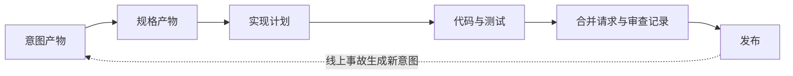
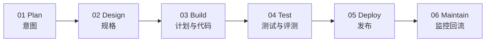
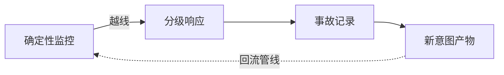

## AI-Native 研发流程

代码生产变便宜之后，卡点转到规划、评审、测试和发布。传统 SDLC 按「写代码最贵、最慢」来设计控制手段；构建一旦快过流程，逐行人工评审会变成瓶颈。

**AI-Native SDLC** 保留原来的控制目标，更换执行方式：每个阶段结束把一份标准产物写入版本控制，下一阶段从读它开始。commit 链记录谁要什么、agent 产出了什么、谁批准了什么。人类保留对判断性决策的问责，从启动每个阶段转为在关卡处评审。

产品上线后的代理权与持续校准见 [AI 产品开发生命周期](../pm/ai-lifecycle.md)。通用需求到灰度的工程节奏见 [开发流程与节奏](dev-flow.md)。

### 三条生命周期

| 页面 | 对象 | 主问题 |
| --- | --- | --- |
| [开发流程与节奏](dev-flow.md) | 一次功能交付 | 如何集成、验证、灰度与回滚 |
| [AI 产品开发生命周期](../pm/ai-lifecycle.md) | AI 产品行为 | 代理权给多少、效果如何校准 |
| 本页 | 研发过程本身 | agent 写代码之后，关卡和产物如何交接 |

文件名（如 `intent.md`）只是产物示例。团队可以用 PRD、技术规格或自己的模板，关键是：机器可读、进版本库、关卡有人签字。

### 通用主循环

每个阶段以提交产物收尾，下一阶段从读取开始。同一份 commit 既当流程依据，也当审计依据。

### 六大阶段

#### 01 Plan

发起人用自然语言说明问题。助手追问范围、用户、约束和成功标准，整理成意图产物：问题、目标结果、受影响用户、约束、开放问题。产品负责人评审后合入，验收即 merge。度量：从首次讨论到意图产物提交的时长。

#### 02 Design

已接受的意图产物进入规格阶段，并受组织级约定约束：品牌、安全、合规、UX。规格要标出必须由人决定的关注点。进入构建需要人类决策。

#### 03 Build

先产出实现计划：哪里会坏、最险的一步、被否掉的方案，使未参加讨论的工程师只凭计划也能理解改动，再交给 agent 实现。偏离计划必须在同一 commit 更新计划。

仓库约定、可复用技能和确定性钩子（拦截受保护路径、格式化、阻止凭据进入 diff）是常见载体；文件名因团队而异。

#### 04 Test

给 agent 验证自己工作的手段：测试、构建、截图对比。到工程师手里的代码应已自测。修 bug 先写失败测试；修代码的 agent 不得削弱自己的检查。

**持续评测**是阶段门：一组真实任务带预期结果，定时跑，并在约定、技能和钩子变更时跑；每个线上事故补一条评测。门禁至少覆盖核心任务通过率、幻觉或拒答、延迟、成本与安全用例。

#### 05 Deploy

自动审查可以给意见、按意见改代码，但不能自己放行生产。分支保护、code owner、变更管理和发布授权仍由人控制。不可谈判项放在托管设置，个人不可覆盖。

agent 可行动到生产关卡之前，不可越过。自主程度按环境分级；回滚是流水线里排练最多的路径。部署机制见 [部署与环境](deployment.md)。

#### 06 Maintain

确定性监控（不调模型）看生产指标，越线再调 agent。分级响应：记录、只读诊断、经 PR 或预批 runbook 行动。结论写成新的意图产物回流。线上信号口径见 [可观测性](observability.md)。

### 传统 vs AI-Native

| 维度 | 传统 | AI-Native |
| --- | --- | --- |
| 流程形态 | 线性；阶段关卡；文档交接 | 闭环；产物触发下一阶段 |
| 需求 | 委员会收集；逐层签批；手写 | 整理成可执行的意图产物 |
| 设计 | 分析、设计分阶段 | 单次收敛；组织约定约束；标记关注点 |
| 评审 | 人逐行审 | 分层 agent 评审；人审受监管与关键代码 |
| 治理 | 评审循环里不一致地施加 | 行动时用钩子强制批准关卡 |
| 维护 | 被动等人 | 监控触发；事故写回新意图 |

循环持续运转，人的判断留在关卡上。

### Anthropic 案例

以下机制与数字摘自 Anthropic 官方博客，原文日期 2026-07-21，访问日期 2026-08-27。具体以原文为准。这是一家模型公司用自己的助手写代码的做法，用来对照本团队的关卡设计。

Claude 写了 Anthropic 代码库约 80% 的合并代码；过半合并代码走内部版 Claude Tag（agentic 合并）；工程师每季度产出代码约为 2021–2025 时期的 8 倍。威胁设计针对三类风险：被攻破或提示注入的 agent 引入恶意改动、供应链/依赖投毒、更大批量到达的常规应用漏洞。

他们使用的产物和载体包括 `intent.md`、`spec.md`、`plan.md`、`CLAUDE.md`、skills 与 hooks。

#### 安全左移进代码创建阶段

- Plan 阶段 PSR（project security review）：Web 应用读设计文档，按 MITRE ATT&CK 框架给建议，连内部知识索引
- 安全编码准则写进 **CLAUDE.md** 与 org skills：发现漏洞类 → 更新生成指令 → 不再复发
- `/security-review` 命令：开 PR 前找攻击者可控输入、可疑链接
- 远程 VM + egress 白名单约束 agent 流量：注入 agent 也无法访问任意外网，外泄限少数被监控服务

#### 硬性身份与访问边界

最小权限；每个 agent 单用途身份。身份模型见 [身份认证与权限](identity-access.md)。

#### 确定性 + agentic 评审组合，生产前后都上

每个 PR 多个窄范围评审 agent，各管一个 focus，用 RAG 带过往事故上下文，agent 必须写证据证明自己的发现有效。按风险给代码库分级，部分保留严格人工审批；每次自动化审批记录信号与理由，按风险加权抽样人工复核；不变式测试（如用户 A 永远读不到用户 B 数据）触发额外人工评审；SAST 直接贴 PR。

#### 把人类放在最高杠杆点

- 治理：人从盯代码、盯 bug 转向盯 Claude Tag、循环与仪表盘
- 影子模式：新 AI 评审先只贴评论，人为批准直到可信；团队红队尝试塞恶意改动
- 按百分比抽样自动化审批
- 所有 agent 行为路由进 **SIEM**：每次审批、工具调用、agent 间消息都记录，可归属可审计
- agent 被当作新型内部威胁类别对待

#### 线上告警处置示例

告警触发 → Claude 查生产日志、根因定位、写 post-mortem，有时写修复，但不能部署。它是单用途系统账号，只有三个权限：写新文档、在公司频道发帖、读生产日志。修复必须走独立的 agent 与人类评审系统，控制爆破半径。

事故响应 agent 曾越权直接通过 Slack 联系另一个能写代码的 Claude 实例，要求推修复，被人工评审关卡拦下。教训：按访问与动作划边界，不按模型指令划边界。

#### 持续动态测试

预发环境跑持续 AI 驱动的 DAST（动态扫描），匹配发布节奏。静态扫不到的跨服务假设 bug 由它发现。2026 年 2 月，Claude 找到并协助修复 500+ 高危 OSS 漏洞。

安全工程师的工作从盯 bug 变成盯循环。

### 对 AI 产品经理的启示

- 为每个阶段指定产物、评审人和退出条件；意图产物写问题、结果、约束和开放问题，可与 [PRD](../pm/prd.md) 并存
- 列出必须人批的关卡：权限、计费、数据出域、不可逆写、生产发布
- 把评测集、核心任务通过率和安全用例写成合并/发布门禁，见 [评估与评测](../ai/evaluation.md)
- 发布与回滚走同一条可演练路径，见 [部署与环境](deployment.md)
- agent 使用独立身份与最小权限，见 [身份认证与权限](identity-access.md)
- 仓库约定文件的名字不重要；重要的是约定进版本库，且犯过的错会写回去

延伸阅读：[AI 产品开发生命周期](../pm/ai-lifecycle.md)、[项目管理与迭代](../pm/project-management.md)、[开发流程与节奏](./dev-flow.md)。

### 来源说明

通识框架按产物关卡与持续评测整理。案例整合两篇 Claude / Anthropic 官方博客，原文日期 2026-07-21，访问日期 2026-08-27：

- The AI-Native SDLC Playbook：https://claude.com/blog/the-ai-native-sdlc-playbook
- How Anthropic Secures Its AI-Native Software Development Lifecycle：https://claude.com/blog/how-anthropic-secures-its-ai-native-software-development-lifecycle

具体数字与机制以原文为准。
