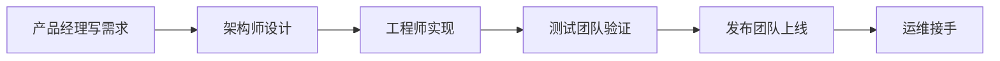
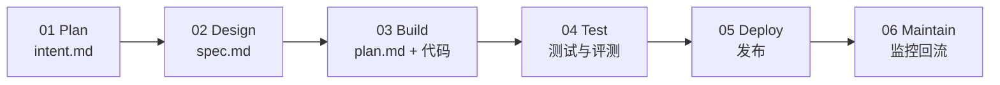
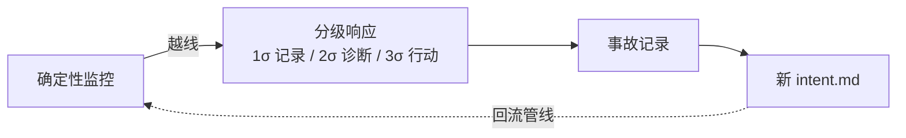

## AI-Native 研发流程

代码不再是瓶颈。AI 把写代码压缩到极致，卡点转移到围绕构建的人的环境：规划、评审、测试、发布。

传统 SDLC 为写代码最贵最慢的年代设计，是线性流程。构建一旦快过流程，逐行人工评审这类控制手段开始不匹配现实，治理成本上升。

**AI-Native SDLC** 保留旧的控制目标，换新的执行方式：每个阶段结束把一份标准产物写进版本控制，下一阶段从读它开始。commit 链本身就是审计轨迹：谁要什么、agent 产出了什么、谁批准了什么。人类保留对判断性决策的问责，从启动每个阶段转为在关卡处评审。

### 传统流程回顾

传统流程是一条线性流水线：产品经理写需求 → 架构师设计 → 工程师实现 → 测试团队验证 → 发布团队上线 → 运维接手。工作靠文档、工单、评审会、层层签批在不同角色间流转，逐行人工评审是默认控制手段。



### AI-Native 主循环

AI-Native 把线性流程改成闭环：每个阶段以提交标准产物收尾，下一阶段从读取开始。同一份 commit 记录既当流程依据，也当审计依据。

```mermaid
flowchart LR
    intent[intent.md] --> spec[spec.md]
    spec --> plan[plan.md]
    plan --> code[代码与测试]
    code --> pr[合并请求与审查记录]
    pr --> rel[发布]
    rel -. 线上事故生成新 intent.md .-> intent
```

### 六大阶段



#### 01 Plan

原始发起人不要求正式语言，直接与 Claude 头脑风暴。Claude 提出分析师式问题：范围、用户、约束、成功长什么样。产出 **intent.md**：问题、目标结果、受影响用户、约束、开放问题。产品负责人评审修正后 commit，验收 = merge。度量：从首次对话到 intent.md 提交的时长。

#### 02 Design

Claude 拿已接受的 intent.md 产出规格，受组织 skills 约束：品牌、安全、合规、UX，标记关注点。产品负责人按 idea 评审，与策略 owner 解决被标记的关注点，spec.md 与 intent.md 一起提交。进入构建需要人类决策。

#### 03 Build

默认从 plan mode 开始。工程师给 Claude 规格，追问计划：哪里会坏、最险的一步、被否掉的方案，直到一个没看过这段对话的工程师只凭计划实现改动，再提交 plan.md 交给 Claude 实现。偏离计划必须在同一 commit 更新 plan.md。

- **CLAUDE.md**：仓库约定载体。Claude 同样错误犯两次，修正进 CLAUDE.md
- **skills**：带 frontmatter 的版本化 SKILL.md，advisory 性质
- **hooks**：确定性守卫。拦截受保护路径、跑格式化/lint、把凭据挡在 diff 外

#### 04 Test

给 Claude 验证自己工作的手段：测试、构建、截图 diff。到工程师手里的代码已经自测过。先写失败测试再修 bug；修代码的 agent 不得削弱自己代码的检查，hook 拦截修复期改测试文件。

**持续评测** = AI-native 版的阶段门 QA：20–50 个真实任务带预期结果，非交互定时跑，在 CLAUDE.md / skills / hooks 变更时跑；每个线上事故补一条评测。

#### 05 Deploy

双向 AI 评审：Claude 既给 review，也接 review 修 @claude 意见。findings 不能自己放行或拦截 PR，分支保护仍要 code owner 审批。人类关卡（变更管理、发布授权）变成 allow / ask / block 的 hooks；不可谈判项放托管设置，工程师不可覆盖。CI/CD 里 claude -p 非交互执行判断步骤。

agent 可以行动到生产关卡之前，不能越过它。自主程度按环境分级；回滚是流水线里排练最多的路径。

#### 06 Maintain

确定性脚本（不调模型）监控生产指标：滚动窗口的均值/标准差，越线才调 Claude。分级响应：1σ 记录、2σ 只读诊断、3σ 可经 PR 或预批 runbook 行动。结论写成 intent.md 回流管线。周期性代码库扫描（Claude Security），修复照常过评审关卡。



### 传统 vs AI-Native 对照表

| 维度 | 传统 | AI-Native |
| --- | --- | --- |
| 流程形态 | 线性；阶段关卡；文档交接 | 闭环；产物自动触发下一阶段 |
| 需求 | 委员会收集；逐层签批；手写 | Claude 综合成 intent.md；机器可执行 |
| 设计 | 分析、设计分阶段 | 单会话；skills 约束；标记关注点 |
| 评审 | 人逐行审 | 分层 agentic 评审；人审受监管与关键代码 |
| 治理 | 评审循环里不一致地施加 | AI 行动时 hooks 作为批准关卡强制 |
| 维护 | 被动等人 | agent 监控；事故写回新 intent.md |

> 循环持续运转，人的判断在上方。
