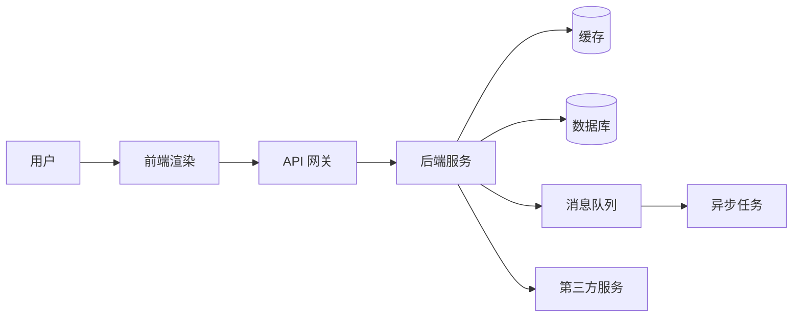

## 工程架构术语

这组文章把系统架构里的高频组件拆开讲：每篇先解释工程师口中的术语，再说明它对产品体验、排期、成本和风险的影响。阅读这组文章前，先看 [系统架构基础](architecture.md) 的整体请求链路。

### 一条请求经过哪些组件

组件不是按技术名词孤立存在的：前端决定用户何时看到页面，后端编排业务规则，数据库保存事实，缓存缩短热点读取，消息队列承接异步任务，第三方服务扩展系统边界。

### 内容地图

| 文章 | 主要回答的问题 | 关键词 |
| --- | --- | --- |
| [前端渲染技术与黑话](frontend-rendering.md) | HTML 在哪里生成？首屏、SEO、交互和数据新鲜度怎么取舍？ | SSG、SSR、CSR、SPA、ISR、Hydration |
| [后端与服务端术语](backend-services.md) | 请求由哪些服务处理？什么时候拆分服务？接口怎么保持兼容？ | 单体、微服务、网关、无状态、API、同步/异步 |
| [数据库与数据存储术语](databases.md) | 业务事实放在哪里？如何保证查询、事务、迁移和恢复？ | SQL、NoSQL、Schema、事务、索引、复制、分区 |
| [缓存技术与黑话](caching.md) | 哪些数据可以更快读取？旧数据和缓存故障怎么处理？ | CDN、TTL、命中率、缓存旁路、击穿、穿透、雪崩 |
| [消息队列与异步系统](message-queues.md) | 哪些工作不必阻塞用户？消息如何可靠消费？ | 队列、发布订阅、重试、死信、幂等、背压 |
| [第三方服务与外部依赖](third-party-services.md) | 外部供应商故障或变更时，产品如何继续运行？ | SLA、配额、Webhook、超时、降级、合规、退出成本 |

### 推荐阅读顺序

1. [系统架构基础](architecture.md)：先建立接入层、服务层、数据层和外部依赖的全局地图。
2. [前端渲染技术与黑话](frontend-rendering.md)：理解用户从打开页面到看到内容、开始交互的过程。
3. [后端与服务端术语](backend-services.md)：理解请求如何进入服务、被路由和扩展。
4. [数据库与数据存储术语](databases.md)：理解业务事实如何保存、查询、迁移和恢复。
5. [缓存技术与黑话](caching.md)：理解性能优化如何改变数据一致性和故障形态。
6. [消息队列与异步系统](message-queues.md)：理解异步化如何换取吞吐，同时引入重试和最终一致性。
7. [第三方服务与外部依赖](third-party-services.md)：理解系统边界之外的可用性、合规和替代方案。

不需要按顺序通读：遇到接口慢，先看后端与缓存；遇到数据错误，先看数据库与缓存；遇到通知延迟，先看消息队列与第三方服务。

### 每个架构决策都要问什么

- **边界**：这个能力属于前端、后端、数据层，还是外部供应商？谁拥有最终事实？
- **时效**：用户需要实时、分钟级、小时级，还是允许读取短暂旧数据？
- **失败**：组件不可用、超时、重复执行或返回旧数据时，用户看到什么？
- **扩展**：流量、数据量、并发和团队规模增长后，哪里先到瓶颈？扩容是加实例、加缓存，还是拆分服务？
- **成本**：每次请求、每条数据、每个任务和每个供应商调用分别产生什么成本？
- **退出**：供应商涨价、接口变更或服务下线时，是否有替代路径和迁移计划？

### 本类与系统架构基础的关系

- **系统架构基础**保留跨组件的请求链路、整体分层和架构决策框架，适合快速建立全局认知。
- **工程架构术语**按组件拆分正文，分别解释工程黑话、常见方案、故障模式和产品追问，适合查词和深入某个决策。

本类不替代具体框架、云厂商或数据库的官方文档。术语页中的选型结论只作为产品沟通起点，实际方案还要结合流量、数据、合规、团队能力和压测结果。

### 相关页面

- [工程与架构简介](index.md)：开发流程、系统架构与 AI-Native 研发流程总览
- [AI 系统架构](../ai/architecture.md)：业务、应用、技术、数据四层地图
- [Agent 架构与多智能体](../ai/agent-architecture.md)：Agent 的规划、记忆、工具和编排架构

### 来源说明

本文为工程架构知识地图，组件术语与实现细节以各文章列出的官方文档为准。系统级请求链路参考 [系统架构基础](architecture.md)，访问日期 2026-08-30。
