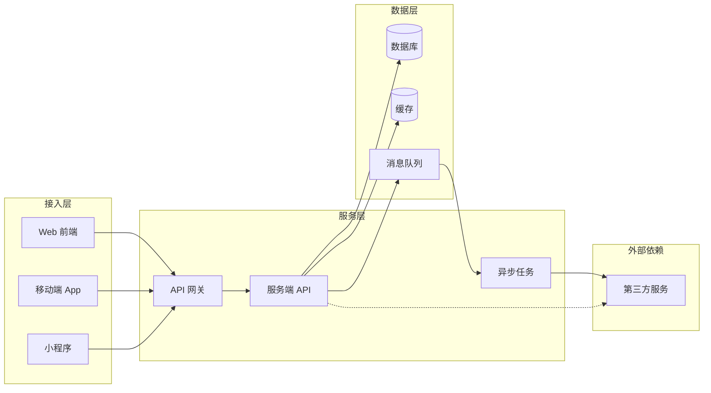
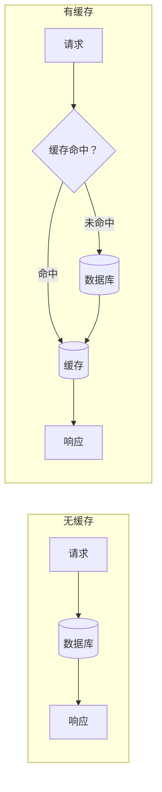
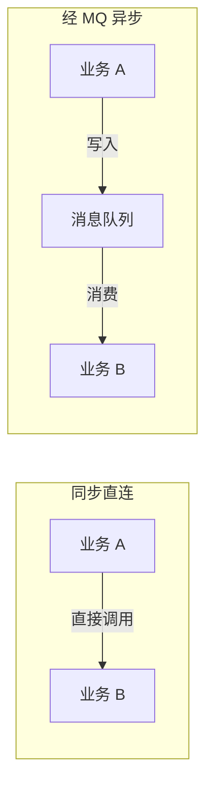

## 系统架构基础

一条用户请求从客户端发出到收到响应，穿过接入层、服务层与数据层；异步操作经由消息队列在后台完成。看懂这条链路，才知道砍成本、提性能、排风险要动哪一层。

### 整体架构总览

典型请求链路：

**读图方式**：用户请求从 Web/App/小程序发出，先到 API 网关；网关做统一入口（鉴权、限流、路由），把请求转发给服务端 API；服务端按业务读写数据库与缓存；需要异步的操作写入消息队列，由异步任务消费并调用下游；需要同步外部能力时直连第三方服务。

### 前端与客户端

**Web 前端**：按渲染方式分 SPA 与 SSR 两类。

- **SPA（单页应用）**：页面加载后由前端 JS 渲染与切换，后续只请求数据。交互流畅，首屏与 SEO 弱。
- **SSR（服务端渲染）**：服务端拼好 HTML 下发。首屏快、利于 SEO，适合内容型页面；重度交互仍靠客户端渲染。
- **移动端 App**：原生（iOS/Android）与跨端框架（React Native、Flutter）两类。发版受应用商店审核约束，更新周期以天到周计。
- **小程序**：平台托管运行，受平台 API 与审核约束，更新即时。
- **桌面端**：Electron 等方案打包，资源开销大，更新节奏慢。

**SSR 与 CSR 的取舍**：

- **首屏**：SSR 直接下发 HTML，客户端渲染要先下载 JS 再渲染
- **SEO**：SSR 内容可被爬虫直接读取，客户端渲染需额外处理
- **交互复杂度**：重度交互场景靠客户端渲染，SSR 只解决首屏与内容可达

**与后端交互**：

- **HTTP API**：请求-响应模型，适合读写数据；客户端轮询获取状态变化
- **WebSocket**：长连接双向推送，适合实时消息、协作编辑、行情
- **SSE**：服务端单向推送，适合通知、流式输出（大模型逐字返回）
- **API 版本化**：接口变更不破坏老客户端，路径加 `/v1`、`/v2` 或 header 标记版本

**PM 关注**：

- **发版节奏**：前端发版随时，App 发版受审核周期约束，后端发版要兼容所有存量客户端
- **兼容性**：老客户端不升级时，后端接口必须向后兼容；API 版本化是基本手段
- **性能指标**：首屏耗时、白屏时间、接口响应时间，直接决定转化与留存

### 后端与服务端

**单体架构**：一个应用包含全部业务模块。开发部署简单；规模上去后构建变慢、故障影响面大、团队协作耦合。

**微服务**：按业务拆成独立服务，独立部署、独立扩容。拆分动机是团队规模与独立部署需求；代价是分布式复杂度（网络故障、数据一致性、运维监控）。拆早了是成本，收益在团队与流量规模到达临界后才显现。

**API 网关**：统一入口，承接鉴权、限流、路由、反向代理。客户端只认网关，不直连各服务；网关挂掉入口全挂，自身要高可用。

**无状态服务**：服务实例不保存用户会话，任何实例处理任何请求，新增实例即水平扩容。

- **状态放哪里**：会话与状态放外部存储（Redis、数据库），服务实例只做计算

**PM 关注**：

- **接口契约**：前后端、服务之间以接口契约为准，改动要评估影响面与兼容性
- **依赖的服务清单**：一个功能依赖哪些内部服务与外部依赖，出故障才知道影响范围
- **扩容成本**：水平扩容按流量线性加实例与成本；无状态才能扩得动

### 数据库

**关系型数据库（MySQL/PostgreSQL）**：结构化数据的事实标准，支持事务、索引、SQL 查询。

- **事务**：一组操作要么全部成功要么全部回滚，保证订单、余额这类数据不错乱
- **索引**：加速查询的辅助结构；加索引读变快、写变慢、占存储
- **读写分离**：主库写、从库读，缓解读压力；存在复制延迟，读到旧数据是常态

**NoSQL 与场景**：

- **MongoDB（文档）**：字段结构灵活，适合快速迭代、非强事务场景
- **Elasticsearch（搜索）**：倒排索引做全文检索，适合搜索与日志分析
- **Redis（KV 存储）**：读写走内存，做缓存也做轻量存储、计数、会话

**PM 关注**：

- **数据模型变更的成本**：加字段、改结构要迁移，老数据兼容与回滚要评估
- **数据迁移**：换库、加列、分表都是工程成本，选型前想清楚
- **成本随数据量增长**：存储、备份、查询变慢，提前做预算与清理策略

### 缓存

**缓存**：把热点数据放内存，读请求不落数据库。降低延迟、保护数据库、省成本。

**分层**：

- **CDN**：静态资源就近分发，用户访问不落到源站
- **本地缓存**：进程内缓存，最快；多实例不共享
- **分布式缓存（Redis）**：多实例共享，存热点数据、会话、计数

**缓存一致性**：

- **缓存击穿**：热点 key 过期瞬间，大量请求落到数据库
- **缓存穿透**：查询不存在的 key，请求绕过缓存直打数据库
- **缓存雪崩**：大量 key 同时过期，数据库瞬间承压

有缓存与无缓存的读路径：

**PM 关注**：

- 缓存是降本利器，也是脏数据源：缓存与数据库不一致时，用户读到旧数据
- 数据一致性要求高的场景（订单、余额）慎用缓存；允许短暂滞后才用

### 消息队列

**消息队列**：在生产者与消费者之间加一个缓冲通道。三个作用：解耦、削峰、异步。

- **解耦**：生产者不关心消费者是谁，下游挂了不拖垮主链路
- **削峰**：瞬时流量先入队，消费者按能力慢慢消费，系统不被峰值打垮
- **异步**：不需要实时返回的操作（通知、订单确认）放后台执行

**点对点 vs 发布/订阅**：

- **点对点**：一条消息被一个消费者消费，任务分配
- **发布/订阅**：一条消息广播给多个订阅者，事件通知

**典型选型**：

- **Kafka**：高吞吐、日志流，适合埋点、日志、数据管道
- **RocketMQ/RabbitMQ**：业务消息，可靠性与事务消息，适合订单、通知

同步直连与经 MQ 异步：

**PM 关注**：

- 引入时机：同步调用链路过长、峰值流量打垮系统、需要解耦多个下游时考虑
- 代价：消息丢失、重复消费、顺序问题、运维复杂度，引入时一并承担
- 适用场景：通知、订单异步化、削峰填谷

### 第三方服务

**常见类型**：支付、短信/通知、地图、OAuth 登录、对象存储、SaaS API、风控/内容安全。

**集成风险**：

- **供应商不可用**：第三方故障时主链路要降级与熔断（快速失败、走备用通道）
- **数据出域合规**：数据传给第三方要过合规评审，用户隐私尤其严格
- **依赖锁定**：供应商涨价、下线、改接口，切换成本高

**PM 关注**：

- 选型时评估 SLA 与替代方案：功能之外，重点看可用性承诺与逃生通道
- 第三方挂了怎么办：降级策略要在产品里想好（提示文案、备用通道、缓存兜底）

### 架构决策对 PM 的意义

看懂链路才知道砍成本、提性能、排风险动哪一层。

- **砍成本**：缓存挡热点读、异步削峰降机器、冷数据降存储档
- **提性能**：CDN 就近分发、索引加速、读写分离、缓存
- **排风险**：第三方降级预案、消息队列解耦、数据一致性评估

站内延伸：

- [AI 系统四层架构](../ai/architecture.md)：业务/应用/技术/数据四层地图
- [Agent 架构](../ai/agent-architecture.md)：任务拆解与工具编排
- [RAG 检索链路](../ai/rag.md)：检索涉及 Elasticsearch 与向量库

### 来源说明

本文为通用工程知识整理，细节以各技术官方文档为准（访问日期 2026-08-27）：

- [MySQL 文档](https://dev.mysql.com/doc/)
- [PostgreSQL 文档](https://www.postgresql.org/docs/)
- [Redis 文档](https://redis.io/docs/)
- [Kafka 文档](https://kafka.apache.org/documentation/)
- [RabbitMQ 文档](https://www.rabbitmq.com/documentation.html)
- [RocketMQ 文档](https://rocketmq.apache.org/docs/)
- [Elasticsearch 文档](https://www.elastic.co/guide/)
- [MongoDB 文档](https://www.mongodb.com/docs/)
