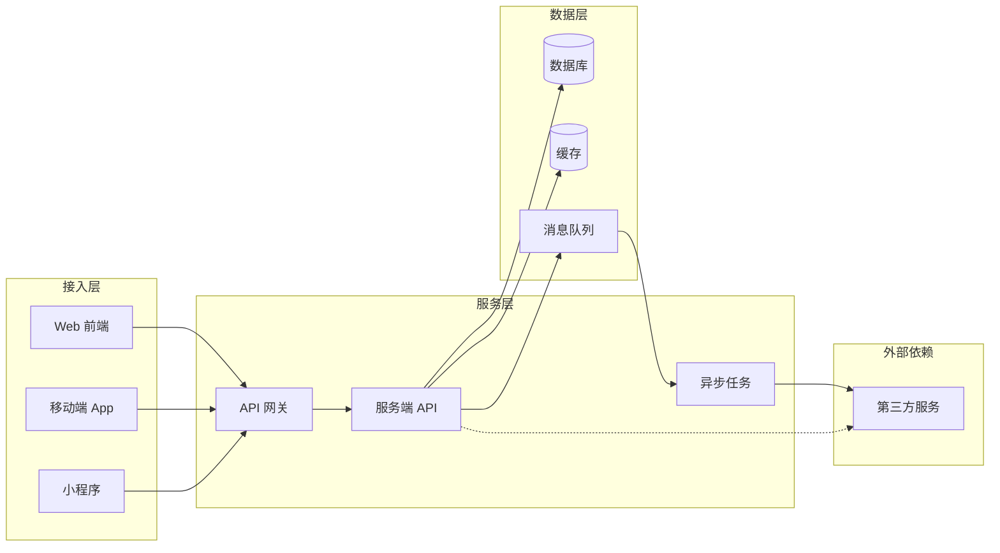

## 系统架构基础

一条用户请求从客户端发出到收到响应，穿过接入层、服务层与数据层；异步操作经由消息队列在后台完成。看懂这条链路，才知道砍成本、提性能、排风险要动哪一层。

### 整体架构总览

典型请求链路：

Web/App/小程序请求先到 API 网关。网关做统一入口（鉴权、限流、路由），转发给服务端 API。服务端读写数据库与缓存；异步操作写入消息队列，由异步任务消费并调用下游；需同步外部能力时直连第三方服务。

### 前端与客户端

**Web 前端**：渲染方式决定 HTML 生成时机、首屏、SEO、数据时效和交互启动；SSG、SSR、CSR 可以按页面和组件混合使用。SPA 描述路由与页面切换形态，不与这些渲染方式并列。术语和选型详见 [前端渲染技术与黑话](frontend-rendering.md)。

- **移动端 App**：原生（iOS/Android）与跨端框架（React Native、Flutter）两类。发版受应用商店审核约束，更新周期以天到周计。
- **小程序**：平台托管运行，受平台 API 与审核约束，更新即时。
- **桌面端**：Electron 等方案打包，资源开销大，更新节奏慢。

**与后端交互**：

- **HTTP API**：请求-响应模型，适合读写数据；客户端轮询获取状态变化
- **WebSocket**：长连接双向推送，适合实时消息、协作编辑、行情
- **SSE**：服务端单向推送，适合通知、流式输出（大模型逐字返回）
- **API 版本化**：接口变更不破坏老客户端，路径加 `/v1`、`/v2` 或 header 标记版本

**PM 关注**：

- **发版节奏**：前端发版随时，App 发版受审核周期约束，后端发版要兼容所有存量客户端
- **兼容性**：老客户端不升级时，后端接口必须向后兼容；API 版本化是基本手段
- **性能指标**：首屏耗时、白屏时间、接口响应时间，直接决定转化与留存

### 后端与服务端

后端服务接收请求，完成鉴权、业务编排、数据读写和外部调用。单体、模块化单体和微服务是不同的部署与边界选择，不代表固定的产品规模或技术先进程度。接口契约、服务拆分、无状态、扩容与故障处理详见 [后端与服务端术语](backend-services.md)。

**PM 关注**：

- **接口契约**：前后端、服务之间以接口契约为准，改动要评估影响面与兼容性。
- **依赖的服务清单**：一个功能依赖哪些内部服务与外部依赖，出故障才知道影响范围。
- **扩容成本**：水平扩容按流量增加实例与成本；无状态和共享状态设计决定能否扩展。

### 数据库

数据库保存业务事实，关系型数据库、文档数据库、键值存储和搜索引擎分别适合不同的数据模型与访问模式。事务、Schema、索引、复制、迁移、备份和恢复详见 [数据库与数据存储术语](databases.md)。

**常见分工**：关系型数据库承载结构化事务；文档或键值数据库适合特定访问模式；搜索引擎服务全文检索；Redis 既可做分布式缓存，也可承担会话、计数等轻量状态。

**PM 关注**：

- **事实归属**：明确哪一个系统保存最终业务事实，缓存、搜索索引和副本不能无条件替代它。
- **数据模型变更**：加字段、改结构要评估迁移、老数据兼容、回填、校验与回滚。
- **规模与恢复**：容量、备份、复制延迟、RPO 与 RTO 都要纳入成本和上线验收。

### 缓存

缓存把热点数据放到更近的存储，降低延迟并保护数据库；同时引入缓存副本、过期和一致性风险。CDN、本地缓存、分布式缓存、TTL 以及击穿/穿透/雪崩详见 [缓存技术与黑话](caching.md)。

**常见分层**：CDN 负责静态资源和公共响应的就近分发；本地缓存读取最快但实例间不共享；分布式缓存供多个服务实例共享热点数据、会话和计数。

**PM 关注**：

- 缓存降本，也引入脏数据：缓存与数据库不一致时，用户读到旧数据。
- 数据一致性要求高的场景（订单、余额）慎用缓存；允许短暂滞后才用。
- 缓存击穿、穿透、雪崩和集群不可用都要有回源限流与降级方案。

### 消息队列

消息队列在生产者和消费者之间提供缓冲，承担解耦、削峰和异步。引入后要面对重复、乱序、积压、重试和死信，不能把「写入队列成功」当作业务已经完成。投递语义、幂等、背压和补偿详见 [消息队列与异步系统](message-queues.md)。

**PM 关注**：

- **引入时机**：同步调用链路过长、峰值流量打垮系统、需要解耦多个下游时考虑。
- **结果可见性**：异步任务要有状态、进度、通知和失败入口，区分已提交与已完成。
- **可靠性代价**：消息丢失、重复消费、顺序问题、消费积压和运维复杂度要一并承担。

### 第三方服务

支付、短信/通知、地图、OAuth 登录、对象存储、SaaS API、风控/内容安全和模型 API 都属于外部依赖。服务集成、Webhook、SLA、配额、数据出域、降级和供应商退出详见 [第三方服务与外部依赖](third-party-services.md)。

**集成风险**：

- **供应商不可用**：第三方故障时主链路要降级与熔断，必要时走备用通道。
- **数据出域合规**：数据传给第三方要过合规评审，用户隐私尤其严格。
- **依赖锁定**：供应商涨价、下线、改接口，切换成本高；适配层和退出预案要提前建设。

**PM 关注**：

- 选型时评估 SLA、配额、计费和替代方案：功能之外，重点看可用性承诺与退出通道。
- 第三方故障：降级策略要在产品里想好（提示文案、备用通道、缓存兜底）。
- 写操作超时：不能直接判定失败，要通过幂等、状态查询、回调或对账确认最终状态。

### 架构决策对 PM 的意义

- **砍成本**：缓存挡热点读、异步削峰降机器、冷数据降存储档
- **提性能**：CDN 就近分发、索引加速、读写分离、缓存
- **排风险**：第三方降级预案、消息队列解耦、数据一致性评估

站内延伸：

- [工程架构术语](architecture-terminology.md)：按组件查阅前端、后端、数据库、缓存、消息队列与第三方服务术语
- [AI 系统四层架构](../ai/architecture.md)：业务/应用/技术/数据四层地图
- [Agent 架构](../ai/agent-architecture.md)：任务拆解与工具编排
- [RAG 检索链路](../ai/rag.md)：检索涉及 Elasticsearch 与向量库

### 来源说明

本文为通用工程知识整理，细节以各技术官方文档为准（访问日期 2026-08-27）：

- [MySQL 文档](https://dev.mysql.com/doc/)
- [PostgreSQL 文档](https://www.postgresql.org/docs/)
- [Redis 文档](https://redis.io/docs/)
- [Kafka 文档](https://kafka.apache.org/documentation/)
- [RabbitMQ 文档](https://www.rabbitmq.com/documentation.html)
- [RocketMQ 文档](https://rocketmq.apache.org/docs/)
- [Elasticsearch 文档](https://www.elastic.co/guide/)
- [MongoDB 文档](https://www.mongodb.com/docs/)
