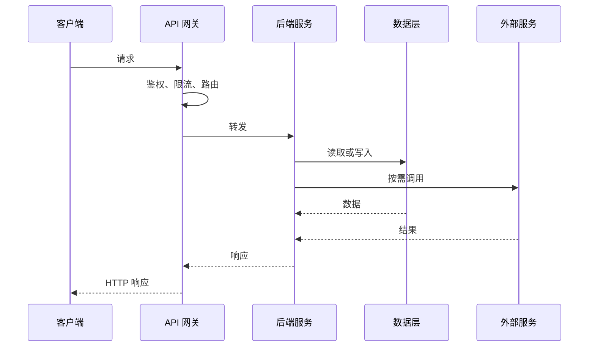
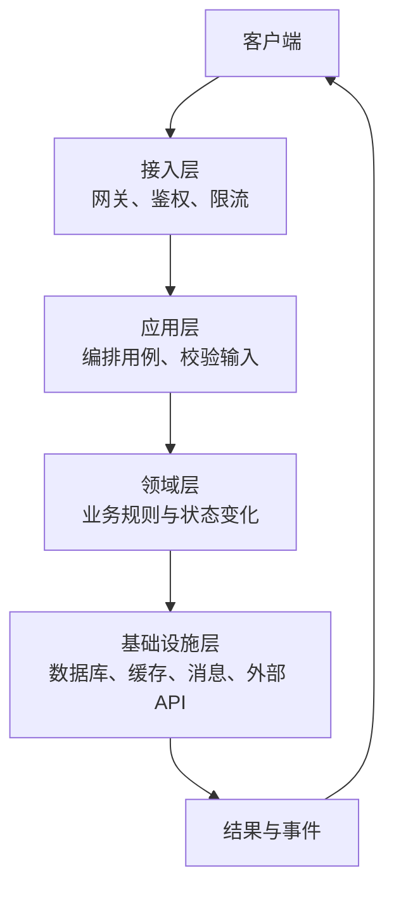
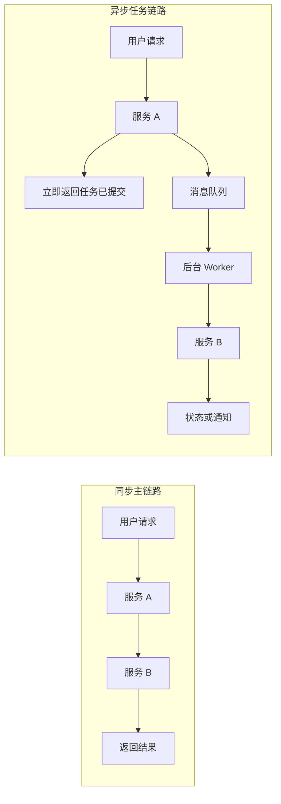

## 后端与服务端术语

后端接收客户端请求，完成身份校验、业务判断、数据读写和外部调用，再把结果返回给客户端。工程师讨论后端时，常把运行一个请求所需的代码、进程、服务和基础设施混在一起说；产品经理需要先分清它们的边界。

### 一次请求如何被处理

每多一个同步依赖，就多一个可能超时或失败的环节。后端架构的核心问题不是服务数量，而是请求边界、数据边界、失败边界和责任边界。

### 术语速查

| 术语 | 含义 | 产品经理要关注 |
| --- | --- | --- |
| **单体架构** | 一个可部署的应用包含多个业务模块 | 部署简单；代码、发布和故障影响面可能互相牵连 |
| **模块化单体** | 仍然一次部署，但模块有清晰边界和依赖规则 | 在不引入分布式复杂度的情况下，为未来拆分保留边界 |
| **微服务** | 按业务能力拆成可独立部署、扩容和治理的服务 | 服务间网络、数据一致性、监控和发布复杂度显著增加 |
| **API 网关** | 面向客户端的统一入口，负责路由、鉴权、限流和协议处理 | 网关是关键可用性节点，故障会影响多个业务入口 |
| **BFF** | Backend for Frontend，按 Web、App 等客户端需求提供适配层 | 降低客户端适配成本，但会增加服务层数量和维护责任 |
| **无状态服务** | 服务实例不保存必须由本实例读取的用户会话 | 任意实例都能处理请求，便于水平扩容和故障转移 |
| **会话 / Session** | 记录一次用户交互所需的身份和状态 | 状态放在实例、缓存还是客户端，会影响扩容与安全 |
| **接口契约** | 请求字段、响应结构、错误码、鉴权和时序等双方约定 | 改字段前要评估老客户端、合作方和下游服务 |
| **同步调用** | 调用方等待被调用方返回后继续 | 用户等待时间受整条调用链限制 |
| **异步调用** | 调用方提交任务后先返回，由后台继续执行 | 提高主链路响应速度，但要设计状态查询、重试和通知 |
| **水平扩容** | 增加服务实例分摊请求 | 依赖无状态、负载均衡和共享状态存储 |
| **垂直扩容** | 提升单台机器的 CPU、内存或网络规格 | 操作直接，但存在单机上限和成本跳档 |
| **限流** | 按用户、租户、接口或全局限制请求速率 | 超限时是排队、报错还是降级，要在产品上定义 |
| **熔断** | 下游连续失败时暂时停止调用，防止故障扩散 | 被熔断的能力要有明确的替代路径和提示 |
| **幂等** | 同一个业务请求重复执行，结果仍符合预期 | 支付、下单、写入和重试都必须明确幂等键和规则 |

### 后端架构怎么分层

常见后端可以分为接入、业务、领域与基础设施几层。不同团队命名不同，边界比名称更重要。

- **接入层**：处理连接、路由、身份、权限、限流和协议转换，不承载具体业务规则。
- **应用层**：把一个用户动作编排成多个步骤，例如创建订单、扣库存、发通知。
- **领域层**：承载业务不变量和状态变化，例如订单不能从已取消变成已支付。
- **基础设施层**：连接数据库、缓存、消息队列和第三方服务，提供技术实现。

产品需求评审时，先问功能跨越哪些层。只改展示字段通常影响前端和接口；改变扣费或权限规则则涉及领域逻辑、数据事务、审计和回滚。

### 单体、模块化单体与微服务

| 方案 | 优势 | 代价 | 适合何时考虑 |
| --- | --- | --- | --- |
| 单体 | 开发、调试、部署简单；本地调用稳定 | 模块耦合；整体发布；故障影响面大 | 业务早期、团队小、边界仍在探索 |
| 模块化单体 | 保留单体部署效率；模块边界清晰 | 需要团队持续遵守依赖规则 | 业务已分域，但独立扩缩容需求不强 |
| 微服务 | 独立发布和扩容；团队可按业务自治 | 网络故障、数据一致性、观测和运维成本 | 团队、流量或发布节奏达到拆分收益点 |

拆成微服务不会自动提升性能。它首先改变的是组织边界和部署边界，之后才可能带来独立扩容、隔离故障和独立发布的收益。拆分前应先确认：哪个模块需要独立扩容、独立发布或独立权限，数据归谁所有，跨服务调用失败如何恢复。

### 接口契约与协议

**接口契约**至少要写清以下内容：

- 请求方法、路径、参数类型、必填规则和默认值。
- 正常响应结构、分页规则、空值表达和错误码。
- 鉴权方式、权限范围、幂等键、超时和重试约束。
- 数据变更的兼容策略，以及废弃旧字段和旧版本的时间表。

**版本化**有三种常见方式：路径版本（`/v1`）、请求头版本和兼容式演进。版本不是越多越好；每个版本都要有维护、监控和下线成本。移动端无法强制所有用户即时升级时，后端尤其需要保持向后兼容。

接口返回成功不等于业务完成。异步任务通常返回任务 ID 或初始状态，客户端再通过轮询、Webhook、SSE 或 WebSocket 获取进度。产品文案要区分「已提交」「处理中」「已完成」和「失败」。

### 同步、异步与可靠性

适合异步化的操作通常不需要在当前页面立刻拿到最终结果，例如发送通知、生成报表、批量导入和长时间模型任务。异步化后必须补齐：

- 任务状态和进度查询。
- 超时、取消、重试和死信处理。
- 重复执行的幂等规则。
- 用户离开页面后的通知方式。
- 最终失败时的人工处理或重新提交入口。

### 扩容与故障隔离

- **负载均衡**：把请求分配给多个服务实例；需要健康检查和连接排空，发布时不能把正在处理的请求直接切断。
- **无状态化**：会话和任务状态放入共享存储，实例只负责处理请求；否则某个实例下线会让一部分用户丢状态。
- **超时预算**：总请求超时要分配给网关、服务、数据库和外部依赖，不能每层都设置一个完整的超时时间。
- **重试退避**：只对可安全重试的失败重试，并逐步拉长间隔；写操作要先确认幂等，否则重试可能造成重复扣款或重复任务。
- **降级**：非核心能力失败时返回缓存、默认值、稍后处理或人工入口；降级结果必须让用户知道状态，而不是伪装成功。
- **隔离**：为不同租户、任务类型或下游依赖设置资源边界，避免单个热点请求拖垮所有用户。

### 常见黑话与真实含义

| 黑话 | 需要继续追问 |
| --- | --- |
| 服务要拆微服务 | 哪个独立扩容、发布或隔离的需求已经存在？拆分后的数据归谁？ |
| 后端改动很小 | 是否改变接口字段、权限、数据模型、缓存键或异步任务？老客户端是否兼容？ |
| 这个接口是同步的 | 用户要等到什么结果？下游超时后页面展示什么？ |
| 做成无状态就能扩容 | 会话、上传、任务进度和幂等状态放在哪里？共享存储是否成为新瓶颈？ |
| 加个重试就好了 | 哪些错误可重试？最多几次？写操作如何保证幂等？ |
| 服务已经降级 | 降级返回什么？用户是否知道结果不完整？恢复后是否补偿？ |
| 上网关统一处理 | 网关的鉴权、限流、路由和高可用边界是否明确？业务规则有没有被塞进去？ |
| 接口兼容 | 兼容哪些版本、哪些客户端和哪些字段？何时停止支持旧版本？ |

### 给产品经理的检查清单

- 画出主链路和异步链路，标记每个同步依赖。
- 确认每个接口的成功定义、失败状态和重试规则。
- 确认权限、会话、幂等键和审计记录的归属。
- 询问单体或微服务选择解决的具体问题，不用服务数量衡量先进程度。
- 为核心接口定义延迟、成功率、并发和容量指标。
- 为发布、扩容、下游故障和数据补偿准备可逆方案。

### 相关页面

- [工程架构术语](architecture-terminology.md)：工程组件术语类总览与阅读顺序
- [系统架构基础](architecture.md)：跨组件请求链路与系统级取舍
- [数据库与数据存储术语](databases.md)：服务端的数据模型、事务与存储选择
- [消息队列与异步系统](message-queues.md)：异步任务、重试和消费可靠性

### 来源说明

本文为后端工程通识整理，具体协议和实现以官方文档为准（访问日期 2026-08-30）：

- [MDN：HTTP overview](https://developer.mozilla.org/en-US/docs/Web/HTTP/Overview)
- [OpenAPI Specification](https://spec.openapis.org/oas/latest.html)
- [Kubernetes：Services](https://kubernetes.io/docs/concepts/services-networking/service/)
- [Martin Fowler：MonolithFirst](https://martinfowler.com/bliki/MonolithFirst.html)
