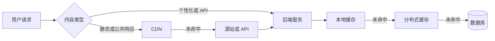
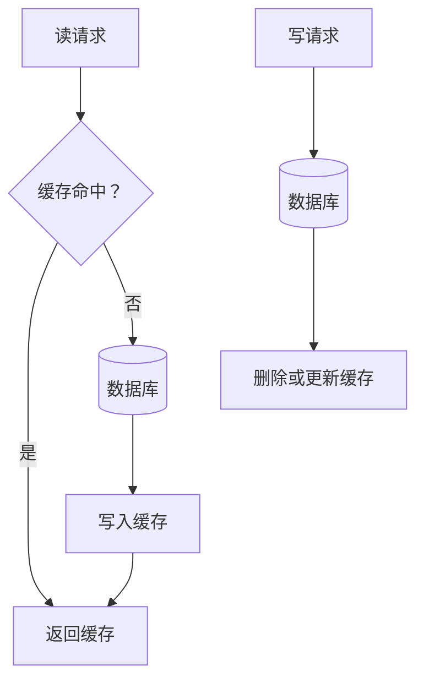

## 缓存技术与黑话

缓存把可能重复读取的数据放在更近、更快的存储中，减少数据库和源站压力。它换来的不是「免费提速」，而是额外的数据副本、失效规则和一致性责任。缓存适合加速可重建、可接受短暂旧数据或读取明显多于写入的数据。

### 缓存位于请求链路的哪里

CDN 多缓存静态资源和可共享的公共响应；带身份、权限或订单信息的 API 通常不经 CDN 共享缓存，而走服务端的本地缓存或分布式缓存。缓存层越靠近用户，读取通常越快，但数据越可能旧。不同层的生命周期、容量、失效能力和共享范围不同，不能只用一个「缓存」概念描述全部行为。

### 术语速查

| 术语 | 含义 | 产品经理要关注 |
| --- | --- | --- |
| **CDN** | Content Delivery Network，内容分发网络，把静态资源或可缓存响应分发到边缘节点 | 降低跨地域访问延迟；缓存更新和错误内容清除要有策略 |
| **本地缓存** | 进程或浏览器内部的缓存，读取最快但通常不跨实例共享 | 多实例之间可能不一致，进程重启后内容丢失 |
| **分布式缓存** | 多个服务实例共享的缓存，常见实现是 Redis | 共享容量、网络延迟、高可用和缓存热点需要治理 |
| **TTL** | Time To Live，缓存条目的过期时间 | TTL 越长命中率可能越高，但旧数据窗口也越长 |
| **缓存命中** | 请求在缓存中找到可用数据 | 命中率要按接口、用户和时间段观察，平均值可能掩盖热点问题 |
| **缓存未命中** | 缓存没有可用数据，请求回源读取 | 未命中高峰可能把压力转移到数据库 |
| **Cache-Aside / 缓存旁路** | 应用先查缓存，未命中后查数据库，再把结果写入缓存；缓存作为数据库旁边的加速层 | 逻辑直观，但要处理并发回源、失效和脏数据 |
| **Write-Through** | 写入先经过缓存，由缓存同步写入后端存储 | 读取一致性较好，但链路和实现复杂度更高 |
| **缓存失效** | 通过删除、过期或版本变更让缓存不再使用 | 失效时机错误会读到旧数据或造成回源洪峰 |
| **缓存穿透** | 大量查询不存在的数据，每次都绕过缓存打到数据库 | 需要空值缓存、参数校验或布隆过滤器等保护 |
| **缓存击穿** | 单个热点 key 过期瞬间，大量请求同时回源 | 需要互斥回源、逻辑过期或提前刷新 |
| **缓存雪崩** | 大量 key 同时失效或缓存整体不可用，后端被集中冲击 | TTL 加随机抖动、分批失效和降级都要提前设计 |
| **缓存污染** | 低价值或异常数据占满缓存，挤出高价值数据 | 需要容量上限、淘汰策略和 key 价值判断 |
| **热点 key** | 访问量远高于其他 key 的数据 | 单 key 可能成为并发、网络或单节点瓶颈 |

### 三种常见缓存层

#### 浏览器与 CDN 缓存

浏览器缓存减少用户重复下载，CDN 缓存减少请求回到源站。静态资源通常适合使用带内容哈希的文件名和较长缓存时间；HTML 或个性化响应则需要更谨慎的缓存控制。

- **静态资源**：CSS、JavaScript、图片和字体可通过版本化文件名安全延长 TTL。
- **公共内容**：公开文章、帮助页和商品基础信息可以在 CDN 缓存，但必须定义发布后的刷新机制。
- **个性化内容**：包含身份、权限、地址或订单信息的响应不能因追求命中率而被其他用户共享。
- **缓存控制**：`Cache-Control`、`ETag` 和 `Last-Modified` 等机制决定浏览器和 CDN 如何复用响应。

#### 本地缓存

本地缓存位于服务进程或客户端内存中，读取快、网络成本低，但每个实例有自己的副本。服务滚动发布、扩容和重启后，本地缓存内容可能不同。

本地缓存适合短 TTL、低价值、读取极高频且允许实例间短暂差异的数据。账户权限、库存和余额等数据不能只放在本地缓存里当作最终事实。

#### 分布式缓存

Redis 等分布式缓存可以让多个实例共享热点数据、会话、计数和限流状态。它仍然是网络依赖，不应默认等同于数据库：缓存数据通常要能够重建，缓存不可用时要有回源或降级方案。

### 缓存旁路的读写路径

Cache-Aside 常见的写路径是先写数据库，再删除缓存。这样做的目标是让下一次读取重新加载数据；但并发读写时仍可能出现旧数据回填，需要版本号、延迟双删、消息通知或其他更严格的策略。具体策略取决于业务能接受多长的旧数据窗口。

### 失效、一致性与容量

缓存设计至少要确定以下规则：

- **Key 设计**：key 包含租户、用户、语言和版本等必要维度，避免不同权限的数据互相命中。
- **TTL**：根据业务更新频率和旧数据容忍度设定，不要所有 key 使用同一个过期时间。
- **失效方式**：写后删除、写后更新、版本切换、定时刷新或事件驱动，各自有失败路径。
- **淘汰策略**：内存满时淘汰哪些数据，是否保护热点数据，是否允许缓存回源。
- **容量预算**：容量、网络流量、复制、备份和高可用都会产生成本。
- **一致性口径**：明确「最终一致」允许延迟多久，哪些字段必须读主库或绕过缓存。

命中率高不等于体验一定好：如果缓存里存的是错误或过期内容，命中率越高，错误传播越稳定。监控应同时看命中率、回源率、缓存延迟、key 热点、过期数量和业务正确性。

### 缓存故障与保护手段

| 故障 | 触发方式 | 常见保护 |
| --- | --- | --- |
| 穿透 | 查询不存在的 key 持续回源 | 参数校验、空值缓存、布隆过滤器、限流 |
| 击穿 | 热点 key 同时过期 | 互斥锁、单飞请求、逻辑过期、提前刷新 |
| 雪崩 | 大量 key 同时过期或缓存集群故障 | TTL 抖动、分批预热、集群高可用、回源限流、降级 |
| 热点 | 单个 key 承受极高并发 | 热点拆分、请求合并、本地缓存、读副本 |
| 污染 | 低价值数据占满容量 | key 访问监控、大小限制、淘汰策略、写入门槛 |
| 脏读 | 缓存未及时删除或更新 | 缩短 TTL、事件失效、版本校验、关键读绕过缓存 |

保护措施必须考虑失败本身：缓存锁失效会怎样，回源被限流后用户看到什么，缓存集群恢复后是否需要预热，不能只在架构图上写「降级」。

### 常见黑话与真实含义

| 黑话 | 需要继续追问 |
| --- | --- |
| 加缓存就快了 | 哪个读取是热点？命中率目标是什么？缓存 miss 时数据库扛得住吗？ |
| 缓存和数据库双写 | 谁先写？其中一步失败怎么办？重复写和并发写如何处理？ |
| 这数据可以缓存 | 允许旧多久？是否包含用户权限、隐私或实时库存？ |
| TTL 设长一点 | 内容更新后多久必须可见？是否有主动失效和版本切换？ |
| Redis 挂了有降级 | 回源容量、限流、默认值和用户提示是否真的准备过？ |
| 命中率已经很高 | 是否存在热点 key、脏数据、高延迟或业务错误被掩盖？ |
| CDN 缓存一下就行 | 缓存的是公共内容还是个性化响应？发布、回滚和错误清除怎么做？ |
| 先删缓存再写库 | 并发读会不会把旧数据重新写回缓存？异常时最终状态谁负责校验？ |

### 给产品经理的检查清单

- 为每个缓存数据写出事实来源、允许旧数据时长和失效触发条件。
- 区分浏览器、CDN、本地缓存和分布式缓存的共享范围。
- 评估缓存不可用、回源洪峰、热点 key 和数据污染的降级路径。
- 对含身份、权限、余额、库存的数据检查缓存隔离和误共享风险。
- 监控命中率之外，补充回源率、延迟、容量、热点和业务正确性。
- 对关键数据安排缓存清理、预热、恢复和回滚演练。

### 相关页面

- [工程架构术语](architecture-terminology.md)：工程组件术语类总览与阅读顺序
- [系统架构基础](architecture.md)：缓存、数据库和消息队列的整体请求链路
- [数据库与数据存储术语](databases.md)：缓存背后的事实存储与一致性
- [前端渲染技术与黑话](frontend-rendering.md)：浏览器和 CDN 对首屏资源的影响
- [消息队列与异步系统](message-queues.md)：用事件驱动缓存失效和异步刷新
- [可观测性](observability.md)：命中率、回源和脏数据要落到可监控信号

### 来源说明

本文为缓存工程通识整理，具体指令、语义和限制以官方文档为准（访问日期 2026-08-30）：

- [MDN：HTTP caching](https://developer.mozilla.org/en-US/docs/Web/HTTP/Guides/Caching)
- [Redis：Key eviction](https://redis.io/docs/latest/develop/reference/eviction/)
- [Redis：Caching patterns](https://redis.io/docs/latest/develop/use/patterns/)
- [Cloudflare：What is a CDN?](https://www.cloudflare.com/learning/cdn/what-is-a-cdn/)
