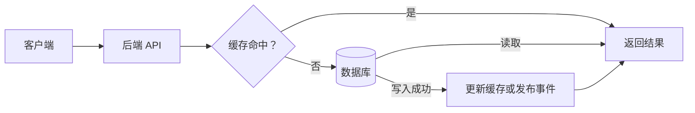
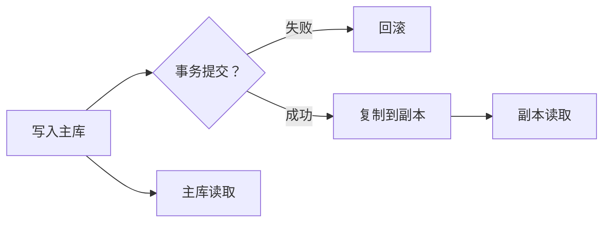

## 数据库与数据存储术语

数据库保存产品运行中的业务事实：账户余额、订单状态、用户资料、内容和行为记录都需要明确的存储归属。数据库选型不是「哪种数据库更先进」，而是数据结构、访问方式、一致性、容量增长和团队能力之间的取舍。

### 一条数据如何被读写

数据库通常是事实来源，缓存只是加速层。产品评审里出现「先写缓存」「从缓存读余额」等方案时，要先确认数据丢失、一致性和恢复责任，而不是只比较响应时间。

### 术语速查

| 术语 | 含义 | 产品经理要关注 |
| --- | --- | --- |
| **关系型数据库** | 以表、行、列和关系组织结构化数据，通常通过 SQL 访问 | 结构清晰、事务能力成熟；Schema 变更和复杂查询要评估成本 |
| **NoSQL** | 非关系型数据库的统称，包含文档、键值、列式、图和向量等模型 | 先按访问模式选型，不代表不需要结构、不支持事务或一定更快 |
| **向量数据库** | 存储 embedding 并提供近邻检索的数据库 | 服务语义召回；原文、权限和删除策略仍要有事实来源 |
| **Schema** | 数据字段、类型、关系、约束和版本的结构定义 | 加字段、改类型和迁移老数据都可能影响线上服务 |
| **主键** | 唯一标识一条记录的字段或字段组合 | 关系、幂等和数据迁移都依赖稳定且唯一的标识 |
| **索引** | 为查询建立的辅助数据结构 | 加速读取，也增加写入、存储和维护成本 |
| **事务** | 一组操作作为整体提交或回滚 | 订单、余额和库存等跨步骤操作要明确一致性边界 |
| **ACID** | 原子性、一致性、隔离性、持久性四类事务特征 | 不同数据库和配置的保证范围不同，不能只看名称 |
| **复制 / 主从** | 将数据从一个节点同步到一个或多个副本 | 提高读取能力和容灾能力，但可能产生复制延迟 |
| **读写分离** | 写请求进入主库，读请求分发到副本 | 刚写入的数据可能暂时读不到，产品要处理读旧数据 |
| **分区 / 分片** | 按键、范围或其他规则拆分数据和请求 | 降低单节点压力，但跨分区查询、扩容和迁移更复杂 |
| **迁移** | 改变数据库结构、位置、版本或数据归属的过程 | 要安排双写、回填、校验、切换和回滚，不能只改一条建表语句 |
| **备份与恢复** | 保存可恢复副本，并在故障时还原数据 | 关键指标是 RPO（最多丢多少数据）和 RTO（多久恢复） |
| **软删除** | 用状态字段标记删除，而不是立即物理删除 | 便于恢复和审计，但会增加查询过滤、存储和隐私清理责任 |

### 关系型数据库与 NoSQL

#### 关系型数据库

MySQL、PostgreSQL 等关系型数据库适合订单、账户、权限、库存等结构明确且需要事务的数据。它们擅长关联查询、约束和一致性控制，但 Schema 设计与变更需要经过评估。

- **表与关系**：把实体拆成表，通过主键和外键或应用逻辑建立关系。
- **约束**：用唯一、非空、检查等规则阻止明显的脏数据。
- **事务**：把必须一起成功的写操作放在一个一致性边界中。
- **索引**：围绕真实查询建立，不是给每个字段都加索引。

#### 文档、键值、搜索与分析存储

- **文档数据库**：以 JSON 类文档存储，适合结构变化较多、按文档整体读取的场景；复杂关联和强事务不一定适合。
- **键值数据库**：按 key 读写 value，适合会话、计数、热点状态和简单查找；Redis 也经常作为缓存使用。
- **搜索引擎**：通过倒排索引处理全文搜索、分词和相关性排序；搜索索引通常不是业务事实的唯一来源。
- **向量数据库**：存储 embedding 并做近邻检索，服务语义召回、推荐和 RAG；向量库保存的是可重建的检索副本，原文、权限和业务状态仍应有独立事实来源。
- **图数据库**：以节点和边存储关系，适合深度关联查询；高频事务和任意字段检索不一定适合。
- **列式或分析存储**：面向大规模聚合和报表扫描，适合分析查询；不一定适合高频在线事务。

「NoSQL」不是单一技术。选型前先写清数据如何写入、按什么条件读取、是否需要关联、允许多旧、需要什么事务，以及数据量和并发怎样增长。向量检索的分块、元数据、混合检索与评测见 [RAG 基础](../ai/rag.md) 与 [RAG 检索进阶](../ai/rag-retrieval.md)。

### Schema 与数据模型

数据模型至少要回答四个问题：

1. **谁拥有事实？** 订单状态由订单服务和订单库负责，支付渠道的回执是外部事实，不能让多个系统随意覆盖。
2. **如何唯一标识？** 用户、订单、任务和事件都需要稳定 ID，避免用可能变化的昵称或展示文本作为关联键。
3. **如何表达状态？** 用明确的状态机约束可执行的状态转移，不要让任意字符串决定业务流程。
4. **如何演进？** 新增字段通常比改字段安全；删除字段前先确认所有客户端、任务和报表不再读取。

数据库迁移常见的安全路径是：先加兼容字段，再发布能同时读旧字段和新字段的代码，回填并校验数据，切换读取路径，最后清理旧字段。大表迁移还要考虑锁表、流量、回滚和线上写入。

### 事务、一致性与复制

主库提交成功与副本可读之间可能存在时间差。读写分离提高了读取能力，但会引入「刚写成功，下一次读取仍是旧数据」的体验。需要强一致的读取可以暂时读主库，或在请求中携带版本、时间点和会话粘滞信息。

跨多个数据库或服务的事务很难保持简单。更常见的做法是明确一个主事实，再通过事件、补偿和对账最终同步其他系统。对产品经理而言，「最终一致」必须翻译成可接受的时间窗口、异常提示和人工处理机制。

### 查询性能与容量

- **索引设计**：围绕高频过滤、排序和关联条件建立；索引过多会拖慢写入和占用存储。
- **分页**：大数据集优先考虑基于游标或稳定排序的分页，避免深页码扫描大量无用数据。
- **慢查询**：监控查询耗时、扫描行数、锁等待和错误率，不只看数据库 CPU。
- **连接池**：限制应用同时打开的数据库连接，避免服务扩容后把数据库连接数耗尽。
- **读写分离**：适合读多写少但能接受短暂旧数据的场景；强一致读取要有明确路由。
- **分区或分片**：只有单节点容量、吞吐或故障域确实成为瓶颈时再引入，提前拆分会增加查询和运维复杂度。

容量规划要同时看数据量、增长速度、峰值读写、索引膨胀、备份窗口和恢复速度。数据库「还有多少磁盘」不是完整的容量指标。

### 备份、恢复与数据生命周期

备份方案要通过恢复演练验证，而不是只检查备份任务是否显示成功：

- **RPO**：故障后最多允许丢失多长时间的数据。
- **RTO**：从故障发生到服务恢复需要多长时间。
- **恢复验证**：定期在隔离环境恢复，核对数据完整性和应用可用性。
- **多副本不等于备份**：实时复制可能把误删或错误写入同步到所有副本。
- **生命周期**：热数据、冷数据、归档数据和删除数据分别保存多久，是否满足审计与隐私要求。

### 常见黑话与真实含义

| 黑话 | 需要继续追问 |
| --- | --- |
| 数据库扛不住了 | 是 CPU、磁盘、连接、锁、慢查询、容量还是副本延迟先到瓶颈？ |
| 加个索引就行 | 查询条件和排序是否稳定？写入成本、索引大小和命中情况测过吗？ |
| 上 NoSQL 更灵活 | 访问模式是什么？是否需要事务、关联查询、唯一约束和复杂分析？ |
| 上向量库就能语义搜索 | 原文存在哪？权限和删除如何同步？关键词路是否还要保留？召回谁来评测？ |
| 读写分离能提速 | 哪些读取允许旧数据？刚写入后的读取如何保证用户看到自己的修改？ |
| 这次只是改字段 | 老版本服务、任务、报表和缓存是否仍读取旧字段？迁移失败怎么回滚？ |
| 有主从就不怕丢数据 | 副本延迟、误删同步、备份恢复和跨地域容灾分别怎么处理？ |
| 最终一致很快就好 | 「很快」的上限是多少？期间用户看到什么，超时后谁来补偿和对账？ |
| 数据删了就没了 | 是软删除还是物理删除？备份、搜索索引、缓存和第三方副本是否也清理？ |

### 给产品经理的检查清单

- 为每类核心数据指定唯一事实来源和负责人。
- 区分在线事务、搜索、向量检索、缓存和分析用途，不让一个存储承担所有场景。
- 明确数据新鲜度、一致性、恢复时间和可接受丢失范围。
- 在需求中写清数据量、增长率、峰值读写和查询方式。
- 评估 Schema 变更、迁移、回填、校验和回滚路径。
- 要求备份恢复演练、审计记录和数据删除策略可验证。

### 相关页面

- [工程架构术语](architecture-terminology.md)：工程组件术语类总览与阅读顺序
- [系统架构基础](architecture.md)：数据库、缓存和消息队列在整体请求链路中的位置
- [后端与服务端术语](backend-services.md)：服务如何读写数据库并维护业务规则
- [缓存技术与黑话](caching.md)：数据库前的加速层与一致性风险
- [RAG 基础](../ai/rag.md)：知识库、引用与数据更新
- [RAG 检索进阶](../ai/rag-retrieval.md)：向量检索、混合检索与融合

### 来源说明

本文为数据库与数据存储通识整理，具体能力与限制以官方文档为准（访问日期 2026-09-04）：

- [MySQL：InnoDB Storage Engine](https://dev.mysql.com/doc/refman/8.4/en/innodb-storage-engine.html)
- [PostgreSQL：Documentation](https://www.postgresql.org/docs/current/)
- [MongoDB：Data Modeling](https://www.mongodb.com/docs/manual/data-modeling/)
- [Redis：Documentation](https://redis.io/docs/latest/)
- [Elasticsearch：Index basics](https://www.elastic.co/docs/manage-data/data-store/index-basics)
