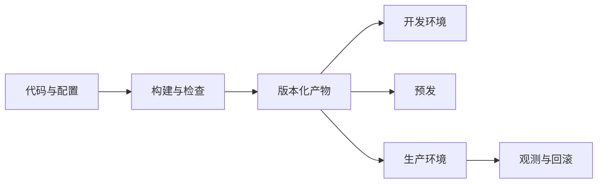

## 部署与环境

部署把通过验证的构建产物放到用户会打到的环境，并保证出问题能退回。它决定谁在什么时候看到新版本，也决定配置错误、环境漂移和不可逆迁移会以什么形态进入产品。

灰度、功能开关与回滚决策见 [开发流程与节奏](dev-flow.md)；本页补环境和放量机制。

### 产物如何进入线上

同一构建产物按环境逐级发布。环境之间应只换配置、密钥和数据连接，不在生产现场再改一份「特供代码」。

### 术语速查

| 术语 | 含义 | 产品经理要关注 |
| --- | --- | --- |
| **环境** | 开发、测试、预发、生产等隔离的运行场所 | 数据、密钥和外部依赖不能串；预发要接近生产行为 |
| **构建产物** | 一次构建得到的可部署包、镜像或静态资源 | 发布记录要能追溯到这一份产物，而不是「某个人机器上的版本」 |
| **配置与密钥** | 随环境变化的参数、开关和凭据 | 配错库、配错模型供应商会直接造成事故；密钥不能进仓库 |
| **容器** | 把应用与依赖打成可重复运行的单元 | 降低「在我机器上能跑」；镜像大小、启动时间和权限仍影响发布 |
| **编排** | 按期望副本数运行、重启和替换容器，常见实现是 Kubernetes | 滚动发布、健康检查和资源配额由此执行，故障表现会变成调度和探针问题 |
| **滚动发布** | 逐批替换实例，新旧版本短暂共存 | 接口必须双向兼容；否则一部分用户打到新版本、一部分打到旧版本 |
| **蓝绿发布** | 准备一套完整的新环境（绿），切换流量后再弃用旧环境（蓝） | 回切快，但要双倍资源和数据同步方案 |
| **金丝雀 / 灰度** | 先把少量流量打到新版本，验证后再放量 | 和产品灰度策略是同一件事的工程实现；分桶、指标和回滚要事先写清 |
| **不可变基础设施** | 不登录机器现场改，而是用新产物替换旧实例 | 减少 drift；热修复也要走同一条发布链 |
| **基础设施即代码** | 用版本化文件描述环境、网络和配额 | 环境变更可评审、可回放；「临时加一台机器」会破坏可追溯性 |

### 环境隔离

至少要分清三类环境：

- **开发 / 测试**：可以用脱敏或合成数据，允许频繁失败。
- **预发**：配置、依赖版本和流量形态接近生产，用来做发布前验证；不能默认等于生产。
- **生产**：真实用户与真实数据；变更要有授权、观测和回滚。

环境差异会变成产品 bug：预发没有真实模型配额、没有真实支付回调、没有真实 CDN 缓存规则，通过预发不等于生产安全。上线清单要写清：哪些验证必须在生产灰度里做。

### 放量策略怎么选

| 策略 | 适合 | 代价 |
| --- | --- | --- |
| 滚动 | 实例多、需要持续服务 | 新旧共存；兼容性要求高 |
| 蓝绿 | 需要快速整环境回切 | 资源成本高；有状态数据要同步 |
| 金丝雀 / 灰度 | 风险不确定、要看真实指标 | 要有分桶、监控和自动或人工止损 |
| 功能开关 | 代码已上线、能力按用户打开 | 开关组合爆炸；长期开关会变成隐藏技术债 |

AI 功能常把「模型版本、提示词、检索配置」与「服务代码」分开放量。服务滚动成功，不代表模型灰度成功；两套开关、两套回滚。

### 容器与编排对产品的影响

容器让同一份产物在预发和生产按同一方式启动。编排负责副本数、健康检查、自动拉起和滚动替换。产品经理不需要会写编排文件，但要问：

- 新版本启动要多久？启动期内用户会不会打到未就绪实例。
- 健康检查看的是进程存活，还是关键依赖（数据库、模型 API）可用。
- 扩容是加副本还是加配额；模型调用和数据库连接会不会先被打满。
- 回滚是重新发布上一份产物，还是只关功能开关。

### 常见黑话与真实含义

| 黑话 | 需要继续追问 |
| --- | --- |
| 已经发到生产了 | 全量还是灰度？打到的是哪一份产物？配置和代码是否一起变？ |
| 预发过了就能上 | 预发与生产的数据、配额、回调和缓存规则差在哪？ |
| 用容器就稳定 | 镜像、资源配额、探针和依赖超时分别怎么设？ |
| 滚动发布无感 | 新旧版本接口、数据格式和缓存键是否兼容？ |
| 蓝绿可以秒切 | 数据库迁移和第三方回调打到哪一套？切回去会不会写脏数据？ |
| 回滚一下就好 | 回滚的是代码、模型、提示词还是开关？已产生的脏数据怎么处理？ |

### 给产品经理的检查清单

- 为每次发布指定产物版本、环境、放量策略和回滚动作。
- 区分代码发布、配置发布、模型/提示词发布。
- 确认预发与生产的关键差异，以及必须在灰度里验证的项。
- 为滚动共存期定义接口兼容和数据双写/双读规则。
- 把启动时间、健康检查和扩容瓶颈写进非功能需求。
- 发布记录能从线上行为回溯到产物、配置和审批人。

### 相关页面

- [开发流程与节奏](dev-flow.md)：CI/CD、灰度、功能开关与回滚
- [系统架构基础](architecture.md)：请求链路上各组件如何被发布
- [后端与服务端术语](backend-services.md)：无状态、扩容与连接排空
- [可观测性](observability.md)：放量期间看哪些信号
- [AI-Native 研发流程](ai-native-sdlc.md)：agent 产物如何进入同一条发布链

### 来源说明

本文为部署与发布通识整理，具体平台能力以官方文档为准（访问日期 2026-09-04）：

- [Martin Fowler：Blue Green Deployment](https://martinfowler.com/bliki/BlueGreenDeployment.html)
- [Martin Fowler：CanaryRelease](https://martinfowler.com/bliki/CanaryRelease.html)
- [The Twelve-Factor App](https://12factor.net/)
- [Kubernetes：Deployments](https://kubernetes.io/docs/concepts/workloads/controllers/deployment/)
