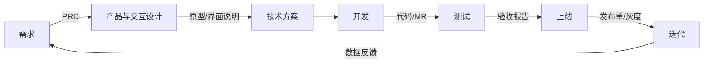
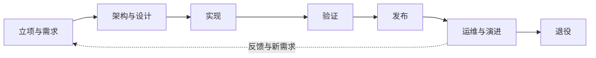
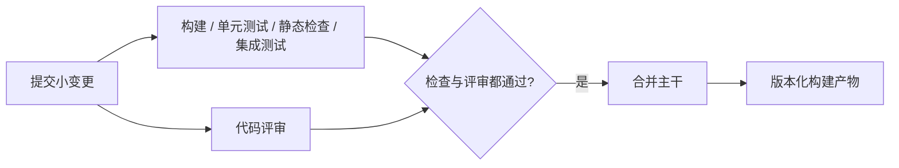
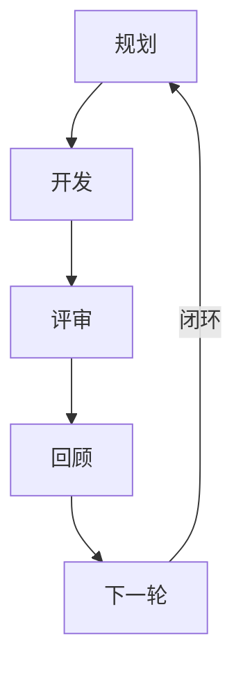
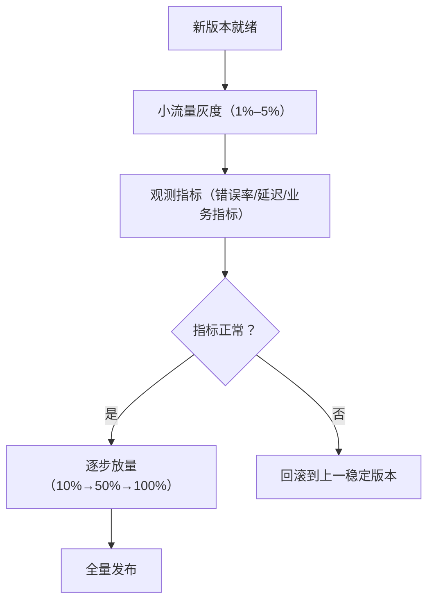
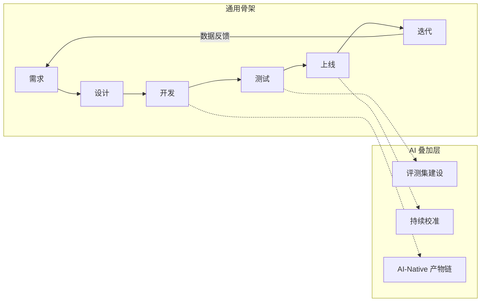

## 开发流程与节奏

工程视角看需求如何变成线上产品、按什么节奏推进：端到端流程、敏捷迭代与灰度回滚。产品侧的需求判断、排期与发布节奏见 [项目管理与迭代](../pm/project-management.md)。

### 端到端流程

六环节主流程：需求 → 设计 → 开发 → 测试 → 上线 → 迭代。设计同时包含产品/交互方案与技术方案；迭代收集数据反馈回到需求，形成闭环。

- **需求**：定义问题、价值与优先级，产出需求文档与 PRD
    - 参与：产品经理、研发、设计、测试
    - 详见 [需求分析](../pm/requirements.md)、[AI 产品 PRD](../pm/prd.md)
- **设计**：先把需求翻译成交互与信息架构，再落到技术方案与接口；评估架构取舍与技术风险
    - 参与：产品经理、设计、研发、架构师
    - 产品与交互产出：原型、界面说明；工程产出：技术方案文档
- **开发**：按方案编码、自测与代码评审，提交代码与 MR
    - 参与：研发
- **测试**：编写测试用例，跑功能、回归与验收测试，产出测试报告与验收结论
    - 参与：测试、研发
- **上线**：走发布单与灰度，小流量验证后逐步放量，产出发布记录
    - 参与：研发、运维、产品经理
- **迭代**：监控线上指标，收集数据反馈，进入下一轮需求
    - 参与：产品经理、研发、数据分析

### 软件生命周期

**软件生命周期（Software Development Life Cycle，SDLC）**描述软件从立项、设计、实现、验证、发布、运维到退役的完整过程。端到端开发流程关注一次需求如何交付，SDLC 关注软件在整个存在周期内如何被构建、运行、维护与替换。一次发布只是生命周期中的一个切片。

各阶段要回答的问题与退出条件不同：

| 阶段 | 核心问题 | 典型产出 | 进入下一阶段的条件 |
| --- | --- | --- | --- |
| 立项与需求 | 为什么做、为谁做、范围多大 | 目标、需求、约束、优先级 | 价值与范围得到确认 |
| 架构与设计 | 怎么做，风险和边界在哪里 | 架构方案、接口、数据与安全设计 | 关键技术风险有验证方案 |
| 实现 | 如何把方案变成可运行的软件 | 代码、配置、单元测试 | 变更通过代码评审与自动检查 |
| 验证 | 软件是否满足需求且没有引入回归 | 测试报告、评测结果、缺陷记录 | 验收标准达标，发布风险可接受 |
| 发布 | 如何安全地交给用户 | 构建产物、发布记录、回滚方案 | 灰度指标与回滚路径已就绪 |
| 运维与演进 | 线上是否稳定，下一步改什么 | 监控、事件记录、版本迭代 | 数据反馈进入下一轮规划 |
| 退役 | 何时停止服务，如何迁移用户与数据 | 下线计划、迁移记录、归档 | 依赖与数据处理完成 |

生命周期模型决定这些阶段如何组织：

- **瀑布模型**：阶段依次完成，适合需求稳定、合规审查重的项目；后期变更成本高。
- **迭代与增量模型**：每轮交付可用增量，持续吸收反馈；互联网产品与 AI 功能通常采用这种方式。
- **螺旋模型**：每轮围绕最大风险做分析、验证与决策，适合技术和安全风险都高的项目。
- **DevOps 生命周期**：把开发、发布、运维连成持续反馈回路，CI/CD 是其中的交付机制，不是另一种生命周期模型。

生命周期不是一次性的阶段清单。维护期发现的缺陷、性能问题或业务变化，会生成新需求；同一软件的每个版本都重复设计、实现、验证与发布，只是变更范围和治理强度不同。

### 持续集成与 CI/CD

**持续集成（Continuous Integration，CI）**：开发者频繁把小批量代码变更合并到共享主干，并由自动化流水线立即构建和验证。CI 的目标是尽早发现集成冲突、构建错误和回归缺陷，把问题留在变更上下文中解决，而不是积累到发布前集中处理。

持续集成最直接的作用是**尽快发现并修复集成问题**：小批量合入共享主干，并自动构建、测试。问题留在变更上下文里解决，而不是堆到发布前集中联调。上线更勤是它可能带来的结果，前提是主干长期可发布；它不负责降低用户访问频率，也不替代用户反馈渠道。

CI 的基本流水线：提交之后，构建、检查与代码评审并行进行；两者都通过才合并主干。

**持续交付（Continuous Delivery）**：每次通过 CI 的变更都自动构建、测试并准备为可发布产物，但生产发布仍由人或发布流程授权。**持续部署（Continuous Deployment）**：在持续交付之上，满足自动化门禁的变更自动部署到生产环境。三者的关系是：CI 解决集成与验证，持续交付解决随时可发布，持续部署解决自动上线。

| 机制 | 自动化边界 | 产品经理需要关心什么 |
| --- | --- | --- |
| CI | 提交后构建与检查，通常到共享主干 | 检查是否快速、稳定，失败是否阻塞合并 |
| 持续交付 | 生成经过验证的可发布产物 | 是否有发布授权、灰度和回滚机制 |
| 持续部署 | 自动将通过门禁的变更部署到生产 | 哪些变更允许自动放行，线上指标如何止损 |

CI 要形成有效反馈，需要满足几个条件：

- **小批量提交**：一次变更只解决一个问题，缩短定位失败原因的范围。
- **主干可用**：主干保持可构建、可测试状态，长期分支不能代替集成。
- **流水线可信**：测试结果可重复；不稳定测试要修复或隔离并限期处理，不能长期重跑掩盖问题。
- **反馈足够快**：快速检查先执行，耗时的集成测试、端到端测试和发布前检查分层执行。
- **产物可追溯**：记录代码版本、依赖、配置与测试结果，同一构建产物在不同环境逐级发布。
- **失败有人负责**：流水线失败优先恢复主干，不把红灯当作背景噪声。

AI 项目的 CI 不能只检查代码能否编译。模型、提示词、检索配置和评测集的改动也应触发相应的回归评测；门禁至少覆盖核心任务通过率、幻觉或拒答率、延迟、成本与安全用例。评测未达标时，流水线应阻止合并或降低发布范围，而不是用一次人工 Demo 代替稳定性证据。

产品经理不需要维护每个流水线脚本，但要在需求和验收标准中明确：哪些检查属于合并门禁，哪些结果允许灰度，生产异常由什么指标触发暂停或回滚。这样，开发节奏才由可验证的增量决定，而不是由临近发布日期的集中联调决定。

### 敏捷与迭代

**敏捷**：以短周期迭代交付可用的产品增量，快速响应需求变化。核心实践：

- **迭代/冲刺（Sprint）**：1–4 周一个固定周期，交付一批可发布的功能
- **看板**：可视化任务流转，限制在制品数量，按价值拉取任务
- **站立会**：每日 15 分钟同步进展与阻塞，不展开解决问题
- **评审**：迭代末向干系人演示成果，确认交付范围与反馈
- **回顾**：复盘迭代过程，提炼改进项，落到下一轮计划

迭代循环：

**与瀑布流程的区别**：

| 维度 | 瀑布 | 敏捷 |
| --- | --- | --- |
| 需求 | 需求冻结，一次定义完整 | 持续细化，随迭代演进 |
| 团队 | 一个阶段一个角色，接力交付 | 全功能团队，端到端负责 |
| 交付 | 一次性整体交付 | 短周期增量交付 |
| 变更 | 变更走严格流程，代价高 | 变更常态化，纳入迭代规划 |

产品侧的双轨迭代、迭代规划与 OKR 见 [项目管理与迭代](../pm/project-management.md)；AI 产品的评测节奏与 CC/CD 循环见 [AI 产品开发生命周期](../pm/ai-lifecycle.md)。

### 灰度发布与回滚

**灰度**：小流量先上，验证再放量，异常可随时中止，把上线风险控制在最小范围。

**常见灰度策略**：

- **按用户 ID 取模**：按用户 ID 哈希取模切分流量，实现简单，用户分桶稳定
- **按地域/渠道**：按地理或渠道切分，适合验证区域差异与渠道特性
- **按用户画像**：按新老用户、付费等级等切分，观察细分人群表现
- **Feature Flag**：代码级功能开关，按需放量与秒级开关，灰度与回滚都无需重新发版

**回滚**：

- **回滚到上一个稳定版本**：出问题切回旧版本，恢复最快，默认手段
- **前向修复**：不切旧版本，直接发布修复版本，适合问题已定位、修复成本低的场景
- **回滚的代价**：灰度期间产生的脏数据、用户已接触新功能的体验断裂、新旧版本兼容问题
- **预防**：小步发布缩小单次变更面，可逆设计（开关、灰度、双写）保证随时可退

产品侧视角：灰度节奏、变更通知与数据口径见 [项目管理与迭代](../pm/project-management.md#发布管理)。环境隔离、滚动/蓝绿与产物治理见 [部署与环境](deployment.md)；灰度期看哪些信号见 [可观测性](observability.md)。

### AI 项目的流程差异

通用流程骨架（需求 → 设计 → 开发 → 测试 → 上线 → 迭代）对传统与 AI 项目都成立；AI 项目在其上叠加三层差异：

- **评测驱动**：没有评测就分不清「模型变好了」还是「运气好」，评测是上线门禁与迭代依据，见 [评估与评测](../ai/evaluation.md)
- **持续校准**：AI 产品上线后继续校准能力范围与代理权，见 [AI 产品开发生命周期](../pm/ai-lifecycle.md) 的 CC/CD 循环
- **研发本身被 AI 重构**：agent 写代码、产物进版本控制、人在关卡评审，研发流程自身也在变，见 [AI-Native 研发流程](./ai-native-sdlc.md)

### 来源说明

- [敏捷软件开发宣言](https://agilemanifesto.org/)：敏捷价值观与原则，访问日期 2026-08-27
- [Scrum Guide](https://scrumguides.org/)：Sprint、评审与回顾的定义，访问日期 2026-08-27
- [Feature Toggles（Martin Fowler）](https://martinfowler.com/articles/feature-toggles.html)：功能开关的分类与实施模式，访问日期 2026-08-27
- [ISO/IEC/IEEE 12207:2017](https://www.iso.org/standard/63712.html)：软件生命周期过程标准，访问日期 2026-09-01
- [Continuous Integration（Martin Fowler）](https://martinfowler.com/articles/continuousIntegration.html)：持续集成的定义与实践原则，访问日期 2026-09-01
- 端到端流程、灰度发布与回滚策略为工程通识，综合自一线工程实践整理
