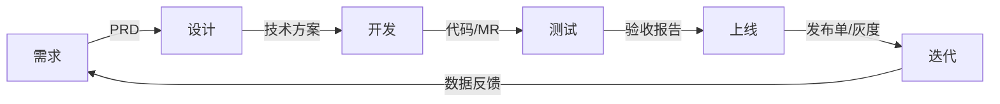
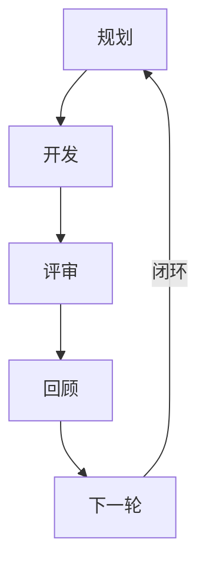
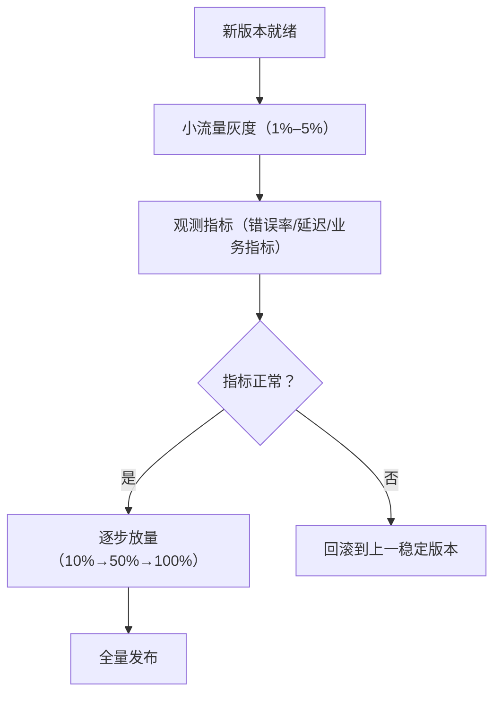

## 开发流程与节奏

工程视角看需求如何变成线上产品、按什么节奏推进：端到端流程、敏捷迭代与灰度回滚。产品侧的需求判断、排期与发布节奏见 [项目管理与迭代](../pm/project-management.md)。

### 端到端流程

六环节主流程：需求 → 设计 → 开发 → 测试 → 上线 → 迭代，迭代收集数据反馈回到需求，形成闭环。

- **需求**：定义问题、价值与优先级，产出需求文档与 PRD
    - 参与：产品经理、研发、设计、测试
    - 详见 [需求分析](../pm/requirements.md)、[AI 产品 PRD](../pm/prd.md)
- **设计**：把需求翻译成技术方案与接口设计，评估架构取舍与技术风险，产出技术方案文档
    - 参与：研发、架构师
- **开发**：按方案编码、自测与代码评审，提交代码与 MR
    - 参与：研发
- **测试**：编写测试用例，跑功能、回归与验收测试，产出测试报告与验收结论
    - 参与：测试、研发
- **上线**：走发布单与灰度，小流量验证后逐步放量，产出发布记录
    - 参与：研发、运维、产品经理
- **迭代**：监控线上指标，收集数据反馈，进入下一轮需求
    - 参与：产品经理、研发、数据分析

### 敏捷与迭代

**敏捷**：以短周期迭代交付可用的产品增量，快速响应需求变化。核心实践：

- **迭代/冲刺（Sprint）**：1–4 周一个固定周期，交付一批可发布的功能
- **看板**：可视化任务流转，限制在制品数量，按价值拉取任务
- **站立会**：每日 15 分钟同步进展与阻塞，不展开解决问题
- **评审**：迭代末向干系人演示成果，确认交付范围与反馈
- **回顾**：复盘迭代过程，提炼改进项，落到下一轮计划

迭代循环：

**与瀑布流程的区别**：

| 维度 | 瀑布 | 敏捷 |
| --- | --- | --- |
| 需求 | 需求冻结，一次定义完整 | 持续细化，随迭代演进 |
| 团队 | 一个阶段一个角色，接力交付 | 全功能团队，端到端负责 |
| 交付 | 一次性整体交付 | 短周期增量交付 |
| 变更 | 变更走严格流程，代价高 | 变更常态化，纳入迭代规划 |

产品侧的双轨迭代、迭代规划与 OKR 见 [项目管理与迭代](../pm/project-management.md)；AI 产品的评测节奏与 CC/CD 循环见 [AI 产品开发生命周期](../pm/ai-lifecycle.md)。

### 灰度发布与回滚

**灰度**：小流量先上，验证再放量，异常可随时中止，把上线风险控制在最小范围。

**常见灰度策略**：

- **按用户 ID 取模**：按用户 ID 哈希取模切分流量，实现简单，用户分桶稳定
- **按地域/渠道**：按地理或渠道切分，适合验证区域差异与渠道特性
- **按用户画像**：按新老用户、付费等级等切分，观察细分人群表现
- **Feature Flag**：代码级功能开关，按需放量与秒级开关，灰度与回滚都无需重新发版

**回滚**：

- **回滚到上一个稳定版本**：出问题切回旧版本，恢复最快，默认手段
- **前向修复**：不切旧版本，直接发布修复版本，适合问题已定位、修复成本低的场景
- **回滚的代价**：灰度期间产生的脏数据、用户已接触新功能的体验断裂、新旧版本兼容问题
- **预防**：小步发布缩小单次变更面，可逆设计（开关、灰度、双写）保证随时可退

产品侧视角：灰度节奏、变更通知与数据口径见 [项目管理与迭代](../pm/project-management.md#发布管理)。

### 来源说明

- [敏捷软件开发宣言](https://agilemanifesto.org/)：敏捷价值观与原则，访问日期 2026-08-27
- [Scrum Guide](https://scrumguides.org/)：Sprint、评审与回顾的定义，访问日期 2026-08-27
- [Feature Toggles（Martin Fowler）](https://martinfowler.com/articles/feature-toggles.html)：功能开关的分类与实施模式，访问日期 2026-08-27
- 端到端流程、灰度发布与回滚策略为工程通识，综合自一线工程实践整理
