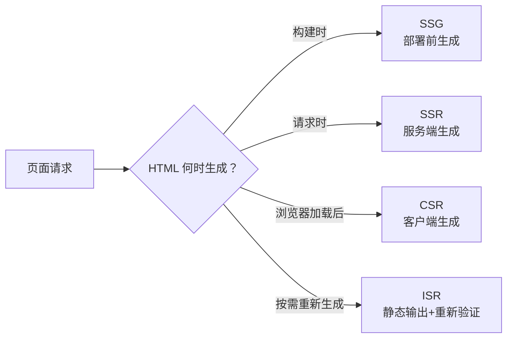
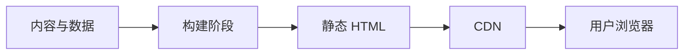
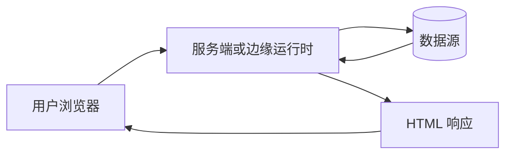
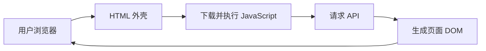

## 前端渲染技术与黑话

页面 HTML 在哪里生成、什么时候生成，决定首屏速度、SEO、数据新鲜度、服务器成本和交互启动方式。**SSG**、**SSR**、**CSR** 不是框架名称，同一站点可以按页面和组件混合使用。

### 先看 HTML 的生成时机

核心区别是：**SSG 在构建时生成，SSR 在请求时生成，CSR 由浏览器加载 JavaScript 后生成，ISR 在静态输出与重新生成之间折中**。

### 术语速查

| 术语 | 全称 | 生成时机 | 典型特点 |
| --- | --- | --- | --- |
| **SSG** | Static Site Generation，静态站点生成 | 构建时 | 预先生成 HTML，部署到 CDN 后访问快；内容更新通常需要重新构建，或配合增量重新生成 |
| **SSR** | Server-Side Rendering，服务端渲染 | 每次请求时，或由服务端缓存后返回 | 服务端根据请求和数据生成 HTML；适合需要 SEO、个性化或较新数据的页面，但需要服务端或边缘运行时 |
| **CSR** | Client-Side Rendering，客户端渲染 | 浏览器加载 JavaScript 后 | 先返回 HTML 外壳，再由浏览器请求数据并生成页面；交互复杂，服务端部署简单，但首屏与 SEO 依赖优化 |
| **SPA** | Single-Page Application，单页应用 | 通常采用 CSR，也可以对首屏使用 SSR 或 SSG | 首次加载一个页面文档，后续路由切换由 JavaScript 完成；它描述应用形态，不等同于某一种渲染方式 |
| **ISR** | Incremental Static Regeneration，增量静态再生成 | 首次静态生成，之后按时间、请求或事件重新生成 | 保留静态页面的分发效率，同时更新部分内容；失效规则、重新生成时机和短暂旧数据需要明确 |
| **Hydration** | 水合 | 浏览器加载 HTML 后 | JavaScript 为服务端或构建时生成的 HTML 绑定事件和状态，使静态内容变成可交互页面 |
| **预渲染** | Pre-rendering | 构建时或请求时 | 统称在浏览器执行前准备好 HTML 的做法，通常包含 SSG 与 SSR |

### 三种渲染的请求链路

#### SSG：构建时生成，访问时分发

构建阶段把页面产物准备好，用户请求通常只经过 CDN。文章、帮助中心、营销落地页、文档和变化不频繁的目录页适合 SSG。页面依赖实时库存、用户身份或权限时，不能只靠 SSG 产出最终内容。

SSG 不代表页面完全没有动态能力。页面仍然可以在浏览器中调用 API；只是首个 HTML 在部署前已经生成。

#### SSR：请求时生成，服务端返回

服务端根据 URL、Cookie、权限和数据源生成 HTML，再返回浏览器。个性化首页、需要搜索引擎读取的动态页面、内容更新频繁的页面可以采用 SSR。

SSR 的首屏表现不只取决于渲染方式。服务端排队、数据查询、模板渲染和网络传输都计入响应时间；数据源慢时，SSR 反而可能让用户等待更久。页面返回后通常还要经过 Hydration，才能响应点击和输入。

#### CSR：浏览器加载后生成

CSR 先返回一个页面外壳，浏览器下载 JavaScript、请求数据，再生成主要内容。后台系统、协作编辑器、复杂数据看板和登录后工作台常使用 CSR。

纯 CSR 页面把首屏内容放到了 JavaScript 执行之后。网络慢、设备性能弱或脚本体积大时，用户可能先看到空白、加载骨架或不完整页面。搜索引擎也可能读不到主要内容，因此内容型页面通常会加入 SSG、SSR 或其他预渲染方案。

### SSR、SSG、CSR 怎么选

| 维度 | SSG | SSR | CSR |
| --- | --- | --- | --- |
| HTML 生成 | 构建时 | 请求时 | 浏览器加载后 |
| 首个 HTML | 通常可直接展示内容 | 通常可直接展示内容 | 通常先拿到外壳 |
| SEO 基础 | 较好 | 较好 | 纯 CSR 需要额外处理 |
| 数据新鲜度 | 取决于构建或重新生成周期 | 可按请求获取较新数据 | 可在浏览器请求最新数据 |
| 页面运行成本 | 构建与 CDN 分发 | 服务端或边缘计算 | 静态资源分发加 API |
| 交互启动 | 常需要 Hydration | 常需要 Hydration | JavaScript 就绪后开始 |
| 常见场景 | 文档、博客、官网 | 个性化页面、动态内容 | 后台、编辑器、复杂工作台 |

这张表只能用于初筛。真实项目常采用混合方案：官网和文档使用 SSG，商品或内容详情页使用 SSG/ISR，个性化模块使用 SSR，复杂交互区域使用 CSR。

### SPA 与三种渲染方式的关系

**SPA** 描述路由和页面切换方式：用户首次加载一个文档，后续导航通常由 JavaScript 接管。**CSR** 描述页面内容主要在哪里生成，两者经常同时出现，但不是同一个概念。

- SPA + CSR：常见于后台和工作台，首次返回应用外壳，路由与内容都在浏览器中处理。
- SPA + SSR：首次请求由服务端输出内容，Hydration 后继续由客户端接管导航和交互。
- SPA + SSG：构建时生成首屏或路由页面，浏览器加载后继续执行客户端路由。
- 多页应用 + SSR/SSG：每次导航获取新的 HTML，不属于 SPA，但仍可以使用 SSR 或 SSG。

### 产品经理要问的五个问题

1. **用户第一次打开页面时，必须看到什么？** 把关键内容放进服务端或构建时生成的 HTML，还是接受脚本加载后的等待？
2. **内容允许多旧？** 明确实时、分钟级、小时级还是发布后更新；SSG、ISR、SSR 的差异本质上包含缓存和失效策略。
3. **页面是否依赖用户身份？** 权限、Cookie、地域和个性化推荐通常要求请求时处理，或把个性化部分拆到客户端请求。
4. **搜索引擎需要读取哪些内容？** SEO 不只看是否使用 SSR，还要检查正文、标题、描述、结构化数据和链接是否出现在可抓取的 HTML 中。
5. **故障时显示什么？** 服务端超时、构建失败、缓存过期、API 不可用和 Hydration 错误都要有降级、监控与回滚方案。

### 常见黑话与真实含义

| 黑话 | 需要继续追问 |
| --- | --- |
| 页面是 SSR | 是所有路由 SSR，还是只有首屏 SSR？后续交互是否由 CSR 接管？ |
| 这是静态站 | 页面 HTML 是否 SSG？动态数据是否仍通过 API 获取？ |
| CSR 对 SEO 不友好 | 哪些页面需要 SEO？是否可以对这些路由使用 SSG、SSR 或预渲染？ |
| SSR 首屏一定快 | 服务端响应、数据查询、缓存命中和 Hydration 各自耗时多少？ |
| 上 ISR 就能实时更新 | 失效触发条件是什么？允许用户看到多久的旧数据？重新生成失败怎么处理？ |
| 做成 SPA 以后体验更好 | 用户是否接受首屏脚本加载？路由切换、浏览器后退、分享链接和无障碍怎么保证？ |
| 前端发版很快 | 静态资源、服务端代码、API 和缓存分别如何发布与回滚？ |

### 给产品经理的架构速记

- **内容优先**：文档、博客、官网等页面优先考虑 SSG 或 ISR。
- **个性化优先**：需要身份、权限和请求上下文的内容考虑 SSR，或拆成静态外壳加 CSR 数据区。
- **交互优先**：复杂编辑、协作和数据操作优先考虑 CSR，但要单独治理首屏、脚本体积和失败状态。
- **混合优先**：一个站点不必全站统一渲染方式，按页面价值、数据时效和交互复杂度选择。

### 相关页面

- [工程架构术语](architecture-terminology.md)：工程组件术语类总览与阅读顺序
- [系统架构基础](architecture.md)：前端接入网关、服务端和数据层的整体请求链路
- [后端与服务端术语](backend-services.md)：前端请求对应的接口、会话和服务端处理

### 来源说明

本文为前端工程通识整理，概念与框架实现以官方文档为准（访问日期 2026-08-30）：

- [MDN：Server-side rendering](https://developer.mozilla.org/en-US/docs/Glossary/SSR)
- [MDN：Client-side rendering](https://developer.mozilla.org/en-US/docs/Glossary/CSR)
- [web.dev：Rendering on the Web](https://web.dev/articles/rendering-on-the-web)
- [Next.js：Rendering](https://nextjs.org/docs/app/building-your-application/rendering)
- [React：hydrateRoot](https://react.dev/reference/react-dom/client/hydrateRoot)
