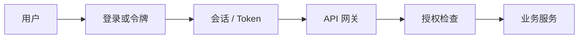

## 身份认证与权限

认证回答「你是谁」，授权回答「你能做什么」。产品功能只要碰到登录、角色、分享、团队空间或代表用户去调外部 API，就会落到这组规则上。规则写不清，研发只能用「先拦着」或「先放开」顶上。

### 请求如何确认身份

网关通常负责确认身份和拒绝明显非法请求；业务服务仍要按资源做授权。把「已登录」当成「可操作任意数据」，是越权的常见来源。

### 术语速查

| 术语 | 含义 | 产品经理要关注 |
| --- | --- | --- |
| **认证 / Authentication** | 验证主体身份 | 登录失败、找回密码、多因素、第三方登录的体验与风险 |
| **授权 / Authorization** | 判断主体对某资源的操作是否允许 | 读、写、管理分别授予谁，要落到具体对象 |
| **会话 / Session** | 登录后持续证明身份的服务端或客户端状态 | 过期、踢下线、多端登录和退出是否真的失效 |
| **JWT** | JSON Web Token，常用于在服务间传递已验证身份 | 过期时间、吊销方式和敏感字段是否被塞进令牌 |
| **Cookie** | 浏览器保存并随请求带上的凭证 | 作用域、安全属性和 CSRF；分享链接不要依赖「刚好带着登录态」 |
| **OAuth / OIDC** | 授权第三方代表用户或应用访问资源；OIDC 在其上提供身份层 | 授权范围、取消授权、账号绑定和供应商不可用时的降级 |
| **RBAC** | 基于角色的访问控制 | 角色数量、角色叠加和「临时开权限」的回收 |
| **ABAC / 策略** | 按属性或策略判断，如租户、数据标签、时间 | 适合复杂组织，但规则要可解释、可测试 |
| **最小权限** | 只授予完成任务所需的权限 | Agent 工具、开放 API 和内部后台尤其需要 |
| **服务身份** | 非人类主体，如 Worker、agent、CI | 每个自动化身份单独授权，不借用某个人的账号 |

### 产品里必须写清的规则

权限要按**主体、动作、资源**写成句子，例如：「团队管理员可以移除成员，但不能导出其他团队的对话」。

常见要在 PRD 里写死的点：

- 未登录、登录过期、权限不足分别展示什么，接口返回哪类错误。
- 资源是用户级、团队级还是租户级；默认可见范围是什么。
- 分享链接、公开页面和搜索索引会不会绕过原来的权限。
- 员工后台、客服工具和数据导出的权限与审计。
- Agent 或工具调用代表谁：用户、系统还是某个集成账号；不可逆动作要不要二次确认。

身份与外部供应商的集成、凭据泄露和回调验签见 [第三方服务与外部依赖](third-party-services.md)。

### 登录与第三方身份

- **自建账号**：注册、验证码、找回密码、风控和注销。
- **第三方登录**：授权范围最小化；解绑后本地会话要失效；供应商故障时的文案和备用登录。
- **企业身份 / SSO**：入职开通、离职关闭、角色从目录同步还是产品内配置。
- **多端与多会话**：新设备登录是否通知；被盗后如何全端退出。

「登录成功」只完成认证。进入团队空间、打开他人文档、调用付费模型，都要再做授权。

### 常见黑话与真实含义

| 黑话 | 需要继续追问 |
| --- | --- |
| 做一下登录就行 | 会话多久过期？多端怎么处理？退出是否吊销令牌？ |
| 用 JWT 无状态 | 如何踢人、改密后失效、处理泄露？令牌里有没有隐私字段？ |
| 接个 OAuth | 范围是什么？用户如何取消授权？账号冲突怎么绑？ |
| 管理员什么都能干 | 是否分角色？高危操作有没有审计和第二人审批？ |
| Agent 用用户的 key 调工具 | 权限是否随用户；密钥如何轮换；越权调用谁负责？ |
| 权限在网关统一校验 | 资源级规则（这条数据属于谁）是否仍在业务服务里执行？ |

### 给产品经理的检查清单

- 为每个核心对象写出谁在何种条件下可读、可写、可分享、可删除。
- 区分认证失败和授权失败的界面与错误码。
- 为第三方登录、SSO 和 API Key 写明范围、吊销和故障降级。
- 为后台、导出、计费和 Agent 工具单独做最小权限。
- 要求权限变更可审计，离职与解绑能关闭访问。
- 把越权、水平越权和分享链接绕过列入测试与评测用例。

### 相关页面

- [工程架构术语](architecture-terminology.md)：工程组件术语类总览与阅读顺序
- [系统架构基础](architecture.md)：网关鉴权在请求链路中的位置
- [后端与服务端术语](backend-services.md)：网关、会话与接口契约
- [第三方服务与外部依赖](third-party-services.md)：OAuth、Webhook 与凭据
- [Agent 工具](../ai/agent-tools.md)：工具权限、协议与执行边界
- [AI 安全与对齐](../ai/ai-safety.md)：越权与数据泄漏的产品护栏

### 来源说明

本文为身份与访问控制通识整理，具体协议和实现以官方文档为准（访问日期 2026-09-04）：

- [RFC 6749：OAuth 2.0](https://www.rfc-editor.org/rfc/rfc6749)
- [OpenID Connect](https://openid.net/specs/openid-connect-core-1_0.html)
- [OWASP：Authentication Cheat Sheet](https://cheatsheetseries.owasp.org/cheatsheets/Authentication_Cheat_Sheet.html)
- [OWASP：Authorization Cheat Sheet](https://cheatsheetseries.owasp.org/cheatsheets/Authorization_Cheat_Sheet.html)
