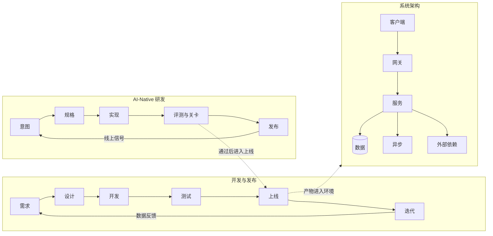

## 工程与架构简介

产品从需求到线上运行，分三块来看：

- **开发与发布**：需求到上线的节奏、CI/CD、灰度，以及环境与部署
- **系统架构**：请求链路上的组件、身份、数据、异步、外部依赖与可观测性
- **AI-Native 研发**：AI 参与写代码之后，意图、规格、评测和发布如何交接

面向 AI 产品经理：工程侧知识用于对齐排期、评估技术风险、判断架构取舍；不要求会写代码。

### 三块如何衔接

开发流程产出进入系统各组件；发布是否可观测、可回滚，由部署与线上信号约束。AI-Native 把意图到发布的交接写进版本库，关卡通过后再进入同一条上线路径。

### 三条生命周期先分开

同名的「生命周期」在站内指三件不同的事：

| 页面 | 回答的问题 |
| --- | --- |
| [开发流程与节奏](dev-flow.md) | 一次需求如何开发、集成、灰度与回滚 |
| [AI 产品开发生命周期](../pm/ai-lifecycle.md) | AI **产品** 如何用 CC/CD 校准代理权 |
| [AI-Native 研发流程](ai-native-sdlc.md) | **写软件** 的过程被 agent 改写后，关卡如何设置 |

先读本专题的流程与架构，再按工作需要进入 CC/CD 或 AI-Native。

### 专题地图

- [开发流程与节奏](dev-flow.md)：端到端六环节、SDLC、CI/CD、敏捷与瀑布、灰度与回滚
- [部署与环境](deployment.md)：环境隔离、滚动/蓝绿/金丝雀、容器与回滚
- [系统架构基础](architecture.md)：请求链路、分层与架构取舍
- [工程架构术语](architecture-terminology.md)：前端、后端、身份、数据库、缓存、消息队列、第三方与可观测性
- [AI-Native 研发流程](ai-native-sdlc.md)：意图产物、关卡评审，以及 Anthropic 案例

### 与全站相关页

- [项目管理与迭代](../pm/project-management.md)：产品侧双轨迭代、迭代规划与发布管理
- [AI 系统架构](../ai/architecture.md)：业务/应用/技术/数据四层，落地判断框架
- [AI 产品 CC/CD](../pm/ai-lifecycle.md)：持续校准与持续开发循环
- [LLM API 与供应商](../tools/llm-api.md)：模型供应商选型与调用风险
- [工具与平台](../tools/index.md)：把架构选型落到具体工具
