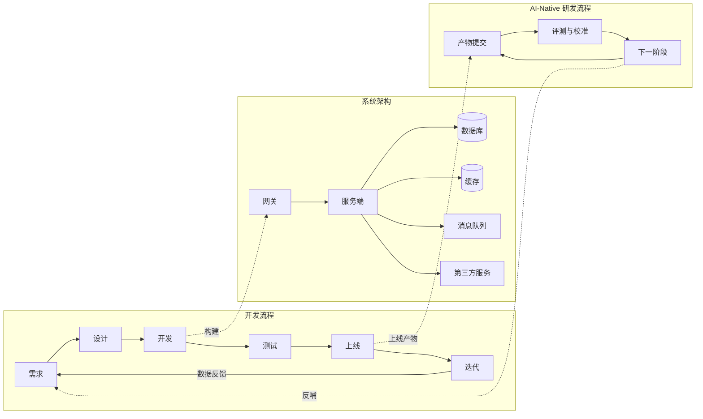

## 技术与架构简介

本专题讲产品从需求到线上运行的整条链路，分三大块：

- **开发流程**：需求 → 设计 → 开发 → 测试 → 上线 → 迭代
- **系统架构**：前端/后端、客户端/服务端、数据库、缓存、消息队列、网关、第三方服务
- **AI-Native 研发流程**：AI 深度参与后的新软件开发生命周期（SDLC）

面向 AI 产品经理：懂工程侧知识，才能和研发对齐排期、评估技术风险、判断架构取舍。不要求会写代码。

### 三大块总览

读图方式：开发流程是主线，产出落到系统架构各组件；上线后进入 AI-Native 闭环，评测与校准把下一阶段产物反哺回主线。

### 专题地图

- [开发流程与节奏](dev-flow.md)：端到端六环节、敏捷与瀑布差异、灰度发布与回滚
- [系统架构基础](architecture.md)：系统组件职责、分层与架构取舍
- [AI-Native 研发流程](ai-native-sdlc.md)：AI 参与后的开发、评测与部署新范式

### 与全站相关页

- [项目管理与迭代](../pm/project-management.md)：产品侧双轨迭代、迭代规划与发布管理
- [AI 系统架构](../ai/architecture.md)：业务/应用/技术/数据四层，落地判断框架
- [AI 产品 CC/CD](../pm/ai-lifecycle.md)：持续校准与持续开发循环
