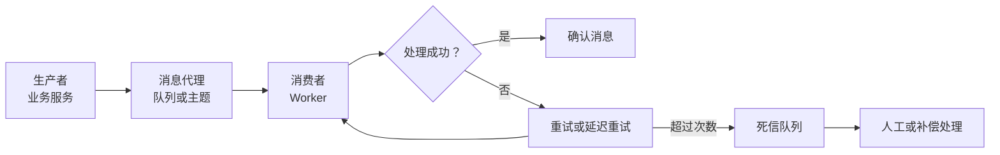
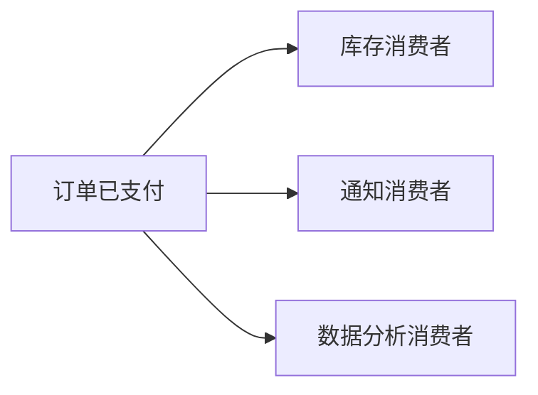
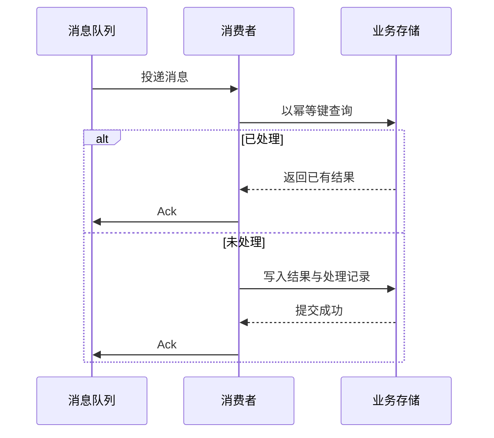

## 消息队列与异步系统

消息队列把生产者和消费者隔开，让任务先进入缓冲区，再由后台按能力处理。它解决的是解耦、削峰和异步，不是把失败消失。引入队列后，产品必须接受部分结果延迟，并为重复、乱序、积压和最终失败定义可见状态。

### 消息如何流转

生产者只负责发布事件或任务，消费者负责处理。系统需要明确消息什么时候算「已接收」、什么时候算「已处理」，两者不能混为一个成功提示。

### 术语速查

| 术语 | 含义 | 产品经理要关注 |
| --- | --- | --- |
| **生产者** | 发布消息的服务或应用 | 发布成功不等于下游任务完成 |
| **消费者** | 读取并处理消息的服务或 Worker | 消费速度、失败重试和幂等决定最终结果 |
| **队列** | 多条消息按规则等待消费者处理的缓冲区 | 适合任务分发；通常一条消息由一个消费者组处理 |
| **主题 / Topic** | 消息发布到的逻辑频道 | 适合按事件类型组织消息，订阅者可独立消费 |
| **发布订阅** | 一条事件广播给多个订阅者 | 适合通知多个下游，但每个订阅者都要独立处理失败 |
| **消费者组** | 共同消费一个队列或主题的一组实例 | 组内扩容提高吞吐；Kafka 等分区日志里，同组内一个分区通常只被一个消费者处理 |
| **确认 / Ack** | 消费者通知代理消息已处理或已接收 | Ack 时机决定消息丢失、重复和重试风险 |
| **至少一次** | 消息可能重复投递，但尽量不丢 | 消费者必须幂等，是业务系统常见的可靠性选择 |
| **至多一次** | 消息最多投递一次，可能丢失 | 适合丢失代价低的非关键通知或统计 |
| **恰好一次** | 语义上只处理一次 | 通常需要端到端约束，不能只看队列配置就宣称实现 |
| **重试** | 处理失败后再次投递 | 要区分临时失败和永久失败，限制次数并采用退避 |
| **死信队列** | 超过重试上限或无法处理的消息存放处 | 死信不能成为垃圾桶，要有告警、查看和补偿流程 |
| **幂等** | 同一消息处理一次或多次，业务结果仍正确 | 扣款、发券、发货、写入等操作必须有幂等键或去重记录 |
| **顺序消息** | 按指定顺序处理相关消息 | 顺序范围越大，吞吐和并发越受限制 |
| **背压** | 下游处理不过来时限制上游或积累速度 | 要定义队列容量、丢弃策略和用户可见的等待状态 |
| **消费延迟 / Lag** | 消息产生时间与被消费时间之间的差距 | 延迟上升是容量、故障或下游变慢的信号 |
| **事件驱动** | 服务通过发布和订阅事件协作，而非全部同步直连 | 降低耦合，但业务流程更难追踪和回放 |

### 队列与发布订阅

- **任务队列**：一条任务通常由一个消费者完成，适合生成报表、发送邮件、处理文件和执行后台作业。
- **发布订阅**：一个业务事件被多个消费者独立接收，适合库存、通知、积分和分析同时响应同一事件。
- **消费者组**：组内实例分担同一份消息，组与组之间可以各自获得一份事件。Kafka、Pulsar 等用分区（partition）把主题切成可并行的日志片段，扩容要看分区数；RabbitMQ 等队列模型没有同等的分区概念，并发由队列与消费者数量决定。

队列解决的是传递和调度，不定义业务事实。订单是否支付成功由订单或支付领域负责，消息只是把「已支付」事件传给其他系统。

### 同步调用与异步化

| 维度 | 同步调用 | 消息队列异步化 |
| --- | --- | --- |
| 用户响应 | 等待下游完成或失败 | 先返回已提交，后续查询或通知 |
| 调用耦合 | 上游依赖下游在线 | 上游与消费者时间解耦 |
| 峰值处理 | 峰值直接传到下游 | 由队列暂存，再按消费能力处理 |
| 结果可见性 | 当前请求可直接返回结果 | 需要任务状态、进度、通知或对账 |
| 失败形态 | 超时、错误码 | 重试、积压、重复、乱序、死信 |
| 运营成本 | 调用链较直观 | 需要监控、回放、补偿和容量管理 |

适合异步化的操作有：批量导入、报表生成、文件转码、通知发送、搜索索引更新和长时间 AI 任务。支付扣款、库存锁定等需要当前请求确认结果的步骤，不能只因为响应慢就无条件改成异步。

### 投递语义与幂等

最常见的现实选择是至少一次投递：消费者处理成功后才确认，消费者在处理成功但确认前崩溃时，同一消息可能再次投递。因此幂等必须落在业务处理上。

常见幂等做法包括唯一约束、处理记录表、幂等键、状态机和业务对账。仅在代码里加一个布尔变量不够：服务重启、并发消费和跨实例执行都可能绕过进程内状态。

### 重试、死信与补偿

- **区分错误**：网络超时、临时限流和服务重启可能值得重试；参数错误、权限不足和业务状态非法通常应直接进入失败处理。
- **退避重试**：逐步拉长间隔并增加随机抖动，避免大量消费者同时重试造成二次洪峰。
- **最大次数**：设置重试次数和总时间，不能让一条永久失败的消息无限占用消费资源。
- **死信告警**：死信数量、原因和消息年龄需要监控；死信页面要支持查看、修复后重放或转人工。
- **补偿机制**：下游部分成功时，通过反向操作、重试、对账或人工审核恢复业务状态。

重放消息前要确认消费者代码是否仍兼容旧格式，是否会重复发券、发通知或扣款。消息保留时间也应与审计、回放和隐私删除要求一致。

### 顺序、积压与容量

- **顺序范围**：按订单、用户或设备保证局部顺序，通常比全局顺序更可扩展。
- **消费并发**：并发越高吞吐越大，但可能造成同一实体乱序或数据库锁竞争。
- **队列积压**：积压量要和消息年龄一起看；数量不多但每条都很旧，同样会影响用户。
- **背压策略**：限制生产、降低非核心任务优先级、增加消费者、延长处理时间或丢弃可重建消息。
- **容量预算**：评估峰值生产速率、平均消费速率、消息大小、保留时长和重试放大倍数。

「把消费者扩容」不一定有效：分区数、数据库连接、第三方限流、单 key 热点和顺序约束都可能成为新的瓶颈。

### 常见黑话与真实含义

| 黑话 | 需要继续追问 |
| --- | --- |
| 上 MQ 解耦了 | 哪些服务不再同步依赖？事件格式、失败通知和流程追踪由谁负责？ |
| 消息不丢 | 投递语义是什么？生产者、代理、消费者、数据库各段如何确认和恢复？ |
| 消费失败自动重试 | 哪些错误可重试？重试次数、退避、死信和永久失败处理是什么？ |
| 消费者加机器就行 | 分区、数据库、外部 API 或顺序约束是否允许并发扩容？ |
| 这个任务改异步 | 用户如何知道任务状态？页面关闭后怎么通知？多久算失败？ |
| 消息只会消费一次 | 是否只是队列层面一次？消费者崩溃重启后业务是否幂等？ |
| 死信后人工处理 | 谁收到告警？如何定位原因、修复数据、重放消息并避免再次副作用？ |
| 事件最终会到 | 最大延迟是多少？积压或消息过期时，用户和下游看到什么？ |

### 给产品经理的检查清单

- 区分「任务已提交」「处理中」「处理成功」和「处理失败」。
- 为每个异步任务定义状态、进度、取消、重试和通知方式。
- 确认消息投递语义、幂等键、顺序范围和重复副作用。
- 设定消费延迟、积压量、死信数量和消息年龄的告警阈值。
- 为不可重试错误、永久失败、下游恢复和人工补偿设计流程。
- 评估消息保留、数据隐私、回放兼容和容量成本。

### 相关页面

- [工程架构术语](architecture-terminology.md)：工程组件术语类总览与阅读顺序
- [系统架构基础](architecture.md)：消息队列在整体请求链路中的位置和引入代价
- [后端与服务端术语](backend-services.md)：同步/异步接口、任务状态和服务边界
- [缓存技术与黑话](caching.md)：用事件驱动缓存失效和异步刷新
- [第三方服务与外部依赖](third-party-services.md)：消息消费者调用外部供应商时的重试与降级
- [可观测性](observability.md)：消费延迟、积压和死信要落到告警

### 来源说明

本文为消息队列与异步系统通识整理，具体投递语义与实现以官方文档为准（访问日期 2026-09-04）：

- [Apache Kafka：Introduction](https://kafka.apache.org/intro)
- [RabbitMQ：Reliability Guide](https://www.rabbitmq.com/docs/reliability)
- [RabbitMQ：Consumer Acknowledgements and Publisher Confirms](https://www.rabbitmq.com/docs/confirms)
- [AWS：Messaging services](https://aws.amazon.com/messaging/)
