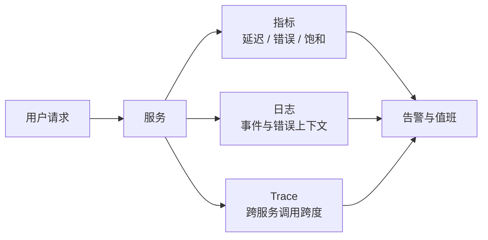

## 可观测性

可观测性让团队从外部信号推断系统内部状态：现在是否正常、哪里变慢、哪一次请求走错。它为灰度、值班和复盘提供可核对的证据。

### 一次请求留下哪些信号

指标回答「整体好不好」，日志回答「这一件发生了什么」，Trace 回答「这一次请求经过了哪些依赖」。三类信号要能靠请求 ID 或用户/订单 ID 对上。

### 术语速查

| 术语 | 含义 | 产品经理要关注 |
| --- | --- | --- |
| **指标 / Metrics** | 按时间聚合的数值，如 QPS、错误率、P95 延迟 | 灰度门禁和容量规划主要看这类 |
| **日志 / Logs** | 离散事件记录 | 要能定位到用户、任务和错误类型；不能只堆原始文本 |
| **Trace** | 一次请求在多个服务、工具和模型调用上的跨度 | Agent / RAG 出问题必须能按一次会话展开 |
| **黄金信号** | 延迟、流量、错误、饱和度四类基础信号 | 新功能上线至少覆盖这四类，再加业务和质量指标 |
| **SLI** | 从真实请求测得的服务水平指标 | 口径要写清：哪类请求、哪个百分位、是否含冷启动 |
| **SLO** | 团队为 SLI 设定的目标 | 未达标时是降级、停灰度还是扩容，要有动作 |
| **SLA** | 对外承诺，通常含赔偿 | 合同承诺不等于内部 SLO；赔偿也覆盖不了业务损失 |
| **告警** | 信号越线后通知值班 | 要可行动；只叫人看图的告警会很快被忽略 |
| **仪表盘** | 面向值班或评审的信号编排 | 产品、质量、成本和基础设施不要混成一张无法解释的图 |

### 灰度时至少看什么

发布和灰度的过程见 [开发流程与节奏](dev-flow.md)。观测上最少三张表：

| 类型 | 例子 | 用途 |
| --- | --- | --- |
| 基础设施 | 错误率、P95/P99 延迟、饱和度、依赖可用性 | 系统是否扛得住 |
| 产品质量 | 完成率、转人工率、幻觉投诉、拒答率 | 功能是否变差 |
| 成本 | 单次请求费用、token 用量、缓存命中率 | 放量后会不会把预算打穿 |

AI 请求还要能追：模型版本、提示词版本、检索命中、工具名称、重试次数和流式是否中断。没有这些字段，线上「偶发胡话」无法回放。

### 告警与值班

- **告警要指向动作**：扩容、关开关、回滚、降级或找某个依赖的值班人。
- **区分症状与原因**：错误率升高是症状；数据库慢查询、模型 429、缓存雪崩才是原因候选。
- **保留抽样与全量的边界**：Trace 和模型输入日志往往抽样；事故复盘需要的那几次请求要能按 ID 捞回。
- **数据出域**：日志里的用户内容、提示词和工具参数要按隐私与留存策略处理，见 [第三方服务与外部依赖](third-party-services.md)。

### 常见黑话与真实含义

| 黑话 | 需要继续追问 |
| --- | --- |
| 我们有监控 | 看的是机器存活，还是用户请求成功？有没有 P95 和业务指标？ |
| 平均延迟很好 | P95/P99 和失败请求的延迟呢？ |
| 打了日志 | 能否按用户、任务、模型版本找回一次失败？字段有没有脱敏？ |
| 有 Trace | 是否覆盖网关、业务服务、模型调用和工具？采样率多少？ |
| 告警太多 | 哪些告警对应明确动作？谁在值班、多久必须响应？ |
| SLO 达成了 | 口径是否包含灰度用户、长尾接口和模型超时？ |

### 给产品经理的检查清单

- 为每个核心用户动作定义成功、失败、超时的可观测口径。
- 灰度门禁同时包含错误率、质量指标和成本指标。
- 要求一次失败可以用请求 ID 串起日志、Trace 和模型/工具调用。
- 确认告警接收人、响应时限和回滚权限。
- 把日志留存、脱敏和出域写进上线验收。
- 事故复盘使用时间线与信号。

### 相关页面

- [工程架构术语](architecture-terminology.md)：工程组件术语类总览与阅读顺序
- [开发流程与节奏](dev-flow.md)：灰度、回滚与发布门禁
- [部署与环境](deployment.md)：放量策略与健康检查
- [系统架构基础](architecture.md)：请求链路上各层如何出故障
- [项目管理与迭代](../pm/project-management.md#发布管理)：产品侧监控三张表
- [评估与评测](../ai/evaluation.md)：线上质量信号与离线评测如何衔接
- [产品经理黑话速查](../intro/glossary.md)：SLI、SLO、SLA 与 P95/P99

### 来源说明

本文为可观测性通识整理，具体实现以官方文档为准（访问日期 2026-09-04）：

- [Google SRE：Monitoring Distributed Systems](https://sre.google/sre-book/monitoring-distributed-systems/)
- [OpenTelemetry：Observability Primer](https://opentelemetry.io/docs/concepts/observability-primer/)
