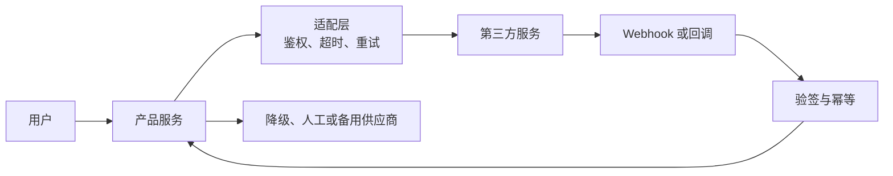
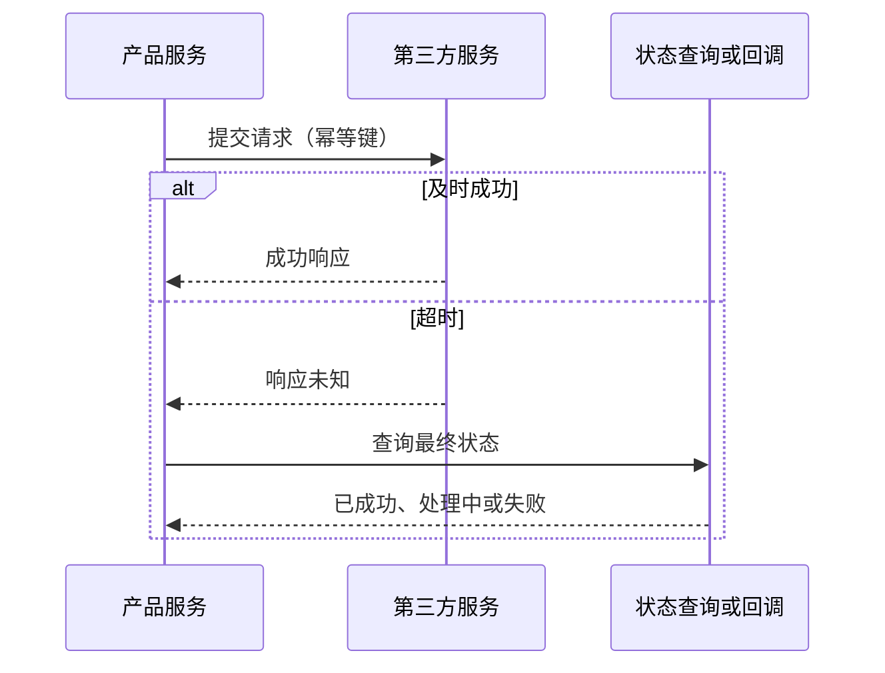

## 第三方服务与外部依赖

支付、短信、地图、登录、对象存储、内容安全和模型 API 等能力常由外部供应商提供。接入第三方不是把接口接通就结束：外部服务有自己的可用性、计费、限流、版本和数据边界，产品必须为它失败、变更和退出留出方案。

### 外部依赖如何进入系统

第三方服务的请求和回调都是不可信的外部边界。请求要限制权限和数据范围，回调要验证来源、签名、时间戳和重复执行，不能因为请求来自「合作方」就跳过校验。

### 术语速查

| 术语 | 含义 | 产品经理要关注 |
| --- | --- | --- |
| **第三方服务** | 由产品团队之外的供应商提供的 API、平台或基础设施 | 服务不可用、价格变化和接口变更会传导到产品 |
| **SLA** | Service Level Agreement，服务等级协议，通常包含可用性、响应、支持和赔偿约定 | 合同承诺不等于实际体验；赔偿也不一定覆盖业务损失 |
| **SLO** | Service Level Objective，团队为服务设定的目标 | 目标要落到接口、区域、时间窗口和测量口径 |
| **配额 / Quota** | 账户、租户或应用可使用的调用量、速率、并发或预算上限 | 配额耗尽时是拒绝、排队、降级还是升级套餐？ |
| **API Key / OAuth** | API Key 是应用凭据；OAuth 通过授权范围代表用户或应用访问资源 | 凭据权限、轮换、泄露和撤销方式必须明确 |
| **Webhook** | 第三方向产品主动发送的 HTTP 回调通知 | 必须验签、幂等、快速响应，并准备重复和乱序回调 |
| **回调验签** | 验证回调确实来自供应商且内容未被篡改 | 不能只校验一个可伪造的用户 ID 或 URL 参数 |
| **超时** | 在限定时间内没有收到可接受的响应 | 超时不代表对方一定没执行，重试前要考虑重复副作用 |
| **重试** | 对临时失败再次请求 | 支付、扣款和发货等操作要有幂等键与状态查询 |
| **降级** | 依赖不可用或成本超标时切换到较弱但可用的路径 | 降级结果、时长、恢复条件和用户提示要可见 |
| **熔断** | 连续失败达到阈值后暂时停止调用 | 防止故障扩散；恢复时要逐步放量而非瞬间打满 |
| **数据出域** | 将用户或业务数据传给系统边界外的服务 | 要评估合法性、最小化、脱敏、留存和跨境要求 |
| **供应商锁定** | 切换供应商需要付出高额重构、迁移或数据转换成本 | 选型时要评估替代品、数据可迁移性和退出计划 |
| **多活 / 备用供应商** | 同时或按需使用多个区域、实例或供应商 | 提高可用性，但带来一致性、路由、成本和运营复杂度 |
| **沙箱环境** | 供应商提供的测试环境或模拟接口 | 沙箱行为可能和生产不同，不能替代生产演练 |

### 常见外部依赖

| 类型 | 典型能力 | 关键失败点 |
| --- | --- | --- |
| 支付与收单 | 下单、扣款、退款、对账 | 超时后状态未知、重复扣款、回调重复或乱序 |
| 身份与登录 | OAuth、短信验证码、企业身份 | 授权范围、账号绑定、供应商不可用和隐私合规 |
| 通知 | 短信、邮件、推送、企业 IM | 配额、发送失败、模板审核、重复通知和退订 |
| 对象存储 | 图片、文件、备份和下载 | 临时链接、权限、生命周期、跨地域和数据删除 |
| 地图与位置 | 地理编码、路线、地图瓦片 | 调用配额、地域覆盖、位置隐私和结果准确性 |
| 内容安全 | 文本、图片、音频审核 | 延迟、误拦截、漏检、数据出域和人工复核 |
| 模型 API | 生成、嵌入、重排和多模态处理 | 速率限制、成本波动、输出不稳定、数据留存和版本变化 |

### 契约、鉴权与数据边界

接入前要形成一份依赖清单，至少记录：

- 供应商、产品版本、环境、负责人和账单归属。
- 请求字段、响应结构、错误码、版本和废弃通知方式。
- 凭据类型、权限范围、轮换周期、泄露处理和审计日志。
- 发送哪些数据、是否脱敏、保存多久、在哪个地域处理和如何删除。
- 供应商承诺的可用性、延迟、限流、支持时间和事故通知方式。
- 沙箱与生产差异、监控指标、备用通道和切换负责人。

适配层把第三方格式转换为内部稳定契约。业务代码不应把供应商的字段名、错误码和状态机直接散落在各处，否则更换供应商时影响面会迅速扩大。

### 超时、重试与未知状态

超时后的状态可能是「请求未到达」「已到达但未执行」「已执行但响应丢失」。对有副作用的请求，不能简单重试。更稳妥的路径是使用幂等键、查询接口、Webhook 和对账任务确认最终状态。

重试策略应明确：

- 哪些错误是临时错误，哪些是业务拒绝。
- 采用固定间隔还是指数退避，最多重试几次。
- 单次请求和整个业务流程的总超时。
- 重试是否会重复扣款、发券、发货或发送通知。
- 达到上限后进入死信、人工处理、备用供应商还是直接失败。

### Webhook 与回调

Webhook 设计不能只看供应商文档中的「通知成功」：

- **验签**：验证签名、时间戳、证书或来源，防止伪造回调。
- **快速响应**：先校验并持久化事件，再异步处理耗时业务，避免供应商重复投递。
- **幂等**：用事件 ID、业务单号或版本号去重，允许同一回调到达多次。
- **乱序**：按状态版本或时间戳判断是否接受，不能假设网络保证顺序。
- **可重放**：保留必要的原始事件和处理记录，支持失败重放与审计。
- **主动对账**：Webhook 可能丢失，关键业务要定期主动查询供应商状态。

### 降级、切换与退出

依赖治理要在正常时就准备故障路径：

| 场景 | 业务策略 | 用户可见状态 |
| --- | --- | --- |
| 短暂超时 | 有限重试或排队 | 处理中，请稍后查看 |
| 达到配额 | 限流、延后非核心任务或升级配额 | 当前功能暂不可用或延迟处理 |
| 供应商故障 | 备用通道、缓存、规则或人工处理 | 明确告知能力受限，不伪装成功 |
| 结果未知 | 状态查询、Webhook、对账 | 不重复扣款，显示待确认 |
| 供应商下线 | 迁移数据、切换适配器、灰度放量 | 公告迁移窗口，保障老数据访问 |

「备用供应商」不是把另一家 API 地址写进配置文件。两家供应商的能力、状态、计费、合规和数据格式可能不同，需要适配、路由、双跑校验、灰度切换和回滚。

### 常见黑话与真实含义

| 黑话 | 需要继续追问 |
| --- | --- |
| 接个 API 很快 | 鉴权、错误码、配额、超时、回调、对账和数据合规都评估了吗？ |
| 对方有 SLA | SLA 覆盖哪个接口、区域和时间窗口？违约赔偿能覆盖业务损失吗？ |
| 超时就重试 | 请求是否可能已执行？幂等键和状态查询在哪里？ |
| 有回调就不会丢 | 回调是否验签、幂等、持久化？回调丢失或乱序后如何主动对账？ |
| 供应商可随时切换 | 内部是否有适配层？数据、状态、能力和历史记录能迁移吗？ |
| 这只是测试环境 | 沙箱与生产的配额、延迟、错误和回调行为一致吗？是否做过生产级演练？ |
| 失败时先给成功 | 哪些场景允许乐观展示？真实状态未确认时如何避免产生错误承诺？ |
| 数据不会出问题 | 发送了哪些字段？供应商保存多久、在哪处理、如何删除和审计？ |

### 给产品经理的检查清单

- 为每个外部依赖指定业务负责人、技术负责人和账单归属。
- 记录接口契约、版本、配额、SLA、数据边界和变更通知渠道。
- 为超时、重复、回调丢失、供应商故障和未知状态设计用户流程。
- 对写操作使用幂等键、状态查询和对账，不把网络超时当作业务失败。
- 评估备用方案、切换演练、数据迁移和供应商退出成本。
- 把凭据轮换、权限最小化、日志脱敏和数据删除纳入上线验收。

### 相关页面

- [工程架构术语](architecture-terminology.md)：工程组件术语类总览与阅读顺序
- [系统架构基础](architecture.md)：第三方服务在整体请求链路中的位置与集成风险
- [后端与服务端术语](backend-services.md)：服务端的超时、重试、熔断和降级
- [消息队列与异步系统](message-queues.md)：异步调用、重试、死信和补偿任务
- [身份认证与权限](identity-access.md)：OAuth、凭据与授权范围
- [LLM API 与供应商](../tools/llm-api.md)：模型 API 选型、限流与供应商风险
- [LLM 成本测算](../tools/llm-cost.md)：调用成本、配额与预算
- [内容安全](../practice/content-safety.md)：AI 产品接入内容安全能力时的治理边界

### 来源说明

本文为外部服务集成通识整理，具体协议、合同和数据处理条款以供应商官方文档与合同为准（访问日期 2026-09-04）：

- [Stripe：Webhooks](https://docs.stripe.com/webhooks)
- [OpenAPI Specification](https://spec.openapis.org/oas/latest.html)
- [RFC 9110：HTTP Semantics](https://www.rfc-editor.org/rfc/rfc9110)
- [MDN：HTTP overview](https://developer.mozilla.org/en-US/docs/Web/HTTP/Guides/Overview)
