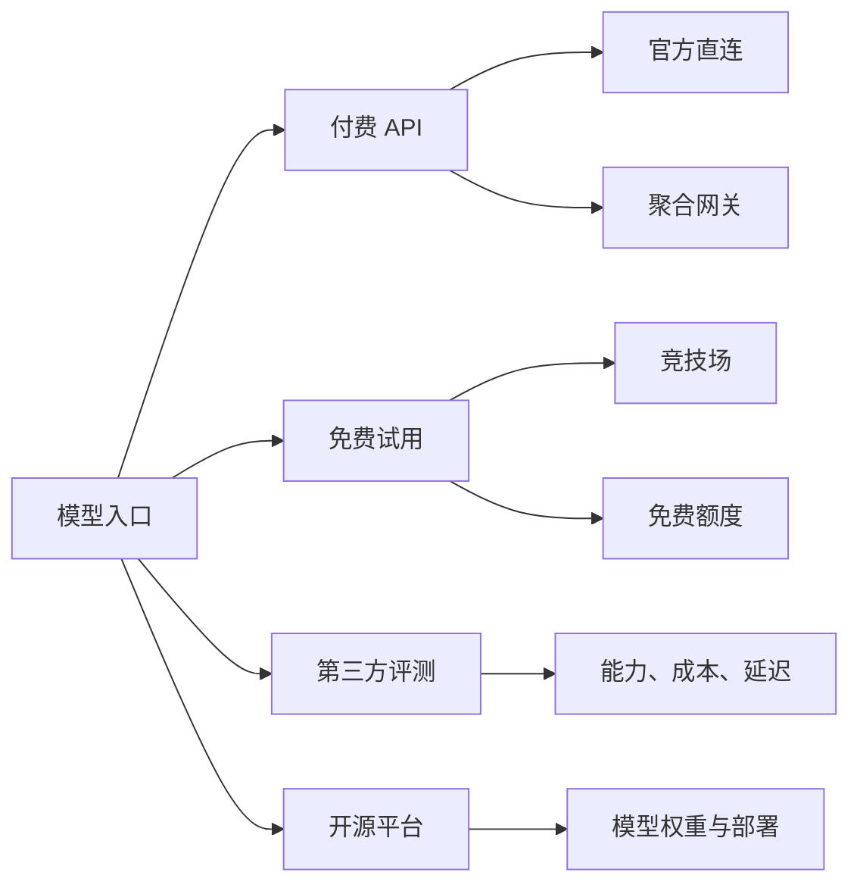
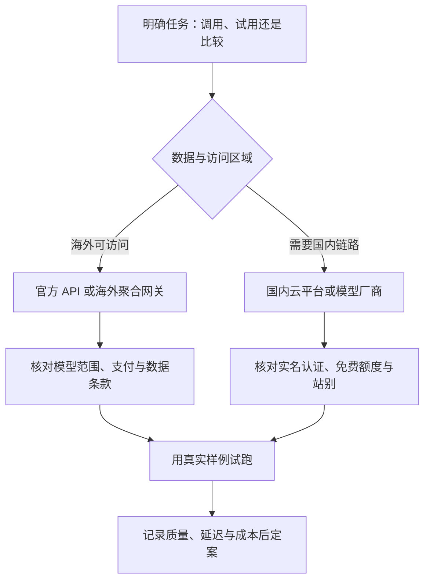

---
---
description: 调用与试用模型的平台清单：聚合 API 网关、竞技场、第三方评测站与开源平台。
---

## AI 平台汇总

调用各家模型有两类入口：**付费 API**（官方直连或聚合网关）与**免费试用**（竞技场、免费额度）。本页收罗常用平台与产品，按海外、国内分组，附网址与主要注意点；供应商与定价的选型方法见 [LLM API 与供应商](llm-api.md)，主流模型能力快照见 [模型能力与选型](../ai/capabilities.md)。

平台的入口差异决定使用方式：API 用于稳定调用，试用与评测用于验证，开源平台用于权重获取与自部署。

## 海外聚合 API 网关

-   **OpenRouter**：聚合 API 网关，一个端点调用全部主流模型，GPT、Gemini、Claude、Grok、DeepSeek、Kimi 都在其中；用不满意随时换，常有免费模型。相比各类中转站，透明、不掺水、不用你的数据训练；按官方原价计费，可能偏贵。[openrouter.ai](https://openrouter.ai)
    -   地区限制：中国大陆无法访问 GPT、Gemini、Claude 模型
    -   支付限制：香港及绝大多数地区不支持微信、支付宝
    -   同时满足国外旗舰模型与移动支付的只有新加坡，注册时地区选它
-   **ZenMux**：OpenRouter 的备用网关，规模更小；个别 OR 缺的模型可来 ZM 找。[zenmux.ai](https://zenmux.ai)

## 竞技场与免费试用

-   **LMArena**：模型对战竞技场，两个模型并排回答同一题，对比后投票；投票结果构成相对客观的能力榜单，对局随机配对，可免费试到全球旗舰模型。不想为订阅付费时的最优解，偏文字与 Agent 任务；设计类见 Design Arena。[lmarena.ai](https://lmarena.ai)
-   **Design Arena**：设计向竞技场，网站设计、PPT、图标、生图等任务都可对局试用；免费试到设计工具的最优解。[designarena.ai](https://designarena.ai)

## 第三方评测

-   **Artificial Analysis**：独立第三方评测站；在缺乏公认客观榜单的背景下，它是第三方评测中公认的权威，覆盖面与评测项目最全，可挑关注维度量身选模；除能力外还统计完成任务的实际花费与耗时，比纯定价页更有参考价值。[artificialanalysis.ai](https://artificialanalysis.ai)

## 开源模型平台

-   **Hugging Face**：开源模型平台，定位类似 GitHub，专攻开源模型；各开源模型权重（DeepSeek、Kimi、Qwen 等）都在此发布。[huggingface.co](https://huggingface.co)

## 海外产品官网

### 聊天产品

-   **ChatGPT**：<https://chatgpt.com>
-   **Gemini**：<https://gemini.google.com>
-   **Claude**：<https://claude.ai>
-   **Grok**：<https://grok.com>
-   **Meta AI**：<https://meta.ai>
-   **Mistral**：<https://mistral.ai>

### 编码工具

-   **OpenCode**：<https://opencode.ai>
-   **Cursor**：<https://cursor.com>

## 国内平台

国内平台无需特殊网络环境，实名认证后均送免费额度。

### 聚合平台

-   **阿里云百炼**、**火山引擎**、**硅基流动**、**百度千帆**：OpenRouter 的国内替代；无法调用国外模型；实名认证后送免费额度，这是 OR、ZM 不具备的

平台选择先受区域和数据边界约束，再用真实样例确认入口是否可用；免费额度只用于验证，不等于生产容量。

### 模型厂商

-   **DeepSeek**、**智谱**、**Kimi**、**MiniMax**：国内口碑靠前的模型厂商
-   其余厂商（阶跃星辰、商汤等）相对冷门
-   **智谱**：平台为 [bigmodel.cn](https://bigmodel.cn)

???+ warning "国内站与国际站不互通"
    智谱、Kimi 等厂商多分国内站与国际站，余额不互通。

    注册与充值时先确认站别。

## 来源说明

> 本文为原创整理，访问验证日期 2026-08-25；免费政策与模型范围变动频繁，以各官方页面为准。

## 更新记录

| 日期 | 变更 | 说明 |
| --- | --- | --- |
| 2026-08-25 | 新增 | 模型平台与访问渠道汇总：海外聚合网关、竞技场、第三方评测、开源平台、海外产品官网与国内平台 |
