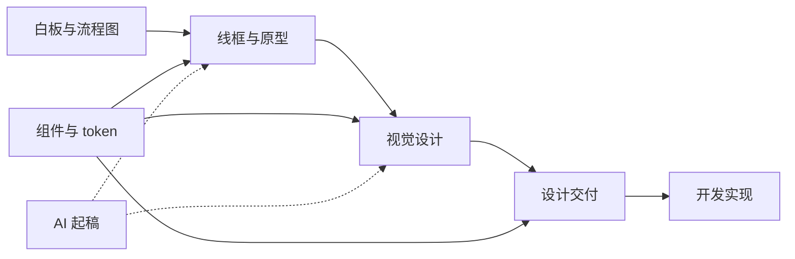
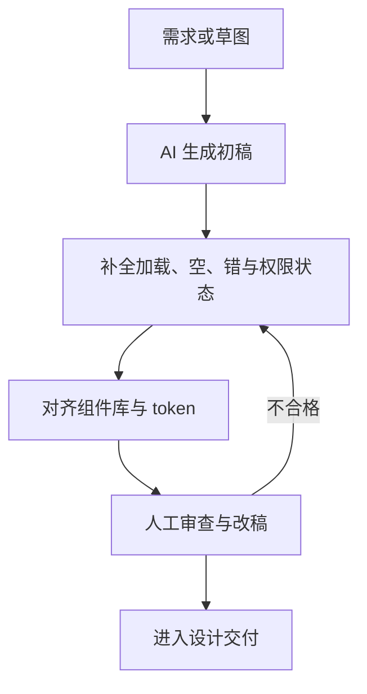
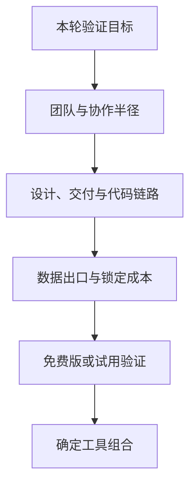

---
---
description: 原型与设计工具链选型：白板、原型、视觉设计、交付、设计系统与 AI 生成。
---

## 原型与设计工具

本页是[工具与平台](index.md)栏目的「设计工具目录」，按产品设计工作流拆成一条流水线来讲：**白板把结构想清楚，原型把结构变成可点击的形态，视觉设计把它变成最终设计稿，交付工具把它交给开发，设计系统让这一切可复用**，AI 生成工具则是这条流水线上新长出来的起稿器。每一段介绍代表工具的能力、边界与选型判断。

分工约定：**方法论见[原型与设计交付](../pm/design-prototyping.md)，本页讲工具本身**：那页回答「原型为什么做、保真度怎么定、怎么测试、怎么交接」，本页回答「每个工具能干什么、什么时候选它、什么时候别选它」；设计系统的概念与治理见[设计系统与规范](../pm/design-systems.md)。

设计工具的主链是从结构到实现，设计系统贯穿各环节，AI 生成主要加速起稿而不替代交付验收。

???+ note "时效说明"
    工具功能演进快，本页所有能力与价格描述均**以官方页面为准**（引用日期 2026-08-24）；价格、席位费、免费额度等没有把握的数字，一律不写精确值。

## 设计工具全景与分类

| 类别 | 代表工具 | 一句话定位 | 典型产出 |
| --- | --- | --- | --- |
| 白板与流程图 | FigJam、Miro、Whimsical、Excalidraw、ProcessOn、draw.io、Mermaid | 把结构想清楚：流程、架构、用户旅程先于界面被对齐 | 流程图、架构图、旅程图 |
| 线框与原型 | Axure、Figma、Framer、Sketch、墨刀、即时设计、MasterGo | 把结构变成可点击、可测试的形态 | 可点击原型 |
| 视觉设计 | Figma、Sketch（与上一类复用） | 把原型变成最终视觉稿 | 设计稿 |
| 设计交付 | 蓝湖、摹客、Zeplin、Figma Dev Mode | 把设计变成开发可实现的规格 | 标注、切图、评审记录 |
| 设计系统 | Figma Components / Variables、Storybook、Tokens Studio、Style Dictionary | 把设计决策变成可复用资产 | 组件、token、文档 |
| AI 生成 | v0、Framer AI、Figma AI、即时 AI、Uizard、Galileo AI、Relume | 把一句话或草图变成初版界面 | 生成稿 |

三个使用要点：

-   **这是一条流水线，不是六个选项**：真实项目通常横跨多类——白板对齐结构、原型验证流程、交付工具交接；选型是「拼一条链路」，不是「选一个工具」
-   **链路的接口比单点工具更重要**：文件格式、组件与 token 能否互通、标注能否自动更新，决定了链路是顺畅还是处处手工搬运
-   **工具是手段，由验证目标决定**：能用纸笔解决的问题不开工具，能用免费版解决的问题不买付费版——[原型与设计交付](../pm/design-prototyping.md)的选型原则与此一致

## 白板与流程图工具

PM 使用频率最高的一类工具：它们产出的是「结构」：流程图、架构图、用户旅程、复盘白板。选择维度主要是四个：**协作方式**（实时多人 vs 单人产出）、**免费边界**、**是否代码生成**、**数据与合规**（国内 vs 海外、能否离线）。

| 工具 | 定位（一句话） | 强项 | 免费边界 | 协作与 AI |
| --- | --- | --- | --- | --- |
| FigJam | Figma 生态的白板 | 与设计稿同文件流，便签 / 投票 / 计时器 | 随 Figma 免费版与付费计划（以官方为准） | 实时协作；AI 白板整理 |
| Miro | 通用在线白板 | 模板生态大，企业级功能全 | 免费版 + 付费席位（以官方为准） | 实时协作；AI 辅助 |
| Whimsical | 轻量一体化白板 | 流程图 / 线框 / 思维导图 / 文档一体 | 免费版 + 付费（以官方为准） | 实时协作；AI 生成流程图 |
| Excalidraw | 手绘风格白板 | 开源免费、端到端加密 | 免费 | 多人协作（有限） |
| ProcessOn | 国内在线作图 | 中文模板生态，上手快 | 免费版有限制 + 付费（以官方为准） | 协作；AI 能力有限 |
| draw.io | 开源绘图工具 | 文件本地化、离线、可嵌入 | 免费开源 | 协作较弱（文件制） |
| Mermaid | 代码生成图 | 图与文档同源、可版本管理 | 免费开源 | 无（代码即协作） |

### FigJam、Miro、Whimsical：白板三选

-   **FigJam**：Figma 生态的白板，最大的优势是**与设计稿同一个工作区**：白板上讨论出的结构直接进 Figma 画原型，不用跨工具搬运。适合设计团队已在 Figma 的场景；别用它做重型流程建模或企业级知识沉淀
-   **Miro**：通用白板的事实标准之一，模板生态庞大（用户旅程、复盘、敏捷仪式都有现成模板），企业管控功能完善。适合跨职能 workshop 和分布式团队；只是画个流程图时用它偏重
-   **Whimsical**：强调轻：流程图、线框、思维导图、文档一体化，几分钟出图，AI 可以按描述直接生成流程图。适合快速把想法结构化；不适合需要长期沉淀、多人管控的团队资产

### Excalidraw、ProcessOn、draw.io：免费与国内选项

-   **Excalidraw**：手绘风格、开源免费、端到端加密，一张临时链接就能协作。适合**低承诺的快速草稿**——正如[原型与设计交付](../pm/design-prototyping.md#线框图与草图)所说，草图是「为思考服务的探索性绘画」，越潦草越容易被推翻；别拿它做正式交付图
-   **ProcessOn**：国内老牌在线作图工具，模板与社区以中文为主，流程图画完直接分享链接。适合国内团队快速出图；注意免费版有文件数量与导出限制（以官方为准），数据敏感场景要评估云端存储
-   **draw.io（diagrams.net）**：开源免费、文件存在本地、支持离线与桌面端，可嵌入 Confluence、Notion、VS Code 等。适合架构图、ER 图、BPMN 这类要进文档或代码仓库的图；实时协作弱，不适合多人同画

### Mermaid：代码即图

-   **Mermaid**：用类似 Markdown 的 DSL 写图，渲染出流程图、时序图、状态图、甘特图等；MkDocs、GitHub、Notion 等都能直接渲染。最大优势是**图与文档同源**：图和文字一起提交、一起 review、一起版本管理，改图就是改代码，可 diff 可追溯
-   代价是**上手门槛与实时性**：非技术协作场景（白板讨论、客户访谈）里拖拽工具更顺手；与拖拽工具是互补关系：**讨论阶段用白板，成稿阶段用 Mermaid 固化**

### 组内对比

-   **ProcessOn vs draw.io**：模板与中文生态 vs 文件与离线——ProcessOn 胜在「开箱即用、分享即看」，draw.io 胜在「文件在我手里、可进代码仓库」；数据敏感、要版本管理的选 draw.io，快速出图给业务看的选 ProcessOn
-   **Mermaid vs 拖拽工具**：图即代码，可 diff、可 review、可自动生成；拖拽工具所见即所得、零门槛。前者适合把图当文档一部分的团队，后者适合把图当讨论产出的场景
-   **白板 vs 绘图**：白板回答一起想清楚（过程），绘图工具产出可交付的图（结果）。同一个项目常常先用 FigJam / Miro 讨论，再用 draw.io / Mermaid 固化

### PM 常用场景

-   **流程图**：业务 / 审批 / 状态流转——ProcessOn、draw.io、Whimsical、Mermaid 均可，按「要不要进文档」选
-   **架构图**：系统 / 数据流——draw.io（文件可入库）与 Mermaid（代码生成）是主流；白板类工具适合草稿
-   **用户旅程**：旅程地图与 storyboard 的区分见[原型与设计交付](../pm/design-prototyping.md#storyboard-与-user-flow-图)——画「用户在什么情境下怎么用」，Miro 与 FigJam 的模板最方便
-   **复盘白板**：retro / 复盘——FigJam、Miro 的便签与投票功能天然适配，AI 整理能力（以官方为准）可把便签归类成结论

???+ note "协作与数据"
    白板工具越轻、越容易换：草稿类（Excalidraw、Whimsical）随时可以换，沉淀类（Miro 的企业空间、ProcessOn 的作品集）换起来要迁移历史内容。

    团队在选型时先回答：**这些图是「一次性草稿」还是「长期资产」？** 长期资产才值得把数据驻留、导出格式、权限管理纳入评估。

## 原型设计工具详览

原型工具是流水线的核心段：把结构变成**可点击、可测试**的形态。方法论（保真度决策、状态矩阵、测试脚本）见[原型与设计交付](../pm/design-prototyping.md)，先看全景表，再逐类展开：

选择维度提示：原型工具不只是画板，还要看三个衔接点：**与视觉设计的衔接**（原型能不能直接升级成视觉稿）、**与交付的衔接**（标注 / 切图是否内置）、**与团队的衔接**（实时协作还是文件流转）。三个衔接决定它是流水线上的一段，还是又一个孤岛。

| 工具 | 类别 | 核心强项 | 价格模式 |
| --- | --- | --- | --- |
| Axure RP | 桌面端原型 | 复杂逻辑、数据驱动、企业级 | 付费订阅（有试用） |
| Figma | 云端设计协作 | 设计 + 原型 + 交付 + 生态 | 免费版 + 付费席位 |
| Framer | 网页级原型 | 交互与动效强，可直接发布 | 免费版 + 付费 |
| Sketch | Mac 原生设计 | 插件生态成熟 | 付费订阅 |
| 墨刀 | 国内原型工具 | 中文生态、上手快 | 免费版 + 付费 |
| 即时设计 | 国内协作设计 | 协作 + AI 生成 | 免费版 + 付费 |
| MasterGo | 国内协作设计 | 协作 + 组件 / 变量 | 免费版 + 付费 |
| Mockplus（摹客） | 国内原型 + 交付 | 轻量一体化 | 免费版 + 付费 |

### Axure RP：复杂逻辑原型的常青树

-   **定位**：老牌桌面原型工具，面向原型要承担逻辑规格职责的场景：复杂业务流程、权限分支、数据联动，原型本身要能回答「在什么条件下发生什么」
-   **强项**：中继器（Repeater）渲染数据列表、变量与函数、条件逻辑、动态面板，能做**带真实数据与分支逻辑的可点击原型**；输出物可作为交互规格的载体，适合企业级、To B 项目
-   **边界**：视觉设计能力弱（不是像素级设计工具，视觉稿要另找工具）；协作是文件制，多人同屏与评审弱于云端工具；学习曲线陡，原型资产需要专人维护
-   **价格模式**：付费订阅，提供试用，具体以官方页面为准；**AI 能力**有限（以官方为准）
-   **适合团队**：企业级产品团队、咨询与 To B 项目——原型本身就是交付物的一部分，逻辑规格比视觉表现更值钱
-   **何时选它**：原型要表达复杂逻辑与数据流，且团队能投入学习与维护成本——大型 To B 流程、审批流、后台系统
-   **何时别选它**：快速验证想法（白板或免费工具就够）、视觉与实时协作优先的团队、没有专人维护原型资产的团队

### Figma：设计-原型-交付一体化的平台

-   **定位**：云端设计协作平台，把设计、原型、交付、设计系统放在同一个工作区，是当前事实上的行业标准生态
-   **强项**：实时多人协作（同画板多人编辑）、Auto Layout（自动布局）、组件与 Variants、Variables（设计 token 的 Figma 实现）、Dev Mode（开发侧交付）、海量插件与模板；原型支持交互连线、智能动画与条件逻辑，足够覆盖绝大多数流程验证
-   **边界**：数据与逻辑表达弱于 Axure（没有中继器 / 函数级能力），重度动效弱于 ProtoPie 等专用工具；深度使用依赖付费席位
-   **价格模式**：免费版 + 付费席位（Professional / Organization / Enterprise 档位以官方页面为准）；**AI 能力**：Figma AI 系列（生成初稿、语义搜索、图层命名、Make 等，以官方为准）
-   **适合团队**：几乎任何规模——从个人到企业；设计与开发协作越紧密，Figma 的「一体化」价值越大；个人与团队从免费版起步即可
-   **何时选它**：设计与开发需要紧密协作、交付要一体化的团队——几乎任何规模都适用，生态与组件资产长期增值
-   **何时别选它**：只需要一次性线框（白板就够）；逻辑复杂度超出原型工具合理边界时考虑 Axure 或代码原型

### 组内对比：Axure vs Figma vs 国内工具

-   **Axure 重逻辑，Figma 重协作，墨刀 / 即时设计 / MasterGo 重中文场景**：三者不是同一问题的三个答案，而是不同问题的答案：「原型要表达多复杂的逻辑」选 Axure，「设计与交付要一体化」选 Figma，「国内团队要快速上手与演示」选国内工具
-   **重度动效另看 ProtoPie**：多屏联动、传感器、复杂动效逻辑的场景（如车载、硬件交互、高保真动效验证），ProtoPie 是原型谱系里的专精选项（以官方为准）
-   同一项目可以混用：Axure 出逻辑原型，Figma 出视觉与交付；代价是设计资产要平移，评估链路成本后再决定
-   判据：**团队的验证目标与协作半径决定工具，而不是工具的功能数量**（[原型与设计交付](../pm/design-prototyping.md#原型工具选型)）

### 其他原型与设计工具

-   **Framer**：网页级原型工具，交互、动效与响应式能力强，原型可以直接发布为真实站点。**何时选**：落地页、官网、营销页「原型即成品」的场景，AI 生成布局与文案（以官方为准）；**何时别选**：复杂应用级流程与多角色系统
-   **Sketch**：Mac 原生设计工具，历史地位高、插件生态成熟，至今仍被部分团队使用。**何时选**：存量 Mac 设计流程、团队已沉淀大量 Sketch 插件资产；**何时别选**：新团队、跨平台协作——云端工具的实时协作与交付一体化更顺
-   **墨刀**：国内老牌原型工具，组件库、演示分享、标注一体，上手快；AI 生成（以官方为准）。**何时选**：国内团队快速出原型与演示，给业务方看「能点的东西」；**何时别选**：设计系统级协作与长期资产沉淀
-   **即时设计**：国内 AI 协作设计工具，多人协作、资源广场与即时 AI 生成（以官方为准）。**何时选**：国内团队、中文生态、功能与 Figma 对标；**何时别选**：需要海外生态与开发侧深度集成——那时优先 Figma
-   **MasterGo**：国内协作设计工具，与蓝湖同属一家公司（以官方为准），组件与变量能力完善。**何时选**：国内团队搭配蓝湖交付链路；**何时别选**：需要 Figma 插件生态的团队
-   **Mockplus（摹客）**：国内「原型 + 交付」套件——Mockplus RP 做原型，摹客协作做标注交付。**何时选**：小团队原型到交付一条龙，轻量、中文、上手快；**何时别选**：复杂逻辑与大型设计系统场景

## 设计交付与协作

设计交付（handoff）是「设计 → 开发」的接口：**交付物清单、标注方式、评审与还原度验收的方法论见[设计交付（handoff）](../pm/design-prototyping.md#设计交付handoff)，本页讲工具侧**。工具要干三件事：标注、切图与资源、评审与验收。

| 工具 | 定位 | 能力要点 |
| --- | --- | --- |
| Figma Dev Mode | 开发视角的交付模式 | 直接查看尺寸、变量、代码片段，设计变更实时同步 |
| 蓝湖 | 国内主流交付协作 | 标注、切图、评审、状态管理，与 MasterGo 同源（以官方为准） |
| 摹客 | 摹客协作（Mockplus 交付端） | 标注、切图、评审，与 Mockplus RP 配套 |
| Zeplin | 老牌海外交付工具 | 标注与讨论，与设计稿双向同步 |

-   **Figma Dev Mode**：开发在 Figma 里以开发视角查看设计：尺寸、间距、变量名、代码片段（以官方为准），设计改版自动反映，是「标注随设计变更自动更新」的代表实现
-   **蓝湖**：国内设计交付的事实标准之一，设计师上传设计稿，开发查看标注与切图，评审在评论区完成；免费版 + 付费席位（以官方为准）
-   **摹客**：Mockplus 的交付端，与原型工具同厂配套；适合小团队「原型 + 交付」同链路
-   **Zeplin**：海外老牌交付工具，标注与讨论能力成熟，存量团队仍在用；新团队多数直接走 Figma Dev Mode

???+ warning "原则"
    **标注必须随设计变更自动更新**。手工截图拼出来的标注文档，设计一改版就失效：「开发按旧版实现」的最大来源不是开发不认真，而是标注文档不会自己更新。

    选交付工具的底线要求：设计稿改了，标注、切图、代码片段跟着变。

### 交接物与验收

-   **交接物**：全页面全状态视觉稿、标注、切图与资源、交互说明、组件与 token 映射——清单见[原型与设计交付](../pm/design-prototyping.md#交付物清单)的交付物清单
-   **评审与验收**：交付评审会与还原度验收（像素对比、状态覆盖、边界情况）的方法见[原型与设计交付](../pm/design-prototyping.md#设计评审与还原度验收)；工具侧把评论 @、版本对比、状态矩阵核对清单用起来，验收记录留在工具里而不是口头
-   **还原度问题的一半靠流程挡**：设计改版走单一通道（Dev Mode / 评论 @）、组件先落地组件库再进页面（见[设计系统与规范](../pm/design-systems.md)）

以交付工具为骨架的典型交接节奏：

1.  设计定稿：全状态视觉稿上传交付工具，命名与页面结构清晰，状态矩阵核对清单一并挂上（见[原型与设计交付](../pm/design-prototyping.md)的页面 × 状态矩阵）
2.  开发取稿：开发在交付工具里看标注与切图，问题在评论区 @ 设计师，决策留痕
3.  变更同步：设计改版后重新上传，交付工具自动刷新标注；旧版标注保留可回溯
4.  验收回执：还原度验收结果（通过 / 偏差项）记录在工具里，偏差项进 backlog 并明示

## 设计系统工具

设计系统是跨项目的设计决策资产，工具链负责把决策变成可复用资产。**概念、治理与落地方法见[设计系统与规范](../pm/design-systems.md)**，这里按「设计侧 → 代码侧 → 流水线」给工具：

| 工具 | 环节 | 干什么 |
| --- | --- | --- |
| Figma Components / Variables | 设计侧 | 组件（含 Variants、Team Library）与设计 token（Variables、Themes） |
| Storybook | 代码侧 | 组件的独立开发、文档与测试环境 |
| Tokens Studio | 设计侧（Figma 插件） | 在 Figma 内维护 token，与代码仓库双向同步 |
| Style Dictionary | 流水线 | 把 token 编译成 CSS、iOS、Android 等多端产物 |
| DTCG | 标准 | 开放 token 格式规范，跨工具流转的交换标准 |

-   **Figma Components / Variables**：组件与 token 在 Figma 里的落点：组件用 Variants 表达变体、Team Library 跨文件共享；Variables 承载设计 token 并支持多主题切换（浅色 / 深色 / 品牌）。设计系统的 Figma 落地细节见[设计系统与规范](../pm/design-systems.md#design-tokens设计令牌)
-   **Storybook**：把组件从产品里拿出来单独开发、预览与测试的环境，支持文档、交互测试与可访问性检查；是「代码侧的组件库」与组件 API 契约的载体（以官方为准）
-   **Tokens Studio**：Figma 插件，在 Figma 内管理 token 并推送 / 拉取代码仓库，解决设计侧与代码侧 token 漂移问题（以官方为准）
-   **Style Dictionary**：源自 Amazon 的开源构建工具，把 token 仓库编译成各端产物（CSS 变量、Swift 枚举、Android 资源等），是「token 仓库 → 多端产物」流水线的事实标准（以官方为准）
-   **DTCG**：W3C 社区组制定的开放 token 格式（`$type` / `$value` 语法），目标是 token 在不同工具、不同平台之间无损流转

典型流水线：**Tokens Studio 在 Figma 里维护 token → Style Dictionary 编译出各端产物 → 设计稿与代码共用同一 token 源**。铁律：token 仓库是唯一事实来源，各端产物由构建生成，不手工维护副本。手工复制必然漂移（详见[设计系统与规范](../pm/design-systems.md)的 token 落地一节）。

### 什么时候可以不上设计系统工具

设计系统工具是投资，小团队和早期产品可以明确不上（判断标准见[设计系统与规范](../pm/design-systems.md)的「什么时候不该建」）：

-   **单产品、小团队**：一套 Figma 组件 + 一份规范文档足够，Tokens Studio / Style Dictionary 的流水线收益体现不出来
-   **产品形态快速变化期**：交互范式每个季度都在变，固化的组件与 token 很快作废，先用手工规范顶着
-   **无人专职维护**：流水线建了没人养，三个月后 token 与代码脱节，变成没人信的僵尸资产——不如不建

## AI 时代的设计工具

AI 生成 UI 的工具在快速成熟，按形态分三类：**文生界面**（v0、Uizard、Galileo AI）、**设计工具内置 AI**（Figma AI、Framer AI、即时 AI）、**站点级生成**（Relume）。方法论层面的能力边界见[原型与设计交付](../pm/design-prototyping.md#ai-时代原型的特殊性)与[设计系统与规范](../pm/design-systems.md#ai-时代的设计系统)，这里给工具目录。

AI 设计工具的可用路径不是「生成即交付」，而是生成、补状态、对齐设计系统并经过人工审查后再交接。

| 工具 | 形态 | 干什么 |
| --- | --- | --- |
| v0（Vercel） | 文生界面 | 一句话生成 UI 组件代码（React + Tailwind），支持组件库（以官方为准） |
| Framer AI | 设计工具内置 | 在 Framer 内生成布局、文案、图片，直接落可发布站点 |
| Figma AI | 设计工具内置 | 生成初稿、语义搜索、图层命名、Make 系列（以官方为准） |
| 即时 AI | 设计工具内置 | 即时设计内置 AI 生成，中文场景 |
| Uizard | 文生界面 | 文本 / 草图转 UI，面向非设计师起稿 |
| Galileo AI | 文生界面 | 文本描述生成 UI 初稿 |
| Relume | 站点级生成 | 生成站点地图与线框，面向 Webflow 等开发流程 |

-   **v0（Vercel）**：面向开发者的文生 UI——输入描述生成组件代码，直接落在 React + Tailwind 技术栈上，支持 shadcn/ui 等组件库（以官方为准）；免费额度 + 付费（以官方为准）；适合「PM 描述 → 开发拿代码起稿」的协作
-   **Framer AI**：在 Framer 内生成布局与文案、生成图片，产出直接是可发布的真实站点；适合落地页与营销页
-   **Figma AI**：在 Figma 生态内生成初稿、语义搜索、图层命名等（以官方为准）；优势是生成结果天然在组件与变量体系内：**能不能落到你的组件库与 token 上，是 AI 生成可用性的判据**（详见[设计系统与规范](../pm/design-systems.md#ai-时代的设计系统)）
-   **即时 AI / Uizard / Galileo AI**：即时 AI 面向中文场景；Uizard 与 Galileo AI 主打「一句话起稿」，适合非设计师快速把想法变成可见形态
-   **Relume**：从一句产品描述生成站点地图与线框，再做页面级组装（以官方为准）；适合官网型产品的结构起稿

### 能力边界：生成界面 ≠ 交付级设计

-   **缺状态与分支**：生成的界面「看起来完整、点起来残缺」：加载、空、失败、权限分支常常缺席，必须用状态矩阵补全（见[原型与设计交付](../pm/design-prototyping.md)的页面 × 状态矩阵一节）
-   **不稳定与不可控**：同一 prompt 每次结果不同，难以锁定基线；像素级调整的表述成本高于直接拖拽
-   **品牌一致性弱**：裸模型生成的视觉风格漂移，不符合既有设计系统；有系统约束的生成才是「每页都是你的产品」，见[设计系统与规范](../pm/design-systems.md#ai-时代的设计系统)
-   **幻觉问题**：生成结果可能包含不存在的组件、不合理的文案或错误的交互。AI 起稿之后必须人工审查，不能直接当交付物

### 幻觉与可控性

AI 生成工具的幻觉不是「偶尔出错」，而是**系统性倾向**，三个高频形态：

-   **伪 UI**：界面看起来完整，点开全是死按钮：状态、分支、跳转不存在；这是「生成界面 ≠ 可点击原型」的根源
-   **伪内容**：生成看起来很专业的文案、数据、图表，但内容可能是编造的。演示可以，进产品必须换成真实内容（真实内容原则见[原型与设计交付](../pm/design-prototyping.md)）
-   **风格漂移**：同一 prompt 换一次生成就是另一套视觉，品牌色、间距、圆角各有各的「差不多」

可控性手段（按成本从低到高）：

1.  **模板与组件库约束**：在工具里锁模板、锁组件、锁 token，生成结果天然落在体系内——这是最便宜的约束
2.  **生成后结构化审查**：按状态矩阵逐格核对生成稿，缺什么补什么，而不是整体重来
3.  **人工改稿兜底**：像素级与语义级的调整最终仍要人做——AI 省的是「从零起稿」的时间，不是「审稿改稿」的时间

判据：**生成结果能不能落到你的组件库与 token 上，决定它是否可用**（见[设计系统与规范](../pm/design-systems.md#ai-时代的设计系统)）；能对齐是加速器，对齐不了是返工源头。

### 对 PM 工作流的影响

-   **需求 → 生成 → 改稿成为新的起稿方式**：PM 可以自己把一句话需求变成可见初稿，再与设计 / 开发对齐，缩短「想法 → 可见形态」的时间；生成稿是沟通载体，不是交付物
-   **PM 的评审职责变重**：AI 生成越普及，「审什么、怎么审」越关键：状态覆盖、系统对齐、品牌一致性都要人工把关；AI 生成稿必须经过状态矩阵补全与设计系统对齐才能进 handoff（见[原型与设计交付](../pm/design-prototyping.md#ai-时代原型的特殊性)）
-   **与开发的协作方式变化**：v0 类工具的输出直接是代码，PM 描述需求 → 开发拿代码起稿 → 双方在真实技术栈上讨论，比「对着截图猜实现」更高效；代价是 PM 要理解生成代码的质量边界（可维护性、可访问性仍要开发把关）

???+ tip "选型提示"
    AI 设计工具演进极快，能力与价格一律以官方页面为准。先跑免费额度验证产出质量与可控性，再决定付费。

    把「生成结果能否进入你的工具链（组件库、token、代码栈）」作为第一判据，而不是生成效果截图。

## 选型建议（PM 视角）

工具选型没有标准答案，但可以用四个维度快速收敛：

设计工具应按验证目标和上下游链路组合选择，试用确认可迁移后再投入长期资产。

| 维度 | 要问的问题 | 影响 |
| --- | --- | --- |
| 团队构成 | 有没有专职设计师？ | 无设计师 → 模板 / 组件库丰富 + AI 起稿优先；有设计师 → 设计工具为主，PM 用查看 / 评审权限 |
| 成本模式 | 免费版够用吗？席位预算多少？ | 免费版 + 付费席位的组合最普遍；预算紧张先免费版跑通链路（以官方为准） |
| 数据出口与锁定 | 数据能放云端吗？迁移成本多高？ | 国内工具与海外工具的数据驻留与合规不同；文件格式可迁移性影响锁定 |
| 协作半径 | 团队在国内还是跨国？ | 国内团队 → 墨刀 / 即时设计 / MasterGo / 蓝湖；海外 / 跨国 → Figma / Zeplin |

### 典型组合

1.  **个人 PM（无设计团队）**：Excalidraw / draw.io 画结构 + Figma 免费版做原型 + v0 起稿 AI 生成——成本近乎为零，重点是快速把想法变成可验证的形态，不追求交付级设计
2.  **小团队、无专职设计师（国内）**：ProcessOn 出图 + 即时设计或墨刀做原型（AI 生成补设计能力）+ 蓝湖或摹客交付——链路短、中文生态、免费版起步；缺点是设计与开发的距离靠工具弥合，还原度要靠验收流程兜底
3.  **成熟设计团队**：FigJam / Miro 做白板 + Figma（Components、Variables、Dev Mode）做设计-交付一体化 + Storybook 与 Style Dictionary 沉淀组件与 token——交付与设计系统是同一套资产，还原度问题从「人眼对照」变成「变量对齐」（见[设计系统与规范](../pm/design-systems.md)）

### 常见误区

-   **为工具而工具**：先买工具、再找问题：正确顺序是「这轮要验证什么」→ 最低成本的工具组合（见[原型与设计交付](../pm/design-prototyping.md)）
-   **只看单点最强**：原型工具最强、交付工具最强、设计系统最强，三者接不上，等于三条断头路。先画链路再填工具
-   **看生成效果截图选 AI 工具**：截图是宣传物料，真实判断标准是「生成结果能否进入你的工具链」：组件库、token、代码栈，一样都对不上就只是玩具
-   **忽略锁定与出口**：设计资产、模板、团队肌肉记忆都是锁定成本；选型时把两年后迁移要花多少一并算进去

### 收尾建议

-   **链路一致性 > 单点最强**：工具再强，和上下游接不上就是孤岛；先画链路，再填工具
-   **先试免费额度，再谈付费**：所有工具的免费版都够跑通一次完整验证；付费决定应该在「链路已验证」之后
-   **锁定与出口提前评估**：设计资产是团队的长期资产，迁移成本在选型时就要算
-   **工具是手段，由验证目标决定**：方法论见[原型与设计交付](../pm/design-prototyping.md)，本页只是工具目录——先问「这轮要验证什么」，再打开工具

## 来源说明

> 以下来源整理于 2026-08-24，页面可能随时更新；**工具功能与价格以官方页面为准**。

**官方文档与官网**

-   Figma 官网 https://www.figma.com/ 与[帮助中心](https://help.figma.com/)（Dev Mode、Variables、AI 功能）
-   FigJam https://www.figma.com/figjam/
-   Miro https://miro.com/
-   Whimsical https://whimsical.com/
-   Excalidraw https://excalidraw.com/
-   ProcessOn https://www.processon.com/
-   draw.io（diagrams.net）https://www.drawio.com/
-   Mermaid https://mermaid.js.org/
-   Axure https://www.axure.com/
-   Framer https://www.framer.com/
-   Sketch https://www.sketch.com/
-   墨刀 https://modao.cc/
-   即时设计 https://js.design/
-   MasterGo https://mastergo.com/
-   Mockplus（摹客）https://www.mockplus.cn/ 与 https://www.mockplus.com/
-   蓝湖 https://lanhuapp.com/
-   Zeplin https://zeplin.io/
-   Storybook https://storybook.js.org/
-   Tokens Studio https://tokens.studio/
-   Style Dictionary https://styledictionary.com/
-   DTCG https://www.w3.org/community/design-tokens/
-   v0 https://v0.dev/
-   Uizard https://uizard.io/
-   Galileo AI https://www.usegalileo.ai/
-   Relume https://www.relume.io/

**站内相关页面**

-   [原型与设计交付](../pm/design-prototyping.md)（原型方法论、保真度决策、handoff 流程）
-   [设计系统与规范](../pm/design-systems.md)（design tokens、组件库、设计系统治理）
-   [工具与平台（总览）](index.md)

> 补充说明：本文所有工具的能力与价格描述均以官方页面为准，不写没有把握的精确数字；社区二手讨论不作为事实依据。

## 更新记录

| 日期 | 变更 | 说明 |
| --- | --- | --- |
| 2026-08-24 | 新建 | 工具与平台专题新增「原型与设计工具」目录页：白板 / 流程 → 原型 → 交付 → 设计系统 → AI 生成全谱系 |
