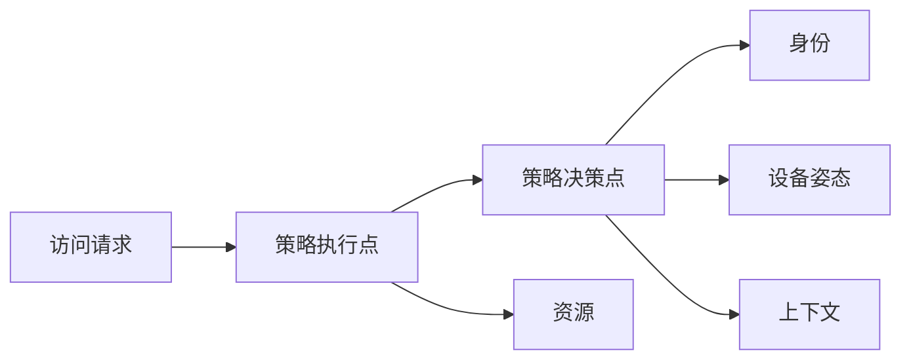

## 安全架构与零信任

零信任的工作假设是网络位置不可证明安全，每次访问都要验证身份、设备和策略。对 AI 产品，工具调用、检索语料和管理接口都属于必须持续验证的资源。

### 核心概念

| 术语 | 含义 | 产品经理要写下的规则 |
| --- | --- | --- |
| **纵深防御** | 多层控制，单层失效仍可阻挡 | 认证、授权、WAF、审计不能互相替代 |
| **零信任** | 永不默认信任，始终验证 | 内网地址不是授权理由 |
| **微分段** | 工作负载之间最小连通 | 推理服务不能直连支付库 |
| **失陷假设** | 设计时假定凭证已泄露 | 有检测、隔离和密钥吊销路径 |
| **策略决策点** | 集中判断是否允许访问 | Agent 工具调用走同一决策点 |

### AI 产品切入点

-   把访问策略翻译成可测试的允许/拒绝用例
-   检测「开发临时放开」长期残留的连通性
-   模型不得直接修改防火墙或生产路由

### 常见误判

-   把 VPN 当成零信任完成
-   给内部工具免登录
-   为了 Demo 把分段策略关掉并忘记恢复

### 相关阅读

-   [身份认证与访问控制](identity-and-access.md)
-   [云与供应链安全](../data-app-cloud/cloud-and-supply-chain.md)
-   [终端与网络安全](../data-app-cloud/endpoint-and-network.md)

## 来源说明

本页把该领域的公开框架转成产品经理可用的判断语言，不替代专业资格或监管解释。

-   [CISA Zero Trust Maturity Model](https://www.cisa.gov/zero-trust-maturity-model)
-   NIST SP 800-207 零信任架构

条文、标准与产品功能以官方文本为准；本页核验日期为 2026-09-04。
