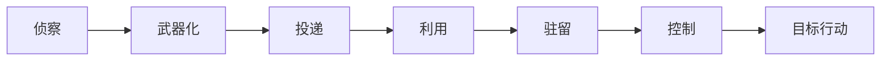

## 威胁与攻击面

威胁建模先回答「什么会坏、谁会利用、坏了会怎样」，再决定功能默不默认开放。攻击面是攻击者可触及的入口：账号、API、文件上传、管理后台、模型提示词、供应链依赖。

### 核心概念

| 术语 | 含义 | 产品经理要写下的规则 |
| --- | --- | --- |
| **CIA 三元组** | 保密、完整、可用 | 每个核心数据对象分别定义丢失、篡改、中断的后果 |
| **STRIDE** | 欺骗、篡改、抵赖、泄露、拒绝服务、提权 | 每个新入口用六类威胁过一遍 |
| **攻击面** | 可被探测或调用的暴露点 | 上线清单包含端口、权限、回调、插件和工具 |
| **MITRE ATT&CK** | 对手战术与技术知识库 | 检测规则和演练剧本对齐到具体技术编号 |
| **利用窗口** | 漏洞公开到补丁完成的时间 | 高危项有明确的修复 SLA 和临时缓解 |

杀伤链用于沟通阶段，不代替对具体产品入口的枚举。

### 数据与系统

资产台账、漏洞扫描器、攻击面管理（ASM）和红队报告提供输入。模型产品还要把提示词、工具 schema、检索语料和日志列为资产。

### AI 产品切入点

-   把扫描结果和资产台账汇总成「本周最值得修」的优先级说明
-   用 ATT&CK 技术描述把告警翻译成运营可执行的假设
-   对用户提交的 URL、附件、提示词做投递阶段的风险分诊
-   高危利用路径只允许输出建议，处置动作走工单和双人复核

### 常见误判

-   只测功能路径，不把管理接口、调试开关和 Agent 工具算进攻击面
-   把「已加密传输」当成威胁模型完成
-   用通用安全聊天机器人替代资产清单和修复 SLA

### 相关阅读

-   [身份认证与访问控制](identity-and-access.md)
-   [检测与响应](../operations/detection-and-response.md)
-   [提示词安全](../../../ai/prompt-security.md)

## 来源说明

本页把该领域的公开框架转成产品经理可用的判断语言，不替代专业资格或监管解释。

-   [MITRE ATT&CK](https://attack.mitre.org/) 战术与技术分类
-   Microsoft STRIDE 威胁建模框架
-   NIST SP 800-30 风险评估方法，以 [NIST 页面](https://csrc.nist.gov/) 为准

条文、标准与产品功能以官方文本为准；本页核验日期为 2026-09-04。
