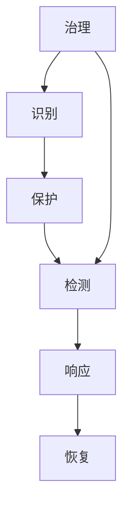

## 网络安全

网络安全保证资产、身份与数据在对抗条件下的保密性、完整性和可用性。买方通常是 CISO、安全运营和合规负责人，成交物是风险下降和可审计证据。

栏目按安全工作的职能与对象划分，并与 NIST CSF 2.0、等保的技术与管理要求对照。身份、密码与架构对应识别和保护；安全运营对应检测、响应与恢复；数据、应用、云和终端是保护对象；治理与合规对应等级保护、关基和个人信息保护义务。模型安全与提示词攻击见 [AI 安全](../../ai/ai-safety.md)。

-   [密码、身份与架构](foundations/index.md)：攻击面、身份、密钥、零信任
-   [安全运营](operations/index.md)：漏洞、检测响应、SOC、威胁情报
-   [数据与系统安全](data-app-cloud/index.md)：数据、应用、云与供应链、终端网络
-   [治理与合规](governance/index.md)：等保关基、个人信息保护、安全采购

## 产品约束

告警分诊看误报率与漏报率，漏洞排序看利用窗口，合规看证据能否被审计接受。Agent 调用安全工具时默认拒绝高危动作，权限按最小权限授予。

身份的工程实现见 [身份认证与权限](../../tech/identity-access.md)。

## 相关阅读

-   [提示词安全](../../ai/prompt-security.md)
-   [AI 安全](../../ai/ai-safety.md)
-   [身份认证与权限](../../tech/identity-access.md)
