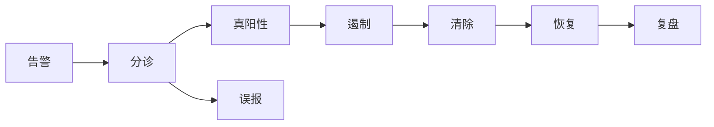

## 检测与响应

检测回答「坏事是否被看见」，响应回答「看见之后能否在损失扩大前停下」。产品若只堆规则、不设计分诊和工作流，运营会关掉告警。

### 核心概念

| 术语 | 含义 | 产品经理要写下的规则 |
| --- | --- | --- |
| **SIEM** | 日志汇聚与关联 | 字段标准、保留周期和查询权限 |
| **EDR / XDR** | 终端或跨层检测 | 隔离主机的权限与误隔离恢复 |
| **SOAR** | 编排自动响应 | 哪些动作可自动，哪些必须人工 |
| **MTTD / MTTR** | 检测与处置平均时间 | 按事件级别分别统计 |
| **漏报演练** | 用红队或原子测试验证规则 | 规则上线必须带测试用例 |

### AI 产品切入点

-   告警摘要、相似事件归并、草稿级调查时间线
-   从自然语言问题生成 SIEM 查询，查询需权限沙箱
-   隔离、封禁、清会话等动作默认建议，执行走 SOAR 审批

### 常见误判

-   用大模型直接对生产执行遏制
-   只优化误报、从不测漏报
-   把聊天流畅度当成检测质量

### 相关阅读

-   [安全运营中心](soc.md)
-   [威胁情报](threat-intelligence.md)
-   [可观测性](../../../tech/observability.md)

## 来源说明

本页把该领域的公开框架转成产品经理可用的判断语言，不替代专业资格或监管解释。

-   NIST SP 800-61 事件响应指南
-   检测工程实践参考 ATT&CK 与各 EDR 厂商公开文档

条文、标准与产品功能以官方文本为准；本页核验日期为 2026-09-04。
