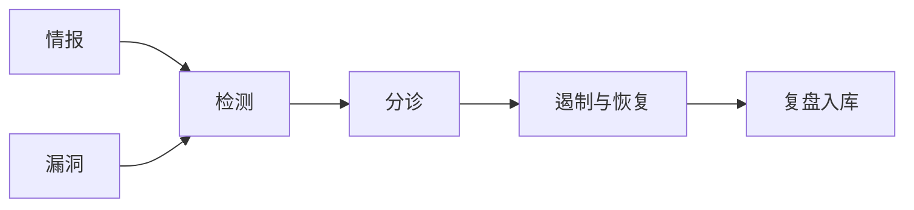

## 安全运营

安全运营把控制从配置变成持续处理事件。价值出现在平均检测时间、修复时间和漏报，而不是功能清单。对应 NIST CSF 的 Detect、Respond、Recover。

-   [漏洞管理](vulnerability-management.md)：发现、分级、修复与例外
-   [检测与响应](detection-and-response.md)：告警、研判、遏制与取证
-   [安全运营中心](soc.md)：班次、分层和工单质量
-   [威胁情报](threat-intelligence.md)：IOC、TTP 与检测规则闭环

## 相关阅读

-   [网络安全](../index.md)
-   [密码、身份与架构](../foundations/index.md)
