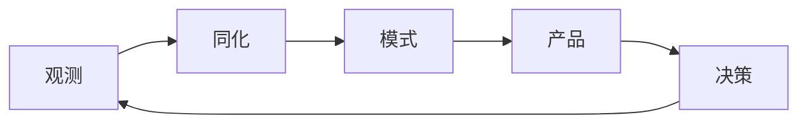

## 地球科学

地球科学把自然系统的观测和数值模拟变成决策输入。输出带时效和不确定性，不能写成确定预言。

划分依据是地球科学学科：大气科学、固体地球科学、水文学、海洋科学。陆地水文学常与水利和地理学交叉，本栏目与海洋科学并列在水圈过程下；遥感、测绘与 GIS 归入地球信息科学；矢量地物如何进库、如何查询归入空间数据库。灾害风险分析跨圈层，地质与地震部分写在固体地球，洪水与台风分别指向水文和大气。

-   [大气科学](atmosphere-climate/index.md)：天气、气候、空气质量
-   [固体地球科学](solid-earth/index.md)：地质矿产、地震与地球物理、灾害风险
-   [水文与海洋科学](hydrosphere-ocean/index.md)：水文与水资源、海洋学
-   [地球信息科学](geospatial/index.md)：遥感、测绘与 GIS、地球观测产品
-   [空间数据库](spatial-database/index.md)：几何类型、空间索引、路网查询与事务

## 产品约束

验收看时效、空间分辨率、校准、空报与漏报。预警要明确发布权限、更正机制和与官方渠道的关系。统计学习可以做临近订正或降尺度，须写清与业务数值模式的衔接。

## 相关阅读

-   [评估与评测](../../ai/evaluation.md)
-   [再保险与精算](../finance/insurance/reinsurance-and-actuarial.md)
