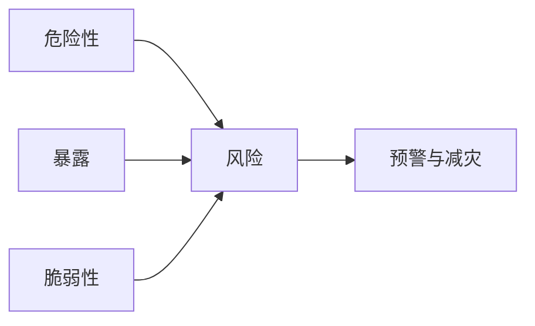

## 灾害风险

风险 ≠ 危险。同样强度的洪水，暴露人口和建筑质量不同，损失完全不同。应急产品还要考虑预警发布、撤离能力和虚假信息。

### 核心概念

| 术语 | 含义 | 产品经理要写下的规则 |
| --- | --- | --- |
| **危险性** | 现象强度与频率 | 图层元数据含重现期 |
| **暴露** | 人、建筑、基础设施 | 数据年份与来源 |
| **脆弱性** | 受损失程度 | 工程与社会脆弱性分开 |
| **能力** | 应对与恢复 | 不可用单一分数掩盖短板 |
| **预警链路** | 从监测到到达人群 | 最后一公里是产品问题 |

### AI 产品切入点

-   多源灾情信息核验
-   影响预估的情景说明
-   救援知识库
-   损失数字标注模型与假设，不作为理赔决定

### 常见误判

-   只画红色危险区不管谁住在里面
-   用生成图像冒充灾区实况
-   预警推送无取消与更正

### 相关阅读

-   [水文与水资源](../hydrosphere-ocean/hydrology.md)
-   [财产险](../../finance/insurance/property-casualty.md)

## 来源说明

本页把该领域的公开框架转成产品经理可用的判断语言，不替代专业资格或监管解释。

-   UNDRR 灾害风险定义与国家应急管理部预警发布规则，以官方文本为准

条文、标准与产品功能以官方文本为准；本页核验日期为 2026-09-04。
