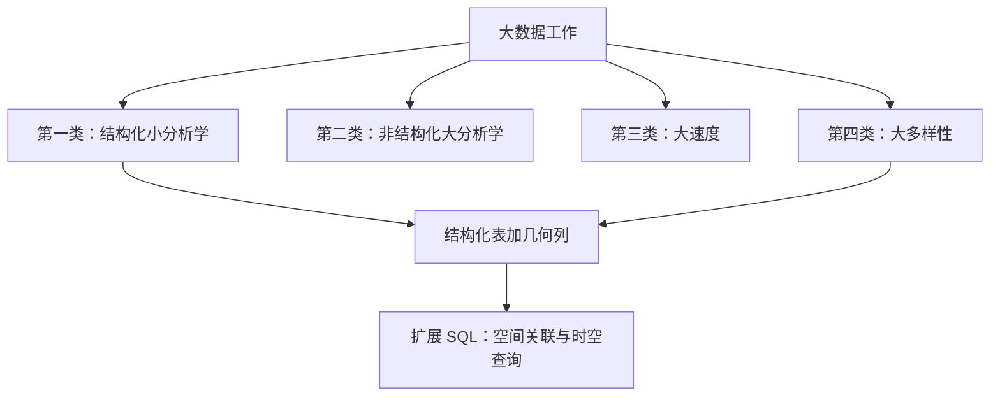
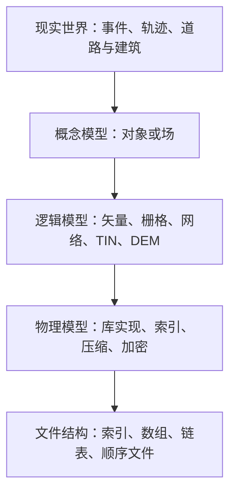
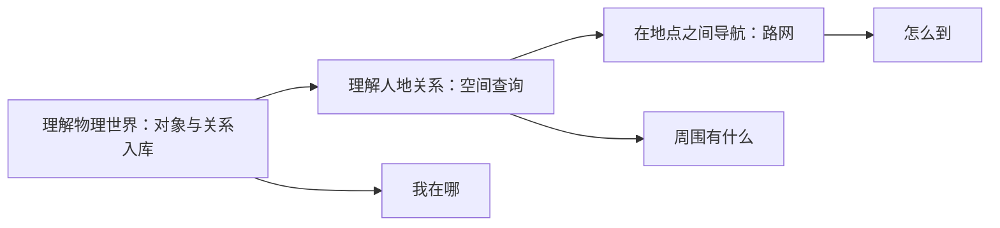
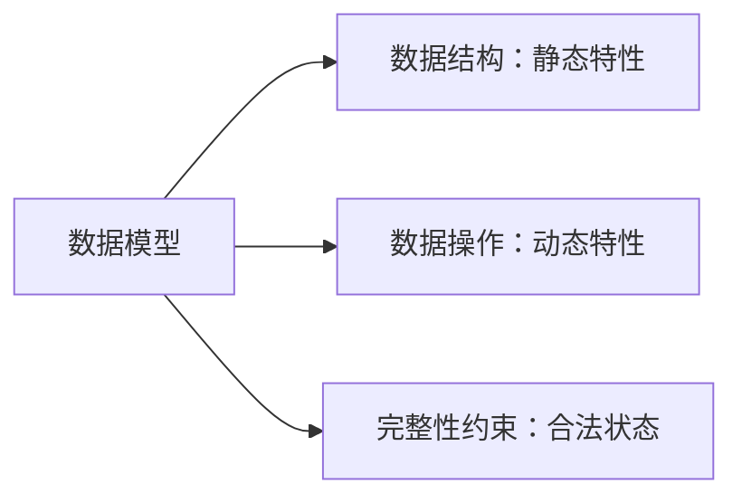
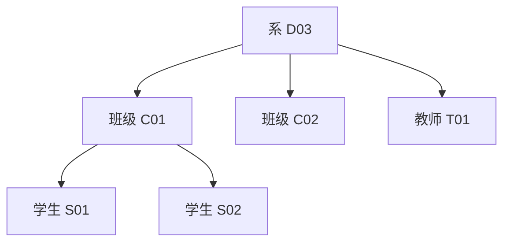
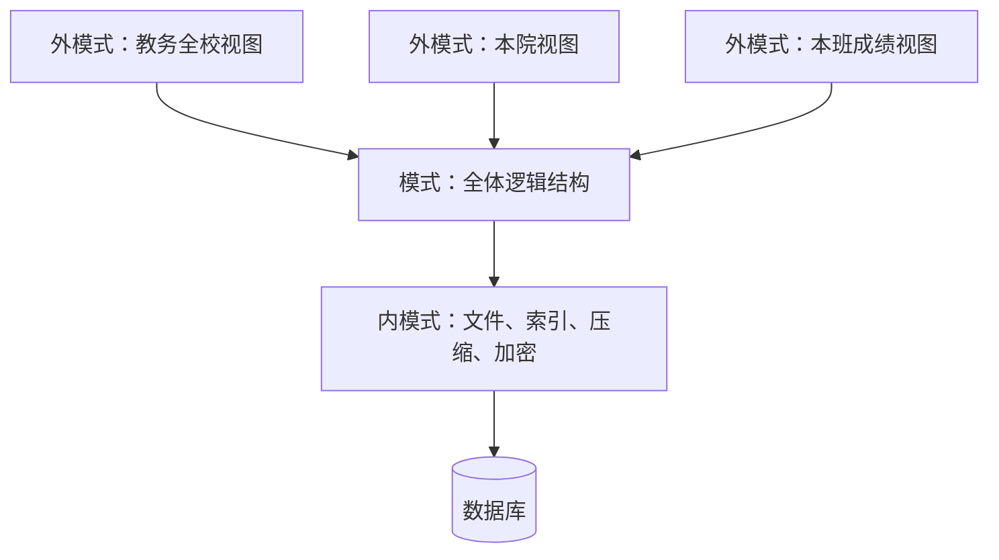
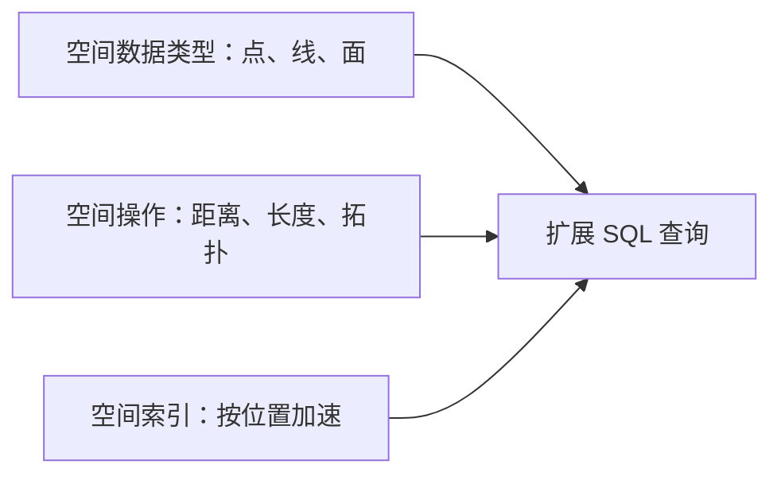
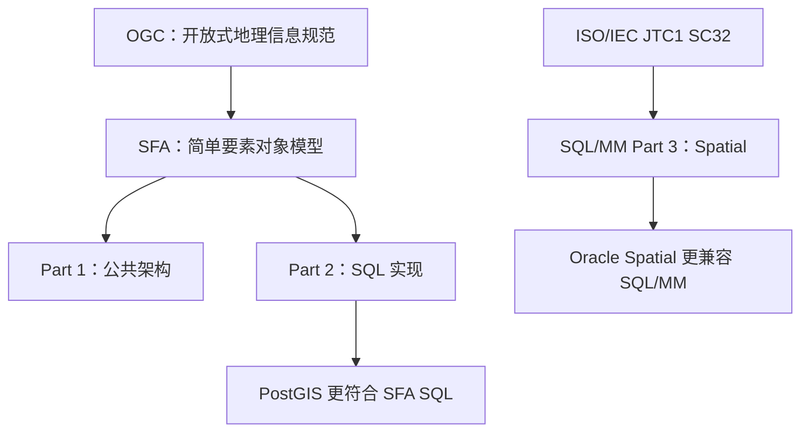

## 地理空间数据库概论

从数据中提取知识，通常经过四件事：**存储**、**管理**、**分析**、**可视化**。存储回答放在哪里、按什么格式；管理回答如何组织；分析把数据关联起来并完成查询；可视化呈现结果。本页钉在数据库这一层：用关系模型表达数据，用关系代数与 SQL 查询，再扩展几何类型与空间索引。

**地理空间数据库**有两句互补的等式。对象是带位置参照的数据，工具仍是数据库管理系统；能力来自在关系或对象关系库上加空间类型、谓词与索引。

> 地理空间数据库 ＝ 地理空间数据 ＋ 数据库管理系统

> 地理空间数据库 ＝ 关系数据库管理系统 ＋ 空间扩展

坐标系、拓扑和法定精度见 [GIS 与测绘](../geospatial/gis-and-surveying.md)。表、事务、索引等通用存储术语见 [数据库与数据存储](../../../tech/databases.md)。本栏目实践栈为 PostgreSQL、PostGIS、pgRouting；函数名与类型名以所安装版本的官方文档为准。


存储、管理、分析、可视化叠成服务链；本页把词汇钉在数据库层，并把几何列视为第一类数据。

## 结构化小分析学与几何多样性

Michael Stonebraker 把大数据工作分成四类。空间数据库落在第一类，并与第四类交汇。Stonebraker 获 2014 年图灵奖。



四类里，空间库反复回到结构化表与几何列的交汇处，用扩展 SQL 做空间关联与时空查询。

**第一类：大数据量、结构化、小分析学。** 数据基本上是表格，例如学生选课记录。没有人对 TB 级表执行 `SELECT *` 再把全部行拉回客户端处理；替代方案是 SQL 的聚集分析，结合 `GROUP BY` 做 `COUNT`、`SUM`、`MAX`、`MIN`、`AVG`。结构化查询在库内完成。原始 GPS 轨迹整表拉回客户端再算，规模上去后不可行。

**第二类：大数据量、非结构化、大分析学。** 文本、社交网络关注关系等无法靠简单的数据库查询得到结论，需要回归、分类、聚类、搜索、推荐等数据挖掘与机器学习方法。本页不展开这一类。

**第三类：大速度。** 电子交易、实时网页广告、实时客户营销、移动社交网络等，数据以低延迟涌入。本页不讲流式引擎。查询一旦进入生产，时空条件必须同时匹配；昨天的位置不得当成现在的位置。

**第四类：大多样性。** 电子表格、网页、XML、关系数据库，以及几何类型。同一套行加列不够用，必须有空间类型、空间谓词和空间索引。

## 空间数据的五层模型

空间数据从现实世界落到磁盘，分成五层。每一层回答的问题不同。中间三层在设计阶段也称为信息 / 概念、表示 / 逻辑、数据库 / 物理。



五层回答空间数据如何从世界落到文件。主线走左侧的矢量：从逻辑层的点、线、面，到物理层的存储与索引，再到文件结构。矢量道路网络另成一条实现主线。栅格、TIN、DEM 不作为本栏目的实现主线。

**现实世界**：新闻事件、人的活动轨迹、城市里的道路与建筑，都带有位置。

**概念模型**（conceptual model）：按用户观点建模，独立于具体 DBMS。空间现象分成两大类。

-   **对象 / 离散要素**（objects, discrete features）：把世界看成可分离的点、线、面，例如车辆、建筑物、地块。
-   **场 / 连续要素**（fields, continuous features）：把空间看成场，例如气温，用传感器采样。

概念模型只说关心什么，不说表怎么建、文件怎么排。

**逻辑模型**（logical model）：把概念落实为可定义的结构，包括矢量、栅格、网络、不规则三角网 TIN、数字高程模型 DEM。

**物理模型**（physical model）：选择何种数据库实现，并决定索引、是否压缩、是否加密。实现落在 PostgreSQL 与 PostGIS。

**文件结构**（binary model）：磁盘上的索引、数组、链表、顺序文件等。

五层模型与后文数据模型三级同构，差别在于：五层在逻辑层显式列出矢量、栅格、网络等空间结构，在最底层多了文件结构这一档。数据模型三级回答一般数据库设计如何把世界抽象到磁盘；三级模式再多一层外模式，回答同一套库如何对程序保持稳定。

## 空间分析与空间计算

有了空间数据，分析分成四类。谓词、九交与 PostGIS 函数的展开见 [几何对象与 PostGIS](04-geometry-and-postgis.md)。

| 类别 | 英文 | 含义 |
| --- | --- | --- |
| 度量 | Measurements | 物理距离、长度、面积、密度 |
| 邻近 | Proximal | 是否在某一距离范围内；例如某辆车 110 米之内是否有人 |
| 拓扑 | Topological | 相等、包含、穿越、相接、相交 |
| 方向 | Directional | 东、南、西、北；导航中的左转、右转 |

四类分析都要求写成可执行的查询。可视化看出密集区；空间统计把热点检测形式化；数据库训练把邻接、包含、接壤写成谓词。

### John Snow 与霍乱地图

1854 年，约翰·斯诺（John Snow）医生把霍乱病例标在伦敦街道图上，标出 Broad Street 水泵附近的爆发热点。不同学科读这张图的方式不同：可视化直接看出密集区；空间统计把热点检测形式化。空间数据库把这类分析写成查询：找出与某口井邻接、或与某郡接壤的几何对象。

### 与 Kidare 接壤的郡

在标准 SQL 上增加空间谓词，直接表达接壤。用户自定义关系例如 `County(name, geom, …)`；骨架是关系数据库提供的 `SELECT`–`FROM`–`WHERE`；空间部分是 PostGIS 的 `ST_Touches`。郡名按材料写作 Kidare。

```sql
SELECT   C1.Name
FROM     County C1, County C2
WHERE    ST_Touches(C1.geom, C2.geom)
         AND C2.Name = 'Kidare';
```

三块缺一不可：自己定义并装入的关系、标准关系查询骨架、空间关系谓词。这三块对应后文空间库三大要素：类型在 `geom` 列里，操作在 `ST_Touches` 里，索引让这类谓词在数据变大后仍跑得动。关系骨架的形式基础见 [关系模型与关系代数](02-relational-model.md)。

### 健康码、ETL 与时空伴随

健康码把空间关联和时空查询收成可检查的条件。关联是对象之间的几何或网络关系；时空查询是时间谓词与空间谓词的合取，缺一不可。

**集中式健康码。** 用户填报个人信息、14 日内中高风险旅居史；手机扫码位置与运营商位置汇总；经 ETL（提取、转换、加载）滤掉无效、过期与脏数据，留下姓名、证件、电话等；服务器做风险评估，加密后下发绿 / 黄 / 红码。一旦出现确诊，在库中查询同一时间段、同一地点的接触者，构建密切接触者画像，再通知检测并对场所封控。叫车时不得把昨天出租车经过的位置当成当前可用车辆。

**分布式暴露通知。** 设备用蓝牙广播每隔约 10–20 分钟更换的随机标识；设备密钥至少约每 24 小时更新。附近设备互相记录标识。确诊者若选择与公共卫生机构共享密钥，其他设备下载后与本地记录核对，按机构设定的参数判断暴露风险并通知。

无论集中还是分布，都依赖位置相关数据的采集、处理与查询。本页关心其中可用关系与空间谓词表达的那一段：时间对且空间对，才构成伴随；时间对、空间不对，或空间对、时间不对，都不是伴随。

### 城市计算与空间计算

把尺度从一次疫情放大到城市，进入 **城市计算**（Urban Computing）。核心问题包括：数据感知与捕获；海量异构数据的管理；异构数据的协同计算；虚实结合的混合式系统。应用包括城市规划与智能交通、环境与能源、社交娱乐与经济、城市安全与应急。空间数据库在这条链条里咬住 **空间计算**：怎样做空间关联，怎样做时空查询。轨迹或站点流量必须同时想时间维。

**空间计算**（Spatial Computing）：一组理念与技术，通过理解物理世界、认识并传达我们与其中地点的关系、并在这些地点之间导航，从而改变生活。拆成三步，并与基于位置服务（LBS）的三问对齐。



三步对应建模、几何查询、网络查询。同一条道路在几何对象模型里是 `LINESTRING`，在空间网络模型里是 `source`–`target`–`cost`。

-   **理解物理世界**：构建空间对象及其关系，把空间数据存进去。对应定位与逆地理编码之前的对象建模。
-   **理解人与地点的关系**：空间查询。例如我在哪、周围有没有车、有没有充电站。对应几何查询与索引。
-   **在地点之间导航**：在道路网络上从当前位置到达目标。对应空间网络模型与 pgRouting。

应用包括：网约车司机知道周围乘客、兴趣点与如何到达目的地；社交网络签到；用 GPS 追踪濒危物种迁徙；精准农业；Google Earth 用于认知邻里与世界；增强现实需要现实坐标与虚拟对象的空间关系。共享单车轨迹用于规划自行车道：北京的规划结果与常识一致，地铁站附近骑行需求更密。空间数据既查询现在在哪，也支撑规划路应该修在哪。店铺点位存在库里之后，还要问怎么分析：邻近、可达、聚集。

## 数据模型

**数据模型**是用来描述数据、组织数据和对数据进行操作的模型。任何一种数据模型都从三方面刻画。



结构、操作、约束要分开指认。只谈表或只谈树，会把静态形状与动态操作、合法状态混在一起。

| 方面 | 对应 | 直观问题 |
| --- | --- | --- |
| 数据结构 | 静态特性 | 行与列；结点与边；键值对；一串字节 |
| 数据操作 | 动态特性 | 按键查找；按列条件找行；取接下来 N 个字节 |
| 完整性约束 | 完整性约束条件 | 所有行必须有相同列数；同一列类型一致；层次模型中一个孩子不能有两个父亲 |

后文每一种具体模型都按这三块讲。

### 概念、逻辑与物理数据模型

**概念数据模型**（conceptual model）独立于计算机系统，按用户观点对某个组织所关心的信息结构建模，是对企业主要数据对象的基本表示与概括性描述，主要用于数据库设计。它强调语义表达，概念应简单、清晰、易懂，是设计人员与用户的交流工具，与 DBMS（Database Management System，数据库管理系统）无关。先画清学生—课程—选课，不必先决定 PostgreSQL 里如何建表。概念模型不能直接 `CREATE TABLE`，必须再转化。

**逻辑数据模型**（logical model）直接面向数据库的逻辑结构，通常配有严格、无二义的语法与语义，用以定义和操纵库中数据，与 DBMS 有关。DBMS 按其所支持的逻辑模型分类。概念模型表示的数据必须转化为逻辑模型，随后在 DBMS 中实现。逻辑模型既面向用户，也面向实现。把 E/R 图转化为关系之后，用 `CREATE TABLE` 落地。换一种 DBMS 所支持的逻辑模型，设计往往要重做一层转换。

**物理数据模型**（physical model）是最底层抽象，描述数据在磁盘或磁带上的存储方式与存取方法，面向计算机系统。每种逻辑模型在实现时都有对应的物理模型；其实现不但与 DBMS 有关，还与操作系统和硬件有关。物理决策影响性能与恢复，但不应绑死应用程序。这正是后面两级映象要隔离的东西。

逻辑模型的历史形态包括：层次模型、网状模型、关系模型、面向对象模型、对象关系模型。更早还有直接基于文件系统的阶段。本栏目逻辑层以关系模型为主，空间扩展落在对象关系（ORDBMS，如 PostGIS）。

三级模式结构与概念 / 逻辑 / 物理数据模型的对应如下。概念数据模型对应设计阶段的 E/R 等；逻辑数据模型对应模式（关系如何定义）；物理数据模型对应内模式（文件、索引、压缩）。三级模式多了一层外模式（视图），解决不同用户看见不同切片，以及逻辑独立性与物理独立性。概念—逻辑—物理回答世界如何被抽象到磁盘；三级模式回答同一套库如何对程序保持稳定。

### 层次模型

**层次模型**的数据结构是树。有且只有一个结点没有父结点，称为根；其余结点有且只有一个父结点。

**操作**：查询、插入、删除、更新。

**完整性约束**：除根外，无父结点则无法插入；删除父结点时同时删除其所有子结点。

学校库是典型例子。系为根，下挂班级与教师；班级下挂学生（学号、姓名、成绩）。例如系 `D03` / `ES`；班级 `C01`（2 人，班长王林）、`C02`（4 人，李平）、`C03`（5 人，张静）；教师 `T01` 林如、`T02` 方达、`T03` 常江；学生如 `S01` 王林 90、`S02` 董华 89、`S03` 王芳 95，按树展开。



层次模型里查询子结点必须经过父结点。优点是一对多描述自然、直观；性能优于关系模型、不低于网状模型；完整性支持较好。缺点是多对多不自然，例如学生与课程的选课；插入删除限制多；查成绩大于 90 的学生，不能直接扫描学生集合，必须系 → 班 → 学生逐层走，上层结点即使与条件无关也要访问。层次命令也趋于程序化。

### 网状模型

**网状模型**的数据结构是图。允许多个结点没有父结点；允许一个结点有多个父结点；允许两结点之间有多种联系（复合联系）。操作仍是查询、插入、删除、更新；作为图，约束比层次模型松。

优点：更直接描述现实，支持多父结点与多对多；存取效率高。

缺点：结构随应用扩大而复杂，最终用户难掌握；**DDL**（Data Definition Language，数据定义语言）与 **DML**（Data Manipulation Language，数据操纵语言）复杂。层次与网状都要求程序员知道沿哪条指针走；关系模型把这条路收进声明式查询。

### 关系模型

与层次、网状相比，关系模型的要点是简单与易访问。

-   **简单**：一个数据库由多个关系组成，每个关系是一张规范化的二维表；表名、列、行与日常表格概念对应。
-   **易访问**：用高级查询语言构造复杂查询。关系查询按表直接选行，无需手写先访父再访子的导航代码。关系代数是该模型的形式基础。主流商品化与开源产品多数是关系数据库管理系统（RDBMS），如 Oracle、MySQL、Microsoft SQL Server、PostgreSQL、DB2。

**埃德加·科德**（Edgar F. Codd）1970 年在《美国计算机学会通讯》（CACM）发表 *A Relational Model of Data for Large Shared Data Banks*，提出关系数据库。科德为 IBM 程序员，1963 年在密歇根大学攻读博士，1967 年回 IBM 做研究，1981 年获图灵奖。IBM 随即基于该思想实现了早期关系数据库系统。SQL 的声明式风格直接来自这一模型：用户说要什么，系统决定怎么走。

关系模型的结构、操作与完整性的展开（域、笛卡尔积、码、三类完整性、关系代数）见 [关系模型与关系代数](02-relational-model.md)。逻辑层以二维表为统一结构，用声明式语言访问。

## 三级模式与两级映象

**模式**（schema）定义或描述一个数据集合，相对稳定，反映结构及其联系。相对的是**数据 / 实例**：某一时刻的状态，变动频繁。记录型如学生姓名、性别、出生年月、籍贯、所在系、入学时间；记录值如陆鸣，男，2005，浙江，计算机系，2023。每年学生实例都在变，模式多年保持稳定。

关系数据库系统的三级模式，自上而下是外模式、模式、内模式；底下才是数据库本身。多个应用通过各自的外模式访问同一套模式。外模式与模式之间的对应、模式与内模式之间的对应分别称为**外模式／模式映象**与**模式／内模式映象**。



一个数据库只有一个模式、一个内模式、多个外模式。两级映象分别保证逻辑独立性与物理独立性。

**模式**（逻辑模式）：用逻辑数据模型对库中全部数据的逻辑结构与特性的描述，是所有用户的公共数据视图。一个数据库只有一个模式。一个 DBMS 可创建多个数据库，一个数据库可创建多个关系。定义模式时要给出：数据项的名字、类型、取值范围；数据之间的联系；安全性与完整性要求。`CREATE TABLE` 写出的就是模式。

**外模式**（子模式、用户模式）：对用户所用到的那部分数据的描述。不同用户需求、保密要求、所用语言允许不同，故外模式不必相同。一个数据库对应多个外模式；外模式是模式的一部分，或由模式推导而来。学校库只有一套模式；教务人员看到全体学生，学院教学秘书看到本院，任课教师看到本班，学生只看到自己的成绩与课程：四个外模式。

**内模式**（存储模式）：用物理数据模型描述存储：B+ 树还是散列、是否压缩、是否建索引、是否加密、如何管理存储等。一个数据库只有一个内模式。内模式的定义与修改是 **DBA**（Database Administrator，数据库管理员）的责任。用户通常只写模式与外模式（视图）；内模式多由系统选择，DBA 再调优。

**外模式／模式映象**：每个外模式对应一个映象，定义通常写在该外模式的描述中。用途是**数据的逻辑独立性**：模式改变时，DBA 改映象，使外模式不变；应用程序按外模式编写，表结构重构时外模式保持稳定。访问所用的属性名、属性个数允许与底层模式不完全相同。

**模式／内模式映象**：定义逻辑结构与存储结构的对应，例如逻辑记录和字段在内部如何表示。该映象唯一，通常包含在模式描述中。用途是**数据的物理独立性**：存储结构变了，例如改为按学号排序存储，或换一种存储结构，DBA 改映象、模式保持不变，应用程序不受影响。

两级映象合在一起：程序既不绑死逻辑表结构的每一次重构，也不绑死文件与索引的每一次更换。外模式相对模式的改变由逻辑独立性覆盖；文件与索引的改变由物理独立性覆盖。视图属于外模式。

### 大学数据库例子

概念模型三个关系：

-   `Students(sid: string, name: string, login: string, age: integer, gpa: real)`
-   `Courses(cid: string, cname: string, credits: integer)`
-   `Enrolled(sid: string, cid: string, grade: string)`

学生关系实例如：sid 53666、Jones、jones@cs、18、3.4；53688、Smith、smith@eecs、18、3.2；53650、Smith、smith@math、19、3.8。

落到三级模式：

-   **模式**：上述三个关系的属性名与类型，`sid` 为字符串，`credits` 为整数等。
-   **内模式**：关系存为无序文件，先到的学生追加在文件后；学生关系的 `sid` 建索引；注册关系的 `(sid, cid)` 建索引。
-   **外模式**：视图 `Course_info(cid, enrollment)`，每门课有多少人注册。

```sql
CREATE VIEW Course_info AS
SELECT cid, Count(*) AS enrollment
FROM Enrolled
GROUP BY cid;
```

视图不存副本，对应外模式：从基表导出、查询时计算。这是外模式由模式推导而来的具体做法。可更新视图的限制在安全与完整性篇展开；本页指认它是外模式、服务于逻辑独立性。

DB-Engines 等流行度排序长期以关系数据库为主，此外有文档模型、键值模型以及多模型系统。本栏目实现栈选 PostgreSQL，因为它既是成熟 RDBMS，又有 PostGIS 空间扩展。

## 空间数据

**空间数据**是以地球表面空间位置为参照的自然、社会和人文经济景观数据。广义上包括文字、数字、图形、影像、声音、视频等，如地名地址、数字高程、矢量地图、遥感影像、地理编码数据、多媒体地图。通常分为矢量数据与栅格数据。判断一条数据是否属于空间数据，看它是否以地球表面空间位置为参照，以及主题落在自然、社会还是人文经济景观。

### 矢量与栅格

**矢量数据**用点、线、面等基本空间要素表示自然世界。不可再分的最小单元现象称为**空间实体**，是对地理实体的抽象，基本类型为点、线、多边形。

| 实体 | 几何 | 典型属性 |
| --- | --- | --- |
| 电线杆 | 点 | 位置、高度 |
| 道路 | 线 | 长度、宽度、起点、终点、等级、车道数 |
| 湖泊 | 多边形 | 周长、面积、水质 |

矢量不仅包含实体的位置与属性，还包含实体间的**空间关系**。本栏目首先指**拓扑关系**（topology）：点、线、多边形之间的空间联系，例如网络结点与网络的枢纽关系、边界线与多边形的构成关系、多边形与岛或内部点的包含关系。道路经交叉口构成道路网络，是空间网络模型的来源。

杆与路的邻近 / 沿路分布、路与湖是否相接或相交、车辆若沿公路移动则位置随时间变化：这些关联要用几何谓词或网络查询写出。属性列上的等值比较覆盖不了拓扑。

**栅格数据**把事物与现象当作连续变量或场，如大气污染、植被覆盖、土壤类型、地表温度。将地面划分为均匀网格，每个网格作为一个像素，位置由行列号确定，像素代码表示属性类型或指向属性记录的指针。数字高程模型（DEM）与遥感影像是典型栅格。本栏目不把栅格查询作为实现主线。

### 空间数据的五特征

由于空间数据的复杂性和特殊性，一般商用 DBMS 难以直接满足空间管理需求。空间数据主要具有以下五特征。空间特征与空间关系特征支撑空间关联；时态特征与多尺度中的时间维支撑时空查询；非结构化特征解释为何需要几何类型与空间索引。

**空间特征**：每个空间对象都有空间坐标，隐含空间分布。点有 \((x,y)\) 或经纬度；线由 \(n\) 个点组成；多边形由封闭环组成。组织数据时必须考虑分布；除属性索引外还要建立**空间索引**。等值 / 范围索引按属性值排序，不能回答附近有什么。必须引入包围盒、填充曲线或 R 树一类结构。该特征支撑空间关联里按位置找对象的那一半。

**非结构化特征**：关系库中的记录通常是结构化的：满足范式，可用固定列的二维表表达。空间实体则不定长、非原子，甚至嵌套：一条弧段可能是两对坐标，也可能是十万对；一个多边形（湖中有岛）含多少条弧段、多少内环事先未知。若建表时把点数定为固定列数，列太多则浪费，列太少则长道路插不进去。因此通用 RDBMS 难以只靠普通列直接管理几何。这也是后面要用几何类型的原因。文本、图片、XML、HTML、音视频一并属于不方便用二维逻辑表表现的非结构化数据；空间几何是其中与本页直接相关的一类。类型系统必须扩展，存储与索引不能再假设定长字段。

**空间关系特征**：空间数据包含坐标与拓扑。拓扑便于查询与分析（几何对象模型、空间网络模型），但给一致性与完整性维护增加复杂性。尤其是有些对象并不直接存坐标，例如拓扑面只记录组成它的弧段标识，查找、显示、分析时要操纵多个文件。关联按相接、包含、穿越判断，属性相等不够。更新一条边界可能牵动多个对象；完整性超出主码 / 外码。该特征直接支撑空间关联。

**时态特征**：状态与演变是空间现象的组成部分。如何组织、管理地理实体随时间变化的信息（时空信息），是空间数据库面临的课题。库不能只保存瞬时快照。若新值覆盖旧值，历史消失，便无法分析变化、更无法预测。地籍变更、环境监测、抢险救灾、交通管理都需要时空信息。车辆须保留从开始到现在的轨迹；覆盖当前点会丢掉历史。用出租车速度评估道路拥堵，必须沿时间组织完整轨迹。只留最后一个点无法区分时段。查询时时间谓词与空间谓词要合取（某路段、某时段的速度），否则会把不同时刻的点混成一次当前拥堵。基表保留历史，当前点用视图或查询得到。

**多尺度特征**：地球系统由不同级别子系统组成，规律与时间尺度差异很大；认知水平、精度、比例尺不同，同一实体的表现形式也不同。

-   **空间多尺度**：根据地学过程或系统中各部分规模，可分为不同层次。道路在小比例尺下是线，在大比例尺下表现为多边形；城市在全国图上是点，在区域图上是面。
-   **时间多尺度**：地学过程具有自然节律，周期长短不一；按天、按小时、按分钟分析，周期不同。

建模时必须声明当前尺度。不同尺度的几何不得混成同一谓词下的同一对象，否则包含、长度的语义会随比例尺偷偷改变。几何不宜当作主码：五特征里的空间特征与多尺度给出理由。相等判断贵，精度与尺度使几何相等不稳定，一般用代理码，几何列另建空间索引。

## 空间数据库、管理系统与系统

**空间数据库**是在地球表面某一范围内、与空间地理相关、反映某一主题信息的数据集合，以空间目标为存储对象。它是 GIS 的核心与基础，用于存储、查询、共享大规模空间数据。要求按一定数据模型组织，冗余较小，独立性与可扩展性较高，并可被多用户共享。例子：国家基础地理信息数据库、资源环境数据库。

相对一般数据库，空间数据库的特点是：数据量大，一个城市可达数十 GB，影像可达数百 GB，常在二维分块或图幅、垂直方向分层来组织；它是空间数据与属性数据的集合；应用广泛，自然、经济、社会信息中约 80% 与地理位置相关，覆盖地理研究、环保、国土、资源开发、市政与交通等。

空间库与通用 DBMS 结合，也与空间应用结合。从类型到语言再到索引的阅读顺序是：抽象几何类型；类型上的操作；用较简单的语言表达查询；实现这些操作的算法；空间索引与存储方法。再往外可接空间连接（例如把车辆关联到所在道路）、代价模型、恢复与安全性、视图（外模式）。

### 三大要素

在常规整数、字符串之外，空间库需要三类能力同时在场。



类型、操作、索引缺任何一项都不构成本页所说的空间库。只有坐标列而没有谓词，分析写不出来；有谓词而没有索引，规模上去后查询回退为全表几何计算。

-   **空间数据类型**：点、线、面等。
-   **空间分析 / 空间操作**：距离、长度、拓扑关系等；仅有相等与比较大小不够。
-   **空间索引**：在性能要求高时，按空间位置加速查找。

Kidare 查询把三要素同时用上了：`geom` 是类型，`ST_Touches` 是操作，数据变大后还要索引。

### 空间数据库管理系统与空间数据库系统

**空间数据库管理系统**（Spatial Database Management System, SDBMS）在 RDBMS 上扩展空间能力。产品包括 Oracle Spatial、PostgreSQL 的 PostGIS、DB2 Spatial Extender 等。主要功能：

-   空间数据的定义与操纵（**SDDL**、**SDML**：在 DDL / DML 前加 S，表示空间）
-   空间数据的组织、存储与管理（存取效率）
-   后台事务管理与运行管理（DBA）
-   数据库的建立与维护

**空间数据库系统**（Spatial Database System, SDS）由空间数据库及其管理软件、应用软件组成，是存储介质、处理对象与管理系统的集合。组成部分：空间数据库、SDBMS、数据库管理员、用户与应用程序。SDBMS 是管数据的那一层软件；SDS 是把库、软件、人与程序算在一起的整系统。二者分指管理层与整系统。

主流实现还包括 SQL Server Spatial、MySQL Spatial，以及 SQLite + SpatiaLite（嵌入式，不是独立服务器）。对象关系扩展完整的栈同时提供类型、方法、GiST、pgRouting；本栏目以 PostgreSQL + PostGIS 为准。

## 空间数据管理的四代

空间数据进入数据库，经历四代。时间轴：20 世纪 70 年代文件系统 → 80 年代文件与关系数据库混合 → 90 年代空间数据引擎 → 21 世纪对象关系数据库。第三代与第四代的分界是分析是否进入内核、是否支持空间结构化查询语言（SSQL）。


四代从专有文件走到库内核里的类型、谓词与索引。本栏目采用第四代融合模式。

### 第一代：文件系统

加拿大政府自 20 世纪 60 年代中期起约十年，研制世界上第一个地理信息系统：加拿大地理信息系统（CGIS）。20 世纪 50–70 年代的第一代空间应用：图形与属性都放在文件系统中，经专有 GIS API、GIS 工具与专有格式访问。无事务、无标准 SQL、共享困难。当时尚无成熟的库托管几何；数据绑在专有格式上，并发、恢复、标准查询都谈不上。

### 第二代：文件与关系数据库混合

20 世纪 80 年代关系数据库成熟。若强行把点线面拆进普通表，常因非结构化导致效率低、不便管理与共享。混合方案是：**文件系统管理几何，关系数据库管理属性，用对象唯一标识符 OID（或内部连接码）关联。** 例如道路名称、长度在关系表中，道路几何仍是文件。这是第二代空间应用。问题在于文件一侧在安全性、一致性、完整性、并发与损坏恢复上功能弱：属性享受 SQL 与事务，几何仍停在第一代的文件世界。

### 第三代：空间数据引擎

关系数据库支持可变长二进制大对象 **BLOB**（binary large object）后，几何作为二进制字段入库。1996 年美国环境系统研究所（ESRI）与 Oracle 合作开发空间数据引擎（Spatial Database Engine，SDE，后称 ArcSDE）：坐标由 DBMS 以二进制存储，SDE 提供转换、索引调度与存储管理函数。同类还有 SuperMap SDX、中地 MapGIS SDE、开源 TerraLib。第三代把存储放进关系数据库，解析与分析仍在库外引擎。中间件独立于数据库内核，难以利用成熟的事务与访问技术，不支持空间结构化查询语言（SSQL），且厂商格式各异。几何进入库、可备份可并发；查询语言仍到不了 `WHERE ST_Touches(...)` 这一层，优化器看不到几何语义。这一代称为**寄生模式**。

### 第四代：对象关系型数据库管理系统

**对象关系型数据库管理系统**（ORDBMS）支持 SQL，又具面向对象特性，直接存储和管理非结构化空间数据。代表：Oracle Spatial、IBM DB2 Spatial Extender、微软 SQL Server Spatial、开源 PostGIS。ORDBMS 提供类与继承，以及用户自定义类型、函数、索引和规则；对空间对象、操作函数与索引预先定义，形成空间数据类型，支持存储、管理与分析。此时空间数据类型、空间索引、空间算子都在库内，用**扩展 SQL（SSQL）**在库内完成存储与分析。这是三大要素真正同时落在内核里的一代，称为**融合模式**。

### 寄生模式与融合模式

| 项目 | 空间数据引擎：寄生 | 对象关系空间数据库：融合 |
| --- | --- | --- |
| 技术 | 中间件 | 数据库内核扩展 |
| 代表 | ArcSDE；SuperMap SDX；MapGIS SDE；TerraLib | Oracle Spatial；DB2 Spatial Extender；PostGIS |
| 优点 | 可跨多种 RDBMS；与特定 GIS 平台结合紧；空间处理效率高 | 利用 RDBMS 内核；存储效率较好；支持扩展 SQL；较易共享与互操作 |
| 缺点 | 难用内核技术；难支持扩展 SQL；难共享互操作 | 面向层的空间处理性能与引擎相比仍有差距 |

本栏目站在融合模式：查询写在 SQL 里，让优化器与索引参与。把几何当不透明 BLOB 拖出库外，优化器看不到几何语义。SDE 属于第三代引擎。

## 空间数据库标准

没有单一的 SDB 标准，各 SDBMS 有所取舍。两个主要来源是 OGC 的 SFA SQL 与 ISO/IEC 的 SQL/MM。二者公共接口已相互兼容，覆盖面与概念界定有差异。



SFA 给出几何对象与 SQL 绑定；SQL/MM 另覆盖拓扑与网络。产品按取舍实现，能力清单并不逐项对齐。

### SFA SQL

**SFA SQL** 是开放地理空间信息协会（Open Geospatial Consortium, **OGC**）的《地理信息简单要素的 SQL 实现规范》（Simple Feature Access SQL）。OGC 研制开放式地理信息规范（Open Geographic Information Specifications, OGIS），使异构地理数据与处理资源能在网络中透明共享。

SFA SQL 于 1999 年提出，规定点、线、多边形等简单要素的对象模型及发布、存储、读取接口。2005 年细化为简单要素访问规范（Simple Feature Access, SFA）1.1.0，加入**注记文字**（Annotation Text）。规范分两部分：

-   **Part 1 Common Architecture**：定义平台无关的几何对象通用架构、不同表达方式与空间参考系统。基类 Geometry 下有 Point、Curve、Surface、GeometryCollection 等子类；每个几何对象关联一个空间参考系统。
-   **Part 2 SQL Option**：定义该模型在数据库中的实现，给出内模式下几何类型（Geometry Type）的定义，并规定经由 SQL 调用级接口存储、检索、查询与更新要素集合。

2006 年 10 月推出 SFA 1.2.0，并被 ISO/TC 211 吸纳为 ISO 19125 系列。现行实现规范为 SFA 1.2.1（OGC 06-103r4 / 06-104r4）。几何层次、WKT / WKB 与 `ST_` 方法，就是把 Part 1 的对象模型落到 Part 2 的 SQL 实现上。SFA 同时给出对象模型、SQL 实现与注记文字；PostGIS 更靠近这一套。

### SQL/MM

**SQL/MM** 是国际标准化组织 / 国际电工委员会第一联合技术委员会数据管理和交换分技术委员会（ISO/IEC JTC1 SC32）的 SQL 多媒体及应用包第三部分（SQL Multimedia Part 3: Spatial, **SQL/MM**）。ISO/IEC JTC1 负责系统与工具的规范、设计与开发，覆盖信息的采集、表示、处理、安全、传送、交换、显示、管理、组织、存储和检索等。SQL/MM 第三部分把矢量数据当作多媒体的一类，规定如何存储、获取和处理。

### 两个标准的差异与产品对应

-   **SFA SQL** 在标记文本类型、空间数据存储实现上更宽泛。
-   **SQL/MM** 还涉及 SFA SQL 当时尚未覆盖的拓扑数据结构、网络模型。

结果是：产品选择不同标准或做不同兼容。**PostGIS 更符合 SFA SQL**，本身也是开源实现；**Oracle Spatial 更兼容 SQL/MM**。本栏目随 PostGIS，几何层次与 `ST_` 函数风格按简单要素理解；拓扑网络则用图模型与 pgRouting 处理，不假设 SQL/MM 拓扑类型已经在库中。没有统一的 SDB 标准，是各 SDBMS 能力清单并不逐项对齐的原因。

## 名词缩写

缩写前加 S 通常表示空间。

| 缩写 | 含义 |
| --- | --- |
| DBMS | 数据库管理系统 |
| RDBMS | 关系数据库管理系统 |
| SDBMS | 空间数据库管理系统 |
| ORDBMS | 对象关系数据库管理系统 |
| SDS | 空间数据库系统 |
| DDL / DML | 数据定义语言 / 数据操纵语言 |
| SDDL / SDML | 空间数据定义 / 操纵语言 |
| SQL / SSQL | 结构化查询语言 / 空间结构化查询语言 |
| SDB | 空间数据库 |
| DBA | 数据库管理员 |
| SDE | 空间数据引擎 |
| OGC | 开放地理空间信息协会 |
| SFA | 简单要素访问（Simple Feature Access） |
| OID | 对象唯一标识符 |
| BLOB | 二进制大对象 |
| TIN / DEM | 不规则三角网 / 数字高程模型 |
| WKT / WKB | 熟知文本 / 熟知二进制 |

贯穿词是**空间关联**与**时空查询**。空间库与关系库的差别至少从数据模型（Geometry 层次、九交、网络）、设计、索引、查询优化、完整性五方面取差；本页先负责数据模型这一截。

???+ note "版本与函数名"
    函数名、类型名和拓扑接口以所安装版本的官方文档为准。

    公开地图精度、审图和涉密地理信息仍按测绘与地图管理规则；本页不替代资质成果。

## 相关阅读

-   [空间数据库](index.md)
-   [关系模型与关系代数](02-relational-model.md)
-   [几何对象与 PostGIS](04-geometry-and-postgis.md)
-   [GIS 与测绘](../geospatial/gis-and-surveying.md)
-   [数据库与数据存储](../../../tech/databases.md)

## 来源说明

本页根据对象关系数据库、OGC 简单要素和 PostGIS 的公开规范整理，并对照 Silberschatz、Korth 与 Sudarshan《Database System Concepts》第七版第 1.1–1.14 节，以及程昌秀《空间数据库管理系统概论》第 1.1–1.6 节。函数名、隔离级别和拓扑接口以所安装版本的官方文档为准。

-   Abraham Silberschatz, Henry F. Korth, S. Sudarshan, *Database System Concepts*, 7th ed., McGraw-Hill, 2020。重点参见第 1 章：数据模型、三级模式、两级映象、关系模型与数据库系统结构。
-   程昌秀，《空间数据库管理系统概论》，科学出版社。重点参见第 1.1–1.6 节：空间数据、五特征、SDBMS / SDS、四代管理技术、SFA 与 SQL/MM。
-   Edgar F. Codd, [A Relational Model of Data for Large Shared Data Banks](https://dl.acm.org/doi/10.1145/362384.362685), *Communications of the ACM*, 1970。访问日期：2026-09-04。
-   [OGC Simple Feature Access — Part 1: Common Architecture](https://www.ogc.org/standards/sfa/)，现行实现规范 [06-103r4（SFA 1.2.1）](https://docs.ogc.org/is/06-103r4/06-103r4/pdf)。访问日期：2026-09-04。
-   [OGC Simple Feature Access — Part 2: SQL Option](https://www.ogc.org/standards/sfs/)，现行实现规范 [06-104r4（SFA 1.2.1）](https://docs.ogc.org/is/06-104r4/06-104r4/pdf)。访问日期：2026-09-04。
-   [PostGIS](https://postgis.net/) 与 [官方文档](https://postgis.net/documentation/)；手册见 [postgis.net/docs](https://postgis.net/docs/)；`ST_Touches` 见 [函数参考](https://postgis.net/docs/ST_Touches.html)。访问日期：2026-09-04。
-   ISO 19125 系列（Simple feature access）与 ISO/IEC 13249-3（SQL/MM Part 3: Spatial），以 ISO 官方文本为准。

条文、标准与产品功能以官方文本为准；本页核验日期为 2026-09-04。
