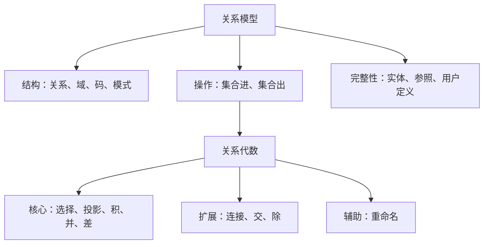
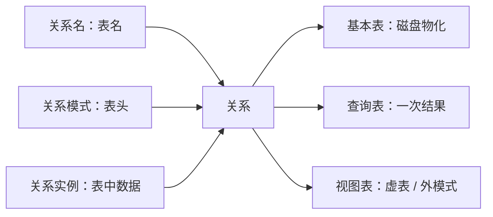
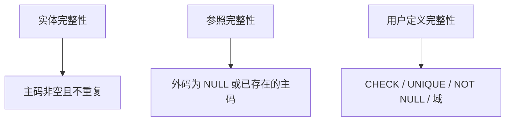
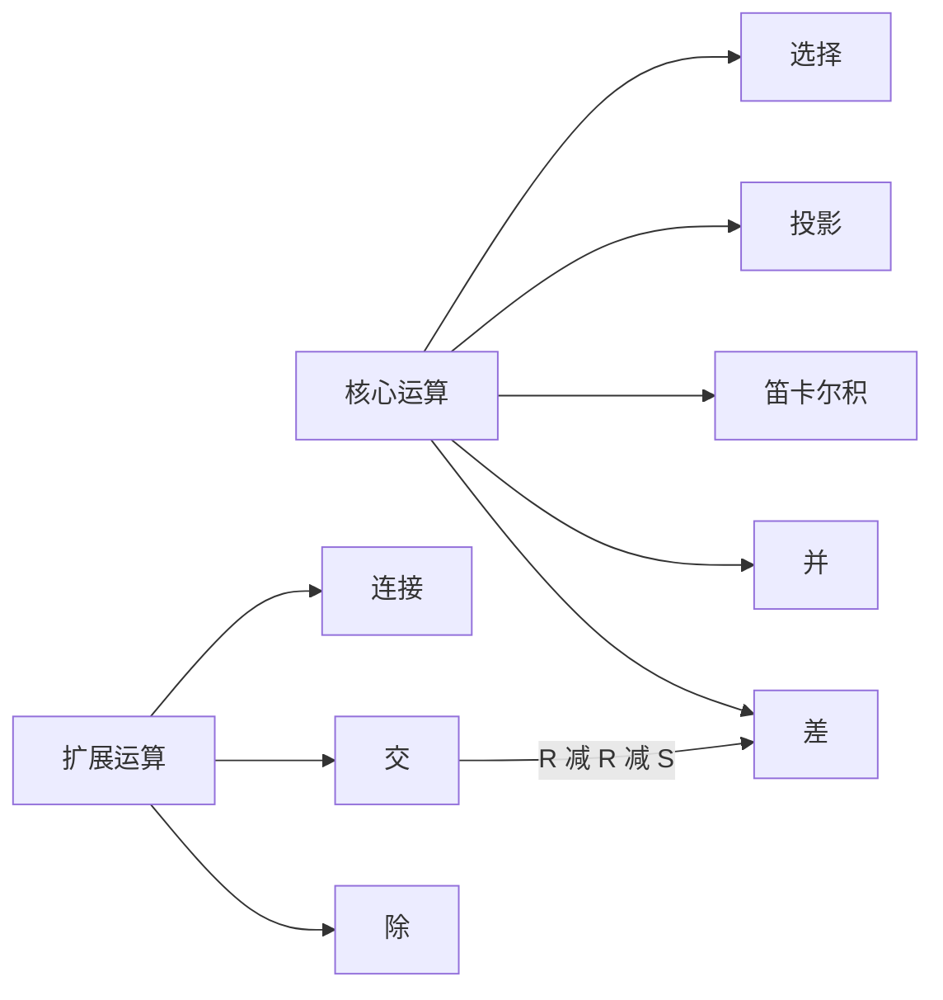
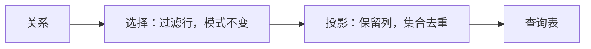
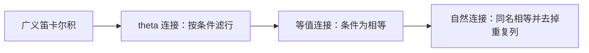
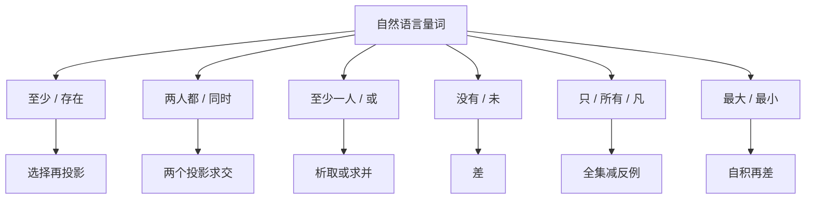
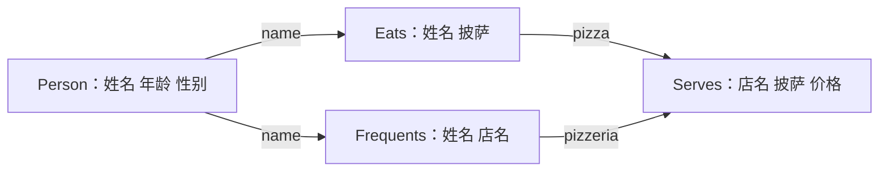

## 关系模型与关系代数

[空间数据库](index.md) 栏目从关系代数与 SQL 起线。[概论](01-overview.md) 已把关系模型放进概念、逻辑、物理与三级模式。[数据库与数据存储](../../../tech/databases.md) 给出表、主键、事务等产品术语。本页把关系拆成结构、操作与完整性约束，再用关系代数把查询写成集合表达式。[SQL](03-sql.md) 是同一套运算的可执行语言。

关系代数给出查询的演算形式。[SQL](03-sql.md) 的 `SELECT`、`FROM`、`WHERE` 对应投影、积与选择；连接、去重、空值与全称量词各有落点。几何类型与空间谓词见 [几何对象与 PostGIS](04-geometry-and-postgis.md)。

关系模型的三块决定表长什么样、如何查询更新、何种表合法。关系代数把查询写成对关系的运算；运算对象是关系，运算结果仍是关系。

## 关系模型

关系模型与一般数据模型相同，由三部分组成。

| 组成部分 | 回答的问题 |
| --- | --- |
| 关系数据结构 | 世界用什么形状来装；一律是关系 |
| 关系数据操作 | 如何查询与更新；集合进、集合出 |
| 关系完整性约束 | 什么样的表合法；实体、参照、用户定义三类 |

层次、网状模型用指针表示实体间联系。关系模型用关系与外码表示同一引用：选课元组上的学号对应该学生元组，查询沿属性值匹配，不沿树或图导航。

### 关系数据结构

#### 关系作为唯一构造

在关系模型中，实体与实体间的联系一律用关系表示。学生、课程是实体，选课是联系，三者都是表。从用户角度看，数据的逻辑结构是一张非嵌套的二维表。表由三部分构成：表名、表头、数据。

**第一范式**（first normal form, 1NF）：属性取原子值，不允许列表、集合或再嵌一张表。出生年月下再嵌年、月两列，不满足 1NF，须拆成独立属性。

空间数据具有非结构化特征：几何不定长、可嵌套。普通关系仍要求原子属性；几何放到几何类型中，见 [几何对象与 PostGIS](04-geometry-and-postgis.md)。

#### 域与笛卡尔积

**域**（domain）：一组具有相同数据类型的值的集合。整数、实数都是域，对应程序语言中的数据类型，如 C 语言的 `int`、`float`。

**笛卡尔积**（Cartesian product）：给定一组域 $D_1,D_2,\ldots,D_n$，

$$D_1\times D_2\times\cdots\times D_n=\{(d_1,d_2,\ldots,d_n)\mid d_i\in D_i,\ i=1,2,\ldots,n\}.$$

每个元素 $(d_1,\ldots,d_n)$ 称为 **$n$ 元组**（n-tuple），简称**元组**（tuple）；其中每个 $d_i$ 称为**分量**（component）。

设 $D_1=\{A,B,C,D\}$，$D_2=\{1,2,3,4,5\}$，则 $D_1\times D_2$ 有 $4\times 5=20$ 个元组：$(A,1),\ldots,(A,5),\ldots,(D,5)$。数据库中一行即一个元组。

笛卡尔积给出全部组合。真实的关系是笛卡尔积的一个有限子集，只保留实际出现、且满足完整性约束的那些元组。后文广义笛卡尔积 $R\times S$ 把两个关系的元组两两拼接，是连接运算的起点。

查询的直觉图像：先把参与的关系做笛卡尔积，再过滤不满足条件的行。

#### 属性、码、模式与实例

-   **属性**（attribute）：关系中的一列。
-   **域**：属性的取值范围。年龄属性的域为整数。
-   **候选码**（candidate key）：唯一确定一个元组的最小属性集合，简称码（key）。最小指去掉其中任一属性后，剩余属性不再唯一标识元组。一个关系可以有多个候选码。学生关系中身份证号与学号都可以是候选码。
-   **分量**：元组中的一个属性值。
-   **关系模式**（relation schema）：对关系的描述，一般写作关系名(属性 1, 属性 2, …, 属性 $n$)，记 $R(A_1,A_2,\ldots,A_n)$。
-   **关系实例**（relation instance）：关系在某一时刻的内容。

一个关系由关系名、关系模式和关系实例组成，分别对应于表名、表头和表中的数据。名与模式相对稳定，实例随时间变化：每年学生行都在变，学号、姓名、性别这些列可以多年不变。创建关系是在指定关系名与各属性之域；插入一行是在追加实例。

地理信息系统专业学生表的关系模式写作

$$\mathrm{学生}(\mathrm{学号},\ \mathrm{姓名},\ \mathrm{性别},\ \mathrm{类(专业)},\ \mathrm{成绩},\ \mathrm{学分}).$$

实例中有学号、姓名、性别、专业等行，例如 3200644001、徐绮阳、女、地理信息系统。模式是结构，实例是某一时刻填进去的值。

**`NULL`**：表示 unknown 或 undefined。

#### 基本表、查询表与视图表

关系可以有三种类型。

1. **基本关系**（基本表、基表）：实际存在、在磁盘上存储数据的逻辑表示。`CREATE TABLE` 得到的是基本关系。
2. **查询表**：一次查询结果对应的表，查询结束后不再作为持久对象存在。
3. **视图表**：由基本表或其他视图表导出，是虚表，不对应实际存储的数据，对应 [概论](01-overview.md) 中的外模式。

三者的模式都可以写成 $R(A_1,\ldots,A_n)$；差别在于实例从哪里来、是否物化。[SQL](03-sql.md) 的 `CREATE VIEW` 定义视图表；`SELECT` 的中间结果是查询表。

名与模式相对稳定，实例随更新变化。三种类型共享同一套模式写法。

#### 选课库上的码

贯穿后文的选课库：

-   $\mathrm{Students}(\underline{\mathrm{sid}},\ \mathrm{name},\ \mathrm{GPA})$
-   $\mathrm{Courses}(\underline{\mathrm{cid}},\ \mathrm{cname},\ \mathrm{credits})$
-   $\mathrm{Enrolled}(\underline{\mathrm{sid}},\ \underline{\mathrm{cid}},\ \mathrm{grade})$

学号可以作学生关系的码，单独作选课关系的码不够：同一学生可选多门课。选课的码是 $(\mathrm{sid},\mathrm{cid})$。本页暂不考虑同一门课重修两次。

实例：学生 $101$ Bob、$123$ Mary；课程 $564$、$308$；选课只有 $(123,\ 564,\ A)$。

模式是库中关系的结构描述；数据库是关系的集合；关系是一组属性；实例是实际存储内容；元组是各属性取值的组合；属性属于某一类型或域；码是唯一标识元组的属性或属性集合。

### 关系数据操作

关系操作是集合操作：对象与结果都是集合。非关系数据模型往往一次一记录，程序员沿着指针走下一行；关系模型对外集合进、集合出，内部实现仍可按行处理。

常用操作分两类。

-   **查询**：选择、投影、连接、除、并、交、差。查询运算是主体。
-   **更新**：插入、删除、修改。

关系数据语言三类。

1. **关系代数语言**：用对关系的运算表达查询。
2. **关系演算语言**：用谓词表达查询。
3. **SQL**：介于代数与演算之间。本页先把代数算准，再进入 [SQL](03-sql.md)。

集合不含重复元素。本页关系代数按集合语义理解，并、投影都自动去重。SQL 默认是包（bag / multiset）语义，允许重复行。代数里先按集合想，写 SQL 时再使用 `DISTINCT`。分界在下文集合语义与包语义一节。

### 关系完整性约束

完整性规则是对关系的约束条件，分三类。

1. 实体完整性（entity integrity）
2. 参照完整性（referential integrity）
3. 用户定义完整性

实体完整性与参照完整性是关系模型的不变性，由 RDBMS 自动支持；用户定义完整性按应用添加。层次、网状用指针表示联系；关系模型把引用写成外码列上的值。

#### 实体完整性

**实体完整性**：基本关系的**主码**（primary key）上，任何元组不得取空值 `NULL`。

-   **候选码**可以有多个，例如身份证号、学号。
-   **主码**从候选码中指定一个。
-   主码不得为 `NULL`，也不得重复。重复或空的主码使两个元组无法区分。学生必须有学号。

主码是关系内部的约束。有了主码，多重集在码投影上变成集合：两行在码上相等，则必须是同一元组。

#### 参照完整性

参照完整性刻画关系之间的引用。选课关系中的学号必须来自学生关系中已存在的学号。被引用一侧是主码或 `UNIQUE` 列；引用一侧称为**外码**（foreign key）。

外码要么取 `NULL`，要么取被参照关系中已存在的主码或 `UNIQUE` 值。`Enrolled.sid` 参照 `Students.sid`，`Enrolled.cid` 参照 `Courses.cid`。选课实例里不得出现学号 $124$，也不得出现课程号不在课程表中的行。

在本例中，选课的学号、课程号还不允许为空：用户定义完整性叠加上去，禁止不知道是谁选的课、选了一门未知的课。参照完整性允许外码为 `NULL`，表示尚未确定参照谁；具体模式可以再用 `NOT NULL` 禁止空值。

下列状态都破坏参照完整性：选课出现学号 $201$（学生表没有）；把课程号改成库中不存在的 $405$；把学生 $123$ 改成 $102$ 而选课仍引用 $123$；删掉仍被选课引用的学生 $123$。插入、删除、更新如何处理这些冲突，见 [SQL](03-sql.md) 的 `RESTRICT` / `CASCADE` / `SET NULL`。本页要求指出哪条约束被破坏。

#### 用户定义完整性

用户定义完整性针对某一具体应用的语义约束。课程(课程号, 课程名, 学分) 上常见规则：

-   课程号属性必须取唯一值；
-   非主属性课程名不得取空值；
-   学分属性的取值集合为 $\{1,2,3,4\}$。

年龄大于 0、性别取值集合、姓名长度、GPA 范围、学号位数等均可作为用户约束。[SQL](03-sql.md) 用 `NOT NULL`、`UNIQUE`、`CHECK`、`DEFAULT`、`CREATE DOMAIN` 写出这些规则。

| 类型 | 作用范围 | 典型规则 | 由谁支持 |
| --- | --- | --- | --- |
| 实体完整性 | 一个基本关系内部 | 主码非空、不重复 | RDBMS 自动 |
| 参照完整性 | 两个关系或自参照之间 | 外码为 NULL 或已存在的主码 / UNIQUE | RDBMS 自动 |
| 用户定义完整性 | 应用语义 | 取值集合、非空、范围 | 按应用声明 |

实体与参照由系统强制；用户规则按应用声明。实现机制见 [安全与完整性](10-security-and-integrity.md)。

## 关系代数

关系代数是一种抽象查询语言，用对关系的运算表达查询。三要素：运算对象是关系，运算结果是关系，运算符分四类。

| 类别 | 作用 |
| --- | --- |
| 集合运算符 | 把关系看成元组的集合，从行的方向运算 |
| 专门的关系运算符 | 同时涉及行与列 |
| 算术比较符 | 辅助专门运算；$>$、$\ge$、$<$、$\le$、$=$、$\neq$ |
| 逻辑运算符 | 辅助专门运算；非 $\lnot$、与 $\land$、或 $\lor$ |

集合运算：并 $\cup$、差 $-$、交 $\cap$、广义笛卡尔积 $\times$。专门运算：选择 $\sigma$、投影 $\pi$、连接 $\bowtie$、除 $\div$。比较与逻辑用于写选择、连接条件。$\lnot$、$\land$、$\lor$ 只出现在选择条件或连接条件里。辅助操作还有重命名 $\rho$。

写表达式的常规步骤：选定需要哪些关系；做笛卡尔积或自然连接；按条件选择；再投影出题目要的列。一行上的 $\land$ 只判断单行条件。两个都、只有、所有、没有要用交、差把两个集合组合起来，见披萨店练习。

### 运算符与核心扩展

运算分成三档。

-   **核心**：关系、选择、投影、笛卡尔积、并、差。
-   **扩展**：连接（自然连接、等值连接、theta 连接）、交、除。
-   **辅助**：重命名。

扩展运算由核心运算写出。交的构造：$R\cap S=R-(R-S)$。除由核心运算表达；本页建立集合含义即可。

SQL 的排序、包语义、聚集、空值三值逻辑在代数中没有一一对应的符号，对照见 [SQL](03-sql.md)。关系代数不规定元组顺序、不保留重复、不含聚集。

核心五元构成完备集。交由差构造。连接在语义上等于积再选择。

### 集合语义与包语义

标准关系代数采用 **set 语义**：结果中没有重复元组。教材上的代数表达式默认按集合理解。并、交、差、投影都去重。例如年龄列 20、19、19，投影后只剩两行。

SQL 与扩展关系代数采用 **bag**（multiset，包）语义：允许重复行，另用去重、分组聚集、排序等扩展。实现默认按包理解。表是具有模式所规定属性的元组多重集。

> Every paper will assume set semantics; every implementation will assume bag semantics.

本页表达式默认无重复。从 [SQL](03-sql.md) 起，未加主码等约束时，表里允许重复行；加上主码等约束后，码投影上才变回集合式的关系。SQL 默认不去重，需要时显式写 `DISTINCT`。SQL 的 `UNION` / `INTERSECT` / `EXCEPT` 默认去重，保留重复须加 `ALL`。写表达式前先确定要的是代数还是 SQL，从而决定去不去重。

???+ note "集合语义与包语义"
    本页关系代数按集合理解：并、交、差、投影都去重。

    [SQL](03-sql.md) 默认按包理解：投影不去重，需要时写 `DISTINCT`。

    SQL 的 `UNION`、`INTERSECT`、`EXCEPT` 默认去重，保留重复须加 `ALL`。

### 并、交、差与广义笛卡尔积

参与并、交、差的两个关系必须属性个数相同、对应属性定义域相容。属性名也要对齐；属性名不同则先重命名。每个元组是集合中的一个元素。广义笛卡尔积对两侧模式没有相同约束。

设

$$
\begin{align*}
R&=\{(a_1,b_1,c_1),\ (a_1,b_2,c_2),\ (a_2,b_2,c_1)\},\\
S&=\{(a_1,b_2,c_2),\ (a_1,b_3,c_2),\ (a_2,b_2,c_1)\}.
\end{align*}
$$

-   **并** $R\cup S$：两关系元组合在一起并自动去重。$R$ 三行、$S$ 三行，公共行 $(a_1,b_2,c_2)$ 与 $(a_2,b_2,c_1)$ 各只保留一次，结果为 4 行：再多一行 $(a_1,b_3,c_2)$。
-   **交** $R\cap S$：同时出现的行：$(a_1,b_2,c_2)$、$(a_2,b_2,c_1)$。
-   **差** $R-S$：在 $R$ 中而不在 $S$ 中：仅 $(a_1,b_1,c_1)$。$R$ 的后两行分别与 $S$ 中元组相同，被减掉。差不满足交换律：$S-R$ 只留下 $(a_1,b_3,c_2)$。
-   **广义笛卡尔积** $R\times S$：$R$ 的每一行与 $S$ 的每一行拼接。3 行 $\times$ 3 行 = 9 行；结果前一组属性来自 $R$，后一组来自 $S$。即使两侧有同名属性，积也全部保留，两套列并排，不做相等过滤、不去掉重复列。

并、交、差都去重。这与后面投影只保留一列年龄时三个 19 岁变成一个 19 是同一条集合公理。

空关系参与运算：$R\cup\emptyset=R$，$R\cap\emptyset=\emptyset$，$R-\emptyset=R$，$\emptyset-R=\emptyset$，$R\times\emptyset=\emptyset$。最后一条在 SQL 里表现为：`FROM` 列表中只要有一张空表，笛卡尔积为空，后面的选择、投影都作用在空关系上。

### 选择与投影

选择、投影、连接、除构成表的代数。选择与投影是一元运算；连接与除是二元运算。

**选择**（selection）：从关系中选若干行，针对单个关系，属于一元运算符。从学生关系 $S$ 中选年龄大于 19 的学生：

$$\sigma_{\mathrm{Sage}>19}(S).$$

下标是条件，只有满足条件的元组进入结果。结果仍是关系，模式与 $S$ 相同。条件可用比较与逻辑组合，例如 $\mathrm{Sage}>19\land\mathrm{Ssex}=\text{女}$。选择不增加、不删除列，只过滤行。

**投影**（projection）：从关系中选若干列。取姓名与年龄：

$$\pi_{\mathrm{Sname},\ \mathrm{Sage}}(S).$$

未列出的列不出现在查询表中。结果的模式由投影列表决定。

只投影年龄。$S$ 中年龄列为 20、19、19 时，投影 $\pi_{\mathrm{Sage}}(S)$ 之后，按集合语义只剩两行：20 与 19，重复的 19 被去掉。集合不含重复元素。这是 set 与 bag 的第一处落点。

选择与投影一般不交换：

$$\sigma_c(\pi_{A_1,\ldots,A_n}(S))\ \stackrel{?}{=}\ \pi_{A_1,\ldots,A_n}(\sigma_c(S)).$$

比较 $\sigma_{\mathrm{Sage}<20}(\pi_{\mathrm{Sno},\mathrm{Sname}}(S))$ 与 $\pi_{\mathrm{Sno},\mathrm{Sname}}(\sigma_{\mathrm{Sage}<20}(S))$。先投影 $(\mathrm{Sno},\mathrm{Sname})$，结果中已无年龄列，无法再按年龄选择，左边不可执行。右边先选出年龄小于 20 的行，再投影学号与姓名，结果正确。写查询时先选择、再投影。

选择条件里用到的属性必须还在关系中。先投影掉年龄列之后，按年龄选择无定义。[空间查询处理](08-query-processing.md) 把选择下推到叶端、把投影尽早做以减少中间列：那是代价层面的变换，前提仍是选择条件里用到的属性还在关系中。本页的先选择再投影是语义正确性。

先确定要哪些行，最后再决定留哪些列。投影按集合去重。

### 连接

连接从两关系的笛卡尔积中选取属性间满足一定条件的元组，记为 $R\bowtie_{\theta}S$。条件一般形式为 $A\theta B$，$\theta\in\{=,{>},{\ge},{<},{\le},{\neq}\}$；$A$ 是 $R$ 的属性或常数，$B$ 是 $S$ 的属性或常数，$A$ 与 $B$ 必须同一定义域。逻辑运算符构成复合条件。

执行顺序的直觉：先做 $R\times S$，再对每一行判断条件，满足则保留。这只是语义模型，优化器的真实计划见 [空间查询处理](08-query-processing.md)。

10 家医院与 8 所学校，笛卡尔积 80 行，保留距离小于 5 的，剩下 15 行，再投影名称：

$$\pi_{\mathrm{name}}(\mathrm{Hospitals}\bowtie_{\mathrm{distance}(\mathrm{position},\mathrm{location})<5}\mathrm{Schools}).$$

该式把邻近写成连接条件。[几何对象与 PostGIS](04-geometry-and-postgis.md) 用 `ST_DWithin` 一类谓词代替这里的 $\mathrm{distance}(\cdot,\cdot)<5$；代数骨架不变。

**等值连接**（equijoin）：$\theta$ 为 $=$。从 $R\times S$ 中选 $A$、$B$ 属性值相等的元组。例如学生与选课按学号：

$$S\bowtie_{S.\mathrm{Sno}=\mathrm{SC}.\mathrm{Sno}}\mathrm{SC}.$$

等值连接保留笛卡尔积中的全部列，因此学号会出现两列。没有选课记录的学生不会出现在结果中：这是内连接。外连接是 SQL 的扩展，本页代数不引入。

**自然连接**（natural join）：特殊的等值连接。要求 $R$ 与 $S$ 中用于匹配的属性名字相同且类型相同；结果中去掉重复的属性列。记法：条件为空时 $R\bowtie S$ 即自然连接；写出条件则按该条件做一般连接。多个重名属性必须同时相等。一般连接只从行的角度运算；自然连接还取消重复列，故同时从行和列运算。

| 项目 | 等值连接 | 自然连接 |
| --- | --- | --- |
| 匹配条件 | 写出 A=B；列名允许不同 | 所有同名属性同时相等 |
| 结果列 | 保留两侧全部列；学号两列 | 去掉重复的同名列；学号一列 |
| 无同名属性时 | 按指定列等值连接 | 退化为笛卡尔积 |

二者可互相改写：把自然连接的全部重名属性相等写成等值条件，再投影掉多余列。

无重名则自然连接退化为笛卡尔积。把选课表的学号改名为另一名字后，学生与选课不再有同名属性，$S\bowtie\mathrm{SC}$ 变成行数相乘的积。自然连接的完整理解是：先积，再按同名属性相等过滤；没有同名属性时过滤条件为空，积全部保留。

自连接时两侧属性名相同，先用 $\rho$ 换名以区分左右列；换名后两侧不再同名，自然连接退化为积，再在选择条件里写比较。

披萨店四关系里，同名属性 `name`、`pizza`、`pizzeria` 表示同一类对象，因此自然连接按这些列对齐。多连一张无关的表只会引入多余条件或把行数放大。第一步选关系必须问：题目的条件落在哪几列上。

theta 连接在积上滤行。等值连接保留两侧全部列。自然连接再取消重复的同名列。

???+ warning "自然连接看属性名"
    两侧没有同名属性时，自然连接与广义笛卡尔积结果相同。

    自连接前两侧属性名相同，须先重命名；换名后两侧不再同名，自然连接退化为积，比较写在选择条件里。

### 除

设 $A$ 有属性 $X,Y$，$B$ 有属性 $Y$（与 $A$ 的 $Y$ 同域）。$A\div B$ 由那些 $x$ 组成：$x$ 在 $A$ 中对应的 $Y$ 值集合包含 $B$ 的全部 $Y$。

$A$ 表示某个学生选修了某门课程，$B$ 是一组选修课列表，$A\div B$ 是选修了 $B$ 中所有课程的学生名单。例如 $B=\{C_2,C_4\}$，则只有对应课程集合包含 $C_2$ 且包含 $C_4$ 的学号保留；只选了 $C_1,C_2$ 的学生不在结果中。

除表达全称量词：关联了另一关系中的全部。积要求每一对组合都出现。除要求某实体关联另一关系中的全部。选修了列出的全部课程可用除，也可用全集减反例来写。练习 6 用全集减反例写全称。

SQL 没有除的专有子句；实现时用双重否定或 `NOT EXISTS`，见 [SQL](03-sql.md)。本页给出 $\div$ 的集合含义。

### 重命名

重命名 $\rho$ 有三种写法。

-   $\rho_{R(A_1,\ldots,A_n)}(S)$：关系名与属性名都改；
-   $\rho_{R}(S)$：只改关系名；
-   $\rho_{A_1,\ldots,A_n}(S)$：只改属性名。

两个用途。

1. **为集合运算统一模式。** 并、交、差要求属性对齐。学生姓名与课程名模式不相容，先投影再改成同一列名：

    $$\rho_{c(\mathrm{name})}(\pi_{\mathrm{Sname}}(\mathrm{Student}))\ \cup\ \rho_{c(\mathrm{name})}(\pi_{\mathrm{Cname}}(\mathrm{Course})).$$

2. **自连接消歧。** 课程与课程连接时，两侧都有课程号、课程名。分别命名为 $c_1(\mathrm{no}_1,n_1,p_1,c)$ 与 $c_2(\mathrm{no}_2,n_2,p_2,c)$，以便写 $c_1.n_1$ 与 $c_2.n_2$，区分这个 $n$ 来自哪一侧。求最值时把同一年龄或成绩集合复制两份再比较，必须换名，见练习 7。

$\rho$ 出现在需要对齐模式或区分两侧的时候。

## 披萨店查询练习

练习把自然语言里的或、且、只、所有、没去过、最大翻译成并、交、差与一行条件的正确分工。

写关系代数分三步。

1. **选关系**：四张表里哪几张是必需的，多连引入无关条件。
2. **写条件**：在连接或积之后的每一行上判断；合取、析取是否落在同一行上。
3. **投影**：题目要的是披萨、店名还是人名。

同一行上的 $\land$ 对应单行合取。两个人都用交。至少一人用并或一行上的 $\lor$。否定、没去过用差。只、所有先译成 not，再用差去掉反例。

存在落在选择再投影。两人同时落在交。否定落在差。全称落在全集减反例。最值落在自积再差。

模式：

-   $\mathrm{Person}(\mathrm{name},\ \mathrm{age},\ \mathrm{gender})$
-   $\mathrm{Frequents}(\mathrm{name},\ \mathrm{pizzeria})$：是否去过某店（堂食）。点外卖时，进食记录写在 $\mathrm{Eats}$ 与 $\mathrm{Serves}$ 上，$\mathrm{Frequents}$ 中无对应行。
-   $\mathrm{Eats}(\mathrm{name},\ \mathrm{pizza})$
-   $\mathrm{Serves}(\mathrm{pizzeria},\ \mathrm{pizza},\ \mathrm{price})$

同名属性 `name`、`pizza`、`pizzeria` 表示同一类对象，自然连接按这些列对齐。

人、进食、到店、供应四张表靠同名属性对齐。题目条件落在哪几列上，就选哪几张表。

### 练习 1：至少被一位年长女性吃过的披萨

题目：找出至少被一位年龄大于 20 岁的女性吃过的所有披萨。

1. 选关系。性别与年龄在 $\mathrm{Person}$，吃过的披萨在 $\mathrm{Eats}$。$\mathrm{Frequents}$ 与 $\mathrm{Serves}$ 不参与。
2. 按同名属性 `name` 自然连接 $\mathrm{Person}\bowtie\mathrm{Eats}$，得到每人吃过的披萨，`name` 只保留一列。
3. 选择 $\mathrm{age}>20\land\mathrm{gender}=\text{female}$，留下满足条件的行。
4. 投影 $\mathrm{pizza}$。

$$\pi_{\mathrm{pizza}}\bigl(\sigma_{\mathrm{age}>20\ \land\ \mathrm{gender}=\text{female}}(\mathrm{Person}\bowtie\mathrm{Eats})\bigr).$$

至少一位是存在量词：先过滤满足条件的行，再投影。差留给只被……吃过，见练习 6。

### 练习 2：吃过 Straw Hat 所供应披萨的女性

题目：找出所有女性的姓名，她们吃过 Straw Hat 所供应的至少一种披萨，允许外卖。

1. 选关系。需要 $\mathrm{Person}$、$\mathrm{Eats}$、$\mathrm{Serves}$。题目允许外卖，$\mathrm{Frequents}$ 不参与。
2. 自然连接三张表：人与进食在 `name` 上对齐，进食与供应在 `pizza` 上对齐。
3. 选择 $\mathrm{gender}=\text{female}\land\mathrm{pizzeria}=\text{Straw Hat}$。
4. 投影 $\mathrm{name}$。

$$\pi_{\mathrm{name}}\bigl(\sigma_{\mathrm{gender}=\text{female}\ \land\ \mathrm{pizzeria}=\text{Straw Hat}}(\mathrm{Person}\bowtie\mathrm{Eats}\bowtie\mathrm{Serves})\bigr).$$

供应的披萨走 $\mathrm{Serves}$，谁吃过走 $\mathrm{Eats}$，二者在 `pizza` 上对齐。连上 $\mathrm{Frequents}$ 并要求 `pizzeria = Straw Hat`，外卖食客被漏掉。

### 练习 3：便宜披萨被 Amy 或 Fay 吃过的店

题目：找出所有披萨店，该店供应至少一种价格小于 10 美元的披萨，且该披萨被 Amy 或 Fay（或两人）吃过。

1. 选关系。需要 $\mathrm{Eats}$ 与 $\mathrm{Serves}$（价格、谁吃过、哪家店）。$\mathrm{Person}$ 与 $\mathrm{Frequents}$ 不参与。
2. 自然连接：进食与供应在 `pizza` 上对齐。
3. 选择 $\mathrm{price}<10$，并且这一行上的 `name` 是 Amy 或 Fay，用析取。
4. 投影 $\mathrm{pizzeria}$。

$$\pi_{\mathrm{pizzeria}}\bigl(\sigma_{\mathrm{price}<10\ \land\ (\mathrm{name}=\text{Amy}\ \lor\ \mathrm{name}=\text{Fay})}(\mathrm{Eats}\bowtie\mathrm{Serves})\bigr).$$

至少一人也可以写成两个投影的并，与一行上的 $\lor$ 等价。和落在交上：同一行上的合取结果为空。

### 练习 4：便宜披萨被 Amy 和 Fay 都吃过的店

题目：与练习 3 类似，但要求 Amy 和 Fay 都吃过那种便宜披萨，从而店被选出。

连接结果的每一行只有一个 `name`。同一行上同时写 $\mathrm{name}=\text{Amy}\land\mathrm{name}=\text{Fay}$，条件永不成立，结果为空。两人同时满足，对应两个集合求交。

1. 求 Amy 吃过的、价格小于 10 美元的店：选择 `name` 为 Amy 且 `price < 10`，投影 `pizzeria`。
2. 用同样步骤求 Fay 的对应集合。
3. 两个店名集合求交。

$$
\begin{align*}
&\pi_{\mathrm{pizzeria}}\bigl(\sigma_{\mathrm{price}<10\ \land\ \mathrm{name}=\text{Amy}}(\mathrm{Eats}\bowtie\mathrm{Serves})\bigr)\\
&\quad\cap\\
&\pi_{\mathrm{pizzeria}}\bigl(\sigma_{\mathrm{price}<10\ \land\ \mathrm{name}=\text{Fay}}(\mathrm{Eats}\bowtie\mathrm{Serves})\bigr).
\end{align*}
$$

两人都对应交；至少一人对应并，或一行上的或。全称与两人同时用交或差；同一行上的与只判断单行。

### 练习 5：吃过 Dominos 供应的披萨但未堂食的人

题目：找出吃过 Dominos 所供应的至少一种披萨、但没有去过 Dominos 店的人（只点外卖、从未堂食）。

与 $\mathrm{Frequents}$ 在 `name` 与 `pizzeria` 上自然连接，留下的是去过该店的人。否定用差：先得到吃过该店披萨的人，减去去过该店的人。

1. 前件：吃过 Dominos 所供应的披萨。连接 $\mathrm{Eats}\bowtie\mathrm{Serves}$，选择 $\mathrm{pizzeria}=\text{Dominos}$，投影 $\mathrm{name}$。
2. 后件：去过 Dominos。选择 $\mathrm{Frequents}$ 中 $\mathrm{pizzeria}=\text{Dominos}$，投影 $\mathrm{name}$。
3. 前件减后件。

前件：

$$\pi_{\mathrm{name}}\bigl(\sigma_{\mathrm{pizzeria}=\text{Dominos}}(\mathrm{Eats}\bowtie\mathrm{Serves})\bigr).$$

后件：

$$\pi_{\mathrm{name}}\bigl(\sigma_{\mathrm{pizzeria}=\text{Dominos}}(\mathrm{Frequents})\bigr).$$

差集即吃过该店供应的披萨但未堂食。$\land$ 对应交，否定对应差。后件直接取 $\mathrm{Frequents}$。去过与吃过相互独立。

### 练习 6：只被年轻人吃过或处处低于十美元的披萨

题目：找出满足下列至少一条的披萨。（甲）只被年龄小于 24 的人吃过，24 岁及以上的人没吃过；（乙）凡出售该披萨的店，价格都低于 10 美元。两条结果做并即可。

写这类题时先问：题目要的是 exists（有一个即可）还是 all（每一个都必须）。全称量词写成全集减掉反例。逻辑上反着写常常比正着枚举所有人都满足更容易落成差运算。

**条件甲：全称。** 选择 $\mathrm{age}<24$ 再投影披萨，表达存在量词：至少有一个 24 岁以下的人吃过。25 岁的人也吃过的披萨仍会留下。全称用全集减反例。

1. 取出全部被吃过的披萨：$\pi_{\mathrm{pizza}}(\mathrm{Eats})$。
2. 取出 24 岁及以上的人吃过的披萨：$\mathrm{Person}\bowtie\mathrm{Eats}$，选择 $\mathrm{age}\ge 24$，投影 $\mathrm{pizza}$。
3. 前者减后者。剩下的披萨没有年长者吃过。

$$\pi_{\mathrm{pizza}}(\mathrm{Eats})
\;-\;
\pi_{\mathrm{pizza}}\bigl(\sigma_{\mathrm{age}\geq 24}(\mathrm{Person}\bowtie\mathrm{Eats})\bigr).$$

因为

$$\pi_{\mathrm{pizza}}(\mathrm{Eats})
\;=\;
(\text{小于 24 岁者吃过的})
\;\cup\;
(\text{不小于 24 岁者吃过的}),$$

并上再减掉后一个集合，与先取出小于 24 岁者吃过的再减等价，所以投影 $\mathrm{Eats}$ 即可。年轻人吃过的集合 $ABC$ 与年长者吃过的 $ACD$ 做差，只留下真正只被年轻人吃过的 $B$。

**条件乙：同样是全称。** $\pi_{\mathrm{pizza}}(\sigma_{\mathrm{price}<10}(\mathrm{Serves}))$ 表达存在一家店便宜。某披萨在 P1 店卖 9 美元、在 P2 店卖 12 美元，仍被选出。处处便宜用全集减反例。

1. 取出全体出售过的披萨：$\pi_{\mathrm{pizza}}(\mathrm{Serves})$。
2. 取出至少有一家店卖到 10 美元及以上的披萨：选择 $\mathrm{price}\ge 10$，投影 $\mathrm{pizza}$。
3. 前者减后者。剩下的才是所有出售点都低于 10 美元。

$$\pi_{\mathrm{pizza}}(\mathrm{Serves})
\;-\;
\pi_{\mathrm{pizza}}\bigl(\sigma_{\mathrm{price}\geq 10}(\mathrm{Serves})\bigr).$$

成绩全合格的课程号等于全部课程减去出现过不及格的课程（含无人选修的新课），与条件乙同一结构。

第 6 题总结果是甲、乙两式的并。`only` / `all` 先译成 not，not 用差实现。

### 练习 7：吃蘑菇披萨的人中的最大年龄

题目：求吃蘑菇披萨的人中最大年龄，或所有达到该最大年龄的人的年龄。关系代数没有 `MAX` 函数，直接选择无法说出最大。

1. 选出吃过蘑菇披萨的人及其年龄。自然连接 $\mathrm{Person}$ 与 $\mathrm{Eats}$，选择披萨种类，投影年龄，得到年龄集合 $S$：

    $$S=\pi_{\mathrm{age}}\bigl(\sigma_{\mathrm{pizza}=\text{mushroom}}(\mathrm{Person}\bowtie\mathrm{Eats})\bigr).$$

2. 把 $S$ 复制两份并换名。因属性名不同，自然连接退化为笛卡尔积：$\rho_{\mathrm{age}_1}(S)\times\rho_{\mathrm{age}_2}(S)$。
3. 选择 $\mathrm{age}_1 < \mathrm{age}_2$，保留第一份年龄小于第二份年龄的配对。
4. 投影第一列 $\mathrm{age}_1$。该列不含最大值：没有比最大值更大的年龄可与之配对。
5. 用 $S$ 减去该投影，得到最大值。全集减第二列则得到最小值。

$$S \;-\; \pi_{\mathrm{age}_1}\bigl(\sigma_{\mathrm{age}_1 < \mathrm{age}_2}(\rho_{\mathrm{age}_1}(S)\times\rho_{\mathrm{age}_2}(S))\bigr).$$

用 $11,23,35,42,54,67$ 走一遍。

1. 笛卡尔积给出所有有序对。
2. 保留 $\mathrm{age}_1 < \mathrm{age}_2$ 的配对：$11$ 与后面五个配成小于；$23$ 与后面四个；……；$54$ 只与 $67$；$67$ 找不到更大的。
3. 第一列投影为 $\{11,23,35,42,54\}$，没有 $67$。
4. $S$ 减该投影，得到 $\{67\}$，即最大。

把比较改成 $>$ 后：没有比 $67$ 更大的年龄，因而 $67$ 进不了作为较大元去满足 $>$ 的那一列，该列留下 $11$ 到 $54$，全集再减仍得到 $67$。无论把谓词写成 $<$ 还是 $>$，都要看哪一列缺了极端值：缺最大值则差出最大，缺最小值则差出最小。

抽象步骤：先造几行数据，做笛卡尔积，按条件删行，投影，与原集合做差。指定课程成绩最高且成绩互异的学号就是同一结构，属性换成成绩、学号。[SQL](03-sql.md) 用 `>= ALL` 或标量 `MAX`；本页用自积再差。

## 与相邻主题的接口

[概论](01-overview.md) 把关系模型放进逻辑数据模型与三级模式。本页把关系写成非嵌套二维表，并用域、笛卡尔积解释元组从何而来：模式等于各关系模式的集合；外模式对应视图表；内模式（文件、索引）本页不谈。层次模型沿父结点访问子结点；关系模型对表直接选择。几何不定长、可嵌套，放进几何类型，见 [几何对象与 PostGIS](04-geometry-and-postgis.md)。

[SQL](03-sql.md) 是代数的可执行语言。逻辑语义 $\pi(\sigma(R_1\times\cdots\times R_n))$ 对应书写顺序 `SELECT`、`FROM`、`WHERE`，执行直觉 `FROM` → `WHERE` → `SELECT`。本页按集合；SQL 按包：投影默认不去重，去重要 `DISTINCT`；`UNION` 等默认去重。完整性约束在 `CREATE TABLE` 里写成 `PRIMARY KEY` / `FOREIGN KEY` / `CHECK`。除在 SQL 中无专有子句；全称与最值分别用 `NOT EXISTS` 与 `>= ALL` / 标量 `MAX` 实现，对应本页的差与自积。空表参与积则整体为空。

医院与学校的距离连接是空间 theta-join 的雏形；换成 `ST_DWithin` 后，代数骨架仍是积、选择、投影。写空间 SQL 仍先问存在还是全称。

[关系设计理论](06-normalization.md) 把码改写成函数依赖语言：闭包含全部属性则是超码，无冗余真子集则是候选码。本页区分候选码、主码、外码；BCNF 与分解异常从该页开始。

[空间查询处理](08-query-processing.md) 把 SQL 变成关系代数树，再用等价变换（选择下推、投影尽早、选择与积结合成连接）选计划。本页先选择再投影是语义正确性；该页谈代价。

实体、参照完整性的实现机制（触发器、约束名、外码策略）见 [安全与完整性](10-security-and-integrity.md)。本页给出不变性本身。

## 相关阅读

-   [空间数据库](index.md)
-   [概论](01-overview.md)
-   [SQL](03-sql.md)
-   [几何对象与 PostGIS](04-geometry-and-postgis.md)
-   [关系设计理论](06-normalization.md)
-   [空间查询处理](08-query-processing.md)
-   [数据库与数据存储](../../../tech/databases.md)

## 来源说明

本页根据 Silberschatz、Korth、Sudarshan《Database System Concepts》第七版第 2 章 Introduction to the Relational Model（2.1–2.7）与第 6 章 Formal Relational Query Languages 之 6.1 Relational Algebra 整理，并对照栏目所用程昌秀《空间数据库管理系统概论》、Shekhar 与 Chawla《Spatial Databases: A Tour》。披萨店四关系上的量词翻译是同一套代数手法的跟做展开。

-   [Database System Concepts, 7th Edition 配套站点](https://www.db-book.com/)，Abraham Silberschatz、Henry F. Korth、S. Sudarshan，McGraw-Hill，访问日期：2026-09-04。重点参见 2.1–2.7（结构、码、完整性、关系运算预备）与 6.1（关系代数：选择、投影、积、并、差、连接、除、重命名）。
-   章节编号与定义以原书为准；本页核验日期为 2026-09-04。
