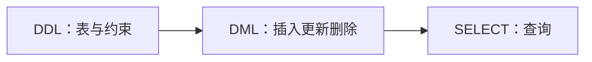
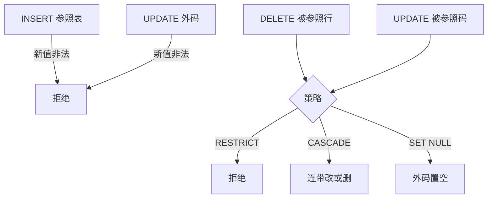

## SQL

[关系模型与关系代数](02-relational-model.md) 把查询写成选择、投影、连接、并、交、差与除。[几何对象与 PostGIS](04-geometry-and-postgis.md) 再把几何类型和空间谓词接到同一套语句上。中间这一层是 **SQL**（Structured Query Language）：先定义表与约束，再插入、更新、删除，最后用 `SELECT` 把代数运算写成可执行语句。

SQL 是描述性语言。语句写清要什么，访问路径由优化器决定。逻辑语义顺序与物理执行计划分开：写查询按语义顺序验收，计划与索引留到查询处理。实践栈以 PostgreSQL 为准；SQL-92 是各系统大致都支持的基本集合，SQL-99 起的对象关系、窗口、JSON、图查询并未被所有产品完整实现。实现与标准不一致处按所用版本的[官方文档](https://www.postgresql.org/docs/current/)核对。



定义与更新形式相对固定。查询可以嵌套、组合，是三者中最复杂的一块，也是后续空间 SQL 的共用骨架。

## 语言范围与标准

**SQL**：查询与操纵数据的标准语言。1974 年 IBM 的 Boyce 与 Chamberlin 提出；1986 年 ANSI 公布 SQL-86，1987 年 ISO 通过同一标准；其后有 SQL-89、SQL-92（SQL2）、SQL-99（SQL3）。当前版本是 SQL-2023。SQL-92 覆盖多数系统的基本集合。SQL-99 引入对象关系概念。2003 年前后增加 XML、窗口函数、序列；2008 年增加 `TRUNCATE` 与 `INSTEAD OF` 触发器；2011 年增加时态数据；2016 年增加 JSON 与多态表；2023 年增加图查询语言。各 DBMS 对标准的支持与语法并不一致，本页以 PostgreSQL 为准。

约十年前互联网流量上升时，一部分分析负载弱化了关系约束，**NoSQL** 一度读作 No SQL。随后一致性与一次写多次读的需求回流，Hive、Spark SQL 等仍提供 SQL 界面。NoSQL 现多读作 Not Only SQL：在 SQL 之外还有文档、键值、图等模型。通用选型术语见 [数据库与数据存储](../../../tech/databases.md)。

SQL 的三类语句：

-   **DDL**（Data Definition Language）：定义关系模式，创建、修改、删除表及其属性。
-   **DML**（Data Manipulation Language）：插入、删除、修改元组，以及查询一个或多个表。
-   **DCL**（Data Control Language）：`GRANT` / `REVOKE` 授权与收权，放到安全与完整性篇。

一张表是按模式规定的属性组成的**元组多重集**。多重集是可重复的无序列表。标准 SQL 要求属性是原子类型，不能是列表或集合；嵌套表不属于关系数据库中的关系。这与第一范式一致。几何不定长坐标串由下一篇的扩展类型承接。

五个特点：

-   **综合统一**：DDL、DML、DCL 风格一致，覆盖数据库生命周期；实体与联系都用关系表示，查找、插入、删除、更新共用同一套操作符。
-   **高度非过程化**：语句只提做什么，不写怎么做。
-   **面向集合**：操作对象与结果都可以是元组集合；一次插入、删除、更新也可以针对多行。
-   **同一种语法、两种使用方式**：终端交互（自含式），或嵌入 Python、Java、C 等（嵌入式）。
-   **语言简捷**：定义用 `CREATE`、`DROP`、`ALTER`；查询用 `SELECT`；操纵用 `INSERT`、`UPDATE`、`DELETE`；控制用 `GRANT`、`REVOKE`。

关键字大小写不敏感：`SELECT`、`Select`、`select` 相同。值大小写敏感：`'iPhone'` 与 `'iphone'` 不同。PostgreSQL 里字符串常量用单引号；双引号当成标识符。语句以英文分号 `;` 结束。

## 数据定义

关系数据库的基本对象是基本表、视图和索引。本页把基本表讲透；视图与索引在安全、完整性与物理设计各篇再展开。

| 对象 | 创建 | 删除 | 修改 |
| --- | --- | --- | --- |
| 基本表 | `CREATE TABLE` | `DROP TABLE` | `ALTER TABLE` |
| 视图 | `CREATE VIEW` | `DROP VIEW` | 本页不改 |
| 索引 | `CREATE INDEX` | `DROP INDEX` | 本页不改 |

### 建表与数据类型

```sql
CREATE TABLE <表名>
    ( <列名> <数据类型> [ <列级完整性约束条件> ]
    [, <列名> <数据类型> [ <列级完整性约束条件> ] ]
    [, <表级完整性约束条件> ] );
```

方括号表示可缺省。最低要求：表名，以及至少一个列名加数据类型。列级约束贴在单个属性后面；涉及两个及以上属性的主码必须写表级约束。

定义属性时要指明域；SQL 用数据类型实现域。PostgreSQL 常用类型：

-   **字符**：`char(20)` 定长；`varchar(50)` 变长上限；`text`
-   **数值**：`int`、`bigint`、`smallint`、`float`、`float8`
-   **时间**：`date` 年月日；`timestamp` 含时分秒
-   **几何**：`point`、`line`、`polygon`、`box`，下一篇展开
-   **其他**：`bit`、`bool`、`serial`

官方说明见 [PostgreSQL 数据类型](https://www.postgresql.org/docs/current/datatype.html)。每个属性只能是原子类型：非原子或嵌套无法用标准二维表直接表示。

### 主码、外码与检查约束

表的模式包括表名、属性及其类型。以产品为例：`Product(Pname, Price, Category, Manufacturer)`。

**主码**（`PRIMARY KEY`）：能唯一标识元组的最小属性子集。产品名单独往往不够：不同厂商可生产同名产品；同一厂商可生产多种产品。取产品名加制造商为主码。码是隐含约束：两行在码上相等，则必须是同一元组；有了主码，多重集在码投影上变成集合。

学生关系 `Students(sid, name, gpa)` 通常选 `sid` 而非姓名。一个关系可以有多个候选码，主码只能指定一个。码是否总存在、如何从候选码里选出主码，是模式设计问题。

**外码**（`FOREIGN KEY`）：`Enrolled(sid, cid, grade)` 中，学生须先出现在学生表，再写入选课；`sid` 是参照 `Students` 的外码。选课的码是 `(sid, cid)`。参照完整性要求不能有悬空引用。外码涉及两个关系，或同一关系的自参照；主码是关系内部的约束。外码取值要么是 `NULL`，要么是被参照关系中已存在的主码或 `UNIQUE` 值。选课例子里学号、课程号还不允许为空：不允许不知道是谁选的课，也不允许选一门未知的课。这是用户定义完整性叠在参照完整性之上。

| 约束 | 作用对象 | 含义 |
| --- | --- | --- |
| `NOT NULL` | 列 | 该列不能取空；`NULL` 表示 unknown 或 undefined |
| `UNIQUE` | 列或列组合 | 取值不重复，如 `UNIQUE(name, age)` |
| `DEFAULT` | 列 | 未给出值时的缺省 |
| `CHECK` | 列或列组合 | 谓词，如 `CHECK (age > 0)` |
| `PRIMARY KEY` | 列或列组合 | 自动蕴含 `UNIQUE` 且非空 |
| `FOREIGN KEY` | 列或列组合 | 防止破坏表间连接；阻止非法值进入外码列 |

约束是数据库理解数据含义的方式。约束可以命名，不写则由系统自动命名。`UNIQUE` 可以多个；主码要么没有、要么恰好一个。

高并发写入时，每插入一行都要检查约束，会拉长每次写入。常见做法是在应用程序里先校验，确认无误再写入；库内约束仍是最终否决。完整性约束在数据契约里要写清，也要权衡写入性能。

`CHECK` 在标准里很强，实现却参差：

-   用 `CHECK (GPA IS NOT NULL)` 模拟非空：有的库接受，MySQL 接受但不强制。
-   用 `CHECK` 加子查询或比较 `COUNT(DISTINCT A)` 与 `COUNT(*)` 模拟码：SQLite 与 PostgreSQL 会出问题；MySQL 同样接受但不强制。
-   `CHECK` 中带子查询：SQLite、PostgreSQL 不允许；MySQL 接受但不执行。

参照完整性应写 `REFERENCES` / `FOREIGN KEY`。

???+ warning "CHECK 不能替代外码"
    PostgreSQL 不允许 `CHECK` 含子查询。

    参照完整性写 `FOREIGN KEY`，不要写成 `CHECK (sID IN (SELECT sID FROM Student))`。

**域约束**用 `CREATE DOMAIN` 定义新值域：

```sql
CREATE DOMAIN GenderDomain CHAR(2)
    CHECK (VALUE IN ('男', '女'));

CREATE TABLE S (
    Sno   char(7) PRIMARY KEY,
    Sname char(8) NOT NULL,
    Ssex  GenderDomain,
    Sage  int,
    Sdept char(20)
);
```

这相当于先造一种性别类型，再在建表时引用。

### 列级约束与表级约束

```sql
CREATE TABLE Students (
    sid  CHAR(10) PRIMARY KEY,
    name VARCHAR(20) NOT NULL,
    age  INT CHECK (age > 0)
);

CREATE TABLE Enrolled (
    sid   CHAR(10) REFERENCES Students(sid),
    cid   CHAR(20),
    grade INT,
    PRIMARY KEY (sid, cid)
);
```

`sid` 上的参照可写在列级。两个属性组成的主码必须写在表级。若删掉表级 `PRIMARY KEY (sid, cid)`，改成在 `sid`、`cid` 后面各写一个 `PRIMARY KEY`，语义变成学号单独是主码且课程号单独是主码，系统报错：一个关系不能有两个主码。报错信息先读第一条。

带约束名、以及多属性外码：

```sql
CREATE TABLE Enrolled (
    sid   CHAR(10),
    cid   CHAR(20),
    grade INT,
    CONSTRAINT pk_En PRIMARY KEY (sid, cid),
    CONSTRAINT fk_En FOREIGN KEY (sid) REFERENCES Students(sid)
);

-- 多属性外码必须表级
-- FOREIGN KEY (b, c) REFERENCES other_table (c1, c2)
```

创建顺序：不能先建 `Enrolled` 再建模它所参照的 `Students`。外码执行时被参照关系必须已存在。行程表参照站点表时，同样必须先建站点再建模行程。

### 修改与删除表

```sql
ALTER TABLE <表名>
    [ ADD <新列名> <数据类型> [ 完整性约束 ] ]
    [ DROP <列名> ]
    [ DROP <完整性约束名> ]
    [ MODIFY <列名> <数据类型> ];

DROP TABLE <表名>;
```

`DROP TABLE` 删除基本表后，数据和该表上的索引一并删除；建立在该表上的视图往往仍在，但无法再引用。

```sql
ALTER TABLE Students ADD Scome DATE;
ALTER TABLE Students ALTER COLUMN Scome TYPE timestamp;
ALTER TABLE Students DROP Scome;

ALTER TABLE Enrolled ADD CONSTRAINT grade_check
    CHECK (grade >= 0 AND grade <= 100);
ALTER TABLE Enrolled DROP CONSTRAINT pk_En;

DROP TABLE Students;
```

PostgreSQL 修改列类型用 `ALTER COLUMN … TYPE …`，与部分教材中的 `MODIFY` 表述对应，以所用系统文档为准。外码存在时直接 `DROP` 被参照表会失败，须先处理依赖或按脚本顺序 `DROP`。

## 数据更新

### 插入、修改与删除

```sql
INSERT INTO <表名> [(<属性列 1> [, <属性列 2>] )]
    VALUES (<常量 1> [, <常量 2>] );
```

不写属性表时，值的个数与顺序必须与 `CREATE TABLE` 时完全一致。写出属性表后，`VALUES` 只须与列出的属性一一对应，可以打乱顺序，也可以只给部分列；其余为 `NULL` 或 `DEFAULT`，但须满足约束。

```sql
INSERT INTO Students VALUES ('200011', '张三', 19);
INSERT INTO Students (sid, age, name) VALUES ('200012', 20, '李四');
INSERT INTO Students (sid, name) VALUES ('200013', '王五');
```

逗号、分号必须是英文标点；字符串必须单引号。一次插入多行：在一组 `VALUES` 后加逗号，再写下一组括号，分号仍只出现一次。

```sql
INSERT INTO Students (sid, name, age) VALUES
    ('200011', '张三', 19),
    ('200012', '李四', 20),
    ('200013', '王五', 18);
```

也可以用查询结果整表插入：`INSERT INTO Table SELECT …;`。插入必须通过建表时声明的完整性约束。

```sql
INSERT INTO Students VALUES ('200011', '刘晓', 19);   -- 若 200011 已存在：违反主码
INSERT INTO Students VALUES ('200014', NULL, 19);     -- 若 name NOT NULL：拒绝
INSERT INTO Students VALUES ('200014', '刘晓', 0);     -- 若 CHECK (age > 0)：拒绝
```

凡与定义时的约束冲突，插入被拒绝，关系保持原状。不带引号的 `NULL` 表示该属性为空；加上单引号则是四个字符组成的姓名。二者不相等。

```sql
UPDATE <表名>
    SET <列名> = <表达式> [, <列名> = <表达式>]
    [WHERE <条件>];
```

无 `WHERE` 则更新全表。`SET` 右侧可以使用列的当前值，也可以是返回单值的标量子查询。

```sql
UPDATE Students SET age = 18 WHERE sid = '200011';
UPDATE Students SET age = 18 WHERE name = '王五';
UPDATE Students SET age = age + 1;
UPDATE Students SET sid = '200012' WHERE sid = '200011';
```

第一句按主码定位，语义清楚。第二句语法合法，但所有名叫王五的行年龄都会改成 18；若要改某一个学生，`WHERE` 里应使用主码。第三句把所有学生年龄加一。第四句若新学号与已有主码冲突，更新失败。

同一模板也用在余额上：办卡是插入一行；充值是 `SET 余额 = 余额 + 100` 并用主码限定；销户是 `DELETE … WHERE` 主码。

```sql
DELETE FROM <表名>
    [WHERE <条件>];
```

```sql
DELETE FROM Students WHERE sid = '200011';
DELETE FROM Students WHERE sid = '200000';  -- 没有该学号则一行也不删
DELETE FROM Students;                        -- 清空全部元组
```

`DELETE FROM Students` 只删数据，表结构、属性、索引、视图定义还在。`DROP TABLE Students` 连关系本身一起删掉。`DELETE` 的条件中可嵌子查询，与 `SELECT` 的 `WHERE` 同一套写法。

### 参照完整性策略

`Enrolled.sid` 参照 `Students.sid`，`Enrolled.cid` 参照 `Courses.cid`。学生表有 101、123，课程表有 564、308，选课只有 `(123, 564, A)`。下列操作都可能破坏参照完整性：

```sql
INSERT INTO Enrolled VALUES (201, 308, NULL);   -- 201 不在学生表
UPDATE Enrolled SET cid = 405;                  -- 405 不在课程表
UPDATE Students SET sid = 102 WHERE sid = 123;  -- 选课仍引用 123
DELETE FROM Students WHERE sid = 123;           -- 选课仍引用被删学号
```

一般地，若关系 `R` 的属性 `A` 参照关系 `S` 的属性 `B`，四类语句可能违规：

| 操作 | 风险 |
| --- | --- |
| `INSERT INTO R` | 新行在 `A` 上的值不在 `S.B` 中 |
| `DELETE FROM S` | 删掉了仍被 `R` 引用的 `B` 值 |
| `UPDATE R.A` | 改后的 `A` 不在 `S.B` 中 |
| `UPDATE S.B` | 被参照的码改了，原引用悬空 |

对插入 `R` 或更新 `R.A`：新值不在被参照列中则拒绝插入或更新。对删除 `S` 或更新 `S.B`，SQL 提供三种策略：

1.  **Restrict**（限制，缺省）：拒绝该删除或更新。
2.  **Cascade**（级联）：连带修改参照方。例如把学生 123 改成 102 时，选课表里所有 123 一并改成 102；删学生则删掉其全部选课。
3.  **Set NULL**：把参照方外码置空（若外码允许为空）。



未写策略时缺省为拒绝。策略写在参照关系上，不是写在被参照表上。

```sql
CREATE TABLE Enrolled (
    sid CHAR(10) REFERENCES Students(sid) ON DELETE RESTRICT,
    cid CHAR(20) REFERENCES Courses(cid) ON UPDATE CASCADE
);
```

PostgreSQL 三种都支持；其他系统有差异。SQLite 需 `PRAGMA foreign_keys = ON`；MySQL 对外码类型、声明位置、InnoDB 引擎有要求；SQL Server 的 `SET NULL` 与循环级联有限制。删除一门已有同学选修的课，数据库如何反应，取决于该外码声明的是 `RESTRICT`、`CASCADE` 还是 `SET NULL`。

自参照级联删除：

```sql
CREATE TABLE T (
    A int, B int, C int,
    PRIMARY KEY (A, B),
    FOREIGN KEY (B, C) REFERENCES T(A, B) ON DELETE CASCADE
);
INSERT INTO T VALUES (1,1,1), (2,1,1), (3,2,1), (4,3,2),
                     (5,4,3), (6,5,4), (7,6,5), (8,7,6);
DELETE FROM T WHERE A = 1;
```

主码是 `(A, B)`，外码 `(B, C)` 参照本表的 `(A, B)`。第一行 `(1, 1, 1)` 被删后，第二行的 `(B, C) = (1, 1)` 参照它，级联删除；第二行的主码是 `(2, 1)`，第三行参照 `(2, 1)`，继续级联。整张表会被删空。级联在自参照或长引用链上可能一次清空全部数据。这是策略的代价。

## 查询的语义顺序

后续例子使用申请库，下划线为主码：

-   `College(cName, state, enrollment)`
-   `Student(sID, sName, GPA, sizeHS)`
-   `Apply(sID, cName, major, decision)`

申请的主码是学号、大学、专业三者：同一学生可向不同学校、不同专业申请。校园卡三表 `Card` / `Dtl` / `Pos`、站点行程三表 `station` / `trip` / `weather` 用同一套骨架，只换属性名。

```sql
SELECT A1, A2, …, An     -- 第 3 步：返回什么（投影）
FROM   R1, R2, …, Rn     -- 第 1 步：查哪些关系（笛卡尔积）
WHERE  condition         -- 第 2 步：过滤（选择）
```

书写顺序是 `SELECT`–`FROM`–`WHERE`。逻辑语义顺序是 **FROM → WHERE → SELECT**：先做 $R_1 \times R_2 \times \cdots \times R_n$，再对每一行用条件过滤，最后投影。对应关系代数

$$\pi_{A_1,A_2,\ldots,A_n}\bigl(\sigma_{\mathrm{condition}}(R_1\times R_2\times\cdots\times R_n)\bigr).$$

带分组、排序之后，完整语义顺序为：


**FROM → WHERE → GROUP BY → HAVING → SELECT → ORDER BY**。`ORDER BY` 可以使用 `SELECT` 列表中的别名，因此逻辑上排在投影之后。语义顺序不等于优化器的物理计划。

`SELECT *` 投影笛卡尔积的全部属性。条件用 `AND`、`OR`、`NOT` 组合；比较可用 `>`、`>=`、`<`、`<=`、`=`，不等于有 `!=` 与 `<>` 两种。查询结果仍是关系，因此 SQL 可组合：一个查询的输出可作为另一个的输入。

用嵌套循环理解包语义。这是语义模型，不是优化器的真实执行顺序：

```text
Result = {}
for x1 in R1 do
  for x2 in R2 do
    …
      for xn in Rn do
        if conditions(x1, …, xn)
          then Result = Result ∪ {(x1.a1, …, xn.an)}
return Result
```

$n$ 个关系对应 $n$ 重循环。满足条件就把投影后的元组并入结果；默认不去重。优化器完全可能改成带索引的嵌套循环、哈希连接或排序合并，真实执行顺序取决于统计信息、索引与代价模型。写查询时仍按逻辑顺序思考：先决定 `FROM` 里有哪些关系，再写对每一行成立的 `WHERE`，最后决定 `SELECT` 列表。这与关系代数先连接或积、再选择、再投影同一套路。

逐步演算。$R(A)$ 含 1、3；$S(B, C)$ 含 `(2, 3)`、`(3, 4)`、`(3, 5)`。

```sql
SELECT R.A
FROM R, S
WHERE R.A = S.B;
```

$R \times S$ 有 $2 \times 3 = 6$ 行、属性 $A, B, C$。`WHERE R.A = S.B` 留下 `(3, 3, 4)` 与 `(3, 3, 5)`。再投影 `R.A` 得到两行 3：包语义下不去重。

`FROM` 里写逗号、却漏写关联条件，得到的是甲同学的学号配上乙同学的选课。结果行数膨胀且语义错误。本页所有嵌套、连接、分组，都建立在先积后选这一语义之上。

多表同名属性用 `关系名.属性名` 限定，如 `R1.A1`、`R2.A2`。对同一关系使用两次（自连接），用 `AS` 换名，对应关系代数的 $\rho$：

```sql
SELECT …
FROM R AS T1, R AS T2
WHERE …;
```

`AS` 可省略，写成 `FROM R T1`。`SELECT` 列表也可给表达式起别名：`SELECT A AS B` 或 `SELECT A B`。自连接时两份关系必须换名，否则系统无法分辨两侧。申请库里 `Apply` 与 `Student` 都有 `sID`，多表查询必须写 `Student.sID` 或 `Apply.sID`。

需要去重时写 `DISTINCT`。投影默认不去重：

```sql
SELECT DISTINCT R.A
FROM R, S, T
WHERE R.A = S.A OR R.A = T.A;
```

直觉上像 $R \cap (S \cup T)$。若 $S = \emptyset$，先做 $R \times S \times T$ 得到空关系，后面的选择、投影都作用在空关系上，整句结果为空。$R \cap T$ 不会出现。必须按先积后选再投影理解。

## 集合运算

| 关系代数 | SQL |
| --- | --- |
| $\cup$ | `UNION` |
| $\cap$ | `INTERSECT` |
| $-$ | `EXCEPT` |

`UNION` / `INTERSECT` / `EXCEPT` 按集合语义去重；保留重复则加 `ALL`。与此相对：`SELECT` 投影默认不去重，去重要 `DISTINCT`。`INTERSECT` 与 `EXCEPT` 在 SQLite、PostgreSQL 中可用；MySQL 长期不支持 `EXCEPT`，以实现为准。

申请了 CS 但没有申请 EE 的学号：不能在同一个 `WHERE` 里写 `major = 'CS' AND major <> 'EE'`。那是同一行上的条件，一个人完全可以一行 CS、另一行 EE。应写成两个查询的差：

```sql
SELECT sID FROM Apply WHERE major = 'CS'
EXCEPT
SELECT sID FROM Apply WHERE major = 'EE';
```

在 `PD02` 消费过、但从未在 `PD01` 消费过的同学，需要的是集合差：题目不是某一次消费的地点是 `PD02` 且不是 `PD01`，那在同一行上恒真。

```sql
SELECT Card.sid
FROM   Card, Dtl
WHERE  Card.sid = Dtl.sid
  AND  Dtl.pnumber = 'PD02'
EXCEPT
SELECT Card.sid
FROM   Card, Dtl
WHERE  Card.sid = Dtl.sid
  AND  Dtl.pnumber = 'PD01';
```

`FROM Card, Dtl` 是笛卡尔积，必须写学号相等；同名属性必须加关系名前缀。无 `EXCEPT` 时，改写成 `IN` / `NOT IN` 或 `NOT EXISTS`。

选课库里，甲或乙选修过的课程名是并；两人都选修过是交；成绩全合格的课程号是全集减反例，含无人选修的新课。落到 SQL 就是 `UNION` / `INTERSECT` / `EXCEPT`，或 `NOT IN`。全合格要求没有任何不及格行；存在一行及格只说明该课至少有人及格。

## 嵌套查询

### WHERE 中的 IN、EXISTS、ALL 与 ANY

`WHERE` 条件里可以嵌套 `SELECT`。四类谓词均可加 `NOT`：

| 谓词 | 含义 |
| --- | --- |
| `s IN R` | 标量 $s$ 是否属于子查询结果 |
| `EXISTS R` | 子查询结果是否非空 |
| `s > ALL R` | $s$ 大于子查询中每一个值 |
| `s < ANY R`（亦作 `SOME`） | $s$ 与集合中某个值比较 |

SQL 的可组合性：输入输出都是多重集，查询表可以再嵌进条件。

改写 CS 但非 EE。第一种：从学生出发，学号既在 CS 申请集合中，又不在 EE 申请集合中。`Student.sID` 是主码，外层不必 `DISTINCT`。

```sql
SELECT sID FROM Student
WHERE sID IN  (SELECT sID FROM Apply WHERE major = 'CS')
  AND sID NOT IN (SELECT sID FROM Apply WHERE major = 'EE');
```

第二种：从申请表出发，当前行是 CS，且不存在同一学生的 EE 申请。同一学生可向多所大学申请 CS，故加 `DISTINCT`。

```sql
SELECT DISTINCT sID
FROM Apply A1
WHERE major = 'CS'
  AND NOT EXISTS (
        SELECT *
        FROM Apply A2
        WHERE A1.sID = A2.sID AND A2.major = 'EE'
      );
```

`A1`、`A2` 是**相关子查询**：内层引用外层当前行的 `A1.sID`。对 `WHERE` 正在考察的那一行，外层属性是确定的标量，不是集合。因此写 `A1.sID = A2.sID`（值与值）合法；把一个标量直接与整段子查询用 `=` 比较不合法，集合成员应用 `IN`。

用 `EXISTS` 模拟交与差，便于在不支持 `INTERSECT` / `EXCEPT` 的系统中改写：

```sql
-- R ∩ S
SELECT R.A, R.B FROM R
WHERE EXISTS (
    SELECT * FROM S WHERE R.A = S.A AND R.B = S.B);

-- R − S
SELECT R.A, R.B FROM R
WHERE NOT EXISTS (
    SELECT * FROM S WHERE R.A = S.A AND R.B = S.B);
```

时空交集必须落在同一对记录上。计算机学院中，与学号 `C002` 在同一天、同一地点消费过的同学：`Dtl` 出现两次，必须重命名。

```sql
SELECT C.sid, C.name
FROM   Card C
WHERE  C.dept = 'CS'
  AND  EXISTS (
         SELECT *
         FROM   Dtl D1, Dtl D2
         WHERE  D1.sid = 'C002'
           AND  D2.sid = C.sid
           AND  D1.date = D2.date
           AND  D1.pnumber = D2.pnumber
       );
```

外层对每个学院为 `CS` 的学生 $C$；内层把明细自连接，`D1` 固定为 `C002`，`D2` 固定为当前学生，再要求日期与场所同时相等。内层非空则 `EXISTS` 为真。

若写成日期在 `C002` 的日期集合中并且地点在 `C002` 的地点集合中，可能用星期一食堂、星期二超市两条记录，去拼当前学生星期一在超市的一条记录：时间与地点分别对上了不同消费。必须是同一对明细上日期与地点同时相等。同一趟行程的起点与终点、同一天的天气与租车，同样不能拆开独立 `IN`。

相关子查询的一般形式：

```sql
SELECT A1
FROM   R1
WHERE  A1 IN (SELECT A2 FROM R2 WHERE R2.A2 = R1.A1);
```

外层每换一行，内层就按新的 `R1.A1` 重算一遍。

### FROM 与 SELECT 中的子查询

子查询还可以出现在 `FROM` 与 `SELECT` 列表中，有两条硬规则：

1.  **嵌在 `FROM` 中必须重命名。** 查询结果没有表名，不写别名会报错。
2.  **嵌在 `SELECT` 列表中只能返回一行。** 否则一行对多行，列长不一致，结果不是合法关系。PostgreSQL、MySQL 对此报错；SQLite 可能执行成功，结果仍不符合关系模型。

例如 `SELECT A, (SELECT C FROM S WHERE B = A) FROM R`：若 $A = 3$ 在 $S$ 中对应两行 $C$，第二列无法与第一列对齐。

### 最值的四种写法

查询 GPA 最高的学生学号。错误：`WHERE GPA = MAX(GPA)`。`WHERE` 对每一行判定，`MAX` 是对集合的聚集，不能写在这一层。`SELECT sID, MAX(GPA) FROM Student` 同样非法：学号有多行，`MAX(GPA)` 聚成一行。

```sql
-- 写法 0：排序后只取第一行（并列最高时会漏人）
SELECT sID FROM Student ORDER BY GPA DESC LIMIT 1;

-- 写法 1：标量 ≥ 集合中每一个（最大值的定义）
SELECT sID FROM Student
WHERE GPA >= ALL (SELECT GPA FROM Student);

-- 写法 2：等于全体的最大值（子查询在 WHERE，返回单个标量）
SELECT sID FROM Student
WHERE GPA = (SELECT MAX(GPA) FROM Student);

-- 写法 3：最大值作为 FROM 中的一张一行表，必须命名
SELECT sID
FROM Student,
     (SELECT MAX(GPA) AS maxGPA FROM Student) AS T
WHERE GPA = maxGPA;
```

`ORDER BY` 默认升序 `ASC`，降序必须写 `DESC`。可按多个属性：`ORDER BY A1 DESC, A2 ASC`。写法 0 在并列最高时只留一行；写法 1–3 会把所有并列者都选出来。车位最多的站点用写法 2 时，若四个站点 `dock_count` 均为 27，四个都应留下。`MIN`、`SUM`、`AVG`、`COUNT` 与 `MAX` 一样作用于集合；分组后的最值见下文。

必须报错的写法：

```sql
SELECT sID, MAX(GPA) FROM Student;  -- 错误：多行列与一行聚集并排放
SELECT sID FROM Student WHERE GPA = MAX(GPA);  -- 错误：聚集不能直接写在 WHERE
```

## 连接

`FROM R1, R2 WHERE ...` 足以表达连接。SQL 另提供一组 `JOIN` 写法，表达能力与前者相同。`JOIN` 把关联条件写在 `FROM` 里，更不容易漏写等值条件。空间查询里按几何谓词关联两张表，是同一思路的延伸。

### 内连接、自然连接与 USING

**`INNER JOIN ... ON` 条件。** `ON` 后可以是相等、大于、小于等任意 $\theta$ 条件，适用范围最广。缺省的 `JOIN` 就是内连接。

```sql
SELECT R.A, S.B
FROM   R INNER JOIN S ON R.A = S.A;
```

与笛卡尔积写法等价：

```sql
SELECT R.A, S.B
FROM   R, S
WHERE  R.A = S.A;
```

若写成 `R JOIN S ON TRUE`（条件恒真），则退回笛卡尔积。

**`NATURAL JOIN`（自然连接）。** 对所有同名属性做等值，并且结果里同名属性只保留一列。这与关系代数的自然连接一致。

```sql
SELECT R.A, S.B
FROM   R NATURAL JOIN S;
```

**`INNER JOIN ... USING (属性)`。** 只对点名的同名属性做等值，也只保留一列该属性。若两表同名属性有 `A, B, C` 三个，自然连接要求三个都相等；`USING (B, C)` 则只要求 `B`、`C` 相等，`A` 可以不同。

```sql
SELECT R.A, S.B
FROM   R INNER JOIN S USING (A);
```

`ON`、`USING`、自然连接的结果列数不同：

-   `ON R.A = S.A`：`R.A` 与 `S.A` 两列都保留，即便值相等。
-   `USING (A)` 与 `NATURAL JOIN`：同名属性只留一列。

需要引用两侧同名列、或连接条件不是等值时，用 `ON`；属性名一致且只需等值时，`USING` 或自然连接更短。

### 外连接

内连接丢掉所有不满足 `ON` 的行。外连接在配对失败时仍保留指定一侧或两侧的元组，对面属性填 `NULL`。界面里 `NULL` 有时显示为 `None`。


-   **左外连接** `LEFT OUTER JOIN`：保留左边关系的全部行。
-   **右外连接** `RIGHT OUTER JOIN`：保留右边关系的全部行。
-   **全外连接** `FULL OUTER JOIN`：左右未配对的行都保留。

三者都可以跟 `ON` 条件或 `USING (属性)`。

例子：`R(A, B)` 与 `S(A, C)`。

| R.A | R.B |
| --- | --- |
| 1 | Cat |
| 2 | Dog |
| 3 | Dog |

| S.A | S.C |
| --- | --- |
| 1 | Apple |
| 2 | Bana |
| 2 | Pear |

`R` 中 `A = 3` 在 `S` 中没有配对。内连接结果只有 $A \in \{1, 2\}$ 的行（$A = 2$ 因 `S` 有两行而出现两行）：

| R.A | S.C |
| --- | --- |
| 1 | Apple |
| 2 | Bana |
| 2 | Pear |

左外连接在此基础上增加一行 `(3, NULL)`。若 `S` 的每个 `A` 都在 `R` 中有配对，则右外连接与内连接相同。内连接只保留两侧都匹配的行；左外连接再保留左独有行；右外连接再保留右独有行；全外连接两侧未配对的行都保留。外连接适合要保留没有配对的那一侧，例如从没申请过大学的学生，申请数记 0。

### 全外连接不满足结合律

下面两条不等价：

```sql
SELECT *
FROM (T1 NATURAL FULL OUTER JOIN T2) NATURAL FULL OUTER JOIN T3;

SELECT *
FROM T1 NATURAL FULL OUTER JOIN (T2 NATURAL FULL OUTER JOIN T3);
```

键相同的部分接近笛卡尔积，键不同的部分是把行并上去。若 $R$ 有 3 行且键全是 1，$S$ 有 4 行且键也全是 1，全外连接就是内连接，共 $3 \times 4 = 12$ 行；若一侧全是 1、另一侧全是 2，则没有任何配对，结果是 $3 + 4 = 7$ 行。一般地，全外连接行数的上界是 $|R| \times |S|$（键全部相同），无配对时是 $|R| + |S|$。最小值需自己造表验证，不能认为先连谁都一样。

## 聚集与分组

### 聚集函数与 GROUP BY

`MIN`、`MAX`、`SUM`、`AVG`、`COUNT` 把多行收成一个值。除 `COUNT` 外，它们都作用在单一属性上。`COUNT(*)` 数行；`COUNT(属性)` 数该列非空个数。`NULL` 的处理见空值一节。没有 `GROUP BY` 时，整张表视为一个组，聚集结果只有一行，因此不能把多行的普通列和一行的聚集并排放在 `SELECT` 列表里。

```sql
SELECT   A1, A2, ..., An
FROM     R1, R2, ..., Rn
WHERE    condition
GROUP BY Ai, Aj, ..., Ak;
```

语义分三步：

1.  先做 `FROM`–`WHERE`：笛卡尔积再按行过滤。
2.  按 `GROUP BY` 中的属性把行分成若干组，组内这些属性值相同。
3.  对每个组计算 `SELECT`：只能是分组属性，或对其它属性的聚集。

`SELECT` 中每一列必须是出现在 `GROUP BY` 里，或包在聚集函数里，或常量。违反则报错。原因：每个组只能对应结果表的一行，组内若某列有多个不同值，无法决定输出哪一个。

例：某一日期之后每个产品的总销售额。

```sql
SELECT   product, SUM(price * quantity) AS totalsales
FROM     Purchase
WHERE    date > '10/1/2024'
GROUP BY product;
```

逐步：`WHERE` 留下日期合格的行，列结构不变；按 `product` 分组；`SELECT` 输出产品名（分组属性）以及 `SUM(price * quantity)`（聚集）。若写成 `SELECT product, date, price, quantity ... GROUP BY product`，则 `date` 等既非分组属性也非聚集，数据库报错。

### HAVING 与列的可见性

```sql
SELECT   A1, A2, ..., An
FROM     R1, R2, ..., Rn
WHERE    C1
GROUP BY Ai, Aj, ..., Ak
HAVING   C2;
```

-   `WHERE C1`：笛卡尔积之后、分组之前，对每一行判断；`C1` 可以使用参与笛卡尔积的任何属性。
-   `HAVING C2`：分组之后，对每一个组判断；`C2` 只能使用分组属性，或对其它属性的聚集。
-   没有 `GROUP BY` 就不要写 `HAVING`。对行的条件应写在 `WHERE`。

对分组属性的简单比较（如 `A > 1`）写在 `WHERE` 或 `HAVING` 往往结果相同：前者先丢掉行再分组，后者先分组再丢掉组。对其它属性则不行：组内 `B` 可能有多个值，`HAVING B > 1` 无意义；应写成 `HAVING SUM(B) > 10`。

设 `FROM R, S` 之后有属性 $A, B, C$（来自 $R$）与 $D, E, F$（来自 $S$），再 `GROUP BY A, D`。

-   **`WHERE C1`**：过滤的是笛卡尔积的每一行，$A$ 到 $F$ 都可以出现。
-   **`HAVING C2`**：过滤的是已经按 $(A, D)$ 捆好的组。分组属性 $A$、$D$ 可以写；组内可能多值的 $B, C, E, F$ 不能直接比较，必须先聚成一个值。
-   **`SELECT` 列表**：只能是 $A, D$，或对其他列的聚集，或常量。

笛卡尔积之后按行看，列都可用；分完组之后按组看，只能用组内唯一的东西：分组键、聚集、常量。

与基本查询一样，下面只是语义，不是优化器的真实计划。

1.  对 `FROM` 中 $n$ 个关系做 $n$ 重循环形成笛卡尔积，满足 `C1` 的行放入多重集 `Tuples`。
2.  再扫 `Tuples`，按 $(A_i, A_j, \ldots, A_k)$ 投入对应的组。
3.  对每个组判断 `C2`；满足则把分组属性加聚集值写入结果。

分组循环与行循环是两套独立循环：前者遍数等于组数，后者遍数等于过滤后的行数。

例：`GROUP BY A, B HAVING SUM(C) > 3`。关系 `R(A, B, C)` 分组后四组：`(5, 10)` 的 `C` 为 $1 + 2 = 3$，不大于 3，丢掉；`(5, 11)` 的和为 3，丢掉；`(6, 11)` 的和为 4，保留；`(6, 12)` 的和为 $5 + 6 + 7 = 18$，保留。最终两行：`(6, 11, 4)` 与 `(6, 12, 18)`。

### 分组写法与嵌套写法

`Author(login, name)`，`Wrote(login, url)`。

问题 1：至少写了 10 篇文档的作者。嵌套（对每个作者在 `WHERE` 里计数；`COUNT` 必须放在子查询内部）：

```sql
SELECT login, name
FROM   Author
WHERE  (SELECT COUNT(*)
        FROM   Wrote
        WHERE  Wrote.login = Author.login) >= 10;
```

分组（先按登录名对齐，再按作者分组，用 `HAVING` 滤组）：

```sql
SELECT Author.login, name
FROM   Author NATURAL JOIN Wrote
GROUP BY Author.login, name
HAVING COUNT(url) >= 10;
```

不用自然连接时，应写 `FROM Author, Wrote WHERE Author.login = Wrote.login`。多种写法都对时，优先选通常更高效的 `GROUP BY`。把 `COUNT` 写在子查询外面的骨架不合法：聚集必须包住一个查询或出现在分组之后。

问题 2：每位作者及其文档篇数。分组：

```sql
SELECT Author.login, COUNT(*)
FROM   Author NATURAL JOIN Wrote
GROUP BY Author.login;
```

`SELECT` 列表嵌套（对当前作者计数，子查询必须单行，`COUNT` 保证这一点）：

```sql
SELECT login,
       (SELECT COUNT(*) FROM Wrote W WHERE W.login = A.login)
FROM   Author A;
```

### 未配对行计 0

每名学生申请了多少所大学，没有申请的记 0。同一学生可能向同一大学申请多个专业，故计大学数时要用 `COUNT(DISTINCT cName)`。

内连接写法会丢掉从未出现在 `Apply` 里的学生：等值阶段就已经没有他们的行，分组不可能再变出 0。补救是再 `UNION` 一截不在 `Apply` 中的学生，计数为 0：

```sql
SELECT Student.sID, COUNT(DISTINCT cName)
FROM   Student, Apply
WHERE  Student.sID = Apply.sID
GROUP BY Student.sID
UNION
SELECT sID, 0
FROM   Student
WHERE  sID NOT IN (SELECT sID FROM Apply);
```

左外连接把保留学生一次做完：没有申请的学生仍留下，对面是 `NULL`；再按学号分组。`COUNT(DISTINCT cName)` 会忽略 `NULL`，于是自然得到 0：

```sql
SELECT Student.sID, COUNT(DISTINCT cName)
FROM   Student LEFT OUTER JOIN Apply
       ON Student.sID = Apply.sID
GROUP BY Student.sID;
```

若误用 `COUNT(*)`，没有申请的学生因左外连接仍占一行，会被计成 1 而不是 0。需要空配对计 0 时，应对可空的那一侧列做 `COUNT(列)` 或 `COUNT(DISTINCT 列)`。每位学生的消费次数、没有消费的记 0，与此同构：`Card LEFT OUTER JOIN Dtl`，必须 `COUNT(Dtl.pnumber)`。

### 分组后的最值

没有分组时，最大值用 `>= ALL` 或 `= (SELECT MAX(...))`。有分组时，把同样的比较从行挪到组：比较写在 `HAVING`。

```sql
SELECT cName
FROM   Apply
GROUP BY cName
HAVING COUNT(*) >= ALL
       (SELECT COUNT(*) FROM Apply GROUP BY cName);
```

对每个大学（每个组），其申请行数要大于等于所有大学分组后的行数。也可以先在子查询里求出 `MAX(cnt)`，再让 `HAVING COUNT(*) =` 那个最大值。题目若改成申请人（去重学生）最多的大学，应 `COUNT(DISTINCT sID)`。学生人数最多的学院是同一模板。

按场所统计营业额：先连接场所与明细，`WHERE` 限定范围，`GROUP BY` 场所编号与地点名称，`SUM` 金额，`ORDER BY` 降序。理论上只按主码分组即可决定一组；把名称放进 `GROUP BY`，是为了满足 `SELECT` 只能出现分组属性或聚集。即使当前数据里编号与名称一一对应，两个不同编号也可能重名，按名称分组会把它们错误合并。

## 空值与三值逻辑

`NULL` 表示未知或尚未定义，语义随应用而变：课程成绩还没出（不宜填 0 分）、学生没有中间名、信用卡没有到期日、车辆尚未上牌。`NULL` 与数字 0、空字符串都不同。

数值运算一旦有 `NULL` 参与，结果仍是 `NULL`。例如 $x = \texttt{NULL}$ 时，$4 \times (3 - x) / 7$ 仍为 `NULL`。

布尔运算是**三值逻辑**：

| 真值 | 数值约定 |
| --- | --- |
| `FALSE` | 0 |
| `UNKNOWN` | 0.5 |
| `TRUE` | 1 |

-   `C1 AND C2` = $\min(C_1, C_2)$
-   `C1 OR C2` = $\max(C_1, C_2)$
-   `NOT C1` = $1 - C_1$

因此 `x = 'Joe'` 在 $x$ 为 `NULL` 时是 `UNKNOWN`。`UNKNOWN AND TRUE` 得 $\min(0.5, 1) = 0.5$；`UNKNOWN OR TRUE` 得 $\max(0.5, 1) = 1$；`UNKNOWN OR FALSE` 得 $0.5$；`NOT UNKNOWN` 仍是 $0.5$。与未知合取时，真值停留在未知；与未知析取时，只要另一侧已是真，整体就是真。`NULL = NULL` 得 `NULL`；`TRUE AND NULL = NULL`，`FALSE AND NULL = FALSE`，`TRUE OR NULL = TRUE`，`FALSE OR NULL = NULL`。

两条必须记住的规则：

**选择规则**：`WHERE`（以及 `HAVING`）只保留结果为 `TRUE`（1.0）的元组或组。`UNKNOWN` 与 `FALSE` 都不输出。因此 `SELECT * FROM R WHERE B > 1` 在 `B` 为 `NULL` 时，`NULL > 1` 为 `UNKNOWN`，该行不出现。

**插入规则**：插入时只拒绝条件为 `FALSE` 的元组。条件为 `TRUE` 或 `UNKNOWN` 都可以插入。选择严、插入宽，不要记反。

只能用 `IS NULL` / `IS NOT NULL`：

```sql
x IS NULL
x IS NOT NULL
```

不能写 `x = NULL`：任何与 `NULL` 的比较都是 `UNKNOWN`，`WHERE` 不会留下这些行。`WHERE NULL = NULL` 得到空结果。

看似穷尽的析取仍会丢掉 `NULL`：

```sql
SELECT * FROM Student WHERE GPA >= 3.5 OR GPA < 3.5;
```

并不能返回全部学生。`GPA` 为 `NULL` 时两个比较都是 `UNKNOWN`，`OR` 取 $\max(0.5, 0.5) = 0.5$，不是 `TRUE`。要包含未知成绩，必须再写 `OR GPA IS NULL`。

`NULL` 在查询各环节的行为：

-   参与数值或布尔运算，结果为 `NULL` / `UNKNOWN`。
-   `WHERE` 仅当条件为真才保留该行；`HAVING` 仅当条件为真才保留该组。
-   连接时 `NULL` 不等于 `NULL`：不能靠两边都是空把两行配成一对。
-   `GROUP BY` 把所有 `NULL` 算作同一个组。
-   `ORDER BY` 时 `NULL` 默认排在最前，可用语法改变。
-   聚集：输入为空集时，`COUNT` 返回 0，其余聚集返回 `NULL`；`COUNT(*)` 把 `NULL` 行计入；`COUNT(属性)` 忽略该属性为 `NULL` 的行；`SUM` / `AVG` / `MIN` / `MAX` 都忽略 `NULL`。例如四个数 5、4、6、`NULL` 的平均值是 $(5 + 4 + 6) / 3 = 5$，不是除以 4。

???+ warning "NOT IN 遇到 NULL"
    子查询若含 `NULL`，`NOT IN` 会使主查询得到空结果：每个比较都变成 `UNKNOWN`。

    安全写法是 `NOT EXISTS`。

## 除法的 SQL 实现

关系代数的除 $\div$ 在 SQL 中没有对应子句。第二章的集合含义：设 $A$ 有属性 $X, Y$，$B$ 有属性 $Y$（与 $A$ 的 $Y$ 同域）。对 $A$ 中每一个 $x$，看它所对应的 $Y$ 值集合是否包含 $B$ 中全部 $Y$ 值；若包含，则 $x$ 属于 $A \div B$。直观：$A$ 表示学生选修了某课，$B$ 是一组课程列表，$A \div B$ 是选修了 $B$ 中全部课程的学生。除与笛卡尔积互为全称与存在的两端：积是所有组合都出现，除是某实体关联了另一关系中的全部。

SQL 用双重否定实现全称：不存在一门 $B$ 中的课，是该学生没选的。

```sql
SELECT DISTINCT A1.X
FROM   A AS A1
WHERE  NOT EXISTS (
         SELECT *
         FROM   B
         WHERE  NOT EXISTS (
                  SELECT *
                  FROM   A AS A2
                  WHERE  A2.X = A1.X
                    AND  A2.Y = B.Y
                )
       );
```

外层扫描候选 $x$；中层问是否存在一门 $B$ 中的课 $y$，使得内层该 $x$ 选了该 $y$ 为空。两层 `NOT EXISTS` 套在一起，就是对 $B$ 中每一门课，该学生都选了。这与用单层差（全集减反例）不同：差回答没有任何反例行；除回答给定清单里的每一项都出现过。把选修了指定课单中全部课程的学生写成全体学生减掉漏选了任何一门的学生，在课单固定时与除法等价；课单来自另一张表时，双重 `NOT EXISTS` 更直接。

分组写法（只统计落在 $B$ 中的 $Y$，再与 $|B|$ 比较）在无重复、且 $B$ 无多余属性时等价：

```sql
SELECT X
FROM   A
WHERE  Y IN (SELECT Y FROM B)
GROUP BY X
HAVING COUNT(DISTINCT Y) = (SELECT COUNT(*) FROM B);
```

对除法的要求是了解集合含义，会用 `NOT EXISTS` 落成 SQL，不把除法当日常首选运算符。后续空间查询里避开所有淹没区的道路是同一全称结构：写成存在一块不相交的淹没区会放过与某块淹没区相交的道路；必须 `NOT EXISTS` 一块相交的淹没区。

## 模式匹配与 WITH

| 语法 | 要点 |
| --- | --- |
| `DISTINCT` / `ALL` | 去重；默认是 `ALL`（不去重） |
| `ORDER BY A1, A2, ...` | 默认 `ASC`；降序写 `DESC` |
| `s LIKE p` | 字符串模式：`%` 为任意长度字符序列，`_` 为单个字符；模式用单引号 |
| `BETWEEN ... AND ...` | 闭区间，等价于两个比较的合取 |
| `WITH` 子句 | 定义只在当前事务内可见的查询表 |

`LIKE` 例子：`'A%'` 匹配以 A 开头的任意串；`'A_A'` 匹配长度为 3、首尾为 A 的串；`'Bob'` 精确等于 Bob；`'Bob%'` 前三字母为 Bob。需要把 `%` 当普通字符时，用 `ESCAPE`（如 `name LIKE '%/%33' ESCAPE '/'`）。

`WITH` 适合把中间结果当成临时表往下写。分号结束一个隐式事务，或 `BEGIN` … `END` 显式事务；跨语句要用同一事务。递归 `WITH` 留到空间网络篇。

关系代数与 SQL 对照：

| 关系代数 | SQL |
| --- | --- |
| 面向集合 | 面向多重集；`ALL` / `DISTINCT` |
| 选择 | `WHERE`（每行）/ `HAVING`（每组） |
| 投影 | `SELECT` |
| 连接 | `NATURAL JOIN`、`INNER JOIN [USING]`、外连接 |
| 除 | 无对应子句；用嵌套 / `NOT EXISTS` 实现 |
| 并 / 交 / 差 | `UNION` / `INTERSECT` / `EXCEPT` |
| 笛卡尔积 | `FROM` 中的逗号 |
| 重命名 | `AS` |
| 分组 | `GROUP BY`（`SELECT` 列表受限） |
| 排序 | `ORDER BY` |
| 空值 | `NULL` 与三值逻辑 |

写法上：SQL 是描述型语言，细节（含各 DBMS 实现差异）差一点点，结果可以差很多。先做逻辑等价改写，再下手写 SQL。例如所有产品价格都小于 100 的公司，改写为只生产价格小于 100 的产品的公司。复杂问题先查出一部分，再用嵌套、集合运算组合。同一问题常有多种 SQL；在正确的前提下选更高效的写法。

## 产品边界

主码、外码、`CHECK` 与参照策略写进数据契约。应用层校验降低往返次数；库内约束在写入时拒绝违规元组。缺省外码策略是拒绝；自参照 `ON DELETE CASCADE` 可能一次清空引用链上的全部行。

`SELECT` 的验收按语义顺序：FROM → WHERE → GROUP BY → HAVING → SELECT → ORDER BY。优化器的物理计划可以改写执行路径，正确性仍以语义顺序为准。空表参与 `FROM`，整句为空。

包语义、`DISTINCT`、外连接计 0、`NULL` 三值逻辑都要写进验收用例。`COUNT(*)` 把左外连接的空配对计成 1；`COUNT(可空列)` 把空配对计成 0。`NOT IN` 子查询含 `NULL` 时主查询为空。

几何类型与空间谓词见 [几何对象与 PostGIS](04-geometry-and-postgis.md)。本页的骨架在那里继续用：最值、分组、连接、嵌套、外连接计 0。变化是关联条件从等值换成空间谓词。

## 要点

-   SQL 是描述性、面向集合的标准语言；SQL-92 为基本集合，当前 SQL-2023。DDL / DML / DCL 三分；本页覆盖前两块。
-   `CREATE TABLE` 至少一列一带类型；列级约束贴单列，复合主码 / 外码必须表级；主码至多一个，`UNIQUE` 可以多个。先建被参照表。`ALTER` / `DROP`：删表会带走数据与索引，视图定义可能残留但无法引用。
-   `CHECK` 标准很强，PostgreSQL 不允许其中出现子查询；参照完整性写 `FOREIGN KEY`。生产环境约束与写入性能要权衡。
-   `INSERT`（可多行、可 `SELECT`）/ `UPDATE` / `DELETE`；按主码定位更新；`NULL` 与 `'NULL'` 不同；`DELETE` 清数据，`DROP TABLE` 删关系。
-   参照完整性：插入 / 更新参照方时新值非法则拒绝；删除 / 更新被参照方时有 Restrict（缺省）、Cascade、Set NULL 三种策略，写在参照方。自参照级联可能清空全表。
-   基本 `SELECT` 语义 = 笛卡尔积 → 选择 → 投影；完整顺序 `FROM` → `WHERE` → `GROUP BY` → `HAVING` → `SELECT` → `ORDER BY`。空因子使积为空。`AS` 消歧；`DISTINCT` 去重。
-   集合运算 `UNION` / `INTERSECT` / `EXCEPT` 默认去重；差集适合在 A 发生过、从未在 B 发生过。禁止同一行上写等于 CS 且不等于 EE。
-   `WHERE` 谓词：`IN`、`EXISTS`、`ALL`、`ANY`。相关子查询里外层属性是标量。时空条件必须落在同一对记录上，不能拆成两个独立 `IN`。
-   `FROM` 嵌套必须命名；`SELECT` 嵌套必须单行。最值四种写法：`LIMIT 1`（并列会漏）、`>= ALL`、`= (SELECT MAX(...))`、`FROM` 中命名后的一行聚集表。禁用 `WHERE col = MAX(col)`。
-   连接与积加 `WHERE` 表达力相同：`ON` 最通用且保留两侧列，`USING` / 自然连接合并同名列；外连接用 `NULL` 保留未配对行；全外连接非结合。
-   聚集把多行收成一行；`GROUP BY` 后每个组一行；`HAVING` 对组过滤。含 0 优先左外连接加 `COUNT(可空列)`。分组最值把 `>= ALL` 挪到 `HAVING`。
-   `NULL` 是三值逻辑中的 `UNKNOWN`（0.5）；选择认真、插入拒假；判断用 `IS NULL`；聚集多数忽略 `NULL`，`COUNT(*)` 例外；`NOT IN` 遇 `NULL` 不安全。
-   除法无 SQL 子句：用双重 `NOT EXISTS`（或不在 $B$ 中的 $Y$ 计数与 $|B|$ 比较）实现关联了另一关系中的全部。

关系代数默认集合语义、投影即去重；SQL 默认包语义、投影要 `DISTINCT` 才去重，集合运算则相反（`UNION` 默认去重，保留重复加 `ALL`）。全称量词在代数里用差或除，在 SQL 里用 `EXCEPT` / `NOT EXISTS` / 双重否定。最值在代数里用自笛卡尔积再差，在 SQL 里用本节四种写法。

## 相关阅读

-   [空间数据库](index.md)
-   [关系模型与关系代数](02-relational-model.md)
-   [几何对象与 PostGIS](04-geometry-and-postgis.md)
-   [数据库与数据存储](../../../tech/databases.md)

## 来源说明

本页根据 Silberschatz、Korth 与 Sudarshan《Database System Concepts》第七版第 3 章（3.1–3.10）与第 4 章部分内容（4.1 连接表达式、4.4 完整性约束）整理，并对照 PostgreSQL 官方文档中的 [SQL 命令](https://www.postgresql.org/docs/current/sql.html)、[数据类型](https://www.postgresql.org/docs/current/datatype.html)、[约束](https://www.postgresql.org/docs/current/ddl-constraints.html) 与 [查询](https://www.postgresql.org/docs/current/queries.html)。函数名、外码策略与 `CHECK` 限制以所安装版本为准。

条文、标准与产品功能以官方文本为准；本页核验日期为 2026-09-04。
