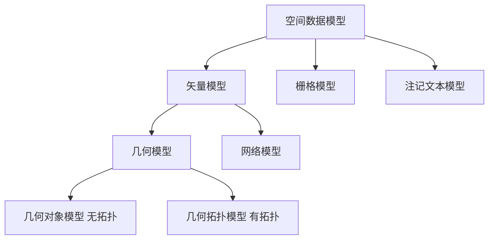
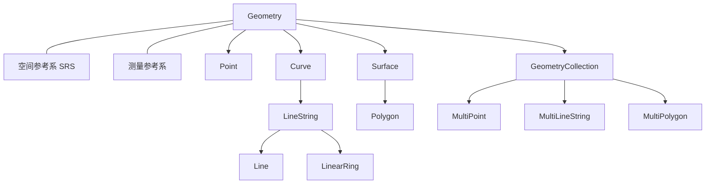
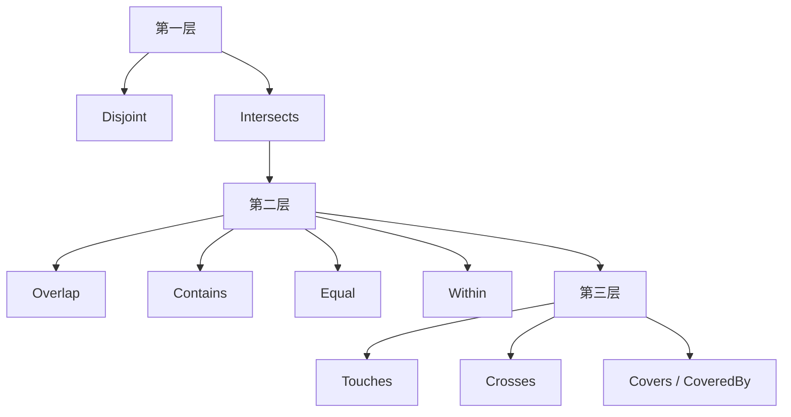

## 几何对象与 PostGIS

空间查询的语句骨架仍是 `SELECT`、`FROM`、`WHERE`，见 [SQL](03-sql.md)。变化是属性里多了几何，表达式里多了长度、距离、相交与凸包。本页对应 [空间数据库](index.md) 的第二条主线：几何对象模型、空间分析与 PostGIS。

谓词建立在稳定的几何类型与方法上。依据是 OGC Simple Feature Access（SFA，即 ISO 19125）：Part 1 Common Architecture 给概念层的 UML 类型层次与方法签名，Part 2 SQL Option 给 SQL 实现约定。几何是对象关系数据库中的扩展数据类型，数据加上方法。PostGIS 把方法落实成以 `ST_` 开头的函数。SFA SQL 覆盖几何对象模型与注记文本；SQL/MM 另含空间网络。

坐标系、投影与法定精度见 [GIS 与测绘](../geospatial/gis-and-surveying.md)。包围盒、GiST 与过滤精炼见 [空间存储与索引](07-storage-and-index.md)。


阅读顺序：空间如何组织，点线面层次与维数，任何几何都有边界、内部、外部，约 30 个方法分成三类，九交把拓扑写成 $3\times 3$ 矩阵，WKT / WKB 交换，PostGIS 建列、导入、查询。

## 空间数据模型

**空间数据模型**：空间信息的一种数据组织方式。常见三大类是对象模型、场模型、网络模型。现有空间数据库都基于其中某一种或组合。GIS 里最常对比的是矢量与栅格。

同一片地面可以按可命名的地块存，也可以按每个格子什么值存，还可以按站与站是否连通存。选错模型，后面的表结构、函数与索引都会跟着错。本页主线是对象 / 矢量这一侧。

### 矢量与栅格

**矢量模型**（对象视角）：用点、线、多边形表达现实世界；定位明显，属性隐含；不可再分的最小单元称为空间实体。

**栅格模型**（场视角）：用二维矩阵表示地物或现象的空间分布；每个矩阵单元是一个栅格，单元值表示该处的属性。

场观点给出分片函数：在一块矩形上取农业与过渡，在相邻矩形上取森林。对象观点则是两块多边形，各有 Area-ID、土地利用类型与边界坐标。查询森林面积时，对象模型对那一块多边形做几何度量；场模型对取值为森林的格子计数或积分。

场模型里，**空间框架**是对空间的剖分，场函数把位置映到属性域。对象模型里，对象是应用关心的可识别事物，带属性与操作。属性分空间属性与非空间属性；操作如附近的道路、附近的公交线路。空间对象即带空间属性的对象，通常也带非空间属性。

简单空间对象按几何维数分为：0 维点、1 维曲线、2 维面。还可以是集合：多点、多线、多多边形。

### 矢量内部再分类



几何模型关注地物的精确形状，与经纬度等度量相关。网络模型关注连通：站与站是否可达，不关心道路怎么弯。无拓扑的几何对象模型与带拓扑的几何拓扑模型是几何内部的两种。本页主线是几何对象模型，后续与网络模型结合。

TIN 在 OGC 中视为矢量的一种表达，ESRI GeoDatabase 则把它看成不同于矢量的另一类。同一对象、两套产品语言，口径必须写清是哪一家。

对象模型擅长这一块叫什么、边界在哪；场模型擅长连续分布。选对象模型就接受空洞、多部件、参考系要显式建模；选场模型就接受分辨率与存储随格子变细而膨胀。网络模型丢掉形状后，欧氏距离与驾车距离会分家。

### 点数据与网络数据各三类

按空间变不变、时间变不变切开，便于后面设计表结构。

**点数据**

1. 时空都不变：商场、学校、车站，建成后位置与多数属性稳定。
2. 空间不变、属性随时间变：固定传感器，坐标不动，读数按小时变化。
3. 时空都变：共享单车、网约车请求，不同时刻出现在不同地点。

**网络数据**

1. 时空都不变：建成后的路网结构。
2. 空间不变、属性随时间变：路网加上随时间变化的车流。
3. 时空都变：轨迹。骑行、出租车常被车道约束；鸟类或航班往往不像汽车那样被车道约束。

数据来源不限于城市基础设施：个人手机 GPS、体育项目的位置统计、游戏等虚拟空间里的活动热点，以及用轨迹做证据收集、群体发现的分析，都是同一套点 / 网络 × 是否随时间空间变化的语言。

### 注记文本三类

栅格不在本页展开，注记只作三类区分。

**注记标签**：从要素层某个属性取值标在点、线、面附近，与要素有正式连接；显示风格随该层的文本风格；漫游缩放后按当前比例尺选择是否显示、放在何处。文字来自已有字段，一般不必另建类型。

**注记文本**：独立于要素层的文本数据集，由有序、可单独放置的文本元素组成。可以沿要素走向或按要素范围摆放，与要素无正式连接。字体大小与位置固定，不受视窗缩放影响。它有自己的地理位置和文字属性，与点、线、多边形一样是一种要素。

**注记尺寸**：标注长、宽、高一类数值，常见于地块、房屋测量。ESRI GeoDatabase 有 `DimensionFeature`。地理空间数据标准对此涉及较少。

## 几何对象模型

地理要素是对现实世界空间现象的抽象，由三类信息构成。

-   **几何**：位置与形状。
-   **属性**：道路名称、建造年份、车道数等，适合用关系数据库的列存储。
-   **行为**：例如某时段是单行道。

以道路为例：名称、建造年份、车道数是属性，用普通列即可；某时段单行是行为 / 约束；中心线由许多点连成折线，还要算长度、判断是否与另一条路相交。这些无法用标准 SQL 的原子类型表达。属性与行为由应用设计者按需求建模；几何如何成为一组稳定的数据类型，是 DBMS 要解决的基础问题。

几何对象模型用对象关系数据库中的扩展数据类型实现。OGC SFA Part 1 给出完整 UML。概念模型拆成：类型层次，方法三类，九交与八关系，线性参考；再落到逻辑模型与物理模型。

### 类型层次与空间参考系

最顶层的几何类通常以 `ST_` 为前缀。层次如下。



`Geometry` 依赖于空间参考系与测量参考系。其下分出 `Point`、`Curve`、`Surface`、`GeometryCollection`。`Curve` 下有 `LineString`；`LineString` 下有 `Line` 与 `LinearRing`。`Surface` 下有 `Polygon`。集合侧有 `MultiPoint`、`MultiCurve` / `MultiLineString`、`MultiSurface` / `MultiPolygon`。

读 UML 风格的图例：菱形表示组合 / 包含，多边形由线环组成，至少一个环。空心箭头表示继承，点、线、面都是几何，`LineString` 是 `Curve` 的子类。实线表示关联，每个几何都挂一个空间参考系。同一对坐标在不同参考系下算出的距离可以差出一个量级。

OGC SFA Part 1 图 1 还标了重数：一条线串由 2..\* 个点组成；多边形至少含一个环，外环必须有，内环 / 洞可以是 0 个或多个。同一集合内元素须共享 SRID 及测量参考系。

简单模型把地球当球体；地球并非完美圆球，更细的是椭球。GIS 软件中有数百种参考系。GPS 使用 WGS 84。有的计算按弧度，有的按米。米制距离必须选对 SRID，否则得到的是经纬度差。平面近似只在很小一块区域上勉强可用。《经济学人》2003 年一篇文章指出：用未考虑地球曲率的平面地图严重低估朝鲜导弹射程；改成正确的球面投影后射程范围大得多。

常用 SRID：**4326**（WGS 84 经纬度）。系统表 `spatial_ref_sys` 中还可查到 4269（NAD 83）、3395（WGS 84 World Mercator）、2163（US National Atlas Equal Area）等。长度、面积、距离须在确定的空间参考下计算。

### 各类几何

**点（Point）**：零维对象，空间中的一个位置，如城市。

**曲线（Curve）**：由点序列描述的一维对象，如街道、管线。相邻点之间可以线性插值或非线性插值。若只存两端、中间用直线连，得到的是弦而不是沿地表的弧；参考系与插值方式一起决定这条线在地球上究竟走哪条路径。

**折线（LineString）**：曲线的子类，线性插值，点与点之间都是直线段。

**线段（Line）**：折线的特例，恰好两个点。

**环线（LinearRing）**：由折线派生，闭合、不自交、不相切。不满足这些条件则线环非法。

**面（Surface）**：二维对象，由一个外边界与零到多个内边界组成；在三维空间中可以是同构曲面。

**多边形（Polygon）**：二维坐标空间中由一个外边界、零到多个内边界定义的平坦表面，由一个或多个线环聚合而成。当前模型支持折线围成的多边形，暂不支持用真曲线当边。有洞的多边形：外环加若干内环。非法多边形对照 SFA Part 1 约 6.1.11.1 的 Polygon assertions：外环 / 内环自交、环与环非法相切或交叉、未闭合等，须引用标准条文。

**体表面（PolyhedralSurface）**：简单面沿边界缝合而成，整体可以不平坦；公共边可表示为有限折线的集合。**三角形（Triangle）** 是多边形的特例。**不规则三角网（TIN）** 是体表面的特例，由共享边的连续三角形组成。体表面违反多边形元素仅相交于有限个点的规则，因而不属于 MultiPolygon。本页以地球表面的二维经纬度为主，最多加高度。

**几何集合（GeometryCollection）**：一个或多个几何对象，必须共用同一空间参考系与测量参考系。

-   `MultiPoint`：多点，如一组岛屿的代表点。
-   `MultiCurve` / `MultiLineString`：多条曲线 / 折线，如水系。
-   `MultiSurface` / `MultiPolygon`：多面 / 多多边形，如大比例尺下的群岛。

访问点数、外环、面积时必须先确认是 Polygon 还是 MultiPolygon，再选 `ST_NPoints` / `ST_GeometryN` / `ST_Dump` 一类函数。

### 坐标维数与几何维数

**坐标维数**：描述一个位置需要多少个坐标轴。三维空间用 $(x,y,z)$。

**几何维数**：对象本身的形状维数。点是 0 维，线是 1 维，面是 2 维，体是 3 维，与它嵌在几维坐标空间里无关。三维空间里的一个点，几何维数仍是 0。

OGC 简单要素目前按二维拓扑处理。模型的坐标维数可以是 3，但目前只描述二维几何：$z$ 只是第三轴上的测量值，并不把对象变成体。体表面与 TIN 也只表达三维坐标里的曲面。真三维体、四维时空对象是该模型未来要扩展的方向。

点除 $x,y,z$ 外还可以有 **$M$ 坐标**（measure）：线性参考系统中的度量，例如高速公路从起点沿路走到当前位置的里程。`LocateAlong` / `LocateBetween` 吃这个 $M$ 值。

### 简单几何

OGC 只处理简单几何。简单即不自交。两条边交叉的星形须拆成简单对象的组合。`IsSimple` 判断是否自交。不自交的折线为简单；内部相交则否；仅在端点闭合可以是简单闭合线，进而作为 LinearRing，还须不自交。

## 边界、内部与外部

这是后面九交模型的词汇表。任何几何都有边界、内部、外部。

**边界**：几何实体界限的集合；其几何维数是对象自身维数减一。

| 对象 | 边界 |
| --- | --- |
| 点 | 空 |
| 线 | 两个端点 |
| 曲线及其子类 | 起点与终点 |
| 多曲线及其子类 | 各条曲线的起终点 |
| 面 | 构成它的线串；外环与内环 |

线的边界是 0 维，面的边界是 1 维。

**内部**：除边界外的所有直接位置。内部的几何维数与对象自身一致。点的边界为空，因而点的内部就是这个点，维数仍为 0；线去掉端点后仍是 1 维；面去掉边界后仍是 2 维。所有几何对象都有内部。

**外部**：空间全域与几何闭包之差，即补集。在二维设定下，任意几何对象外部的维数总是 2。外部维数是否总是 2，依赖于把全域当成平面还是球面等。本页按二维平面模型书写。

???+ note "点的边界为空"
    点没有边界。

    九交矩阵里点的边界参与的那一行 / 列会涉及空集。

    这是没有点 / 点相接的原因。

洞属于多边形的外部。点落在洞里则不满足 `ST_Contains`。

## 约 30 个方法三类

对象模型是数据加方法。有了点线面之后，方法按返回值类型分成三类。合计约 30 个：常规 12、GIS 分析 7、空间查询 11（前 9 个拓扑加后 2 个线性参考）。

| 类别 | 个数 | 返回 | 内容 |
| --- | --- | --- | --- |
| 常规方法 | 12 | 数、串、几何、布尔 | 维数、类型、SRID、包围盒、WKT / WKB、空、简单、三维、是否有 M、边界 |
| 常规 GIS 分析 | 7 | 几何；距离为度量值 | 距离、缓冲区、凸包、交、并、差、对称差 |
| 空间查询 | 9 + 2 | 前 9 个为布尔；后 2 个为几何 | 八种关系加 `Relate`；`LocateAlong` / `LocateBetween` |

前九个拓扑谓词都可以用第九个 `Relate(another, matrix)` 表达：第二个参数是九交矩阵的字符串；满足则真，不满足则假。线性参考与九交差别很大：它们沿 M 值取出点或子线段，返回新几何，多用于公路类应用。

方向关系九交缺少直接表达，是本模型相对缺少的一类分析。查询处理与索引见 [空间存储与索引](07-storage-and-index.md)。

### 常规方法 12

程昌秀《空间数据库管理系统概论》中对 `AsText` / `AsBinary` 的说明有误，以 OGC 为准：二者都不包含 SRID 元数据。

| 方法 | 返回 | 含义 |
| --- | --- | --- |
| `Dimension()` | Integer | 几何维数 |
| `CoordinateDimension()` | Integer | 坐标维数 |
| `GeometryType()` | String | 点、线、面等类型名 |
| `SRID()` | Integer | 空间参考系标识 |
| `Envelope()` | Geometry | 最小边界矩形；MBR / 包围盒 |
| `AsText()` | String | Well-Known Text；不含 SRID |
| `AsBinary()` | 二进制 | Well-Known Binary；不含 SRID |
| `IsEmpty()` | Boolean | 是否空几何 |
| `IsSimple()` | Boolean | 是否简单；不自交 |
| `Is3D()` | Boolean | 是否带 $z$ |
| `IsMeasured()` | Boolean | 是否带 M |
| `Boundary()` | Geometry | 边界 |

PostGIS 中对应为 `ST_Dimension`、`ST_Envelope`、`ST_AsText`、`ST_IsSimple`、`ST_Boundary` 等。访问函数还要注意：有的只适用于 `LineString` / `Polygon`，有的适用于 `MultiLineString` / `MultiPolygon`。`ST_StartPoint` 在 2.0.0 之后对 `MultiLineString` 的支持有变化，以所用版本帮助文档为准。

### 常规 GIS 分析方法 7

七种方法：距离返回度量，其余返回几何。

-   `Distance(another)`：与另一几何的距离。
-   `Buffer(distance)`：给定距离的缓冲区。折线缓冲区在端点与转折处呈圆弧。
-   `ConvexHull()`：凸包。
-   `Intersection` / `Union` / `Difference` / `SymDifference`：交、并、差、对称差。

**凸包**：包含给定对象的最小凸集，等价于包含该点集的一切凸集之交。集合 $S$ 为凸，当且仅当对任意 $p,q\in S$，线段 $pq$ 完全落在 $S$ 内。凹多边形内部可以找到两点，其连段跑到形状外面。多点的凸包是最外层点连成的凸多边形。

### 空间查询方法：八种布尔关系加 Relate 加线性参考

八种布尔关系加上通用的 `Relate`：

-   `Equals`：相等。
-   `Disjoint`：相离。
-   `Intersects`：相交。`a.Intersects(b)` 等价于 `NOT a.Disjoint(b)`。
-   `Touches`：相接。
-   `Crosses`：穿越。
-   `Within`：包含于。
-   `Contains`：包含。`a.Contains(b)` 等价于 `b.Within(a)`。
-   `Overlaps`：交叠。
-   `Relates(another, matrix)`：是否符合给定九交矩阵字符串。

拓扑关系刻画连续变形下的不变性：形状、大小可变，相邻、包含、相交等关系不变。三维面、体的拓扑极复杂，本模型主要处理二维。

线性参考：`LocateAlong(mValue)`、`LocateBetween(mStart, mEnd)` 都返回几何，与九交谓词不同。

## 九交模型

Egenhofer 的九交模型（Nine-Intersection Model，9IM）用两个对象各自的内部 $I$、边界 $B$、外部 $E$ 两两求交，排成 $3\times 3$ 布尔矩阵。$A$、$B$ 为二维空间中的几何。**行对应 $A$ 的内部、边界、外部，列对应 $B$ 的内部、边界、外部**。按行优先拼成 9 字符，行优先顺序固定：

$$
\operatorname{Matrix}(A,B)=\begin{bmatrix}
I(A)\cap I(B) & I(A)\cap B(B) & I(A)\cap E(B) \\
B(A)\cap I(B) & B(A)\cap B(B) & B(A)\cap E(B) \\
E(A)\cap I(B) & E(A)\cap B(B) & E(A)\cap E(B)
\end{bmatrix}
$$

相交写 `T`，不相交写 `F`。按行拼成 9 字符字符串，作为 `Relate` 的 `matrix` 参数。`*` 表示该格任意，T 或 F 均可。维数扩展时还可写 `0`、`1`、`2`。九个布尔位理论上有 $2^9=512$ 种矩阵，真实几何只实现其中一部分。

按下述顺序填格：$B$ 落在 $A$ 内部时，$A$ 的内部与 $B$ 的内部、边界、外部皆相交，故第一行为 `TTT`；再写第二、三行，得到整串后交给 `Relate`。伪代码：

```text
char * overlapMatrix = "T*T***T**";
Boolean r = a->Relate(b, overlapMatrix);
```

该串正是面 / 面及点 / 点交叠的九交模式。`a.Relate(b, "T*T***T**")` 为真时对应 Overlaps（交叠）。线 / 线交叠的维数扩展形式为 `1*T***T**`。

### 常见矩阵

下列矩阵对应常见拓扑关系。书写时仍是上行 $I(A)$、中行 $B(A)$、下行 $E(A)$。

**相离（disjoint）**：内部与边界均不碰上对方的内部与边界。

```text
F F T
F F T
T T T
```

字符串模式：`FF*FF****`。

**相接（meet / Touches）**：相对相离，边界相遇，内部仍不相交。相离时 $B(A)\cap B(B)$ 为 `F`，相接时该格变为 `T`：

```text
F F T
F T T
T T T
```

这是两边界相交的一种填法。完整 Touches 允许交在一方内部碰上另一方边界，故有三条模式，见八关系表。

**交叠（Overlap，布尔示意）**：内部互交，且各自有一部分落在对方外部，边界也相交：

```text
T T T
T T T
T T T
```

具名谓词用模式 `T*T***T**`，不必九格全 T。

**覆盖（Covers）**：$B$ 在 $A$ 内且边界仍有接触，$B(A)\cap B(B)$ 为 `T`：

```text
T T T
F T T
F F T
```

**包含（Contains）**：相对覆盖，边界不再相交，$B$ 完全进入 $A$ 的内部一侧：

```text
T T T
F F T
F F T
```

具名谓词 Contains 的模式串是 Within 的转置 `T*****FF*`，不必写成上图这种无 Don't care 的特例。

**相等（Equal）**：

```text
T F F
F T F
F F T
```

即字符串 `TFFFTFFFT`。内部对内部、边界对边界、外部对外部为 `T`，交叉项为 `F`。

相离时内部、边界都不相交。再往里一点内部开始相交则为交叠。完全在里面但边界还贴着是覆盖类。完全在里面且边界不相交是包含。完全重合则相等。

## 维数扩展九交 DE-9IM

9IM 只区分交 / 不交。维数扩展九交（Dimensionally Extended 9-Intersection Model，DE-9IM）把每格写成交集的几何维数：`dim` 取值 **-1、0、1、2**，**-1 表示空集**，对应 9IM 的 `F`。模式字符约定（OGC）：

| 模式值 | 含义 |
| --- | --- |
| `T` | 交集非空，$\dim\in\{0,1,2\}$ |
| `F` | 空集，$\dim=-1$ |
| `*` | Don't care |
| `0` / `1` / `2` | 交集维数恰好为该值 |

**两多边形部分重叠。** 假定工作空间为二维。

| 格 | 交集形态 | 维数 |
| --- | --- | --- |
| $I(a)\cap I(b)$ | 重叠的面状区域 | 2 |
| $I(a)\cap B(b)$ | $B$ 落在 $A$ 内部的那段边界 | 1 |
| $I(a)\cap E(b)$ | $A$ 中不属于 $B$ 的面状部分 | 2 |
| $B(a)\cap I(b)$ | $A$ 落在 $B$ 内部的边界段 | 1 |
| $B(a)\cap B(b)$ | 两边界交于两点 | 0 |
| $B(a)\cap E(b)$ | $A$ 落在 $B$ 外的边界段 | 1 |
| $E(a)\cap I(b)$ | $B$ 中不属于 $A$ 的面状部分 | 2 |
| $E(a)\cap B(b)$ | $B$ 落在 $A$ 外的边界段 | 1 |
| $E(a)\cap E(b)$ | 二者之外的空白区域 | 2 |

该配置的 DE-9IM 字符串为 **`212101212`**。对绿色多边形 $A$ 与蓝色线 $B$ 写 DE-9IM 时方法相同：必须先分清线的边界是端点（0 维）、内部是除去端点的线（1 维），再逐格判维数。航班轨迹与省域相交按线 / 面组合写，勿与面 / 面交叠混淆。

PostGIS 中 `ST_Relate(a,b)` 可返回 DE-9IM 串，`ST_Relate(a,b, matrix)` 则按模式匹配（`T` / `F` / `*` 以及维数数字）。

## 八种空间拓扑关系

定义、适用组合与九交字符串对照 OGC SFA Part 1 第 35 至 40 页与教材表格。

### 相离、相交、相等、交叠

**相离（Disjoint）**

若 $a\cap b=\varnothing$，则相离。九交：`FF*FF****`。点、线、面一切组合均可。

**相交（Intersects）**

若 $a\cap b\neq\varnothing$，则相交。与相离互为否定：`a.Intersects(b)` $\Leftrightarrow$ `NOT a.Disjoint(b)`。组合不限。Intersects 的九交标为问号，即非 `FF*FF****` 的那些矩阵，至少内部或边界有一格非空。

**相等（Equals）**

若 $a\subseteq b$ 且 $a\supseteq b$，则相等。九交：`TFFFTFFFT`。仅同类：点 / 点、线 / 线、面 / 面。相等不定义在点与线之间。

**交叠（Overlaps）**

同时满足：

1. $\operatorname{Dim}(I(a))=\operatorname{Dim}(I(b))=\operatorname{Dim}(I(a)\cap I(b))$；
2. $a\cap b\neq a$ 且 $a\cap b\neq b$。

含义有三层。第一，只在同类之间定义：点 / 点、线 / 线、面 / 面，没有线 / 面交叠。第二，交集的维数必须与双方内部维数相同：两条线若只交于一点，维数从 1 降为 0，构成穿越；必须沿一段公共弧段重叠才构成交叠。第三，双方都要有一部分露在对方外面；一方完全在另一方内部时走包含 / 包含于。

若去掉 $=\operatorname{Dim}(I(a)\cap I(b))$，交叠定义不成立：两线交于一点会被误判为交叠。

九交：点 / 点与面 / 面为 `T*T***T**`；线 / 线为 `1*T***T**`，内部交集必须是 1 维。仅在边界接触或完全包含的图形不属于 Overlaps。

### 包含于、包含、相接、穿越

**包含于（Within）**

若 $a\cap b=a$ 且 $I(a)\cap E(b)=\varnothing$，则 $a$ 包含于 $b$。九交：`T*F**F***`。点线面组合均可。

$a\cap b=a$ 意味着 $a$ 不超出 $b$；再加上内部不落到 $b$ 的外部，就排除了只在边界上贴着、内部跑到外面的情况。相等时 $a\cap b=a$ 也成立，且 $I(a)\cap E(b)=\varnothing$ 对相等同样成立。OGC 的 Within 在实现上常把相等也视为 Within 为真，或另用 Covers / CoveredBy 细分。典型 Within 是 $b$ 比 $a$ 更大的那一侧。

**包含（Contains）**

若 $b$ 包含于 $a$，则 $a$ 包含 $b$。点线面组合均可。Contains 的九交由对称性对 Within 矩阵转置得到。Within `T*F**F***` 写成

```text
T * F
* * F
* * *
```

转置为

```text
T * *
* * *
F F *
```

即 **`T*****FF*`**。Contains 的 9IM 字符串按这一对称关系书写，并以 SFA 为准。

**相接（Touches）**

若 $I(a)\cap I(b)=\varnothing$ 且 $a\cap b\neq\varnothing$，则相接。内部不相交，但整体相交，故相交部分只发生在边界上。不必双方相交处都是边界：可以是线的内部碰到面的边界，也可以是两端点相碰。只要内部互不相交、整体相交即可。

适用：点 / 线、点 / 面、线 / 线、线 / 面、面 / 面。**没有点 / 点、点 / 多点、多点 / 多点相接。** 原因：点的边界为空，相接要求交在边界；两点要么相离，要么内部重合，无法只在边界相遇。九交为下列之一：`FT*******`、`F**T*****`、`F***T****`。

面与线可相接于一段边界（维数 1）或一个点（维数 0）；线与面相接可以是端点落在面上，也可以是线贴在面的边界上；线与线相接可以交在端点，也可以一端落在另一条线的内部，仍满足内部不相交，因为交点落在其中一方的边界上。

**穿越（Crosses）**

穿越有两种表述，以 SFA Part 1 为准。

-   维数表述：$\operatorname{Dim}(I(a)\cap I(b))<\max(\operatorname{Dim}(I(a)),\operatorname{Dim}(I(b)))$，且 $\operatorname{Dim}(I(b))\neq 0$，且 $a\cap b\neq a$、$a\cap b\neq b$。
-   OGC 表述：适用于 P/L、P/A、L/L、L/A。定义为 $I(a)\cap I(b)\neq\varnothing$，且 $a\cap b\neq a$，且 $a\cap b\neq b$。这里的点应理解为多点。

**点 / 点、面 / 面不构成穿越。** 面与面内部相交且互不完全包含时维数不降，判定为交叠。线与线交于一点（0 维）构成穿越；沿线重叠一段构成交叠。

单个点落在线或面的内部：$I(a)\cap I(b)\neq\varnothing$，但 $a\cap b=a$，不满足不完全被包含，因而不构成穿越。多点可以构成穿越：一部分点在线内部，一部分在线外，且没有整条线被点集覆盖。若多点中落在线上的点只贴在端点上、没有点落在线的内部，则内部交集为空，同样不构成穿越。

九交：点 / 线、点 / 面、线 / 面为 `T*T******`；线 / 线为 `0********`，内部交集为 0 维。

核对穿越时按定义逐条验证：

-   点与线，单点在线上：内部相交，但 $a\cap b=a$，不满足第二条，不成立。
-   线与线交叉：内部交于一点，互不完全包含，成立。
-   多点与面：内部有交，且并非全部点都被面覆盖、面也未被点集覆盖，成立。
-   线与面：线从面内穿过且两端或至少一方露出，成立。
-   面与面：穿越不适用，走交叠或包含。

线 / 线、多点 / 面、线 / 面可以构成穿越；单点 / 线与面 / 面不构成穿越。

### 空间关系的层次

空间关系分三层精度，八个具名谓词落在不同层。



**第一层**：Disjoint | Intersect。

**第二层**：在相交之下分为 Overlap、Contains、Equal、Within；相离仍单独一支。

**第三层**：Disjoint；Touches，内部不相交但边界相遇；Overlap；Crosses，线 / 面、线 / 线等穿过；Contains 与 Covers，是否贴边；Equal；Within 与 CoveredBy。

Intersects 最宽，凡相离之外即相交。Touches 是相交里内部不相交的一支。Crosses 是相交里内部相交但维数下降或线穿面、且互不包含的一支。Contains / Overlaps / Equals 同属 Intersects，同时落在 Touches 与 Crosses 之外。

总表作为记忆骨架，字符串按行拼接：

| 空间关系 | 定义 | 九交矩阵 | 适用组合 |
| --- | --- | --- | --- |
| Equals | $a\subseteq b$ 且 $a\supseteq b$ | `TFFFTFFFT` | 同类：点 / 点、线 / 线、面 / 面 |
| Overlaps | $\operatorname{Dim}(I(a))=\operatorname{Dim}(I(b))=\operatorname{Dim}(I(a)\cap I(b))$，且 $a\cap b\neq a$、$a\cap b\neq b$ | `T*T***T**`（点 / 点、面 / 面）；`1*T***T**`（线 / 线） | 同类 |
| Disjoint | $a\cap b=\varnothing$ | `FF*FF****` | 点线面所有组合 |
| Intersects | `a.Intersects(b)` $\Leftrightarrow$ `NOT a.Disjoint(b)` | 非相离 | 点线面所有组合 |
| Within | $a\cap b=a$ 且 $I(a)\cap E(b)=\varnothing$ | `T*F**F***` | 点线面所有组合 |
| Contains | `a.Contains(b)` $\Leftrightarrow$ `b.Within(a)` | Within 转置，`T*****FF*` | 点线面所有组合 |
| Touches | $I(a)\cap I(b)=\varnothing$ 且 $a\cap b\neq\varnothing$ | `FT*******` / `F**T*****` / `F***T****` | 除点 / 点、点 / 多点、多点 / 多点外的点线面组合 |
| Crosses | $I(a)\cap I(b)\neq\varnothing$，且 $a\cap b\neq a$、$a\cap b\neq b$ | `T*T******`（点 / 线、点 / 面、线 / 面）；`0********`（线 / 线） | 无点 / 点、无面 / 面 |

上述函数覆盖度量、邻近与拓扑。方向关系九交缺少直接表达。

### 线性参考

交通 GIS 的两项关键技术是线性参考系统（LRS）与动态分段。LRS 沿公路、铁路等线性网络用相对位置存储地理位置，该值记在点的 M 坐标。指定起终点 M 即可动态构造子线段，不必预先存每一段的几何。

-   `LocateAlong(mValue)`：取出 M 等于给定值的点，得到新几何。
-   `LocateBetween(mStart, mEnd)`：取出 M 落在区间内的部分，得到新几何。

二者都返回几何。PostGIS 对应 `ST_LocateAlong`、`ST_LocateBetween`；亦列 `ST_LineInterpolatePoint`、`ST_LineSubstring` 等，函数名随版本变化，以文档为准。仅对点、线有效。

标准还为 `Point`（`X` / `Y` / `Z` / `M`）、`Curve`（长度、起终点、是否闭合）、`LineString`（点数、第 $n$ 点）、`Polygon`（外环、内环个数、第 $n$ 个内环）规定了方法签名；实现空间类型时按 Part 2 提供这些接口即可。

## 逻辑模型与物理模型

### 两种 SQL 实现

在概念模型之上，OGC 给出两种 SQL 实现：基于预定义数据类型，以及基于扩展几何类型。

关系数据库原本没有多边形这种列类型。一条路是走把坐标拆成许多数值行，还是走一列里塞进一个 Geometry 对象，决定了要素表长什么样、系统表登记什么。

**基于预定义数据类型**：用 DBMS 已有的 numeric、BLOB 存坐标，空间运算以扩展函数嵌入。与空间数据引擎的差别在于：解释与维护仍由 DBMS 负责。

两种预定义方案（Numeric 与 BLOB）都使用四张表，其中要素表与几何表是用户表，`GEOMETRY_COLUMNS` 与 `SPATIAL_REF_SYS` 是系统表。差别只在 Geometry 表结构。

**要素表**：一类相同属性与行为的地理要素。列是属性，行是要素。几何列并不存放坐标，只存放几何标识 GID，作为指向 Geometry 表的指针。

**Numeric 几何表**：坐标以数值对按行存放，每行最多 `MAX_PPR` 个点，超出则折行。字段包括：GID；`ESEQ`（GeometryCollection 中第几个元素）；`SEQ`（同一元素折行后的行号）；`ETYPE`（点 / 线 / 面 / 多点等）；以及各点坐标。多边形必须首尾点相同。外环点数超过一行容量时须折成两行，`SEQ` 应为 1、2。

**BLOB 几何表**：整段几何以 WKB 放入 `WKB_Geometry`，一行一个对象，不折行。GID 为主码；`XMIN,YMIN,XMAX,YMAX` 存包围盒。

`GEOMETRY_COLUMNS` 登记库中哪些表的哪些列是几何列。前三列定位要素表；`F_GEOMETRY_COLUMN` 是几何列名；随后 `G_*` 指向几何表；还有 `STORAGE_TYPE`、`GEOMETRY_TYPE`、`COORD_DIMENSION`、`MAX_PPR`、`SRID`。PostGIS 建扩展后，普通用户表列表里看不到系统表。

`SPATIAL_REF_SYS` 支持的空间参考。`SRID` 为主码；`AUTH_NAME`、`SRTEXT` 等。PostGIS 建扩展后即有此表。

**基于扩展几何类型**：利用对象关系数据库的抽象数据类型，定义 `Geometry` 及方法，用该扩展类型存几何。Oracle Spatial 的 `SDO_GEOMETRY`、PostGIS 的 `geometry` 都属于这一类。此时不再需要单独的 Geometry 用户表：要素表的几何列直接存几何值。`GEOMETRY_COLUMNS` 与 `SPATIAL_REF_SYS` 仍为系统表。

标准往往晚于系统，以产品手册为准。两类常见差异：

1. 类型粒度：SQL Server 2008 起可扩展出点、线、多边形等多种类型；多数系统只扩展一个 `Geometry`，具体种类用 `GeometryType` 识别。
2. 方法还是函数：Oracle 等把运算附在对象上，`a.Overlaps(b)`；PostGIS 放在函数包中，`ST_Overlaps(a,b)`。后来为与 SQL/MM 对齐，空间函数以 `ST_` 开头。

Numeric 方案不依赖对象关系扩展；扩展类型查询短、函数丰富，移植时以产品为准。

### WKT / WKB

**WKB**：SFA SQL 的紧凑二进制存储。数值按 NDR（小端）或 XDR（大端）编码写入磁盘。

**WKT**：文本交换格式。例如 `POINT(10 10)`，`POLYGON((10 10, 10 20, 20 20, 20 15, 10 10))`，`MULTIPOINT(0 0, 10 10)` 或 `MULTIPOINT((0 0), (10 10))`。空间参考系也有 WKT，存在 `SPATIAL_REF_SYS.SRTEXT`。

Polygon 为何要两层括号：外层表示多边形对象，内层每一个括号是一个环，第一个为外环，其后为内环。带洞多边形须写出外环与内环两套坐标，且环闭合：

```text
POLYGON((外环闭合坐标列),(内环闭合坐标列))
```

量级示例：`POLYGON((2 2, 11 2, 11 12, 2 12, 2 2),(4 4, 4 9, 7 9, 7 4, 4 4))`，外环、内环各自首尾点相同。

WKT / WKB 只表达二维几何，不含 SRID。转换格式时 SRID 易丢失，需另行 `ST_SetSRID`。PostGIS 扩展为 EWKB / EWKT，可嵌入 SRID，并支持 3DZ、3DM、4D。

插入时推荐：

```sql
ST_GeomFromText('POLYGON((10 10, 10 20, 20 20, 20 10, 10 10))', 4326)
```

亦可 `ST_GeomFromWKB`、显式 `::geometry` 转换。错误写法包括：SRID 写成 43、多边形未闭合、类型与列声明不符。

WKT 可读、适合文本交换；WKB 紧凑、适合落盘。二者都不带 SRID，跨库搬运必须单独处理参考系。EWKT 补上 SRID，但仍要以列约束与 `geometry_columns` 为准。

## PostGIS 查询

PostgreSQL 本身有点、线、方、多边形、圆等简单几何及 R 树，但缺少复杂空间类型、空间分析与投影变换。PostGIS 由 Refractions Research 开发，是 PostgreSQL 的空间扩展，GNU GPL。创建普通库后执行：

```sql
CREATE EXTENSION postgis;
```

即加入空间能力。其他关系数据库的空间扩展包括 Oracle Spatial、SQL Server Spatial 等。

PostGIS 遵循 OpenGIS，支持点、线、多边形、多点、多线、多多边形与几何集合；支持 WKT / WKB 及存取构造方法、空间分析、元数据、二元空间谓词与操作符。在 OGC 要求之外还提供坐标变换、球面长度、三维 / 四维坐标、空间聚集、栅格等。实现形态是类型加函数。早期函数按 SFA SQL 开发；后来为与 SQL/MM 兼容，空间函数以 `ST_` 开头。查询一律优先 `ST_` 名，并以所装版本文档为准。

常用类型包括 `boolean`、`box2d` / `box3d`、`geometry` / `geometry[]`、`raster` 等。`geometry` 对应平面坐标；另有 `geography` 对应大地（椭球）坐标。

### Shapefile 导入

三条途径：图形工具 Shapefile and DBF Loader Exporter；命令行 `shp2pgsql`；QGIS 连接数据库后导入。

```bash
shp2pgsql -I -s <SRID> <PATH/TO/SHAPEFILE> <SCHEMA>.<DBTABLE> | psql -U postgres -d <DBNAME>
```

`-I` 建空间索引。路径含中文会触发 `dbf file(.dbf) can not be opened`。中文乱码在 Options 中改编码为 UTF-8 或 GBK。命令行导入后若未自动建索引：

```sql
CREATE INDEX ushigh_index ON ushighways USING GiST (geom);
```

导入后空间参考改为 4326，并核对行数与 `ST_AsText` 所见类型（湖常见为 MultiPolygon）。

### 定义、构造与访问

创建表时可直接声明几何列及 SRID：

```sql
CREATE TABLE landuse (
    landuse_id INTEGER NOT NULL,
    name VARCHAR(20),
    the_geom geometry(Polygon, 4326),
    area DOUBLE PRECISION,
    perimeter DOUBLE PRECISION,
    CONSTRAINT landuse_key PRIMARY KEY (landuse_id)
);
```

插入：

```sql
INSERT INTO landuse VALUES (
    12, 'Timber-forest',
    ST_GeomFromText('POLYGON((10 10, 10 20, 20 20, 20 10, 10 10))', 4326),
    47806700, 34246.2
);
```

管理几何列：`AddGeometryColumn` 没有 `ST_` 前缀。构造统一用 `ST_GeomFromText('WKT', 4326)`。访问函数读取维数、端点、包围盒、环与集合分量：`ST_Dimension`、`ST_Envelope`、`ST_ExteriorRing`、`ST_GeometryN`、`ST_IsSimple`、`ST_NumInteriorRings`、`ST_SRID` 等。自交折线的 `ST_IsSimple` 为假。湖中有岛看内环个数：`ST_NumInteriorRings` 对 Polygon，对 MultiPolygon 须先拆部件。输出用 `ST_AsText` / `ST_AsBinary` / `ST_AsEWKT` / `ST_AsGeoJSON` 等。导入 shapefile 后几何列默认是二进制，`ST_AsText(geom)` 给出 MultiPolygon 及经纬度文本。

编辑与处理：`ST_AddPoint`、`ST_Force2D`、`ST_Multi`、`ST_Transform`、`ST_Simplify`、`ST_Buffer`、`ST_Boundary`、`ST_Centroid`、`ST_ConvexHull`、`ST_Intersection`、`ST_Union` 等。把 MultiPolygon 拆成多个 Polygon 常用 `ST_Dump`，方向与 `ST_Multi` 相反，以 PostGIS 文档为准。

操作符与索引绑定。`&&` 判断包围盒是否相交，常用于过滤步骤。`~=`、`=`、`ST_Equals`、`ST_OrderingEquals` 的异同以所装版本文档为准。`=` 在 2.4.0 之前是包围盒相等，之后改为坐标与顺序的严格相等；`~=` 在 1.5 之后改为包围盒相等。

空间关系函数：`ST_Contains`、`ST_Covers`、`ST_CoveredBy`、`ST_Crosses`、`ST_Disjoint`、`ST_DWithin`、`ST_Equals`、`ST_Intersects`、`ST_Overlaps`、`ST_Relate`、`ST_Touches`、`ST_Within`。

### geometry 与 geography，以及 ST_DWithin 的单位

`ST_Within(A,B)`：$A$ 完全在 $B$ 内部。

`ST_DWithin(A,B,d)`：$A$ 与 $B$ 的距离是否 $\le d$。语义上等价于一方做半径 $d$ 的缓冲后判断是否相交，因此相接但未套进内部时仍可为真。`ST_Distance(A,B) <= 10` 与 `ST_DWithin(A,B,10)` 判断条件相近，**`ST_DWithin` 走空间索引，`ST_Distance` 难以走索引**。某距离以内的条件一律写 `ST_DWithin`。

???+ warning "单位：度还是米"
    `geometry` 是平面坐标。

    SRID 4326 下 `ST_Length(geom)` 等量测单位是度，即经纬度单位。

    道路周围 100 米须先落到米制，禁止直接写 `ST_Distance(...) < 100`。

    `geography` 是大地坐标，单位为米。

    把几何转为 `geography` 后再量测，或使用文档标明以米计的函数。

    `ST_DWithin` 的第三个参数与参与比较的类型一致：`geometry` 走平面单位，`geography` 走米。

量测函数还包括 `ST_Area`、`ST_DistanceSphere`（球面，单位米）、`ST_DistanceSpheroid`（椭球面，更准；球面更快）、`ST_Length2d` / `ST_Length3d` / `ST_LengthSpheroid`、`ST_Perimeter` 等。PostGIS 3.0 起 `ST_Distance_Sphere` 更名为 `ST_DistanceSphere`。最长路要求长度单位为千米时，须先把 4326 的几何量到米再除以 1000。

改 SRID：

```sql
SELECT ST_SetSRID(geom, 4326) FROM highways;
SELECT UpdateGeometrySRID('highways', 'geom', 4326);
```

导入后若 SRID 不是 4326，按上述方式改列约束与数据，显示层单独改不够。

### 查询骨架：最值与近邻

最长道路把 `ST_Length(geom)` 看成普通数值属性，其余与 [SQL](03-sql.md) 求最大值相同。正确写法包括：`ST_Length(geom) >= (SELECT MAX(ST_Length(geom)) FROM ...)`；`ORDER BY` 降序。错误包括：在 `WHERE` 中对一行做 `MAX`；外层引用看不到的内层别名。`LIMIT 1` 只取一行，并列最长须另写。

打车三类关系：出租车（点）、乘客（点）、道路（线）。乘客附近 1 km 空车：笛卡尔积之后过滤，比较换成空间量测。必须转为米（`::geography` 或文档标明以米计的函数）；更应写成 `ST_DWithin(..., 1000)` 以便走索引。若用 4326 的 `geometry` 直接与 1000 比较，单位是度，几乎所有点都会小于 1000。

用道路附近 100 m 内的出租车数量评估拥堵：出租车与道路靠距离连接，再 `GROUP BY` 道路。没有车的道路不会出现，应用左外连接补 0；长路天然车多，计数不作拥堵指标，应按长度或密度归一。

加入时间戳：轨迹点全历史都在表里时，只比距离会把曾经路过当成当前在附近。应对出租车、乘客各自限制为最近时刻。

### OpenStreetMap

开放街道图（OpenStreetMap，OSM）是内容自由、人人可编辑的世界地图协作计划。空间基元为 Node、Way、Relation；属性用 `key=value` 的 Tag 记录。下载后的数据落到点表 / 线表 / 关系表加标签列，与要素表加几何列加非空间属性同一思路。导入 PostgreSQL 用 `osm2pgsql`。学习路径见 [learnOSM](https://learnosm.org/)。

## 产品边界

坐标系、SRID 和距离单位写进数据契约。混用 `geometry` 与 `geography`、或把 4326 的平面距离当成米，会得到错误距离。公开地图精度、审图和涉密地理信息仍按测绘与地图管理规则，见 [GIS 与测绘](../geospatial/gis-and-surveying.md)；本页不替代资质成果。导航和可达必须走网络，直线距离不等于驾驶距离。

???+ warning "SRID、审图、直线距离不等于驾驶距离"
    SRID 属于列约束与插入语句，与显示层无关。

    跨库搬运 WKT / WKB 会丢掉 SRID，须 `ST_SetSRID` 或改用 EWKT。

    对外发布的地图须符合审图与公开地图精度规定。库内几何精度不替代测绘与地图管理规则。

    `ST_DWithin` 量的是几何直线距离。隔河相望、需绕桥时，直线近邻不可用作派单依据。

    真正可用的近邻要用后续空间网络的路径距离。

    轨迹保留历史；当前点由视图或查询给出。

包围盒操作符 `&&` 与 `ST_DWithin` 绑定 GiST，细节见 [空间存储与索引](07-storage-and-index.md)。`ST_Distance <= d` 难以走索引。

## 相关阅读

-   [空间数据库](index.md)
-   [SQL](03-sql.md)
-   [空间存储与索引](07-storage-and-index.md)
-   [GIS 与测绘](../geospatial/gis-and-surveying.md)

## 来源说明

本页根据 OGC Simple Feature Access（SFA，ISO 19125）的几何对象模型与 SQL 约定整理，并对照程昌秀《空间数据库管理系统概论》第 3、4 章，Shekhar 与 Chawla《Spatial Databases: A Tour》，以及 PostGIS 官方文档。函数名、谓词语义、操作符与单位以所安装版本为准。

-   [OGC Simple Feature Access](https://www.ogc.org/standards/sfa/)（ISO 19125）
-   [PostGIS 文档](https://postgis.net/docs/)
-   程昌秀，《空间数据库管理系统概论》
-   Shekhar, S. and Chawla, S.，《Spatial Databases: A Tour》

条文、标准与产品功能以官方文本为准；本页核验日期为 2026-09-04。
