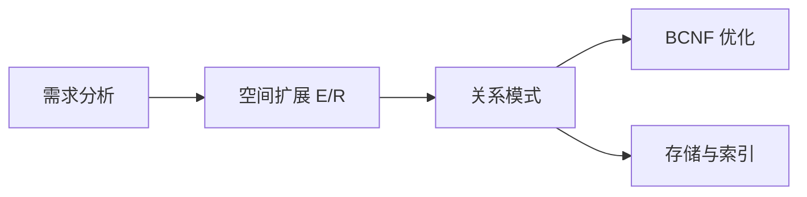
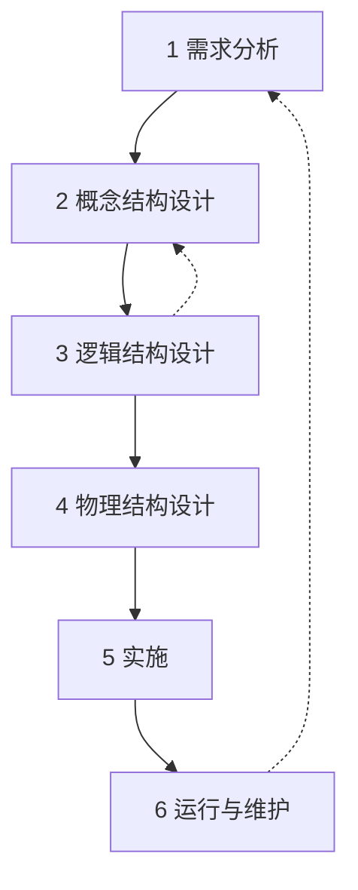
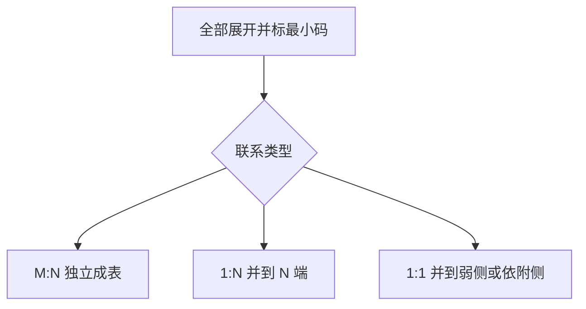

## 空间扩展 E/R

选定具体 DBMS、写出 `CREATE TABLE` 之前，先就结构达成一致：为哪些实体建模、实体如何关联、领域里有哪些约束、几何类型用什么象形图标出。空间扩展 E/R 在实体矩形（必要时也在联系菱形）上加空间象形图（pictogram），把点、线、面写成概念层的一等约束，再机械转成带几何列的关系。

几何对象模型、九交与 `ST_` 谓词见 [几何对象与 PostGIS](04-geometry-and-postgis.md)。转换得到的关系有没有插入、更新、删除异常，见 [关系设计理论](06-normalization.md)。本页停在概念结构画清楚，并机械转成带几何列的关系。栏目总览见 [空间数据库](index.md)。



图示说明：本页完成需求到空间扩展 E/R、再到关系的正向路径；规范化与物理设计分属后续页面。

## 设计六阶段

数据库设计要在选定某一套 DBMS、某一套几何类型实现之前，先把结构谈清楚。需要回答四件事：为哪些实体建模；实体如何相互关联；领域里有哪些约束；怎样才算好的设计。同一批事实可以有多种模式，查询代价、插入代价和冗余可以差出一个数量级。把数据存进去只满足可写入；好的设计还要求结构合理、使用方便、效率较高。

设计任务：对给定应用领域，为某一部门或组织，设计出某种 DBMS 所支持的、结构合理、使用方便、效率较高的数据库及其应用系统。设计必须与应用系统设计结合。

-   **结构设计**：管框架，即模式。有哪些关系、码、外码、几何列。
-   **行为设计**：管程序与事务。用户一点搜索、一次下单，库里插入什么、返回什么。

Chen 1976 年论文《The Entity-Relationship Model: Toward a Unified View of Data》的动机，是给出一种对技术问题足够精确、对非技术人员又足够抽象的视觉语法。概念层的 E/R 必须足够精确，技术人员据此往下转换；又不过度绑定实现，非技术人员据此参加讨论。设计时手画 E/R，不绑定某一 CASE 工具。

六阶段迭代进行：画完仍会改。需求理解加深、发现冗余联系、两套库要合并，都会迫使回到概念层改图。本页给出 E/R 到一组关系的机械步骤；关系有没有异常，用函数依赖检验。



图示说明：六阶段按产物推进，运行维护与逻辑层发现问题后回到概念层改图。

| 阶段 | 要做什么 | 产物 |
| --- | --- | --- |
| 需求分析 | 全面了解用户需求；技术人员与非技术人员共同回答存什么、怎么用、用数据做什么、谁可以访问 | 数据流图；数据字典 |
| 概念结构设计 | 整个设计的关键；对需求综合、归纳、抽象，得到独立于具体 DBMS 的概念模型 | E/R；加象形图后即空间扩展 E/R |
| 逻辑结构设计 | 把概念结构转换成该 DBMS 支持的数据模型并优化 | 关系数据库模式；本页完成转换；[关系设计理论](06-normalization.md) 用 BCNF 优化 |
| 物理结构设计 | 为逻辑模型选存储、索引、权限，使响应时间、处理频率、空间与维护代价达到要求，并落实安全 | 存储、填充曲线、空间索引与查询规划 |
| 实施 | 用数据语言、工具与宿主语言建库、写程序、组织入库、试运行 | `CREATE TABLE`；WKT 插入；ETL |
| 运行与维护 | 评价、调整、修改 | 迭代后的模式与程序 |

### 数据流图与数据字典

**数据流图（Data Flow Diagram，DFD）**：表达数据流向与处理功能，是现行系统的逻辑抽象，独立于实现。

-   **矩形**：数据的源或终点，即外部实体。
-   **两端开口的矩形**：数据存储。
-   **椭圆**：处理。
-   **箭头**：数据流。

阅读路径是源进入处理，处理读写存储，再流向汇。采购确定供应商一类的例子：采购员作为源，进入确定供应商处理；处理从商品参考价格存储读取，把供应商信息写入供应商存储；再进入签订订货合同，合同写入相应存储，终点是供应商。本页不展开分层 DFD 的画法。

**数据字典**：各类数据描述的集合，是详细收集与分析的主要结果。内容包括数据项、数据结构、数据流、数据存储、处理过程。数据项是最小单位；数据结构是数据项的组合。用数据项与数据结构的定义去刻画数据流、数据存储的逻辑内容：类型、含义、取值。后文消除冗余、判别同名是否同一实体，依据仍是字典与 DFD。矩形里的汉字不能单独作为依据。

### 从数据流图到分 E/R

数据抽象把需求分析得到的数据分类、组织，形成三件东西：实体；实体的属性及标识实体的码；实体间联系类型（1:1、1:N、M:N）。步骤是先选局部应用，逐一设计分 E/R，再集成到全局。

分层 DFD 中通常取中层作为分 E/R 的出发：高层只反映概貌；低层过细；中层反映各局部应用的组成。然后从数据字典抽出该局部的数据，标定实体、属性、码与联系。

人事管理子系统是分 E/R 的典型局部。需求调查得到的功能包括：统计各部门人员需求并生成招聘信息；查询面试者并对初选合格者面试；根据面试记录为合格者建立职工记录；建立工作安排表并查询排班；建立出勤记录，生成出勤统计，作为奖金依据。从 DFD 抽象实体：数据源参加面试人员、人事管理部门对应实体面试人员、人事部门；数据源职工与数据存储职工记录表合并为实体职工；存储工作安排表、员工出勤记录、奖惩表对应实体任务、出勤记录、奖惩表。同一对象在图里出现两次，概念上仍是一个实体集。分 E/R 上的联系大意：人事部门对面试人员进行面试；通过者进入职工实体集；职工参与任务；一名职工对应多条出勤记录；职工拥有奖惩信息。这只是公司人事局部，不是全局模式。局部图画快，集成时会暴露命名与结构冲突。

### 局部 E/R 集成到全局

集成方式有三种。

1.  **一次集成**：一次合并多个分 E/R，局部简单时可用。
2.  **逐步累积**：先合并两个关键局部，再每次加入一个。
3.  **平衡 / 两两合并**：先两两合成，再合并结果。

集成必须先解决冲突，再修改与重构。

**属性冲突**两类：属性域冲突，即类型、取值范围或取值集合不同，例如同一年龄一处整型、一处字符串；属性单位冲突，例如吨与千克。合并时必须统一。

**命名冲突**两类：同名异义；异名同义。两张图都出现职工，是否同一实体，要对照数据字典，不能只看矩形里的字。

**结构冲突**三类：同一对象在不同应用中抽象层次不同，一处当属性、一处当实体；同一实体在不同局部中属性集合或排列不完全相同；实体间联系在不同局部中类型不同，一处 1:N、另一处 M:N，或一处有联系、一处没有。

修改与重构的核心是去掉不必要的冗余。冗余数据是可由基本数据导出的数据：年龄可由出生年月导出；若存年龄，每年都要全体加一，漏加则全错。冗余联系是可由其他联系导出的联系，或当前应用根本不查询的联系。冗余破坏完整性、增大数据量、提高维护代价：本应插一行，却要在多张表插多行。消除不必要冗余后的初步 E/R 称为基本 E/R。分析依据仍是数据字典与 DFD 中关于数据项逻辑关系的说明。

空间库里还多一类冲突：同一地物一处 `Point`、一处 `Polygon`，或 SRID 不一致。这是象形图与几何类型在集成阶段的回声。

## 实体、联系与约束

画好一张 E/R，归纳为三块：实体、联系、约束。形状约定重要，颜色不重要：实体集用矩形，属性用椭圆，联系用菱形。具体某一个体不画进图里。

### 实体与实体集

**实体（entity）**：个体对象，例如某一个人、某一件产品。

**实体集（entity set）**：对象的类或类型，例如 Person、Product，表示该类型一切可能实体的集合。图上的矩形代表实体集。

属性画成连到矩形的椭圆。产品例：实体集 Product，属性 name、category、price。图不画出某一行实例；那些是实体，不是实体集。

**码（key）**：唯一标识实体的最小属性集。主码属性在椭圆上加下划线。E/R 强制指定一个主码，即使候选码有多个；图上没有正式办法画出多个候选码。若 name 在业务上全局唯一，则 `{name}` 是码，`{name, category}` 不是码：它能唯一标识，但不最小。若不同类别允许同名产品，则必须用 `{name, category}`。学生关系里学号与身份证号都可以是候选码，图上只给一个主码加下划线。

### 联系：集合、码、属性、多重性

联系画在实体集之间的菱形上。产品与公司之间可以有 Makes；人与产品之间可以有 buys；人与公司之间可以有 employs。

设实体集对应集合 A、B。笛卡尔积 A × B 是全部有序对。联系是 A × B 的一个子集，因此是集合，同一对实体至多出现一次。Makes 是 Product × Company 的子集：并非每个公司制造每件产品。数值例：公司 GizmoWorks、GadgetCorp；产品 Gizmo、GizmoLite、Gadget。笛卡尔积 6 行，Makes 只取 3 行，例如 GizmoWorks 制造 Gizmo 与 GizmoLite，GadgetCorp 制造 Gadget。

**联系的码**：因为联系是集合，每一对参与实体至多对应一条联系实例，故联系由参与实体的码唯一确定：`Key(Makes) = Key(Product) ∪ Key(Company)`，例如 `{Product.name, Company.name}`。进入 1:1、1:N 之后，这个并集往往不是最小码；并集保证标识，不保证已经最小。

**联系可以有属性。** Makes 上可挂 since，即公司从哪一年开始制造该产品。since 对每一公司与产品对是隐含唯一的：同一对只能有一个开始年份。应存可从当前日期导出时长的 since，不存会随时间漂移的时长。年龄与出生年月是同一类选择：存起始时刻，不存每年都要更新的派生量。

每对实体至多一条联系，既是定义，也是陷阱。若用菱形 buys 连接 Person 与 Product，语义立刻变成一个人买某一产品只能买一次。真实购物通常允许同一人多次购买同一商品，此时不能把购买留作联系，而要升成实体。

**多重性（1:1、1:N、M:N）。** 箭头 X → Y 表示存在从 X 到 Y 的函数：给定 X 的一个实体，至多对应 Y 的一个实体。有箭头的一侧是一，无箭头的一侧是多。1:N 与 N:1 只是箭头方向相反，不是第四种类型。

| 类型 | 函数图像 | 图示两种等价写法 |
| --- | --- | --- |
| 一对一 | 两边都是函数 | 两侧都标 1；或两侧都画箭头 |
| 多对一 / 一对多 | 只一侧是函数 | 标 1 与 N；或只在一侧画箭头 |
| 多对多 | 都不是函数 | 标 M 与 N；或两侧都无箭头 |

领域例子：美国每个州一个首府、每个首府属于一个州，是 1:1；一个州有多个城市、每个城市属于一个州，是 N:1；一个国家可被多条河流穿过、一条河流可穿越多个国家，是 M:N。

是否画箭头完全取决于业务，没有与领域无关的标准答案。若业务规定一件产品只由一家公司生产，则 Product → Company；若允许联合制造，则不要箭头。若一人只能受雇于一家公司，则 Person → Company；若允许兼职多家，则不要箭头。需求没写的约束先不标；一旦被箭头禁止了合教、兼职、联合制造，模式就写错了。

### 约束

找约束是建模的一部分。归纳五类。

1.  **码约束**：实体唯一性；SSN 标识人。图上下划线。联系的码即参与实体码的并，再按多重性取最小。E/R 没有正式办法画出多个候选码，只标主码。
2.  **单值约束**：例如一个人只有一个父亲；1:1 或 1:N 在一的一侧。学生只属于一个班级，则班级对学生是单值的。
3.  **参照完整性**：被引用实体必须存在；例如你任职的公司必须已在库中。图上常用箭头加粗线全部参与表示恰好一个。
4.  **空间概念约束**：例如河流几何是 MultiLineString。用象形图标注。这是相对普通数据库课新增的一类。
5.  **其他**：年龄在 0 与 150 之间等，E/R 往往写在旁注，不进入矩形与椭圆符号体系。

**部分参与 vs 全部参与。** Product - makes - Company：是否存在没有公司制造的产品；是否存在不制造任何产品的公司。细线表示允许部分参与；粗线表示全部参与，每个产品都必须有制造者。

**参照完整性的两种箭头。** 仅箭头：每个产品至多由一家公司制造，允许没有公司。箭头加全部参与：每个产品恰好由一家公司制造，这同时给出单值与外码必存在。

约束小结对应到图上的墨水：下划线对应码；1:1 或 1:N 对应单值；再加粗线全部参与对应参照完整性；象形图对应空间类型。

### 贯穿例：学校

先定四个实体集及属性、码，再补联系与象形图。图上没有学生张三，也没有某一节课的一次点名。

**School（学校）**

-   属性：name 为主码，校名唯一；location 为地址字符串；website。
-   几何：用多边形象形图表示 footprint，不要另发明校园形状属性。

**Student（学生）**

-   属性：id 为主码；fname；lname；year，入学或所在年级年份一类的年份属性。

**Teacher（教师）**

-   属性：id 为雇员号，主码；fname；lname；salary。

**Class（课程开课）**

-   属性：class code 为课程号；quarter 为学期，春夏秋冬之一；description；time，星期与节次等。
-   主码必须是 `{class code, quarter}`，不能只用课程号。同一门课每个学期最多开一次，但可以在不同学期重复开。只用课程号无法区分春季的数据库与夏季的数据库。

需求约束：一名学生只就读一所学校，但可选许多门课，每次选课有成绩 grade；一所学校开设许多门课，一门课只由一所学校开设；一名教师可以教许多门课。需求没有写一门课只能由一名教师教。没写的先不标箭头。后文转换按知道课程开课即知道教师处理，即 Class : Teacher = N : 1。

```mermaid
erDiagram
    SCHOOL ||--o{ STUDENT : Attends
    SCHOOL ||--o{ CLASS : Offers
    TEACHER ||--o{ CLASS : Teach
    STUDENT }o--o{ CLASS : Takes
    SCHOOL {
        string name PK
        string location
        string website
        polygon geom
    }
    STUDENT {
        string id PK
        string fname
        string lname
        int year
    }
    TEACHER {
        string id PK
        string fname
        string lname
        float salary
    }
    CLASS {
        string code PK
        string quarter PK
        string description
        string time
    }
```

图示说明：学校对开课、学校对学生都是 1:N；选课是 M:N；教师对开课按一门课一名教师处理为 1:N。

**Attends（Student，School）**：基数 Student : School = N : 1；无自身属性。图：Student -N- Attends -1→ School。

**Takes（Student，Class）**：基数 M:N；属性 grade。成绩必须挂在菱形上，不能挂在 Student 上，一名学生多门课多个成绩；也不能挂在 Class 上，一门课多名学生多个成绩。联系码为 `{Student.id, Class.code, Class.quarter}`，每个这样的组合对应一个成绩。

**Offers（School，Class）**：基数 School : Class = 1 : N。图：School ←1- Offers -N- Class，或 Class 指向 School 的箭头。

**Teach（Teacher，Class）**：教师可教多门课，Teacher 侧为多端。Class 侧：需求未强制则可暂不画箭头，允许合教。

画图顺序：先标实体与码，再标菱形与 1/N 或箭头，联系属性贴在菱形旁。School 矩形左上角画多边形符号，表示 footprint。

## 空间象形图

象形图用来注释并扩展 E/R，使空间类型成为图上的一等约束，从而可以推断空间关系。实体象形图是插入实体矩形中的微缩几何；联系象形图插入菱形。画在实体矩形左上角，不要画在右侧或下方；图形用给定的点、线、面符号，不要自创。学校例子：School 的 footprint 是多边形，在 School 矩形左上角画多边形符号即可。

实务里实体象形图用得远多于联系象形图；优先标明每个空间实体是点、线、面还是多部件。

多值属性在图上用双椭圆表示，与单椭圆原子属性、派生属性相区别。州立公园草稿里 Lineid、pointid 曾以双椭圆出现；采用扩展 Geometry 之后，这些组成线的点的 ID 列表往往不再作为属性出现。

### 实体象形图

| 类别 | 含义 | 例子 |
| --- | --- | --- |
| 基本形状 | 点、线、面 | 桥为点；河流为线；林区为面 |
| 复合形状 | 基本形状加基数 0,1 / 1 / 1,n / 0,n / n | 多点、多线、多面 |
| 导出形状 | 由其他形状计算得到；斜体或平行四边形框 | 城市中心点由边界多边形导出 |
| 备选形状 | 同一对象在不同条件下的不同几何 | 道路：施工用多边形，导航用线；房屋：大比例尺多边形，小比例尺点 |
| 任意形状 | 通配符 * | 灌溉网：泵站为点，水渠为线，水库为面 |
| 自定义 | 用户符号 | 灌溉图一类专用符号 |

复合基数必须口头解释清楚。

-   **1**：恰好一个该形状。
-   **1,n**：至少一个，可以有 n 个。
-   **0,n**：可空可多个。
-   **n**：多个，数量不作 0/1 区分。
-   **0,1**：至多一个，可空。

最常用的仍是点、线、面与多点、多线、多面。国家与首都转换例里 Country 旁的 `1.n` 即 MultiPolygon。

### 联系象形图

联系象形图两类 part-of。

-   **网络 part-of**：道路属于道路网，连通成网。微缩图中斜线与下划线位置与分区不同。
-   **分区 part_of**：把土地划成地块；森林划成林班。下划线在图形最下方。

二者不要混：林班是把森林剖开，不是把道路连成网。转换时 part-of 没有独立规则；公园里森林与林班的分区 part-of 按 1:N 处理，林班表带森林外码。

## 设计选择

会画符号之后，真正拉开设计质量的是三个选择。原则都指向同一件事：E/R 里联系是集合、属性在实体上单值，这两条数学约定，和现实里可重复、可多值、可三方经常冲突；冲突时宁可多一个实体，也不要偷偷违反集合语义。若在 E/R 阶段不改，转换后会出现多值属性，[关系设计理论](06-normalization.md) 会以多值依赖的形式变成严重冗余。在画 E/R 时就改掉，不要等到分解算法。

### 属性 vs 实体

问题：雇员有多个地址，地址内部还有街道、ZIP、省市区结构，是做成 Employee 上的 Addr1、Addr2，还是做成 Address 实体。

做成两个或三个属性列：等于假定最多两个地址。第三个地址无处可写；只有一个地址的雇员，Addr2 长期为空，浪费且不整齐；一旦出现第四个地址，要改表结构。地址若还要按 ZIP、按省查询，塞在字符串里更不方便。

一般规则：要记录若干个值时，选择新实体。多值属性提升为实体 Address，带 street、ZIP 等原子属性，用 1:N 联系 AddrOf 连到 Employee：一个雇员多个地址，一个地址属于一个雇员。收货地址可送到寝室、家里、同学处，个数事先未知，必须是实体。手机号同理：一人多号就不要把手机号只当单值属性。餐厅的多个菜品、骑手工作时间内按固定间隔上传的多个位置，都是这条规则的空间版。

### 联系 vs 实体

Product - Purchased - Person，菱形上有 date。这张图在说：一个人购买某一特定产品只能一次，只能有一个日期。因为 Purchased ⊆ Product × Person，同一对只能有一行。

若业务允许同一人多次购买同一产品，今天一单、明天再一单，必须把购买升成实体 Purchase，带 date、PID#、quantity 等，再分别用 ProductOf、BuyerOf 连到 Product 与 Person。新实体可以有自己的主码，例如订单号；同一人与产品对可以对应多条购买。

规则：每个实体组合允许多个实例时，不要用联系，改用实体。联系让该组合唯一；不唯一时用实体。选课成绩挂在 Takes 上，依据是一名学生选某一开课只发生一次；下单、分配骑手、上传轨迹点通常重复发生，故宜作实体。

### 多元联系 vs 新实体加二元联系

购买还涉及商店：人、产品、商店三方。可画一个三元菱形 Purchase 连三个矩形。

三元上画箭头约束极强。例如箭头指向 Store：在另外两方已定时，商店被函数确定，语义接近某人买某产品时只能在一个商店发生一次。无法自然表达每人至多逛一家店这类只约束其中两方的条件；三元上的箭头只是近似。三元同样继承集合语义：同一人、产品、商店至多一行，不能表示同一人在同一店多次买同一商品。

改造：引入实体 Purchase，可有 date，再用三个二元联系 ProductOf、StoreOf、BuyerOf 分别连到 Product、Store、Person。一次具体购买确定之后，人、店、商品都确定，三个联系在 Purchase 侧为一，可画箭头；不同日期仍是不同购买实体，故可重复买。Purchase 侧指向三个实体的箭头，表示一次购买行为函数地决定人、店、商品；这与同一人可购买多次不矛盾，因为每次购买是不同实体。

何时留三元、何时拆：

-   **拆成实体加二元**：需要同一组合出现多次；或要把约束、属性加在关系的一部分上，例如某人只在一家店购物、某人在某店购物多久。
-   **保留多元**：联系确实是多方同时成立的原子事实，例如三方法律合同，不允许拆成先两方、再第三方而不损失语义。

常见业务例子里，拆成实体加二元几乎总是更安全；保留多元适用面窄。

常见画错：

-   Product - Purchase - Person 且 Person 侧有箭头：不仅不能买多次，而且一个人只能买固定的一种产品，人一确定，产品被函数确定。同一产品仍可被多人买。这通常不是商场语义。
-   Country - President - Person 若不加约束：变成国家与人之间的 M:N，一国多位总统、一人任多国元首都可以，与一国同一时期一位元首不符，必须加 1:1 或至少 N:1，并考虑任期时间；往往应把任职做成带日期的实体。
-   三元 Purchase 上把 date 以及 personName、personAddr 画成属性：人的地址被绑死在这一次三元事实上，人无法独立存在，也难以表达多次购买。
-   把 Dates 做成与 Purchase 并列的实体却缺少正确基数：日期不是与产品、商店平级的参与方，更自然的是 Purchase 的属性或弱实体。

### 贯穿例：州立公园

场景：州立公园含多片森林；每片森林由不同树种的林班组成；有道路进出并有管理员；有设施；河流穿过公园并为设施供水。这是空间应用：实体具有独立概念或物理存在，靠属性刻画，靠联系交互。

设计按五步走，不要一上来就画满菱形。

**第一步：实体。** River、Road、Forest、Forest-Stand、Facility、Fire-Station、Manager 等。

**第二步：属性。** 森林有 name、elevation；道路有车道数、长度等。草稿中 Lineid、pointid 曾标成双椭圆多值属性，一条线由多个点 ID 组成。原子属性用单椭圆。不要在属性名里再写一遍这是几何；那是下一步象形图的职责。

**第三步：联系。**

| 联系 | 参与实体 | 基数 | 说明 |
| --- | --- | --- | --- |
| Crosses | River，Road | M:N | 河流与道路穿越 |
| supplies_water_to | River，Facility | M:N | 河流为设施供水 |
| Accesses | Road，Forest | M:N | 道路进入森林内部 |
| Within / Belongs_to | Facility，Forest | 设施 N : 1 森林 | 在多边形内部与管理归属应分清 |
| part_of | Forest-Stand，Forest | 林班 N : 1 森林 | 森林分割为林班；用分区象形图 |
| Monitors | Fire-Station，Forest | 消防站 N : 1 森林 | 一森林多个消防站，一站属一森林 |
| Manages | Manager，Forest | 按管理职责建模；常见为 1:N 或 1:1 | 管理职责；不是空间谓词 |

**第四步：象形图。** 设施、消防站为点；森林、林班为多边形；道路、河流为线。Forest 与 Forest-Stand 的 part_of 用分区联系象形图：一片森林分成两块林班，不是道路那种网络。Manager 无强制几何，人可以不存点。

**第五步：按设计选择改图。** 三条把空间 E/R 从普通 E/R 里区分出来。

1.  空间属性不必再用椭圆写出几何字段；左上角象形图已经隐含该实体有一个 Geometry 列，类型即点、线、面或多部件。Lineid 点列那种多值属性，在 Geometry 实现下是多余的。
2.  真正的多值属性必须改成实体加联系，避免多值依赖。
3.  不必要的联系删除，以免转换成多余的表。河流与道路是否 Crosses、设施是否 Within 森林，都可以运行时用 `ST_Crosses`、`ST_Within` 计算；若应用从不把穿越当需要更新的事实来维护，就不要存。归属往往需要存，因为那是管理语义，不是纯几何：林班属于哪片森林、设施行政上属于哪片森林。

草稿上 Crosses、Within、Accesses 中可计算的空间谓词，与几何列重复。保留几何加必要的管理型联系，是空间 E/R 的关键差别。供水、管理、监测若是业务要维护的事实，哪条河被指定给哪个设施、谁当管理员，则应存；纯几何相交则删。

???+ tip "落表还是运行时计算"

    可计算的空间谓词默认不存：`ST_Crosses`、`ST_Within`、`ST_Intersects` 在查询时求值。

    管理归属、指定关系、需要更新的业务事实落表：林班属于哪片森林、桥连接哪两条路段、骑手指定哪块配送区。

    否定空间约束通常要靠触发器或应用程序：建筑物不得落入湖泊。

    模式表达引用必须存在；几何不得落入某处不能单靠外码表达。

## 从 E/R 图到关系

选定关系模型之后，转换的总原则：实体集变成关系，联系也变成关系。然后再看哪些 1:1、1:N 可以合并，以减少表的个数、避免查询时多一次连接。几何列在展开阶段就要写上，合并后仍保留学校多边形 footprint。



图示说明：先一对一展开并标最小码，再按联系类型决定是否合并；M:N 留下，1:N 并到 N 端，1:1 并到依附侧。

### 实体 → 关系

每个元组对应一个实体；列为属性；实体主码即关系主码。Product 例：

```sql
CREATE TABLE Product (
  name     CHAR(50) PRIMARY KEY,
  price    DOUBLE,
  category VARCHAR(30)
);
```

对应实例：`(Gizmo1, 99.99, Camera)`、`(Gizmo2, 19.99, Edible)`。

转换细则：

-   主码 → 主码；属性 → 属性。
-   复合属性 → 拆成若干原子属性。
-   多值属性 → 应在 E/R 阶段改成实体加联系；若仍留下，则另建关系，用外码指回原实体。
-   实体象形图 → PostGIS 的 `Geometry` 类型，或具体 `Point` / `LineString` / `Polygon` / `Multi…` 加上 SRID。转换时几何信息不能丢。

走非扩展几何类型实现时，几何仍作为关系中的属性，BLOB 或拆到 Geometry 表，只是没有扩展类型系统。本栏目按扩展类型写 `geom(Point)` 这类标注。这对应两条逻辑实现路径：基于预定义类型，numeric 与 BLOB，用户侧常拆成要素表与几何表；基于扩展 `Geometry` 类型，要素表内直接有几何列，PostGIS 走这条。细节见 [几何对象与 PostGIS](04-geometry-and-postgis.md)。

### 联系 → 关系

参与实体 A1, …, An 的联系：每一行是一个唯一的实体组合。列等于各实体主码的并，再并上联系自身属性。各实体主码同时做外码；默认主码是这些主码的并。

Purchased 例：Product.name，Person 的 firstname 加 lastname，加上 date。

```sql
CREATE TABLE Purchased (
  name      CHAR(50),
  firstname CHAR(50),
  lastname  CHAR(50),
  date      DATE,
  PRIMARY KEY (name, firstname, lastname),
  FOREIGN KEY (name) REFERENCES Product,
  FOREIGN KEY (firstname, lastname) REFERENCES Person
);
```

默认主码取并集，是因为联系是集合。但进入 1:1、1:N 后，并集往往不是最小码，合并时要用真正的最小码。

### 1:1、1:N、M:N 转换与合并

| 联系 | 转换 | 合并 |
| --- | --- | --- |
| M:N | 必须单独成表 | 不合并 |
| 1:1 | 可先单独成表 | 可与非强制性实体或弱实体合并；两边码都唯一确定对方时，选弱或依附的一侧并入 |
| 1:N | 可先单独成表 | 与 N 端实体合并；N 端每一行对应唯一的 1 端 |

合并条件：用于合并的两张表在联系意义上对齐主码，N 端或弱实体的每一实体对应唯一联系实例。合并理由：减少关系个数，查询免去一次连接，效率更高。误并到 1 端会重新引入多值属性：一人多地址无法在 Employee 的一行里放下。

步骤记忆：先全部展开并标最小码 → 1:1 / 1:N 看哪一端当作主码 → 主码相同的表合并 → M:N 留下。

???+ warning "合并不自动保证 BCNF"

    联系尽量与实体合并，结果都须属于 BCNF。

    合并用的是最小码规则；是否 BCNF 用 [关系设计理论](06-normalization.md) 检验。

    几何列在展开阶段写上，合并后不要丢 SRID 与类型。

### 1:1：国家与首都

Country Has Capital，1:1，几何分别为 MultiPolygon 与 Point。Country 象形图常用复合面 `1.n`。

先不合并：

-   `Country(cid, name, geom(MultiPolygon, 4326))`
-   `Capital(id, name, location(Point, 4326))`
-   `Has(cid, id)`

`{cid, id}` 不最小。一国一个首都，cid 确定 id；一个首都属于一国，id 确定 cid。cid 与 id 都是候选码。

合并：首都依附于国家，把联系并入 Capital：

-   `Country(cid, name, geom(MultiPolygon, 4326))`
-   `Capital(id, name, location(Point, 4326), cid)`

等价于原来的 Capital 加 Has，Has 的主码取 id。并入 Country，Country 增加首都 id，也可以，表个数同样变成两个。优先并到弱的一侧。不能把码不同的表硬并成一张。

### 1:N：雇员与地址

Employee 1 对 N Address：一个雇员多个地址，一个地址一个雇员。

先不合并：

-   `Employee(eid, name)`
-   `Address(aid, streetAddr, zip)`
-   `AddrOf(eid, aid)`

AddrOf 的主码是 aid：eid 会重复，一人多地址；确定地址即确定雇员。`{eid, aid}` 不最小。合并到 N 端 Address：

-   `Employee(eid, name)`
-   `Address(aid, streetAddr, zip, eid)`

误并到 1 端 Employee 时，一人多地址无法在一行里放下，会退回多值属性。这与多值属性升实体是同一条链的两端：E/R 阶段升实体，转换阶段把 1:N 并回 N 端，得到的是一雇员多行地址。

### M:N 与三元：必须独立成表

M:N 联系必须单独成表，主码取两侧实体主码之并，再并上使该组合唯一所必需的属性。学校 Takes 是标准模具，见下一小节。

三个实体 Product、Person、Store，一个三元联系 Purchased，属性 date。M:N:K 多元一般先不合并，四个关系：三个实体关系各抄属性与主码；`Purchased` 列为三个实体主码之并加 date，主码为三个实体主码之并，三个外码分别引用三张实体表。

若已按设计选择改成 Purchase 实体加三个二元 1:N，则 Purchase 表自带订单号主码，三个外码指向三张表，等价于已经合并到新实体。下单、分配骑手走这条路，不要再画一个三元菱形然后为最小码发愁。

### 学校 E/R 转关系

先实体一张表、联系一张表，几何写全；再按主码相同者合并。按一门课一名教师补全 Teach 的 1 端。

未合并八个关系：

1.  `School(name, location, website, geom(Polygon, SRID))`，主码 name。多边形来自象形图，不能漏。
2.  `Student(id, fname, lname, year)`，主码 id。
3.  `Teacher(id, fname, lname, salary)`，主码 id。
4.  `Class(code, quarter, description, time)`，主码 `(code, quarter)`。
5.  `Attends(student_id, school_name)`。真正主码是 `student_id`，一名学生一所学校；`school_name` 可由学生确定。
6.  `Offers(school_name, code, quarter)`。真正主码是 `(code, quarter)`，一门开课只属于一所学校。
7.  `Takes(student_id, code, quarter, grade)`。M:N，主码 `(student_id, code, quarter)`，不合并。
8.  `Teach(teacher_id, code, quarter)`。按一门课一名教师，主码是 `(code, quarter)`。

合并后五个关系：主码同为 `(code, quarter)` 的 Class、Offers、Teach 并成一张课程表；主码同为 `student_id` 的 Student 与 Attends 并成一张学生表。

-   `School(name, location, website, geom)`
-   `Student(id, fname, lname, year, school_name)`，`school_name` 外码引用 School
-   `Teacher(id, fname, lname, salary)`
-   `Class(code, quarter, description, time, school_name, teacher_id)`：一门开课属于哪所学校、由哪位教师教
-   `Takes(student_id, code, quarter, grade)`：外码分别引用 Student 与 Class

两则推导：

-   **成绩不能放进学生表。** Takes 是 M:N。若 `grade` 放进 Student，一名学生一行无法存放多门课成绩；若放进 Class，一门开课一行无法存放多名学生成绩。只有放在联系或升格后的选课实体上，码 `{student_id, code, quarter}` 才与一次选课一个成绩对齐。
-   **联系码何时不是两侧码之并。** 1:1 Has：cid 与 id 都是候选码。1:N AddrOf：主码是 N 端码 aid。学校 Attends：学生 id 确定学校；Offers / Teach：开课 `(code, quarter)` 确定学校与教师。M:N 的 Takes 才真正需要并集。

## 蓝湖：空间数据库设计实例

实例来自 OGC Simple Feature Access Part 2 SQL Option 的符合性测试。路径是：场景 → 九类要素的概念设计 → 带几何的要素表 → PostgreSQL / PostGIS 物理实现。SQL 原文与答案在标准第二部分。本页只把九类要素与外码能抓住的管理型引用写到可跟画；三十余条查询不逐条展开。

### 场景与九类要素

图示区域是通用横轴墨卡托投影下的矩形，水平坐标系统 **32214**。WGS72 / UTM 14 带东伪偏移 500000 m，单位为米。鹅岛上的蓝湖是重要要素。南北向水系：从北注入湖的部分称卡姆河，从湖向南流出的部分无名。有区域阿诗顿。州属森林管理范围包括湖与阿诗顿的一部分，构成州属森林边界；绿森林等于种树森林减去湖，是导出形状的直观例子。

5 号路延伸出地图。组合的 75 号路高速用粗双黑线表示，每条线是分离高速的一部分，两条路视为多线。跨越卡姆河的卡姆桥视为点。与 5 号路共享一段的主街总是四车道。沿主街两座建筑物，可视为点或矩形区域，即备选形状。一车道道路构成种树森林边界的一部分。两个鱼池不独立、应一起建模，故为多多边形。

同时具有空间与非空间属性的对象称为要素。抽象为九类：

| 要素 | 象形图 / 几何 | 备注 |
| --- | --- | --- |
| 桥 | 点 | 卡姆桥 |
| 路段、河流 | 线 | 路段是道路最小建模单位；不同路段可有不同别名与车道数 |
| 组合路 | 多线 | 75 号路两条分离车道 |
| 建筑物 | 点或多边形，备选 | 不同用途或比例尺；两列几何 |
| 池塘 | 多多边形 | 两鱼池作为一件要素 |
| 湖泊、岛、区域 | 多多边形 | 蓝湖、鹅岛、阿诗顿等 |

路段作为最小建模单位，是因为同一道路不同路段可有不同别名与车道数。这与学校 Class 必须带 quarter 是同一类问题：看起来像一个对象，码却要更细。

概念设计列表有一处把组合路写成多边形，与同一文本前文视为多线不一致。按场景描述，组合路理解为 MultiLineString；建筑物才是点 / 面备选。几何类型以场景段多线、点、多多边形、备选为准。

本例的行为规则，不自动推广到任意流域：

-   1 座桥连接 2 条路段。
-   1 座桥跨越 1 条河流。
-   1 条河流可能注入 0 或 1 个湖，或从 0 或 1 个湖流出。
-   建筑物不能位于湖泊或池塘中，也不能位于路段上。

这些规则一部分可以变成外码：桥表上路段 1 ID、路段 2 ID、河流 ID；河流表上注入湖泊 ID；岛表上所在湖泊 ID。不位于这类否定空间约束通常要靠触发器或应用程序，不能只靠外码。

### 逻辑结构与物理要点

每个要素转成带几何类型扩展的二维要素表。若 DBMS 几何类型足够丰富，列应写成相应类型；若只有泛化的 `Geometry`，则点、线、面的限定放在应用层。建筑物两个 geometry 字段：位置为点，形状为多边形，对应备选象形图。表名、列名建议英文。空间关系未编码进外码的部分，不要假装已经由模式强制。

连接、跨越、流出、包含在一定程度上分别通过桥表的路段 1/2 ID、桥表的河流 ID、河流表的注入湖泊 ID、岛表的所在湖泊 ID 限制；其余空间关系仍要触发器或应用程序。这与州立公园一致：用外码抓住的管理型引用就抓住；纯几何谓词留给 `ST_` 函数。

物理设计选用 PostgreSQL / PostGIS。建表前检查 `SPATIAL_REF_SYS` 是否已有 WGS72 / UTM 14 带；没有则插入该空间参考系。建表后在 `SPATIAL_REF_SYS` 与 `GEOMETRY_COLUMNS` 中核对：每建一个几何列，后者会多一行。插入使用各要素的 WKT。导入后可在 QGIS 中目视检查蓝湖地区。标准随后给出约 35 条查询：简单查询、复杂查询、用空间关系做 Spatial Join。题目与参考答案都在 SFA Part 2。

本例 SRID 32214 的坐标单位已是米，长度、面积、距离的解释与 `4326` 经纬度默认不是米不同。换投影时不要把两套单位混用。

## 实施阶段：几何如何进入已设计的表

模式按本页画好之后，几何仍要从外部进来。概念模式决定表有哪些几何列；实施阶段才把坐标写进去；目视检查是试运行的一部分。三条典型路径只记接口，不记操作步骤。

1.  **已有要素表，用属性作注记标签。** 在图层属性中选名称等字段作为 label，文字叠在几何之上，便于核对立面是否对、注记是否可读。标签来自属性表，叠在几何之上。这一步只可视化，不改表模式。
2.  **OpenStreetMap 导出后入库。** 框定视野得到 `.osm` 文件，导入工具自动建表并建索引。导入后应目视检查范围与图层是否齐全，行数只作辅助。安装与参数以工具官方文档为准。`osm2pgsql` 按 OSM 键值自动出表，模式与业务侧 E/R 分离；要进入自有模式，还需一层 ETL。
3.  **轨迹类：先属性、后几何。** 网页或日志给出经度、纬度、时刻等，先写入文本或表，再增加几何列，用经纬度构造点，空间参考系取与建库一致的 SRID，演示常用 `4326`，`UPDATE` 写入。骑手每隔一分钟上传当前位置，在 E/R 上应是带时刻的点实体或轨迹点表。骑手上的单个 `position` 属性不能既表示当前又表示全部历史。

蓝湖路径则是：先有符合性场景与九类要素的 E/R，再插入标准 WKT。

查询语义也会反过来约束设计。道路 `Road(rid, name, centerline)`，站点 `Station(sid, sname, pos)`，问没有自行车站点的道路。正确答案用相关子查询加 `NOT EXISTS`，谓词用 `ST_Intersects`：端点也算在路上。笛卡尔积后某一对不相交，不等于与所有站点都不相交；先内连接留下相交对，再要求 `COUNT(*) = 0`，永远得不到空道路。`ST_Within` 可能把端点判假。设计含义：若要把道路上有站点做成联系，那是可计算谓词，公园例子里同类联系默认删；若业务要维护该站点行政上属于哪条路，那是管理归属，应存。

```sql
SELECT rid, name FROM Road WHERE NOT EXISTS (
  SELECT * FROM Station WHERE ST_Intersects(pos, centerline));
```

## 相关阅读

-   [空间数据库](index.md)
-   [几何对象与 PostGIS](04-geometry-and-postgis.md)
-   [关系设计理论](06-normalization.md)
-   [GIS 与测绘](../geospatial/gis-and-surveying.md)
-   [数据库与数据存储](../../../tech/databases.md)

## 来源说明

本页按数据库设计六阶段与空间扩展 E/R 整理：概念结构、象形图约束、关系到带几何列的模式。对照 Silberschatz、Korth 与 Sudarshan《Database System Concepts》第七版数据库设计章（约 7.1 至 7.10），以及 Shekhar 与 Chawla《Spatial Databases: A Tour》中的空间 E/R 与象形图。实体与联系视觉语法见 Chen 1976 年论文 [The Entity-Relationship Model: Toward a Unified View of Data](https://dl.acm.org/doi/10.1145/320434.320440)。蓝湖场景取自 [OGC Simple Feature Access Part 2: SQL Option](https://www.ogc.org/standards/sfs) 符合性测试。几何类型、`ST_` 谓词与系统表以 [几何对象与 PostGIS](04-geometry-and-postgis.md) 及所安装 PostGIS 文档为准。

条文、标准与产品功能以官方文本为准；本页核验日期为 2026-09-04。
