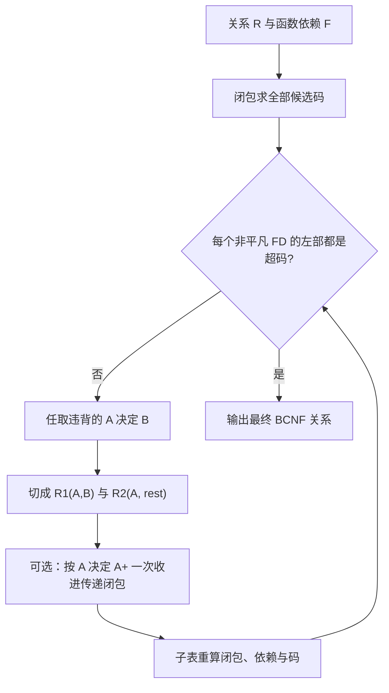

## 关系设计理论

[空间扩展 E/R](05-spatial-er.md) 给出概念结构，并把象形图转成关系。本页进入逻辑结构设计中的规范化：用数据依赖刻画什么样的关系是好的，再用分解消去设计异常。物理层的磁盘、文件与空间索引见 [空间存储与索引](07-storage-and-index.md)。栏目总览见 [空间数据库](index.md)。

好模式有两句可操作的标准。第一，新关系没有设计异常。第二，分解之后原来有的信息都还在，用自然连接重构原关系，即无损连接（lossless join）。

**函数依赖**（functional dependency, FD）把设计推向 **BC 范式**（Boyce-Codd Normal Form, BCNF）。**多值依赖**（multivalued dependency, MVD）把设计推向 **第四范式**（4NF）。分解按下列课上伪代码执行。


设计流水线：扩展 E/R 转关系，写全函数依赖（含几何列），只对违背 BCNF 的依赖分解。

## 数据依赖对关系模式的影响

把 E/R 图转成关系之后，列对得上、主码外码写得上，并不自动得到好模式。一个实体上堆了本该分属多实体的属性，或 1:N 合并到了 1 端，表里就会出现不合适的数据依赖。本页输入是关系、约束与函数依赖；输出是经过规范化、消除异常的一组关系。

班级（1）隶属于学生（N）三种写法对照 [空间扩展 E/R](05-spatial-er.md)，也是本页的反例来源：

-   方法一：`Student`、`Class`、`Class_Student` 三张表，联系单独成关系。
-   方法二：联系并入学生，`Student(..., ClassID)` 与 `Class`。合并后主码仍是学号，这是合理合并。
-   方法三：联系并入班级，`Class(..., Sno)`。码对不上，`Sno` 在班级侧变成多值属性，后面就是多值依赖。

河流流入海洋同理：N 端是河流，把 `seaName` 作为外码放到河流关系上。转换时必须写出几何类型（河流 `MultiLineString`，海洋 `MultiPolygon`），否则象形图信息在逻辑层丢失。

### 数据依赖的含义与分类

数据依赖通过属性之间值是否相等，体现数据之间的相互关系。它是现实世界属性联系的抽象，是数据的内在性质，也是语义的体现。得到关系的同时就应得到依赖，且所有实例都必须遵守。

| 种类 | 直观 | 对应范式 |
| --- | --- | --- |
| 函数依赖 \(A\to B\) | 给定 \(A\) 就唯一确定 \(B\)，写作 \(B=f(A)\) | BCNF；谱系上还有 2NF、3NF |
| 多值依赖 \(A\twoheadrightarrow B\) | 给定 \(A\)，\(B\) 与其余属性的组合必须满笛卡尔积 | 4NF |

多值依赖更抽象。若在 E/R 阶段已把多值属性做成实体，或转换时把多值属性单独做成带外码的关系，后面通常不必再做 4NF 分解。只要发现多值属性，就先转成实体。

### 学校 mega relation 与四种设计异常

从 E/R 直接得到一张大表

\[
\mathrm{Student}(\mathit{Sno},\ \mathit{Sdept},\ \mathit{Mname},\ \mathit{Cname},\ \mathit{Grade}).
\]

语义：一个系有若干学生，一个学生只属于一个系；一个系只有一名主任；一个学生可选多门课，一门课有若干学生；每个学生的每门课有一个成绩。由此得到函数依赖

\[
\mathit{Sno}\to \mathit{Sdept},\quad
\mathit{Sdept}\to \mathit{Mname},\quad
(\mathit{Sno},\mathit{Cname})\to \mathit{Grade}.
\]

函数依赖有好、坏之分。坏的函数依赖造成设计异常（design anomalies）。问这个关系有没有设计异常时，从下面四项逐条举例。

**数据冗余**（redundancy）：浪费存储。每个系只有一名主任，该系有 100 名学生，主任姓名就重复 100 次。

**更新异常**（update anomalies）：冗余使得维护完整性代价大。更换系主任时，本应改一行，现在必须改与该系学生有关的每一个元组。

**插入异常**（insert anomalies）：有些数据无法正常插入。一个系刚成立、尚无学生时，无法把该系及其主任存进这张表：课程与成绩无处安放，且码中含学号、课程号。

**删除异常**（deletion anomalies）：不该删的不得不删。某系学生全部毕业，删学生的同时把该系及主任信息也丢掉了。

这四类异常都来自关系中不合适的数据依赖。解决办法是分解关系模式，消除不合适的依赖，并且还能重构原来的模式。

### 大学申请库：多值属性的笛卡尔积

另一张 mega relation 来自申请：

\[
\mathrm{Apply}(\mathit{SSN},\ \mathit{Sname},\ \mathit{Cname},\ \mathit{HS},\ \mathit{HScity},\ \mathit{hobby}).
\]

一位学生可以上过多所高中、有多项爱好、申请多所大学，因而 `Cname`、`(HS, HScity)`、`hobby` 都是多值属性或属性组合，它们之间存在多值依赖。多值属性之间的笛卡尔积必须全部插入，否则信息丢失。

Ann 的 `SSN=123`，来自 PAHS 与 GHS（均在 P.A.），爱好网球与游泳，申请 Stanford、Berkeley、MIT。三个独立的多值维度是 2 所高中、2 项爱好、3 所大学，必须存

\[
2\times 2\times 3=12
\]

个元组。对第一所大学，高中与爱好的组合就要 \(2\times 2=4\) 行；三所大学则 12 行。不能只存觉得有用的 10 行，也不能对某所大学隐瞒读过的某所高中或某一爱好。表中缺少某些组合，则多值依赖不成立，或信息已经丢了。

这张表同样有四种异常：高中城市、大学名称、爱好被反复存储；把 tennis 改成 table tennis 要改很多行；尚未申请学校的学生插不进去；删除时也会误伤。

### 班级与学生：合并方向与元组计数

设有 10 个班级、每班 30 名同学。

联系与学生合并：`Student(Sno, Sname, …, ClassID)`，`Class(ClassID, num, …)`。班级仍 10 个元组，学生 \(10\times 30=300\) 个元组，一共 310 行，信息不丢。

联系与班级合并：`Class(ClassID, num, …, Sno)`。学生仍是 300 行。对一个班级，学号是多值属性，一班 30 个取值，10 个班便是 \(10\times 30=300\)。合并方向错了，就把本来 10 行的班级表变成带多值依赖的 300 行表。信息不丢的代价是行数从 10+300 变成 300+300，冗余立刻出现。

`Student(Sno, Sdept, Mname, Cname, Grade)` 与 `Apply(SSN, Sname, Cname, HS, HScity, hobby)` 都不是好的模式。好的模式不发生插入、删除、更新异常，数据冗余尽可能小。原因是数据依赖不合适；办法是分解。

### 第一范式与范式谱系

范式（normal form）与数据性质对应。谱系是：第一范式、第二范式、第三范式，再到 BCNF 与 4NF。第五范式见教材，本课不展开。强度大致递增：对属性之间依赖的要求越来越严，满足更高范式的关系集合越来越小。


**第一范式**（1NF）：表是平坦的，类型必须是原子的（atomic），不能是嵌套表或集合值。`Majors={CS, EE}` 违反 1NF；拆成两行 `(Mary, CS)`、`(Mary, EE)` 才进入 1NF。凡在关系数据库里创建并存储的表，都已经是 1NF。几何列 `geometry` 是一个原子对象，满足 1NF。集合值列会逼出多值依赖，例如一个学生多个专业。

第二范式基本不再单独使用。第三范式与 BCNF 基于函数依赖，意在防止数据异常。第四范式基于多值依赖。实践目标：没有多值依赖时，达到第三范式或 BC 范式即可；没有多值依赖的 BCNF 关系自动也是 4NF。2NF、3NF 的形式定义在后文补齐。

### 好函数依赖与 BCNF 的直观定义

先看 `Apply(SSN, Sname, Cname)`。每个大学都重复存储了 SSN 与姓名；存在 \(\mathit{SSN}\to \mathit{Sname}\)，即相同 SSN 始终得到相同姓名。码是 \(\{\mathit{SSN},\mathit{Cname}\}\)，两者一起才能唯一确定一行。\(\mathit{SSN}\) 单独不是码，因此 \(\mathit{SSN}\to \mathit{Sname}\) 是坏的函数依赖，该关系不属于 BCNF。

**BC 范式（直观）**：关系中每一个函数依赖 \(A\to B\) 都满足 \(A\) 是码。等价说法：BCNF 当且仅当所有函数依赖都是好的；只有坏的函数依赖才需要处理。处理就是分解：

\[
\mathrm{Student}(\mathit{SSN},\mathit{Sname}),\quad
\mathrm{Apply}(\mathit{SSN},\mathit{Cname}).
\]

分解时 \(A\) 必须同时留在两张表里。若丢掉 \(A\)，两表无法做自然连接，不能无损重构。按 \(A\to B\) 分解的标准切法是：一张表放 \(A\) 与 \(B\)，另一张表放 \(A\) 与剩余属性。

### 好多值依赖与 4NF 的直观定义

再看 `Apply(SSN, Cname, HS)`。码是三个属性一起：大学可多所、高中可多所。设大学 \(C>1\) 所、高中 \(H>1\) 所，则要存 \(C\times H\) 个元组，期望其实是 \(C+H\) 个，这是多值依赖带来的乘法效应。这里没有违背 BCNF 的函数依赖：学号不能函数决定大学（一个学号可对应两所大学，不是单值函数），也不能函数决定高中，因此 BCNF 解决不了这个问题。

多值依赖写成 \(\mathit{SSN}\twoheadrightarrow \mathit{Cname}\)（同时 \(\mathit{SSN}\twoheadrightarrow \mathit{HS}\)）：给定 SSN，大学与高中的每一种组合都出现。希望大学和高中各自只存一次。

**第四范式（直观）**：每一个非平凡多值依赖 \(A\twoheadrightarrow B\) 都满足 \(A\) 是码。等价说法：4NF 当且仅当多值依赖都是好的。分解切法与函数依赖相同：`Apply(SSN, Cname)` 与 `HighSchool(SSN, HS)`。

若 \(C=1\) 且 \(H=1\)，\(\mathit{SSN}\twoheadrightarrow \mathit{Cname}\) 仍成立。函数依赖是多值依赖的特例，右部取值只有一个。因此函数依赖更小、条件更强；多值依赖覆盖更广。MVD 的元组交叉定义见后文。

从 mega relation 加上数据性质出发，按性质自动分解成更小、更好、信息相同的关系，最终满足范式：无异常、信息不丢。函数依赖推出 BCNF；多值依赖推出 4NF。

## 函数依赖

### 形式定义

大学申请库中有

\[
\mathrm{Student}(\mathit{SSN},\mathit{Sname},\mathit{address},\mathit{HScode},\mathit{HSname},\mathit{HScity},\mathit{GPA},\mathit{priority}),
\]
\[
\mathrm{Apply}(\mathit{SSN},\mathit{Cname},\mathit{state},\mathit{date},\mathit{major}).
\]

设录取优先级由 GPA 决定：GPA \(>3.8\) 则 priority=1；\(3.3<\mathrm{GPA}\le 3.8\) 则 priority=2；否则 priority=3。于是相同 GPA 的两个元组必有相同 priority。

**定义。** 设关系 \(R\) 上有属性集 \(\bar A=\{A_1,\ldots,A_n\}\) 与 \(\bar B=\{B_1,\ldots,B_m\}\)，\(t,u\) 为 \(R\) 中任意元组。称 \(\bar A\to\bar B\) 在 \(R\) 上成立，当且仅当

\[
\forall t,u\in R:\quad
t[A_1,\ldots,A_n]=u[A_1,\ldots,A_n]
\ \Rightarrow\
t[B_1,\ldots,B_m]=u[B_1,\ldots,B_m].
\]

两行若在 \(A\) 上一致，则必须在 \(B\) 上也一致。选课表里学号相同则姓名相同，就是 \(\mathit{Sno}\to \mathit{Sname}\)。若属性集 \(\alpha\) 的值唯一决定属性集 \(\beta\) 的值，则称 \(\beta\) 函数依赖于 \(\alpha\)，记作 \(\alpha\to\beta\)。\(A\)、\(B\) 都可以是属性组。任意两行都必须满足；有一行反例，该函数依赖就不成立。

### 函数依赖从何而来；取值上界

函数依赖来自对现实世界的知识，不是从表里拟合出来的相关关系。所有实例都必须遵守。

用计数理解左部决定右部。关系 \(R(A,B,C,D,E)\) 有 \(AB\to C\) 与 \(CD\to E\)。若 \(A,B,D\) 各自最多 3 个不同取值，\(E\) 最多有多少个不同取值？

1.  \(A,B\) 最多 \(3\times 3=9\) 种组合；\(AB\to C\) 意味着一种 \(AB\) 只对应一个 \(C\)，故 \(C\) 最多 9 个值。
2.  \(C\) 最多 9、\(D\) 最多 3，组合最多 27；\(CD\to E\) 意味着一种 \(CD\) 只对应一个 \(E\)，故 \(E\) 最多 27。

函数依赖把前面定了、后面就不能再自由变，写成了计数上界。

### `Student` 与 `Apply` 上有哪些函数依赖

对 `Student`，按语义逐条确认：

-   \(\mathit{SSN}\to \mathit{Sname}\)
-   \(\mathit{SSN}\to \mathit{address}\)
-   \(\mathit{HScode}\to \mathit{HSname},\mathit{HScity}\)
-   \(\mathit{HSname},\mathit{HScity}\to \mathit{HScode}\)：高中名称加城市与代号一一对应；各地都可能有第一中学，单靠名称不够
-   \(\mathit{SSN}\to \mathit{GPA}\)
-   \(\mathit{GPA}\to \mathit{priority}\)
-   由传递性：\(\mathit{SSN}\to \mathit{priority}\)

对 `Apply`，函数依赖与申请规则绑定，需求不同则依赖不同：

-   \(\mathit{Cname}\to \mathit{date}\)：每所大学规定一个申请日
-   \(\mathit{SSN},\mathit{Cname}\to \mathit{major}\)：每个学生向一所大学最多申请一个专业
-   \(\mathit{SSN}\to \mathit{state}\)：每个学生只能申请某一个州的大学；该州内可申请多所

### 函数依赖与码

假定关系无重复元组。若有重复行，任何属性组合都无法区分那两行，码不存在；因此讨论码时先假定无重复。SQL 查询结果若未 `DISTINCT`，作为包（bag）可以有重复行，此时不要谈候选码。

若 \(\bar A\to\) 全部属性，则 \(\bar A\) 是 \(R\) 的码或超码（superkey）。超码不必满足属性个数最少。\(A\) 能决定 \(B\)、\(B\) 不能决定 \(A\) 时，码是 \(A\)；\(\{A,B\}\) 也是超码，因为它包含了码。

### 平凡、非平凡、完全非平凡

为关系指定函数依赖时，要找的是完全非平凡依赖的一个最小集。三类定义必须能互相对照：

-   **平凡函数依赖**（trivial FD）：\(\bar A\to\bar B\) 且 \(\bar B\subseteq\bar A\)。例如 \(A\to A\)，\(AB\to A\)。恒成立，不必作为设计依据。
-   **非平凡函数依赖**（nontrivial FD）：\(\bar A\to\bar B\) 且 \(\bar B\not\subseteq\bar A\)。例如 \(AB\to AC\)。
-   **完全非平凡函数依赖**（completely nontrivial FD）：\(\bar A\to\bar B\) 且 \(\bar A\cap\bar B=\emptyset\)。例如 \(AB\to C\)。

### 从实例表找出函数依赖

关系 \(R(A,B,C)\) 的四行实例为：

| \(A\) | \(B\) | \(C\) |
| :---: | :---: | :---: |
| 1 | 3 | 4 |
| 1 | 3 | 5 |
| 2 | 3 | 5 |
| 2 | 3 | 6 |

任务：找出全部完全非平凡函数依赖，并给出码。要找全，先枚举再对照数值。

**步骤 1：数清候选。** 单属性到单属性有 \(3\times 2=6\) 种：\(A\to B,A\to C,B\to A,B\to C,C\to A,C\to B\)。两个属性决定剩下那一个有 3 种：\(AB\to C,AC\to B,BC\to A\)。一共 9 种。

**步骤 2：逐条用反例检验。** \(X\to Y\) 成立，当且仅当：任意两行若 \(X\) 列相等，则 \(Y\) 列也相等。只要找到一对 \(X\) 相同而 \(Y\) 不同的行，该依赖就不成立。

-   \(B\) 四行全是 3。若 \(B\) 能决定另一属性，则那一列四个值必须全相同；\(A\) 有 1 和 2，\(C\) 有 4、5、6，故 \(B\not\to A\)、\(B\not\to C\)。
-   \(C=5\) 出现两行，这两行 \(B\) 都是 3，故 \(C\to B\)；这两行 \(A\) 分别是 1 和 2，故 \(C\not\to A\)。\(C=4\)、\(C=6\) 各一行，不构成反例。
-   \(A=1\) 出现两行，\(B\) 都是 3，故 \(A\to B\)；\(C\) 分别是 4 和 5，故 \(A\not\to C\)。同理 \(A=2\) 也支持 \(A\to B\) 而不支持 \(A\to C\)。
-   \(AB\to C\) 不成立（\(A=1,B=3\) 对应 \(C=4\) 与 \(C=5\)）；\(BC\to A\) 不成立（\(B=3,C=5\) 对应 \(A=1\) 与 \(A=2\)）。

**步骤 3：抓住极小左部。** 单属性上的完全非平凡依赖是 \(A\to B\) 与 \(C\to B\)。已经有 \(A\to B\) 之后，左部再并上任何属性仍能决定 \(B\)，因此 \(AC\to B\) 成立，但找码时关键的是前两条，不必再把左部膨胀后的依赖都列成独立依据。

**步骤 4：用闭包思想求码。** 单个 \(A\) 不能决定 \(C\)，单个 \(C\) 不能决定 \(A\)，\(B\) 什么也决定不了。\(\{A,C\}\) 能决定 \(B\)，故码是 \(\{A,C\}\)。后面判断 BCNF 时还用这张表：\(A\to B\)、\(C\to B\) 的左部都不是码。

用 SQL 检查 \(A\to B\) 是否在当前实例上成立，看同一 \(A\) 对应多个 \(B\) 的查询是否为空集：

```sql
SELECT A FROM R GROUP BY A HAVING COUNT(DISTINCT B) > 1;
```

空集则 \(A\to B\) 在当前实例上成立。\(AB\to C\) 把 `GROUP BY` 换成 `A, B` 即可。这只证明当前数据不违背；真正的函数依赖仍来自语义。逆向工程时，只能得到数据所允许的依赖。

???+ example "从实例找依赖"
    先穷尽单属性到另一属性的候选，四个属性时这一层有 12 条，第一次必须查完。

    再用已发现的函数依赖蕴含掉两属性、三属性候选。

    SQL 以空集判定当前实例成立；语义依赖仍以现实规则为准。

### Armstrong 规则

下列四条称作函数依赖规则（Armstrong's Rules）。只拆右部、不拆左部；传递要单独记住。

**分解规则**（splitting）。若 \(\bar A\to B_1,\ldots,B_m\)，则 \(\bar A\to B_i\)（\(i=1,\ldots,m\)）。右部可以拆成单属性依赖。反过来，左部不能拆：不能从 \(A_1,\ldots,A_n\to\bar B\) 推出单个 \(A_i\to\bar B\)。各地都有第一中学，\(\mathit{HSname},\mathit{HScity}\to \mathit{HScode}\) 成立，但不能推出城市单独决定高中编号，或校名单独决定编号。

**合并规则**（combining）。分解的逆：若 \(\bar A\to B_1,\ldots,\bar A\to B_m\)，则 \(\bar A\to B_1,\ldots,B_m\)。

**平凡依赖规则**（trivial-dependency rules）：

-   若 \(\bar B\subseteq\bar A\)，则 \(\bar A\to\bar B\)。
-   若 \(\bar A\to\bar B\)，则 \(\bar A\to \bar A\cup\bar B\)。
-   若 \(\bar A\to\bar B\)，则 \(\bar A\to \bar A\cap\bar B\)。

后两条不是新公理：\(A\to A\) 与 \(A\to B\) 用合并规则得到 \(A\to A\cup B\)；再对右部用分解规则得到与 \(A\) 的交集。平凡依赖本身不拿来做分解，但写闭包时先把自身放进集合，用的就是这一条。

**传递规则**（transitive）。若 \(\bar A\to\bar B\) 且 \(\bar B\to\bar C\)，则 \(\bar A\to\bar C\)。身份证号决定 GPA、GPA 决定优先级，则身份证号决定优先级。

???+ warning "禁止拆左部"
    右部可拆成单属性，便于检查最小性。

    左部是合取：名称加城市才能决定高中代号，拆开后依赖一般不成立。

## 属性闭包与码

给定关系、函数依赖集，以及属性集 \(\bar A=\{A_1,\ldots,A_n\}\)，要找所有满足 \(\bar A\to B\) 的属性 \(B\)。记 \(\bar A^+\) 为 \(\bar A\) 的闭包（closure of attributes）：给定一组函数依赖，属性集 \(\alpha\) 能够推导出的所有属性的集合。

### 闭包算法

**输入：** 函数依赖集 \(F\)，属性集 \(\{A_1,\ldots,A_n\}\)。

**输出：** \(\{A_1,\ldots,A_n\}^+\)。

**步骤：**

1.  令当前集合 \(X\leftarrow\{A_1,\ldots,A_n\}\)（先包含自身，对应平凡依赖）。
2.  重复直到 \(X\) 不再增大：若存在 \(F\) 中的 \(\bar P\to\bar Q\)，且 \(\bar P\subseteq X\)，则把 \(\bar Q\) 中尚未在 \(X\) 里的属性加入 \(X\)。
3.  停止时输出 \(X\)。

**正确性直观：** \(X\) 中属性随时可由 \(\bar A\) 函数决定；每当左部已进入 \(X\)，右部也就可决定，故可并入。停止时，\(X\) 里每个属性都满足 \(\bar A\to\) 该属性，且 \(F\) 无法再扩大。

**判定用途：** \(\bar A\to\bar B\) 成立当且仅当 \(\bar B\subseteq\bar A^+\)。

### 在 `Student` 上逐步计算

已知

\[
\mathit{SSN}\to \mathit{Sname},\mathit{address},\mathit{GPA},\quad
\mathit{GPA}\to \mathit{priority},\quad
\mathit{HScode}\to \mathit{HSname},\mathit{HScity}.
\]

求 \(\{\mathit{SSN},\mathit{HScode}\}^+\)：

1.  初始化 \(X=\{\mathit{SSN},\mathit{HScode}\}\)。
2.  第一条左部 \(\mathit{SSN}\subseteq X\)，加入 Sname、address、GPA。此时 \(X=\{\mathit{SSN},\mathit{HScode},\mathit{Sname},\mathit{address},\mathit{GPA}\}\)。
3.  第二条左部 \(\mathit{GPA}\subseteq X\)，加入 priority。
4.  第三条左部 \(\mathit{HScode}\subseteq X\)，加入 HSname、HScity。
5.  再扫一遍，没有新属性可加。停止。

\[
\{\mathit{SSN},\mathit{HScode}\}^+=\{\mathit{SSN},\mathit{HScode},\mathit{Sname},\mathit{address},\mathit{GPA},\mathit{priority},\mathit{HSname},\mathit{HScity}\}.
\]

闭包等于全部属性，因此 \(\{\mathit{SSN},\mathit{HScode}\}\) 是 `Student` 的超码；在本例中它也是候选码：去掉 SSN 则高中代号决定不了学生侧属性，去掉 HScode 则学号决定不了高中名称与城市。

### 课堂练习：只在左部已含于当前集时扩展

\(R(A,B,C,D,E)\) 满足 \(A\to C\)，\(D\to E\)，\(BE\to A\)。逐步只在左部已含于当前集时扩展：

| 起点 | 逐步扩展 | 是否全部属性 |
| --- | --- | --- |
| \(\{D\}\) | \(\xrightarrow{D\to E}\{D,E\}\)，停止 | 否 |
| \(\{A,D\}\) | \(\xrightarrow{A\to C}\{A,C,D\}\xrightarrow{D\to E}\{A,C,D,E\}\)，无 \(B\)，不能用 \(BE\to A\) | 否 |
| \(\{A,E\}\) | \(\xrightarrow{A\to C}\{A,C,E\}\) | 否 |
| \(\{B,D\}\) | \(\xrightarrow{D\to E}\{B,D,E\}\xrightarrow{BE\to A}\{A,B,D,E\}\xrightarrow{A\to C}\{A,B,C,D,E\}\) | 是，故为码 |
| \(\{C,E\}\) | 无可用依赖 | 否 |
| \(\{A,B,E\}\) | \(\xrightarrow{A\to C,\,BE\to A}\{A,B,C,E\}\)，缺 \(D\) | 否 |
| \(\{B,C,D\}\) | 含 \(\{B,D\}\)，闭包为全部属性 | 是，为超码 |

### 超码、候选码、主码

**判断 \(\bar A\) 是否为码。** 算 \(\bar A^+\)；若等于全部属性，则 \(\bar A\) 是超码（superkey）。若还最小（任何真子集的闭包都不是全部属性），则是候选码（candidate key）。码（key）与候选码是同一概念。建表时从候选码中选一个作为主码（primary key）。超码至少包含一个候选码。

超码：闭包含全部属性。候选码：超码且没有冗余属性，真子集都不是超码。

**找出全部码（按子集规模递增）：**

1.  列出全部属性。先检查每一个单属性的闭包。
2.  若没有单属性码，再检查每一个两个属性的子集；一旦某子集的闭包已是全部属性，更大的、包含它的集合就只是超码，不必再当作候选码列出。
3.  同规模的其他子集仍要查完，以免漏掉另一条候选码。
4.  问所有的 Keys 时，只写候选码，不要写超码。包含 \(AB\) 的 \(ABC\) 一律不要列。

四个属性 \(A,B,C,D\) 时，先算 \(A^+,B^+,C^+,D^+\)；都不行再算 \(AB^+,AC^+,\ldots\)。上面 \(R(A,B,C,D,E)\) 那组闭包练习，就是在演示从小集合算起。

### 蕴含与最小完全非平凡依赖集

设 \(S_1,S_2\) 是两个函数依赖集。若每个满足 \(S_1\) 的关系实例也满足 \(S_2\)，则称 \(S_2\) 由 \(S_1\) 蕴含（follows from）。例：\(S_1=\{\mathit{SSN}\to\mathit{GPA},\ \mathit{GPA}\to\mathit{priority}\}\)，\(S_2=\{\mathit{SSN}\to\mathit{priority}\}\)，则 \(S_2\) 由 \(S_1\) 蕴含。

判定 \(A\to B\) 是否由 \(S\) 推出：用 \(S\) 计算 \(A^+\)，看 \(B\) 是否落在闭包中。也可用 Armstrong 公理做符号推导，操作以闭包为主。

设计时保留能推出其他依赖的那一组，即保留 \(S_1\)，不必再把 \(S_2\) 写成独立约束。否则既冗余，分解时还容易重复切同一条传递链。目标是：

> 完全非平凡函数依赖的一个最小集，使得关系上成立的所有函数依赖都由该集推出。

操作上：

1.  只写完全非平凡依赖：右部与左部不相交；右部拆到单属性便于检查最小性。
2.  若某条依赖能由其余依赖经闭包推出，则从集合中删掉它。
3.  从 E/R 转到关系之后，函数依赖集也要按这个标准整理，而不是把语义里能想到的箭头全部并列。要的是最简单、非冗余的一组，不是把超码形式的依赖全部列出来。

函数依赖来自真实世界、所有元组都须满足；用闭包判断是否为码；依赖分三类；规则四条（分解、合并、平凡、传递）；指定依赖时写最小完全非平凡集。

## BC 范式

### 正确分解的两个条件

把 \(R(A_1,\ldots,A_n)\)（属性集 \(\bar A\)）分成 \(R_1(\bar B)\) 与 \(R_2(\bar C)\)，正确分解要求：

1.  **列不丢：** \(\bar B\cup\bar C=\bar A\)。
2.  **行不丢也不多：** \(R_1\bowtie R_2=R\)（无损连接，lossless join）。

自然连接要求两表有公共属性；若属性集不相交，连接退化为笛卡尔积，行数一般对不上。无损是说：分解后再连接，既不能少元组，也不能多出原来没有的组合。分解 \(R\) 为 \((R_1,R_2)\) 无损，当且仅当 \(R=R_1\bowtie R_2\)。用来判断的操作口径：公共属性应当能唯一确定至少一侧的一行，即公共属性是某一侧的码；否则连接会制造虚假组合。

**例 1（正确）。** `Student` 分成

\[
S_1(\mathit{SSN},\mathit{Sname},\mathit{address},\mathit{HScode},\mathit{GPA},\mathit{priority}),
\]
\[
S_2(\mathit{HScode},\mathit{HSname},\mathit{HScity}).
\]

并集仍是 8 个属性，公共属性 `HScode` 是 \(S_2\) 的码（从而是 \(S_1\) 参照 \(S_2\) 的外码），连接能还原，行数不变。

**例 2（不正确）。** 分成

\[
S_1(\mathit{SSN},\mathit{Sname},\mathit{address},\mathit{HScode},\mathit{HSname},\mathit{HScity}),
\]
\[
S_2(\mathit{Sname},\mathit{HSname},\mathit{GPA},\mathit{priority}).
\]

列数仍 8，公共属性是姓名与高中名。若同一高中内姓名都不重复，连接碰巧能还原；若同一高中有 3 个同名学生，原来 3 行，连接后变成 \(3\times 3=9\) 行，行变多，不是无损分解。设计不能依赖每个高中内姓名都不重复这种巧合。

基于分解的设计：从 mega relation 与数据性质出发，系统只做无损分解，并且把每张表做到 BCNF。

### BC 范式定义与判定

关系 \(R\) 及其函数依赖属于 Boyce-Codd 范式，当且仅当：对每一个 \(\bar A\to\bar B\)，要么该依赖平凡（\(\bar B\subseteq\bar A\)），要么 \(\bar A\) 是超码。课上口径是：对每一个 \(A\to B\)，\(A\) 都是候选码；若 \(\bar A\) 包含某个码，则 \(\bar A\) 是超码，该依赖同样视为满足 BCNF。只约束非平凡依赖。

用前面那张四行表：码是 \(\{A,C\}\)，却有 \(A\to B\) 与 \(C\to B\)，左部都不是码，故不属于 BCNF。

**判断口诀：** 看每条非平凡函数依赖的左端是否都（包含）码。有一条违背，整个关系就不属于 BCNF。必须区分哪条违背、哪条符合，后面分解只能拿违背的那条来切。

**判断 `Student`。** 依赖为 \(\mathit{SSN}\to \mathit{Sname},\mathit{address},\mathit{GPA}\)，\(\mathit{GPA}\to\mathit{priority}\)，\(\mathit{HScode}\to \mathit{HSname},\mathit{HScity}\)；码是 \(\{\mathit{SSN},\mathit{HScode}\}\)。三条左部都不是超码，故不是 BCNF。

**判断 `Apply(SSN, Cname, state, date, major)`。**

-   若只有 \(\mathit{SSN},\mathit{Cname},\mathit{state}\to\mathit{date},\mathit{major}\)，左部已决定其余属性，左部是超码，属于 BCNF。
-   若另有 \(\mathit{Cname}\to\mathit{state}\) 以及 \(\mathit{SSN},\mathit{Cname}\to\mathit{date},\mathit{major}\)，则第一条左部不是码，违背 BCNF；第二条左部是码，满足 BCNF。

### BCNF 分解算法（课上版本）

输入输出、循环条件、切分方式以下列伪代码为准。一次切分写成 \(\{\alpha\cup\beta\}\) 与 \(\{R-\beta\}\)；与 \(R_1(\bar A,\bar B)\)、\(R_2(\bar A,\mathit{rest})\) 等价，因为 \(R-\bar B=\bar A\cup\mathit{rest}\)。

**输入：** 关系 \(R\) 以及 \(R\) 上的函数依赖。

**输出：** \(R\) 的一组 BCNF 关系，且分解具有无损连接。

**步骤：**

1.  用函数依赖（经闭包）计算 \(R\) 的码。
2.  **重复**直到当前每一个关系都属于 BCNF：
    1.  任取一个尚不属于 BCNF 的 \(R'\)，在其中任取一条违背 BCNF 的 \(\bar A\to\bar B\)（左部不是超码）。找不到这样的依赖，则 \(R'\) 已是 BCNF。
    2.  把 \(R'\) 分解为 \(R_1(\bar A,\bar B)\) 与 \(R_2(\bar A,\mathit{rest})\)，其中 \(\mathit{rest}\) 是 \(R'\) 中除 \(\bar A\cup\bar B\) 以外的属性。
    3.  计算 \(R_1\)、\(R_2\) 上成立的函数依赖（含由原依赖蕴含、传递得到的依赖）。子表依赖不能只抄题目打印的那几条：对每个仍出现在该子表中的左部先求闭包，再看闭包中哪些属性仍在当前关系里。
    4.  再计算 \(R_1\)、\(R_2\) 的码，继续循环。



**正确性直观：** 每次切分都把违背依赖 \(A\to B\) 的右部从大表里拿走，只在以 \(A\) 为码的那张小表里存一份，因此冗余与三类修改异常随之消失；两张表都保留 \(A\)，自然连接以 \(A\) 为公共属性。因为原关系满足 \(A\to B\)，连接不会制造同一 \(A\) 配上不同 \(B\) 的假组合，行数不会膨胀，这就是无损。循环对每一张尚未 BCNF 的表重复同一论证。

**扩展（课上称为 \(A\to A^+\)，亦写 \(A\to BA^+\)）。** 分解 \(\bar A\to\bar B\) 时，可以把 \(\bar A^+\) 里属于当前关系的属性一并放进 \(R_1\)，即按 \(\bar A\to \bar A^+\) 来切。这样把传递闭包一次收进同一张表，减少后面丢掉中间依赖的机会。后文 `Student` 的方式 2+ 就是这一扩展。

???+ tip "按 A 决定 A+ 切"
    先算当前关系上 \(A^+\)，把闭包里仍在本表的属性全部放进 \(R_1\)。

    传递链上的中间属性（如 GPA 与 priority）会跟左部走，避免拆成无法局部检查的两列。

???+ warning "两个易错点"
    选了一条已经满足 BCNF 的依赖去分解。左部若已是码，按算法切完会得到一张几乎是原表、一张退化，没有意义。

    计算 \(R_1,R_2\) 的依赖时忽略传递与蕴含依赖。预防办法：对每个左部先求闭包，再看闭包中哪些属性仍在当前关系里。

最终只保留各张 BCNF 表；已被继续切开的中间关系不要列入结果。

BCNF 分解消除异常。按算法做，行数不会无故变多或变少，可以完整重构原关系。分解后有的函数依赖无法再在单张表上检查，这是 BCNF 的代价。BCNF 分解保证无损连接，但不一定保持函数依赖。

### 例 1：R(A, B, C, D) 两条路径

函数依赖：

-   FD1：\(AB\to C\)
-   FD2：\(C\to D\)
-   FD3：\(D\to A\)

**先求码（闭包）。**

-   \(AB^+=\{A,B,C,D\}\)（\(AB\to C\)，\(C\to D\)，\(D\to A\)），故 \(\{AB\}\) 是码。
-   \(C^+=\{A,C,D\}\) 缺 \(B\)，\(C\) 不是码。\(D^+=\{A,D\}\) 不是码。
-   \(BC^+=\{A,B,C,D\}\)（\(C\to D\to A\)），故 \(\{BC\}\) 是码。
-   \(BD^+=\{A,B,C,D\}\)（\(D\to A\) 后与 \(B\) 组成 \(AB\)，再得 \(C\)），故 \(\{BD\}\) 是码。

码集合：\(\{AB\},\{BC\},\{BD\}\)。违背 BCNF 的是 FD2 与 FD3；FD1 满足 BCNF，不能用来分解。

**路径一：选择 FD2 \(C\to D\)。**

1.  切成 \(R_1(C,D)\) 与 \(R_2(A,B,C)\)。
2.  \(R_1\)：依赖 \(C\to D\)，码 \(\{C\}\)，属于 BCNF。
3.  \(R_2\)：表面依赖 \(AB\to C\)。若到此为止，会误判码是 \(\{AB\},\{BC\}\)，\(AB\to C\) 已满足 BCNF，停止。这是易错点。由 FD2 与 FD3 传递得 \(C\to A\)，该依赖完全落在 \(R_2\) 内，必须写上。于是 \(R_2\) 的依赖是 \(AB\to C\) 与 \(C\to A\)；码仍为 \(\{AB\},\{BC\}\)；\(AB\to C\) 满足 BCNF，\(C\to A\) 违背。
4.  继续切 \(C\to A\)：\(R_3(A,C)\) 码 \(\{C\}\)，BCNF；\(R_4(B,C)\) 无非平凡依赖，码 \(\{BC\}\)，BCNF。
5.  **最终：** \(R_1(C,D)\)，\(R_3(A,C)\)，\(R_4(B,C)\)。不要把中间的 \(R_2\) 写进答案。
6.  **丢失的依赖：** \(AB\to C\) 与 \(D\to A\)（三张表里直接看不到）。保留下来的是 \(C\to D\) 与 \(C\to A\)。

**路径二：选择 FD3 \(D\to A\)。**

1.  切成 \(R_1(A,D)\) 与 \(R_2(B,C,D)\)。
2.  \(R_1\)：\(D\to A\)，码 \(\{D\}\)，BCNF。
3.  \(R_2\)：落在其中的依赖有 \(C\to D\)（\(AB\to C\) 因缺 \(A\) 不能原样写出）。码为 \(\{BC\}\)（与原码 \(\{BC\}\) 一致）。\(C\to D\) 左部不是码，违背 BCNF。
4.  再切：\(R_3(C,D)\) 为 BCNF；\(R_4(B,C)\) 码 \(\{BC\}\)，BCNF。
5.  **最终：** \(R_1(A,D)\)，\(R_3(C,D)\)，\(R_4(B,C)\)。
6.  **丢失：** \(AB\to C\)。保留：\(D\to A\)（在 \(R_1\)）、\(C\to D\)（在 \(R_3\)）。

两种选择都得到三张二元表，但模式不同：一种含 \(AD\)，一种含 \(AC\) 而不含 \(AD\)。分解时挑选的违背 BCNF 的依赖不同，结果可以不同，丢失的依赖也可以不同。问分解后丢失了哪些函数依赖，必须对照最终各表里还能直接检查的依赖来回答：一条依赖能在某张最终表上检查，当且仅当它的左部、右部属性都出现在该表中。

### 例 2：`Student` 的多种分解顺序

\[
\mathrm{FD1}:\ \mathit{SSN}\to \mathit{Sname},\mathit{address},\mathit{GPA},
\]
\[
\mathrm{FD2}:\ \mathit{GPA}\to \mathit{priority},
\]
\[
\mathrm{FD3}:\ \mathit{HScode}\to \mathit{HSname},\mathit{HScity}.
\]

码 \(\{\mathit{SSN},\mathit{HScode}\}\)；三条全部违背 BCNF，故可任选一条开始。子关系上的码与依赖只根据当前属性上还成立的依赖来判断。由 FD1 与 FD2 传递得到 \(\mathrm{FD4}:\mathit{SSN}\to\mathit{priority}\)，这条在若干子表里必须补上。

**方式 1：FD3 → FD2 → FD1。**

1.  选 FD3：\(R_1(\mathit{HScode},\mathit{HSname},\mathit{HScity})\) 只含 FD3，左部是码，已是 BCNF。\(R_2(\mathit{HScode},\mathit{SSN},\mathit{Sname},\mathit{address},\mathit{GPA},\mathit{priority})\) 仍含 FD1、FD2，均违背；码仍是 \(\{\mathit{SSN},\mathit{HScode}\}\)。
2.  在 \(R_2\) 上选 FD2：\(R_3(\mathit{GPA},\mathit{priority})\) 为 BCNF；\(R_4(\mathit{HScode},\mathit{GPA},\mathit{SSN},\mathit{Sname},\mathit{address})\) 含 FD1，码 \(\{\mathit{HScode},\mathit{SSN}\}\)，仍违背。
3.  再选 FD1：\(R_5(\mathit{SSN},\mathit{Sname},\mathit{address},\mathit{GPA})\)，\(R_6(\mathit{SSN},\mathit{HScode})\)。
4.  **结果四张表：** 高中表 \(R_1\)；GPA–优先级 \(R_3\)；学生基本信息 \(R_5\)；SSN–HScode \(R_6\)。与直观好设计一致，FD2 得以保留。

**方式 2（错误写法）：只按题目字面三条依赖。** 选 FD1 得到 \(R_1(\mathit{SSN},\mathit{Sname},\mathit{address},\mathit{GPA})\) 与 \(R_2(\mathit{SSN},\mathit{HScode},\mathit{HSname},\mathit{HScity},\mathit{priority})\)。若以为 \(R_2\) 只剩 FD3，会把码误写成 \(\{\mathit{SSN},\mathit{HScode},\mathit{priority}\}\)，再按 FD3 切成高中表与 \((\mathit{HScode},\mathit{SSN},\mathit{priority})\)。错在丢掉了传递得到的 \(\mathit{SSN}\to\mathit{priority}\)。不能拿题目打印出来的三条去套每一张子表。

**方式 2（正确）：补上 FD4。** \(R_2\) 上有 FD3 以及 \(\mathit{SSN}\to\mathit{priority}\)，两条都违背 BCNF。选 FD3 后，\(R_4(\mathit{HScode},\mathit{SSN},\mathit{priority})\) 仍有 FD4，码 \(\{\mathit{HScode},\mathit{SSN}\}\)，再切成 \(R_5(\mathit{SSN},\mathit{priority})\) 与 \(R_6(\mathit{SSN},\mathit{HScode})\)。

-   **结果：** 学生基本信息；高中表；SSN–优先级；SSN–HScode。
-   **丢失 FD2** \(\mathit{GPA}\to\mathit{priority}\)：GPA 与 priority 已经不在同一张表，中间桥梁被拆断。这正是先切 FD1、又没把 priority 放进含 GPA 的那张表的后果。

**方式 2+：按 \(A\to A^+\) 切 FD1。** \(\mathit{SSN}^+\) 在原关系上含 Sname、address、GPA、priority。于是

1.  \(R_1(\mathit{SSN},\mathit{Sname},\mathit{address},\mathit{GPA},\mathit{priority})\)，码 \(\{\mathit{SSN}\}\)，仍有 FD2 违背，再分为 \(R_3(\mathit{GPA},\mathit{priority})\) 与 \(R_4(\mathit{SSN},\mathit{Sname},\mathit{address},\mathit{GPA})\)。
2.  \(R_2(\mathit{SSN},\mathit{HScode},\mathit{HSname},\mathit{HScity})\)，含 FD3，码 \(\{\mathit{SSN},\mathit{HScode}\}\)，再分为 \(R_5(\mathit{HScode},\mathit{HSname},\mathit{HScity})\) 与 \(R_6(\mathit{SSN},\mathit{HScode})\)。

结果与方式 1 相同，不会出现单独的 \((\mathit{SSN},\mathit{priority})\)，也就不会丢掉 FD2。这是扩展规则的价值。

**方式 3：先选 FD2。**

1.  切 \(R_1(\mathit{GPA},\mathit{priority})\)：码 \(\{\mathit{GPA}\}\)，BCNF。\(R_2(\mathit{GPA},\mathit{SSN},\mathit{Sname},\mathit{address},\mathit{HScode},\mathit{HSname},\mathit{HScity})\) 不再含 priority。
2.  \(R_2\) 上仍成立 FD1（\(\mathit{SSN}\to\mathit{Sname},\mathit{address},\mathit{GPA}\)）与 FD3；码仍是 \(\{\mathit{SSN},\mathit{HScode}\}\)；两条都违背 BCNF。传递的 \(\mathit{SSN}\to\mathit{priority}\) 因 priority 已不在 \(R_2\) 而不再写入 \(R_2\)，但 FD2 已作为整张 \(R_1\) 保留。
3.  在 \(R_2\) 上选 FD3：得到高中表与 \(R_4(\mathit{HScode},\mathit{GPA},\mathit{SSN},\mathit{Sname},\mathit{address})\)；再在 \(R_4\) 上切 FD1，得到学生基本信息与 \((\mathit{SSN},\mathit{HScode})\)。
4.  若在 \(R_2\) 上先切 FD1：得到 \((\mathit{SSN},\mathit{Sname},\mathit{address},\mathit{GPA})\) 与 \((\mathit{SSN},\mathit{HScode},\mathit{HSname},\mathit{HScity})\)，再切 FD3，最终仍是同一组四张表。

方式 3 与方式 1、方式 2+ 的最终模式相同。会丢掉 FD2 的是先切 FD1 且不按 \(A\to A^+\) 把 priority 带走的那一支。

| 顺序 | 结果模式 | 依赖得失 |
| --- | --- | --- |
| FD3 → FD2 → FD1 | 高中表；GPA–优先级；学生基本信息；SSN–HScode | 与直观好设计一致 |
| FD2 →（FD3 或 FD1） | 同上 | FD2 一开始就被单独成表 |
| FD1（\(A\to A^+\)）→ FD2 → FD3 | 同上 | 用闭包一次收进 priority |
| FD1 → FD3 → FD4 | 学生基本信息；高中表；SSN–优先级；SSN–HScode | 丢失 \(\mathit{GPA}\to\mathit{priority}\) |

### 例 3：`Apply` 的候选分解

\(\mathrm{Apply}(\mathit{SSN},\mathit{Cname},\mathit{state},\mathit{date},\mathit{major})\)，依赖 \(\mathit{Cname}\to\mathit{state}\) 与 \(\mathit{SSN},\mathit{Cname}\to\mathit{date},\mathit{major}\)。四种候选：

-   保持原关系
-   \(A_1(\mathit{Cname},\mathit{state})\)，\(A_2(\mathit{SSN},\mathit{Cname},\mathit{date},\mathit{major})\)
-   \(A_1(\mathit{Cname},\mathit{state})\)，\(A_2(\mathit{SSN},\mathit{date},\mathit{major})\)
-   \(A_1(\mathit{Cname},\mathit{state})\)，\(A_2(\mathit{SSN},\mathit{Cname},\mathit{date})\)，\(A_3(\mathit{SSN},\mathit{Cname},\mathit{major})\)

判断法仍是看左部闭包是否等于全部属性。

-   \(\mathit{Cname}^+=\{\mathit{Cname},\mathit{state}\}\)，不是码，第一条违背。
-   第二条：\(\{\mathit{SSN},\mathit{Cname}\}^+\) 含 date、major，再经 \(\mathit{Cname}\to\mathit{state}\) 含 state，等于全部属性，第二条满足 BCNF。

只能用第一条分解，得到 \(A_1(\mathit{Cname},\mathit{state})\) 与 \(A_2(\mathit{Cname},\mathit{SSN},\mathit{date},\mathit{major})\)，即第二种候选。不能用第二条切。第三种丢掉了连接属性 `Cname`，不能无损重构；第四种把已经满足 BCNF 的 \(\mathit{SSN},\mathit{Cname}\to\mathit{date},\mathit{major}\) 再拆开，属于过度分解。

算法要点再收束：不是任意 \(A\to B\) 都可以拿来切；选不同的违背依赖，最终模式可以不同；\(A\to B\) 可加强为 \(A\to A^+\)；子表依赖必须重算闭包。

## 多值依赖与第四范式

**函数依赖** \(A\to B\)：\(A\) 相同则 \(B\) 必相同，相当于 \(B=f(A)\)。指定给一个关系的 FD 集合应是完全非平凡依赖的最小集。

**多值依赖** \(A\twoheadrightarrow B\) 的交叉行条件：对任意 \(t,u\in R\)，若 \(t[A]=u[A]\)，则存在 \(v\in R\)，使得 \(v[A]=t[A]\)、\(v[B]=t[B]\)、且 \(v\) 的其余属性等于 \(u\) 的其余属性；对称地还有另一条交叉行。

| \(A\) | \(B\) | \(C\) |
| :---: | :---: | :---: |
| 1 | 1 | 4 |
| 1 | 2 | 3 |

若表中已有上两行，则交叉 \((1,1,3)\)、\((1,2,4)\) 也必须在表中，\(A\twoheadrightarrow B\)（同时 \(A\twoheadrightarrow C\)）才成立。函数依赖是多值依赖的特例：\(B\) 被 \(A\) 唯一决定时，交叉行退化成与原行相同。MVD 刻画的是多值属性之间必须满笛卡尔积、少一行就丢信息。

**BC 范式：** 对每一个 FD \(A\to B\)，\(A\) 都是候选码；每一个非平凡 FD 的左部都是超码。

**第 4 范式：** 对每一个非平凡 MVD \(A\twoheadrightarrow B\)，\(A\) 都是候选码。切法仍是 \(R_1(A,B)\) 与 \(R_2(A,\mathit{rest})\)。

分解的两条硬要求不变：异常要消掉；信息不能丢（无损连接）。设计时还要：尽量保留函数依赖、考虑查询效率、避免过度分解。分解之后不保证依赖仍能在各子关系上检查，这是 BCNF、4NF 的共同局限。

## BC 范式和第 4 范式的局限

### 申请关系上依赖被分解丢掉

\(\mathrm{Apply}(\mathrm{SSN},\mathrm{Cname},\mathrm{date},\mathrm{major})\)。语义：每所大学、每个专业只申请一次；各大学申请日期不重叠。于是有

\[
\mathrm{SSN},\mathrm{Cname}\to \mathrm{date},\mathrm{major},\qquad \mathrm{date}\to\mathrm{Cname}.
\]

码是 \(\{\mathrm{SSN},\mathrm{Cname}\}\)。第二条 \(\mathrm{date}\to\mathrm{Cname}\) 左边不是码，故非 BCNF。按违反依赖拆成

\[
R_1(\mathrm{date},\mathrm{Cname}),\quad R_2(\mathrm{SSN},\mathrm{date},\mathrm{major}).
\]

无损：公共属性 `date` 是 \(R_1\) 的码。但是 \(\mathrm{SSN},\mathrm{Cname}\to \mathrm{date},\mathrm{major}\) 无法再在单个关系上检查：学号与大学名分属两表，插入时系统不能只看一张表就拒绝同一学生同一大学出现两个专业或两个日期。若应用坚持要在模式里保住这条依赖，应退到第三范式。

### 传递依赖与分解顺序

\(\mathrm{Student}(\mathrm{SSN},\mathrm{HSname},\mathrm{GPA},\mathrm{priority})\)：可上多所高中，优先级由 GPA 决定。

\[
\mathrm{SSN}\to\mathrm{GPA},\quad \mathrm{GPA}\to\mathrm{priority},\quad \mathrm{SSN}\to\mathrm{priority}.
\]

码 \(\{\mathrm{SSN},\mathrm{HSname}\}\)，三条都违背 BCNF。选不同违反依赖、不同顺序，会得到不同分解；其中一种会丢掉 \(\mathrm{GPA}\to\mathrm{priority}\)（与前文方式 2 同构，最终可出现单独的 \((\mathrm{SSN},\mathrm{priority})\)）。若希望优先级由成绩决定在拆完后仍可局部检查，就不要拆掉那条链：先把 GPA–priority 成表，或按 \(A\to A^+\) 切 SSN。

### 补齐谱系：2NF、3NF 与 STJ

-   **1NF**：属性原子，表是平的，没有集合值列。集合值本身就会逼出多值依赖。
-   **2NF**：1NF，且非主属性完全函数依赖于码。例：\(\mathrm{Takes}(\mathrm{ssn},\mathrm{cid},\mathrm{grade},\mathrm{name},\mathrm{address})\)，码为 \((\mathrm{ssn},\mathrm{cid})\)，但 \(\mathrm{ssn}\to\mathrm{name},\mathrm{address}\) 只依赖码的一部分，故不是 2NF，更不是 BCNF。判定口诀：非码属性要完全依赖整个码。
-   **3NF**：2NF 且没有非主属性对码的传递依赖。形式化：对每个 FD \(A\to B\)，下列之一成立：平凡（\(B\subseteq A\)）；\(A\) 是超码；或 \(B\) 中每个属性都属于某个候选码。更精确：\((B-A)\) 中的每个属性都是 \(R\) 的某个候选码中的属性。最后一条是 3NF 相对 BCNF 多出来的原谅：左部不必是超码，只要右部（去掉平凡部分后）都是主属性。

**STJ 经典例：** \(\mathrm{STJ}(\mathrm{Student},\mathrm{Teacher},\mathrm{subJect})\)，\(S,J\to T\) 且 \(T\to J\)。\(S,J\to T\) 左边是码，是好依赖；\(T\to J\) 的 \(T\) 不是码，\(J\) 却是候选码的一部分。BCNF 会拆成 \(R_1(T,J)\)、\(R_2(S,T)\)，此时 \(S,J\to T\) 不能在单个关系上保持，无法在一张表里检查某学生某课程只有一名教师。3NF 允许留下 \(T\to J\)，从而依赖可保持。无损连接仍然成立（以 \(T\) 为公共属性连接回去），缺的是依赖保持。这就是 BCNF 保证无损、不保证依赖还能局部检查的课堂例子。

实践目标：同时做到无损连接与依赖保持，就用 BCNF；做不到，就用 3NF。3NF 保证无损且可保持依赖。

### 查询负载可以反对规范化

\(\mathrm{Scores}(\mathrm{SSN},\mathrm{Sname},\mathrm{SAT},\mathrm{ACT})\)：SAT、ACT 都可多次；\(\mathrm{SSN}\to\mathrm{Sname}\)，码 \((\mathrm{SSN},\mathrm{SAT},\mathrm{ACT})\)；并有 MVD \(\mathrm{SSN},\mathrm{Sname}\twoheadrightarrow\mathrm{SAT}\) 等。非 4NF，可拆成 \((\mathrm{SSN},\mathrm{Sname})\)、\((\mathrm{SSN},\mathit{SAT})\)、\((\mathrm{SSN},\mathit{ACT})\)。若所有查询都是按 SSN 返回姓名和综合分，每次都要把三表再连接回去，代价上升。此时更倾向保留反规范化（denormalized）的宽表。是否分解，要看查询要什么。

### 过度分解

把大学拆成 \(\mathrm{College}(\mathrm{Cname},\mathrm{state})\)、\(\mathrm{CollegeSize}(\mathrm{Cname},\mathrm{enrollment})\)、\(\mathrm{CollegeScores}(\mathrm{Cname},\mathrm{avgSAT})\)、\(\mathrm{CollegeGrades}(\mathrm{Cname},\mathrm{avgGPA})\) 等，每个关系两个属性，当然是 BCNF、4NF，但关系过多，查询要做一串自然连接，不是好设计。用更少的、信息等价的 4NF 关系表达就不要拆这么碎。前面 `Apply` 把已经满足 BCNF 的依赖再拆开，属于同一类错误。

## 几何列上的函数依赖

1:1、1:N 联系尽量并进弱实体或 N 端，减少关系个数，同时保持 BCNF；多值属性单独成关系以达 4NF。河流例：

\[
\mathrm{River}(\mathit{name},\mathit{length},\mathit{shape}(\mathrm{MultiLineString})),
\]
\[
\mathrm{FlowInto}(\mathit{riverName},\mathit{seaName}),
\]
\[
\mathrm{Sea}(\mathit{name},\mathit{maxDepth},\mathit{shape}(\mathrm{MultiPolygon})).
\]

依赖包括：\(\mathit{name}\to\mathit{length},\mathit{shape}\)；\(\mathit{riverName}\to\mathit{seaName}\)。河流名称与流入联系的左部码相同，可以把流入合并进河流，得到

\[
\mathrm{River}(\mathit{name},\mathit{length},\mathit{shape}(\mathrm{MultiLineString}),\mathit{seaName}\ \mathrm{references}\ \mathrm{Sea}).
\]

合并后不要漏依赖。

**几何属性上的函数依赖。** 有空间信息时，不要只写业务码一侧的依赖。若每条河流的形状（经纬度轨迹）互不相同，则还有 \(\mathit{shape}\to\mathit{name},\mathit{length}\)。建筑物、河流、海洋往往如此：几何反推是哪一个对象。车辆在某一时刻的点位置不决定是哪一辆车，同一地点可以停很多车；自行车、出租车轨迹上的一个经纬度点同样不单独决定车牌。判断函数依赖时不要把几何侧丢掉。

???+ note "几何属性不适合做主码"
    即使 `shape` 函数决定其他属性，实践上仍用名称等业务码做 primary key。

    几何值长，比较与更新都不适合当主键，且不是一维全序，关系数据库默认的 B+ 树索引使不上。空间列走 GiST 等空间索引，见 [空间存储与索引](07-storage-and-index.md)。

轨迹表用 \((\mathit{tid},\mathit{time})\) 做主码，是码的语义在物理层的延续：一辆车在库里只有当前一条记录时，主码用 `tid` 即可；把时间也放进主码，表示保留历史。

**轨迹上的函数依赖（写最简非冗余组）：**

-   车牌 \(\to\) 静态属性（如投入运营年份）
-   车牌 + 时间 \(\to\) 位置
-   车牌 + 位置 \(\nrightarrow\) 时间：可在同一点停留两次
-   时间 + 位置 \(\to\) 车牌仅在同一时刻同一平面位置不重叠时成立；高架与多层停车场是反例

船舶、河流 E/R：河流多线、海洋多边形；1:N 流入；船的主码是编号 + 时间。合并后船关系往往不是 BCNF，应拆成与时间无关的当前所在河，和与时间相关的轨迹。

## 与相邻章的接口

**[空间扩展 E/R](05-spatial-er.md) → 本页。** 第五章输出一版关系（实体表 + 按规则合并后的联系）；本页输入这版关系及其函数依赖、多值依赖。1:N 必须并到 N 端，并到 1 端会引入多值属性；多值属性应在 E/R 阶段升成实体，否则本页要用 4NF 分解。转换必须写出几何类型，否则写函数依赖时会漏掉 `shape` 列。合并条件是合并后主码一致，且合并后仍属于 BCNF。跟 N 端合并不引入多值依赖，仍要用本页算法检查坏的函数依赖。

**本页 → [空间存储与索引](07-storage-and-index.md)。** 逻辑上 BCNF 之后才进入物理设计：主码列上 DBMS 常自动建索引；几何不当主码，因此空间列走 GiST 等空间索引，而不是拿 `shape` 当 B+ 树的排序键。轨迹表用 \((\mathit{tid},\mathit{time})\) 做主码：查询现在必须先定位每车最近时刻，不能拿一小时前的位置回答当前是否空车。

**本页 → SQL 与几何查询。** 码、外码、`NOT NULL` 是把 BCNF 结果落实为 `CREATE TABLE` 的完整性约束。实体完整性：主码不能 `NULL`。参照完整性：外码可以为 `NULL`。`CHECK` 插入只拒绝条件为 FALSE 的行，`NULL` 比较得 UNKNOWN，不是 FALSE，可以插入。查询结果作为关系时也可以问码：只从结果属性里选，用函数依赖化简（常量列、被 `WHERE` 钉死的列），无 `DISTINCT` 则允许重复行、不存在码。几何列是原子类型，1NF 已满足；点位置能否决定对象是函数依赖问题。

建轨迹表：编号列若为 `serial` 且主码是两个属性（如 `tid` 与时间），不要在单列后面写 `PRIMARY KEY`，复合主码必须单独写表约束；时间列 `DEFAULT CURRENT_TIMESTAMP`；几何直接写 `geometry(Point, 4326)`。

**本页 → 查询处理。** 反规范化与过度分解，正是物理优化要面对的连接代价：拆得越碎，运行时自然连接越多。是否保持宽表，要看工作负载。

**本页 → 空间网络。** 图的传递闭包与函数依赖闭包都是从已有关系不断推出新对，直到不再增加，但对象不同：前者加边，后者加属性。不要写成同一个式子。

## 操作清单

1.  数据依赖是语义，不是事后标签；坏 FD 造成冗余与更新、插入、删除异常，坏 MVD 造成笛卡尔积式行爆炸。四种异常必须分开写，各举一例。
2.  1NF 要求原子属性，能建出来的表已经是 1NF；本课目标是在 1NF 之上用 FD 做到 BCNF（无 MVD 时即 4NF）。
3.  \(A\to B\)：任意两元组在 \(A\) 上相等则在 \(B\) 上相等。完全非平凡：\(A\cap B=\emptyset\)。只拆右部、不拆左部。
4.  闭包算法：从自身出发，左部已进集合就把右部并入，直到不动点。\(A^+=\) 全部属性 \(\Leftrightarrow\) \(A\) 是超码；最小超码是候选码。
5.  指定 FD：完全非平凡依赖的最小集，使关系上所有 FD 都能由该集推出；能被传递推出的不要并列。
6.  正确分解：列并集完整，且 \(R_1\bowtie R_2=R\)。公共属性不是某一侧的码时，连接会多行。ETL 后用连接结果与原表比较，检查是否无损。
7.  BCNF：每个非平凡 FD 的左部都是超码。分解只切违背的 \(A\to B\) 为 \(R_1(A,B)\)、\(R_2(A,\mathit{rest})\)；子表重算蕴含依赖与码；可选 \(A\to A^+\)。保证无损，不保证依赖保持。
8.  选不同违背依赖，最终模式可以不同；最终答案不含中间关系；丢失的 FD 看最终各表能否同时包含其左右部。禁止用码决定其它属性那条好依赖去切。
9.  MVD \(A\twoheadrightarrow B\)：相同 \(A\) 的两行必须能交叉补全其余属性。4NF：每个非平凡 MVD 的左部都是码。切法与 FD 相同。FD 是右部单值时的 MVD。
10. 3NF 比 BCNF 多一条原谅：右部减去左部后都是主属性。STJ 上 \(T\to J\) 可留。做不到依赖保持的 BCNF 时用 3NF。
11. 局限三条：依赖丢失、查询总要宽表时反规范化、两个属性拆到底通常是坏设计。
12. 1:N 并到 N 端并保持 BCNF；多值属性单独成表。几何常有 \(\mathit{shape}\to\) 其他属性，但几何不做主码；轨迹点位置通常不能决定是哪一辆车。

规范化理论给出一套可逐步执行的操作：写最小完全非平凡 FD 集 → 用闭包求码 → 只切违背 BCNF 的 \(A\to B\) 为 \((A,B)\) 与 \((A,\mathit{rest})\) → 子表重算依赖与码 → 必要时用 \(A\to A^+\) 保住传递链。MVD 尽量在 E/R 阶段消化；BCNF 做不到依赖保持时退到 3NF；查询总要宽表时可以不拆。空间设计里记住 `shape` 上的依赖，以及几何不当主码。

## 相关阅读

-   [空间数据库](index.md)
-   [空间扩展 E/R](05-spatial-er.md)
-   [空间存储与索引](07-storage-and-index.md)
-   [数据库与数据存储](../../../tech/databases.md)

## 来源说明

本页根据 Silberschatz、Korth 与 Sudarshan《Database System Concepts》（DSC）规范化章节整理，并对照空间数据库课程讲义第 6 章。课上 BCNF 分解含 \(A\to A^+\) 扩展；几何列上的函数依赖与不当主码为空间库衔接。定义与算法以 DSC 文本为准。

-   Abraham Silberschatz, Henry F. Korth, S. Sudarshan, *Database System Concepts*, 7th ed., McGraw-Hill, 2020。重点参见第 7 章：好的关系设计、函数依赖、范式、依赖理论、BCNF 分解算法、多值依赖与 4NF、无损连接与依赖保持。配套站点 [db-book.com](https://www.db-book.com/)。课件章节号对应 8.1–8.9。
-   课上伪代码：只切违背 BCNF 的 \(A\to B\) 为 \(R_1(A,B)\) 与 \(R_2(A,\mathit{rest})\)，子表重算闭包；扩展规则按 \(A\to A^+\) 一次收进传递闭包。

条文、标准与产品功能以官方文本为准；本页核验日期为 2026-09-04。
