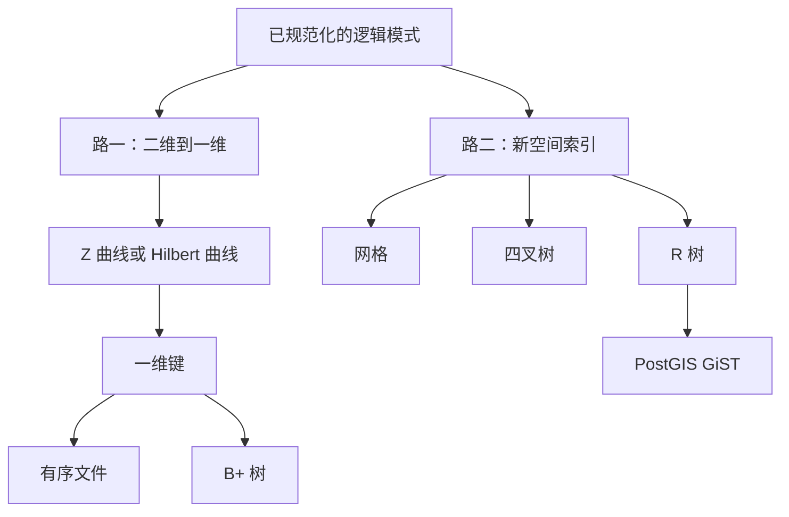
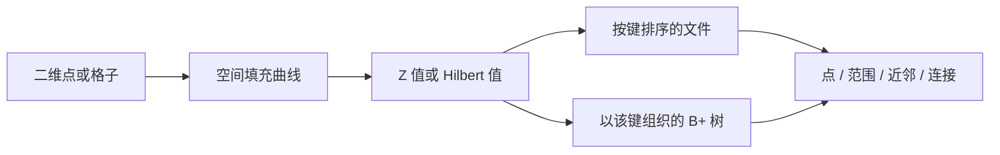
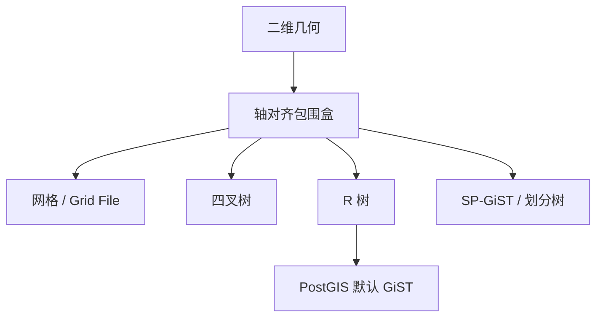

## 空间存储与索引

[关系设计理论](06-normalization.md) 把模式规范到 BCNF / 4NF 之后，设计进入物理层：用当前磁盘、文件与索引，把逻辑模型高效、容错地做出来。关系库已经会用的物理手段：页怎么读、三种文件怎么摆、B+ 树怎么查、三类连接怎么选。空间数据没有一维全序，一维排序与搜索树套不上，于是走出两条路：用空间填充曲线把 \(n\) 维点压成 1 维，重用有序文件与 B+ 树；或者引入网格、四叉树、R 树等新的空间索引。几何类型与谓词见 [几何对象与 PostGIS](04-geometry-and-postgis.md)；过滤与精炼的代价模型见 [空间查询处理](08-query-processing.md)。栏目总览见 [空间数据库](index.md)。

本页要写清：磁盘上怎样摆数据、索引怎样加速、规划器怎样在嵌套循环 / 排序合并 / 哈希连接之间做选择；以及 **Z 值正反算、Hilbert 七步、R 树父子包围盒剪枝** 的手算跟做步骤。



图中两条路并行：左边把空间问题压成已经实现好的一维问题，事务与恢复借用现成 B+ 树；右边直接在二维上切空间或套矩形，查询通常更快，实现与并发要自己保证。

## 物理数据模型

**物理数据模型**：用当前硬件与操作系统组件，把逻辑数据模型实现出来的那一套概念，并且要求高效、容错。

| 层次 | 抽象内容 | 数据库概念 |
| --- | --- | --- |
| 概念模型 | 高层抽象 | 实体、属性、联系、约束 |
| 逻辑模型 | 某种数据模型上的具体实现 | 关系、原子属性、主码与外码 |
| 物理模型 | 用硬件与 OS 组件做出来 | 二级存储器、文件结构、索引 |

关系 DBMS 物理层的典型选择：数据放磁盘；文件可按某属性排序；辅助结构是一维有序上的搜索树。每一种 DBMS 只挑选少数物理技术，只高效支持少数类型上的少数操作，换取系统简单。选择取决于它承诺的数据类型与操作。

关系数据库面对的类型本质上是**一维全序**：数字、字符串、日期、货币都可排序。操作是查找、插入、删除。年龄可以沿一根轴截一段区间，薪资可以沿另一根轴截一段。平面上的点没有唯一的先后：附近是二维邻域。关系物理模型原样套不到空间数据上。

空间数据的公共假定：

-   维数低，通常是 2 或 3
-   类型即 OGC 简单要素
-   扩展对象用**最小正交外接矩形**近似：Minimum Orthogonal Bounding Rectangle，简称 MOBR / MBR / Envelope，轴对齐的最小矩形

空间索引不拿原始复杂边界去做树里的比较，一律先比包围盒。包围盒用于**过滤**：两包围盒不相交，真实几何必不相交，这一步快、由索引完成。**精炼**再用真实边界做相交，与索引无关、较慢。判断两个矩形是否重叠便宜，判断两个复杂多边形是否相交昂贵，所以索引的价值就是把肯定不相交的对尽早扔掉。许多拓扑判断在过滤阶段都先化成包围盒是否交叠。

???+ note "过滤与精炼"
    空间索引只比较轴对齐包围盒。

    两盒不相交则真实几何不相交，整枝剪掉。

    盒相交推不出几何相交，候选要取出真实点、线、面再算谓词。

后文按四类空间查询展开：

-   **点查询**：给定点，落在哪些矩形或地物里
-   **范围查询**：查询矩形内有哪些对象
-   **最近邻**：距查询点最近的对象
-   **相交查询 / 空间连接**：与查询矩形相交的对象，或两集合中相交的对

文件层更细的操作还有 `Find`（按条件取记录）、`FindNext`（全序下的下一条）、空间最近邻。没有全序时，下一条本身没有定义。这正是空间数据要另想办法的原因。

选型时：有的产品根本没有空间索引，空间负载就排除它。调优时：查询慢，可在谓词用到的属性上建索引；大批量导入很慢，可先删索引再导入、导完再建。主码与外码会在每一行上做唯一性与参照检查，导入前去掉、导入后再加，同样加快装载。

## 磁盘、页与顺序扫描

存储分三层。**主存**快、断电丢失、贵。**二级存储**（磁盘、固态盘）慢、断电仍在、便宜，DBMS 主要管这里，并用内存加速。**三级存储**（磁带等）更慢、容量更大，用于备份归档。内存相对磁盘：顺序访问大约快一个数量级，随机访问可以快约 \(10^{5}\) 倍。

机械磁盘读一个扇区三步：

1.  **寻道**：磁头移到目标磁道，通常最贵
2.  **旋转延迟**：等到目标扇区转到磁头下
3.  **传输**：读出或写入

经验顺序：寻道大于旋转延迟，旋转延迟大于传输。扇区太大，大块连续数据一次读完，小记录会在扇区内浪费空间。扇区太小，空间利用率高，一块逻辑数据跨许多扇区、许多磁道，寻道次数上去。常访问的数据放中间磁道，平均寻道最短。同一大数据集尽量放在同一磁道的连续扇区，整段扫描只需一次寻道。

从硬件读出的规则收成一句：**顺序扫描远快于随机读**。连续读块好；跳着读差。顺序时寻道往往只需一次，而后沿磁道连续传输；随机时最坏要对 \(N\) 个扇区寻 \(N\) 次道，每次还可能再等旋转。

经验规则：

-   机械盘上随机读文件的 1%~2%，代价已相当于顺序扫完全文件
-   固态盘大约是 10%
-   随机读到 20% 时，优化器几乎必然改成全表顺序扫

后面选走索引还是全表、选聚集还是非聚集，都落在这条规则上。

软件视角：字段（属性）组成记录（一行），同类记录组成文件，文件登记在目录里。记录通常小于扇区，一扇区里有多行；一个文件占许多扇区。映射到磁盘时，优化器数的是读了几个扇区，不是读了几行。反复访问的扇区留在内存，减少磁盘次数。缓冲区淘汰与预取的实现细节不在本页展开。

## 三种文件

**文件结构**：在磁盘上组织记录、以支持常用操作的方法。效率等于 I/O 代价（读了多少扇区）加 CPU 代价。关系数据库里 CPU 通常可忽略，**优化器几乎只看 I/O**。读 10 个扇区的计划不如读 3 个扇区的计划。

常用操作：`Find`（按码取值找记录）、`FindNext`（全序下下一条）、`Insert`、空间最近邻。

三种基本文件：

| 结构 | 组织方式 | 擅长 | 不擅长 |
| --- | --- | --- | --- |
| 堆文件 | 无序；新行追加在最后一扇区 | 插入 | `Find`、`FindNext`、最近邻都要全扫 |
| 有序文件 | 按某属性（文件的排序键）排列 | `Find` 可二分；`FindNext` 读物理下一条 | 插入、删除要维持有序 |
| 哈希文件 | 桶加哈希函数：码映射到桶，桶映射到扇区 | 等值 `Find`、插入、删除 | `FindNext`、最近邻；桶之间无序 |

**堆文件**：记录无序。日志型写入把新行追加到末页，插入代价低。任何按值查找都要扫完全文件。

**有序文件**：记录按某一排序键物理排列。等值 `Find` 可二分。`FindNext` 就是物理上的下一条。插入、删除要挪动后续记录以维持有序，代价高。有序文件上的最近邻可先当成范围查询来做。

**哈希文件**：计算 \(h(\mathrm{key})\) 得桶，查目录得扇区，只读相关扇区。下一码可能在完全不同的扇区。哈希平均 \(O(1)\) 等值查找，不服务范围，也不按序 `FindNext`。

空间数据不自然地按一个属性排序。后文用填充曲线或专门空间索引，把空间上相近的记录放进同一扇区，这叫**聚集**。聚集是空间负载上的第四种组织目标，建立在上述三种文件之上。

## 数值索引与 B+ 树

数据文件仍是堆或有序文件。索引是**额外的文件**：存放 \((\mathrm{key},\mathrm{value})\)，key 是搜索码，value 是指向数据记录的指针。一张表可以有多个索引。

三种不要混的键：

1.  **主码**：标识元组。单属性主码上 DBMS 常自动建索引。一张表至多一个主码，因而至多一个与主码对应的主索引。空间属性不适合做主码：非一维全序，B+ 树用不上；几何大、判等贵。
2.  **文件的排序键**：数据文件若排序，按哪一列排。可以与主码相同，也可以不同。一个文件只有一种物理顺序。
3.  **索引键**：该索引按哪一列或哪些列组织。可以很多个。

**聚集索引**：索引里相邻的记录，在数据文件里也相邻。两种实现：数据文件按该键排序；或记录直接存在索引里。**非聚集索引**：索引相邻，数据上可能相距很远，范围扫描变成随机 I/O。一张表至多一个聚集索引，因为物理顺序只有一套；非聚集可以有多个。范围查询主要受益于聚集索引。

全表顺序扫的 I/O 与选择率无关，是一条水平线。聚集索引接近过原点的斜线：选择率低就少读，顺序扫一段。非聚集更陡：随机 I/O 下，大约 5% 的选择率已碰到等同于扫全表的那条水平线。选择率再高，优化器不会走非聚集索引。非聚集的 cost 升得快，因为每一次都要重新寻道。

### B+ 树怎么查

B+ 树是最常用的数值索引。这里的 B 表示平衡与高扇出，与二叉无关。要点：一个结点一页或一扇区；树平衡；扇出高。相对 B 树，B+ 树把**叶结点串成链表**，便于范围查询。

非叶：度数 \(d\) 时，键个数在 \(d\) 与 \(2d\) 之间；\(n\) 个键划出 \(n+1\) 个区间，各有一个孩子指针。键 10、20、30 给出 \(k<10\)、\(10\le k<20\)、\(20\le k<30\)、\(k\ge 30\)。叶：键旁是指向数据记录的指针，另有指向下一叶的指针。内部结点只导航，真正记录在叶上。

**等值查找**（`WHERE age = 25`）：从根下行到叶。以 \(K=30\) 为例，叶层可见 10、12、15、20、28、30、40、60、63、80、84、89：

1.  根上 \(30<80\)，走左
2.  30 落在 \([20,60)\)
3.  再落入 \([30,40)\)
4.  叶上找到 30，沿指针取记录

**范围查找**（`WHERE 20 <= age AND age <= 30`，或区间 \([30,85]\)）：

1.  按等值方式找到范围左端 30
2.  沿叶链表顺序读：30 之后读 40、60、63、80、84
3.  下一键大于 85 则停

不必从根把 31、32 等各查一遍。没有叶链表，每找一个后继都要再走一遍树。范围查询的 I/O 等于根到叶的树高，加上覆盖该范围的叶页数。

插入：写入叶；溢出则把中间键上推并分裂，以保持平衡。二次分裂的各种启发式不在本页展开。

### 哈希索引对照

\(h(\mathrm{key})\) 映射到槽或桶；每桶一页，页内多条记录。目标是均匀。除法哈希例：\(h(x)=(ax+b)\bmod M\)。\(M\) 取素数，利用率约 90%。5 万名员工、每页 10 人、利用率 90%：

\[
M \approx 50000 / 10 / 0.9 \approx 5555
\]

取近旁素数。冲突用开放定址或链到溢出页。哈希平均 \(O(1)\) 等值查找；B+ 树 \(O(\log N)\)，但保序，适合范围、邻近、顺序扫描，并随数据增长平滑伸缩。

### 创建与删除

```sql
CREATE [UNIQUE] [CLUSTERED] INDEX 索引名
  ON 表名(列名 [ASC|DESC], ...);
DROP INDEX 索引名;
```

`UNIQUE` 表示索引键唯一。`CLUSTERED` 表示聚集，必须与数据文件的物理顺序一致。缺省升序。PostgreSQL 未写 `USING` 时，默认 **btree**（B+ 树族）。一张表只有一个聚集索引。

`EXPLAIN` 看规划，`EXPLAIN ANALYZE` 看规划加实际时间，不返回结果行。`cost` 是优化器用的估计，与真实时间不必完全一致；规划器选的是估计最小的那条。同一条带 `ORDER BY` 的连接，数据一变，PostgreSQL 可能走排序合并，也可能走哈希再排序。连接结果已按该键有序时，顶层 Sort 可能消失。

## 三类连接与选哪些列建索引

```sql
SELECT *
FROM S, SC
WHERE S.Sno = SC.Sno AND SC.Cno > 300;
```

三种实现：

1.  **嵌套循环连接**：对外表每一行，扫内表找匹配。一般 \(O(N^2)\)；内表谓词极少时，可接近 \(O(N)\)。有索引时：扫外表一行，用索引探内表。通常小表做外表（驱动表）、带索引的大表做内表。结果集过大（大约大于一万行）则不宜。Join 列上没有索引时，优化器往往不选嵌套循环。**嵌套循环真正吃索引的是内表。**
2.  **排序合并连接**：两表按连接键排序（可顺带过滤 `Cno>300`），再归并。\(O(N\log N)\)；若文件已按该键有序，则 \(O(N)\)。可用于等值及 \(>\)、\(<\)、\(>=\)、\(<=\)，不含 `<>`。两表已有序时，常常优于哈希连接。
3.  **哈希连接**：在较小表的连接键上建内存哈希表，扫大表探测。平均 \(O(N)\)。仅等值连接。小表须装进内存；否则分区溢写临时段。适合无索引的大表与并行环境。

| 项目 | 嵌套循环 | 哈希连接 | 排序合并 |
| --- | --- | --- | --- |
| 条件 | 不限 | 仅等值 `=` | 等值或不等式；不含 `<>` |
| 资源 | CPU、磁盘 I/O | 内存、临时空间 | 内存、临时空间 |
| 何时较好 | 高选择性索引；要尽快出第一行 | 缺索引或条件模糊；大表 | 两表已有序；非等值时往往优于哈希 |
| 弱点 | 没索引或结果集很大时很慢 | 建哈希表耗内存；第一行出得晚 | 无序时要先排序 |

有索引时，嵌套循环与排序合并更容易用上索引；哈希连接常常在没索引的大表上反超。驱动表选错，两个索引都用不上：以外表为选课、先用 `Cno` 索引选出 `Cno>300`（索引选择），再对每一行用 `Sno` 索引探学生（索引连接），两次都走索引。外表改成学生且学生无额外选择条件，只能顺序扫学生；选课表若未在 `Sno` 上建索引，内层也只能顺序扫。

给定表与工作负载，由 DBA 或调优工具决定建哪些索引。启发式：按查询重要性排序；只考虑该查询碰到的关系；看 `WHERE` / `ON` 里是否有等值、范围、连接键。一条索引最好服务多条查询。建了优化器仍可能不用：全表扫的估计 cost 更低时就会放弃索引。

多属性索引 \((K_1,K_2,\ldots)\)：谓词须命中从左到右的前缀。索引 \((A,B,C)\) 可服务 \(A\)、\(A{,}B\)、\(A{,}B{,}C\)；跳过前缀去单独用 \(B\)、\(C\) 或 \(B{,}C\) 时，该索引用不上。`SELECT K2 FROM R WHERE K1=55` 可被 \(R(K_1,K_2)\) 覆盖；`WHERE K2=55` 该索引覆盖不了。

选索引时再记三条：

-   等值谓词：在该列上建索引即可
-   `LIKE '%数据库%'` 既非等值查找，也走不了 B+ 树的单一区间：前导通配符无法从根下行到一段连续叶，在该列上建 B+ 树帮不上忙
-   嵌套循环只给内表的连接键建索引；前导通配的 `LIKE` 不要建 B+ 树

## 路一：二维到一维再到 B+ 树

关系数据库的数据类型是一维、可排序的，所以物理层可以做堆文件、有序文件、哈希文件，索引可以做 B+ 树和哈希表。空间数据是 \(n\) 维的，下文以二维为主，点在平面上没有全序。只按 \(x\) 排序时，\(y\) 方向相邻的两个格子在文件里可能隔得很远。

**空间填充曲线**是一种降低空间维数的方法：一条连续曲线，自身不交叉，通过访问所有单元格来填满一个均匀网格的矩形。为把空间递归分到更小的子空间，引入 \(m\) 阶曲线：\(m\) 阶曲线是把基本曲线的每个格子再用 \((m-1)\) 阶曲线填满。

实现上先把连续空间离散成 \(2^n \times 2^n\) 的格子。每个对象落入一个或多个格子，格子有编号，编号就是一维键。磁盘上顺序读远快于随机读，希望空间上相近的对象在磁盘上的存放位置也相近。任何一种一维编号都无法百分之百保住二维邻接，但好的曲线长跳少，会先掏空一个象限再离开。



有了每个对象的 Z 值或 Hilbert 值，物理层有两种用法，都是在重用关系库已有代码：

-   **A1. 仅有序文件，不建 B+ 树。** 记录按 Z / H 值升序存放。给定一个值，对文件做二分查找。实现简单；每次折半仍可能引发随机 I/O。
-   **A2. 有序文件加以 Z / H 值为键的 B+ 树。** 叶节点存的是 Z 值到数据记录指针或扇区号。给定一个值，从根走到叶，再跟指针取几何。B+ 树已经在 DBMS 里，并发与恢复现成。

空格子不占记录：文件里只按对象实际出现过的 Z 值紧密排列，中间空洞不存。

按行扫描只按 \(x\) 走：沿 \(x\) 相邻的两格编号也相邻；沿 \(y\) 相邻的两格编号差了整整一行，在 B+ 树和文件里隔得很远。蛇形来回走稍好，仍然没有距离保持。衡量曲线好坏的直观标准是：空间上相邻的格子，映射后的一维位置也应相邻。可以把编号相邻两格的欧氏距离加起来，Z 曲线的这个和通常大于 Hilbert 曲线，后者聚集更好。Z 曲线更容易出现编号相邻而空间很远，因为它有从一象限对角跳到另一象限的长边。

## Z 曲线正反算

Z 曲线亦称 Z-order curve、Morton 码，外观像字母 N 或 Z。两种朝向都合法，同一格子的编号不同，计算前先锁定题目用的是哪一种。\(x\) 方向的二进制都是从左到右 `00, 01, 10, 11`；差别只在 \(y\) 谁当高位。

| 名称 | 交错顺序 | 外观 |
| --- | --- | --- |
| N 型 | \(x\) 在前、\(y\) 在后；x-first | 像 N |
| Z 型 | \(y\) 在前、\(x\) 在后；y-first | 像 Z |

生成有三条等价路：递归画 N / Z；比特交错；线性四叉树。考试与手算按比特交错。

### 正算：由 \((x,y)\) 求 Z 值

1.  把格子坐标 \((x,y)\) 写成二进制。Z 曲线不强制把高位 0 补满到某一阶；位数覆盖当前网格即可，成对出现。
2.  N 型：从高位到低位，交错排成 \(x_k y_k x_{k-1} y_{k-1} \cdots x_0 y_0\)。
3.  Z 型：交错排成 \(y_k x_k y_{k-1} x_{k-1} \cdots y_0 x_0\)。
4.  把得到的二进制串看成无符号整数，即为 Z 值。

**跟做：N 型，\(x=6\)，\(y=5\)。** \(x=6=(110)_2\)，\(y=5=(101)_2\)。N 型交错 `1 1 1 0 0 1`，即 57。

### 反算：由 Z 值求 \((x,y)\)

1.  把 Z 值写成偶数位二进制；位数不够就在高位补 0，使长度为偶数。
2.  按正算时同一规则，把奇数位、偶数位拆回 \(x\) 和 \(y\)。N 型是 x-first：从高到低，第 1、3、5 等位归 \(x\)，第 2、4、6 等位归 \(y\)。
3.  把拆出的二进制看成无符号整数。

**跟做：N 型，已知 \(z=57\)，求 \((x,y)\)。**

\(57=(111001)_2\)，六位，三对。N 型是 x-first：

```text
位（从高到低）：  1  1  1  0  0  1
归属：            x  y  x  y  x  y
```

于是 \(x=(110)_2=6\)，\(y=(101)_2=5\)。补成八位 `00111001` 再拆，结果仍是 \(x=6, y=5\)，因为多出来的高位都是 0。与上一小节正算互为复核。

### 线性四叉树

把平面反复一分为四，东西南北赋二进制。约定：北 N 为 1、南 S 为 0，东 E 为 1、西 W 为 0。从根走到目标格子的象限串，就是 Z 值的二进制。

**跟做。** 路径 `WN; WN`，即两层都是西、北：

1.  W 为 0，N 为 1，一层得到 `01`
2.  再一层同样 `01`
3.  合起来 \((0101)_2=5\)

这与在 \(4\times 4\) 上从 0 数到该格、以及对该格做 bit interleaving，三者一致。N 型正算复核：格子 \(x=0=(00)_2\)，\(y=3=(11)_2\)，交错 `0 1 0 1`，Z 值 = 5。Z 值的高位就是粗象限，低位是细格子。若某区域四个子格都属于同一对象，线性四叉树就不再往下分，相当于后面的比特变成通配符。

## Hilbert 七步

Hilbert 曲线也是空间填充曲线，聚集通常优于 Z 曲线，但生成要做旋转，不可只把低阶图案拷贝四份。一阶四个格按 `0,1,2,3` 走 U 形。升到 \(n+1\) 阶时，四个象限各放一条 \(n\) 阶曲线：上方两块方向与 \(n\) 阶相同，直接拷贝；左下块向左旋转；右下块向右旋转；然后再把四块的端点连成一条不交叉的曲线。它更先掏空一个象限再离开，长跳更少。

与 Z 曲线最大的差别有两处。第一，必须按曲线阶数 \(n\) 把 \(x,y\) 补成**恰好 \(n\) 位**，高位 0 省不得，否则后续分组长度错。第二，两比特一组译成 `0,1,2,3` 时，译码表与自然二进制不同：

\[
\texttt{00}\mapsto 0,\quad \texttt{01}\mapsto 1,\quad \texttt{10}\mapsto 3,\quad \texttt{11}\mapsto 2
\]

即 `10` 译成 3 而不是 2，`11` 译成 2 而不是 3。这对应 Hilbert 一阶四个方向的编号。Hilbert 与 N 型一样 x-first 交错。记 \(n\) 为阶数，网格为 \(2^n \times 2^n\)。

### 七步算法

1.  将 \(x\)、\(y\) 写成 \(n\) 位二进制，不足补前导 0。
2.  与 N 型 Z 曲线相同：把 \(x\)、\(y\) 各位交错成串 \(S\)（\(x\) 在前、\(y\) 在后）。
3.  将 \(S\) 按 2 比特一组切开，得到长度为 \(n\) 的数组。
4.  按上表把每组译成 \(0,1,2,3\)。
5.  **旋转 / 反射**：从左到右扫描数组当前值 \(j\)。若 \(j=0\)：把它**后面**所有的 1 与 3 互换。若 \(j=3\)：把它**后面**所有的 0 与 2 互换。若 \(j=1\) 或 \(j=2\)：不改后面。每处理完一位，后面的数组已经变了，再看下一位时用的是更新后的值。
6.  把最终数组每一位按普通二进制写回 2 比特：\(0\to\texttt{00}\)，\(1\to\texttt{01}\)，\(2\to\texttt{10}\)，\(3\to\texttt{11}\)。
7.  整串看成二进制整数，即为 Hilbert 值 \(H\)。

第 5 步必须从左扫到右、每步改的是当前位之后，禁止一次性按原始数组做完全部互换。

### 跟做：\(n=4\)，\(x=5\)，\(y=9\)

| 步 | 计算 |
| --- | --- |
| 1 | \(x=5=\texttt{0101}\)（必须 4 位，不可写成 `101`）；\(y=9=\texttt{1001}\) |
| 2 | 交错：\(x\) 的 0、1、0、1 与 \(y\) 的 1、0、0、1，得 `01100011` |
| 3 | 两两分组：`[01, 10, 00, 11]` |
| 4 | 译码：`01→1`，`10→3`，`00→0`，`11→2`，数组 1、3、0、2 |
| 5 | 左起：1 无规则；3 则后面 0 与 2 互换，数组变成 1、3、2、0；下一位 2 无规则；末位 0 后面已空。结果 1、3、2、0 |
| 6 | `01 11 10 00` |
| 7 | \((\texttt{01111000})_2=8+16+32+64=\mathbf{120}\) |

### 跟做：\(n=5\)，\(x=0\)，\(y=14\)

| 步 | 计算 |
| --- | --- |
| 1 | \(x=\texttt{00000}\)；\(y=14=\texttt{01110}\)（5 位） |
| 2 | 交错 `0001010100` |
| 3 | `[00, 01, 01, 01, 00]` |
| 4 | 0、1、1、1、0 |
| 5 | 首位 0：后面三个 1 换成 3，变成 `0,3,3,3,0`。第二位 3：后面 0 与 2 互换，末位 0 变为 2，变成 `0,3,3,3,2`。第三位 3：后面的 2 变为 0，变成 `0,3,3,3,0`。第四位 3：后面 0 变为 2，变成 `0,3,3,3,2`。末位 2 无规则。最终 0、3、3、3、2 |
| 6 | `00 11 11 11 10` |
| 7 | \((\texttt{0011111110})_2=254\) |

两个短例用来核对第 4 到 5 步。例 A：\(X=\texttt{001}\)，\(Y=\texttt{000}\)。交错 `000010`，分组 `[00,00,10]`，译码 `0,0,3`。第一位 0：后面 1 与 3 互换，得到 `0,0,1`；第二位 0：后面 1 与 3 互换，得到 `0,0,3`；第三位 3：后面已空。写回 `00 00 11`，十进制 3。例 B：\(X=\texttt{100}\)，\(Y=\texttt{001}\)。交错 `100001`，`[10,00,01]`，`3,0,1`。第一位 3：后面 0 与 2 互换，得到 `3,2,1`；后两位无规则。写回 `11 10 01`，十进制 57。

Z 曲线与 Hilbert 曲线的共同点：编号邻近的格子，空间位置通常也邻近，适合作为磁盘聚集的顺序；任何排列都无法完全维持二维邻接。不同点：Hilbert 的聚集更好，映射步骤复杂（补位、非二进制译码、扫描旋转）；Z 只需交错，正反都简单。

## 一维键上的四类查询

以下对 Z / Hilbert 通用，只是键的计算方法不同。

### 点查询

1.  把查询点的坐标量化到格子 \((x,y)\)，按上文算出 Z 或 H。
2.  无 B+ 树：在已排序的文件上二分查找该键，命中则读该扇区里的几何，再与查询点做精确判断。
3.  有 B+ 树：用该键走 B+ 树到叶，按指针取扇区。

无树时的二分与在有序数组上二分完全相同：文件中键升序，先探中间，大于查询键走左半，小于走右半，直到落到目标下标。

### 范围查询

查询框覆盖一组格子，对应一串 Z / H 值，这些值往往不是一个纯区间（曲线会把矩形撕成多段）。

1.  求出查询框覆盖的全部格子的 Z / H 值。
2.  扫描这些值，把数值连续的合成区间。例如框里出现 9 以及 11、12、13、14、15，则得到 \([9,9]\) 与 \([11,15]\) 两段。
3.  对每个区间 \([L,R]\)：用点查询的方式在 B+ 树里定位 \(L\)（或第一个 \(\ge L\) 的键），然后沿叶链表顺序走，直到键大于 \(R\)。这正是 B+ 树叶链表存在的理由。
4.  若区间很多、懒得分段，也可以取全局最小、最大，只定位一次再沿链表扫过去；代价是中间无关键对应的扇区也可能被碰到，要用几何再过滤。

把矩形拆成尽量少的 Z 区间，可用与四叉树相同的递归：整象限都在框内就保留该前缀，否则四分再拆。

### 最近邻

曲线顺序上的下一个对象不一定是欧氏最近的。算法分两步，把前面两种查询拼起来：

1.  **点查询**：算出查询点的 Z / H，在有序文件或 B+ 树上找按这个一维键而言最近的一个已存对象。若当前格子为空，就沿键增大方向找第一个非空对象。
2.  计算查询点到该对象的真实欧氏距离 \(d\)。这只是候选，不一定最终最近。
3.  **范围查询**：以查询点为圆心、半径 \(d\) 做圆（或该圆的外接矩形），取出圆内所有对象，再精确比距离，得到真正的最近邻。

按 Z 值找到的第一个对象，欧氏上可能有更近的；第二步的圆只要保证至少装进第一步那个对象，更近的那个就会被框进来。半径太小会漏掉真正的最近邻；半径太大则范围查询变慢。对象已经读出来时，用真实距离即可。若还没有读几何、只有格子，用格子最远角：宁可圆大一点，不可漏掉更近的对象。k-NN：第一步沿曲线凑够 \(k\) 个对象，取其中最远的那个真实距离当半径，再做一次范围查询，最后在候选里精确选出 \(k\) 个。

### 区域 Z 值、前缀与空间连接

一个多边形通常覆盖多个格子，因而有一个或多个 Z 值。用线性四叉树：整块落在某一象限里就不再切，切不动的层用通配符 `*` 表示这一位 0 或 1 都可以。

**跟做。** 某区域覆盖 Z 值为 12、13、14、15 的四个细格：

\[
12=(1100)_2,\quad 13=(1101)_2,\quad 14=(1110)_2,\quad 15=(1111)_2.
\]

公共前缀是 `11`，后面两位任意，故该区域记为 `11**`。另一块区域若四个细格的第一位就有的 0、有的 1，则没有公共前缀，压不成一个带星号的码，只能保留多条 Z 值。两种生成办法等价：把区域内每个格子的二进制列出，取最长公共前缀，其余补 `*`；或者走四叉树，某一节点的四个子区都属于该对象就停止细分。

带 `*` 的键如何进 B+ 树。规定全序

\[
\texttt{*} < 0 < 1
\]

于是 `11**` 会排在所有 `1100`、`1101` 等之前，或按实现排在该前缀块的一端，可以当普通键插入。

两个 Z 码之间的包含 / 相离（前缀性质）。设 \(z_1,z_2\) 对应区域 \(r_1,r_2\)，且 \(r_1\) 更小（\(z_1\) 里的 `*` 更少）。则 \(r_2\) 要么完全包含 \(r_1\)，要么与 \(r_1\) 完全不相交（在这种互不重叠的象限划分下不会咬一口）：

-   若 \(z_2\) 是 \(z_1\) 的前缀（比较时跳过 `*`），则 \(r_2\) 包含 \(r_1\)
-   若在第一个非通配位上已经不等，则相离

这里的相离指象限不交，不是几何 `ST_Disjoint`；两个对象的象限不交，它们的真实几何才一定不交。

**跟做。** \(z_1=\texttt{011001**}\)，\(z_2=\texttt{01******}\)，\(z_3=\texttt{0100****}\)：

-   \(z_2\) 包含 \(z_1\)：真（`01` 是前缀）
-   \(z_3\) 包含 \(z_1\)：假（`0100` 与 `0110` 第三、四位冲突，相离）
-   \(z_3\) 包含 \(z_2\)：假（反过来是大的包含小的；\(z_2\) 包含 \(z_3\)）

**空间连接。** 朴素做法：\(N\) 个国家、\(M\) 个湖，两两做几何相交，复杂度 \(O(NM)\)，昂贵的是复杂边界求交。加速：每个对象带上自己的（可能多条）Z 码，两边按 Z 码排序后做一次归并连接。扫描中只对前缀相同或互相包含的配对去做真正的 `ST_Intersects`；前缀冲突的国家与湖分属不同象限，不必算几何。

必须去重。一个多边形可有多个 Z 码。某国跨 `10**` 与 `11**` 两个大格，某湖也跨这两格。归并时 `10` 对 `10` 会判一次相交，`11` 对 `11` 又会判一次。几何求交很贵，同一对对象只应精确计算一次。所以结果集要按对象标识去重；若已经对某一对算过，另一条匹配的 Z 前缀可以直接跳过。这就是过滤与精炼在填充曲线上的样子：Z 前缀过滤掉一定不相交的对，精炼阶段才动真实坐标。

路一小结：聚类用填充曲线（\(n\) 维变成 1 维）；存储是有序文件加减 B+ 树；点查询算键即查；范围查询把键合成区间后走叶链表；NN 等于点查询加范围查询；空间连接对排序 Z 码做前缀归并并去重。

## 路二：新的空间索引

**空间索引：** 依据空间实体的位置、形状或实体间的某种空间关系，按一定顺序排列的一种数据结构；其中存放的是概要信息，如对象标识、最小边界矩形，以及指向真实几何的指针。

数值数据用 B 树、哈希；空间数据常用四类：网格、四叉树、空间填充曲线、R 树及其变体。把空间索引做进 RDBMS 内核后，查询优化器可以在整条规划里决定是否走索引。第二代、第三代 GIS 对空间对象采用的索引方式没有太大变化；真正变的是索引进内核、进优化器。

分类时记住两把尺子：

1.  节点代表的空间区域可否重叠？
2.  同一个几何对象会不会出现在多个叶节点里？

网格、四叉树、Z 曲线划分、R+ 树：区域互不重叠，但跨边界的对象会在多个叶子里重复出现，查询要去重。R 树：允许节点矩形重叠，但每个对象只进一个叶子，查询不用为对象重复操心，但一次点查询可能走多条分支。



网格是均匀划分、满 \(2^n\) 叶四叉树；四叉树是均匀划分、自适应；k-d 树是非均匀划分、自适应。后三者共同点：节点空间不重叠，几何对象可能重复出现在多个叶节点。k-d 树此处不展开。

### 网格与 Grid File

用经纬网一类的格子切平面，每个格子的对象放在独立磁盘扇区。点查询、插入、近邻都可以先算在第几格，再只读少数扇区。均匀网格的问题是：数据分布不均匀时，空格子也占一个扇区，浪费严重。

Grid File 的两点改进：非均匀网格，点密的地方切细，点稀的地方切粗，需要额外保存 \(x\) 方向、\(y\) 方向的分割坐标（linear scale）；多个格子共享同一扇区，空或极稀的格子不要独占一页。

三个部件：Linear scale（各行、各列的边界坐标）；Grid directory（格子到扇区地址）；磁盘上的数据扇区。查找三步：在 scale 上定位 \(x\) 所属列、\(y\) 所属行；查 directory 得到扇区号；读该页。Scale 与 directory 较小，常驻内存；几何本身在磁盘。非均匀时必须把分割坐标存下来，否则无法从经纬度反查格子。代价是目录可能较大，需要较多内存。

插入与分裂以阻塞因子 = 2 为例，每页最多 2 条记录：

1.  插入 A(1,1)：一页放下。
2.  插入 B(2,2)：仍在同一页，未满。
3.  插入 C(3,3)：该页溢出。在已有点的 \(x\) 向上取分裂线，裂在 \(x=2.5\)（A、B 在左，C 在右）。
4.  插入 D(5,2)：落入右侧页，与 C 同页。
5.  插入 E(5,5)、F(6,6)：右侧再满。下一刀按交替轴，改为水平切，裂在 \(y=4\)。E、F 在上，C、D 在下。
6.  继续溢出则再沿 \(x\) 切。\(xy\) 交替，谁满切谁。

原则：溢出则在当前桶内的点之间取中点，轴在 \(x\)、\(y\)（三维则还有 \(z\)）之间轮换，避免永远只切一个方向。目录里要记下每一条新的分割线。

### 四叉树

四叉树要同时做到空间被真正切开，和每个桶里的对象不超过固定容量 \(N\)。

1.  把当前矩形均分成 NW、NE、SW、SE 四个象限。
2.  若某象限内对象数 \(\le N\)（或全空、或已经再切数量也不减），停止。
3.  否则对该象限递归四分，直到满足桶容量。

与网格的差别：网格（均匀时）是满的、固定分辨率；四叉树是自适应的：空区或纯色区不再切，数据密的角可以很深。因此它一般不是满四叉树。全白、全黑的块（对象数已合法）都是叶。优点：桶内数量有上限，检索时一个叶子不会爆掉。缺点：海量且极不均匀时树会很深；区域扩大往往要重建；插入 / 删除可能导致深度加一或减一、叶子重定位，可扩展性不如网格。

给定查询几何，遍历四叉树：从根开始，查询 MBR 与哪个子象限相交就进入哪个孩子；不相交的整枝剪掉；到叶后取出候选，再做精确几何判断，并**去重**（对象可能落在多个叶）。

-   **点查询：** 从根按象限下降，落到某一叶即该叶内的对象。
-   **范围查询：** 查询框与子象限盒相交才进入；叶内再比几何；跨多个象限的河会出现多次，必须去重。
-   **1-NN：** 若查询点所在叶非空，用该叶里对象的（最短的）最大距离当半径再做范围查询。若查询点所在叶为空：当前节点空，则父节点一定非空，否则父不该被四分。用查询点到**父矩形四角的最大距离**当半径。不可能出现当前空、父也空还继续往下分的树。四叉树可以出现空叶；R 树每个叶子都挂着几何。
-   **空间连接：** 与 R 树相同思路，父盒不相交则整对子树剪掉，结果要去重。

## R 树

填充曲线、网格、四叉树都是在切平面：切完的块互不重叠，于是跨块的线、面必须在多个块里各挂一个指针，查询结果要去重。R 树反过来：允许索引矩形互相重叠，但每个几何只存一次。Guttman（1984）把 B+ 树一维区间套一层层，推广成二维矩形套一层层，并且保证一定的空间利用率（约 50%）；插入、分裂比 k-d-B 树好做；索引里只存包围盒，不存折线顶点。

**叶节点**存若干条 `(MBR, obj-ptr)`：某个对象的包围盒，加指向该对象记录的指针。**内部节点**存若干条 `(MBR, node-ptr)`：某孩子子树的包围盒，加指向孩子页的指针。扇出由页大小决定，一页大约数个条目。附近的矩形被分进同一页，该页再被一个更大的父矩形包住，一层层直到根。树是平衡的。一个矩形就是 \(x_{\min}, x_{\max}, y_{\min}, y_{\max}\)。

相对四叉树的三条性质：

1.  **父矩形不必被孩子们的并集填满。** 父 MBR 是孩子们 MBR 的包围盒，内部可以有谁也不占的空洞。四叉树四分之后四个子矩形并起来就是父矩形，没有这种空洞。
2.  **兄弟节点的矩形可以重叠。**
3.  **每个几何对象只出现在一个叶里。** 即使对象 B 的 MBR 与 P1、P2 都相交，插入时只选一个父亲。因此 R 树查询不必为对象去重；仍可能走多条分支，因为查询点可能落在重叠区。

**R+ 树**走另一极：仍然平衡；内部节点的矩形互不相交；跨过切割线的对象在多个叶里各存一份。因此 R+ 树上点查询往往只需下一支（内部框不交，查询点只落在一个孩子里），但范围查询、连接必须去重。网格 / 四叉树 / Z 曲线与 R+ 树同一类（区域不重叠、对象可重复）；R 树是另一类。实践中 R* 变体常用。Oracle Spatial 默认 R 树，也提供 z-curve；Postgres 可用 `rtree` 或 `gist`。

### 插入与二次分裂

新对象（或其 MBR）记为矩形 \(Y\)。

-   若 \(Y\) 完全落在某个孩子矩形内部，且该页未满，直接放入。
-   若与多个孩子相交，或谁都不包含 \(Y\)（R 树允许父有空洞），则对每个候选孩子计算：把 \(Y\) 并进去之后，该孩子 MBR 面积增加了多少。选增量最小的那个。增量相同再按其它启发式（如原面积更小）。

索引矩形里没有对象的空白越多，随机查询点落在空白上就可以立刻返回空，剪枝越狠。所以宁可让父框涨得少，也不要撑出一大片空 MBR。插入准则是面积增量，不是哪个中心近。

一页最多 \(M\) 条。已有条目再插入导致溢出时，二次分裂步骤：

1.  **选两个种子：** 在页内所有矩形（含新来的）里挑彼此最远的一对，作为两个新节点的第一位成员。避免两个种子本身就叠在一起。
2.  **分配其余矩形：** 对每一个还没回家的矩形 \(R\)，分别计算并入种子 1、种子 2 造成的面积增量，把它交给增量更小的一方。
3.  可先按两种增量之差排序，先分配一边倒的容易题，减少后期被迫塞进较满的一边。建树前若按 \(x\)（\(x\) 跨度大时）或按 \(y\) 把对象排好再依次插入，通常比随机插入得到的树更规整。

分裂产生的两个新矩形要插入到父节点；父若也满，继续向上裂，可能一直裂到根（根裂则树增高一层）。每层都要更新祖先的 MBR。

```text
Insert(rect):
  自根向下，每一层选 area-increase 最小的孩子
  若叶未满：放入并向上更新 MBR
  若叶满：quadratic_split 成两个叶
           把两个叶的 MBR 插入父节点
           若父溢出则继续向上 split
```

删除：从叶里去掉该矩形。若该页条数低于下限，把该页剩余条目暂时全部拿出，删掉该节点，再重新插入这些条目。R 树重新插入往往更利于缩小覆盖。

### R 树包围盒剪枝：可跟做

所有查询都从根开始，用查询区域与节点 MBR 是否相交，决定是否进入该孩子。点看成退化矩形。骨架仍是过滤与精炼。

#### 点查询：找包含某点或与某查询盒相交的对象

设要找矩形对象 5。根的两个孩子为 X、Y，X 之下有 A、B、C、D 等分组。

1.  查询矩形 5 与根的孩子 **X 相交、与 Y 不相交** → 整棵 Y 子树剪掉，只进 X。
2.  在 X 下：5 与 **A 相离** → 不访问 A；与 **B、C 相交** → 进入；与 **D 相离** → 不访问 D。
3.  进入 B、C 的叶子，得到候选对象编号例如 4、5、6、7（过滤步）。
4.  再比叶子里各对象自己的 MBR：4、7 的盒与查询 5 不相交，排除；剩下 5、6 等进入精炼，用真实几何判断。最终在 C 中找到对象 5。

点查询可能走多条分支，正是因为兄弟 MBR 可重叠。R+ 树上同一题：内部框不交，查询点只落在一个孩子；但对象 5 可能在 B、C 都存着，命中两次要去重。

#### 范围查询：查询矩形 \(Q\)

```text
RangeSearch(node, Q):
  if node 是叶:
    对每条 (mbr, obj):
      若 mbr 与 Q 相交: 把 obj 加入过滤候选
  else:
    对每个孩子 (mbr, child):
      若 mbr 与 Q 相交: RangeSearch(child, Q)
```

**父子包围盒两层剪枝：**

1.  根的孩子 P1、P2 的包围盒与查询区不相交 → 两枝整剪，P1 下的 A、B、C 全部不必看。
2.  P3、P4 与查询区相交 → 进入。
3.  进入 P3 后，用子对象自己的包围盒再剪：F 的盒与 \(Q\) 不相交，排除；另一对象盒相交则保留。
4.  P4 内同样：与 \(Q\) 相交的盒留下（如 H），不相交的丢掉。
5.  **精炼：** 候选 H 的包围盒与 \(Q\) 相交，并不保证折线 H 与 \(Q\) 相交。取出 H 的真实坐标做相交测试。包围盒是横着的大框，真实几何可以是贴着框边缘的折线，折线可以与 \(Q\) 错开。

R 树范围查询不必去重（对象只存一次）。R+ / 四叉树 / 网格必须去重。每个父节点完全盖住其孩子；一个孩子 MBR 可能被多个父盖住，但只存在其中一个下面；点查询可能走多条分支；任意维都适用。

#### 最近邻：最坏距离取四角距离的次小值

若某对象的 MBR 是 \([x_{\min},x_{\max}]\times[y_{\min},y_{\max}]\)，则真实几何至少有一个点的 \(x\) 等于 \(x_{\min}\)，至少一个点 \(x=x_{\max}\)，\(y\) 方向同理，否则盒子还可以缩小。因此四条边上各至少有一个真实点。

查询点为 \(q\)。在还没有读出真实折线时，只能根据 MBR 估计这个对象可能有多远，用这个距离当范围查询半径。

**标准：对 MBR 四个角点算 \(q\) 到角的距离，取次小值作为最坏情况半径。**

-   取**最小**角距往往过于乐观：真实对象可以贴着远端两条边走，根本不到最近那个角，按这个半径画圆可能与对象不相交，最近邻丢失。
-   取**最大**角距永远安全（对象再远也到不了更远），但圆太大，效率差。搞不清第几小就用最大，肯定对，只是慢。
-   **次小**是折中：四条边都有点，最坏情况下对象可以避开最近角，却无法同时避开最近的两条相关边到比次小角还远。查询点在盒内、盒外都用同一规则。

???+ warning "半径取最小会漏"
    蓝色小圆若只套到最近那个角，河可以弯到远处，圆与河不相交。

    最近邻丢失。

    宁可改用次小角距或最大角距。

**算法 A1（深度优先再范围查询）：**

1.  从根走下去，用包围盒相交找到至少一个叶对象（若 \(q\) 落在某叶 MBR 内更直接）。
2.  用该对象（或其 MBR 的次小角距，若还不愿读几何）得到半径 \(r\)。
3.  以 \(q\) 为圆心、\(r\) 为半径做范围查询，在候选里精确比距离。

\(q\) 落在父框空洞、与所有孩子 MBR 都不相交时，这是 R 树特有的情形：附近仍可能有对象。父框之所以这么大，是因为某个孩子的对象把框撑大了。此时在诸孩子里仍要选一个孩子，对该孩子 MBR 用四角次小距离当 \(r\)。

k-NN：在某层已经看到至少 \(k\) 个对象时，对这 \(k\) 个各算一个最坏距离，再取其中的最大作为范围半径，保证圆内至少 \(k\) 个对象，再精炼排序。\(k=1\) 就是上面的 1-NN。

#### 空间连接：两棵 R 树一起走

设国家在 T1、湖泊在 T2，都有 R 树。

```text
Join(node1, node2):
  若两者 MBR 不相交: return
  若都是叶: 对对象两两做精炼相交（盒已相交）
  否则: 对 node1 的每个孩子 c1、node2 的每个孩子 c2:
          若 c1.mbr 与 c2.mbr 相交: Join(c1, c2)
```

父框不相交，则框内所有国家与湖一定不相交，整对子树剪掉。这仍是嵌套循环，只是循环对象从所有对象变成 MBR 相交的节点对。R+ / 四叉树做连接时同样要去重。

R 树结论：流行，像多维 B 树；保证利用率；低维上搜索快；实践中 Oracle Spatial、DB2 Spatial Extender、Postgres、SQLite 都用。

## PostGIS 空间索引与哪些谓词走索引

若只使用 PostGIS、自己不实现 R 树，需要知道系统提供哪些索引、如何创建、哪些函数会用到它们。几何方法分类见 [几何对象与 PostGIS](04-geometry-and-postgis.md)。

| 类型 | 用途 |
| --- | --- |
| B-tree | 空间数据若已按 Z / Hilbert 排成一维，可当普通有序键 |
| GiST | 把数据分成在一侧 / 相交 / 在内部；空间上用 GiST 实现 R 树；默认、最常用 |
| BRIN | 只存若干表块里所有几何的总包围盒；适合自然聚集的大表 |
| SP-GiST | 空间划分类（四叉树等）；对象重叠多时的另一选择 |

### 必须写 `USING GIST`

```sql
CREATE INDEX [indexname] ON [tablename] USING GIST ([geometryfield]);
```

PostGIS 2.0 以上的 n 维：

```sql
CREATE INDEX [indexname] ON [tablename]
  USING GIST ([geometryfield] gist_geometry_ops_nd);
```

???+ warning "缺省是 B+ 树"
    缺省不写访问方法时，PostgreSQL 按普通属性去建 B+ 树。

    几何是变长、不可比大小的，B+ 树空间索引没有意义。

    空间索引只能建在空间数据上；尽可能选择相对静态的几何列。

构建很慢：百万行的几何表建 GiST 可能要很长时间，视机器而定。大批量导入的常见策略是：先关掉索引插入，再一次性 `CREATE INDEX`。生产上可用 `CREATE INDEX CONCURRENTLY`，避免长时间锁写。建完后 `VACUUM ANALYZE` 让规划器拿到统计。GiST 相对旧式内置 R 树：空值安全，几何列为 NULL 也进索引；支持 lossiness，对象大于 PostgreSQL 8 KB 页时，索引里只存包围盒，真实几何仍在堆表。

`EXPLAIN` 对照国家连接城市、`ST_Within`。无空间索引时：嵌套循环，两边顺序扫描。有 GiST 后：仍然可能是嵌套循环，但内表变成 Index Scan，条件里会出现包围盒相交算子 `&&`。盒不相交则国家与城市不可能 `Within` / `Contains`。查询规划器比较全表扫描代价和索引扫描代价，不保证有索引就一定用。空间操作符与空间索引绑定：操作对象必须已有空间索引。谓词放在 `WHERE` / `ON` 才走得上空间索引；写在 `SELECT` 列表里的空间计算通常都必须执行。索引建在基表上，不会自动出现在任意查询结果上。

### 三类几何方法里，谁走空间索引

| 类别 | 例子 | 走索引 | 原因 |
| --- | --- | --- | --- |
| A. 单个几何的常规方法 | `ST_Dimension`、`GeometryType`、`ST_SRID`、`ST_Envelope`、`ST_IsEmpty`、`ST_Boundary` | 否 | 只涉及一个对象 |
| B. GIS 分析 | `ST_Distance`、`ST_Buffer`、`ST_ConvexHull`、`ST_Intersection`、`ST_Union`、`ST_Difference`、`ST_SymDifference` | 否 | 要精确几何结果；出现在 `SELECT` 列表里也必须真算 |
| C. 空间谓词 | 见下表 | 部分走 | 只返回真假；盒不相交即可在过滤步得假 |

当前 PostGIS 实现里，下列谓词出现在 `WHERE` / `ON` 中时，优化器可以用包围盒过滤，即走 GiST：

| 谓词 | 走 GiST |
| --- | --- |
| `ST_Equals` | 走 |
| `ST_Intersects` | 走 |
| `ST_Touches` | 走 |
| `ST_Crosses` | 走 |
| `ST_Within` | 走 |
| `ST_Contains` | 走 |
| `ST_Overlaps` | 走 |
| `ST_DWithin` | 走 |
| `ST_Disjoint` | 不走 |
| `ST_Relate` | 不走 |
| `ST_Distance` | 不走 |

官方 FAQ 还列出 `ST_Covers`、`ST_CoveredBy`、`ST_ContainsProperly`、`ST_DFullyWithin` 以及若干 3D 变体；以所安装版本的 [PostGIS 空间索引 FAQ](https://postgis.net/documentation/faq/spatial-indexes/) 为准。

### 两条改写

`ST_Distance` 在 `WHERE` 里对每一对算出精确距离再比较，走不上 GiST。判断是否在距离阈值内，改 `ST_DWithin`：

```sql
-- 不走索引
SELECT ... FROM A, B WHERE ST_Distance(A.geom, B.geom) < 10;

-- 走索引：内部用扩展包围盒加 && 过滤，再精炼距离
SELECT ... FROM A, B WHERE ST_DWithin(A.geom, B.geom, 10);
```

乘客与出租车距离是否小于 100 米，不要写 `ST_Distance(...) < 100`，应写 `ST_DWithin`，并给点列建 GiST。

`ST_Disjoint` 不走索引。相离等于全集减去相交：

```sql
-- 不走索引
WHERE ST_Disjoint(A.geom, B.geom)

-- 改写后，ST_Intersects 走 GiST
WHERE NOT ST_Intersects(A.geom, B.geom)
```

???+ tip "谓词放在 WHERE 或 ON"
    空间函数在 `WHERE` / `ON` 中才走得上空间索引。

    `ST_Distance` 改 `ST_DWithin`；`ST_Disjoint` 改 `NOT ST_Intersects`。

    用 `EXPLAIN` 看是否 Index Scan，以及是否出现 `&&`。

各产品空间索引（了解即可）：Oracle Spatial 用 R 树与四叉树；DB2 Spatial Extender 用 R 树；Informix Spatial 用 R 树；SQL Server Spatial 用 4 级网格索引（基于 B 树实现）；MySQL Spatial 用 R 树（二次分裂）；PostGIS 用基于 GiST 的 R 树。

选用索引的位置：看 `JOIN ON`、`WHERE`、有时 `GROUP BY` / `ORDER BY` 用到的属性；多属性等值可考虑复合索引。PostgreSQL 通常基于主键以 sorted file 进行存储，即主键本身是 primary index。

## 收束

物理模型两条路不要记混：

-   **重用关系物理模型**：空间填充曲线给点规定全序（Z 曲线、Hilbert 曲线）→ 有序文件加减 B+ 树。点查询算键；范围查询合成区间后沿叶链表走；NN 等于点查询加范围查询；空间连接对排序 Z 码做前缀归并并去重。
-   **新的空间技术**：网格、四叉树、R 树。计算性能通常更好。R 树节点可重叠、对象不重复、插入看面积增量；四类查询一律先比包围盒。

关系侧先记住：顺序扫远快于随机读（机械盘约 1%~2%，固态约 10%）；总代价约等于 I/O；堆 / 有序 / 哈希三种文件；数据文件与索引文件分开；主码、排序键、索引键三种键；聚集索引至多一个；B+ 树与哈希表；三类连接与 `EXPLAIN`。空间侧四类查询在填充曲线和 R 树上各有一套算法，骨架都是过滤与精炼。创建索引：数值用 `CREATE [UNIQUE][CLUSTERED] INDEX ... ON 表(列)`；空间必须 `CREATE INDEX ... ON 表 USING GIST (几何列)`。走空间索引的函数是 Equals / Intersects / Touches / Crosses / Within / Contains / Overlaps / DWithin；Disjoint、Relate、Distance 不走。

## 相关阅读

-   [空间数据库](index.md)
-   [几何对象与 PostGIS](04-geometry-and-postgis.md)
-   [关系设计理论](06-normalization.md)
-   [空间查询处理](08-query-processing.md)
-   [GIS 与测绘](../geospatial/gis-and-surveying.md)
-   [数据库与数据存储](../../../tech/databases.md)

## 来源说明

本页根据空间数据库教材的存储与索引章节，以及 PostGIS 官方 GiST 文档整理，对照对象关系数据库的物理设计实践。算法步骤（Z 值比特交错、Hilbert 七步、R 树面积增量插入与包围盒剪枝）以 Shekhar 与 Chawla 的表述为准；`USING GIST`、走索引的谓词列表与 `ST_DWithin` 改写以 PostGIS 官方页面为准。

-   Shekhar, S. & Chawla, S. *Spatial Databases: A Tour*. Prentice Hall, 2003. 存储与索引一章：文件组织、空间填充曲线、网格与四叉树、R 树、点 / 范围 / 最近邻 / 空间连接。
-   [PostGIS Usage：Building Spatial Indexes（GiST / BRIN / SP-GiST）](https://postgis.net/docs/using_postgis_dbmanagement.html#gist_indexes)
-   [PostGIS FAQ：How do I use spatial indexes?](https://postgis.net/documentation/faq/spatial-indexes/)（走索引的函数清单）
-   [Introduction to PostGIS：Spatial Indexing](https://postgis.net/workshops/postgis-intro/indexing.html)（`&&`、`ST_DWithin`、`ST_Relate` 不带索引过滤）

函数名、访问方法与规划器行为以所安装的 PostgreSQL / PostGIS 版本官方文档为准；本页核验日期为 2026-09-04。
