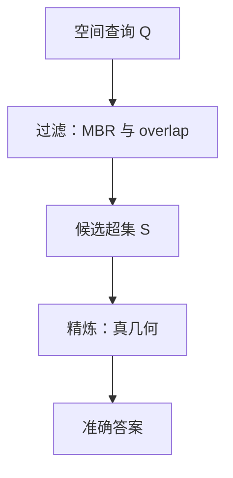
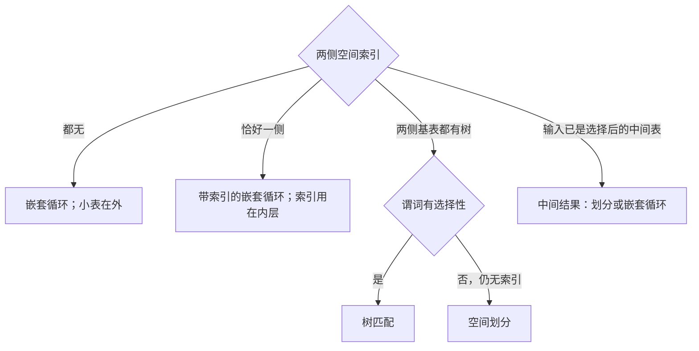
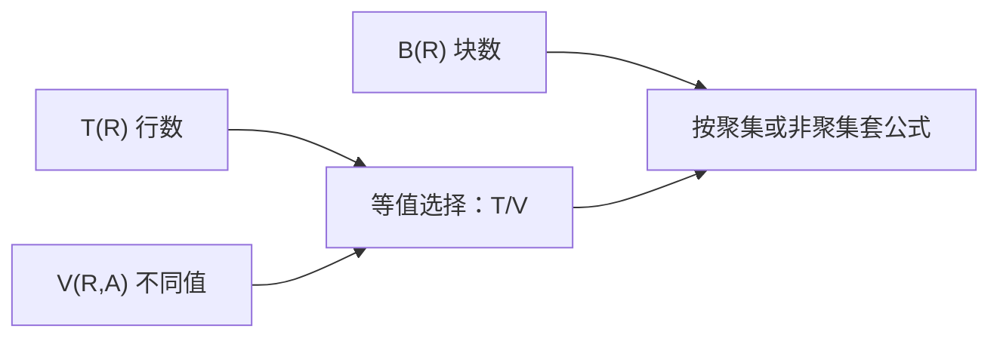

## 空间查询处理与优化

空间查询处理与优化（Query Processing and Optimization，QPO）把一条声明性 SQL 翻译成磁盘上的读块与几何计算。[空间存储与索引](07-storage-and-index.md) 给出文件组织、填充曲线、网格、四叉树、R 树和 PostGIS 的 `USING GiST`。本页回答：规划器怎样把语义等价的若干算法收成一条较快的执行计划。

用户只声明要什么。规划器决定扫表还是走索引、先选择还是先连接、空间连接用嵌套循环还是树匹配。通用存储与规划术语见 [数据库与数据存储](../../../tech/databases.md)。沿道路的可达与最短路见 [空间网络](09-spatial-network.md)。栏目总览见 [空间数据库](index.md)。


约束贯穿全页：规划器自己花的时间必须远小于真正执行的时间。空间查询的 CPU 与 I/O 都显著，空间选择下推因此不一定更省。

## 查询处理在做什么

### 声明与实现分离

手写程序必须指定数据结构与搜索过程；SQL 只声明结果应满足的谓词。换一批用户或换一种存储，不必重写查询。DBMS 按表大小、索引和估计选择率挑选算法。

常见示例以 Oracle Spatial 的 `SDO_` 开头；PostGIS 对应函数以 `ST_` 开头。语义相同：由经纬度构造点，再要求设施几何与该点距离小于给定阈值，单位随参考系。本页以 PostGIS 函数名为准。

### 四步路径

DBMS 接到 SQL 后，查询处理分四步：

1.  **查询分析**：词法、语法，得到内部表示。
2.  **查询检查**：表名、属性是否存在，`GROUP BY` 与选择列表是否合法。
3.  **查询优化**：在逻辑等价的关系代数表达式中选更省的，并为每个算子选算法。
4.  **查询执行**：按计划读块、算几何、写结果。

前两步保证语句合法；后两步保证合法语句尽量快。关系代数的意义是：把用户想要什么变成可以等价变换、可以估计代价的表达式。

策略多到规划半小时、查询三分钟，不如随便挑一个计划。商业库因此把策略总数压在大约 10～30 种，每种积木大约 2～4 种。

### 积木、策略、优化

| 概念 | DBMS 中的含义 |
| --- | --- |
| **积木** | 选择、连接、排序、投影等少数算子 |
| **策略** | 同一积木的多种实现；点查询可以扫表，也可以走索引 |
| **查询优化** | 按表大小、可用索引等参数，为每个积木选当前最有效的策略 |

一条 SQL 被拆成积木，再为每个积木选策略。组合后的计划应尽量快。

学 QPO 有三件事：判断瓶颈在物理模型还是在规划；改写 SQL 或给提示，使等价变换更容易；加强物理模型，加索引、换文件组织。语句过于绕，规划器可能转不动。

### 湖与营地的查询树

```sql
SELECT L.Name
FROM Lake L, Facilities Fa
WHERE ST_Area(L.Geometry) > 20
  AND Fa.Name = 'Campground'
  AND ST_Distance(Fa.Geometry, L.Geometry) < 50;
```

语义：面积大于 20 的湖，且与名为 Campground 的设施距离小于 50。规划器先得到一棵查询树：叶子是表，内部结点是积木。一种常见形状是：

-   对 `Lake` 做选择 $\sigma_{\mathrm{ST\_Area}(\cdot)>20}$
-   对 `Facilities` 做选择 $\sigma_{\mathrm{Name}=\texttt{Campground}}$
-   两者按 $\mathrm{ST\_Distance}(\cdot,\cdot)<50$ 做空间连接
-   最后投影 `L.Name`

每个非叶结点都要选定一种策略。一种示意：湖的面积选择用扫描；设施名用索引；二者用带索引的嵌套循环连接。同一棵树也可以改成空间划分连接。也可以先连接再选择：结果相同，代价通常不同。投影往往只有一种做法，不必选。

这棵树在后文会被重新当成优化对象。逻辑上可以交换选择与连接的次序。物理上必须看输入还是不是基表：中间结果没有 GiST。

### 一般困难与空间额外困难

一般困难有三：

-   **积木从哪来。** SQL 基于关系代数，积木是选择、投影、连接；SQL3 增加传递闭包等。积木种类一多，规划空间爆炸。
-   **每种积木准备几种策略。** 策略太多则规划本身太慢，因此总数必须封顶。
-   **怎样在适用策略里挑最好。** 固定优先级；或基于 DBMS 参数的简单代价模型。后文块代价把读一块记为 1。

空间数据库还有一层困难。空间类型与算子很丰富，计算几何算法也多，业界对空间积木该有哪几块并无完全一致的名单。当前常见选择是：

-   **空间选择**：返回明尼苏达州边界这类范围内的对象；再分点查询与范围查询。
-   **空间连接**：列出与德国接壤的国家。
-   **最近邻**：公寓到最近图书馆。

空间策略数量往往比纯关系更少，规划时间相对短。比较两个整数的 CPU 可忽略；算一个边界复杂的湖的面积或两条折线的距离则很贵。传统查询主要是 I/O 密集；空间查询是 CPU 与 I/O 都密集。空间策略的代价模型也还不成熟，这直接影响后文空间选择下推在空间上是否总成立。

## 过滤–精炼

空间查询面对丰富的数据类型、丰富的算子，以及一大套计算几何算法。若每种类型乘每种算子都在执行引擎里做一种积木，空间库会过于复杂。简化的共识是先过滤、再精炼（filter-and-refine）。



处理空间查询 $Q$：

1.  **过滤步（Filter）**：用空间对象的近似形状（通常是包围盒）以及索引信息，得到可能满足条件的候选超集 $S$。这一步与对象究竟是点、线还是面无关，索引里只有盒子。
2.  **精炼步（Refine）**：对 $S$ 中对象调用精确几何库，用真实坐标得到 $Q$ 的准确答案。

空间索引主要用于过滤步。精炼步是几何算法库的事，本页不展开多边形求交的实现。过滤减少的是不必要的复杂计算次数，不改变语义：候选允许偏多，答案必须完整。

尼罗河流经哪些国家。暴力做法：世界所有国家与尼罗河两两做真几何相交。过滤–精炼：先用尼罗河 MBR 与各国 MBR，盒不相交则国家必不相交，非洲以外大部分被直接丢掉；精炼时只对非洲候选国做真几何。

### 近似类型：最小包围矩形

**最小正交包围矩形**（Minimum Orthogonal Bounding Rectangle，MOBR / MBR）：用与坐标轴平行的矩形包住线串、多边形等。R 树等空间索引存的就是这些矩形。矩形与矩形是否相交，算法简单、常数小。OGIS 里取 MBR 的操作即 Envelope；PostGIS 为 `ST_Envelope`。

Touches 等拓扑操作 cost 记为 100、取 MBR 的 cost 记为 1 时，MBR 之间的拓扑操作 cost 应接近 1 这一档：矩形判定远便宜于真几何。具体数字以系统函数 `COST` 为准。

过滤步里看不见点线面。索引结点只是矩形，查询也先变成矩形，只问两个矩形是否交叠。

### 近似算子：一律先变成 overlap

过滤步用 **overlap（交叠）** 去近似各类拓扑谓词。`inside(A, B)`（$A$ 在 $B$ 内）在过滤步换成 `overlap(MBR(A), MBR(B))`。盒相交是 inside 的必要不充分条件：盒不相交则 inside 必假；盒相交仍可能真几何不相含，必须精炼。

把点线面与七八种拓扑压成矩形与 overlap，执行引擎只为这一种近似谓词准备索引扫描，复杂度才可控。PostGIS 规划里常见的盒谓词是 `&&`。

### 观察者前方

列出观察者 $V$ 前方的对象。前方是一个方向多边形。精确查询是与 `polygon(front(V))` 交叠的对象；近似查询是与该多边形的 MBR 交叠的对象。编号格子的盒若与视野盒相交，才进入候选。内部无论是复杂折线还是多边形，过滤步都不管。

### 国家与湖

左边一组国家多边形，标 $A,B,C,D,E,F$；右边一组湖，标 $1,2,3,4$。问哪些国家–湖对相交。

-   **不用 R 树**：6 个国家 $\times$ 4 个湖 $= 24$ 次复杂几何判定。
-   **用 R 树过滤**：只保留父盒相交的对。候选 $(A,1)$、$(A,2)$、$(B,1)$、$(B,2)$、$(C,2)$、$(D,2)$、$(E,3)$ 共 7 对，再对这 7 对精炼。

数量级是从二十四次真几何降到个位数。$F$ 与湖 4 的盒若与对方那一组都不交，整对不会进入精炼。范围查询的过滤步同样是：查询窗口 MBR 与对象 MBR 是否 overlap。

???+ note "过滤不改语义"
    盒不交可以安全丢掉。

    盒相交必须精炼。

    候选允许偏多，答案必须完整。

## 四类积木与代价约定

各产品实现不完全相同。本页代表积木：

| 积木 | 例子 | 输出 |
| --- | --- | --- |
| 点查询 | 点出数字地图上高亮的城市名 | 表中的一个空间对象及其属性 |
| 范围查询 | 列出亚马孙河流经的国家 | 一个空间区域内的多个对象 |
| 最近邻 | 找出离查询位置最近的城市 | 集合中的一个；并列则全部 |
| 空间连接 | 列出所有相交的河流–国家对 | 两表中满足空间谓词的元组对 |

下面四节在同一套代价约定下比较策略：

-   索引相对小，可假定缓存在内存，访问索引结点不计入数据块 I/O。
-   数据文件较大，内存对每个关系通常只缓存 1 个数据块；连接时各 1 块，再加 1 块放结果。
-   cost 用读取的数据块数计。刚才读过后面就不再读，这一条不允许：不缓存已读块。

点查询与范围查询的策略建立在 [空间存储与索引](07-storage-and-index.md) 的堆文件、Z / Hilbert 曲线和 R 树上。本页按执行时读几块来数，不再推导 bit interleaving 或 R 树二次分裂。

## 点查询的策略

给定位置，返回该处的属性：地名、案件类型等。策略：

1.  **扫描**：读数据文件全部 $B$ 块。
2.  **记录已按空间填充曲线排序**（本页例子用 Z 曲线）：无 B+ 树时，对查询点的 Z 值做二分，约 $\log_2 B$ 次读块；有 B+ 树时，沿树下行，典型再读 1～2 个数据块。
3.  **有空间位置上的索引（R 树）**：对索引做 `find()`，读块次数约为树高。本页小例子树在内存，只计叶子指向的那一块数据。

共同数据集：14 个点，类型为三角形或星形。每个数据块存 2 个点，故 7 个数据块，编号 $0,\ldots,6$。查询落到 $(x,y)=(2,3)$。图中 $y$ 轴向下。三种候选存储：

-   **A. 无序（heap）**：块之间没有按键有序可用。
-   **B. Z 序**：按 Z 型曲线排序。点有数据编号 $0$–$13$，括号里是 Z 值，范围 $0$–$15$。Z 值相邻的点尽量放同一块或相邻块。本图 $y$ 轴从上往下，是 Z 型。算 Z 值前先锁定曲线类型，见 [空间存储与索引](07-storage-and-index.md)。
-   **C. R 树**：根下孩子 $a,b$；再下若干叶。叶指向数据块。结点可重叠，对象不重复。

**线性搜索（无序）。** 块 $0$ 到块 $6$ 依次读入。完全不知道点在哪一块，必须扫完全文件。本例 cost $= 7$。

**二分搜索（仅有序 Z 文件，无 B+ 树）。** 先算查询点 Z 值。$(2,3)$ 的 Z 值等于 14。

磁盘 I/O 的单位是块，不是 Z 值等于 7 的那条记录。块序号和 Z 值存在非线性递增关系。即使知道要找 Z$=14$，若对 $0$–$15$ 做数值二分，商 7 并不对应第 7 块。因此二分的搜索区间是块号 $0..6$。

1.  区间 $[0,6]$，中点 $\lfloor(0+6)/2\rfloor=3$，读块 3。块内 Z 值为 7 和 8，都小于 14，应往更大的块号走。
2.  区间 $[3,6]$，中点 $\lceil(3+6)/2\rceil=5$，读块 5。块内 Z 值为 12 和 13，仍小于 14，继续向右。
3.  区间 $[5,6]$，中点 $\lceil(5+6)/2\rceil=6$，读块 6。块内 Z 值为 14 和 15，命中 14。

访问了三块。本例 cost $= 3$。有序使搜索从线性变成对数级；本例 $\log_2 7 \approx 3$。

**索引搜索（Z 曲线 + 内存中的 B+ 树）。** 数据仍按 Z 序放在块 $0..6$。查询 Z$=14$：沿分隔键落到块 6。树已在内存，只计这一次数据块读取。本例 cost $= 1$。二分靠探测中间块缩小区间；树把 14 在块 6 这一事实存在内部结点里，不必读块 3、块 5。

**R 树（内存中）。** 查询点与根相交。与孩子 $a$ 的 MBR 不相交，$a$ 整枝剪掉。与 $b$ 相交，进入 $b$。$b$ 的诸叶子中只有 $g$ 的 MBR 含该点，读 $g$ 指向的那一块数据。本例 cost $= 1$。R 树因重叠可能要走多条孩子；本例点不在 $a$ 内，只走一条。

| 存储 / 策略 | 本例读取数据块数 |
| --- | --- |
| 线性搜索（无序） | 7 |
| 二分（Z 曲线有序文件） | 3 |
| 索引（Z 曲线 + B+ 树） | 1 |
| 索引（R 树） | 1 |

后两者都是树在内存、只计数据块。不要把树高 4～5 再加进本例的 1。

## 范围查询的策略

例子：列出亚马孙河流经的国家。策略与点查询同构，并增加窗口到一段或多段 Z 区间的转换：

1.  扫描全部 $B$ 块。
2.  按 Z 曲线有序且有 B+ 树：确定满足窗口的 Z 值范围；用树定位范围内最小 Z；沿叶链表扫到范围内最大 Z。无树则先二分到下界，再顺序向后读。
3.  有 R 树：对索引做范围查询，窗口与结点 MBR 相交才下降。

数据集仍是 14 点、7 块。查询矩形先取 $(2\le x\le 3)\land(2\le y\le 3)$。

**线性搜索。** 无序则无结构可用，仍扫 7 块。cost $= 7$。

**仅 Z 有序、无 B+ 树：一段 Z 区间。** 窗口对应一个 Z 区间 $12..15$。先二分找到下界 12 所在块，再沿有序文件扫到 15。

1.  区间 $[0,6]$，中点 3，读块 3（Z 为 7、8）。$8<12$，下界在右半。
2.  区间 $[3,6]$，中点 5，读块 5（Z 为 12、13）。命中下界 12；块内还有 13，属于窗口。
3.  文件按 Z 有序，不必再二分上界：下一块即块 6（14、15），窗口上界 15 读完即停。

前两块来自二分定位下界，第三块来自顺序扫描。cost $= 3$。点查询在块 6 命中 Z$=14$ 即可停；范围查询在命中下界后还要把闭区间读完。

**Z 曲线 + B+ 树：一段区间。** 同样区间 $12..15$。在 B+ 树中搜 12，叶子直接指向块 5；沿叶链表的 `next` 到 13（仍在块 5）、14、15（块 6）。不必读块 3。cost $= 2$。

**两段 Z 区间。** 窗口改为 $(2\le x\le 3)\land(1\le y\le 2)$。Z 曲线在矩形窗口上往往不连续，本例裂成 $[6..7]$ 与 $[12..13]$。每一段都要一次索引定位加段内顺序扫：

-   搜 6：落到块 2、3（含 6、7）。
-   搜 12：落到块 5（含 12、13）。

cost $= 3$。Z 值差较小时，第一次搜到 6 之后可沿叶链表走到 13，中间可能多读空档块。差得大时，对每一段重新从 B+ 树找下界更省。计数按每段一次索引查找。Hilbert 曲线同一套路：查询矩形对应的 Hilbert 值裂成若干闭区间，每段各查一次下界再段内顺序扫。

**R 树范围查询。** 窗口与根交、与 $a$ 不交、与 $b$ 交；$b$ 下与窗口交的叶子为 $g,i$，读它们指向的两块。cost $= 2$。剪枝规则与 [空间存储与索引](07-storage-and-index.md) 相同：父盒与窗口不交则整枝不读。

| 存储 / 策略 | 本例读取数据块数（窗口 $2\le x,y\le 3$） |
| --- | --- |
| 线性搜索 | 7 |
| 二分（Z 曲线） | 3 |
| Z 曲线 + B+ 树 | 2 |
| R 树 | 2 |

点查询与范围查询的策略是同一套扫描 / 填充曲线 / R 树。差别只在：范围要把窗口变成 Z（或 Hilbert）区间，可能多段；命中下界后还要向前扫。

## 最近邻查询的策略

例子：找出离查询位置最近的城市。点查询、范围查询可作为子程序，沿用上一节的扫描 / Z / R 树实现。

**两阶段（two phase）：**

1.  取出包含查询对象（或查询点所落入）的那一块，这是一次点查询。
2.  令 $M$（记 $d_B$）为该块内对象到查询点的最小距离。
3.  对到查询点距离 $\le M$ 的窗口做范围查询，在窗口内用真距离选出最近；并列则全要。

**单阶段（one phase / single phase）**：仅当有 R 树。递归下降，用结点 MBR 的最小 / 最大可能距离剪掉不可能含更近点的子树，最后只精炼剩下的数据块。

餐馆例子。每个点是一家餐馆，查询点 $p$ 是用户。并列则全部返回。本例最近邻是 $j$，$\mathrm{dist}(p,j)=1.41$。R 树根下孩子 $X$（上）与 $Y$（下）。叶按每块两点组织。索引建在静态的餐馆上，不建在移动的用户上，与基表上建 GiST 一致。

### 两阶段（R 树）

阶段 1（点查询）。$p$ 与根交、与 $X$ 不交、与 $Y$ 交；$Y$ 下与红色叶相交。读数据块 3，块内点 $g,h$。二者到 $p$ 距离相等，$d_B=2$。

阶段 2（范围查询）。以 $p$ 为心、$d_B=2$ 为半径画圆。圆上做范围查询不方便，改用该圆的 MBR $M_p$。用 $M_p$ 再走 R 树：与 $X$ 不交，与 $Y$ 交；除已读的红叶外，还与褐色叶交。读数据块 4。其中 $\mathrm{dist}(p,j)=1.41< d_B$，更新最近邻为 $j$。

块 3 在阶段 1 已在内存，阶段 2 不必重读。数据块 I/O：阶段 1 为 1，阶段 2 为 1，合计 2。索引结点仍不计。把 R 树换成 Z / Hilbert 有序加 B+ 树时，阶段 1、阶段 2 分别换成点查询与范围查询即可，框架不变。按不缓存约定，阶段 1 已读的块在阶段 2 要再计一次。

查询点落在根 MBR 之外时，没有包含 $p$ 的叶子。半径由第一块数据决定：太小则范围查询空，太大则扫过多块。做法是：对当前层每个孩子 MBR，计算点到矩形的最短距离，优先取垂足，否则取最近边或角，选最近的那个 MBR 下降；读到第一块数据后，对块内每个点算到 $p$ 的真距离，取最小者当 $d_B$；再以 $d_B$ 为半径做圆、取圆的 MBR、做范围查询。任意抓一个叶子用那里的距离当半径，结果正确但圈太大，精炼块数变多。两阶段的质量取决于第一块是否足够近。

点到矩形的最远距离用较远的那个角。[空间存储与索引](07-storage-and-index.md) 用四角距离次小给范围查询定半径；这里先用最近 MBR 把第一块定下来。同一套几何，用途不同。

### 单阶段（MinDist / MaxDist）

对每个结点算查询点到其 MBR 的 **MinDist**（最近可能距离）与 **MaxDist**（最远可能距离）。剪枝规则：

> 若结点 $A$ 的 MaxDist 小于结点 $B$ 的 MinDist，则 $B$ 中不可能有比 $A$ 中某点更近的对象，$B$ 整枝删除。

本例第一层：$X$ 的 MinDist$=3$、MaxDist$=7.47$；$Y$ 的 MinDist$=0$、MaxDist$=4.47$。$Y$ 的 MaxDist 并不小于 $X$ 的 MinDist，两边都要看。假想 $Y$ 的 MaxDist 为 2 而 $X$ 的 MinDist 为 3，则 $X$ 可删。

| 结点（数据块号） | MinDist | MaxDist | 处理 |
| --- | --- | --- | --- |
| 0 | 3.16 | 4.12 | 后被结点 3 删 |
| 1 | 3.16 | 5.10 | 后被结点 3 删 |
| 2 | 4.47 | — | 先被结点 0 删；MaxDist(0)$=4.12$ $<$ MinDist(2)$=4.47$ |
| 3 | 0 | 2.83 | 保留 |
| 4 | 1.41 | 2.83 | 保留 |
| 5 | 3.16 | — | 被结点 3 删；$3.16 > 2.83$ |

先按结点 0 丢掉 2，再因结点 3 的 MaxDist$=2.83$ 小于 0、1、5 的 MinDist，丢掉 0、1、5。剩下块 3 和 4，读入后对点与 $p$ 算真距离，得到 $j$。本例数据块 I/O：2。与两阶段相同。本例数据与树恰好都落到两块；换数据分布后两种阶段读块数可以不同。单阶段不先画圆，但要在下降过程中维护各结点 MinDist / MaxDist。

## 空间连接的策略

例子：列出所有相交的河流–国家对。策略：

1.  **嵌套循环（Nested Loop）**：所有对象对都测空间谓词，尼罗河也要和非洲以外的国家比。
2.  **空间划分（Space Partitioning）**：只测落在同一空间分区里的对，非洲的河只和非洲的国比。
3.  **树匹配（Tree Matching）**：两表都有树形空间索引时，按层配对结点，盒不交则整对子树剪掉。
4.  其它：基于空间连接索引、外存平面扫描等，本页不展开。

消防站与房屋。查询：对每个消防站，找出距离 $\le 1$ 的房屋。叠加结果对包括 $(A,a)$、$(B,f)$、$(D,h)$、$(D,j)$ 等。道路与出租车距离小于 100 米同类，都是带距离阈值的空间连接。存储：每块最多 2 个点。4 个消防站 → 2 块（块 0、1）；12 个房屋 → 6 块（块 2–7）。以下凡写 cost，均假设每个关系内存只缓存 1 个数据块、不跨次循环复用。



### 嵌套循环

两侧都无空间索引时，用块嵌套循环：

```text
for each block B_fs of fire_stations do
    for each block B_h of houses do
        对 B_fs 中每个消防站、B_h 中每个房屋测 dist ≤ 1
```

消防站在外层：读入块 0（站 $A,D$），内层把房屋 6 块各读一遍；再读入块 1（站 $B,C$），内层房屋 6 块再各读一遍。房屋侧 I/O：$2\times 6=12$。消防站在外层各读一次：$2$。合计 $2+12=14$。公式：外层块数 $B_{\mathrm{out}}$，内层块数 $B_{\mathrm{in}}$，

$$
B_{\mathrm{out}} + B_{\mathrm{out}}\times B_{\mathrm{in}}.
$$

内外层对调：房屋在外层、消防站在内层，合计 $6+6\times 2=18$。嵌套循环对哪一侧做外层，块数可以不同。通常让块数少的关系做外层。本例 14 优于 18。3 个内存缓冲分别给外表、内表和结果各 1 块。12 只是内层读房屋的次数，别漏掉外层自己的 2。

### 带一侧空间索引的嵌套循环

外层仍扫第一表的每一数据块或每一元组；内层不再扫第二表，而对与当前外层对象或块交叠的区域做范围查询，第二表有 R 树。谓词是 $\mathrm{dist}\le 1$，点与盒相交不足以判定，需要把外层对象的 MBR 向外扩张距离 1，得到缓冲区矩形：凡与该矩形相交的房屋，才可能距离 $\le 1$。

两侧都可以按块为单元时，按块扩张：

-   消防站块 0 的 MBR 外扩 1 之后，与房屋 R 树求交，内层读块 2、3、5、6（4 块）。路径示意：Root → $X$ → 2, 3，以及 Root → $Y$ → 5, 6。
-   块 1 外扩后读块 4、6、7（3 块）。

消防站 2 块 + 房屋 $4+3=7$ 块，合计 9。块 6 被两次内层命中，按不缓存约定计两次。只有一侧有索引时，外层读完一块后，默认按块内每个元组去内层做一次范围查询。有索引的嵌套循环，索引用在内层。

### 空间划分连接

尼罗河不必和非洲以外的国家比。把平面分成公共分区，只在同一分区内做对象对测试。

本例四分区 $P_0,P_1,P_2,P_3$。因谓词是距离 $\le 1$，对数量较少的一侧（消防站）每个对象做边长由距离阈值决定的 MBR（向外扩 1）。扩之后对象可跨越分区。站 $C$ 扩 1 之后与 $P_1$ 和 $P_3$ 都相交，必须在两个分区各放一份。阈值改成 2 时，站 $A$ 的盒会更大，甚至可能四个分区都出现 $A$。这是划分法的复制（replication）。

| 分区 | 消防站 | 房屋 |
| --- | --- | --- |
| $P_0$ | $A$ | $a,b,c,e$ |
| $P_1$ | $B,C$ | $d,f$ |
| $P_2$ | $D$ | $g,h,j$ |
| $P_3$ | $C$ | $i,k,l$ |

算法：

-   **过滤：** 对每个 $P_i$，把该分区内消防站与房屋的 MBR 两两测 overlap，留下候选对。
-   **精炼：** 对候选对算真距离是否 $\le 1$。

跨分区且盒不交的对根本不会测。

代价（本例）：

1.  读入全部数据以便划分：消防站 2 + 房屋 6 $= 8$。
2.  把划分结果写回磁盘：再 8。
3.  对每个分区读入该区消防站块 + 房屋块：$P_0$ 为 $1+2=3$，$P_1$ 为 $1+1=2$，$P_2$ 为 $1+2=3$，$P_3$ 为 $1+2=3$，小计 11。

$$
8+8+(3+2+3+3)=27.
$$

约相当于每张表扫描约 3 遍，复制不多时如此。前提仍是每关系内存一块、不缓存。划分法在两侧都没有可用空间索引、但谓词选择性好时有意义。本例 27 大于嵌套循环的 14，因为划分的读写开销大，且复制让 $C$ 出现两次。换数据分布，划分法可能优于嵌套循环。数字只对每块 2 点、阈值 1、四划分、不缓存这套例子负责。

### 树匹配

三种剪枝粒度对照：

| 方法 | 剪掉什么 |
| --- | --- |
| 带索引的嵌套循环 | 内层范围查询时，与查询盒不交的数据块 |
| 空间划分 | 彼此不交的分区对 |
| 树匹配 | 彼此不交的索引结点对 / 数据块对，从根一层层往下 |

两侧都有树且连接谓词有选择性时使用。消防站一侧的结点 MBR 同样先外扩 1，以模拟 $\mathrm{dist}\le 1$。

1.  **根层。** 消防站根与房屋根（孩子 $X,Y$）的盒都相交，没有任何孩子对被淘汰。剩下要递归的四对：$(X,0)$、$(Y,0)$、$(X,1)$、$(Y,1)$（0、1 是消防站的两块）。
2.  **下一层，按对下降。** $(X,0)$ 留下 $(2,0)$、$(3,0)$；$(Y,0)$ 留下 $(5,0)$、$(6,0)$；$(X,1)$ 留下 $(4,1)$；$(Y,1)$ 留下 $(6,1)$、$(7,1)$。
3.  **落到数据块对后精炼。** 数据块：消防站 2，房屋侧 2、3、5、6 与 4、6、7，按不缓存计 $4+3=7$，合计 9。房屋块 6 被两对命中，计两次。

与一侧索引的嵌套循环本例数字相同。算法是两棵树对称地同时下降。

### 空间连接策略怎么选

| 情形 | 倾向 | 本例数据块 |
| --- | --- | --- |
| 缺省 / 无额外结构 | 嵌套循环 | 14（消防站在外） |
| 两侧都无空间索引，谓词有选择性 | 空间划分 | 27（本例并不更优） |
| 恰好一侧有空间索引 | 带索引的嵌套循环 | 9 |
| 两侧都有树形空间索引，谓词有选择性 | 树匹配 | 9 |

???+ warning "中间结果没有 GiST"
    空间索引建在基表上，不会自动建在查询中间结果上。

    湖–营地树上，两边都已经选择过再连接时，只能划分或嵌套循环。

    树匹配只适用于两侧都是带树形空间索引的基表。

## 从 SQL 到执行计划

起点是 SQL，终点是执行计划。中间站：查询树 → 逻辑等价变换 → 为每个非叶选策略 → 定求值顺序。之后真正执行。湖–营地树在这里被当成优化对象。查询树：结点是积木，孩子是该积木的输入，叶子是表。

执行计划有三个组成部分：

1.  一棵查询树。
2.  每个非叶结点选定的策略。
3.  非叶结点的求值顺序。

湖–营地一例：

-   $\mathrm{Area}(L.\mathrm{geom})>20$：扫描。
-   $\mathrm{Fa.Name}=\texttt{Campground}$：索引。
-   $\mathrm{Distance}<50$：空间划分连接。此时两侧已是选择之后的中间结果，不能再树匹配。
-   投影：当场（on-the-fly）。
-   顺序：按上面列出的次序。

连接算法必须看输入是基表还是中间表。两边都还是基表且都有 R 树，才谈树匹配；已经 $\sigma$ 过的湖子集，只能扫描、划分或嵌套循环。

## 逻辑变换

变换必须语义不变，但可以减少子查询产出的数据量，或减轻父结点的计算。常用：

-   **选择下推**到连接之下，使参加连接的表变小。
-   **投影下推**。
-   **重排连接次序**。三个关系时，先 $AB$ 还是先 $BC$，中间结果可能差两个数量级。

先选某个学号再连接选课，往往把一端变成一行，连接立刻变轻。三个关系时，希望先做完之后中间表更小的那对。两棵等价查询树（先 Join 后 Select / 先 Select 后 Join）分别估 I/O，用来比较两条等价计划。

## 空间选择下推不一定更省

传统规则默认 CPU 远小于 I/O，选择几乎总是愈早愈好。空间上 `ST_Area`、`ST_Distance` 等 CPU 很重，必须重新审查。

先对每个湖算 `ST_Area>20`：湖有 100 个、面积 cost 为 10，仅这一步就 1000。先按营地把距离条件做完，只剩 10 个湖再算面积，面积 CPU 降到 100。`area()` 比 `distance()` 更贵时，把空间选择压到连接之下会提高总代价。关系侧先选择再连接，在空间上不总成立。

过滤–精炼可以看成空间侧的标准顺序：把便宜的包围盒测试放在前面，把贵的精确几何放在后面。便宜的谓词仍应尽早用。贵的几何谓词要同时看自身费用和收缩效果。

???+ warning "两条账不要混"
    总代价等于 I/O cost 加 CPU cost。

    关系侧手算通常只计 I/O。

    空间侧必须把函数 `COST` 看成 CPU 入口；据此推不出选择越早越好。

## 三种选策略的办法

1.  **优先级方案：** 按文件组织与索引检查各策略是否适用，在适用者里取优先级最高的。算得快，复杂查询常用。
2.  **规则方案：** 情境映射到策略。范围查询结果超过数据文件的 2%，就不要用非聚集索引：随机读太多，不如扫表。随机只读到全文件的约 2%–10% 时，耗时已经可以和扫完整文件相当，见 [空间存储与索引](07-storage-and-index.md)。
3.  **代价方案：** 对单积木用公式估计每种策略的 cost（表大小等为参数），取最小；对整棵树则在各结点策略组合中取总代价最小，可用动态规划。

商业实践：关系积木普遍用基于代价的优化（CBO，Cost-Based Optimization）；空间策略的代价模型不成熟，空间一侧常常用规则。PostgreSQL + PostGIS 整体仍是代价模型：空间函数的 CPU 以函数 `COST` 的形式参与；专用空间连接算法代价公式则未必成熟。规划器如何知道参加 Join 的两波数据有多大，是 CBO 的核心，本页用 $T$、$B$、$V$ 给出可手算的一块。

## 基于代价的块 I/O：$T$、$B$、$V$

约定：只计 I/O；读一块 cost $= 1$；内存对每个关系只缓存 1 块（连接时 2 块）。关系 $R(A,B)$ 的统计量：

| 记号 | 含义 |
| --- | --- |
| $T(R)$ | 元组（行）数 |
| $B(R)$ | 数据块数；每块行数约为 $T(R)/B(R)$；最后一块可能不满，估计时仍用此比 |
| $V(R,A)$ | 属性 $A$ 的不同取值个数 |

$A$ 为码则不能重复，故 $V(R,A)=T(R)$，等值选择率（selectivity factor）为 $1/V(R,A)=1/T(R)$。

两条取整规则：**按块读必须向上取整**，不能读四分之三块；**行数估计可以带小数**，因为那是期望值。某步算出 $5/2$ 块，读盘要记 $3$；算出 $4000\times 5/2$ 行，行数可以保留 $10000$。



### 选择 $\sigma_{A=a}(R)$

估计结果行数：$T(R)/V(R,A)$（均匀假设）。

| 存储 / 索引 | I/O cost | 理由 |
| --- | --- | --- |
| 堆文件，无索引 | $B(R)$ | 只能扫全表 |
| 聚集索引（隐含有序文件） | $B(R)/V(R,A)$ | 相同 $A$ 值物理连在一起；读一个值对应的那一段块 |
| 非聚集索引 | $T(R)/V(R,A)$ | 每个命中元组可能在不同块；最坏一行一块 |

数值例子：100 个学生、$B=10$、性别 $V=2$。无索引：10。聚集：$10/2=5$，前 5 块全是男生等。非聚集：$100/2=50$ 次索引定位，最坏 50 块，已经大于扫表的 10，规划器此时应选扫描。结果超过约 2% 时不用非聚集索引，与此是同一现象。

不等式 $\sigma_{A<a}(R)$ 的选择率不再是 $1/V$，而与取值分布 / 直方图有关。等值这一档按 $T/V$；不等式按估计行数乘以每行或每值的访问代价推广。

合取条件 `city = '杭州' AND is_student = True` 以及复合非聚集索引 $(city, is\_student)$：只给出各属性各自的 $V$ 时，通常在独立性假设下把选择率相乘，再套无索引用 $B$、聚集用块段、非聚集用行数。以 $\sigma_{a=?}(R)$ 返回 $T/V$ 为准做推广。

### 嵌套循环连接 $R\Join S$（内存 2 块）

无索引：与消防站例子同一公式

$$
B(R)+B(R)B(S)\qquad\text{或}\qquad B(S)+B(S)B(R),
$$

取较小者（小表在外）。

一侧在连接键上有聚集索引（对外层每一元组，内层按值读连续一块段）：

$$
B(R)+T(R)\cdot\frac{B(S)}{V(S,B)}
$$

（$S.B$ 上聚集；对称式把 $R,S$ 对调。）

非聚集索引：内层按行计 I/O：

$$
B(R)+T(R)\cdot\frac{T(S)}{V(S,B)}.
$$

必须向上取整。$B(S)=10$、$V(S,B)=20$ 时，$B(S)/V=0.5$ 不能写成读半块。I/O 以块为单位，按 $\lceil\cdot\rceil$ 计。对每个外层元组至少读 1 块时，更不能先把 0.5 乘出行数再当成 0.5。极端：20 个外层元组乘每值 0.5 块，若错误地写成 10，会与每元组至少一块得到的 20 差一倍。

内存 $M$ 块时还有块嵌套循环；哈希连接 $B(R)+B(S)$，一趟当 $\min(B(R),B(S))<M$；排序合并同样 $B(R)+B(S)$，一趟当 $B(R)+B(S)\le M$。本页要熟练的是上面选择三式加连接三式。中间结果不写回磁盘时，Join 之后的分组与选择 I/O 记 0。

### 三关系例子

$R(A,B)$、$S(B,C)$、$T(C,D)$：

-   $T(R)=10^{5}$，$T(S)=6\times 10^{6}$，$T(T)=5\times 10^{4}$
-   $B(R)=100$，$B(S)=3000$，$B(T)=40000$
-   $V(R,A)=5\times 10^{4}$，$V(R,B)=V(S,B)=3\times 10^{3}$
-   $V(S,C)=V(T,C)=2\times 10^{4}$，$V(T,D)=10^{4}$
-   非聚集：$R.A$、$R.B$、$S.C$、$T.D$；聚集：$S.B$、$T.C$

查询树（由叶到根）：先 $\sigma_{A=a}(R)$（非聚集索引）→ 与 $S$ 按 $B$ 做索引连接（$S.B$ 聚集）→ 与 $T$ 按 $C$ 做索引连接（$T.C$ 聚集）→ 投影。投影时数据已在内存，I/O 记 0。

**第 1 步** $\sigma_{A=a}(R)$，非聚集：

$$
\mathrm{Cost}=T(R)/V(R,A)=10^{5}/(5\times 10^{4})=2.
$$

结果行数同样为 2。两行不在同一页上，各读一块。

**第 2 步** 对这 2 行，每行用聚集索引在 $S$ 上找 $B=$ 该行的 $B$：

$$
\text{每次访问 cost}=B(S)/V(S,B)=3000/3000=1.
$$

本步增量 $2\times 1=2$。累计 cost $2+2=4$。结果行数：

$$
2\cdot T(S)/V(S,B)=2\cdot (6\times 10^{6})/3000=2\times 2000=4000.
$$

**第 3 步** 4000 行每行在 $T$ 上按聚集 $T.C$ 访问：

$$
\text{每次访问 cost}=B(T)/V(T,C)=40000/20000=2.
$$

增量 $4000\times 2=8000$。每个 $C$ 值对应的期望行数 $T(T)/V(T,C)=5/2$，故最终约 $4000\times 5/2$ 行（行数可保留小数）。投影不另计 I/O。

$$
\text{Total Cost}=2+2\times 1+4000\times 2=8004.
$$

下列三个数字单位不同：第一个 2 是选择的块 I/O，第二个 2 是外层行数，后面的 4000 是中间行数，不要把它们加在同一语义下。先把六个公式用熟，再在树上交替更新这一步 cost 和这一步输出行数。下一步的 $T(\cdot)$ 用中间结果行数。

把 $R.A$ 改为聚集，$S.B$、$T.C$ 改为非聚集一类。**结果行数不变**：索引只改访问路径，不改选择与连接的基数。变的只是每一步的 cost。

-   $R.A$ 改为聚集后，按块估计 $B(R)/V(R,A)=100/(5\times 10^{4})$，小于 1，读盘向上取整为 1。
-   $S.B$ 改为非聚集后，每次查找按行计 $T(S)/V(S,B)=2000$，原来的每次 1 块变成每次 2000。
-   $T.C$ 改为非聚集后，$T(T)/V(T,C)=5/2$ 块，读盘取整为 3。

换索引类型，行数公式不动，代价公式按聚集 / 非聚集切换。给定一棵查询树、一组 $T$、$B$、$V$ 和索引种类，总 I/O 按这一套计算。

## 空间函数的 CPU：`COST` 与 `EXPLAIN`

`ST_Distance`、`ST_Boundary` 等在系统目录里带估计代价。PostgreSQL 把函数代价记在 `pg_proc.procost`。在 pgAdmin 中：Schemas → public → Functions，选中具体函数，右键 Properties，在估计代价里看到 `COST`。包围盒一类便宜，距离、缓冲区、相交一类贵。这些 `COST` 就是规划器把空间 CPU 不便宜编进 CBO 的入口。具体数字以所安装库中读到的值为准。

```sql
EXPLAIN
SELECT C.name, count(*)
FROM ne_10m_admin_0_countries C, ne_10m_populated_places P
WHERE ST_Within(P.geom, C.geom)
GROUP BY C.name
ORDER BY C.name;
```

无空间索引时：扫描城市表、扫描国家表，二者嵌套循环并判断包围盒相交且满足包含，代价可升到约数十万；再按国家名哈希分组、排序。走空间索引后：扫描代价可降一个数量级；索引阶段只看包围盒是否相交（过滤），得到候选后再做真正的 `ST_Within`（精炼）。有无索引，结果行数应相同，只是代价变小。统计信息足够时，规划器会选带索引的那棵树。数字为估计值，以实际 `EXPLAIN` 输出为准。官方语义见 [PostgreSQL `EXPLAIN`](https://www.postgresql.org/docs/current/sql-explain.html) 与 [Using `EXPLAIN`](https://www.postgresql.org/docs/current/using-explain.html)。

对照路径：无索引时跑 `ST_Crosses`、`ST_Distance`；`CREATE INDEX … USING GiST` 后再跑；距离谓词改成 `ST_DWithin`，计划才走 GiST 过滤，与 [空间存储与索引](07-storage-and-index.md) 中可走索引的谓词、`Disjoint` 除外一致；再用 `SET enable_indexscan = false` 看规划是否退回顺序扫描。shapefile 导入工具缺省往往勾选创建空间索引，对比有无索引时必须先关掉，再手写 `USING GiST`。有无索引结果行数应一致。

写在 `WHERE` 或 `JOIN … ON` 里的空间函数可能走空间索引；写在 `SELECT` 列表里的通常不走，结果里每一行都要真算。规划器的 cost 是近似值。墙上时钟以 `EXPLAIN ANALYZE` 为准，同时核对真实行数与估计是否偏离。

???+ tip "距离谓词与验收"
    验收空间查询时同时看计划与行数。

    `ST_Distance <` 对照应改写成 `ST_DWithin`，否则 GiST 过滤用不上。

    关掉索引扫描后代价应回升；行数应保持不变。

## 与相邻章的接口

对 [空间存储与索引](07-storage-and-index.md)。本页把那些结构当成执行时可以调用的手段：顺序读远快于随机读、填充曲线把二维变成一维键、R 树兄弟盒可重叠、GiST 建在静态几何上、过滤步只用包围盒。可走索引的八个谓词是 `Equals`、`Intersects`、`Touches`、`Crosses`、`Within`、`Contains`、`Overlaps`、`DWithin`；`Disjoint` 除外。点 / 范围 / NN / 空间连接四类查询，存储页按索引上怎么走讲，本页按执行时读几块、连接时选哪种算法讲。

对几何对象模型与 PostGIS。`ST_Area`、`ST_Distance`、`ST_Within`、`ST_DWithin`、`ST_Crosses`、`ST_Envelope` 是精炼步真正调用的几何库。过滤–精炼并不改这些函数的语义，只是先用 MBR overlap 丢掉必假的对。写在 `WHERE` 里的谓词，到本页才解释为什么有的走 GiST、有的必须改写成 `ST_DWithin`。

对关系代数。查询树的结点就是选择、投影、连接；逻辑变换（选择下推、连接换序）是关系代数等价律在规划器里的应用。子查询写得过深往往让优化器转不动。

对 [空间网络](09-spatial-network.md)。本页处理欧氏 / 拓扑谓词下的选择与连接。沿道路怎么走需要图与传递闭包，几何距离不够。

## 相关阅读

-   [空间存储与索引](07-storage-and-index.md)
-   [空间网络](09-spatial-network.md)
-   [空间数据库](index.md)
-   [数据库与数据存储](../../../tech/databases.md)

## 来源说明

本页根据空间数据库查询处理教材与讲义整理，对照 Shekhar 与 Chawla《Spatial Databases: A Tour》第 5 章 Query Processing（过滤–精炼、空间选择与空间连接、最近邻），并对照程昌秀《空间数据库管理系统概论》相关章节。代价记号 $T(R)$、$B(R)$、$V(R,A)$ 与选择 / 嵌套循环六式沿用关系数据库基于块的估计；空间侧 CPU 入口取 PostgreSQL 系统目录中的函数 `COST`。计划形态以 [PostgreSQL `EXPLAIN`](https://www.postgresql.org/docs/current/sql-explain.html)、[Using `EXPLAIN`](https://www.postgresql.org/docs/current/using-explain.html) 与 PostGIS 官方文档为准。函数名、索引谓词与估计数字以所安装版本的系统目录和 `EXPLAIN` 输出为准。

条文、标准与产品功能以官方文本为准；本页核验日期为 2026-09-04。
