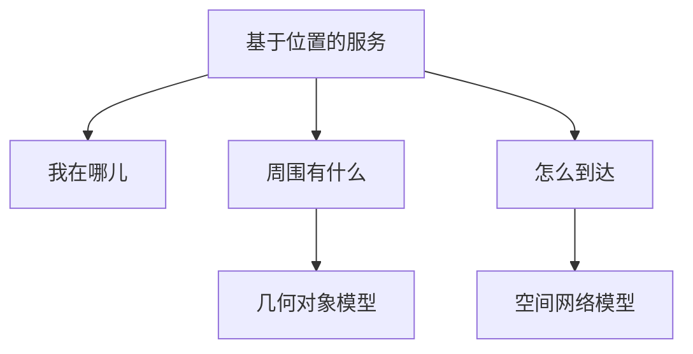
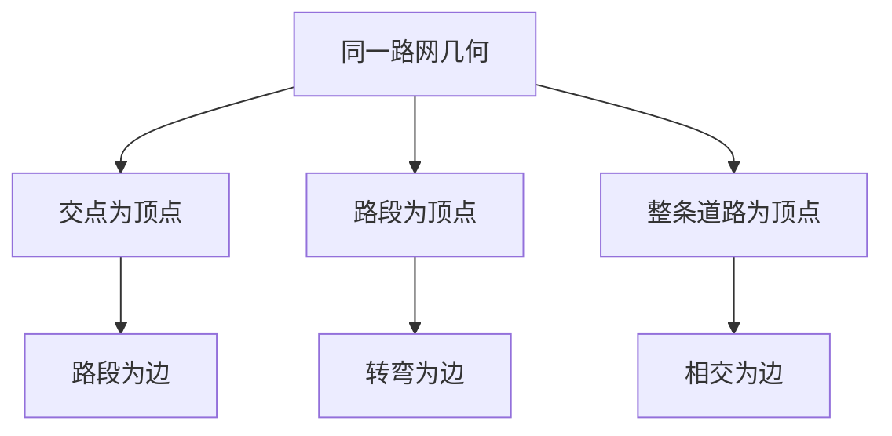
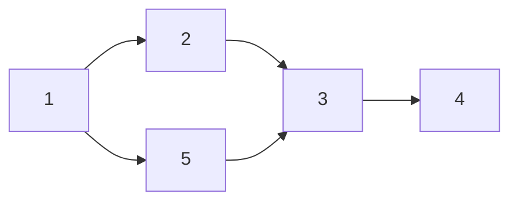
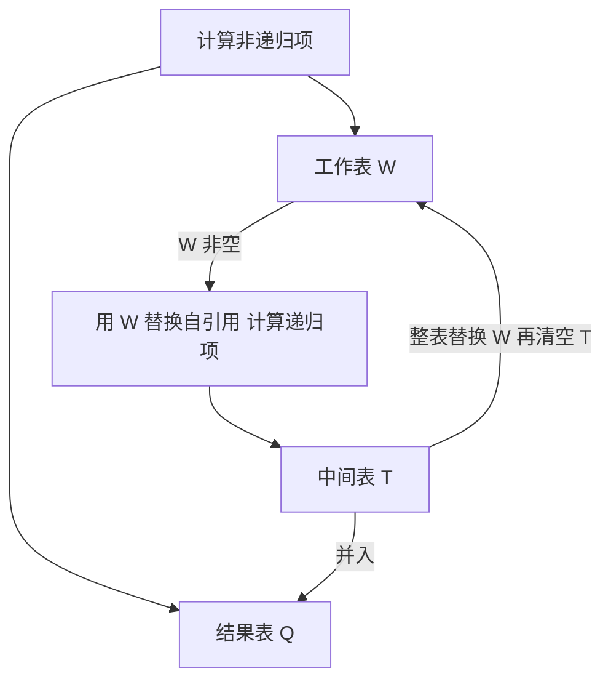
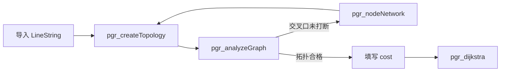

## 空间网络模型与 pgRouting

[几何对象与 PostGIS](04-geometry-and-postgis.md) 回答形状与远近：点、线、面加上 `ST_Distance`、`ST_DWithin`、`ST_Intersects`。[空间查询处理](08-query-processing.md) 再把这些谓词拆成过滤–精炼与执行计划。沿道路怎么走，几何距离不够。出租车与乘客都是 `geometry(Point, 4326)`，道路是 `LineString`。把附近写成 `ST_Distance(T.pos, U.pos, true) < 1000`，直线距离小于 1 公里，驾驶距离仍可能远大于 1 公里。水系、断头路、单行把欧氏近邻与路上代价切开。

**空间网络模型**：用顶点、边和边上的代价描述连通，回答能否到达、沿边走几步、哪条路代价最小。同一条道路在几何对象模型里是 `LINESTRING`，在网络模型里是 `source`–`target`–`cost`。坐标系、投影与法定精度见 [GIS 与测绘](../geospatial/gis-and-surveying.md)。栏目总览见 [空间数据库](index.md)。

实践栈以 PostgreSQL、PostGIS、pgRouting 为准。PostGIS 给几何类型；pgRouting 给图算法。OGIS 简单要素支持点、线、面，没有图类型，也没有最短路算子。传统 SQL 支持选择、投影、连接与统计，没有传递闭包。SQL3 增加递归。PostgreSQL 用 `WITH RECURSIVE` 求可达；最短路调用 `pgr_dijkstra`。



LBS 三问里，周边查询走几何谓词；导航与可达走网络。验收驾驶距离时，先有边表，再有最短路。

## 动机与三类分析

**基于位置的服务**（Location Based Services，LBS）：按用户当前位置提供地图、周边对象与到达路线。导航系统向用户提供三类服务：显示当前位置及周边地图；计算到目的地的较短路线；在行驶过程中提示直行、左转、右转或纠正走错。

LBS 要解决三个问题：

-   **我在哪儿（Location）**：正向地理编码把地名或街道地址变成纬度、经度；反向地理编码把坐标变成地名。输入从甲地到乙地，先变成坐标。手机给出的是坐标，界面再写成紫金港校区某门。这一步由硬件与地理编码服务完成。图算法认顶点编号，坐标须先投影到网络。
-   **周围有什么（Directory）**：最近的诊所、餐厅、出租车；给定半径内的银行。把电影院、餐厅、银行存进关系，给定坐标后用距离或 `ST_DWithin` 查出附近对象。这一问由几何对象模型覆盖。
-   **怎么到达（Routes）**：选定电影院或餐厅之后，沿道路网络给出较快走法。这一问必须有网络模型。

休闲签到、周边搜索、地点社交、店内推送都建立在这三问上。更大尺度上，交通、能源、水资源、通信都是国家级空间网络。

### 路径、分配、选址

空间网络分析收成三类问题：

-   **路径（Route）**：输入一个起点与一个或多个终点。单终点求最短路径。多终点求覆盖一组目的地的较短巡游，例如送快递。
-   **分配（Allocation）**：输入一组服务中心与一组客户，把客户分给最近的服务中心，或画出每个中心的服务区。
-   **选址（Site Selection）**：输入当前客户分布与拟建中心个数，问新中心应设在何处，使得到达客户的网络距离较优。

道路网络上的四个例子，以及是否对每个候选循环：

| 例子 | 对应哪一类 | 是否对每个候选循环 |
| --- | --- | --- |
| 起点到终点的最短路 | 路径；单终点 | 否；起终点都给定 |
| 按驾驶距离找最近医院 | 路径；多终点取最小 | 是；对每家医院算驾驶距离再取最小 |
| 从快递站出发覆盖一组投递点 | 路径；多终点巡游 | 否；一条覆盖路径 |
| 把客户分给最近服务中心 | 分配 | 是；对每个客户、每个中心算网络距离再分配 |

红绿灯最少把边权从长度改成经过一个路口计 1，仍是最短路，分析类别不变。权在查询时替换，几何不必重写。

### 道路、铁路、河流

三类空间网络决定逻辑层用哪条语句。

**道路网络**：有环的有向或双向图，对应日常导航。不考虑单行时按无向网处理，调用最短路时 `directed := false`。

**铁路 / 地铁网络**：站点与线路的关系查询，一部分用不到图。

| 查询 | 是否需要空间网络 |
| --- | --- |
| 某条线有多少站 | 否；读线路–站点关系 |
| 从某站出发能到达哪些站 | 是；图连通则可到达全部站点 |
| 两站之间怎么走 | 是；时间最短与换乘最少不必一致 |
| 某条线的最后一站是哪一站 | 否；仍是关系查询 |

时间最短常假设相邻站行驶时间相近，特长区间再单独给权。换乘最少是另一个目标，可能以时间变长为代价。有环、可换乘的地铁上，两种目标给出的路径通常会分叉。产品同时给出较快捷与少换乘，对应两套代价、两次最短路。

**河流网络**：水流几乎总是单向。河 $A$ 汇入河 $B$ 后，$B$ 不会再流回 $A$，当作**有向无环图**（Directed Acyclic Graph，DAG）。整体常是树，或若干棵不相交的树。典型查询：列出某河的全部直接与间接支流；列出某河的直接支流；某河发生泄漏时哪些下游需要预防。

道路与地铁是可能有环的图；河流是树状 DAG。`CONNECT BY` 面向层次 / DAG；地铁与道路必须用 `WITH RECURSIVE`。PostgreSQL 不实现 `CONNECT BY`。

传递闭包与函数依赖的闭包同构于同一操作：从已有关系不断推出新对，直到不再增加。函数依赖闭包在属性集上加能推出的属性；图的传递闭包在边集上加有路径即可达的边。两个闭包不是同一个对象。

## 概念模型

空间网络的数据模型仍分三层。概念层用 E/R 图作信息模型、用图 $G=(V,E)$ 作数学模型。逻辑层用抽象数据类型或 SQL 中新增的语句。物理层用存储结构与常用操作的算法。

### 道路地图的 E/R

一幅道路地图包含许多交点与许多道路段。道路段排成序列即一条路径，路径可带通行时间。道路段上还有门址、兴趣点（Point of Interest，POI）。POI 可以是文字描述或坐标。整体仍挂一个空间参考系，与几何对象模型相同。

### 图 $G=(V,E)$

**图**：$G=(V,E)$，$V$ 是有限顶点集，$E$ 是顶点之间的二元关系。

-   **道路网络**：交点当作顶点，连接两交点的道路段当作边。$N_7$ 与 $N_8$ 之间仅有街道 $S_{15}$ 且只能从 7 到 8，则只有一条有向边；双向则有两条方向相反的边。
-   **河流网络**：每一条河当作一个顶点。河 $A$ 流入河 $B$ 则连一条边。编号 88 的河流汇入 6，6 再汇入 3，3 再汇入 1。互不相通的水系对应两棵独立的树。

图论推理成熟，可用的数据结构与算法丰富，后续最短路直接调用。一条边通常只刻画两个顶点之间的一种二元关系。多元关系不好直接放进普通图，例如一次转弯同时约束若干方向。需要超图，或把一个交点拆成多个顶点。同一张空间网络可以对应多种图：交点为顶点或路段为顶点，得到的模式不同。道路上还要单独处理转弯约束。

### 转弯的三种表示

1.  **把转弯拆成一组连接。** 把一个交叉口拆成更细的顶点。单向时，$N_5$ 只拆成 $N_{5a}\to N_{5b}$。双向时一个交叉口可拆成四个方向顶点：允许的左转、直行、掉头各对应一条边，禁止的方向不连边。不存在 $N_{5c}$ 到 $N_{5a}$ 的边，即不能折向该禁止方向。
2.  **超边 / 超图。** 一条超边可以关联两个以上顶点，用来表示多元关系。
3.  **在顶点上标注转弯信息。** 仍用原来的顶点与边，另加属性说明由此向下可走、向上不可走。pgRouting 的转向限制最短路（Turn Restricted Shortest Path，TRSP）走边加禁止转向表这一路。

### 同一路网的三种图

几何数据可以不变，图的顶点与边却随应用改变。

| 选择 | 顶点 | 边 |
| --- | --- | --- |
| 1 | 道路交点 | 连接相邻交点的道路段 |
| 2 | 有向道路段 | 从路段 $A$ 经交点转到路段 $B$ 的一次转弯 |
| 3 | 整条道路 | 两道路相交 |

选哪一种，取决于查询要突出沿路段走、在交叉口转向，还是道路与道路是否相交。日常导航与 pgRouting 默认边表对应选择 1：路口是 `source` / `target`，路段是带 `cost` 的边。强调禁止左转时更接近选择 2。



图的顶点定义先于边表列名。概念模型选错，逻辑表也会错。地铁若只建站点属于某条线路，而没有相邻站的边表，传递闭包无从写起。

## 逻辑模型：传递闭包

逻辑层要解决：图作为什么数据类型出现；SQL 增加哪些语句才能算出能否到达。三条路：

-   用户自定义类型，可把最短路做成方法，类似几何类。
-   SQL2 在 `SELECT` 里加 `CONNECT BY`，面向有向无环图 / 层次。
-   SQL3 的 `WITH RECURSIVE`，一般有向图上的传递闭包。

PostgreSQL 走递归语句，写 `WITH RECURSIVE`。`CONNECT BY` 的语义被递归覆盖，且仅适用于 DAG。

### 传递闭包

给定 $G=(V,E)$，传递闭包 $G^{*}=(V^{*},E^{*})$ 满足

$$
V^{*}=V,\qquad
(A,B)\in E^{*}\iff G\text{ 中存在从 }A\text{ 到 }B\text{ 的路径}.
$$

顶点不增加；边集变大。只要走若干条原边能从 $A$ 到 $B$，就把 $(A,B)$ 收进 $E^{*}$。直接相邻是路径长度为 1 的特例。

五节点例子。$G$ 有 5 个顶点、5 条边：$1\to 2$，$2\to 3$，$3\to 4$，$1\to 5$，$5\to 3$。关系 $R(\mathrm{source},\mathrm{dest})$ 存这五条边。$G^{*}$ 仍是 5 个顶点，边变为 9 条。新边包括：$(1,3)$ 经 $1$–$2$–$3$，也可经 $1$–$5$–$3$；$(1,4)$ 经 $1$–$2$–$3$–$4$；$(2,4)$；$(5,4)$。许多从 $A$ 能否到 $B$、$A$ 的全部可达点，在算出传递闭包之后变成对边表的普通选择。



关系代数与早期 SQL 都算不出传递闭包，因此没有最短路这类算子。逻辑层必须加语句或加类型。

### SQL2：`CONNECT BY`

**输入**：有向无环图的边表；起始顶点 $S$；遍历方向，从弧头走向弧尾，或相反。**输出**：从 $S$ 出发、按指定方向沿有向边能到达的传递闭包，例如 $S$ 的全部前驱或全部后继。

河流边表 `Falls_Into(source, dest)` 表示 `source` 汇入 `dest`：

| source | dest |
| --- | --- |
| P1 | Platte |
| P2 | Platte |
| Y1 | Yellowstone |
| Y2 | Yellowstone |
| Platte | Missouri |
| Yellowstone | Missouri |
| Missouri | Mississippi |
| Ohio | Mississippi |
| Red | Mississippi |
| Arkansas | Mississippi |

共 10 条边。语法要点：`FROM` 子句是 DAG 的边表；`PRIOR` 标明沿边走的方向；`START WITH` 给出路径计算的第一个顶点。语义：列出从该顶点出发、沿指定方向能到达的全部顶点。假设图中无环。因此不适合道路网、铁路网；适合河流这种层次。Oracle 支持；PostgreSQL、SQL Server 不支持。

方向一：从 `dest` 走向 `source`，上游 / 前驱。列出密苏里河的直接与间接支流：

```sql
SELECT source
FROM Falls_Into
CONNECT BY PRIOR source = dest
START WITH dest = 'Missouri';
```

`PRIOR source = dest` 表示：上一轮得到的 `source`，等于本轮边的 `dest`，即沿着汇入关系逆流而上。`PRIOR` 写在谁前面，谁就是已经访问过的一端。

方向二：从 `source` 走向 `dest`，下游 / 后继。密苏里河泄漏会影响哪些河：

```sql
SELECT dest
FROM Falls_Into
CONNECT BY source = PRIOR dest
START WITH source = 'Missouri';
```

### `PRIOR` 只装上一轮新行

系统使用一张名为 `PRIOR` 的临时表，名字由语句规定。写在 `CONNECT BY` 里的 `PRIOR` 不是边表的全部历史，而只是上一轮新产生的那些行。

第 1 步：初始化，对应 `START WITH`。相当于

```sql
SELECT *
FROM Falls_Into
WHERE dest = 'Missouri';
```

得到两行，写入 `PRIOR`：`(Platte, Missouri)`、`(Yellowstone, Missouri)`。投影 `source` 留到最后做，中间保留全部列。

第 2 步：迭代。反复做边表的 `dest` 等于上一轮新行的 `source`。第一轮 `PRIOR.source` 为 Platte 与 Yellowstone，于是加入 `(P1, Platte)`、`(P2, Platte)`、`(Y1, Yellowstone)`、`(Y2, Yellowstone)`。这四行是本轮新行。下一轮只拿这四行去连接：找 `dest` 等于 P1、P2、Y1、Y2 的边。原表中没有以它们为 `dest` 的行，新行数为 0，迭代停止。

另有河 Q1 汇入 P1，则第二轮还会产生 `(Q1, P1)`，第三轮再查 `dest = Q1`，没有才停止。

下游方向的对称轨迹。第二条语句从 `source = 'Missouri'` 起算，初始化得到 Missouri $\to$ Mississippi 这一行。迭代条件变为边表的 `source` 等于上一轮的 `dest`：下一轮问谁的起点是 Mississippi。表中 Mississippi 不再汇入别的河，新行为空，停止。投影 `dest` 得到密西西比河。泄漏影响查询走的就是这一方向：污染随流向传播，求后继。

把 `PRIOR` 当成迄今全部行，第二轮会把第一轮的两行再连接一遍，得到重复的四行，迭代无法按新行数为 0 结束。这与下一节 `WITH RECURSIVE` 里工作表 $W$ 的角色相同。

### SQL3：`WITH RECURSIVE`

**输入**：有向图的边表，允许有环；以及子查询：初始化、递归扩展、可选的额外约束。**输出**：传递闭包，同样可算前驱或后继。

语法框架：

```sql
WITH RECURSIVE X(source, dest) AS (
    SELECT source, dest FROM R
    UNION
    SELECT R.source, X.dest
    FROM R, X
    WHERE R.dest = X.source
)
SELECT * FROM X;
```

`WITH` 本身是为后面的大查询准备辅助语句 / 临时表；加上 `RECURSIVE` 后，该临时表可以引用自己。`X(source, dest)` 是结果表的模式：两列同一值域，顶点；$X(a,b)$ 表示有向边 $a\to b$。`AS` 之后是 `UNION` 或 `UNION ALL` 连接的若干子查询：基始情形初始化 $X$，递归情形扩大 $X$。语义：由 $R(a,b)$ 与 $X(b,c)$ 推出 $X(a,c)$。

与五节点例子对照。初始化把五行拷进 $X$。递归一步：若 $R$ 的 $\mathrm{dest}$ 等于当前工作表中 $X$ 的 $\mathrm{source}$，则输出 $(R.\mathrm{source},\, X.\mathrm{dest})$，即把两段路径接成一段。

第一轮用全部初始边当工作表：由 $R(1,2)$、$X(2,3)$ 得 $X(1,3)$；由 $R(2,3)$、$X(3,4)$ 得 $X(2,4)$；由 $R(5,3)$、$X(3,4)$ 得 $X(5,4)$。由 $R(1,5)$、$X(5,4)$ 得 $X(1,4)$。这一条要等 $X(5,4)$ 已经出现；同一轮只使用进入本轮之前的 $X$，则 $(1,4)$ 会落到下一轮。手算时不要假设一轮之内新边可以立刻再被本轮使用。PostgreSQL 的 $W$ 正是上一轮产出、本轮才读。

第二轮只拿上一轮新行与 $R$ 再接。某一轮连接结果为空，或 `UNION` 之后相对累积结果没有新行，迭代停止。最终 $X$ 含原五边加新边，共 9 条，即 $G^{*}$。

递归项里写的 $X$ 在真正求值时要用上一轮新行去替换。误用整张累积表去做 `UNION ALL`，已经解释过的边会反复与 $R$ 拼接，行数膨胀且可能永不停止。

`WITH` 的结果表名字由用户指定，这里是 $X$，不像 `PRIOR` 被语法钉死。能写递归的地方，一般也能覆盖 `CONNECT BY` 的查询。

### 把 `CONNECT BY` 改写成 `WITH RECURSIVE`

改写架子必须写全：初始化对应 `START WITH`，递归对应 `CONNECT BY`，最后还要 `SELECT … FROM X`。`WITH` 本身不输出行。

反向传播：`PRIOR source = dest`，`START WITH dest = 6`。没有列前缀时，`CONNECT BY` 里未加 `PRIOR` 的那一侧来自原边表 $R$，加了 `PRIOR` 的一侧来自临时表，现改名为 $X$。因此应是 $X$ 的 `source` 等于 $R$ 的 `dest`：

```sql
WITH RECURSIVE X(source, dest) AS (
    SELECT source, dest
    FROM R
    WHERE dest = 6
    UNION
    SELECT R.source, R.dest
    FROM R, X
    WHERE X.source = R.dest
)
SELECT source FROM X;
```

正向传播：`source = PRIOR dest`，`START WITH source = 6`。初始化 `source = 6`；递归 $X.\mathrm{dest} = R.\mathrm{source}$，投影 `dest`。

连接条件写反会多行、少行或碰巧相同。改完后代入边表核对。

### 先造边表

河流已经有 `Falls_Into`，可以直接做传递闭包。地铁常见模式却是实体站点、线路以及关系站点属于某条线路 `aMemberOf(Stop, Route)`，没有边表。`RouteStop` 往往只是某条线上有哪些站，相当于传递闭包的一个很小的子集，回答不了从 Downtown Berkeley 出发能到哪些站。无论 `CONNECT BY` 还是 `WITH RECURSIVE`，都要先有边表。

构造方法：同一条线上相邻两站 $A$、$B$、$C$ 顺序排列，则加入 $A\to B$、$B\to C$，以及反向 $B\to A$、$C\to B$，若按双向运行。有了 `from_stop`、`to_stop` 的边表之后，才能做可达、最短站数、最少换乘。地铁有环，只能用 `WITH RECURSIVE`。从几何对象模型到空间网络，第一步就是造边表。

换乘最少时，状态里必须记下当前线路，换线才加一次换乘。较快捷假设站间时间相等，深度即站数。

## PostgreSQL 中 `WITH RECURSIVE` 的求值

官方步骤见 [PostgreSQL 7.8.2 Recursive Queries](https://www.postgresql.org/docs/current/queries-with.html#QUERIES-WITH-RECURSIVE)。`WITH` 定义只在本条语句内有效的临时表，后面的主查询可以引用。临时表也可以引用自身，这就是递归。单独写完 `WITH` 而不跟主查询，不会输出行。

### 例子：求 1 到 100 的和

```sql
WITH RECURSIVE t(n) AS (
    VALUES (1)
    UNION ALL
    SELECT n + 1 FROM t WHERE n < 100
)
SELECT SUM(n) FROM t;
```

若把递归项里的 $t$ 理解成当前已经得到的全部 $n$，再用 `UNION ALL` 不去重，则会出现：1 产生 2；表变成 $\{1,2\}$ 后又对 1 和 2 各加 1，得到 $\{2,3\}$ 叠加上去，行数按代膨胀，得不到 1 到 100 各一次。正确理解是：递归项里的 $t$ 只代表上一轮新产生的行。于是 $1\to 2\to 3\to\cdots\to 100$，当 $n=100$ 时 $n<100$ 失败，新行为空，停止。`UNION` 与 `UNION ALL` 都可以出现在非递归项与递归项之间：`UNION` 去重，`UNION ALL` 保留重复。

### 求值步骤：结果表 $Q$、工作表 $W$、中间表 $T$

引入三张表：

-   **$Q$**：递归查询的累积结果，最终的 $t$ / $X$。
-   **$W$（working table）**：上一轮新行，供下一轮递归项使用。
-   **$T$（temporary / intermediate）**：本轮递归项刚算出来、尚未并入 $Q$ 的行。

原始边表或基表记为 $O$。



第 1 步：计算非递归项。若用 `UNION`，先去掉非递归项内部的重复行。剩余行放入 $Q$，并复制一份放入 $W$。对 `VALUES (1)`，$Q=W=\{1\}$。

第 2 步：只要 $W$ 非空，就重复下列子步骤。

-   **2.1** 计算递归项，但把递归自引用，语句里写的 $t$ 或 $X$，替换成当前 $W$ 的内容。本例即 `SELECT n+1 FROM W WHERE n < 100`。第一轮 $W=\{1\}$，中间结果为 $\{2\}$。
-   **2.2** 若是 `UNION`：对本轮结果去重，并且删掉与 $Q$ 中已有行重复的行。以前出现过的行在 $Q$ 里。`UNION ALL` 不做这两层去重。
-   **2.3** 把剩余行并入 $Q$，并放入中间表 $T$。
-   **2.4** 用 $T$ 整表替换 $W$，再清空 $T$。

第一轮结束后：$Q=\{1,2\}$，$W=\{2\}$，$T$ 已清空。第二轮 2.1 执行的是 `SELECT n+1 FROM W WHERE n<100` 且 $W=\{2\}$，得到 $\{3\}$，不会再对 $Q$ 里的 1 加一。这就是写着 `FROM t`、跑的是 `FROM W`。如此直到 $W=\{100\}$。下一轮 `n<100` 失败，中间表为空，$W$ 被换成空表，第 2 步的循环条件失败，停止。最终 $Q=\{1,2,\ldots,100\}$，主查询 `SUM(n)` 在 $Q$ 上计算。

| 轮次 | $W$ 进入本轮 | $T$ | $Q$ 累积 |
| --- | --- | --- | --- |
| 初始 | $\{1\}$ | 空 | $\{1\}$ |
| 1 | $\{1\}$ | $\{2\}$ | $\{1,2\}$ |
| 2 | $\{2\}$ | $\{3\}$ | $\{1,2,3\}$ |
| 99 | $\{99\}$ | $\{100\}$ | $\{1,\ldots,100\}$ |
| 100 | $\{100\}$ | 空 | 停止 |

严格说这是迭代不是递归；SQL 标准委员会选用了 `RECURSIVE` 这个词。递归查询典型用于层次或树状数据。递归项必须最终返回空，否则查询无限循环。

### 写成类 C 的循环

```text
WITH RECURSIVE X(…) AS (
    SQL_A(O)
    UNION / UNION ALL
    SQL_B(O, X)
)

X := SQL_A
W := X
while (W 非空) {
    T := SQL_B(O, W)
    X := X ∪ T
    W := T
}
```

`UNION` 时：`SQL_A` 先去重；`SQL_B` 还要去掉与当前 $X$ 重复的行。对 1 到 100 之和、且使用 `UNION ALL` 的具体化：先把 1 插入 $t$ 与 $W$；循环里对 $W$ 做 `n+1` 且 `n<100` 写入 $T$，再把 $T$ 追加进 $t$ 并整表替换 $W$。

默认用 `UNION`，避免 `UNION ALL`；仅在必须保留重复行时改用 `UNION ALL`。递归项若永远产生看起来不同的新行，例如深度每次加一，即使用 `UNION` 也会死循环。

???+ note "自引用等于工作表"
    语句里写 `FROM t` 或 `FROM X`。

    求值时读的是当前 $W$。

    $W$ 只含上一轮新行，不含 $Q$ 的全部历史。

### 带深度的广度优先

无向完全图的三个顶点 $A$、$B$、$C$，有向化后边表 `edges(start, end)` 有 6 行：$(A,B)$、$(A,C)$、$(B,A)$、$(B,C)$、$(C,A)$、$(C,B)$。

```sql
WITH RECURSIVE X(node, depth) AS (
    SELECT start, 0 FROM edges WHERE start = 'A'
    UNION
    SELECT "end", depth + 1
    FROM edges, X
    WHERE start = node AND depth < 3
)
SELECT * FROM X;
```

初始化：$(A,0)$。第 1 次迭代只用 $(A,0)$：$(B,1)$、$(C,1)$。第 2 次用 $(B,1)$、$(C,1)$：$B$ 走到 $A$、$C$，$C$ 走到 $A$、$B$，得到 $(A,2)$、$(C,2)$、$(A,2)$、$(B,2)$。`UNION` 去重后新行是 $(A,2)$、$(B,2)$、$(C,2)$；若 `UNION ALL` 则保留两份 $(A,2)$。第 3 次得到深度为 3 的三个顶点。再下一轮 `depth < 3` 失败，新行为空，停止。

不加 `depth < 3`：$(A,0)$ 与后来的 $(A,2)$ 整行并不相等，深度不同，`UNION` 不会把它们当成重复，于是 $A$ 会以深度 $0,2,4,\ldots$ 无限出现，查询死循环。路径长度上限必须写进递归项。

### 路径数组与环检测

仅靠整行去重挡不住同一顶点、不同深度。标准做法是用数组记下已访问顶点：初始化 `ARRAY[start]`；追加 `path || end`，PostgreSQL 中 `||` 为数组合并；判断是否已出现 `end = ANY(path)`。官方文档用列名 `is_cycle`。

```sql
WITH RECURSIVE X(node, depth, path, is_cycle) AS (
    SELECT start, 0, ARRAY[start], FALSE
    FROM edges
    WHERE start = 'A'
    UNION
    SELECT "end",
           depth + 1,
           path || "end",
           "end" = ANY(path)
    FROM edges, X
    WHERE start = node AND NOT is_cycle
)
SELECT * FROM X;
```

递归项带 `AND NOT is_cycle`：已经成环的行不再扩展。

| 轮次 | 新产生的行 |
| --- | --- |
| 初始 | $(A,0,[A],\mathrm{false})$ |
| 1 | $(B,1,[A,B],\mathrm{false})$；$(C,1,[A,C],\mathrm{false})$ |
| 2 | $(A,2,[A,B,A],\mathrm{true})$；$(C,2,[A,B,C],\mathrm{false})$；$(A,2,[A,C,A],\mathrm{true})$；$(B,2,[A,C,B],\mathrm{false})$ |
| 3 | 由未成环的 $[A,B,C]$、$[A,C,B]$ 再走一步，四个新行的 `is_cycle` 均为真 |
| 4 | `NOT is_cycle` 过滤后为空，停止 |

两个 $(A,2)$ 在只记深度的例子里因整行相同而被 `UNION` 合成一行；这里路径分别是 $[A,B,A]$ 与 $[A,C,A]$，整行不同，两行都保留，但 `is_cycle` 已为真，不再继续。用路径区分、用环标记切断。

PostgreSQL 另有 `CYCLE` 子句，内部改写成路径数组加 `is_cycle`：

```sql
WITH RECURSIVE search_graph(id, link, data, depth) AS (
    SELECT g.id, g.link, g.data, 1
    FROM graph g
    UNION ALL
    SELECT g.id, g.link, g.data, sg.depth + 1
    FROM graph g, search_graph sg
    WHERE g.id = sg.link
) CYCLE id SET is_cycle USING path
SELECT * FROM search_graph;
```

环不能由单个顶点判定时，把行类型推进数组：`ARRAY[ROW(g.f1, g.f2)]`，用 `ROW(g.f1, g.f2) = ANY(path)` 判断。顶点序列相同但边编号不同的两条路，在记顶点时被视为同一条，在记边时被视为两条。地铁经过哪些站通常记顶点，经过哪一段轨道才记边。

### 零件清单

表 `parts(part, sub_part, quantity)` 只给出直接包含关系，类似河流的直接汇入。问题：某产品直接与间接包含的全部零件及数量。车有 4 个轮子、6 个座位；每轮 10 颗螺丝，每座 20 颗螺丝，求全车螺丝总数。递归时子件数量要与父件数量相乘，最后按零件名分组求和：

```sql
WITH RECURSIVE included_parts(sub_part, part, quantity) AS (
    SELECT sub_part, part, quantity
    FROM parts
    WHERE part = 'our_product'
    UNION ALL
    SELECT p.sub_part, p.part, p.quantity * pr.quantity
    FROM included_parts pr, parts p
    WHERE p.part = pr.sub_part
)
SELECT sub_part, SUM(quantity) AS total_quantity
FROM included_parts
GROUP BY sub_part;
```

这是树状或 DAG 上的汇总，与河流上游统计同类。

### 只加深度、不加环检测会无限循环

```sql
WITH RECURSIVE search_graph(id, link, data, depth) AS (
    SELECT g.id, g.link, g.data, 1
    FROM graph g
    UNION ALL
    SELECT g.id, g.link, g.data, sg.depth + 1
    FROM graph g, search_graph sg
    WHERE g.id = sg.link
)
SELECT * FROM search_graph;
```

`link` 有环时，深度每步加一，改成 `UNION` 仍消不掉循环：新旧两行的 `depth` 不同，整行不相等。必须增加 `path`、`is_cycle`，并在递归项写 `AND NOT is_cycle`。

### 避免死循环的四条建议

1.  **默认 `UNION`。** 仅在必须保留重复时用 `UNION ALL`。行数更小，也更快，整行重复时迭代停止。
2.  **在主查询上加 `LIMIT`。** 例如 `SELECT SUM(n) FROM t LIMIT 100`。PostgreSQL 按主查询实际取用的行数去计算 `WITH`，不会先把递归跑死再截断。因此 `LIMIT` 可以拦住无 `WHERE n<100` 的一直加一。主查询带 `ORDER BY` 或再与别的表连接，优化器可能无法只取前 100 行，这一招失效；别的 DBMS 行为也可能不同。官方文档标明这是测试技巧，生产环境不推荐依赖。
3.  **深度控制**：`depth < 3` 或 `depth < 10`，路径长度上限写进递归项。
4.  **环检测**：路径数组或边数组，加 `is_cycle` 标志。地铁上既要最短站数、又要最少换乘时，图有环，通常需要第 4 种或至少深度上限。

前三种已经结束迭代时，不必再写路径数组。

`WITH` 的另外两个用途：辅助查询在父查询执行期间只算一次，即使被引用多次，可避免重复的昂贵计算；也可避免带副作用的函数被求值多次。优化器把父查询的限制下推进 `WITH` 的能力弱于普通子查询。

## 物理模型

概念层是 E/R 与图 $G=(V,E)$；逻辑层是抽象数据类型或 SQL 里的定制语句；物理层是数据结构、文件结构，以及常用操作的算法。

### 内存：邻接矩阵与邻接表

**邻接矩阵**（Adjacency Matrix）。设顶点集 $V=\{v_1,\ldots,v_n\}$，矩阵 $M$ 为 $n\times n$：

$$
M[A,B] = 1 \quad\text{当且仅当存在有向边 }(A,B).
$$

无向图则 $M$ 对称。查 $A$ 与 $B$ 是否相邻是常数时间；枚举 $A$ 的出边要扫一整行，稀疏图浪费空间。

**邻接表**（Adjacency List）。把每个顶点映射到它的后继列表。顶点 1 的后继为 2、4；2 的后继为 3、4；3 没有出边；4 指向 5，5 再指回 1。自己实现 BFS、DFS、Dijkstra 时，走的就是当前顶点到邻接表里的下一条边。稠密图用矩阵更省事，道路网这种稀疏图用邻接表。

这两种结构回答的是算法怎么跑，还没有回答磁盘上记录怎么排。

### 磁盘上的表：规范化与反规范化

**规范化表**（Normalized tables）。一张顶点表、一张边表，对应两个文件。边表至少有起点、终点以及边标识、权，顶点表存坐标或其他属性。这与河流网的 `Falls_Into(source, dest)`、道路网的交叉口加路段一致，也方便独立给顶点建空间索引、给边建 `source` / `target` 上的 B+ 树。pgRouting 的边表加 `<edge_table>_vertices_pgr` 就是这一路。

**反规范化**（Denormalized）。一张表：每个节点一行，邻接列表直接作为属性或变长字段存进去，对应一个文件。`Get-Successors(v)` 一次 I/O 取出 $v$ 的全部出边，不必再按边表探测；更新一条边却可能改写整行，表也不满足 BC 范式。

选择标准是后面要最小化的操作 I/O：`Find`、`Insert`、`Delete`、`Create`，以及图遍历真正高频的 `Get-A-Successor` / `Get-Successors`。逻辑设计仍先按范式做；物理层允许为 `Get-Successors` 反规范化。

### 按连通性分页：CRR

给定一张空间网络，要找一种落在磁盘扇区上的数据结构，使常见操作的 I/O 尽量小。约束是：空间网络往往远大于内存，整图不常驻。

几何索引，R 树、按 Z 曲线 / Hilbert 曲线排序的有序文件，按空间邻近把对象聚在一起，并不按边连通聚类。空间上挨着与网上有一条边相关性差时，下一次 `Get-A-Successor` 读到的后继很可能在另一个扇区、另一个数据块里，于是遍历变成随机 I/O。道路网尤其明显：一条路沿着河、沿着山脊走，几何上弯曲，填充曲线会把它撕成很多段。[空间存储与索引](07-storage-and-index.md) 那一套对范围查询、最近邻是对的；对网络导航则可能正好相反。

因此物理设计改走基于图的存储：让被一条边连着的点对尽量落在同一磁盘页。

**连通聚集比**（Connectivity Clustering Ratio，CRR）：

$$
\mathrm{CRR} = \Pr(\text{被一条边连接的点对落在同一磁盘扇区}).
$$

`Get-A-Successor` 一类操作的 I/O，随 CRR 升高而下降：后继还在当前页里，就不必寻道。

把图的顶点划分到磁盘块上，有两种直观切法：

| 切法 | 依据 | 效果 |
| --- | --- | --- |
| 几何划分 | 坐标、R 树盒、Z / Hilbert 序 | 空间近的点同页；割断的边可能很多 |
| 图最小割划分 | 少切边 | 割边少则 CRR 高；在边被均匀访问的假设下更优 |

在边的查询热度近似均匀时，选切边更少的那一种。城市路网若网格很规整，几何划分和图划分会接近；河网、山城、被铁路割开的城区，二者可以差一截。

存储方案的配套结构是：

1.  按最大化 CRR 把顶点分到扇区。
2.  另建二级索引做 `Find()`：R 树按坐标找点，或 B 树按顶点编号找。编号本身仍可用 Z 序等一维码，以便 `Find` 走有序文件；页内聚集按边。

一页装 3 条顶点记录，六顶点图要分成两页。四种候选：$(1,2,3)\mid(4,5,6)$；$(2,3,4)\mid(1,5,6)$；$(1,2,6)\mid(3,4,5)$；$(1,3,5)\mid(2,4,6)$。比较方法是：在图上把属于不同页的边数出来，不是看几何上切一刀有多直。第一种跨页边 4 条；第二种跨页边 3 条。条数越少越好。

### 连通查询与最短路

[空间查询处理](08-query-processing.md) 把 SQL 拆成积木：点查询、范围查询、最近邻、空间连接。网络查询同样拆两块：

-   **连通（Connectivity）**：节点 $B$ 是否可以从 $A$ 到达。
-   **最短路（Shortest path）**：从 $A$ 到 $B$ 代价最小的一条路径，及这条路上的边。

内存算法来自数据结构课：连通用广度优先、深度优先；最短路用 Dijkstra、A*。A* 在空间数据上的估计代价取欧氏距离：直线距离不超过路上距离，启发式可采纳。连通策略在 SQL3 里就是上一节的递归语句。整图装不进内存时，最短路改用层次导航（Hierarchical Routing）。

Dijkstra 与最佳优先 / A* 在整图已在内存时工作良好。网络大到必须从二级存储器换页时，二者都变成当前顶点的邻接表可能在任意页上，性能会掉一大截。层次导航的设计目标正是：每次只往内存载入一小片图，在这一小片上算局部最短路，再拼起来。

### 从节点 2 到节点 12

约 19 个节点。顶点大致按平面网格摆放，坐标轴约定：$x$ 向右、$y$ 向下。边权除特别声明外都是 1，边 $(11,18)$ 的长度为 3。要找 $2\to 12$ 的最短路。候选算法：Dijkstra、A*、层次导航。平局打破规则：下标较大的顶点优先。

|  | $x=1$ | 2 | 3 | 4 | 5 | 6 | 7 | 8 |
| --- | --- | --- | --- | --- | --- | --- | --- | --- |
| $y=1$ | 1 | 2 | 3 | 4 | 11 |  | 12 |  |
| $y=2$ |  | 5 | 6 | 7 | 13 | 14 | 15 |  |
| $y=3$ |  | 8 | 9 | 10 | 16 | 17 | 18 | 19 |

左簇大约是 $1$–$10$，右簇大约是 $11$–$19$。层次导航会把两簇看成岛屿，中间的跨簇边看成桥。

Dijkstra 维护已扩展集合与开放表。从 2 出发，按到起点的图距离升序扩展。扩展顺序共扩展 18 个顶点，几乎整图扫过：2，5，3，1，6，4，9，7，8，10，17，18，16，19，15，13，14，12。没有用还剩多远的信息，左下角的 8、17 以及右下的 19 都会被碰到。正确性仍是非负权下的标准结论：第一次把终点弹出开放表时，路上代价已最优。

A* 给开放表里的顶点打分

$$
\mathrm{Cost}(n) = \mathrm{graph\_distance}(2,n) + \mathrm{Euclidean\_distance}(n,12).
$$

第一项是已经走掉的路上距离，第二项是到终点的直线距离。因为直线距离不超过任何一条路上距离，启发式可采纳，第一次弹出终点时仍最优。同一平局规则。轨迹扩展 14 个顶点：2，3，4，5，6，7，10，1，9，17，8，18，15，12。与 Dijkstra 相比少扩了若干明显绕远的点，如 19、13、11。权是拥堵、收费、单行时，欧氏启发式可能几乎不起作用。航班边表通常没有端点坐标，A* 的欧氏启发无从计算，函数还要求 `x1,y1,x2,y2` 一类列。

### 层次导航：岛屿与桥

核心观察：识别岛屿与桥。若图被切成两块，两块之间只有桥边 $(10,17)$，则 $2\to 12$ 的最短路必须经过这座桥。更一般地：必须经过两岛之间的某座桥。于是分治：

$$
\mathrm{SP}(2,12) = \mathrm{SP}(2,10) + \mathrm{edge}(10,17) + \mathrm{SP}(17,12).
$$

两段子问题都比原图小，可以分别用 Dijkstra 或 A*。$\mathrm{SP}(17,12)$ 用 A* 扩展 17，18，15，12，共 4 个顶点；$\mathrm{SP}(2,10)$ 用 A* 扩展 2，5，3，6，9，7，10，共 7 个顶点；合计 11 个，少于 A* 的 14、Dijkstra 的 18。


要从一座城的某路口导航到另一座城的某路口，先上连接两城的高速公路，出了起点城就不必再带着起点城内部路网；进终点城之后只在终点城内部网上搜。高速公路就是桥；每个城是一座岛。岛可以对应一个磁盘页或几个扇区：左边这一片读进来算完就丢掉，再读右边。这正是二级存储器上每次只载入一小片。

| 算法 | 扩展顶点数 |
| --- | --- |
| Dijkstra；一般图 | 18 |
| A*；空间图，欧氏启发 | 14 |
| 层次导航；单桥岛屿 | $7+4=11$ |

### 多岛、多桥：港口图

单桥是教学用的简化。真实路网里一座岛往往有多座桥，图也会被切成多于两片。不变式仍然是：$\mathrm{SP}(2,12)$ 必须走一座或多座桥。挑战有两条：岛变多，计算量上去；每座岛的桥变多，要在桥与桥之间做选择。

为此引入一组预处理结构：

-   **港口节点 / 边界节点**（port node, boundary node）：有边连到另一座岛的顶点。
-   **岛屿图 / 片段图**（island graph, fragment graph）：把原图按顶点划分得到的每一片，片内边保留。
-   **港口图 / 边界图**（port graph, boundary graph）：只含各岛的港口；边或者是跨岛的桥，或者是同一岛内部、港口到港口的最短路摘要。
-   预先计算并保存 $\mathrm{SPC}(i,j)$，最短路代价。可以对全部点对，也可以只对港口对、以及岛内普通点到本岛港口。

查询时先在这张小得多的摘要上选港口对，再分治回原图。对 $\mathrm{SP}(2,12)$，候选港口对是 $(2,11)$、$(2,17)$、$(4,11)$、$(4,17)$。2、4 是起点一侧能用的港，11、17 是终点一侧。选择准则：

$$
\min\ \mathrm{SPC}(2,\text{起点侧港}) + \mathrm{SPC}(\text{该港},\text{终点侧港}) + \mathrm{SPC}(\text{终点侧港},12).
$$

选中的港口对是 $(4,11)$，于是

$$
\mathrm{SP}(2,12) = \mathrm{SP}(2,4) + \mathrm{SP}(4,11) + \mathrm{SP}(11,12),
$$

三段都可以用 Dijkstra 或 A*。存储上还可以再压缩：不必保存所有点对的完整路径，只存代价，真正路径在需要时再展开。

若把整网分成 3 片，则预处理得到 3 个岛屿图加 1 个边界图，一共 4 张图。查询 $2\to 12$ 时，把 2 和 12 临时挂到边界图上：2 到本岛港口、12 到本岛港口的边用岛内最短路代价填上，然后只在这张小图里跑最短路。大图可能根本无法整段导入内存；小图可以。

层次导航的两条洞察：

1.  原图最优路的摘要可以只在边界图加涉及的少量片段上算出来。
2.  摘要再展开成原图上的边序列时，一次只把与路径相交的一个片段调进内存。

这与按 CRR 分页是同一件事：页按边连通来切，导航按岛进出。pgRouting 构建拓扑时高速路另做一张摘要图、每个州 / 每个城市一张局部图，工程上就是这一设计。

边权可以为负时，Dijkstra 的假设不再成立：子路径最优、边权固定、非负、可加。放松假设后：权仍固定可加、但可以为负，且图中无负环。时变网络、流网络上，边权随时刻变化，静态最短路的一次算完不再够用。不要把权可以为负写进 `pgr_dijkstra`：该函数约定 `cost < 0` 表示这条有向边不存在，不进入图，不是负权最短路。

## pgRouting

pgRouting 为 PostgreSQL / PostGIS 提供地理导航与网络分析。函数名以官方文档的 `pgr_` 为准。手册入口：[pgRouting Manual](https://docs.pgrouting.org/)。

### 为什么把导航放进数据库

把路由放在库内，有三条好处：

1.  **多客户端可改数据。** QGIS、JDBC、ODBC、PL/pgSQL 都能改边表。修路、封路在库里删边或改属性即可。
2.  **改完立刻反映到导航。** 不必导出、重编译一份静态路网二进制。封了一条路，下次调用最短路函数时这条边自然不在结果里。
3.  **`cost` 可动态计算。** 权不必写死。拥堵时用 SQL 把 `cost` 调大，导航就会绕开；权可以来自多列、多表：长度、限速、实时流量。

排除某几条路再导航、红绿灯最少，都是第 3 条：同一张几何，查询时换成不同的边 SQL。

### 建库与双扩展

pgRouting 依赖几何类型，因此必须先有 PostGIS：

```sql
CREATE DATABASE netdatabase;
CREATE EXTENSION postgis;
CREATE EXTENSION pgrouting;
```

两条扩展都要；只有 PostGIS 没有图算法，只有 pgRouting 没有几何。

### 图在库中的表示：边表契约

pgRouting 不要求一种专用的 graph 类型，它认的是一张边表，按列名或查询时的别名解释为图。两类最小契约：

-   只含正向权：`(id, source, target, cost)`
-   同时含反向权：再加 `reverse_cost`

| 列 | 意义 |
| --- | --- |
| `id` | 边的标识 |
| `source` | 起点顶点编号 |
| `target` | 终点顶点编号 |
| `cost` | 边 `(source, target)` 的权；负值表示这条有向边不存在，不进入图 |
| `reverse_cost` | 边 `(target, source)` 的权；负值同样表示反向不存在 |

有 `reverse_cost` 时一张行可以表示双向，两向权可以不同，对应上下坡、单行的反向禁止。`pgr_dijkstra` 的 `directed` 参数为真时按有向图理解，为假时把图当无向。杭州一类道路明确为无向网，调用时 `directed := false`。

道路几何本身只有 `LineString`，还不是这张契约。要把有几何的道路变成有 `source` / `target` 的网络，必须建拓扑。

### 从几何对象模型到空间网络

几何对象模型里一条道路是一整条线；网络模型要的是交叉口上的顶点和路口之间的边。节点、边可以有多种取法，与同一张路网三种图相呼应。

节点怎么取：

| 策略 | 效果 |
| --- | --- |
| 所有顶点；线的每个折点 | 节点过多，图膨胀 |
| 只取线段两个端点 | 一条道路只有两个端点；与别的路交叉却不共享顶点，图不连通 |
| 加上线段交点 | 增加节点，增强连通 |
| 距离很近的顶点合并 | 减少因数字化误差分裂出来的假节点，增强连通 |

边怎么取：节点之间的道路段；并决定有向图还是无向图。`cost` 可以是长度、时间、拥堵权重，不必等于几何长度。

数字化误差：两个路口在现实中是同一个点，入库时一个是 $10.0000$、一个是 $10.0001$，若不按容差合并，导航会在差了一毫米的两个点之间断掉。容差太大又会把不该并的路口并在一起。pgRouting 的 `tolerance` 参数就是这一阈值，单位与 SRID / 投影一致。

道路几何可能是 `ST_MultiLineString`，例如美国高速公路，但 pgRouting 基于 `ST_LineString`。用 `WITH RECURSIVE` 把 MultiLineString 拆成若干 LineString，段数由递归产生。一条 MultiLineString 内部各段不必在端点处连通，直接拿去建拓扑会得到多条互不衔接的边；拆开后每段两端才是明确的 `source` / `target`。

### 构建拓扑的步骤



1.  **创建路由数据库并导入几何。** 建库、导入 shapefile 或 `INSERT` 进 `geometry(LineString, srid)`。
2.  **构建路由拓扑。** 在线段与线段的交点处打断；若缺列，则添加并填写 `source`、`target`、`cost`、`reverse_cost`；把因误差断开的图按容差连起来；生成完整拓扑；按应用再做一张或多张图：高速路可收缩成一张摘要图，每个州 / 每个城市一张局部图。
3.  **调整 `cost`。** 用几何长度更新，或按道路等级代码更新。

三个函数的顺序：先建拓扑，再分析；分析不好则打断，对新表再建拓扑、再分析。打断表的 `source` / `target` 起初是空的。

### `pgr_createTopology`：从几何填写 `source` / `target`

**作用**：根据边表的几何列构建网络拓扑。3.x 提供封装函数；3.8 起弃用，4.0 删除，改由用户组拓扑。3.x 签名：

```text
pgr_createTopology(edge_table, tolerance,
                   [the_geom, id, source, target, rows_where, clean])
```

| 参数 | 类型 | 含义 |
| --- | --- | --- |
| `edge_table` | text | 网络表名；可含模式名 |
| `tolerance` | float8 | 断开边吸附的容差；投影单位 |
| `the_geom` | text | 几何列名 |
| `id` | text | 边表主键列名 |
| `source` | text | 起点列名 |
| `target` | text | 终点列名 |
| `rows_where` | text | 只处理满足条件的行；缺省全部 |
| `clean` | boolean | 是否清除既有拓扑；缺省 false |

端点按容差吸附到同一顶点：

```sql
SELECT pgr_createTopology('myroads', 0.000001);
```

线段端点成为网络节点；距离小于 `0.000001` 的端点合并。

成功时边表会被改写：`source`、`target` 填上顶点编号；若尚无索引，会给 `id`、几何列、`source`、`target` 建索引以加速后续过程。并创建顶点表 `<edge_table>_vertices_pgr`，填写顶点的 `id` 与几何，边表的 `source` / `target` 引用该 `id`。也可以单独调用 `pgr_createVerticesTable`，按已有的 `source` / `target` 重建顶点表。

失败时常见原因：网络表缺少必需列，或类型不对；`rows_where` 条件写坏；`source`、`target`、`id` 重名；无法确定几何的 SRID。

顶点表列：`id` 顶点标识；`cnt` 边表中引用该顶点的次数；`chk` 该顶点是否可能有问题；`ein` / `eout` 作为终点 / 起点被引用的次数；`the_geom` 点几何。

容差 $0.05$ 的示意。几何表起初只有 `id` 与几何，例如边 81 为 `(0 20, 10 20.01)`，边 45 为 `(10 19.99, 10 2)`，`source` / `target` 为空。调用 `pgr_createTopology` 后：81 的两端变成顶点 3、5，45 的两端变成 5、7；顶点 3 在 `(0 20)`，顶点 5 在 `(10 20)`。$10.01$ 与 $19.99$ 被吸附到 $10,20$。几何表一开始只有 `id` 和几何；先给边表增加 `source`、`target` 两列，函数一边填这两列，一边额外建出顶点表。

### `pgr_analyzeGraph` 与单向检查

拓扑建完先分析，再最短路。`pgr_analyzeGraph(edge_table, tolerance, …)` 分析网络：边表必须已有填好的 `source` / `target`，且存在对应顶点表。成功后会写满顶点表的 `cnt`、`chk`，并返回 `rows_where` 所限定那一段的分析：边数、孤立点、可疑近邻等。失败原因与建拓扑类似：找不到顶点表、缺列、条件坏、列名冲突、SRID 不明。

分析前顶点 3、5 的 `cnt` / `chk` 为空；分析后 3 的 `cnt=2, chk=0`，5 的 `cnt=4, chk=1`。`chk=1` 表示该顶点附近可能有问题，例如还有未合并的近邻。死胡同、出不去的端点会表现为度数为 1。

`pgr_analyzeOneway` 分析单行规则，找出方向填反的路段。

### `pgr_nodeNetwork`：按交点把边打断

许多导入的道路是一条线穿过若干交叉口却不断开。几何上相交，网络上却只在端点连，中间交叉口不是顶点，车就会飞过路口或无法转弯。

`pgr_nodeNetwork` 读入带主键 `id` 与几何列的边表，让所有线段两两求交，生成新表 `edge_table_noded`，后缀默认 `noded`，可改。容差内的重合点视为同一点。原来一条道路若与别的路有 3 个交点，会被切成 4 段。

输出表字段：`id` 新表主键；`old_id` 原边标识；`sub_id` 原边被切成的第几段；`source` / `target` 空列，留给随后的 `pgr_createTopology`；`the_geom` 打断后的几何。

边 81 被切成 `old_id=81, sub_id=1` 的 `(0 20, 5 20)` 与 `sub_id=2` 的 `(5 20, 10 20)` 等。打断之后必须重新 `pgr_createTopology`，因为顶点集合变了。打断后的边按 `old_id` 接回路名，命名规则为原名与 `sub_id` 用 `.` 拼接，如 `A.1`、`A.2`，相邻节点按容差合并。

???+ warning "打断后必须再建拓扑"
    `pgr_nodeNetwork` 只切几何。

    新表的 `source` / `target` 起初为空。

    随后再调用 `pgr_createTopology`，再 `pgr_analyzeGraph`。

### 版本分界：3.x 的三个函数与 4.0 须自建拓扑

3.x，含常用的 3.3 / 3.4 / 3.8：可以直接

```sql
SELECT pgr_createTopology('myroads', 0.000001);
SELECT pgr_analyzeGraph('myroads', 0.000001);
SELECT pgr_nodeNetwork('myroads', 0.000001);
```

`pgr_createTopology` 在 3.8 弃用，4.0 删除。用户负责完整拓扑。替换思路：

| 3.x | 4.0 |
| --- | --- |
| `pgr_createTopology` | `pgr_extractVertices` 抽出顶点，再用 `ST_StartPoint` / `ST_EndPoint` 回填 `source` / `target` |
| `pgr_analyzeGraph` | 连通分量 `pgr_connectedComponents`；度 `pgr_degree`，度为 1 即死胡同；近邻缺口 `pgr_findCloseEdges`；相交关系用 `ST_Crosses` |
| `pgr_nodeNetwork` | `pgr_separateTouching` 相接几何改到端点连通；`pgr_separateCrossing` 交叉几何改为不再交叉的多段 |

抽取顶点并回填的示意，与 [pgRouting Concepts](https://docs.pgrouting.org/latest/en/pgRouting-concepts.html) 一致：

```sql
SELECT * INTO vertices
FROM pgr_extractVertices('SELECT id, geom FROM edges ORDER BY id');

UPDATE edges AS e
SET source = v.id, x1 = x, y1 = y
FROM vertices AS v
WHERE ST_StartPoint(e.geom) = v.geom;

UPDATE edges AS e
SET target = v.id, x2 = x, y2 = y
FROM vertices AS v
WHERE ST_EndPoint(e.geom) = v.geom;
```

调用前先看清本机 pgRouting 大版本，不要混用已经不存在的函数名。函数名、参数与返回列以所安装版本的 [pgRouting 文档](https://docs.pgrouting.org/) 为准。

### 最短路：`pgr_dijkstra`

拓扑与 `cost` 就绪之后，调用形态为：

```text
pgr_<algorithm>(<SQL for edges>, start, end, <additional options>)
```

一对一 Dijkstra 签名：

```text
pgr_dijkstra(text edges_sql, bigint start_vid, bigint end_vid,
             boolean directed := true)
```

另有一对多、多对一、多对多、组合表等签名。4.0 起返回集合统一为 `(seq, path_seq, start_vid, end_vid, node, edge, cost, agg_cost)`，或空集。只处理代价为正的边。`cost` 列为负表示该有向边不存在。无路径时：起终点相同则聚合代价为 0；起终点不同则聚合代价为无穷。运行时间 $O(|\mathrm{start\_vids}|\cdot(V\log V+E))$。官方页：[pgr_dijkstra](https://docs.pgrouting.org/latest/en/pgr_dijkstra.html)。

`edges_sql` 必须能选出 `id, source, target, cost`，可选 `reverse_cost`。该 SQL 本身可以带 `WHERE`：修路排除某条边 `WHERE id <> 101`、只走短边 `WHERE len < 10` 都在查询时完成，不必改表。这与封路立刻反映是同一机制。`directed` 缺省为真。`cost` 列名必须叫 `cost`，可用 `length AS cost`。

返回集合的列：

| 列 | 含义 |
| --- | --- |
| `seq` | 从 1 起的顺序号 |
| `path_seq` | 在这条路径中的相对位置；起点为 1 |
| `start_vid` / `end_vid` | 多起点或多终点查询时标识这一对 |
| `node` | 路径上的当前顶点 |
| `edge` | 从当前 `node` 走到下一顶点所用的边；路径最后一个顶点的 `edge` 为 $-1$ |
| `cost` | 走过这条边的代价；最后一行通常为 0 |
| `agg_cost` | 从起点累加到当前 `node` 的代价 |

```sql
SELECT seq, node, edge, cost, agg_cost
FROM pgr_dijkstra(
    'SELECT id, source, target, cost FROM road_network',
    5, 3, false
);
```

从顶点 5 到顶点 3，无向。漏读最后一行 `edge = -1` 会在拼几何时多接一条空边。返回路线的 `gid`、`name`、`geom` 时，用 `edge` 回连边表，并丢掉 $edge=-1$ 的那一行。

文档示例从顶点 6 到顶点 10，有向图，最后一行 `node = 10, edge = -1, cost = 0, agg_cost = 5`：路径结束标记与总代价写在同一行。

pgRouting 还提供全源最短路 Johnson、Floyd–Warshall、A*、双向 Dijkstra / 双向 A*、行驶距离、$k$ 短路、一对多 Dijkstra、TSP、带转向限制的最短路 TRSP 等。本页把 Dijkstra 跑通；其余见文档。

### 贯通例子：五条路到可查询网络

几何层先有道路，还不是网络。五条 `LineString`：A `(0 20, 10 20)`，B `(10 20, 10 2)`，C `(10 2, 20 2)`，D `(0 5, 20 5)`，E `(20 4.9999, 20 2.0001)`。路 E 的端点故意写成与 D 的 $y=5$、C 的 $y=2$ 差 $0.0001$ 量级，用来逼容差。

复制到带 `source` / `target` / `cost` 的 `road_network` 后：

```sql
SELECT pgr_createTopology('road_network', 0.00001, 'geom', 'id',
                          'source', 'target');
SELECT pgr_analyzeGraph('road_network', 0.00001, 'geom', 'id',
                        'source', 'target');
```

若分析报告交叉口未打断、近邻未合并，则打断后再建一次拓扑，容差可略放大。把打断结果按 `old_id` 接回路名，写回 `road_network` 后，用几何长度填权并查询：

```sql
UPDATE road_network
SET cost = ST_Length(geom);

SELECT seq, node, edge, cost, agg_cost
FROM pgr_dijkstra(
    'SELECT id, source, target, cost FROM road_network',
    5, 3, false
);
```

`pgr_createTopology` 的消息写拓扑创建了 5 条边；边信息打印出来后有 8 个顶点，编号 1–8。7、8 与 4、6 等对不齐，是因为路 E 的端点被故意写成比整数坐标小 $0.0001$ 或大 $0.0001$。若容差比这个差更小，4 与 8 这一对就合并不起来，图在几乎是同一个路口处断开。

给定起终点的经纬度，先找最近的网络顶点，或最近边再取端点，再在图上跑最短路。这是 LBS 第三问的工程接口：用户给的是坐标，图认的是顶点编号。过滤–精炼仍可用于先按包围盒找候选医院，再在路网上精炼驾驶距离；精炼步不再是 `ST_Distance`，而是图算法。

???+ tip "驾驶距离验收"
    直线距离由几何谓词给出，驾驶距离由边表加最短路给出。

    `cost` 在查询时替换：长度、路口数、排除封路，都写在 `edges_sql` 里。

    拼几何时丢掉 `edge = -1` 的结束行。

## 与相邻章的接口

对 [几何对象与 PostGIS](04-geometry-and-postgis.md)。网络的底图仍是 `LineString` / `Point`。`ST_Length` 填 `cost`；`ST_StartPoint` / `ST_EndPoint` 在 4.0 里回填端点；`ST_DWithin` / `ST_Distance` 找离查询点最近的网络节点。几何谓词回答不了沿边走；边表造好之后，几何函数退居为填权、吸附、可视化。`ST_MultiLineString` 必须先拆成 `LineString` 才能交给 pgRouting。

对空间扩展 E/R。道路地图的 E/R：交点、路段、路径、POI，是实体–联系在路网上的实例。同一几何可以对应三种图。地铁若只建 `aMemberOf(Stop, Route)` 而没有边表，传递闭包无从写起。

对关系设计理论。顶点表加边表满足 BC 范式的训练；反规范化邻接表是物理层为 `Get-Successors` 做的例外，不要在逻辑设计里提前拆范式。

对 [空间存储与索引](07-storage-and-index.md)。Z 曲线、Hilbert 曲线、R 树按空间邻近聚集，提高范围查询与最近邻的聚集比。网络遍历要的是边连通：页内按最小割划分，编号仍可用 Z 序以便 `Find`。两条聚集准则不要混用。层次导航的岛等于磁盘页上的子图，把页与片段接在一起。

对 [空间查询处理](08-query-processing.md)。那一页的积木是点 / 范围 / NN / 空间连接；本页的积木是连通与最短路。过滤–精炼仍可用于先按包围盒找候选，再在路网上精炼驾驶距离。递归 SQL 的执行是迭代不动点，没有选择下推到连接之下那种简单公式；死循环是新的失败模式。

## 相关阅读

-   [空间数据库](index.md)
-   [几何对象与 PostGIS](04-geometry-and-postgis.md)
-   [空间查询处理](08-query-processing.md)
-   [GIS 与测绘](../geospatial/gis-and-surveying.md)
-   [空间存储与索引](07-storage-and-index.md)

## 来源说明

本页根据空间数据库网络模型讲义与公开规范整理，对照 Shekhar 与 Chawla《Spatial Databases: A Tour》第 6 章 Spatial Networks，并对照程昌秀《空间数据库管理系统概论》3.3–3.4。`WITH RECURSIVE` 的工作表、结果表、中间表求值步骤取自 [PostgreSQL 7.8 WITH Queries](https://www.postgresql.org/docs/current/queries-with.html) 中 [7.8.2 Recursive Queries](https://www.postgresql.org/docs/current/queries-with.html#QUERIES-WITH-RECURSIVE)。边表契约、`pgr_createTopology` / `pgr_analyzeGraph` / `pgr_nodeNetwork`、`pgr_dijkstra` 的列与负权语义以 [pgRouting 官方文档](https://docs.pgrouting.org/) 为准；4.0 自建拓扑见 [pgRouting Concepts](https://docs.pgrouting.org/latest/en/pgRouting-concepts.html) 与 [pgr_dijkstra](https://docs.pgrouting.org/latest/en/pgr_dijkstra.html)。函数名、容差单位、返回列与 3.x / 4.0 分界以所安装版本的官方页面为准。

条文、标准与产品功能以官方文本为准；本页核验日期为 2026-09-04。
