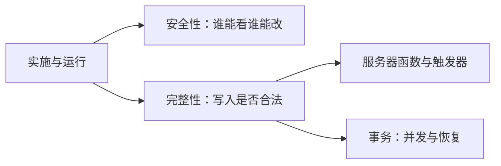
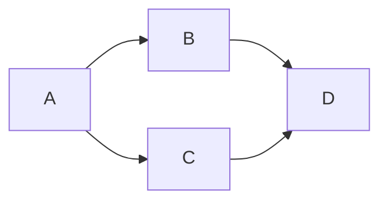
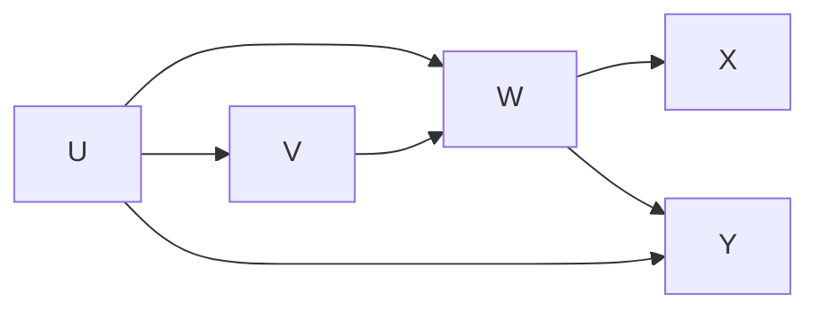
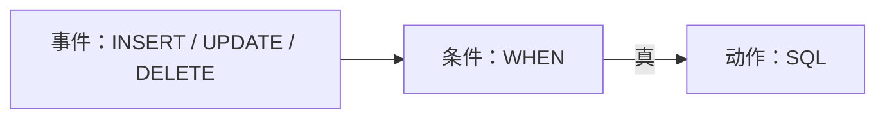
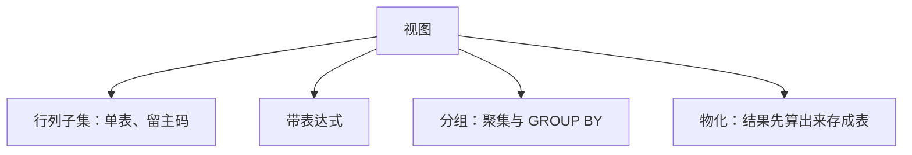

## 数据库安全性与完整性

[空间数据库](index.md) 栏目走到实施与运行维护：建表、导入、服务器编程、转储与恢复、权限、完整性、性能监督。本页覆盖其中两块。**安全性**回答谁能看见、谁能改。**完整性**回答写进去的值是否满足语义。并发控制与故障恢复见 [事务处理](12-transactions.md)。把业务判断写成服务器函数、以及 PostgreSQL 可执行的触发器，见 [服务器编程](11-server-programming.md)。应用层登录、会话与 RBAC 见 [身份认证与权限](../../../tech/identity-access.md)；本页落到 SQL 特权、约束、触发器与视图。

空间数据库等于对象关系数据库加空间扩展。矢量一侧已有几何类型、SRID、`ST_` 方法与 GiST。轨迹表上由车牌与时间决定位置的查询一旦对未授权角色开放 `SELECT`，泄露的是可还原的活动路径。授权、视图裁列、脱敏与境内存储是这个领域自己的约束。



掌握语义，具体系统查所用版本的官方文档。PostgreSQL 句法与 SQL 标准不一致处，本页逐条标明。真实系统里视图用得很多；触发器挂在每一次插入与更新上，会拖慢写入，相对少用。

## 安全性要挡住的两条路径

数据库系统常并提五条特性：数据独立性、数据安全性、数据完整性、并发控制、故障恢复。独立性在三级模式里用外模式／模式映象与模式／内模式映象已经交代。本页覆盖安全性与完整性。

安全性：数据会不会被不该看的人看见、会不会被不该改的人改掉。完整性：学号唯一、性别只取规定域、学生所在系必须是学校已开设的系。二者都要靠 DBMS 提供机制，应用层检查不能单独充当最终否决。

信息泄露有两条路径，地理空间库两条都会碰到。

1.  **经应用跳板。** 攻击者通过 B/S 应用，以 Web 服务器为跳板进入数据库。防火墙看见的是合法应用在连库，看不见拼接进语句的第二条 `UPDATE`。
2.  **内部接触。** 泄露常常发生在运维侧：直接接触磁盘、明文备份或导出文件。时空轨迹、测绘坐标一旦以 CSV / shapefile 离库，授权图不再约束它们。

## SQL 注入与预编译语句

**SQL 注入**（SQL injection）的本质：用户输入一旦进入语句结构，就会改变语句的语义。今日多数站点已做输入检查或改用绑定参数，原理仍要掌握。

???+ warning "仅供理解防护"
    下列写法只用来说明输入如何改写语义。

    生产环境禁止把用户输入拼进 SQL。

网站登录除账号、密码外还有一个公司名输入框。服务器把三个字符串拼进语句：

```sql
SELECT * FROM Table
WHERE Name = 'XX' AND Password = 'YY' AND Corp = 'ZZ';
```

账号和密码在网页端做了检查，公司名框未做同样约束。前两个框填什么都可以，只要第三个框让整个 `WHERE` 恒真。典型写法：先用单引号结束字符串，再写一个永真条件，再用 `--` 注释掉后面原作者写的引号：

```sql
SELECT * FROM Table
WHERE Name = 'SQL inject' AND Password = '' AND Corp = '' OR 1=1--';
```

`OR 1=1` 使条件恒真，查询返回整表，登录检查被绕过。

即便堵住注入，口令仍应散列存放、比较散列值；语句文本里不要出现明文口令。散列与加盐的实现细节不是本页范围。

把 `1=1` 改成 `1=(SELECT @@VERSION)` 一类表达式，类型转换失败时，错误信息会打印数据库产品与版本。知道产品之后，再对系统表做逐条查询，把库名、表名、列名套出来。PostgreSQL 的系统目录是 `pg_catalog` 下的 `pg_class`、`pg_namespace`、`pg_attribute` 等，以及标准的 `information_schema`；具体列名以所用版本的[官方文档](https://www.postgresql.org/docs/current/catalogs.html)为准。不要把 SQL Server 的 `sysobjects` / `sysdatabases` / `syscolumns` 照搬过来。探库依赖错误信息回显与系统表可被当前连接查询。防护从关闭详细错误回显、最小特权、禁止动态拼接三边做。

二次语句：导师姓名若直接拼进 SQL，输入里带分号即可结束第一条、在同一连接里执行第二条 `UPDATE`。防护从输入检查和最小特权两边做：这条连接只授 `SELECT` 时，即便拼接成功也改不成成绩。这把注入与下一节的授权连在一起。

`UNION` 套取：前半用恒假条件使原查询结果为空，后半把敏感列以原查询的列名返回。列数、类型要对得上，否则 `UNION` 本身失败。2005 年 CardSystems 支付处理公司的注入导致约 26.3 万个卡号被盗、约 4300 万个卡号暴露，卡号还是明文存的。

服务器端对策之一是**预编译语句**（prepared statements）。语句在服务器先编译，占位符处的用户输入只作为纯数据绑定，不再进入语法结构，不能被执行成第二条 SQL。

```sql
PREPARE login_plan (text, text, text) AS
SELECT * FROM Table
WHERE Name = $1 AND Password = $2 AND Corp = $3;

EXECUTE login_plan('SQL inject', '', ''' OR 1=1--');
```

第三个参数无论含有引号、分号还是 `OR 1=1`，都只是 `Corp` 列上的一个字符串，不会把 `WHERE` 改写成恒真。PostgreSQL 用 `$1, $2, …` 作占位符；部分嵌入式接口用 `?`。语义是语句与数据分离；驱动占位符写法以所用接口为准。

客户端检查可以被绕过：改请求、不用官方网页。预编译在服务器侧把结构钉死。二者应同时做：客户端减少明显非法输入，服务器保证语义不被改写。对账号、密码、公司名使用同一套白名单、长度、字符类约束，拒绝单引号、分号、注释符进入本应是字面量的位置。这只是辅助，不能代替预编译与最小特权。

## 时空数据上的最小特权

市面上的地理测绘往往经过偏移或加噪；若库里同时有高精度单点测绘和交通轨迹，就可以和公开地图对上，反推真实坐标。特殊单位在海量轨迹热力图上会呈现无人出入、无车经过的空洞，异常检测可以给出高概率位置。再叠人口流动、职住、通信等，会触及国家安全与个人隐私。

轨迹表上的 `SELECT` 一旦对未授权角色开放，交出的是可还原的活动路径。后面用视图裁列、用角色批量授权，都是在落实这一约束。公开地图精度、审图和涉密地理信息仍按测绘与地图管理规则；本页不替代资质成果。

## 存取控制

**存取控制**（access control）：授予某用户某种特权，使其以规定方式（读取、修改等）访问某些数据对象。数据库创建者拥有该库上的全部权限；其他用户必须被授权。

两个日常目标：

-   只让用户看见该看的数据，效果靠后面的视图落实
-   防止恶意用户修改，靠 `GRANT` / `REVOKE`

用户只能在授权数据上操作。表级不够时，用视图做行 / 列裁剪，再把视图上的 `SELECT` 授出去、基表本身不授。这是看见该看的在 SQL 里的标准做法。

### 权限粒度

权限可以细到表，也可以细到列：

-   `SELECT` 在关系 \(R\) 上，或只在 \(R(A_1,\ldots,A_n)\) 上
-   `INSERT` / `UPDATE` 同样可列级
-   `DELETE` 是表级：删的是整行，没有只删某一列

一句 SQL 往往同时需要多种特权。关系 \(R(A,B)\)、\(S(B,C)\)、\(T(A,C)\)，语句

```sql
UPDATE R
SET A = 10
WHERE B IN (SELECT C FROM S)
  AND NOT EXISTS (SELECT A FROM T WHERE T.A = R.A);
```

需要：

| 特权 | 理由 |
| --- | --- |
| `UPDATE` 在 \(R(A)\) 上 | `SET` 改 \(A\) |
| `SELECT` 在 \(R(A,B)\) 上 | `WHERE` 用到 \(B\)；相关子查询用到 \(R.A\) |
| `SELECT` 在 \(S(C)\) 上 | 子查询读 \(C\) |
| `SELECT` 在 \(T(A)\) 上 | `NOT EXISTS` 读 \(T.A\) |

缺任何一项，语句都不能执行。先列出语句读了哪些列、写了哪些列，再逐项给特权；不要只看最外层动词。

### GRANT 与传播权

```sql
GRANT <权限> [, <权限>] …
[ON <对象类型> <对象名>]
TO <用户> [, <用户>] …
[WITH GRANT OPTION];
```

把指定对象上的指定操作授给指定用户。对象可以是基本表或视图。`WITH GRANT OPTION` 表示被授权者可以把同一批权限再授给别人。没有该子句，被授权者自己可用，但不能往下传。

用户王平创建了学生表 \(S\)、课程表 \(C\)、选课表 \(\mathrm{SC}\)，自动拥有全部权限，含传播权。

```sql
GRANT INSERT, DELETE ON SC TO 李霞 WITH GRANT OPTION;
```

李霞因此既有 \(\mathrm{SC}\) 上的插入、删除，也可以继续传播。她再授给张建并带 `WITH GRANT OPTION`；张建再授给李丽时不带该子句，李丽不能再往下传。传播权与使用权是两件东西：李丽有 `INSERT`，但没有把 `INSERT` 再授出去的权利。

### REVOKE 的级联与限制

```sql
REVOKE <权限> [, <权限>] …
[ON <对象类型> <对象名>]
FROM <用户> [, <用户>] …
[CASCADE | RESTRICT];
```

与外码的 `ON DELETE CASCADE` / 拒绝删除是同一对思想、作用对象不同：外码作用在元组上，授权作用在特权边上。

-   **`CASCADE`（级联）**：收回 B 的权限时，B 授出去的权限以及再传下去的一并收回，除非该用户还从另一条仍然有效的授权路径持有同一权限。
-   **`RESTRICT`（限制）**：标准里常作默认。若这次收回会导致其他用户的权限跟着消失，则拒绝执行、报错；必须先让 B 把授出去的收回，再收 B。

```sql
REVOKE UPDATE(Sage) ON S FROM 王芳;
REVOKE INSERT ON SC FROM 李霞 CASCADE;
```

第二条在收回李霞的同时，自动收回张建和李丽对 \(\mathrm{SC}\) 的 `INSERT`：他们的权限都来自李霞这条链，没有别的来源。

### 授权图

判断一句 `REVOKE` 是否执行、执行后谁还剩权限，先画**授权图**（grant diagram）：节点是用户，有向边是谁授给谁，可标注是否带传播权。`RESTRICT` 的判别：删掉要收回的那条边之后，除被收回者本人外，其他人的权限是否改变。若只影响被收回者，语句可执行；若其下游会失去最后一条来源，则 `RESTRICT` 报错，必须改用 `CASCADE` 或先拆下游。

**例 1。** A 创建表 \(R\)，依次：

```text
A grant read(R) to B with grant option;
A grant read(R) to C with grant option;
B grant read(R) to D;
C grant read(R) to D;
A revokes read(R) from B restrict;
```



收回 A→B 之后，D 仍从 C 持有 `read`，D 的权限不变，故 `RESTRICT` 不报错。若没有 C 授给 D 那条边，收回 B 会使 D 失去读权限，同一句 `RESTRICT` 就会失败。

**例 2。** 用户 U 创建表 \(T\)，依次：

```text
U: GRANT SELECT ON T TO V, W WITH GRANT OPTION;
V: GRANT SELECT ON T TO W;
W: GRANT SELECT ON T TO X, Y;
U: GRANT SELECT ON T TO Y;
U: REVOKE SELECT ON T FROM V RESTRICT;
U: REVOKE SELECT ON T FROM W CASCADE;
```



-   从 V 收回且 `RESTRICT`：可以执行。W 仍直接从 U 获得 `SELECT`，X、Y 不受影响。V 失去 `SELECT`。
-   再从 W 收回且 `CASCADE`：W 失去 `SELECT`，其授出的 X 失去来源；Y 仍有 U→Y，Y 保留 `SELECT`。

判别步骤：先画边；`RESTRICT` 只允许除被收回者外无人掉权；`CASCADE` 沿授出路径回收，但另一来源仍在的用户保留权限。不要把外码的级联删除和授权的级联收回当成对象也相同。

### 系统特权、对象特权与角色

**特权**是执行一种特殊类型的 SQL 语句、或存取另一用户对象的权力。分两类。

**系统特权。** 执行某类特殊动作，或在某类对象类型上执行特殊动作的权利。通常授给 DBA 和应用开发者，可授给用户或角色。例如：`CREATE TABLE`、创建触发器、在模式里建索引。索引、触发器往往没有单独的对象特权，由系统特权控制。对象特权不落到单棵 B+ 树上，因此没有 `GRANT SELECT ON INDEX …` 这一套；产品若另有语法，以文档为准。

**对象特权。** 在指定的表、视图、存储过程、函数上执行特殊动作的权利。不同类型的对象有不同类型的对象特权。对象创建者拥有该对象全部对象特权，并可带 `GRANT OPTION` 再授出。被授权者若含 `GRANT OPTION`，也可再授权给其他人。

**角色**（role）是一组权限的集合。学校有上万学生时，不会对每个学号写一条 `GRANT`，而是定义学生角色，把权限授给角色，再把学生放进该角色。课程表只读授给学生，成绩录入授给任课教师，改一次角色定义即可，不必改上万条边。应用层角色模型见 [身份认证与权限](../../../tech/identity-access.md)；本页的角色是 DBMS 里的权限包。

### PostgreSQL 与 SQL 标准的差异：授权

SQL 标准给出授权骨架。PostgreSQL 在本栏目实践栈上有几处必须分开：

1.  **对象类型要写出来。** 标准例子常写 `GRANT INSERT, DELETE ON SC TO 李霞`。PostgreSQL 习惯写成 `GRANT INSERT, DELETE ON TABLE sc TO lixia;`（视图则 `ON TABLE` 或 `ON VIEW`，函数是 `ON FUNCTION`）。省略 `TABLE` 时，PostgreSQL 仍把 `ON sc` 当成表 / 视图，但函数、序列、模式必须写明对象类型。见 [GRANT](https://www.postgresql.org/docs/current/sql-grant.html)。
2.  **角色是一等公民。** PostgreSQL 把登录用户也做成 role（带 `LOGIN` 的角色）。`CREATE USER` 是 `CREATE ROLE … LOGIN` 的别名。`GRANT 角色 TO 用户` 与 `GRANT 特权 ON 对象 TO 角色` 是两层：先把特权打成角色，再把人放进角色。
3.  **`PUBLIC`。** 未显式授权时，部分对象对 `PUBLIC` 仍有缺省特权。历史原因下，新库里表的 `PUBLIC` 特权已被收紧。不要假设没 `GRANT` 就一定谁都看不见，以当前库的 `\dp` / `information_schema` 为准。
4.  **`REVOKE … RESTRICT / CASCADE` 的默认。** 标准强调 `RESTRICT` 为默认、会因下游掉权而报错。PostgreSQL 的 `REVOKE` 对普通对象特权默认按收回这一条处理；涉及 `GRANT OPTION` 时才用 `CASCADE` / `RESTRICT` 决定是否连带收回下游的传播权。画授权图、写 `CASCADE` / `RESTRICT` 语义，以标准与上面两例为准；在 psql 里按其版本的 [REVOKE](https://www.postgresql.org/docs/current/sql-revoke.html) 文档核对，不要把标准里的 `RESTRICT` 报错预期原样套过去。
5.  **列级 `GRANT`。** PostgreSQL 支持 `GRANT SELECT (col1, col2) ON TABLE t TO …`，与列级特权一致。`DELETE` 仍是表级。
6.  **预编译。** `PREPARE` / `EXECUTE` / `DEALLOCATE` 是会话级；应用里更常见的是驱动的参数绑定。语义相同：结构先编译，数据后绑定。见 [PREPARE](https://www.postgresql.org/docs/current/sql-prepare.html)。

## 完整性约束

完整性指数据的正确性、有效性、相容性，防止错误数据进入数据库。学号必须唯一；性别只能是男或女；学生所在系必须是学校已开设的系。DBMS 必须提供检查机制。这些条件称为**完整性约束**，用 DDL 写在 `CREATE TABLE` 里，也可用 `ALTER TABLE` 添加、`DROP` 删除，作为模式的一部分存入数据字典。建表句法与参照策略见 [SQL](03-sql.md)；本页补检查时机、失败处理，以及触发器与视图。

检查时机分两类：

-   **立即执行的约束**（immediate）：一条语句做完，或每一行改完，立刻检查
-   **延迟执行的约束**（deferred）：等到整个事务结束再检查。从文件导入一万名学生，是每插一行查一次，还是全部导完再查，结果可以不同。延迟与提交的关系见 [事务处理](12-transactions.md)

静态完整性约束限制的是允许出现哪些数据库状态，超出类型和表结构本身。用途包括：挡住录入错误、保证更新后仍正确、强制一致性、以及把数据性质告诉优化器。主码唯一时，优化器可以按最多一行估计选择率。动态的那一半是触发器：监视改变，条件满足就执行动作。

### 实体、参照与用户定义

| 名称 | 典型 SQL | 含义 |
| --- | --- | --- |
| 实体完整性 | `PRIMARY KEY` | 主码非空且唯一 |
| 参照完整性 | `FOREIGN KEY … REFERENCES` | 外码取值要么空，要么在被参照列中存在 |
| 用户定义完整性 | `NOT NULL`、`UNIQUE`、列级 / 元组级 `CHECK`、一般断言 `ASSERTION` | 域、列组合、跨表断言 |

主码至多一个，`UNIQUE` 可以多个；复合主码 / 外码必须表级。`CHECK` 在标准里很强，PostgreSQL 不允许 `CHECK` 含子查询，参照完整性应写 `FOREIGN KEY`，不要用 `CHECK (sID IN (SELECT …))` 替代。

实际项目里不宜定义过多完整性约束：约束在每次写入时都要检查，过严会拖慢导入与更新，也有些规则用触发器或应用层更好表达。物理设计里导入前去掉主码和外码、导入后再加，可以提高导入效率。模式验收仍要求会写主码、外码、`CHECK`。

### 立即检查与延迟检查

同一组更新，检查粒度不同，结果可以相反。

```sql
CREATE TABLE T (A INT PRIMARY KEY);
INSERT INTO T VALUES (123);
INSERT INTO T VALUES (234);
UPDATE T SET A = A - 111;
UPDATE T SET A = A + 111;
```

`PRIMARY KEY` 下，使主码为 `NULL` 或不唯一的操作会被拒绝。若两条 `UPDATE` 作为整体、在语句结束时再检查：\(123\mapsto 12\)、\(234\mapsto 123\) 之后主码仍唯一，再 \(+111\) 变回 \(123,234\)，延迟检查则两句都成功。若每改一行立刻检查：先把 123 加 111 变成 234，与已有的 234 冲突，该行被拒绝，整句做不成。这为后面行级触发器与语句级触发器做了铺垫。

外码三种策略（`RESTRICT` / `CASCADE` / `SET NULL`）在 [SQL](03-sql.md) 已经写过。授权收回的 `CASCADE` / `RESTRICT` 与外码的 `CASCADE` / `RESTRICT` 思想成对、对象不同。用触发器可以实现级联删除、级联更新，也可以实现拒绝与置空。

### PostgreSQL 与 SQL 标准的差异：约束

外码可声明为 `DEFERRABLE`，再用 `SET CONSTRAINTS … DEFERRED` 把检查推迟到事务提交；未声明 `DEFERRABLE` 的约束不能推迟。主码 / `UNIQUE` 在 PostgreSQL 里通常立即检查。导入大批量数据时，实务上更常见的是临时关掉触发器、或导入后再 `ADD CONSTRAINT`。立即 / 延迟语义以上面这组 `UPDATE` 为准。约束细节见 [DDL Constraints](https://www.postgresql.org/docs/current/ddl-constraints.html)。

## 标准 SQL 触发器

触发器（trigger）是一类特殊过程：规定用户对表做 `INSERT` / `UPDATE` / `DELETE` 时，系统应执行哪些相关操作以保证完整性。各 DBMS 实现差别很大；PostgreSQL 是函数加触发器，标准 SQL 那一套原文贴进去会报错。本页先写**标准写法**。函数体、`NEW` / `OLD` 记录变量、`EXECUTE FUNCTION` 留到 [服务器编程](11-server-programming.md)。

本质是事件–条件–动作规则（Event-Condition-Action，ECA）：事件发生时检查条件，条件为真则执行动作。



### 事件、条件、动作

同一库可能被 iOS 客户端、安卓客户端、网页同时访问。若插入前 \(A\) 必须大于 10 写在三个应用里，规则改成大于 20 就要改三处、发三个版本；漏改一处，有的端写入成功、有的端报错，未升级的用户仍按旧阈值写入。放到数据库后只改一处，客户端不必发版。第二个目的是表达更复杂的约束：主码、外码、`CHECK` 写不了的修复逻辑（级联删除、写审计表、补行）用触发器完成。

代价：每次插入都走触发器，写入会变慢。链式、自触发、成环会让一次 `INSERT` 变成难以预料的一串写入。真实应用里视图用得很多，触发器相对少。

### 标准句法与过渡变量

```sql
CREATE TRIGGER name
BEFORE | AFTER | INSTEAD OF events
[REFERENCING 变量]
[FOR EACH ROW]
WHEN (condition)
action;
```

**事件。** `INSERT ON T` 只有新行；`DELETE ON T` 只有旧行；`UPDATE [OF C1,…,Cn] ON T` 旧行与新行都有。`OF` 列出列时，只有这些列被改才触发。

**粒度。** `FOR EACH ROW`：每修改一个元组触发一次，称为行级（tuple / row level）。省略则为语句级（statement level）：整句执行前或执行后触发一次。

**过渡变量（SQL 标准）。**

| 变量 | 适用 |
| --- | --- |
| `OLD ROW` | 行级；删除或更新前的那一行 |
| `NEW ROW` | 行级；插入或更新后的那一行 |
| `OLD TABLE` | 语句级；本句删除或更新前的那些行 |
| `NEW TABLE` | 语句级；本句插入或更新后的那些行 |

`NEW` / `OLD` 行变量只在行级有意义。语句级一次可能改多行，要用过渡表。条件类似 `WHERE`；动作是 SQL 语句。`WHEN` 为假时动作根本不进；条件也可以写在动作的 `IF` 里，语义不完全相同。

三个时间关键字：

-   **`BEFORE`**：在基表动作之前执行，可拦插入
-   **`AFTER`**：动作完成后再执行
-   **`INSTEAD OF`**：替换原动作。原 `INSERT` / `UPDATE` / `DELETE` 并不真正落到基表上，只执行触发器体。替换是后面视图更新的主要手段。用在普通表上时要非常小心：表内容可能完全不变

### 用触发器实现参照动作

\(R.A\) 参照 \(S.B\)，\(S\) 上删除则 \(R\) 上对应行级联删除。行级写法：

```sql
CREATE TRIGGER Trigger1
AFTER DELETE ON S
REFERENCING OLD ROW AS O
FOR EACH ROW
DELETE FROM R WHERE A = O.B;
```

有 `FOR EACH ROW`，是行级：一句 `DELETE` 若删多行，每行调用一次。没有 `WHEN` 即无额外条件。

同一语义的语句级写法：

```sql
CREATE TRIGGER Trigger2
AFTER DELETE ON S
REFERENCING OLD TABLE AS OT
DELETE FROM R WHERE A IN (SELECT B FROM OT);
```

不能写 `FOR EACH ROW`。被删的多行都在过渡表 `OT` 里，一条 `IN` 子查询处理整句。行级与语句级在删一行时结果相同；删多行时，行级触发 \(n\) 次、语句级触发 1 次，中间表状态不同，若动作里有聚集就会分叉。

行级级联更新：学号改了，选课记录里的学号一起改。更新既有旧行也有新行：

```sql
CREATE TRIGGER Trigger3
AFTER UPDATE OF B ON S
REFERENCING OLD ROW AS O, NEW ROW AS N
FOR EACH ROW
UPDATE R SET A = N.B WHERE A = O.B;
```

外码修改的其它策略同样可以用触发器写。拒绝：在 `BEFORE UPDATE` 里发现仍有参照则报错。置空：`UPDATE R SET A = NULL WHERE A = O.B`。

### 插入前拦截

```sql
CREATE TRIGGER Trigger4
BEFORE INSERT ON R
REFERENCING NEW ROW AS N
FOR EACH ROW
WHEN EXISTS (SELECT * FROM R WHERE A = N.A)
SELECT RAISE(IGNORE);   -- SQLite 中断插入的写法
```

在真正插入之前看新行的主码是否已存在；存在则报错，该插入不生效。主码约束本来系统就会查，此例展示 `BEFORE` + `WHEN` + 报错的模式。`RAISE(IGNORE)` 是 SQLite 的中断写法。PostgreSQL 在函数体里用 `RAISE EXCEPTION`，见 [服务器编程](11-server-programming.md)。

### 自触发与链式调用

关系 \(T(A)\)：

```sql
CREATE TRIGGER Trigger5
AFTER INSERT ON T
REFERENCING NEW ROW AS N
FOR EACH ROW
WHEN (SELECT COUNT(*) FROM T) < 100
INSERT INTO T VALUES (N.A + 1);

INSERT INTO T VALUES (1);
```

插入 1 之后触发器再插 2，再触发插 3，直到行数达到 100，`WHEN` 不再成立。触发器触发自己。语义上这是链式调用（chaining）的极端情形。可能成环、可能嵌套很深，这是触发器要慎用的原因之一。

关系 \(R(a,b)\)，行级 `AFTER INSERT` 触发器：当 `new.a * new.b > 10` 时再插入 `(new.a - 1, new.b + 1)`。\(R\) 初始为空。必须按 `AFTER` 算链：原插入会发生，然后再链式插入。

-   插入 \((2,10)\)：\(2\times 10=20>10\)，再插 \((1,11)\)；\(1\times 11=11>10\)，再插 \((0,12)\)；\(0\times 12=0\not>10\)，停止。正好三行。
-   插入 \((3,9)\)：先有 \((3,9)\)，再进入与上一支相同的链，共四行。
-   插入 \((11,1)\)：积一直大于 10，直到落到 \((2,10)\) 那条链上，远多于三行。
-   插入 \((5,4)\)：\(20>10\to(4,5)\to(3,6)\to(2,7)\to(1,8)\)，\(1\times 8=8\not>10\)，五行。

若误按 `INSTEAD OF` 理解，会把原元组丢掉，链的长度全错。

### BEFORE、AFTER 与 INSTEAD OF

\(T_1(A)\)、\(T_2(A)\)。\(T_1\) 里先有四个 1。触发器：

```sql
CREATE TRIGGER Trigger6
AFTER INSERT ON T1
REFERENCING NEW ROW AS N
FOR EACH ROW
INSERT INTO T2 SELECT AVG(A) FROM T1;
```

然后执行

```sql
INSERT INTO T1 SELECT A + 1 FROM T1;
```

这是行级，四个 1 会变成四个再插一个 2 的事件，每插一个 2 就立即算一次 \(T_1\) 的平均值写入 \(T_2\)。

-   **`AFTER`**：第一个 2 已经进表后再算平均：四个 1 加一个 2，共 5 行，\(\mathrm{avg}=(4+2)/5\)；第二个 2 进表后 6 行，\(\mathrm{avg}=(4+2+2)/6\)；第三、四个 2 同理。结束时 \(T_1\) 为四个 1 与四个 2，\(T_2\) 有四个不同的平均值。
-   **`BEFORE`**：在该行插入之前算平均。插第一个 2 之前表里仍是四个 1，平均为 1；插第二个 2 之前已有一个 2，平均为 \((4+2)/5\)。同一行尚未进表，平均数与 `AFTER` 不同。
-   **`INSTEAD OF`**：四个 2 并不真正插入 \(T_1\)，每次只用触发器体去插平均值。\(T_1\) 仍是四个 1，每次平均都是 1，\(T_2\) 得到四个 1。原插入被完全替换。

`INSTEAD OF` 不会执行原来的插入 / 删除 / 更新。把上例的 `AFTER` 改成 `INSTEAD OF` 后 \(T_1\) 不变。

### 审计

谁改了工资、改前改后是多少，写到另一张表，便于事后追查。

```sql
CREATE TABLE Employee (
  Name      CHAR(15) PRIMARY KEY,
  Deptid    INTEGER,
  Salary    DECIMAL(10, 2),
  Job_Title CHAR(15)
);

CREATE TABLE Salarylog (
  UserName  CHAR(30) PRIMARY KEY,
  EmpName   CHAR(30),
  OldSalary DECIMAL(10, 2),
  NewSalary DECIMAL(10, 2)
);

CREATE TRIGGER RaiseTrig
AFTER UPDATE OF (Salary) ON Employee
REFERENCING OLD ROW AS OldRow, NEW ROW AS NewRow
FOR EACH ROW
WHEN ((NewRow.Salary - OldRow.Salary) / OldRow.Salary > 0.1)
INSERT INTO SalaryLog
VALUES (USER, NewRow.Name, OldRow.Salary, NewRow.Salary);
```

`USER` 是当前数据库登录名。只在涨幅大于 10% 时记日志；小幅调整不写。这是行级、`AFTER UPDATE OF Salary`。空间库里的同类需求：轨迹点被改、测绘坐标被替换时写审计表。事件换成 `UPDATE OF geom`，动作仍是插日志，不要在触发器里做重计算。

### 删除触发器与产品差异

同一事件上可以挂多个触发器；一个触发器的动作可以激活另一个（链式），也可以自触发。删除：

```sql
DROP TRIGGER R1;
```

标准往往还要求给出所在表（`DROP TRIGGER R1 ON T`）。以所用系统为准。

| 系统 | 要点 |
| --- | --- |
| PostgreSQL | 行级 + 语句级；有新旧行与新旧表；句法是函数加触发器 |
| SQLite | 仅行级、立即激活；无新旧表 |
| MySQL | 仅行级、立即激活；同一事件类型往往只能一个触发器；链式有限 |
| SQL Server | 有自己的 `inserted` / `deleted` 表；语法不同 |

### PostgreSQL 与 SQL 标准的差异：触发器

标准写法用 `REFERENCING OLD ROW AS …` 直接跟一条 SQL 作动作。PostgreSQL 不能这样写，必须拆成两步：

1.  先写一个返回类型为 `TRIGGER` 的函数。函数体、`NEW` / `OLD` 记录变量、`TG_OP` 等属于 [服务器编程](11-server-programming.md)
2.  再 `CREATE TRIGGER … EXECUTE FUNCTION 函数名();`。旧文档写 `EXECUTE PROCEDURE`，现版本推荐 `FUNCTION`

过渡变量在行级触发器函数里直接用 `NEW`、`OLD` 记录；语句级用过渡表时走 `REFERENCING OLD TABLE AS …` 的 PostgreSQL 扩展（版本需支持）。`INSTEAD OF` 在 PostgreSQL 里主要用于视图，普通表上的替换语义不要按标准原文直接套。`WHEN` 条件 PostgreSQL 支持，但写在 `CREATE TRIGGER` 上，不写在函数签名里。见 [CREATE TRIGGER](https://www.postgresql.org/docs/current/sql-createtrigger.html)。

???+ note "标准句法与 PostgreSQL 落地"
    本页写标准 `CREATE TRIGGER` 骨架，覆盖 ECA、行级与语句级、三个时间关键字。

    函数返回 `TRIGGER` 再 `CREATE TRIGGER` 的写法见 [服务器编程](11-server-programming.md)。

## 视图

视图对应三级模式里的**外模式**：不同用户看到不同数据。作用：对部分用户隐藏列或行；让常用的复杂查询写起来像一张表；模块化访问。真实系统里视图非常多。

视图是虚表，从一个或几个基本表（或视图）导出，只存定义、不存数据，因此没有那一份冗余。基表变了，通过视图看到的结果跟着变。四点展开：

1.  简化操作
2.  同一数据的多种角度
3.  重构基表时提供一定的逻辑独立性：模式变了，外模式上的程序可以不改
4.  对机密数据做安全保护：用户甚至不知道某列的存在

与物理独立性对照：内模式与模式之间是物理独立；模式与外模式之间是逻辑独立。把某列从基表拆到另一张表时，只要视图定义改成连接，应用程序仍 `SELECT` 原来的视图列名。安全性上：不授基表 `SELECT`，只授视图上裁过的列，比列级 `GRANT` 更适合行谓词加列裁剪同时做。

### 创建、检查选项与删除

```sql
CREATE VIEW <视图名> [(<列名> [, <列名>] …)]
AS <子查询>
[WITH CHECK OPTION];
```

子查询可以很复杂，但通常不含 `ORDER BY` 和 `DISTINCT`。`WITH CHECK OPTION` 表示：通过该视图做更新、插入、删除时，结果行必须仍满足视图定义里 `WHERE` 的条件。

视图可以建在单表、多表、其它视图、或表与视图的混合之上。列名要么全部省略、要么全部指定，没有第三种。必须显式命名的三种情形：目标列是聚集或表达式；多表连接选出了同名列；需要换一个更合适的名字。一律全部指定，不要省略、不要 `SELECT *`。

```sql
CREATE VIEW F_S1(stdnum, name, sex, age, dept)
AS SELECT * FROM S WHERE Ssex = '女';
```

基表 \(S\) 一旦加列，视图五列与基表六列对不上，映像被破坏。这违背的是逻辑独立性。`SELECT *` 定义的视图会把列集合钉死，基表加列后视图与基表列数对不上。

计算机系学生视图：

```sql
CREATE VIEW CS_S AS
SELECT Sno, Sname, Sage FROM S
WHERE Sdept = 'CS'
WITH CHECK OPTION;
```

此后经该视图的修改、删除，系统自动加上 `Sdept = 'CS'`；插入时检查 `Sdept` 是否为 `'CS'`，不是则拒绝；若插入未提供 `Sdept`，则自动填 `'CS'`。没有 `WITH CHECK OPTION` 时，经视图插入一个外系学生，插入可能成功，但再查该视图看不见这行：行落在视图谓词之外，这正是检查选项要挡住的。

```sql
DROP VIEW <视图名>;
```

只删数据字典里的定义。由该视图导出的其它视图定义还在，但已不能用，必须显式再删。删基表时，其上视图也要显式删除，不会总是级联干净。`DROP TABLE` 带走数据与索引，视图定义可能残留。

### 四类视图



**行列子集视图。** 从单表导出，去掉一些行和列，但保留主码。例如计算机系学生：

```sql
CREATE VIEW S_CS AS
SELECT Sno, Sname, Sage FROM S
WHERE Sdept = 'CS';
```

保留主码是后面可更新的前提之一：没有主码，改哪一行对不上基表。

**带表达式的视图。** 基表为减少冗余只存基本数据（如出生年份），派生量（年龄）不存。视图不存数据，可以加虚拟列：

```sql
CREATE VIEW S_age(Sno, Sname, Sage) AS
SELECT Sno, Sname, 2025 - Sbirth FROM S;
```

`Sage` 是算出来的，基表没有这一列。对 `Sage` 做 `UPDATE` 无法唯一、有意义地写回 `Sbirth`（同年不同日、闰年等还没算），因此带表达式的视图一般不可自动更新。

**分组视图。** 定义中含聚集与 `GROUP BY`。例如学号及其平均成绩：

```sql
CREATE VIEW S_G(Sno, Gavg) AS
SELECT Sno, AVG(Grade) FROM SC GROUP BY Sno;
```

基表里并没有平均成绩这一列。

**物化视图**（materialized view）。前面三类都是虚的；若查询很重、结果又反复被用，可以把视图结果先算出来存成表。定义仍是那条查询，只是前面加上 `MATERIALIZED`：

```sql
CREATE MATERIALIZED VIEW Student_Course AS
SELECT S.Sno AS Sno, Sname, C.Cno AS Cno, Cname, grade
FROM S, C, SC
WHERE S.Sno = SC.Sno AND C.Cno = SC.Cno;
```

对物化视图的查询像读一张表，复杂连接不必每次重做。代价：结果可能很大；基表一改，物化结果作废，要重算或增量维护。对物化视图本身的修改等于改那张存好的表，但基表必须保持同步。虚拟视图的更新难题在这里同样存在。

物化视图与索引对照：二者都提高查询效率，都降低修改效率。插入、更新、删除都要维护附属结构。SQL Server 用普通视图加聚集索引实现索引视图（indexed view）；PostgreSQL 有独立的 `CREATE MATERIALIZED VIEW`。何时物化：查询复杂、数据量大、读多写少。查询简单或数据很小则不必。优化器可以像选索引一样，决定某条基表查询是否改写为走物化视图。维护策略有全量重算与增量维护，权衡的是查询加速与更新代价，还取决于数据量、视图复杂度、使用该视图的查询次数、影响该视图的修改次数。索引侧的对照见 [空间存储与索引](07-storage-and-index.md)。

### 基于视图的查询改写

对用户，查视图与查表相同：

```sql
SELECT Sno, Sage FROM S_CS WHERE Sage < 19;
```

系统先展开定义为

```sql
SELECT Sno, Sage FROM S
WHERE Sdept = 'CS' AND Sage < 19;
```

非分组属性的额外条件直接放进 `WHERE`。分组视图不行。查平均成绩 ≥ 90：

```sql
SELECT * FROM S_G WHERE Gavg >= 90;
```

若机械地改成

```sql
SELECT Sno, AVG(Grade) FROM SC
WHERE AVG(Grade) >= 90
GROUP BY Sno;   -- 错误
```

聚集不能出现在 `WHERE` 里。正确是分组之后用 `HAVING`：

```sql
SELECT Sno, AVG(Grade) FROM SC
GROUP BY Sno
HAVING AVG(Grade) >= 90;
```

视图查询最终都变成对基表的查询；分组属性或聚集上的条件要放到 `HAVING`，否则语义错误。用关系代数写：\(S_G=\gamma_{\mathrm{Sno},\mathrm{AVG}(\mathrm{Grade})}(\mathrm{SC})\)，用户写在视图上的 `WHERE Gavg ≥ 90` 对应聚集之后的选择，只能落成 `HAVING`。

### 更新：替换触发器与可更新标准

通过视图做插入、删除、修改，因为不存数据，必须变成对基表的更新。简单行列子集可以一一对应，例如把 `S_CS` 里学号 `2000012` 的姓名改为李大勇，展开为对 \(S\) 的 `UPDATE`，并保留 `Sdept = 'CS'`。分组视图上的

```sql
UPDATE S_G SET Gavg = 90 WHERE Sno = '2000012';
```

无法唯一、有意义地变成对 \(\mathrm{SC}\) 的更新：平均分是算出来的，基表没有这一列。

两类解决办法。

**由视图定义者用 `INSTEAD OF` 触发器显式规定改写。** 处理任意复杂视图；不保证改写正确或符合所有人的直觉，语义完全取决于应用。缺点是要写对很多代码。

数学课成绩视图（学号、姓名来自学生，成绩来自选课，课程号固定为 `'C02'`）：

```sql
CREATE VIEW MathGrade(Sno, Sname, Grade) AS
SELECT S.Sno, Sname, Grade
FROM S, SC
WHERE S.Sno = SC.Sno AND SC.Cno = 'C02';
```

删除一行：语义上是删这门课的选课记录，不是删学生。

```sql
CREATE TRIGGER MathGradeDelete
INSTEAD OF DELETE ON MathGrade
REFERENCING OLD ROW AS O
FOR EACH ROW
DELETE FROM SC WHERE Sno = O.Sno AND Cno = 'C02';
```

更新姓名：改的是学生表。

```sql
CREATE TRIGGER MathGradeUpdate
INSTEAD OF UPDATE OF Sname ON MathGrade
REFERENCING OLD ROW AS O, NEW ROW AS N
FOR EACH ROW
UPDATE S SET Sname = N.Sname WHERE Sno = O.Sno;
```

插入有两种都合理的语义：只向 \(\mathrm{SC}\) 插 \((\mathrm{Sno},\,\texttt{'C02'},\,\mathrm{Grade})\)；或学生表与选课表各插一行。两种都可以，取决于产品要的业务含义。`INSTEAD OF` 在 SQLite 可用；PostgreSQL 要用它自己的规则 / 触发器句法，仍是函数加触发器，见 [服务器编程](11-server-programming.md)；MySQL 对基于规则的视图修改支持弱。

**限制视图足够简单，让系统自动翻译（SQL 标准可更新视图）。** 用户不用写触发器；限制很严，不满足就只能走第一种。SQL 标准要求大致四条：

1.  `SELECT` 在单个表 \(T\) 上，且无 `DISTINCT`
2.  不在视图中的属性可以为 `NULL` 或有默认值
3.  子查询不得再引用 \(T\)
4.  无 `GROUP BY`、无聚集

再加上 `WITH CHECK OPTION`。行列子集视图、保留主码、无表达式，才有希望走自动翻译。带表达式、分组、多表连接，默认不可更新。

### PostgreSQL 与 SQL 标准的差异：视图

`CREATE MATERIALIZED VIEW` 默认创建后立即填充；之后基表改了不会自动刷新，需要 `REFRESH MATERIALIZED VIEW [CONCURRENTLY] 名;`。`CONCURRENTLY` 要求其上有唯一索引，刷新期间仍可被查。不要假设物化视图永远与基表一致。改完基表必须显式刷新，再谈结果是否跟上。见 [CREATE MATERIALIZED VIEW](https://www.postgresql.org/docs/current/sql-creatematerializedview.html)。

PostgreSQL 可更新视图条件（摘官方文档，以所用版本为准）：

-   `FROM` 恰好一项，且是表或另一个可更新视图
-   顶层无 `WITH` / `DISTINCT` / `GROUP BY` / `HAVING` / `LIMIT` / `OFFSET`
-   顶层无集合运算（`UNION` / `INTERSECT` / `EXCEPT`）
-   选择列表都是对底层关系列的简单引用，不能是表达式、常量或函数，也不能引用系统列
-   底层关系的同一列不能在选择列表里出现两次
-   视图不得带 `security_barrier` 属性

见 [CREATE VIEW：Updatable Views](https://www.postgresql.org/docs/current/sql-createview.html)。SQL Server 另有一套：修改只能引用一个基表的列、不能是聚集或计算列、不受 `GROUP BY` / `HAVING` / `DISTINCT` 影响、`TOP` 不能与 `WITH CHECK OPTION` 同用等。真正复杂的更新自己写 `INSTEAD OF`；想让系统代劳，先核对该产品的可更新视图清单，不满足就会在插入、更新时报错。

## 收束

设计六阶段进入实施与运行维护。本页：安全性（谁能看、谁能改）与完整性（写进去是否合法）。事务在 [事务处理](12-transactions.md)；PostgreSQL 函数体与可执行触发器在 [服务器编程](11-server-programming.md)。

-   信息泄露：应用跳板与内部接触。SQL 注入等于输入进入语法。防护是预编译 / 绑定参数、最小特权、关闭详细错误回显。口令不要明文比较。时空轨迹叠加高精度测绘会触及国家安全。
-   存取控制：创建者拥有全部权限。`SELECT` / `INSERT` / `UPDATE` 可列级，`DELETE` 表级。`WITH GRANT OPTION` 是传播权。`REVOKE CASCADE` 沿授权边回收，另有来源则保留；`RESTRICT` 若会改变他人权限则拒绝。先画授权图。系统特权管类级动作；对象特权落在表、视图、例程；角色把权限打包。
-   PostgreSQL 授权：角色一等公民；对象类型要写明；`REVOKE` 的 `RESTRICT` 报错预期以标准为准、以所用版本文档核对；预编译用 `$n` 或驱动绑定。
-   静态完整性：实体 / 参照 / 用户定义。立即检查与延迟到事务结束。PostgreSQL 的 `CHECK` 不许子查询；外码可 `DEFERRABLE`。授权 `CASCADE` 与外码 `CASCADE` 思想成对、对象不同。
-   触发器等于 ECA。行级 `FOR EACH ROW`（`OLD` / `NEW ROW`）；语句级用过渡表（`OLD` / `NEW TABLE`）。`BEFORE` 可拦；`AFTER` 在基表动作之后；`INSTEAD OF` 替换原 DML。链式与自触发是慎用的原因。标准句法本页写；PostgreSQL 必须函数加 `EXECUTE FUNCTION`。
-   视图等于外模式等于虚表（物化除外）。四类：行列子集、带表达式、分组、物化。不要 `SELECT *`。`WITH CHECK OPTION` 把更新锁在视图谓词内。查询展开：非分组条件进 `WHERE`，聚集条件进 `HAVING`。更新两条路：`INSTEAD OF`，或满足可更新标准。PostgreSQL 物化视图需 `REFRESH`；可更新条件比标准更细。
-   工程判断：多视图、少触发器。物化视图像索引：读快写慢。

外模式在三级模式里先指认视图，并区分逻辑独立性与物理独立性。本页把外模式落成 `CREATE VIEW`：`SELECT *` 破坏逻辑独立性；`WITH CHECK OPTION` 保证经视图的更新不逃出外模式谓词；不授基表、只授视图，是外模式级的存取控制。基本表有存储；查询表是结果；视图是虚表；物化视图定义上仍是一条查询，存储上接近带维护代价的基本表。

## 相关阅读

-   [空间数据库](index.md)
-   [SQL](03-sql.md)
-   [空间存储与索引](07-storage-and-index.md)
-   [服务器编程](11-server-programming.md)
-   [事务处理](12-transactions.md)
-   [身份认证与权限](../../../tech/identity-access.md)
-   [数据库与数据存储](../../../tech/databases.md)

## 来源说明

本页根据 Silberschatz、Korth 与 Sudarshan《Database System Concepts》第七版第 4.2、4.4、4.6、5.3、13.5 节整理，并对照空间数据库课程中的安全性与完整性讲义、程昌秀《空间数据库管理系统概论》以及 PostgreSQL 官方文档中的授权、约束、触发器与视图命令。函数体与 PostgreSQL 可执行触发器句法不在本页展开，见 [服务器编程](11-server-programming.md)。函数名、`REVOKE` 默认行为、可更新视图清单与物化刷新以所安装版本为准。

-   Abraham Silberschatz, Henry F. Korth, S. Sudarshan, *Database System Concepts*, 7th ed., McGraw-Hill, 2020。重点参见授权、完整性约束、触发器与视图各节。
-   程昌秀，《空间数据库管理系统概论》，科学出版社。对照空间库实施与运行维护中的安全性、完整性控制。
-   [PostgreSQL GRANT](https://www.postgresql.org/docs/current/sql-grant.html)、[REVOKE](https://www.postgresql.org/docs/current/sql-revoke.html)、[Privileges](https://www.postgresql.org/docs/current/ddl-priv.html)。访问日期：2026-09-04。
-   [PostgreSQL PREPARE](https://www.postgresql.org/docs/current/sql-prepare.html)。访问日期：2026-09-04。
-   [PostgreSQL Constraints](https://www.postgresql.org/docs/current/ddl-constraints.html)。访问日期：2026-09-04。
-   [PostgreSQL CREATE TRIGGER](https://www.postgresql.org/docs/current/sql-createtrigger.html)。访问日期：2026-09-04。
-   [PostgreSQL CREATE VIEW](https://www.postgresql.org/docs/current/sql-createview.html)（含 Updatable Views）、[CREATE MATERIALIZED VIEW](https://www.postgresql.org/docs/current/sql-creatematerializedview.html)、[REFRESH MATERIALIZED VIEW](https://www.postgresql.org/docs/current/sql-refreshmaterializedview.html)。访问日期：2026-09-04。
-   [PostgreSQL System Catalogs](https://www.postgresql.org/docs/current/catalogs.html)。访问日期：2026-09-04。

条文、标准与产品功能以官方文本为准；本页核验日期为 2026-09-04。
