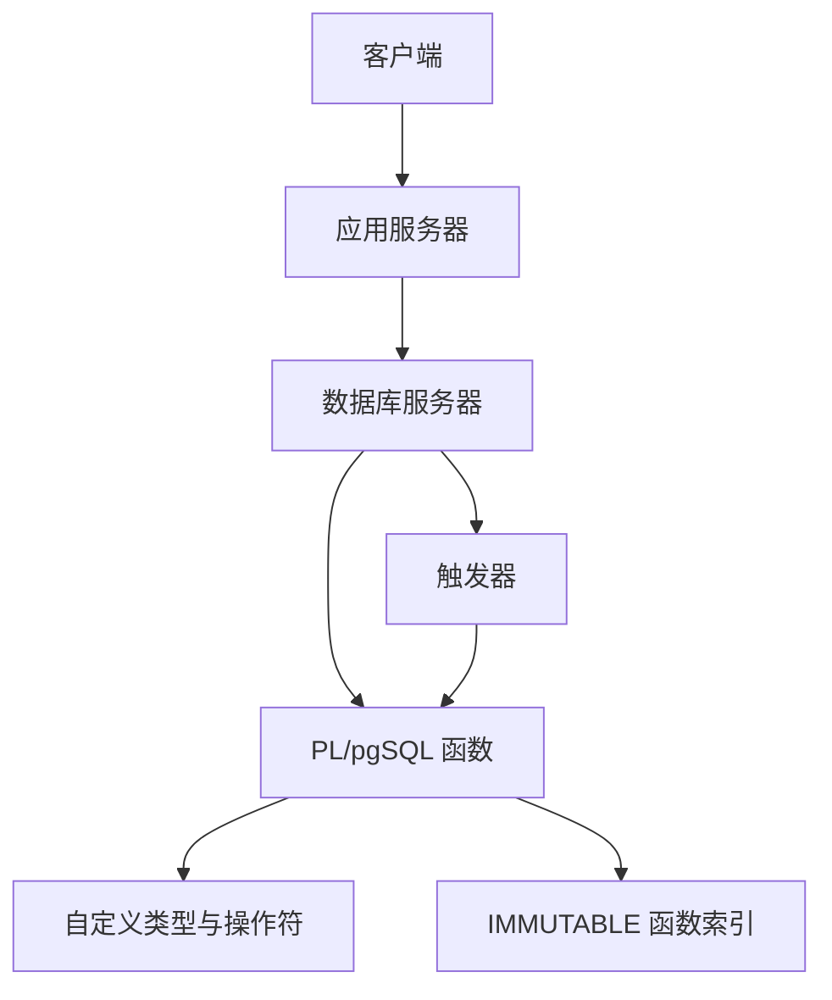
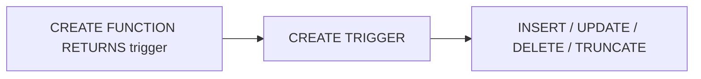
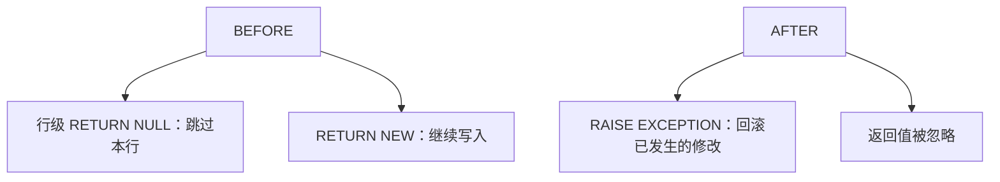

## PostgreSQL 服务器编程

[安全与完整性](10-security-and-integrity.md) 把约束和标准触发器写成事件–条件–动作，并说明同一规则若写在多个客户端，改阈值就要发多个版本。本页回答下一问：这些逻辑在 **PostgreSQL** 里写成什么、怎样挂到表上。基本砖块是**函数**；**触发器**是表上的修改事件发生时，自动调用一个返回类型为 `trigger` 的函数。

设计六阶段上，本页落在实施：建表、导入、SQL 编程与试运行。要把业务判断、审计、复杂约束和空间谓词放到数据库服务器里。几何类型 `geometry`、约 30 个 `ST_` 方法、包围盒操作符 `&&`，走的就是类型、函数、操作符、基于函数的索引同一条链；PostGIS 是这条链的工业实现。对象关系数据库相对纯关系，本来就扩充了结构类型、方法与操作符；空间库把同一能力用在几何上。动态 SQL 与路径结果集接到 [空间网络](09-spatial-network.md)；未捕获异常与行锁接到 [事务处理](12-transactions.md)。栏目总览见 [空间数据库](index.md)。



图中触发器不另起一套语言：它只负责在事件上调用已经写好的函数。函数体里的 `BEGIN … END` 圈定语句块；事务边界由调用者的 `BEGIN;` / `COMMIT` 决定。

## 逻辑下推到数据库服务器

逻辑上，一个 DBMS 分成客户机、应用服务器、数据库服务器，后面才是磁盘上的库。触发器与存储逻辑在**数据库服务器**这一层。把余额下限、单笔限额从多个客户端挪到这里，就是完整性规则的实现位置。

### 账户与转账

```sql
CREATE TABLE accounts (owner text, balance numeric);
INSERT INTO accounts VALUES ('Bob', 100);
INSERT INTO accounts VALUES ('Mary', 200);
```

Bob 转 14 给 Mary，至少两条 `UPDATE`。付款人是否有足够余额、收款人是否存在、单笔是否超过限额，若在应用里做，要把余额先读出网、再写回，中间还可能被别的事务改掉。先用一个事务把读写绑在一起：

```sql
BEGIN;
SELECT balance FROM accounts WHERE owner = 'Bob' FOR UPDATE;
UPDATE accounts SET balance = balance - 14 WHERE owner = 'Bob';
UPDATE accounts SET balance = balance + 14 WHERE owner = 'Mary';
COMMIT;
```

要么全部完成，要么全部不做。限额改成单笔上限时，判断仍散落在应用里。要把 `IF` 与 SQL 写在一处，使用 **PL/pgSQL**（Procedural Language / PostgreSQL SQL）。

完整的 `transfer` 函数如下。`FOUND` 是全局变量，表示上一条 SQL 是否命中行。

```sql
CREATE OR REPLACE FUNCTION transfer(
    payer text,
    recipient text,
    amount numeric(15, 2)
)
RETURNS text
AS $$
DECLARE
    payer_bal numeric;
BEGIN
    SELECT balance INTO payer_bal
    FROM accounts
    WHERE owner = payer FOR UPDATE;
    IF NOT FOUND THEN
        RETURN 'Payer account not found';
    END IF;
    IF payer_bal < amount THEN
        RETURN 'Not enough funds';
    END IF;
    UPDATE accounts
       SET balance = balance + amount
     WHERE owner = recipient;
    IF NOT FOUND THEN
        RETURN 'Recipient account not found';
    END IF;
    UPDATE accounts
       SET balance = balance - amount
     WHERE owner = payer;
    RETURN 'OK';
END;
$$ LANGUAGE plpgsql;
```

顺序是：锁住并读付款人；不存在则返回；余额不足则返回；给收款人加钱，收款人不存在则返回；付款人减钱。先给收款人加、再给付款人减，是为了在收款人账户不存在时尽早失败，避免付款人已经扣款却找不到对方。`SELECT … FOR UPDATE` 锁住付款人那一行，防止两个并发转账同时读到同一余额再各自扣款。`SELECT … INTO` 把查询结果放入声明过的变量。`LANGUAGE plpgsql` 告诉服务器用哪一套编译器。

函数返回的是提示字符串。返回 `'Not enough funds'` 时，此前尚未改表，调用者仍看到原余额。返回字符串**不会**自动回滚已经执行的 `UPDATE`；要把半成品撤掉，靠未捕获的 `RAISE EXCEPTION` 中止当前事务。

调用两种写法都可以：

```sql
SELECT * FROM transfer('Bob', 'Mary', 14);
SELECT transfer('Bob', 'Mary', 14);
```

`transfer('Bob','Mary',15)` 走到余额不足；`transfer('Bob1','Mary',15)` 走到付款人不存在；`transfer('Bob','Mary1',15)` 走到收款人不存在。

### 为何在服务器里写程序

1.  **性能：** 数据不必先传到应用再判断，省掉往返。
2.  **易维护：** 只更新服务器；不必同时发多个客户端版本。
3.  **安全：** 只把函数的 `EXECUTE` 授给用户，表本身不授 `SELECT`，用户看不见后台有哪些表。授权句法见 [安全与完整性](10-security-and-integrity.md)。

函数因此成为产品接口：客户端只看见 `transfer(payer, recipient, amount)` 或 `find_walking_path(start, goal)`，看不见 `accounts`、边表、拓扑结点。改限额、改最短路代价公式，只发服务器端一处。文档与仓库里只写函数签名与返回列，不写主机、端口或登录凭据。

服务器端还可以：用函数保护数据、用触发器审核访问、用定制类型丰富数据、用定制操作符做分析。几何类型、`ST_` 函数、`&&` 这类包围盒操作符，走的就是这条扩展路径。

## PL/pgSQL 块结构

PL/pgSQL 受 Oracle PL/SQL 影响，是功能完整的 SQL 脚本语言。PostgreSQL 并不把存储过程当成单独产品名词，但 PL/pgSQL 加上触发器、运算符、索引，构成一套存储过程环境。优点：易上手；多数部署里是默认扩展；针对数据密集任务做了优化。函数是扩展 PostgreSQL 最基本的构建模块：以参数输入，以返回值或输出参数输出。除 PL/pgSQL 外还支持 Tcl、Perl、Python 等；函数体也可以是纯 `LANGUAGE sql`。文档入口见 PostgreSQL 官方 [PL/pgSQL](https://www.postgresql.org/docs/current/plpgsql.html) 章，以当前版本页面为准。

它是**块结构**语言：

```text
[ <<label>> ]
[ DECLARE
    declarations ]
BEGIN
    statements
END [ label ];
```

未初始化的变量值为 `NULL`。变量声明和语句以分号结尾；除最后的 `END` 外，嵌套块的 `END` 后面也要分号。单行注释 `--`，多行 `/* … */`。变量与关键字不区分大小写，字符 `'A'` 与标识符 `"A"` 除外。块内可以声明变量，同名覆盖外层，可用 `label.variable` 访问外层。声明形如：

```text
name [CONSTANT] type [COLLATE collation_name] [NOT NULL]
     [{DEFAULT | := | =} expression];
```

块可以嵌套。外层转账函数里可以再开一个内层 `BEGIN … EXCEPTION … END`，只捕获查不到收款人这一类局部错误。内层没有 `EXCEPTION` 子句时，错误一直冒到最外层。

???+ warning "函数体 BEGIN 与事务 BEGIN"
    函数里的 `BEGIN … END` 是 PL/pgSQL 的语句块，只圈定声明与语句的作用域。

    事务的开始要写 `START TRANSACTION` 或作为 SQL 语句的 `BEGIN;`。

    一个函数调用默认落在调用者的当前事务里。

    函数内未捕获的 `RAISE EXCEPTION` 会把这个事务中止，见 [事务处理](12-transactions.md)。

把函数体的 `BEGIN` 当成新开一笔事务，上机与验收都会把原子性算错。函数默认 **0** 个新事务。

内层 `BEGIN … EXCEPTION … END` 捕获之后，外层函数继续执行，调用者的事务仍然活着。捕获之后若要自己中止，再 `RAISE`。`WHEN OTHERS THEN NULL` 会吞掉错误：表上已经发生的修改留在当前事务里，不会自动撤。需要整笔失败时，让异常冒泡到最外层。块级 `EXCEPTION` 圈的是语句作用域；事务边界仍由外层的 `BEGIN;` / `COMMIT` / `ROLLBACK` 决定。

带 `EXCEPTION` 的内层块在实现上对应一个保存点：进入块时建保存点，捕获时回滚到该保存点，然后执行 `WHEN` 分支。这是子事务，仍嵌在调用者那一笔事务里。函数最外层那个不带 `EXCEPTION` 的 `BEGIN` 不建保存点，也不打开事务。函数开了 0 笔新事务。捕获异常后表上的改动是否还在，取决于改动发生在保存点哪一侧。

## 类型、操作符与函数索引

### 复合类型与中缀操作符

例：类型 `fruit_qty` 表示水果数量；一个橘子等于 1.5 个苹果。先定义类型，再定义比较函数，再把函数绑到操作符 `>` 上。

```sql
CREATE TYPE fruit_qty AS (name text, qty int);

CREATE FUNCTION fruit_qty_larger_than(
    left_fruit  fruit_qty,
    right_fruit fruit_qty
)
RETURNS boolean
AS $$
BEGIN
    IF (left_fruit.name = 'APPLE' AND right_fruit.name = 'ORANGE') THEN
        RETURN left_fruit.qty > (1.5 * right_fruit.qty);
    END IF;
    IF (left_fruit.name = 'ORANGE' AND right_fruit.name = 'APPLE') THEN
        RETURN (1.5 * left_fruit.qty) > right_fruit.qty;
    END IF;
    RETURN left_fruit.qty > right_fruit.qty;
END;
$$ LANGUAGE plpgsql;

CREATE OPERATOR > (
    LEFTARG    = fruit_qty,
    RIGHTARG   = fruit_qty,
    PROCEDURE  = fruit_qty_larger_than,
    COMMUTATOR = >
);
```

类型转换用 `::`。这与几何里 `'POINT(10 20)'::geometry`、或 `ST_GeomFromText('WKT', srid)` 是同一件事：字符串变成该类型的值。

```sql
SELECT '(''APPLE'', 3)'::fruit_qty;
SELECT fruit_qty_larger_than(
    '(''APPLE'', 3)'::fruit_qty,
    '(''ORANGE'', 2)'::fruit_qty
);
SELECT '(''ORANGE'', 2)'::fruit_qty > '(''APPLE'', 3)'::fruit_qty;
```

`CREATE OPERATOR` 把已经写好的函数登记成中缀符号：`LEFTARG` / `RIGHTARG` 声明两侧类型，`PROCEDURE` 指向比较函数，`COMMUTATOR` 告诉优化器左右对调后可用的操作符。没有这一步，调用处只写函数名，写不出 `a > b`。

PostGIS 的几何类型、空间函数、几何操作符，用类型 + 函数 + 操作符同一套机制实现。过滤器阶段的包围盒相交，正是把 `&&` 做成操作符之后，GiST 识别并走索引；精炼阶段再调真正的 `ST_Intersects`。缺少操作符这一环，空间索引无法接到谓词上。几何方法清单见 [几何对象与 PostGIS](04-geometry-and-postgis.md)；GiST 与过滤精炼见 [空间存储与索引](07-storage-and-index.md)。

### IMMUTABLE 与表达式索引

索引键不必是表上的裸列，可以是函数的结果。下面把单词中的元音按逆序拼成键，并在其上建索引。`IMMUTABLE` 表示同样输入永远同样输出，优化器才允许在其上建索引。

```sql
CREATE OR REPLACE FUNCTION reversed_vowels(word text)
RETURNS text
AS $$
DECLARE
    vowels text := '';
    i integer;
    ch text;
BEGIN
    FOR i IN 1..length(word) LOOP
        ch := lower(substr(word, i, 1));
        IF ch IN ('a', 'e', 'i', 'o', 'u') THEN
            vowels := ch || vowels;
        END IF;
    END LOOP;
    RETURN vowels;
END;
$$ LANGUAGE plpgsql IMMUTABLE;

CREATE INDEX reversed_vowels_index
ON words (reversed_vowels(word));
```

若函数读表、调 `random()` 或依赖当前时间，禁止标 `IMMUTABLE`，否则索引里的键与后来的计算结果会对不上。`WHERE` 或 `ORDER BY` 里出现 `reversed_vowels(word)` 时，系统使用该索引。对 `ST_Transform(geom, 4326)` 建函数索引是同一类技术。

类型、函数、操作符、基于函数的索引，都可以用服务器脚本做出来。下面把函数怎么写、触发器怎么写拆开。

## 函数五块积木

一个 PostgreSQL 函数由五部分构成：**函数名、参数、返回类型、主体、语言**。


笛卡尔距离作第一例：

```sql
CREATE OR REPLACE FUNCTION ST_P2PDistance(
    x1 float, y1 float, x2 float, y2 float)
RETURNS float
AS $$
BEGIN
    RETURN sqrt((x2 - x1) * (x2 - x1) + (y2 - y1) * (y2 - y1));
END;
$$ LANGUAGE plpgsql;
```

| 积木 | 本例 |
| --- | --- |
| 函数名 | `ST_P2PDistance` |
| 参数 | `x1 float, y1 float, x2 float, y2 float`；先名后类型 |
| 返回类型 | `float` |
| 主体 | `BEGIN … END` 中的一条 `RETURN` |
| 语言 | `LANGUAGE plpgsql` |

调用：

```sql
SELECT ST_P2PDistance(103.5, 200.4, 105.6, 200.7);
```

`CREATE OR REPLACE FUNCTION` 会覆盖同名同签名的旧定义，避免先 `DROP FUNCTION`。函数体常用美元引用 `$$ … $$`，体内可以写普通单引号而不必加倍转义。需要嵌套引用时换成 `$body$ … $body$` 这类带标签的美元引用。参数写法是变量名、类型名，与 `CREATE TABLE` 的列名、类型同一习惯。

`LANGUAGE plpgsql` 才提供 `BEGIN`、变量、`IF` 和循环。函数体只是一条 SQL 查询时，改用 `LANGUAGE sql`，主体直接是 `SELECT …`，不必 `BEGIN/END`。按用户编号查是否管理员、找不到则 `COALESCE` 成 `FALSE`，就是纯 SQL 标量函数的典型。纯 SQL 函数对优化器更透明，有时可内联进外层查询。一旦需要分支、循环、异常或多次 `INTO`，就必须换 PL/pgSQL。

五块必须同时写全。缺 `LANGUAGE` 会报错。缺 `RETURNS` 时，`OUT` 参数可以推导返回类型。参数默认是 `IN`；`OUT` 与 `INOUT` 把结果从返回值改到参数槽。`CREATE OR REPLACE` 只覆盖**同名同参数类型**的定义；参数类型变了，服务器当成另一个重载。

波动性分三类，写在 `LANGUAGE` 之后：

-   **IMMUTABLE**：同样输入永远同样输出，允许作表达式索引的键。
-   **STABLE**：同一条 SQL 语句内结果不变，适合读表但不写表的函数。
-   **VOLATILE**：缺省；每次调用都可能不同，禁止拿来建表达式索引。

`ST_Transform(geom, 4326)` 在 SRID 固定时标 `IMMUTABLE`。读 `SESSION_USER` 的盖章函数标 `STABLE` 或 `VOLATILE`。标错波动性，规划器会把过期键当真相。

### SELECT INTO 与块内声明

`SELECT 表达式 INTO 目标变量 FROM …` 把查询得到的一个值写入变量，供后续语句使用。参数之外的局部变量必须在该 `BEGIN` 之前的 `DECLARE` 里声明，作用域只在这个块内。

```sql
CREATE FUNCTION mid(str varchar, start integer)
RETURNS varchar
AS $$
DECLARE
    temp varchar;
BEGIN
    temp := substring(str, start);
    RETURN temp;
END;
$$ LANGUAGE plpgsql;
```

含义：从字符串 `str` 的第 `start` 个字符起取子串，放入 `temp`，再返回。`substring` 是 SQL 内置函数；这里用 PL/pgSQL 把它包成可重载的接口。

### 函数重载

函数名相同、参数列表不同，即可重载。例如再定义 `mid(str varchar, start integer, end integer)`，表示取从 `start` 到 `end` 的中间一段。仅返回类型不同，不构成重载：调用处无法只凭返回类型消歧。

## 条件与赋值

### IF / THEN / ELSIF / ELSE / END IF

```sql
IF boolean-expression THEN
    statements
[ ELSIF boolean-expression THEN
    statements
  ... ]
[ ELSE
    statements ]
END IF;
```

符号函数：三个有意义的比较（等于 0、大于 0、小于 0）都失败时，只可能是 `NULL`，故 `ELSE` 写成 `'NULL'` 字符串，表示无法判定符号。

```sql
IF number = 0 THEN
    result := 'zero';
ELSIF number > 0 THEN
    result := 'positive';
ELSIF number < 0 THEN
    result := 'negative';
ELSE
    result := 'NULL';
END IF;
```

`ELSIF` 是一个关键字。`END IF` 与第一个 `IF` 成对，后面加分号。三个比较都用 `=` / `>` / `<` 时，`NULL` 与任何值的比较结果都为假，于是落到 `ELSE`。这是用过程语言显式处理 `NULL` 的写法，和 SQL 里 `IS NULL` 判断是同一件语义，只是出现在块里。

???+ note "赋值与相等"
    赋值写成 `:=`。

    判断相等写成 `=`。

    `result := 'zero';` 是赋值；`IF number = 0 THEN` 是比较。

简单的两路选择也可以写成标量表达式，例如 `IF(trim(firstname) = '', NULL, firstname)`：去空白后为空则取 `NULL`，否则保留原名。这是标量表达式：分支里只放值。

### CASE 语句

```sql
CASE search-expression
    WHEN expression [, expression ...] THEN
        statements
    [ WHEN ... ]
    [ ELSE
        statements ]
END CASE;
```

例：`CASE x WHEN 1, 2 THEN msg := 'one or two'; ELSE msg := 'other value than one or two'; END CASE;`。`WHEN` 后可以并列多个值。`END CASE` 对应起始的 `CASE`，最后加分号。它和 SQL 查询里的 `CASE … END` 表达式是亲戚，但这里是过程语句，各分支里可以写多条语句。

## 循环、动态 SQL 与 PERFORM

循环族包括 `LOOP`、`WHILE`、`FOR`，以及 `CONTINUE`（跳过本轮剩余语句）和 `EXIT`（离开循环）。

### LOOP 与 WHILE

```sql
LOOP
    count := count + 1;
    CONTINUE WHEN count < 0;
    EXIT WHEN count > 100;
END LOOP;
```

`CONTINUE WHEN 条件`：条件为真则进入下一轮。`EXIT WHEN 条件`：条件为真则离开循环。上面若 `count` 从负数长上来，会先被 `CONTINUE` 空转，直到非负；超过 100 则退出。

`WHILE` 把条件放在入口：

```sql
count := 0;
WHILE count <= 100 LOOP
    count := count + 1;
END LOOP;
```

循环结束后 `count` 落到 101。每个循环都以 `END LOOP` 收尾。

### FOR：循环变量自动创建

`FOR` 的循环变量不必在 `DECLARE` 里声明，执行时自动创建。区间用两个点 `..`。`REVERSE` 从大到小；`BY` 改步长。

```sql
FOR i IN 1..100 LOOP
    -- i = 1, 2, …, 100
END LOOP;

FOR i IN REVERSE 100..1 LOOP
    -- i = 100, 99, …, 1
END LOOP;

FOR i IN REVERSE 100..1 BY 2 LOOP
    -- i = 100, 98, 96, …
END LOOP;
```

把一行声明为 `RECORD`，即可用 `FOR 变量 IN 查询 LOOP` 遍历结果集，循环变量上的字段按列名访问，内部相当于自动打开游标：

```sql
DECLARE
    movie RECORD;
BEGIN
    FOR movie IN SELECT * FROM movies LOOP
        -- 使用 movie.id、movie.name
    END LOOP;
END;
```

查询不必写死。`FOR result IN EXECUTE sql LOOP` 先把字符串 `sql` 当语句执行，再遍历其结果。空间网络里 `pgr_dijkstra` 一类函数的第一个参数往往是描述边表的 SQL 字符串，服务器端可以用 `EXECUTE` 跑这个字符串，见 [空间网络](09-spatial-network.md)。`WITH RECURSIVE` 里若把路径收成数组，则可用：

```sql
FOREACH x IN ARRAY values LOOP
    -- …
END LOOP;
```

其中 `values` 为 `int[]` 等数组类型。

### EXECUTE 与 PERFORM

`EXECUTE` 把字符串拼成语句再执行：

```sql
EXECUTE 'TRUNCATE TABLE ' || table_name;
```

???+ warning "动态 SQL 的标识符"
    表名来自参数时用 `format('%I', table_name)` 做标识符转义。

    字符串拼接会把输入写进语句文本。

`TRUNCATE` 按表名清空，比逐行 `DELETE` 更彻底，也因此只允许作为语句级事件，禁止对每一行 `TRUNCATE`。触发器一节会再用到这一点。

`PERFORM` 执行一条会返回结果的语句，但丢掉结果。

```sql
PERFORM cs_log('Done refreshing materialized views');
```

在函数体里若写 `SELECT …;` 却不把结果赋给变量，PL/pgSQL 会报错；此时应改 `PERFORM`。对比：`SELECT cs_log(…);` 会把返回值交给当前查询。

### 同时赋值：Fibonacci

递推 \(F(n)=F(n-1)+F(n-2)\)，\(F(0)=0\)，\(F(1)=1\)。用 `decimal(1000,0)` 避免整数溢出：

```sql
CREATE OR REPLACE FUNCTION fib(n integer)
RETURNS decimal(1000, 0)
AS $$
DECLARE
    counter integer := 0;
    a decimal(1000, 0) := 0;
    b decimal(1000, 0) := 1;
BEGIN
    IF (n < 1) THEN
        RETURN 0;
    END IF;
    LOOP
        EXIT WHEN counter = n;
        counter := counter + 1;
        SELECT b, a + b INTO a, b;
    END LOOP;
    RETURN a;
END;
$$ LANGUAGE plpgsql;
```

`SELECT b, a+b INTO a, b` 一次把两个值写入两个变量：新的 \(a\) 等于旧的 \(b\)，新的 \(b\) 等于旧的 \(a+b\)。这是按右侧旧值同时计算，再一起赋给左侧。若先写 `a := b` 再写 `b := a + b`，会用到已经更新的 `a`，递推就错了。循环 \(n\) 次后返回 \(a\)，即 \(F(n)\)。\(n<1\) 时直接返回 0。以 \(n=3\) 跟踪：初值 \(a=0,b=1,\mathrm{counter}=0\)；第一轮后 \(a=1,b=1,\mathrm{counter}=1\)；第二轮后 \(a=1,b=2,\mathrm{counter}=2\)；第三轮后 \(a=2,b=3,\mathrm{counter}=3\)，退出，返回 2，即 \(F(3)\)。

## 返回集合 SETOF

返回整个前缀序列时，把返回类型改成 `SETOF integer`，并用 `RETURN NEXT 值` 把当前值追加到结果集：

```sql
CREATE OR REPLACE FUNCTION fib_seq(num integer)
RETURNS SETOF integer AS $$
DECLARE
    a int := 0;
    b int := 1;
BEGIN
    IF (num < 1) THEN
        RETURN;
    END IF;
    RETURN NEXT a;
    LOOP
        EXIT WHEN num <= 1;
        RETURN NEXT b;
        num := num - 1;
        SELECT b, a + b INTO a, b;
    END LOOP;
END;
$$ LANGUAGE plpgsql;
```

与 `fib` 的差别：返回类型是集合；先把 \(F(0)\) 放进集合；每轮 `RETURN NEXT b` 再放下一项，并把剩余个数减一。`num < 1` 时 `RETURN;` 表示空集。

调用：

```sql
SELECT fib_seq(3);
SELECT * FROM fib_seq(3);
SELECT * FROM fib_seq(3) WHERE 1 = ANY (SELECT fib_seq(3));
```

集合函数在 `FROM` 里当表扫描；在选择列表里则每一行展开成一列值。`RETURN NEXT` 只是把当前值追加到结果集，函数继续跑，直到块结束或遇到无参 `RETURN`。

返回某张系统表的全部行时，用 `RETURN QUERY` 把一条查询的结果直接并入：

```sql
CREATE OR REPLACE FUNCTION installed_languages()
RETURNS SETOF pg_language AS $$
BEGIN
    RETURN QUERY SELECT * FROM pg_language;
END;
$$ LANGUAGE plpgsql;
```

`RETURNS SETOF …` 的几种写法：

| `RETURNS` | 行结构从哪来 | 函数体内 |
| --- | --- | --- |
| `SETOF <type>` | 基类型或复合类型 | 声明 `ROW` / `RECORD`；`RETURN NEXT` |
| `SETOF <table/view>` | 与该表或视图同结构 | 同上 |
| `SETOF RECORD` | 调用处 `AS (名 类型, …)` | 动态行类型 |
| `SETOF RECORD` 配 `OUT` / `INOUT` | 由输出参数决定 | 给 `OUT` 赋值后 `RETURN NEXT` |
| `TABLE(…)` | 在 `TABLE` 括号内声明列 | 视为 `OUT`；`RETURN NEXT` 或 `RETURN QUERY` |

步行路径一类接口用 `RETURNS TABLE(…)`：把路径序号、几何、街名、距离等列写在括号里，查询侧把它当成一张临时表：`SELECT * FROM route.find_walking_path(…)`。标量或复合 JSON 适合一次请求一次对象；`SETOF` / `TABLE` 适合一次请求多行路径或候选街道。

集合返回函数出现在 `FROM` 时，规划器把它当一次扫描，列名来自 `TABLE` 括号或 `OUT` 参数。`SETOF RECORD` 必须在调用处提供 `AS (名 类型, …)`，否则无法确定元组结构。`RETURN NEXT` 可以穿插在循环里多次调用；`RETURN QUERY` 一次并入整段查询。两者可以出现在同一函数里：先 `RETURN NEXT` 补一行摘要，再 `RETURN QUERY` 输出明细。函数结束时若从未 `RETURN NEXT` 也未 `RETURN QUERY`，结果是空集。

路网最短路函数的典型形态：参数为起点几何、终点几何或结点编号；体内查最近拓扑结点、用 `format` 拼边表 SQL、调用 `pgr_dijkstra`、把边序列收成折线。返回类型写成 `RETURNS TABLE(seq int, geom geometry, name text, cost float)`。这是 [空间网络](09-spatial-network.md) 在服务器编程里的落点：网络模型负责边与代价，本页负责循环、`EXECUTE` 与集合返回。

## 异常与 FOUND

### RAISE

```sql
RAISE [level] 'format' [, expression ...] [USING option = expression ...];
```

级别：`DEBUG`、`LOG`、`INFO`、`NOTICE`、`WARNING`、`EXCEPTION`。缺省是 `EXCEPTION`：报错并中止当前事务。函数里未被捕获的异常，就是在终止当前这一笔事务。函数体的 `BEGIN` 圈不住事务边界；块级 `EXCEPTION` 子句圈得住本块内的错误。

调试时常用 `NOTICE`，不中止执行，消息出现在客户端的消息通道，不一定出现在查询结果格里：

```sql
RAISE NOTICE 'a = %, b = %, c = %', a, b, c;
```

格式串里的 `%` 按后面的表达式依次替换。

### FOUND 与 STRICT

按雇员名取一行：

```sql
SELECT * INTO myrec FROM emp WHERE empname = myname;
IF NOT FOUND THEN
    RAISE EXCEPTION 'employee % not found', myname;
END IF;
```

`transfer` 里对付款人、收款人的检查，用的就是这一条。若业务要求必须恰好一行，加 `STRICT`，并用块级 `EXCEPTION` 分别捕捉零行和多行：

```sql
BEGIN
    SELECT * INTO STRICT myrec FROM emp WHERE empname = myname;
EXCEPTION
    WHEN NO_DATA_FOUND THEN
        RAISE EXCEPTION 'employee % not found', myname;
    WHEN TOO_MANY_ROWS THEN
        RAISE EXCEPTION 'employee % not unique', myname;
END;
```

`GET STACKED DIAGNOSTICS` 用在 `EXCEPTION` 块内，把这次错误的状态码、表名、约束名、主消息、HINT、调用栈等写入变量，便于写成统一的错误日志。按用户名、账号去查有没有这个人，用 `FOUND` 即可。行程开始 / 结束、按用户编号取实时位置，失败路径同样是查不到则返回错误 JSON 或抛异常。

`RAISE EXCEPTION` 的缺省 SQLSTATE 是 `P0001`。用 `RAISE … USING ERRCODE = 'unique_violation'` 可以套用系统状态码，让外层 `WHEN unique_violation` 捕获。自定义业务码用 `ERRCODE = 'P0001'` 一类以 `P` 开头的类。消息里的 `%` 只做替换，不会执行其中的 SQL。调试阶段把级别改成 `NOTICE`，生产路径对资金、权限、几何合法性保持 `EXCEPTION`，避免半成品提交。

`FOUND` 的常用规则：

-   `SELECT INTO`：赋到一行则为真，零行则为假。
-   `PERFORM`：产生并丢弃至少一行为真。
-   `UPDATE` / `INSERT` / `DELETE`：至少影响一行为真。
-   `FETCH` / `MOVE`：取到行或成功移动游标为真。
-   `FOR` / `FOREACH`：在循环结束时置位；迭代过至少一次为真。循环体内部的 `FOUND` 不被循环语句本身改写，但可被循环体里的其他语句改写。
-   `RETURN QUERY`：查询至少返回一行为真。

## 几何函数

几何对象模型里讲过的谓词，多数都可以按定义写成函数；PostGIS 内置函数正是同一思路在 C 里实现并注册成类型、操作符与索引支持。数组函数见 PostgreSQL 官方 [Array Functions](https://www.postgresql.org/docs/current/functions-array.html)。`ST_PointN`、`ST_GeometryN` 的下标从 1 开始。

### 折线的全部顶点

非 `LineString` 返回空的多点；否则按顶点下标取出，收进数组，再用 `ST_Collect` 合成一个几何。

```sql
CREATE OR REPLACE FUNCTION ST_PointsFromLine(geom geometry)
RETURNS geometry
AS $$
DECLARE
    g geometry[];
BEGIN
    IF ST_GeometryType(geom) != 'ST_LineString' THEN
        RETURN 'MULTIPOINT EMPTY'::geometry;
    END IF;
    FOR i IN 1..ST_NumPoints(geom) LOOP
        g := array_append(g, ST_PointN(geom, i));
    END LOOP;
    RETURN ST_Collect(g);
END;
$$ LANGUAGE plpgsql;
```

`::geometry` 是类型转换。输入为非 `LineString` 时返回空多点；输入三点折线则得到三个点。

### 数组：路段端点与距离矩阵

一维、定长：把一条路的起点与终点收进长度为 2 的几何数组。

```sql
DECLARE
    v1 geometry[2];
BEGIN
    SELECT ARRAY[ST_StartPoint(geom), ST_EndPoint(geom)]
      INTO v1
      FROM road
     WHERE id = 123;
END;
```

`array_length(arr, dim)` 的第二参数是第几维：一维数组写 `1`。二维距离矩阵可先 `array_fill(0.0, ARRAY[10, 10])` 填零再写入。最短路一类算法：先声明 \(n\times n\) 矩阵，再填点到点的距离后才调用后续函数。查附近街道、附近 POI、路网最短路，用的是同一套数组或结果集循环 + PostGIS 距离积木：可以 `FOR 记录 IN SELECT … LOOP` 遍历查询，也可以先收成数组再 `FOR i IN 1..array_length(…, 1)`。下标约定必须与 `ST_PointN` 一致，从 1 计。

### 多边形内环数

简单多边形直接 `ST_NumInteriorRings`；`MultiPolygon` 没有整个集合一个内环数的现成函数，要对每个成员累加。非面类型两个分支都不进，返回 0。

```sql
CREATE OR REPLACE FUNCTION ST_NInteriorRings(geom geometry)
RETURNS integer
AS $$
DECLARE
    num integer := 0;
BEGIN
    IF ST_GeometryType(geom) = 'ST_Polygon' THEN
        num := ST_NumInteriorRings(geom);
    ELSIF ST_GeometryType(geom) = 'ST_MultiPolygon' THEN
        FOR i IN 1..ST_NumGeometries(geom) LOOP
            num := num + ST_NumInteriorRings(ST_GeometryN(geom, i));
        END LOOP;
    END IF;
    RETURN num;
END;
$$ LANGUAGE plpgsql;
```

三个多边形组成的 `MultiPolygon`，循环三次，把各自内环数加进 `num`。

### 轴对齐包围盒

`ST_DumpPoints` 把任意几何打成点，再分别对 \(x\)、\(y\) 求最小最大，最后 `ST_MakeEnvelope`。这是在用过程语言重写 `ST_Envelope` 一类功能，便于看清包围盒四个极值从哪来。

```sql
CREATE OR REPLACE FUNCTION ST_AABBEnvelope(g geometry)
RETURNS geometry
AS $$
DECLARE
    minX float;
    minY float;
    maxX float;
    maxY float;
BEGIN
    SELECT
        min(ST_X(dp.geom)),
        min(ST_Y(dp.geom)),
        max(ST_X(dp.geom)),
        max(ST_Y(dp.geom))
    INTO minX, minY, maxX, maxY
    FROM ST_DumpPoints(g) AS dp;
    RETURN ST_MakeEnvelope(minX, minY, maxX, maxY);
END;
$$ LANGUAGE plpgsql;
```

### 交叠 Overlaps

OGC 直观定义：\(\dim(I(a))=\dim(I(b))=\dim(I(a)\cap I(b))\)，且 \(a\cap b\neq a\)、\(a\cap b\neq b\)：相交，但谁也不包含谁。过程实现先求交，再把维数不等或交出来等于某一方全部否定掉。维数条件保证交叠发生在内部且维数一致，例如两个面交出一块面，而不是只交出一条边界。`ST_Equals(g, g1)` 为真表示交出来的就是 \(g_1\)，即 \(g_2\) 包含 \(g_1\)，那是 Within / Contains。

```sql
CREATE OR REPLACE FUNCTION ST_GeomOverlaps(g1 geometry, g2 geometry)
RETURNS boolean
AS $$
DECLARE
    g geometry;
BEGIN
    g := ST_Intersection(g1, g2);
    RETURN NOT (
        ST_Dimension(g1) != ST_Dimension(g2)
        OR ST_Dimension(g1) != ST_Dimension(g)
        OR ST_Equals(g, g1)
        OR ST_Equals(g, g2)
    );
END;
$$ LANGUAGE plpgsql;
```

`geometry`、空间函数、`&&` 一类包围盒操作符，就是自定义类型 + 函数 + `CREATE OPERATOR` 这条链。

## 触发器两步创建

触发器（Trigger）是向表的修改事件挂上自动函数调用的机制。它属于数据模型：所有客户端共用同一套事件处理，某个客户端漏写检查也绕不过去。真实系统里视图用得很多，触发器相对少：每次插入都走触发器，写入会变慢。标准触发器的 ECA 语义见 [安全与完整性](10-security-and-integrity.md)。

### SQL 标准句法与 PostgreSQL 的差别

```sql
CREATE TRIGGER name
BEFORE | AFTER | INSTEAD OF events
[REFERENCING 变量]
[FOR EACH ROW]
WHEN (condition)
action;
```

标准把事件、条件、动作写在同一条语句里。过渡变量是 `OLD ROW` / `NEW ROW`（行级）和 `OLD TABLE` / `NEW TABLE`（语句级）。动作可以是一条 SQL。PostgreSQL 要求动作先独立成函数，再在 `CREATE TRIGGER` 里调用。

### PostgreSQL：先写函数，再挂到表上

PostgreSQL 拆成两步：

1.  `CREATE FUNCTION … RETURNS trigger`：触发器函数，返回类型必须是 `trigger`。函数声明**不带参数**；`CREATE TRIGGER` 里传入的参数进入 `TG_ARGV`。运行时通过一组局部变量读取触发数据。
2.  `CREATE TRIGGER … EXECUTE FUNCTION 函数名(…)`：把函数挂到某张表的某种事件上。标准里的 `action` 在这里变成调用哪个函数。较旧脚本写作 `EXECUTE PROCEDURE`，与 `EXECUTE FUNCTION` 等价，见 [CREATE TRIGGER](https://www.postgresql.org/docs/current/sql-createtrigger.html)。



```sql
CREATE TRIGGER name
    { BEFORE | AFTER | INSTEAD OF } { event [OR ...] }
    ON table_name
    [ FOR { EACH } { ROW | STATEMENT } ]
    EXECUTE FUNCTION function_name (arguments);
```

`event` 为 `INSERT`、`UPDATE`、`DELETE` 或 `TRUNCATE`。函数参数进入 `TG_ARGV`（`text[]`），个数为 `TG_NARGS`，下标从 0 计。

| 项目 | SQL 标准 | PostgreSQL |
| --- | --- | --- |
| 一条语句是否写完 | 事件、条件、动作都在 `CREATE TRIGGER` 里 | 动作必须先写成 `RETURNS trigger` 的函数 |
| 过渡行 | `REFERENCING OLD ROW AS …, NEW ROW AS …` | 自动提供 `OLD` / `NEW` |
| 过渡表 | `OLD TABLE` / `NEW TABLE` | `AFTER` 可用 `REFERENCING … TABLE`；本页以行级为主 |
| 动作 | 内联 SQL | `EXECUTE FUNCTION 函数名(参数)` |
| 额外事件 | 通常无 `TRUNCATE` | 有 `TRUNCATE`；仅语句级 |
| 环境变量 | 标准未规定 `TG_*` | `TG_NAME`、`TG_WHEN`、`TG_LEVEL`、`TG_OP`、`TG_TABLE_NAME` 等 |
| 视图更新 | `INSTEAD OF` + 内联动作 | 同样用 `INSTEAD OF`；动作仍是调函数 |

`BEFORE` / `AFTER` / `INSTEAD OF` 与行级 / 语句级的语义，与标准触发器一致；差别只是动作改成调函数。级联删除写成 `AFTER DELETE` 行级函数里 `DELETE FROM R WHERE A = OLD.B`；级联更新同时读 `OLD` 与 `NEW`；插入前查重写成 `BEFORE INSERT` 里查冲突则 `RAISE EXCEPTION`。

同一事件上可以挂多个触发器，按名称字母序触发。一个函数也可以挂到多张表、多种事件上，靠 `TG_OP` 分支。链式调用与自触发的语义与标准触发器相同：条件可以写在 `WHEN` 里，也可以写在函数的 `IF` 里。`WHEN` 为假时函数根本不进，成本更低。

视图上的 `INSTEAD OF` 必须是行级，且仅允许建在视图上。函数里读 `NEW` 或 `OLD`，自己对基表做 `INSERT` / `UPDATE` / `DELETE`，再返回 `NEW` 或 `OLD` 表示该行已处理。返回 `NULL` 表示跳过，影响行数不计这一行。视图上的 `BEFORE` / `AFTER` 只允许语句级。`TRUNCATE` 对视图无对应事件。

官方 [CREATE TRIGGER](https://www.postgresql.org/docs/current/sql-createtrigger.html) 还允许 `AFTER` 语句级用 `REFERENCING OLD TABLE / NEW TABLE` 收集本语句改过的全部行，一次扫描过渡表做审核，避免对每一行各插一次审计记录。本页示例以行级 `OLD` / `NEW` 为主；批量导入后的对账适合改用过渡表。

**行级变量**仅 `FOR EACH ROW`：

| 变量 | 含义 |
| --- | --- |
| `OLD` | `DELETE` / `UPDATE` 之前的那一行 |
| `NEW` | `INSERT` / `UPDATE` 之后或将要写入的那一行 |
| 二者 | 在语句级触发器中均未赋值 |

**触发器环境变量**（节选）：

| 变量 | 含义 |
| --- | --- |
| `TG_NAME` | 触发器名 |
| `TG_WHEN` | `BEFORE` / `AFTER` / `INSTEAD OF` |
| `TG_LEVEL` | `ROW` 或 `STATEMENT` |
| `TG_OP` | `INSERT` / `UPDATE` / `DELETE` / `TRUNCATE` |
| `TG_RELID` | 表 OID |
| `TG_TABLE_NAME` / `TG_TABLE_SCHEMA` | 表名、模式名 |
| `TG_NARGS` / `TG_ARGV[]` | 参数个数与数组 |

触发器必须返回一个行（`RECORD`）或在 `BEFORE` 行级里返回 `NULL` 表示取消这一行。`AFTER` 行级与语句级的返回值被忽略；要取消已发生的修改，必须 `RAISE EXCEPTION`。详见 [Trigger Functions](https://www.postgresql.org/docs/current/plpgsql-trigger.html)。

### 通知触发器

缺少 `RETURN` 的函数无法作为触发器函数。触发器必须返回一个行，或在 `BEFORE` 行级里返回 `NULL` 表示取消这一行。

```sql
CREATE OR REPLACE FUNCTION notify_trigger()
RETURNS trigger AS $$
BEGIN
    RAISE NOTICE 'Hi, I got % invoked for % % % on %',
        TG_NAME, TG_LEVEL, TG_WHEN, TG_OP, TG_TABLE_NAME;
    RETURN NEW;
END;
$$ LANGUAGE plpgsql;

CREATE TABLE notify_test (i int);

CREATE TRIGGER notify_insert_trigger
    AFTER INSERT ON notify_test
    FOR EACH ROW
    EXECUTE FUNCTION notify_trigger();
```

`INSERT INTO notify_test VALUES (1), (2);` 会按行触发两次 `NOTICE`。`AFTER INSERT` 时行已写入，返回 `NEW` 即可。若是 `BEFORE INSERT`，返回 `NEW` 表示用可能改过的新行继续插入，返回 `NULL` 表示跳过该行。

三合一：

```sql
CREATE TRIGGER notify_iud_trigger
    AFTER INSERT OR UPDATE OR DELETE ON notify_test
    FOR EACH ROW
    EXECUTE FUNCTION notify_trigger();
```

`TRUNCATE` 只允许语句级触发器。需要另建：

```sql
CREATE TRIGGER notify_truncate_trigger
    AFTER TRUNCATE ON notify_test
    FOR EACH STATEMENT
    EXECUTE FUNCTION notify_trigger();
```

两个触发器可以共用同一个函数。`TRUNCATE` 不会去触发逐行 `DELETE`。

## 审核与数据保护

### 审核触发器

常见用途：用一张审计表，前后一致、对用户透明地记下谁、何时、对哪张表、做了何种操作、改前改后是什么。字段示例：`username`、`event_time_utc`、`table_name`（含模式名）、`operation`、`before_value json`、`after_value json`。用户名取 `SESSION_USER`，不要让客户端自己填；时间取 `current_timestamp AT TIME ZONE 'UTC'`；操作取 `TG_OP`。

```sql
CREATE OR REPLACE FUNCTION audit_trigger()
RETURNS trigger AS $$
DECLARE
    old_row json := NULL;
    new_row json := NULL;
BEGIN
    IF TG_OP IN ('UPDATE', 'DELETE') THEN
        old_row := row_to_json(OLD);
    END IF;
    IF TG_OP IN ('INSERT', 'UPDATE') THEN
        new_row := row_to_json(NEW);
    END IF;
    INSERT INTO audit_log VALUES (
        session_user,
        current_timestamp AT TIME ZONE 'UTC',
        TG_TABLE_SCHEMA || '.' || TG_TABLE_NAME,
        TG_OP,
        old_row,
        new_row
    );
    RETURN NEW;
END;
$$ LANGUAGE plpgsql;

CREATE TRIGGER audit_log_trigger
    AFTER INSERT OR UPDATE OR DELETE
    ON accounts
    FOR EACH ROW
    EXECUTE FUNCTION audit_trigger();
```

插入时 `before_value` 为空、`after_value` 为新行；更新后两列都有；删除后只有旧行、新行为空。实务中应挂在业务表上，并避免审计表再触发审计造成递归，可用 `WHEN` 或分表处理。涨薪超过 10% 写入审计表，是同一类需求；条件既可以写在触发器函数的 `IF` 里，也可以写在 `CREATE TRIGGER … WHEN` 里。

### BEFORE 跳过与 AFTER 回滚

需求：表允许插入和更新，不允许删除。第一道防线仍是权限：`REVOKE DELETE`，连 `PUBLIC` 一起收回。第二道用触发器兜底。

```sql
CREATE OR REPLACE FUNCTION cancel_op()
RETURNS trigger AS $$
BEGIN
    IF TG_WHEN = 'AFTER' THEN
        RAISE EXCEPTION 'You are not allowed to % rows in %.%',
            TG_OP, TG_TABLE_SCHEMA, TG_TABLE_NAME;
    END IF;
    RAISE NOTICE '% on rows in %.% will not happen',
        TG_OP, TG_TABLE_SCHEMA, TG_TABLE_NAME;
    RETURN NULL;
END;
$$ LANGUAGE plpgsql;

CREATE TRIGGER disallow_delete
    AFTER DELETE ON audit_log
    FOR EACH STATEMENT
    EXECUTE FUNCTION cancel_op();

CREATE TRIGGER disallow_truncate
    AFTER TRUNCATE ON audit_log
    FOR EACH STATEMENT
    EXECUTE FUNCTION cancel_op();
```



| 时机 | 行是否已改 | 要取消这次操作时 |
| --- | --- | --- |
| `BEFORE` | 尚未写入 / 尚未删除 | 行级 `RETURN NULL` 即可跳过；并可用 `NOTICE` 提示 |
| `AFTER` | 已经发生 | 必须 `RAISE EXCEPTION`，让事务回滚到语句开始前 |

若已经 `AFTER DELETE` 还只返回 `NULL`，表已经被删了，保护是假的。异常如何中止事务，正是 [事务处理](12-transactions.md) 要形式化的原子性。`TRUNCATE` 的 `BEFORE` 触发器仅允许语句级：`RETURN NULL` 对语句级返回值无取消效果，取消已发生的 `TRUNCATE` 同样要靠 `RAISE`。

### 行内时间戳

另一类保护是在行内记下操作者与时间，不另开审计表。表上有 `created_by` / `created_at` / `last_changed_by` / `last_changed_at`。只保护最后修改时，在 `BEFORE UPDATE` 里改 `NEW`：

```sql
CREATE OR REPLACE FUNCTION changestamp()
RETURNS trigger AS $$
BEGIN
    NEW.last_changed_by := SESSION_USER;
    NEW.last_changed_at := CURRENT_TIMESTAMP;
    RETURN NEW;
END;
$$ LANGUAGE plpgsql;
```

需要保证创建者字段不被 `UPDATE` 篡改时：

```sql
CREATE OR REPLACE FUNCTION usagestamp()
RETURNS trigger AS $$
BEGIN
    IF TG_OP = 'INSERT' THEN
        NEW.created_by := SESSION_USER;
        NEW.created_at := CURRENT_TIMESTAMP;
    ELSE
        NEW.created_by := OLD.created_by;
        NEW.created_at := OLD.created_at;
    END IF;
    NEW.last_changed_by := SESSION_USER;
    NEW.last_changed_at := CURRENT_TIMESTAMP;
    RETURN NEW;
END;
$$ LANGUAGE plpgsql;

CREATE TRIGGER usagestamp
    BEFORE INSERT OR UPDATE ON modify_test
    FOR EACH ROW
    EXECUTE FUNCTION usagestamp();
```

`UPDATE … SET created_by = 'notpostgres'` 语句可以写出，但触发器会把创建者、创建时间改回 `OLD`，用户改不掉。最终写入值由触发器函数决定。时间戳与操作者一旦放进 `BEFORE` 触发器，应用层再怎么拼 `UPDATE` 列表也改不了创建者字段。审核走另一张表、时间戳走行内字段，是两种常用保护，可以并用：审计表回答曾经改过什么，行内字段回答这条记录现在算谁的、何时改的。

官方文档用雇员表上的 `BEFORE INSERT OR UPDATE` 做同一类盖章：检查姓名与薪资非空、薪资非负，再写入 `last_date` / `last_user`，最后 `RETURN NEW`。

## WHEN 与写入成本

触发器与约束、索引一样，在大量插入或大面积更新时会拖慢写入：每一行 `INSERT` 都可能再跑一遍函数、再写一张审计表、再更新邻近街道的派生分数。对策：真正需要时才调用；批量导入可先禁用或删除触发器，导入后再建；用 `WHEN` 或 `UPDATE OF 列` 挡住的，不要让函数空跑。初始化阶段先装路网与 POI，更新阶段才依赖已配置的触发器做同步，就是这一代价模型。

```sql
CREATE TRIGGER name
    { BEFORE | AFTER | INSTEAD OF } { event [OR ...] }
    [ OF column_name [OR ...] ] ON table_name
    [ FOR { EACH } { ROW | STATEMENT } ]
    [ WHEN (condition) ]
    EXECUTE FUNCTION function_name (arguments);
```

周五下午禁止改表。`WHEN` 为假则函数根本不会调用。`extract(DOW from …) = 5` 表示周五；再限制时刻晚于 12:00。消息来自 `TG_ARGV[0]`：

```sql
CREATE OR REPLACE FUNCTION cancel_with_message()
RETURNS trigger AS $$
BEGIN
    RAISE EXCEPTION '%', TG_ARGV[0];
    RETURN NULL;
END;
$$ LANGUAGE plpgsql;

CREATE TRIGGER no_updates_on_friday_afternoon
    BEFORE INSERT OR UPDATE OR DELETE OR TRUNCATE ON new_t
    FOR EACH STATEMENT
    WHEN (
        CURRENT_TIMESTAMP::time > TIME '12:00'
        AND extract(DOW FROM CURRENT_TIMESTAMP) = 5
    )
    EXECUTE FUNCTION cancel_with_message(
        'Sorry, no task change on Friday afternoon'
    );
```

`cancel_with_message()` 输出调用触发器时传入的那句策略文本。

仅当某列变化时才触发，用 `IS DISTINCT FROM`（可正确处理 `NULL`）：

```sql
WHEN (
    NEW.column1 IS DISTINCT FROM OLD.column1
    OR NEW.column2 IS DISTINCT FROM OLD.column2
)
```

禁止改主键：`AFTER UPDATE OF id ON table_with_pk_id`，再调 `cancel_op()`。

调试：日常用 `RAISE NOTICE`；真正要停用 `RAISE EXCEPTION`；`LOG` 写服务器日志。`ASSERT 条件 [, 消息];` 用于程序错误。`CREATE OR REPLACE FUNCTION` 可直接覆盖触发器函数，不必先删触发器。

触发器引起的再次修改是否再次进入触发器函数，留给 [事务处理](12-transactions.md) 的多版本并发控制。自触发与链式在标准触发器里已经出现过，PostgreSQL 同样可能成环，条件要用 `WHEN` 或函数内 `IF` 截断。

## 收束

-   适用：审计、日志、复杂约束、复制、派生数据同步。
-   尽量不要用触发器实现本该放在应用程序里的业务流程；触发器越多，插入越慢。
-   事件：`INSERT` / `UPDATE` / `DELETE` / `TRUNCATE`。
-   行级才有 `OLD` / `NEW`；语句级没有；`TRUNCATE` 仅语句级，且不触发 `DELETE`。
-   `BEFORE` 行级：`RETURN NULL` 即可挡住；`AFTER`：必须抛异常回滚。
-   视图上的用户定义修改：`INSTEAD OF`，仍要先写 `RETURNS trigger` 的函数。

函数侧先记住五块积木：名、参数（名在前类型在后）、返回类型、`BEGIN/END` 主体、`LANGUAGE`。`ST_P2PDistance` 是模板。赋值用 `:=`，相等判断用 `=`。`FOR` 变量不必 `DECLARE`。`ST_PointN` / `ST_GeometryN` / 数组下标从 1 计。函数体内要执行有结果的语句又不接收结果时，必须 `PERFORM`。标量结束用 `RETURN 值`；集合用反复 `RETURN NEXT`；空集合用无参数 `RETURN`。`FOUND` 在 `SELECT INTO`、`UPDATE` 未命中行为假。未捕获的 `EXCEPTION` 中止当前事务；`NOTICE` 不中止。函数体 `BEGIN` 与事务 `BEGIN;` 是两套语法；带 `EXCEPTION` 的内层块只建保存点。

触发器侧先记住两步走：`RETURNS trigger` 的函数 + `CREATE TRIGGER … EXECUTE FUNCTION`。函数声明不带参数，调用参数进 `TG_ARGV`。必须有 `RETURN NEW` / `OLD` / `NULL`。`AFTER` 取消已发生的 DML 必须靠抛异常。审计用户用 `SESSION_USER`。类型 + 函数 + 操作符 = PostGIS 几何扩展的机制；表达式索引要求函数标 `IMMUTABLE`。路网查询把边表 SQL 交给 `EXECUTE`，把多行路径交给 `RETURNS TABLE`。

把阈值、盖章、派生分数和空间谓词放进服务器之后，客户端只调用函数。完整性与审计的验收看：未授权角色有没有表级 `SELECT`；`AFTER DELETE` 保护有没有 `RAISE`；批量导入有没有先停触发器。事务验收看：转账是否包在同一笔事务里；`FOR UPDATE` 有没有锁住付款人；未捕获异常之后余额是否回到调用前。

## 相关阅读

-   [空间数据库](index.md)
-   [空间网络](09-spatial-network.md)
-   [安全与完整性](10-security-and-integrity.md)
-   [事务处理](12-transactions.md)
-   [几何对象与 PostGIS](04-geometry-and-postgis.md)
-   [空间存储与索引](07-storage-and-index.md)

## 来源说明

本页根据 PostgreSQL 官方 PL/pgSQL 与触发器文档整理，对照对象关系数据库把类型、函数、操作符与索引注册到服务器上的扩展路径。函数五块积木、块结构、`SETOF` / `RETURN NEXT` / `RETURN QUERY`、`RAISE` 与 `EXCEPTION`、`FOUND` / `STRICT` 以 PL/pgSQL 章为准。触发器两步创建、`RETURNS trigger`、`OLD` / `NEW` 与 `TG_*`、`BEFORE` 返回 `NULL` 与 `AFTER` 抛异常、`TRUNCATE` 仅语句级以 `CREATE TRIGGER` 与 Trigger Functions 为准。几何谓词示例按 OGC 定义用过程语言重写，函数名以所安装 PostGIS 版本为准。

-   [PL/pgSQL — SQL Procedural Language](https://www.postgresql.org/docs/current/plpgsql.html)（结构、声明、语句、控制结构、错误与消息）
-   [Trigger Functions](https://www.postgresql.org/docs/current/plpgsql-trigger.html)（`RETURNS trigger`、`OLD` / `NEW`、`TG_*`、审核与盖章示例）
-   [CREATE FUNCTION](https://www.postgresql.org/docs/current/sql-createfunction.html)（五块积木、`LANGUAGE`、`IMMUTABLE`）
-   [CREATE TRIGGER](https://www.postgresql.org/docs/current/sql-createtrigger.html)（`EXECUTE { FUNCTION | PROCEDURE }`、`WHEN`、`UPDATE OF`、`TRUNCATE`）
-   [CREATE OPERATOR](https://www.postgresql.org/docs/current/sql-createoperator.html)、[Indexes on Expressions](https://www.postgresql.org/docs/current/indexes-expressional.html)
-   [PostGIS 文档](https://postgis.net/docs/)（`ST_` 函数、`&&`、GiST）

函数名、触发器句法与隔离行为以所安装的 PostgreSQL / PostGIS 版本官方文档为准；本页核验日期为 2026-09-04。
