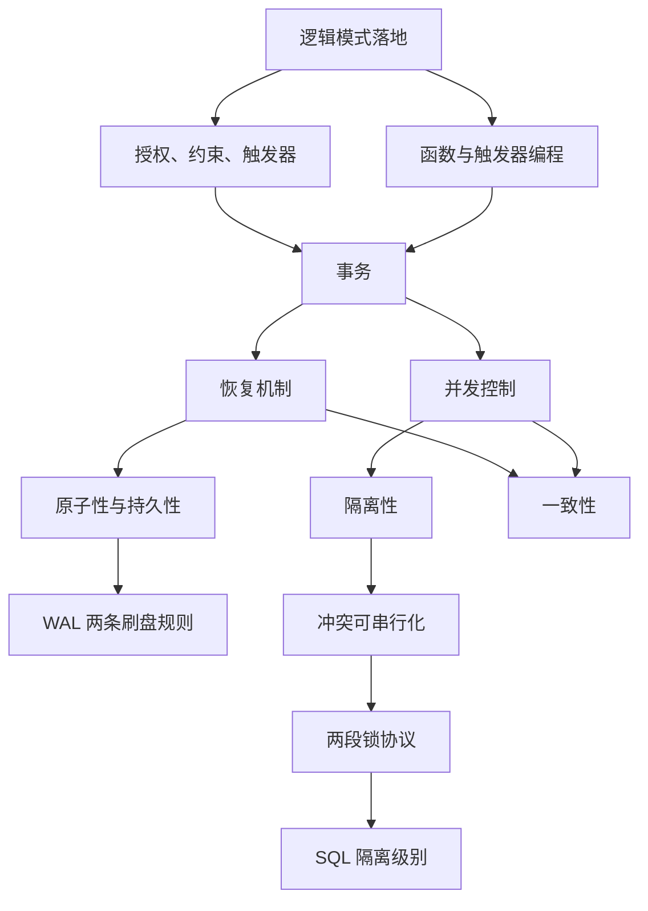
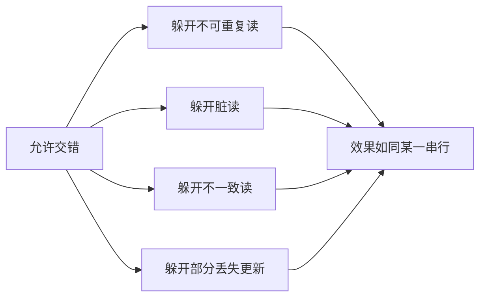
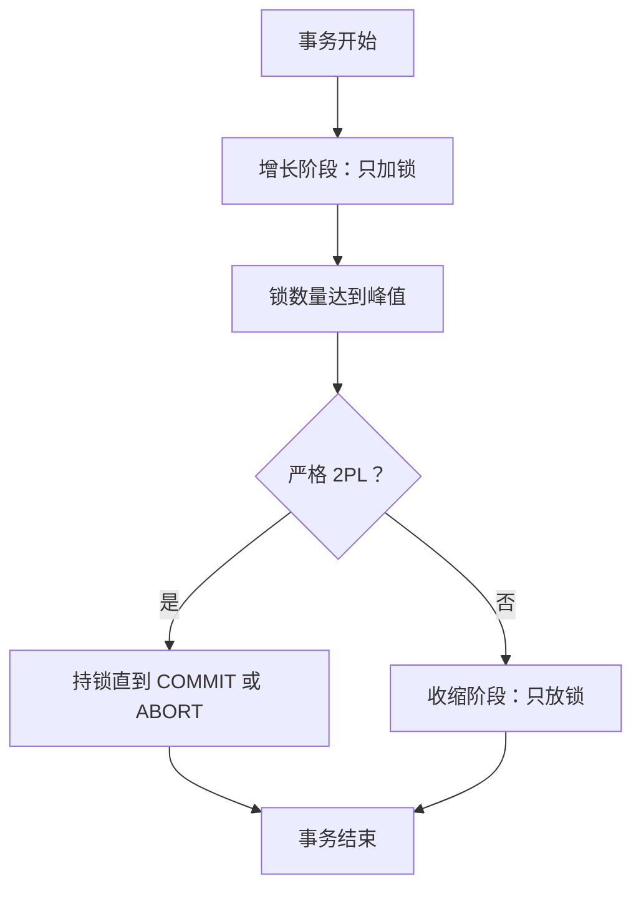
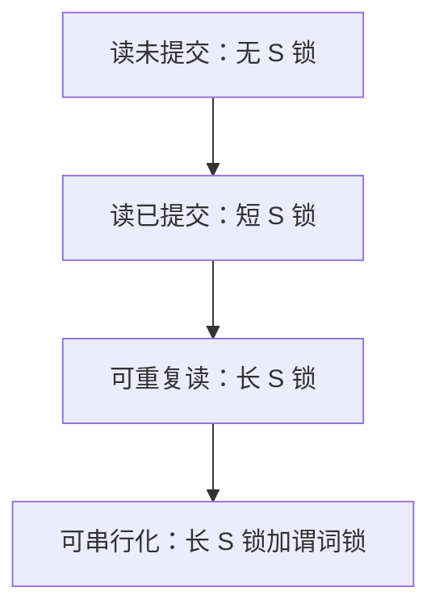
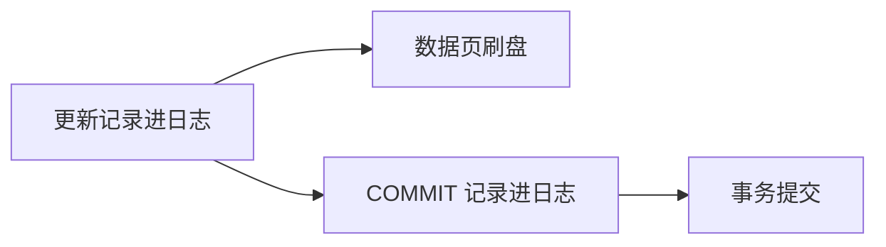

## 事务处理

逻辑模式落地、建表导入、SQL 编程与试运行之后，空间数据库进入运行维护：转储与恢复、安全性与完整性控制、性能监督。[安全与完整性](10-security-and-integrity.md) 管访问权限与完整性约束；[服务器编程](11-server-programming.md) 把检查写成函数与触发器。多条读写要捆成现实世界里的一笔：崩溃、用户取消、以及每秒上千并发之后，仍然要么全做要么全不做、彼此互不打扰、提交了就还在。

通用存储术语见 [数据库与数据存储](../../../tech/databases.md)。栏目总览见 [空间数据库](index.md)。

**事务**是反映一次现实世界状态迁移的、由一条或多条读写操作组成的序列。DBMS 有权交错以提高吞吐，但必须选出效果上如同串行的调度。



图中恢复管原子与持久，并发控制管隔离；二者加上事务逻辑本身写对，共同保证一致性。PostgreSQL 实际用多版本并发控制（MVCC），本页协议按锁调度讲述；引擎行为以官方文档为准。

## 事务

### 定义与捆法

操作包括读、写、更新、删除、插入。在现实中，一笔事务要么完整发生，要么完全没有发生。

-   **即席 SQL**：默认一条语句就是一个事务，自动提交（auto-commit）。
-   **程序中**：用 `START TRANSACTION` 或作为 SQL 语句的 `BEGIN;` 把多条语句捆在一起，以 `COMMIT` 提交或以 `ROLLBACK`（即 `ABORT`）回滚。

```sql
START TRANSACTION;
UPDATE Bank SET amount = amount - 100 WHERE name = 'Bob';
UPDATE Bank SET amount = amount + 100 WHERE name = 'Joe';
COMMIT;
```

转账必须 Bob 扣 100 与 Joe 加 100 一起提交或一起回滚：不能只扣不加，也不能只加不扣。这就是原子性的直观来源。

PL/pgSQL 函数体里的 `BEGIN … END` 是语句块，不是 `BEGIN TRANSACTION`。一个函数调用默认落在调用者的当前事务里。未捕获的 `RAISE EXCEPTION` 中止的是当前事务。详见 [服务器编程](11-server-programming.md)。

???+ note "事务边界写在 SQL 上"
    捆多条语句用 `START TRANSACTION` 或 `BEGIN;`。

    函数体内的 `BEGIN … END` 只圈过程块。

    未捕获异常中止当前事务，不留下半成品。

### 两个目标

把用户操作打成事务，同时服务两个目标：

1.  **恢复与持久**（Recovery & Durability）：崩溃、用户中止、关机之后，数据仍一致且已提交的结果还在。事务要么完整持久化，要么完全没有；用日志支持回滚。
2.  **并发**（Concurrency）：磁盘慢，CPU 不能空转，要交错执行多个事务以提高**吞吐**（单位时间完成的事务数），必要时牺牲单个事务的**延迟**；对外仍须像隔离执行，并保持一致性。

目录上，并发控制对应后文的调度、冲突可串行化、两段锁与隔离级别；日志恢复对应 WAL。

### 没有事务、没有隔离时

先把单价 \(\le 0.99\) 的商品插入 `SmallProduct`，再从 `Product` 删除它们。若插完即崩溃，商品同时存在于两张表。包进一个事务后，崩溃则整笔回滚，或按日志撤销已做部分，不会留下加了没删。

经理 1 对 Gizmo 减 1.99，经理 2 打五折。若两笔更新作为独立自动提交语句交错，同一商品上先减后折与先折后减数值不同：\(p-1.99\) 再 \(\times 0.5\) 不等于 \(p\times 0.5\) 再减 1.99。若表中有多件同名商品、两句 `UPDATE` 又不是同一事务，还可能出现有的行先减后折、有的行先折后减，最终价格集合不是任何一种先全体减再全体折或相反的串行结果。包进事务后，调度器必须选出等价于某一种串行次序的交错。后文账户加利息是同一现象的完整数字版。

## ACID

ACID 四字：

| 性质 | 英文 | 含义 |
| --- | --- | --- |
| 原子性 | Atomicity | 库中要么看见该事务的全部效果，要么全部看不见 |
| 一致性 | Consistency | 事务把满足完整性的状态迁到另一个满足完整性的状态 |
| 隔离性 | Isolation | 并发效果等同于事务一个接一个执行 |
| 持久性 | Durability | 一旦提交，效果在断电、崩溃后仍在 |

### 原子性

现实中的一笔不能做一半。事务只有两种结局：`COMMIT`（变更留下）或 `ABORT`（变更全部消失）。不能停在 Bob 已扣、Joe 未加。

### 一致性

表必须始终满足用户声明的完整性：账号唯一、库存非负、借贷合计为零。两人各 100 元，总额 200；转 20 元后变成 80 与 120，总额仍 200。总额变成 190 或 210 就是不一致。

一致性怎样来：程序员把事务写成一致状态到一致状态；系统保证原子性，从而不会停在中间。约束检查可以推迟到事务结束，与延迟约束同一思想：中间某行暂时违反总额为 200 是允许的，提交前必须恢复。详见 [安全与完整性](10-security-and-integrity.md)。

### 隔离性

事务与其它事务并发，但效果须如同各自单独执行。一个事务在运行中不应看见他人未按隔离规则暴露的中间结果。交叉执行可以发生，最终要等价于先做完 A 再做 B，或先做完 B 再做 A。

### 持久性

提交之后，效果必须留下：程序已退出、电源故障、主机崩溃，都不应丢已提交数据。实现上要把该写的内容落到磁盘。未提交的变更则相反：崩溃后必须撤掉。

### 分工

要在停电、用户中途取消、以及大量并发的前提下仍然满足 ACID，并且要有性能。用户取消按日志回滚；并发用锁或多版本。

| 性质 | 主要由谁保证 |
| --- | --- |
| 原子性、持久性 | DBMS 恢复机制（日志） |
| 隔离性 | DBMS 并发控制 |
| 一致性 | 并发控制加恢复；前提是事务逻辑本身写对 |

ACID 仍是极其成功的范式。部分系统放松其中若干条以换吞吐，选型时以所用引擎文档为准，不能只看名称。

## 并发、交错与异常

### 调度器的职责

DBMS 负责并发，使得：隔离性成立（每个用户可以当作只有自己在用库）；一致性成立（事务结束后库仍一致）。

**调度**（schedule）是来自全体事务的动作的一个交错序列。磁盘访问又慢又频繁时，若 \(T_A\) 在等磁头，CPU 空转，就把时间片给 \(T_B\)。交错提高的是吞吐，单个事务的延迟不一定变短。用户仍然把每个事务当作在隔离中执行。

两个用户各提交两笔内部有序的事务：\(T_1\) 在 \(T_2\) 前，\(T_3\) 在 \(T_4\) 前。事务粒度上相当于在四个时间槽中选两个给第一位用户，共 \(\binom{4}{2}=6\) 种交错。无交叉两种（一个用户做完再换另一个）隔离直观但吞吐差；交叉四种才是调度器真正要筛选的对象。系统可以选用交叉以提高吞吐，但不能破坏每位用户内部的先后，也不能破坏隔离与一致。这 6 种不都可串行化；可串行化还要看具体读写是否冲突。

### 转账加利息

每个动作从全局存储读一个值，再写回。

-   \(T_1\)：\(A \mathrel{+}= 100\)，\(B \mathrel{-}= 100\)（从 B 转 100 到 A）
-   \(T_2\)：\(A \mathrel{*}= 1.06\)，\(B \mathrel{*}= 1.06\)（两账户都计 6% 利息）

初值 \(A=50\)，\(B=200\)。数据库不规定必须 \(T_1\) 在 \(T_2\) 前或相反。若应用要求先转账再计息，开发者应把二者放进同一个事务，或在应用层保证提交顺序。调度的目标：交错以提高性能；提交或中止之后数据仍处于好状态。

串行 \(T_1\) 再 \(T_2\)：

$$
A:\ 50+100=150,\ 150\times 1.06=159;\quad
B:\ 200-100=100,\ 100\times 1.06=106.
$$

结果 \((159,106)\)。

**交错调度 A（好）。** 次序：\(A\mathrel{+}=100\)，\(A\mathrel{*}=1.06\)，\(B\mathrel{-}=100\)，\(B\mathrel{*}=1.06\)。仍得 \((159,106)\)，与串行 \(T_1,T_2\) 相同。

**交错调度 B（坏）。** 次序：\(A\mathrel{+}=100\)，然后把 \(T_2\) 做完（\(A,B\) 都乘 1.06），再 \(B\mathrel{-}=100\)：

$$
A=159;\quad B:\ 200\times 1.06=212,\ 212-100=112.
$$

结果 \((159,112)\)。相对串行 \(T_1,T_2\)，银行对 B 多付了 6 美元利息：先对未扣款的 200 计息，再扣 100。

串行 \(T_2\) 再 \(T_1\) 的结果是 \((153,112)\)。调度 B 与两种串行结果都不同，因此不可串行化。

| 调度 | \(A\) | \(B\) | 判定 |
| --- | --- | --- | --- |
| 串行 \(T_1 T_2\) | 159 | 106 | 可串行化的参照之一 |
| 串行 \(T_2 T_1\) | 153 | 112 | 可串行化的参照之二 |
| 好交错 A | 159 | 106 | 与 \(T_1 T_2\) 相同 |
| 坏交错 B | 159 | 112 | 对不上任何一种串行 |

并发在本页操作定义下就是：把各事务的读写作交错。某一种交错次序叫做一个调度。DBMS 有权交错，但必须选出仍保持隔离与一致的调度，亦即效果上如同串行。判可串行化时，拿最终状态去对这两种串行，对不上就是坏调度。

### 三个定义

-   **串行调度**（serial schedule）：不同事务的动作互不交错；一个事务的全部动作做完，再做下一个。
-   **等价调度**：对任意数据库初态，执行调度 \(A\) 与执行调度 \(B\) 对库的效果相同。
-   **可串行化调度**（serializable schedule）：与某一个串行执行等价。定义里的某一个使它既强又巧：不必指定是 \(T_1 T_2\) 还是 \(T_2 T_1\)，只要与其中之一相同即可。

串行调度一定可串行化；可串行化不必串行。

### 冲突

两个动作**冲突**（conflict），当且仅当：属于不同事务，涉及同一变量，且至少一个是写。对调这两个动作会改变程序行为。

同一事务内部的 \(R_i(X)\)、\(W_i(Y)\) 不叫事务间冲突。冲突的三种：

| 类型 | 记号 | 说明 |
| --- | --- | --- |
| 读–写 | RW | \(R_i(X)\) 与 \(W_j(X)\) |
| 写–读 | WR | \(W_i(X)\) 与 \(R_j(X)\) |
| 写–写 | WW | \(W_i(X)\) 与 \(W_j(X)\) |

两次只读同一变量，对调不改变任何人读到的值，也不改变最终库状态，故没有 RR 冲突。冲突本身不一定坏，好调度里同样有冲突。目标是在有冲突的交错里避免异常。

记号：\(R_i(X)\) 表示事务 \(i\) 读 \(X\)，\(W_i(Y)\) 表示事务 \(i\) 写 \(Y\)。

### 四类经典异常

**（1）不可重复读**（unrepeatable read）。\(T_1\) 读 \(A\)，\(T_2\) 读 \(A\)、写 \(A\) 并提交，\(T_1\) 再读 \(A\)。若只有 \(T_1\) 在跑，两次应读到同一值；现在第二次变成 \(T_2\) 写过的值。隔离性被破坏。

**（2）脏读**（dirty read）。\(T_1\) 写 \(A\) 后尚未提交（甚至随后中止），\(T_2\) 已读这个 \(A\) 并基于它再写、提交。\(T_2\) 读到的是临时值。\(A\) 原 100，\(T_1\) 写成 106 后中止，\(T_2\) 却已按 106 继续加过 20。对 \(T_2\) 而言，106 从来不是该存在于库中的最终值：要么应看见提交前的 100，要么应看见 \(T_1\) 真正提交后的值。脏读把未提交当成了事实。[服务器编程](11-server-programming.md) 里 `AFTER` 触发器抛异常回滚，正是为了不让别人读到这种半成品。

**（3）不一致读。** \(T_1\) 写 \(A\)，\(T_2\) 读 \(A\)、读 \(B\)，然后 \(T_1\) 才写 \(B\) 并提交。若 \(T_1\) 本意是 \(A,B\) 都变成 106，则 \(T_2\) 可能看见 \(A=106\) 而 \(B\) 仍为 100，总和既非全旧也非全新。

**（4）部分丢失更新**（partially-lost update）。\(T_1\) 写 \(A\)、写 \(B\)；中间插入 \(T_2\) 写 \(A\)、写 \(B\) 并提交。最终可能 \(A\) 留下 \(T_2\) 的值、\(B\) 留下 \(T_1\) 的值，谁的事务也没完整留下。转账加利息里，可能出现利息写在 \(A\) 上、转账写在 \(B\) 上。

并发控制的任务：允许交错，但躲开这四类异常。后文隔离级别再引入**幻行**（phantom）：扫描集合变了，已有行的值可以不变。



图后收成一句：吞吐来自交错，正确性来自可串行化。

## 冲突可串行化

可串行化是语义定义（效果相同），直接判定往往要跑遍初态。冲突可串行化给出可操作的充分条件。

### 冲突等价

两个调度**冲突等价**（conflict equivalent），当且仅当：涉及同一批事务的同一批动作；且每一对冲突动作在两个调度里的先后次序相同。

调度 \(S\) **冲突可串行化**（conflict serializable），当且仅当 \(S\) 与某个串行调度冲突等价。

蕴含关系：

$$
\text{冲突可串行化}\ \Rightarrow\ \text{可串行化}
$$

因此冲突可串行化即可保证隔离与一致（在本页的读写模型下）。它不是必要条件：存在可串行化但并非冲突可串行化的调度，本页不展开。

包含链：

$$
\text{串行}\ \subseteq\ \text{冲突可串行化}\ \subseteq\ \text{可串行化}
$$

串行调度一定冲突可串行化（它与自己冲突等价）。

等价说法：若通过反复交换相邻的、不冲突的动作，把 \(S\) 变成一个串行调度，则 \(S\) 冲突可串行化。不同变量上的动作、或两个读，都可以换；冲突对不能换。

好的交错里，关于 \(A\) 的冲突次序以及关于 \(B\) 的冲突次序，与某串行调度一致。坏的交错里，\(A\) 上像 \(T_1\) 先、\(B\) 上像 \(T_2\) 先，对任何串行次序都不符，从而制造上一节的异常。

好调度一例：\(T_1\) 读改 \(A\)，\(T_2\) 读改 \(A\)，\(T_1\) 读改 \(B\)，\(T_2\) 读改 \(B\)。\(T_1\) 写 \(A\) 与 \(T_2\) 读 \(B\) 不冲突，可交换。换若干次后变成 \(T_1\) 全部动作再加 \(T_2\) 全部动作，故与串行 \(T_1 T_2\) 冲突等价。坏调度无法只靠非冲突交换变成任何串行序。

### 冲突图

把事务收成结点。若 \(T_i\) 中某一动作在时间上先于 \(T_j\) 中某一动作，且二者冲突，则画有向边 \(T_i \rightarrow T_j\)。这样得到**冲突图**（conflict graph，优先图）。原先可能有 8 个读写动作，现在只有几个事务那么多个点。同一事务内的读写不画自环。

**定理：** 调度冲突可串行化，当且仅当其冲突图无环。

无环则必有拓扑序；拓扑序给出等价的串行次序。有环则不存在尊重全部冲突边的线性序，故不等价于任何串行调度。

不要把冲突图与后文的**等待图**（waits-for graph）混为一谈：前者判一份已经写下来的调度是否冲突可串行化；后者判锁调度器此刻有没有卡住。

判定步骤：

1.  把动作按时间摊成表。
2.  对每个变量找跨事务的 RW / WR / WW。
3.  建冲突图，判环。
4.  无环则拓扑排序，得到冲突等价的串行调度。

### 判定例子

以下 \(R_2(A)\) 表示事务 2 读 \(A\)，其余同。

**例 1。** 调度 \(R_2(A),\ R_1(B),\ W_2(A),\ R_3(A),\ W_1(B),\ W_3(A),\ R_2(B),\ W_2(B)\)。

-   关于 \(A\)：\(W_2(A)\) 在 \(R_3(A)\)、\(W_3(A)\) 之前，故 \(T_2\rightarrow T_3\)。
-   关于 \(B\)：\(R_1(B)\) / \(W_1(B)\) 在 \(R_2(B)\) / \(W_2(B)\) 之前，故 \(T_1\rightarrow T_2\)。

图：\(T_1 \rightarrow T_2 \rightarrow T_3\)，无环，冲突可串行化，等价于串行 \(T_1,T_2,T_3\)。

**例 2。** 调度 \(R_2(A),\ R_1(B),\ W_2(A),\ R_2(B),\ R_3(A),\ W_1(B),\ W_3(A),\ W_2(B)\)。

-   关于 \(A\)：仍有 \(T_2\rightarrow T_3\)。
-   关于 \(B\)：\(R_2(B)\) 在 \(W_1(B)\) 之前，故 \(T_2\rightarrow T_1\)；\(W_1(B)\) 又在 \(W_2(B)\) 之前，故 \(T_1\rightarrow T_2\)。

\(T_1\) 与 \(T_2\) 成环，不是冲突可串行化。

**例 3。** 全是读：\(R_1(A), R_2(B), R_3(A), R_2(A), R_3(C), R_1(B), R_3(B), R_1(C), R_2(C)\)。没有写，故没有任何冲突边，空图无环，冲突可串行化；任意串行序都冲突等价。这正是无 RR 冲突的极端情形。

**例 4。** \(W_1(A), W_2(A), W_1(B), W_3(B), W_1(C), W_3(C), W_2(C)\)。\(A\) 上 \(T_1\rightarrow T_2\)；\(B\) 上 \(T_1\rightarrow T_3\)；\(C\) 上 \(T_1\rightarrow T_3\)、\(T_3\rightarrow T_2\)。图为 \(T_1\rightarrow T_3\rightarrow T_2\) 且 \(T_1\rightarrow T_2\)，无环，冲突可串行化，等价于串行 \(T_1,T_3,T_2\)。

**五事务调度 S1。** 着色的格子是写，未着色的是读。跨事务冲突边包括：

| 数据项 | 先后 | 边 |
| --- | --- | --- |
| \(A\) | \(T_1\) 写，随后 \(T_2\) 读 | \(T_1\rightarrow T_2\) |
| \(B\) | \(T_1\) 写，随后 \(T_4\) 读 | \(T_1\rightarrow T_4\) |
| \(C\) | \(T_3\) 写，随后 \(T_2\) 读 | \(T_3\rightarrow T_2\) |
| \(D\) | \(T_2\) 写，随后 \(T_5\) 读 | \(T_2\rightarrow T_5\) |
| \(E\) | \(T_4\) 写，随后 \(T_5\) 写 | \(T_4\rightarrow T_5\) |

图无环，故冲突可串行化，因而可串行化。拓扑序不唯一：例如 \(T_3,T_1,T_4,T_2,T_5\) 或 \(T_1,T_3,T_2,T_4,T_5\)。\(T_5\) 总在最后，它是 \(D,E\) 两条链的汇。同一事务内即使再次读 \(A\)，也不增加事务间的边。后文把同一张调度放到 2PL 下逐步加锁。

### 调度器与实现分野

形式化好的交错之后，DBMS 里真正排出动作次序的模块叫**调度器**（scheduler），亦即并发控制管理器。厂商路线不同：

-   **加锁调度器**（locking scheduler）：悲观并发控制。对象上有锁；读写前必须获锁；锁被他人持有则等待；用完释放。SQLite、SQL Server、DB2 等走这类，粒度各异。用锁调度可保证冲突可串行化。
-   **多版本并发控制**（MVCC）：乐观并发控制。PostgreSQL、Oracle 走这类。文档见 [PostgreSQL Concurrency Control](https://www.postgresql.org/docs/current/mvcc.html)，以当前版本为准。

两段锁协议给出在线加锁规则，使执行完毕的调度落在冲突可串行化集合里，并处理死锁。对使用者，不必手写加锁；要理解的是隔离级别如何用读是否加锁、加多久来换并发。

## 两段锁协议

运行时不能先把全部调度画成图再决定是否放行，必须有一套在线规则，使凡是遵守该规则且执行完毕的调度都落在冲突可串行化集合里。主流实现是加锁调度器。写操作按最高级别（可串行化）理解；读操作可以降级，用正确性换并发。

### 排他锁与共享锁

事务在访问对象前要获得锁。

-   **排他锁**（exclusive lock，X 锁）：写之前必须获得。若事务 \(T_i\) 持有某对象的 X 锁，则任何其他事务对该对象既不能再拿 X 锁，也不能拿共享锁（S 锁）。
-   **共享锁**（shared lock，S 锁）：读之前必须获得。若事务 \(T_i\) 持有 S 锁，其他事务不能再拿该对象的 X 锁，但可以再拿 S 锁：读与读兼容。

兼容关系如下（行是已持有者 \(T_1\)，列是申请者 \(T_2\)；Y 表示可以授予，N 表示必须等待）：

| \(T_1 \backslash T_2\) | X | S | 无锁 |
| --- | --- | --- | --- |
| X | N | N | Y |
| S | N | Y | Y |
| 无锁 | Y | Y | Y |

已有人写，别人既不能读也不能写；已有人读，别人可以读但不能写；无人持锁，读写都可以。若某事务不加锁就去读写，读写不受限制，那是没有并发控制的情形，会回到脏读、不可重复读等异常。锁必须在使用前获得、在事务完成或按协议允许的时刻释放。

读写规则再述一遍：写之前拿 X 锁，若已有人持 S 或 X，则等待该事务完成；读之前拿 S 锁，若仅有人持 S 则可共享，若已有人持 X 则等待。

### 锁粒度

锁可以加在不同粗细的对象上：

-   **细粒度**：每条元组一把锁，甚至每个属性一把锁。冲突机会少，真正互不相干的两行可以并行，并发度高；代价是锁的数量随表增大，锁管理器负担重。SQL Server 等可以做到行级锁。
-   **粗粒度**：整张表一把锁，甚至整个数据库一把锁。锁数量极少，管理开销低；代价是**假冲突**（false conflict）：\(T_1\) 处理第 1 行、\(T_2\) 处理第 2 行，本可并行，却因整表一把锁而互相等待。SQLite 的典型策略是整个数据库一把排他锁：同一时刻实质上只有一个写者。

**锁升级**（lock escalation）：不必事先固定永远行锁或永远表锁，系统可按冲突情况动态调整粒度。粒度越细，并发越好、锁越多；粒度越粗，假冲突越多、管理越省。

整个数据库只有一把锁时，不可能形成 \(T_1\) 等 \(T_2\)、\(T_2\) 等 \(T_1\) 的环，因而 SQLite 这一路不会死锁；行级锁则可能死锁，需要预防或检测。

锁通常加在属性（数据项）上，例如关系有属性 \(A,B\)，可分别对 \(A\)、\(B\) 加锁。

### 增长与收缩

**两段锁协议（2PL）**的核心是获得锁与释放锁的时间形状。横轴为时间，纵轴为该事务当前持有的锁的数量：

-   **增长阶段**（growing phase）：锁的数量只增不减，只能申请新锁，不能释放。
-   **收缩阶段**（shrinking phase）：锁的数量只减不增，只能释放，不能再申请任何新锁。

因此：一旦开始释放任何一把锁，就不能再获得额外的锁。增长与收缩之间有一个锁数量达到峰值的分界；峰值之后锁数量可以一次性掉到零，也可以阶梯式一把一把放。两种都是 2PL，差别在严不严格。

**严格两段锁（Strict 2PL）**：所有锁只在事务 `COMMIT`（且提交记录已刷到稳定存储）或 `ABORT` 时释放。图上表现为增长阶段之后一条垂直下落：事务结束的瞬间把锁全部丢掉。若在事务中途先放 \(A\) 的锁、过一会儿再放 \(B\) 的锁，则只是普通 2PL，不是严格 2PL。



图中严格 2PL 把收缩压到提交或中止；普通 2PL 允许中途放锁。

结论：

-   遵守严格 2PL 的调度一定冲突可串行化，因而可串行化，隔离性与一致性成立，并且**可恢复**（recoverable）。
-   实现相对直接，对用户透明。
-   它只产生冲突可串行化调度的一个子集：有些冲突可串行化调度并不遵守严格 2PL，系统不会生成它们。
-   若调度遵守 2PL 且执行完毕，则冲突可串行化；但 2PL 可能死锁，死锁时调度到不了完成。

### 普通 2PL 可串行化但不可恢复

记号：\(L_i(X)\) 表示事务 \(T_i\) 对 \(X\) 加锁，\(U_i(X)\) 表示解锁。

\(T_1\) 先对 \(A\)、\(B\) 加锁，读 \(A\)，把 \(A\) 写成 \(A+100\)，然后提前释放 \(A\) 的锁。此时 \(T_2\) 可以获得 \(A\) 的锁，读到已经被加过 100 的 \(A\)，再写成 \(A\times 2\)。但 \(T_1\) 仍持有 \(B\) 的锁，\(T_2\) 申请 \(B\) 时必须等待。\(T_1\) 继续读 \(B\)、写成 \(B+100\)、释放 \(B\)。\(T_2\) 这才拿到 \(B\)，读、写成 \(B\times 2\)，最后把 \(A\)、\(B\) 的锁一起释放。

对照协议：\(T_2\) 在全部做完之后才放锁，形状像严格 2PL；\(T_1\) 在尚未结束时就放了 \(A\)，只满足先增长后收缩的 2PL，不满足严格 2PL。若改成严格 2PL，\(U_1(A)\) 必须挪到 \(T_1\) 提交或终止之后。

若 \(T_1\) 最终没有提交（用户取消、语句出错、系统中止）：\(T_1\) 对 \(A\) 的 \(+100\) 是未提交更新。\(T_2\) 已经读走并基于它做了 \(\times 2\)。这就是脏读。即使按冲突关系看起来像 \(T_1\) 在 \(T_2\) 之前，结果也不再对应先完整做完 \(T_1\) 再做 \(T_2\)，因为 \(T_1\) 的效果被撤销了，\(T_2\) 却用了半成品。普通 2PL 并不保证可恢复。

要消灭这类异常：在提交或终止之前不得释放锁。这正是严格 2PL。此时若 \(T_1\) 最终 abort，\(T_2\) 根本拿不到 \(A\) 上那把锁，不会读到半成品。

???+ warning "提前放锁会脏读"
    普通 2PL 完成的调度冲突可串行化，仍可能不可恢复。

    严格 2PL 把全部锁留到 COMMIT 或 ABORT，挡住脏读。

### 死锁与等待图

即使遵守 2PL，仍可能死锁。

1.  \(T_1\) 对 \(A\) 加 S 锁，读 \(A\)。
2.  \(T_2\) 对 \(B\) 加 S 锁，读 \(B\)。
3.  \(T_2\) 要对 \(A\) 加 X 锁以便写入，发现 \(T_1\) 持有 \(A\) 的 S 锁，于是等待 \(T_1\)。
4.  \(T_1\) 要对 \(B\) 加 X 锁以便写入，发现 \(T_2\) 持有 \(B\) 的 S 锁，于是等待 \(T_2\)。

\(T_1\) 等 \(T_2\)，\(T_2\) 等 \(T_1\)，谁也无法前进。

**等待图**（waits-for graph）：结点是事务；若 \(T_i\) 正在等待 \(T_j\) 释放某把锁，则有边 \(T_i \to T_j\)。图中有向环当且仅当时刻上存在死锁。冲突图有环推出不可串行化；等待图有环推出死锁。两套图不要并成一句。

处理死锁的两条路：

-   **预防**（prevention）：加锁前判断，避免进入会成环的等待。
-   **检测**（detection）：运行中周期性地根据当前等待关系建图；一旦发现环，中止环上某一个事务。被中止者释放已持有的锁，等待它的事务可以继续；完成后再重做被中止的事务。

### 五事务逐步加锁

把上一节那张五事务调度放到 2PL 下逐步执行。\(L=\) 加锁，\(U=\) 解锁。

| 步骤 | 动作 | 说明 |
| --- | --- | --- |
| 0 | \(T_1\)：\(X(A)\)，\(w_1(A)\) | \(T_1\) 持有 \(A\) 的排他锁并写入 |
| 1 | \(T_2\) 申请 \(S(A)\) | \(A\) 上已有 X 锁，\(T_2\) 等待 \(T_1\) |
| 2 | \(T_1\)：\(X(B)\)，\(w_1(B)\)，然后释放 \(B,A\) | 严格 2PL：做完才放；等待图上 \(T_2 \to T_1\) 在这一步被拆掉 |
| 3 | \(T_2\) 获得 \(S(A)\)，\(r_2(A)\) | \(T_1\) 已结束，共享锁可授予 |
| 4 | \(T_3\)：\(X(C)\)，\(w_3(C)\)，释放 \(C\) | \(C\) 无人持锁 |
| 5 | \(T_2\)：\(S(C)\)，\(r_2(C)\) | \(T_3\) 已放锁，可读 \(C\) |
| 6 | \(T_4\)：\(S(B)\)，\(r_4(B)\) | \(B\) 空闲 |
| 7 | \(T_2\)：\(X(D)\)，\(w_2(D)\)，释放 \(A,C,D\) | \(D\) 空闲；\(T_2\) 结束 |
| 8 | \(T_4\)：\(X(E)\)，\(w_4(E)\)，释放 \(B,E\) | \(T_4\) 结束 |
| 9 | \(T_5\)：\(S(D)\)，\(r_5(D)\) | |
| 10 | \(T_5\)：\(X(E)\)，\(w_5(E)\)，释放 \(D,E\) | \(T_5\) 结束 |

真实执行顺序不必等于请求发出的书面顺序：例如 \(T_2\) 的 \(r_2(A)\) 被推迟到 \(T_1\) 写完 \(B\) 并释放之后。这正是锁的作用：把冲突操作排成可串行化的次序。步骤 1–2 期间等待图有边 \(T_2 \to T_1\)，无环，不是死锁。

加锁再加 2PL / 严格 2PL 保证：只要调度执行完毕，就是冲突可串行化的；死锁是执行不完的那一支。SQLite 锁住整个库，一把排他锁，无死锁；SQL Server、DB2 等行级锁，需周期检测环并中止事务。

## 隔离级别

### 可串行化与四级折中

**可串行化**（serializability）：操作可以交错，但效果必须等价于事务的某一种串行次序。完全按可串行化跑，加锁时间长、并发低。SQL 标准把隔离拆成四级，用允许哪些不一致换性能：

1.  **读未提交**（Read Uncommitted）
2.  **读已提交**（Read Committed）
3.  **可重复读**（Repeatable Read）
4.  **可串行化**（Serializable）

隔离级别是每个事务自己的属性：创建事务时设定，只约束我自己的读必须符合这一级，不直接规定别人用哪一级。写按最高级理解。PostgreSQL 的实现与锁调度并不相同，以 [Transaction Isolation](https://www.postgresql.org/docs/current/transaction-iso.html) 为准。

```sql
SET TRANSACTION ISOLATION LEVEL REPEATABLE READ;
```

### 脏读、不可重复读、幻行

这三种用来给四级贴标签。

**脏读。** 数据项被一个尚未提交的事务写过，称为脏。\(T_1\) 写 \(A\)，\(T_2\) 读 \(A\) 并基于它再写、再提交，随后 \(T_1\) 中止。\(T_2\) 用的是从未进入数据库的值，结果错误。

**不可重复读。** 同一事务两次读同一数据项，得到不同值。例如 \(T_1\) 先读 \(A\)，\(T_2\) 改 \(A\) 并提交，\(T_1\) 再读 \(A\) 发现变了。其他事务的提交已经漏进 \(T_1\) 的执行过程，隔离性被破坏。

**幻行**（phantom rows）。更新已有元组（静态集合）时，行级 X 锁可以挡住别人改这一行；插入、删除（动态集合）则不同：新插入的行事先不存在，因而对这一行加锁无从谈起。库中已有两件蓝色商品 \(A_1,A_2\)。\(T_1\) 读出全部蓝色商品；\(T_2\) 插入一件新的蓝色商品 \(A_3\)；\(T_1\) 再读蓝色商品，变成 \(A_1,A_2,A_3\)。\(A_1,A_2\) 的颜色并未被更新，冲突图上甚至可以仍是冲突可串行化的，但 \(T_1\) 两次扫描的集合变了。

幻象是一个元组，在事务执行的某些时刻不可见，在整个执行过程中又是可见的。行级锁下：\(T_1\) 读产品列表时锁住已有各行；\(T_2\) 插入新产品不必去抢那些已有行的锁，插入成功；\(T_1\) 再读就多出一行。删除若碰上已有行的 S 锁，通常会被挡住；特别麻烦的是插入。

处理幻行的手段：

-   锁住整张表（关系不能增加新行）；
-   若有索引，锁住谓词对应的索引项（例如锁住关键字 `blue`，蓝色商品不能再增加）；
-   或使用**谓词锁**（predicate lock）：对任意谓词加锁。

脏读是未提交；不可重复读是同一行值变了；幻读是集合里多了或少了行，旧行可以完全没被 `UPDATE`。

### 读未提交：可以读脏数据

读未提交相当于读时不加任何 S 锁。本事务可以读脏数据、两次读不一致、也可以看见幻行。并发最高，锁管理负担最低，正确性最弱。

\(T_1\) 以可串行化方式把学生 GPA 乘以 1.1（写走最高级）；\(T_2\) 以读未提交求平均 GPA。因为 \(T_2\) 不加锁，可以插到 \(T_1\) 更新的中途：一部分学生已经 \(\times 1.1\)，一部分还没有。

关系 \(R(A)\) 含两个元组 \(\{(1),(2)\}\)。

```sql
-- T1（写，可串行化）
UPDATE R SET A = 2 * A;

-- T2（读未提交）
SELECT AVG(A) FROM R;
```

若 \(T_2\) 为读未提交，可能的平均值：

-   串行 \(T_2 \to T_1\)：\(\mathrm{avg}(1,2)=1.5\)
-   串行 \(T_1 \to T_2\)：\(\mathrm{avg}(2,4)=3\)
-   \(T_1\) 只改完第一行 \(1\to 2\)、第二行仍为 2 时插入 \(T_2\)：\(\mathrm{avg}(2,2)=2\)
-   \(T_1\) 只改完第二行 \(2\to 4\)、第一行仍为 1 时插入 \(T_2\)：\(\mathrm{avg}(1,4)=2.5\)

因此 \(1.5,2,2.5,3\) 都可能。这是四级里最低的隔离、最高的性能。

### 读已提交：不再脏读，仍不可重复

读已提交：禁止脏读，但同一事务两次读仍可以不同，也不保证全局可串行化。

\(T_1\) 仍把 GPA \(\times 1.1\) 后提交；\(T_2\) 在读已提交下执行两条语句，都是 `SELECT AVG(GPA)`。可能的语句次序是先读一次，然后 \(T_1\) 的更新并提交，再读一次。于是第一次得到 3.0，第二次得到 3.3：同一事务里两次聚集结果不同。

\(R(A)\) 与 \(S(B)\) 都含 \(\{(1),(2)\}\)。

```sql
-- T1
UPDATE R SET A = 2 * A;
UPDATE S SET B = 2 * B;

-- T2（读已提交）
SELECT AVG(A) FROM R;   -- 语句 3
SELECT AVG(B) FROM S;   -- 语句 4
```

把 \(T_1\) 的两句记为 1、2，\(T_2\) 的两句记为 3、4。同一事务内部语句次序固定（只能 1 再 2，只能 3 再 4）；事务之间可以交错。

串行结果：

-   \(T_1 \to T_2\)：\((\mathrm{avg}\,A,\mathrm{avg}\,B)=(3,3)\)
-   \(T_2 \to T_1\)：\((1.5,1.5)\)

读已提交还允许：\(T_2\) 先执行语句 3（此时 \(T_1\) 尚未提交，读到 \(1.5\)），\(T_1\) 随后提交，再执行语句 4（读到 \(3\)），得到 \((1.5,3)\)。这不是任何一种串行次序。

得不到 \((3,1.5)\)。若语句 3 已经读到 3，说明 \(T_1\) 已经提交（读已提交看不到未提交的 \(R\)）；而 \(T_1\) 先改 \(R\) 再改 \(S\)，提交时 \(S\) 也已更新，语句 4 只能是 3。不能单靠调换 \(T_2\) 内部两句来制造 \((3,1.5)\)。

结论：读已提交下可能结果为 \((1.5,1.5)\)、\((3,3)\)、\((1.5,3)\)。

### 可重复读：值不变，集合仍可变

可重复读：不脏读；同一数据项多次读取值不变（挡住了前两种问题）；仍不保证全局可串行化，因为关系可以因插入而产生幻行。

用加锁理解：\(T_2\) 读过的行一直持有 S 锁直到事务结束，\(T_1\) 无法在中途改这些行。像读已提交那样把 \(T_1\) 整段插在 \(T_2\) 两次读之间，会破坏已读项值不变，可重复读不允许。

幻行仍然可以。\(T_1\) 插入 100 条新学生；\(T_2\) 先 `AVG(GPA)` 再 `MAX(GPA)`。平均、插入、最大这一次序在可重复读下可行：插入的是新行，不必去抢 \(T_2\) 已经锁住的旧行，于是平均与最大可以分别落在插入前后，整体不可串行化。

\(R(A)=\{(1),(2)\}\)。

```sql
-- T1
UPDATE R SET A = 2 * A;
INSERT INTO R VALUES (6);

-- T2（可重复读）
SELECT AVG(A) FROM R;
SELECT AVG(A) FROM R;
```

串行结果：\(T_2 \to T_1\) 两次平均都是 \(1.5\)；\(T_1 \to T_2\) 关系变成 \(\{2,4,6\}\)，两次平均都是 \(4\)。

\(T_1\) 的 `UPDATE` 插不进 \(T_2\) 的两次 `SELECT` 之间。可重复读要求两次读到的已有元组一致，\(T_2\) 第一次扫描后持有这些行的长时 S 锁，\(T_1\) 的更新拿不到 X 锁，会被推迟到 \(T_2\) 结束之后。因此不会出现第一次平均 1.5、第二次平均 4 这种把更新夹在中间的结果。可能结果就是 \(1.5\) 与 \(4\)。

只读事务（Read Only）与隔离级别独立，用于让系统优化，例如少维护写锁：

```sql
SET TRANSACTION READ ONLY;
SET TRANSACTION ISOLATION LEVEL REPEATABLE READ;
SELECT AVG(GPA) FROM Student;
SELECT MAX(GPA) FROM Student;
```

### 四级对照与加锁理解

Y 表示该级可能出现该异常：

| 隔离级别 | 脏读 | 不可重复读 | 幻行 |
| --- | --- | --- | --- |
| Read Uncommitted | Y | Y | Y |
| Read Committed | N | Y | Y |
| Repeatable Read | N | N | Y |
| Serializable | N | N | N |

用锁来记（写锁一律长时，即严格 2PL；只改读锁策略）：

| 隔离级别 | 读锁 | 是否 2PL | 幻行 |
| --- | --- | --- | --- |
| Read Uncommitted | 不加 S 锁；只读事务几乎不等待 | 读侧不是 2PL | 可能 |
| Read Committed | 读前加 S 锁，读完即放（短时读锁） | 读侧不是 2PL | 可能 |
| Repeatable Read | 读前加 S 锁，事务结束才放（长时读锁） | 读写都是严格 2PL | 仍可能 |
| Serializable | 长时 S 锁加严格 2PL，再加谓词锁 / 表锁 / 索引项锁 | 是 | 不允许 |

读已提交的锁数量随时间可以起伏多次，不满足先增长后收缩，所以它不是 2PL。这与写仍用严格 2PL 不矛盾：写锁长时持有，读锁短时。



图中每一级多禁一种异常：读已提交禁脏读，可重复读禁不可重复读，可串行化再禁幻行。

标准默认是 Serializable。较弱级别：并发升、锁开销降、性能升，一致性保证变弱。有的系统默认 Repeatable Read。商业库里默认常常不是可串行化，因为效率优先，可能落在第二或第三级。Serializable 在锁调度里保证的是隔离，并不单独等于原子性。有的引擎根本不用锁，同一级名字下的异常集合会不同。使用前读所用 DBMS 的文档。PostgreSQL：`SET TRANSACTION ISOLATION LEVEL …`；默认隔离以当前版本文档为准，不要假定一定是 Serializable。

## 日志与先写日志

### 磁盘事实与日志的动机

顺序读快于随机读，顺序写快于随机写，这是 [空间存储与索引](07-storage-and-index.md) 的物理前提。保证可恢复性的办法是另开一个**日志文件**（log）：任何数据项的改动都追加一条紧凑记录，顺序写到文件末尾。

系统把存储分成两套互相独立的页：

-   **数据页**：乐观地在内存里改；不把每一次更新立刻随机写回磁盘，而是攒一批、或在事务某个阶段再刷。
-   **日志页**：记下谁、把哪一项、从旧值改成新值。服务由 DBMS 提供，对应用透明。

一条物理日志记录的内容为：

$$
\langle \textit{TransactionID},\; \textit{location},\; \textit{old data},\; \textit{new data} \rangle
$$

有旧值就可以 **UNDO**（用旧值覆盖新值）；有新值就可以在需要时 **REDO**。追加永远发生在文件尾，顺序写远快于把数据页随机写回各自扇区。

数据盘与日志盘分开。一般用两块磁盘。若数据与日志在同一块盘上，盘坏则自上一次备份以来的全部更新与日志一起消失，备份无法补出本月新数据。若日志独立，数据盘坏时可以用定期备份加日志盘重建当前状态；数据盘未坏、只是要归档时，则备份数据文件，日常更新只追加日志。

### 为何不能整事务结束再写盘

若内存与时间都无限：可以把一个事务的全部更新只留在内存，提交时一次性写盘；崩溃发生在写盘前，等于事务没发生，原子性自然成立。两条现实约束使这条路走不通：

-   **内存**：银行要处理的账户可能超过内存，必须读进一部分、处理、写回一部分。
-   **时间**：一个事务可能跑很久，不能让所有脏页等到事务结束才落盘。

于是磁盘上会出现同一事务里一部分更新已在数据文件里、一部分还只在内存的中间态。崩溃（掉电、进程退出）后必须知道哪些做了、哪些没做。日志按记录撤销未完成事务的部分更新，或重做已提交但数据页未刷完的更新。

### WAL 的两条刷盘规则

**WAL**（Write-Ahead Logging）：先写日志，再写数据。

对每次记录更新：先把更新记录写入日志（可先在内存日志页），再按下面两条 Flush 规则决定何时把日志、数据刷到磁盘。

**规则 1（服务于持久性）。** 对应的数据页刷到磁盘之前，必须先把该条更新记录刷到日志磁盘。顺序是：日志里的 \(\langle T, A, 0, 1\rangle\) 先落地，数据文件里的 \(A=1\) 后落地。

**规则 2（服务于原子性）。** 事务提交之前：把该事务的全部更新记录刷到日志，再把 COMMIT 记录刷到日志。事务在 COMMIT 记录进入稳定存储的那一刻才算提交。

时间轴：Flush 更新记录到 LOG →（可以稍后）Data Flush → Flush COMMIT 记录到 LOG → 事务 COMMIT。



图中规则 1 挡住数据页先于对应日志落地；规则 2 挡住在 COMMIT 记录进稳定存储之前向外界宣告提交。

\(T\) 读 \(A=0\) 再写 \(A=1\)。若已把日志刷盘、数据页尚未刷盘时崩溃：内存没了，但日志里有 \(0\to 1\)，可以重做，\(A\) 最终为 1，持久性仍在。

两条规则合起来：改数据文件之前先改日志文件；日志内部则先写更新、再写提交。PostgreSQL 的实现见 [Write-Ahead Logging](https://www.postgresql.org/docs/current/wal.html)。

???+ warning "两条规则缺一不可"
    规则 1：数据页落地前，对应更新记录必须已在日志盘。

    规则 2：提交前，全部更新记录与 COMMIT 记录必须已在日志盘。

    事务在 COMMIT 记录进入稳定存储的那一刻才算提交。

### 两种错误的提交协议

**错误协议 1：日志和数据都还在内存就宣告提交。** 此时崩溃，内存中的 \(A=1\) 与尚未落地的日志一起消失，磁盘上仍是 \(A=0\)。若从未告诉外界已提交，这相当于事务没发生，重做该事务即可。若已经向用户返回提交成功，则持久性被打破：系统说做完了，盘上却没有。

**错误协议 2：先写数据页、后写日志（与规则 1 相反）。** 数据文件已是 \(A=1\)，日志里还没有提交记录（甚至没有更新记录）时崩溃。盘上的值已经是新的，但恢复程序从日志看不出该事务是否提交、做到哪一步。缺失记录意味着无法判断对错，部分完成时尤其危险。

### 月结利息：长事务中途崩溃

每月给全部账户加 10% 利息（金额 \(\times 1.10\)）。凌晨开始，约 1000 万账户，要跑约 24 小时。无故障时：数据文件里各账户余额变为 1.1 倍；日志里对每个账户有一条原金额到新金额，最后有 COMMIT。

故障：中午前网络或系统中断，一刻钟后才再访问。此时有的账户已经 \(\times 1.1\)，有的还没有。没有日志就无法知道事务完成了没有、哪些元组是半成品。日志里若没有 COMMIT，则该事务未完成，恢复步骤是：

1.  **回滚未提交事务**：按日志反向，用旧值覆盖新值，回到事务开始前的一致状态；
2.  需要时再 **REDO** 近期已提交事务；
3.  通知开发该事务已中止，恢复营业后重新执行整段涨利息。

这保证原子性：事务要么全做，要么全不做。恢复时另有账户存入等并发更新，要分清哪些属于未提交的月结、哪些属于已经提交的别的事务：依据仍是日志里有没有相应 COMMIT。

最坏情况下更新一千万账户约等于一千万次寻道。按每次寻道约 10 ms 计，合计约 100000 秒。日志则是一次寻道到文件末尾，再顺序追加一千万条记录，写日志大约 1 秒量级。提交路径的加速来自先顺序写日志就算提交成功，数据页可以稍后在方便时再懒惰写回。

### 恢复小结

-   若数据库声明事务已提交，崩溃后其效果仍在（持久性）。
-   数据库按日志撤销，帮助实现原子性。
-   本页写清 WAL 与（严格）2PL 两条协议；实现上还有其他并发与恢复方案，以所用引擎文档为准。

## 机制对应

四条性质与本页机制的对应：

| ACID | 主要靠什么 |
| --- | --- |
| 原子性 Atomic | 写日志；崩溃后 UNDO 未提交、必要时 REDO |
| 一致性 Consistent | 程序员把事务写成一致状态到一致状态；系统用并发控制加恢复一起保证 |
| 隔离性 Isolation | 可串行化；实现上常用冲突可串行化；运行时用 2PL 或 MVCC |
| 持久性 Durable | WAL：提交前日志（含 COMMIT 记录）进入稳定存储 |

设计选择：是否写更新日志（例如 WAL）；串行执行，还是交错但可串行化。本页的答案是：日志加交错加可串行化（2PL / 隔离级别）。

空间数据库设计流程里，本页对应运行维护中的转储与恢复、在并发负载下保持完整性；与 [安全与完整性](10-security-and-integrity.md)、[服务器编程](11-server-programming.md) 一起，构成逻辑模式落地之后的运行时保障。顺序写远快于随机写，是 WAL 先追加日志、数据页稍后懒写的物理前提；B+ 树的并发与恢复已经在 DBMS 里，不必为空间索引重写 OLTP，见 [空间存储与索引](07-storage-and-index.md)。查询规划选嵌套循环 / 排序合并 / 哈希连接，发生在一条语句内部；本页管的是多条语句、多个用户之间的交错。

协议口径：

-   冲突可串行化 \(\Rightarrow\) 可串行化；2PL 完成 \(\Rightarrow\) 冲突可串行化；2PL 可能死锁。严格 2PL 额外保证可恢复；普通 2PL 提前放锁会脏读。
-   四级：写锁始终长时；读未提交无 S 锁；读已提交短 S 锁（读侧非 2PL）；可重复读长 S 锁（仍可能幻行）；可串行化再加谓词 / 表 / 索引项锁。
-   WAL 两条：数据页落地前，对应更新记录必须已在日志盘；提交前，全部更新记录与 COMMIT 记录必须已在日志盘。先写数据后写日志则盘上已改、日志看不出是否提交。
-   隔离级别是当事事务的属性；商业库默认往往不是 Serializable；同名级别在 MVCC 上的异常集合可能与锁表不完全相同。用前读文档。
-   调度器不对 \(T_1,T_2\) 的业务先后自作主张；要先转账再计息，开发者应合并事务。

## 相关阅读

-   [安全与完整性](10-security-and-integrity.md)
-   [服务器编程](11-server-programming.md)
-   [空间数据库](index.md)
-   [数据库与数据存储](../../../tech/databases.md)

## 来源说明

本页根据 Silberschatz、Korth 与 Sudarshan《Database System Concepts》（DSC）事务章节整理，并对照空间数据库课程讲义第 12 章。账户转账加利息的调度数字、冲突图判定、严格 2PL、SQL 四级隔离的可能结果、以及 WAL 两条刷盘规则以 DSC 文本与讲义推导为准。PostgreSQL 使用 MVCC，隔离级别与 WAL 的引擎行为以官方文档为准，不要把锁表当成 PostgreSQL 内部实现。

-   Abraham Silberschatz, Henry F. Korth, S. Sudarshan, *Database System Concepts*, 7th ed., McGraw-Hill, 2020。重点参见第 4.3 节（SQL 中的事务）、第 14 章 Transactions（事务概念、并发执行、可串行化、可恢复性、隔离级别）、第 15 章 Concurrency Control（基于锁的协议、死锁、谓词锁与弱隔离）、第 16 章 Recovery System（故障分类、WAL、UNDO / REDO）。配套站点 [db-book.com](https://www.db-book.com/)。
-   [PostgreSQL Concurrency Control](https://www.postgresql.org/docs/current/mvcc.html)
-   [PostgreSQL Transaction Isolation](https://www.postgresql.org/docs/current/transaction-iso.html)
-   [PostgreSQL Write-Ahead Logging](https://www.postgresql.org/docs/current/wal.html)
-   [`SET TRANSACTION`](https://www.postgresql.org/docs/current/sql-set-transaction.html)

条文、标准与产品功能以官方文本为准；本页核验日期为 2026-09-04。
