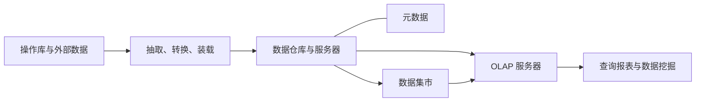
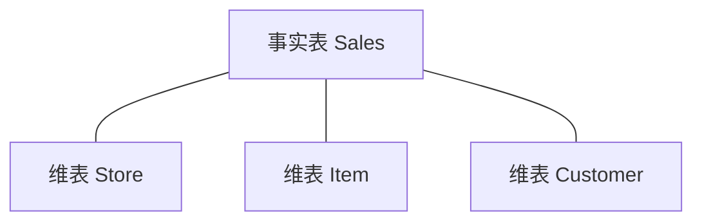
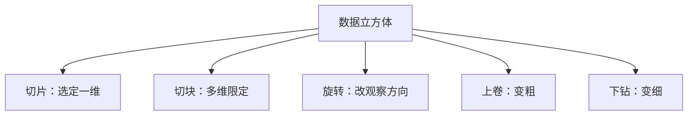
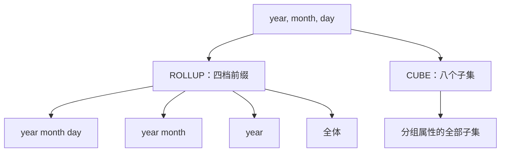

## 联机分析处理

[空间数据库](index.md) 栏目主线从关系与 [SQL](03-sql.md)、几何对象与 PostGIS，经扩展 E/R、规范化、存储索引、查询处理与空间网络，落到权限、服务器编程与 [事务处理](12-transactions.md)。几何类型、九交谓词、R 树、路网最短路与事务的原子性和持久性构成这条主线；本页的联机分析处理接在事务之后，讨论如何把已经落好的关系抽到仓库、按维做聚集。主线各篇的存储、查询与验收不依赖本页。

**OLAP**（OnLine Analytical Processing，联机分析处理）由 E. F. Codd 于 1993 年提出，是以海量数据为基础的复杂分析技术。软件提供多维观察与辅助决策。深层次发现数据中隐含的规律交给数据挖掘；OLAP 停留在多维观察、聚集与即席查询。二者可以接在同一条仓库流水线的前台，本页只讲 OLAP。


事务篇管日常短事务怎么保持正确；本页管把操作型数据抽到仓库之后，怎样按维切片、上卷，并用 `CUBE` / `ROLLUP` 一次求出多层分组。

## 定义与数据仓库

### 联机事务与联机分析

把业务库上的短事务和仓库上的分析对照。

| 对照项 | OLTP | OLAP |
| --- | --- | --- |
| 全称 | Online Transaction Processing，联机事务处理 | OnLine Analytical Processing，联机分析处理 |
| 事务形态 | 短事务 | 长事务 |
| 查询 | 简单查询 | 复杂查询 |
| 数据触及面 | 触碰少量数据 | 触碰大量数据 |
| 更新 | 频繁更新 | 更新不频繁 |

银行转账、隔离级别与预写式日志落在 OLTP 一侧，见 [事务处理](12-transactions.md)。销售额立方体、按州与品牌汇总、物化 `CUBE` 落在 OLAP 一侧。

讲义小结页还有一张更细的对照，面向、访问模式、数据类型与组织方式一并列出：

| 对照项 | OLTP | OLAP |
| --- | --- | --- |
| 面向 | 日常事务处理 | 统计分析与决策 |
| 访问模式 | 增删改查；简单小事务，操作少量数据 | 复杂查询、即席查询；复杂聚合，操作大量数据 |
| 数据类型 | 最新数据 | 历史数据 |
| 数据规模 | GB | TB、PB |
| 数据更新 | 实时更新 | 批量更新 |
| 数据组织 | 第三范式 | 星型模型或扁平数据 |

OLAP 一侧要同时记住星型模式、数据立方体、`CUBE` / `ROLLUP`，以及为这类查询准备的特殊索引、查询处理与物化视图。

### 数据仓库与决策支持

**数据仓库**（data warehousing）：把来自操作型（OLTP）数据源的数据，收进一个仓库，供 OLAP 分析使用。业务库要保证短事务与完整性，不宜在生产库上直接跑扫全表、按多维聚集的长查询；分析侧需要历史数据、批量装载、面向主题的组织。

**决策支持系统**（Decision Support System，DSS）：数据分析的基础设施。为 OLAP 调过的数据仓库是其中一类实现。

### 仓库体系结构

仓库画成中间一层服务，两侧接源与前台。



-   **数据源**：操作型数据库数据，以及外部数据。
-   **进入仓库之前**：抽取、转换、装载（ETL）工具；另有维护工具。装进去的是数据仓库与仓库服务器，上面挂元数据，由元数据管理工具维护。
-   **数据集市**（data mart）：面向部门或主题的较小集合，仍从仓库这一层派生。
-   **OLAP 服务器**：在仓库之上提供多维分析。
-   **前台工具**：查询报表、数据挖掘，以及再接入的外部数据。

OLAP 打在已经抽取、转换、装载过的仓库上。元数据管维、度量、装载规则等描述信息。数据挖掘与查询报表并列，属于前台，OLAP 服务器本身只提供多维分析。

## 多维数据模型

多维模型分两块：基本概念（度量、维、层次、维成员、星型、雪片、立方体）与基本操作（切片、切块、旋转、上卷、下钻）。

### 度量

**变量**（Measure）也称**度量**，描述数据是什么，即数据的实际意义。孤立的数字 `10000` 意义未定，取决于度量：学生人数、单价或销售量。一般情况下，变量是一个数值的度量指标，例如人数、单价、销售量；`10000` 万元则是该变量的一个值。销售量 `10000` 万元常称为**度量值**。

在后面的星型模式里，事实表中的 `qty`、`price`、`qty * price` 一类就是度量，或由度量导出的可加量。维表存放观察角度：从哪个商店、哪件商品、哪位顾客去看这些数字。

### 维、层次与维成员

**维**（Dimension）是人们观察数据的特定角度。企业关心产品销售量随时间的变化，就是从时间角度观察销售，于是有时间维；关心产品在不同地区的销售分布，就是从地区分布观察，于是有地区维。维带有观察角度，并且通常还带层次。事实表通过维的码（如 `storeID`）引用维表，分析时沿维切片、上卷。

人们观察数据的某个特定角度还可能存在细节程度不同的多个描述方面，这些描述方面称为维的**层次**（Hierarchy）。

-   **时间维**的一种层次：年、季、月、日。
-   **地区维**的一种层次：县、市、省、大区、国家。

层次决定上卷与下钻沿哪条链走：在时间维上由日聚到月、由月聚到年，就是沿层次从细到粗；反之则从粗到细。

空间数据也有多尺度特征：同一地物可以在不同比例尺、分辨率下表达。维层次是同一观察角度上的粗细档：县包含于市、市包含于省，日包含于月、月包含于年。二者同构处在于同一对象、多种概括程度。空间多尺度还涉及几何化简与拓扑是否保持；OLAP 的维层次通常是离散成员上的包含关系，聚集是求和、计数一类可加度量。矢量五特征见 [概论](01-overview.md)。

**维的一个取值**称为该维的一个**维成员**（Member），也称作维值。某一层次具有多个层时，该维的维成员是不同维层取值的组合。例如时间维层次为年、月、日，分别在年、月、日三层上各取一个值，得到某日某月某年。

一个维成员并不一定在每个维层上都要取值：某年某月、某月某日、某年都是时间维的维成员。这一点直接对应后文 SQL：`ROLLUP` / `CUBE` 结果里，被概括掉的层用 `NULL` 占位，那一行仍是合法的、更粗的维成员。

### 星型模式

**星型模式**（Star Schema）通常由一个中心表（事实表）和一组维表组成。事实表与所有维表相连，每一个维表只与事实表相连；维表与事实表的连接通过码体现。



**事实表**（Fact table）

-   更新频繁，常常是只追加（append-only），体量很大。
-   例子：销售记录、课程注册、网页浏览；共享单车租车记录也是这一类。

**维表**（Dimension tables）

-   更新不频繁，体量不如事实表。
-   例子：商店、商品和顾客；学生和课程；网页、用户和广告；地区、时间、共享单车企业。

销售星型（后文 SQL 一直沿用）：

```text
Sales(storeID, itemID, custID, qty, price)
Store(storeID, city, state)
Item(itemID, category, brand, color, size)
Customer(custID, name, address)
```

在 `Sales` 中：`storeID`、`itemID`、`custID` 是**维属性**（dimension attributes）；`qty`、`price` 是**依赖属性**（dependent attributes），即度量一侧。`Store`、`Item`、`Customer` 各自以自己的码与事实表相连，不再互相连接。这就是星：中心事实，四周一圈维表。

结构记忆：**事实表 = 各维码 + 度量；维表 = 该维的码 + 描述属性。** 销售事务表示例还可以把顾客、日期、制造商、销售员、产品等码放进事实表，度量是销售额；各维表只描述该维自己的属性。

### 雪片模式

**雪片模式**（Snow Flake Schema）就是对维表按层次进一步细化后形成的。在星型维表的角上又出现分支。例如时间维拆出日、周、月；顾客维分出位置；产品维分出类型；制造商维分出地区与工厂；销售员维分出地区与类型。事实表仍在中心，但维不再是一张宽表，而是按层次规范化成多张更小的表。

雪片更接近把维属性规范化，减少维表冗余；星型把层次属性（如 `city`、`state`）直接放在一张维表里，查询少一次连接、维表有冗余。结构如此，速度哪一种更快要靠具体计划与数据量判断。

### 查询形状与性能

在上述模式上，典型 OLAP 查询的形状是：

**Join → Filter → Group → Aggregate**

先把事实表与维表连接，再按维成员过滤（某州、某品类），再分组，再对度量聚集。这类查询本质上很慢，需要特殊索引与查询处理技术，并大量使用**物化视图**（materialized views）。星型连接是多表等值连接，规划器仍在嵌套循环、排序合并、哈希之间选择，见 [空间查询处理](08-query-processing.md)；物化 `CUBE` 表则是用空间换面、棱、角已经算好。

### 数据立方体

多维数据模型的数据结构可以用一个多维数组表示：

\[
(\text{维}_1,\; \text{维}_2,\; \cdots,\; \text{维}_n,\; \text{度量值})
\]

电器商品销售数据按时间、地区、商品组织，加上变量销售额，就是三维数组 \((\text{地区},\; \text{时间},\; \text{商品},\; \text{销售额})\)。三维数组可用立方体直观表示；一般地，多维数组用**多维立方体**（Data Cube）表示。多维立方体也称为超立方体。商品、时间、地区撑成三轴，单元格里是销售额。

**多维立方体的取值称为数据单元**（Cell）。当各个维都选中一个维成员，这些维成员的组合就唯一确定了一个变量的值。三维以上很难可视化，所以才用星型模式、雪片模式来描述多维模型：它们是立方体在关系数据库里的展开画法。

维数据构成立方体的轴；事实（依赖）数据在单元格里；**聚集数据在面、棱、角上**。

事实表支撑立方体，维属性组合须标识单元格。把日期也放进事实表时，模式写成：

```text
Sales(storeID, itemID, custID, date, qty, price)
```

维属性不足以标识单元格时，须先聚集。日期可以用来构成码。时间是典型的维：观察角度，且有年、月、日层次；`qty` / `price` 才是度量。把 `date` 放进事实表，是用它参与标识哪一次销售，分析时仍沿时间维上卷。

轴上的全体、合计对应图画里的底面、侧面：某一维取全体之后得到的二维表。SQL 里用 `NULL` 表示该维上已被概括的成员（ALL）。

用三维 `CUBE` 的 \(2^3=8\) 种分组，可以数清立方体有多少个单元。设 2 个商店、5 个商品和 10 个客户，各维成员齐全、空单元也计入：

| 分组（保留的维） | 单元格个数 |
| --- | --- |
| 商店 × 商品 × 客户 | \(2\times 5\times 10=100\) |
| 商店 × 商品 | \(2\times 5=10\) |
| 商店 × 客户 | \(2\times 10=20\) |
| 商品 × 客户 | \(5\times 10=50\) |
| 仅商店 | \(2\) |
| 仅商品 | \(5\) |
| 仅客户 | \(10\) |
| 全聚集 | \(1\) |

合计 \(100+10+20+50+2+5+10+1=198\)。这是每个维成员组合在每一聚集层次上都有一个单元的计数，空单元也计入；事实表实际发生过的销售行数另计。

## 多维分析操作

五种操作改变立方体的观察范围与粒度。切片、切块改变保留哪些维成员；旋转改变哪一维朝向观察者；上卷、下钻沿层次改变粗细。



### 切片

**在超立方体某一维上选定一个维成员，称为切片**（Slice）。一次切片使原来的 Cube 维数减一，结果是一个维数减一的子立方体。

在时间维上选定维成员 1997 年 4 月，三维的产品、地区、时间销售立方体变成该月的产品、地区平面。二维表的行是商品（冰箱、洗衣机、电视机等），列是地区（北京、上海、天津、重庆），格内是销售额。

切片对应在 `WHERE` 里把某一个维选定为一个成员（如 `state = 'WA'`），分组仍可包含其余维。后文把切片写成只保留华盛顿商店的 `GROUP BY`。

### 切块

**在超立方体上选定两个或更多个维成员的操作称为切块**（Dice）。切块在多个维上同时限定取值范围，切出一块较小的子立方体，维数不必减到二维。后文的切块例子：华盛顿商店并且红色商品。

### 旋转

**改变一个超立方体维方向的操作称为旋转**（Pivot）。用于改变对 Cube 的视角，从不同角度观察。把横向为时间、纵向为产品的二维表，旋转成横向为产品、纵向为时间（行列交换）。对商品、时间、地区三轴做旋转，把原先朝向观察者的轴换成另一维。旋转不改变单元格里的度量，只改变哪一维当行、哪一维当列、哪一维当深度。

### 上卷与下钻

**Roll-up** 也称为上卷、上钻，提供 Cube 上的聚集。两种做法：

1.  在某个维的某一层次上由低到高聚集。例如时间维上由日聚到月，由月聚到年。
2.  通过减少维的个数进行聚集。例如二维 Cube 含时间维和地区维，去掉地区维，则得到按时间维对所有地区的聚集。

**Drill-down** 也称为下钻，是 Roll-up 的逆操作。对应两种：

1.  在某个维的某一层次上由高到低，找到更详细的数据。
2.  通过增加新的维获取更细节的数据。

1996 年北京、上海按季度的销售额表，下钻到第 1 季度的 1、2、3 月；上卷则回到季度或年度。

用同一套销售星型，下钻写成分组列表变长，上卷写成分组列表变短：

```sql
-- 较粗：州 × 品牌
SELECT state, brand, SUM(qty * price)
FROM   Sales F, Store S, Item I
WHERE  F.storeID = S.storeID AND F.itemID = I.itemID
GROUP  BY state, brand;

-- 下钻：州 × 品类 × 品牌（增加维属性）
SELECT state, category, brand, SUM(qty * price)
FROM   Sales F, Store S, Item I
WHERE  F.storeID = S.storeID AND F.itemID = I.itemID
GROUP  BY state, category, brand;

-- 上卷：只按品牌（减少维）
SELECT brand, SUM(qty * price)
FROM   Sales F, Store S, Item I
WHERE  F.storeID = S.storeID AND F.itemID = I.itemID
GROUP  BY brand;
```

下钻：先看汇总，再按某个维属性拆开。上卷：先看数据，再按某个维属性概括。`WHERE` 在分组前筛行，`HAVING` 在分组后筛组，见 [SQL](03-sql.md)。切片与切块主要是连接维表之后的行筛选；上卷、下钻与 `CUBE` 是一次求出多层 `GROUP BY`。

## MOLAP 与 ROLAP

实现上三条路：用多维数组直接存立方体（MOLAP）；用关系表模拟立方体（ROLAP）；在具体 SQL 方言里用 `CUBE` / `ROLLUP` 一次求出多个分组。

### 多维存储

**MOLAP** 直接以多维立方体组织数据，以多维数组存储，支持直接对多维数据的各种操作。按多维立方体来组织和存储的数据结构称为**多维数据库**（Multi-Dimension DataBase，MDDB）。Arbor 公司的 Essbase 是一个 MOLAP 服务器。

数据路径：操作库或仓库 → MOLAP 服务器 → 多维数据库；用户通过多维存取看到多维视图。单元仍可写成 \((\text{维}_1\text{维成员},\;\cdots,\; \text{维}_n\text{维成员},\; \text{度量值})\)。

存储上的关键差别：

-   **多维数组只存储 Cube 的度量值，维值由数组下标隐式给出。**
-   **关系表则维值和度量值都存储。**

以产品、地区二维切片为例：数组只在表的格子里存放销售量，不存放地区维、商品维的成员名称；行号、列号就是维成员。

由此得到 MOLAP 的好处：

-   存储效率高：不重复存维值。
-   可通过数组下标直接寻址；关系表通过列的内容寻址，常常需要索引或全表扫描。
-   综合（聚集）速度快，较好地支持上卷、下钻等多维分析操作。

不足有两条，都是物理层的。

1.  **存放顺序按某个预定维序线性排开，不同维的访问效率差别很大。** 按行存放时，访问某电器产品（一行）的销售额，一次 I/O 读到的页面里含多个行内值，效率高；访问某地区（一列）时，要跨行跳跃，效率降低。顺序 I/O 优于随机 I/O，见 [空间存储与索引](07-storage-and-index.md)；这里的行是立方体的线性化顺序。
2.  **数据稀疏时存储效率下降。** 许多单元上无度量值，数组仍为无效值占位。

维序一旦定死，有的切片快、有的切片慢；稀疏立方体不适合稠密数组。

### 关系存储

**ROLAP** 把多维立方体划分成两类表：事实表与维表。事实表描述并存储度量值以及各个维的码值；维表描述维信息，包括维的层次及成员类别等。ROLAP 用关系数据库的二维表表示事实表和维表，也就是用星型模式和雪片模式表示多维数据模型。

与 MOLAP 对照：

-   用二维表表达立方体不大自然。
-   关系数据库技术成熟，ROLAP 在存储容量、适应性上占优。
-   维数增加或减少时，只需增加或删除相应的关系、修改事实表模式，较容易适应立方体变化，可扩展性好。
-   数据存取较 MOLAP 复杂：用户的分析请求通常用 **MDX** 语言表达，由 ROLAP 服务器把 MDX 转换为 SQL，再交给关系数据库管理系统；处理结果还须经 ROLAP 服务器做多维处理后返回。SQL 并不覆盖全部分析计算，其余由附加应用程序完成。

MOLAP 把立方体当成原生数组；ROLAP 把立方体模拟成星型或雪片，用成熟的关系引擎换容量与模式演化，用翻译层（MDX 到 SQL）换看起来像多维的接口。

## SQL 中的 CUBE 与 ROLLUP

### 标准含义

标准写法骨架：

```sql
SELECT dimension-attrs, aggregates
FROM   tables
WHERE  conditions
GROUP  BY dimension-attrs WITH CUBE;
```

`WITH CUBE` 的含义：在原来的 `GROUP BY` 结果上，再加入立方体的面、棱、角，用 `NULL` 表示被概括掉的维属性。

```sql
SELECT dimension-attrs, aggregates
FROM   tables
WHERE  conditions
GROUP  BY dimension-attrs WITH ROLLUP;
```

`WITH ROLLUP`：对有层次的维，只生成 `WITH CUBE` 的一部分：沿分组列表从右到左逐步概括，不生成全部子集。

[SQL](03-sql.md) 里的 `NULL` 是三值逻辑中的 `UNKNOWN`。本页还借用 `NULL` 作为该维取 ALL 的标记。读 `CUBE` 结果时，把概括当成该维全体；事实缺失另判。



### ROLLUP 生成的分组

维属性为 `year`、`month`、`day` 时，`ROLLUP(year, month, day)` 在查询结果中给出四档（由细到粗）：

1.  `year, month, day`
2.  `year, month`
3.  `year`
4.  `()`（全部）

缺失的属性值为 `NULL`。

| 结果行形态 | 含义 |
| --- | --- |
| `(2023, 10, 30, value)` | 2023-10-30 当天 |
| `(2023, 10, NULL, value)` | 2023 年 10 月所有日之和 |
| `(2023, NULL, NULL, value)` | 2023 年所有月、日之和 |
| `(NULL, NULL, NULL, value)` | 所有日的总和 |

`ROLLUP` 的概括是有序的。它不会单独给出只有 `month`、没有 `year` 这种打乱层次的组合。年、月、日本身是一条链，从链的细端往上卷，正是上一节第一种上卷。

### CUBE 生成的分组

`CUBE` 对三个属性取全部 \(2^3=8\) 个子集，与是否构成层次无关：

| 分组 | 结果行形态 |
| --- | --- |
| year, month, day | `(2023, 10, 30, value)` |
| year, month | `(2023, 10, NULL, value)` |
| year, day | `(2023, NULL, 30, value)` |
| month, day | `(NULL, 10, 30, value)` |
| year | `(2023, NULL, NULL, value)` |
| month | `(NULL, 10, NULL, value)` |
| day | `(NULL, NULL, 30, value)` |
| `()` | `(NULL, NULL, NULL, value)` |

其中 `year` 与 `day` 而 `month` 为 `NULL`、只有 `month` 等，在日历层次上并不自然，但 `CUBE` 仍然计算：它把三个分组属性当成独立维的幂集。`ROLLUP` 只沿一条上卷链取前缀。这是二者最要紧的差别。

### 系统语法

| 系统 | 口径 |
| --- | --- |
| PostgreSQL | 支持 Cube 和 Rollup；语法为 `GROUP BY CUBE(...)` / `ROLLUP(...)` |
| MySQL | 支持 `WITH ROLLUP`；不支持 `WITH CUBE` |
| SQLite | 二者都不支持 |
| SQL Server | 支持 Cube 和 Rollup |

函数名、是否支持、语法以所安装版本的文档为准。本栏目实践栈以 PostgreSQL 为准，见 [空间数据库](index.md)。

???+ note "版本与语法"
    `CUBE` / `ROLLUP` 的函数名与是否支持以所安装版本的官方文档为准。

    PostgreSQL 见 [Table Expressions：GROUPING SETS, CUBE, and ROLLUP](https://www.postgresql.org/docs/current/queries-table-expressions.html#QUERIES-GROUPING-SETS)。

    MySQL 见 [GROUP BY Modifiers](https://dev.mysql.com/doc/refman/8.4/en/group-by-modifiers.html)。

## 销售星型上的写法

全程使用同一套星型模式。度量多用 `SUM(qty * price)` 表示销售额。

```text
Sales(storeID, itemID, custID, qty, price)
Store(storeID, city, state)
Item(itemID, category, brand, color, size)
Customer(custID, name, address)
```

例句里还会出现年龄、县、颜色等列：维表按分析需要展开后可以带这些描述属性。

### 星型连接

**全星连接**：事实表与所有维表按码连接，尚无过滤与聚集。这是后续分析的宽表起点，代价也最大。

```sql
SELECT *
FROM   Sales F, Store S, Item I, Customer C
WHERE  F.storeID = S.storeID
  AND  F.itemID  = I.itemID
  AND  F.custID  = C.custID;
```

**带选择与投影的星连接**：在连接之后按维成员过滤。情景：加州、T 恤品类、年轻顾客、低价。

```sql
SELECT S.city, I.color, C.cName, F.price
FROM   Sales F, Store S, Item I, Customer C
WHERE  F.storeID = S.storeID
  AND  F.itemID  = I.itemID
  AND  F.custID  = C.custID
  AND  S.state = 'CA'
  AND  I.category = 'Tshirt'
  AND  C.age < 22
  AND  F.price < 25;
```

不必每次都连维表。仅在事实表上按商店与顾客汇总：

```sql
SELECT storeID, custID, SUM(qty * price)
FROM   Sales
GROUP  BY storeID, custID;
```

### 分组与切片切块

**下钻**：分组键增加 `itemID`，从商店 × 顾客拆到商店 × 商品 × 顾客。

```sql
SELECT storeID, itemID, custID, SUM(qty * price)
FROM   Sales
GROUP  BY storeID, itemID, custID;
```

**切片**：仍按商店、商品、顾客汇总，但只保留华盛顿商店：在一维（地区 / 州）上选定成员。

```sql
SELECT F.storeID, itemID, custID, SUM(qty * price)
FROM   Sales F, Store S
WHERE  F.storeID = S.storeID AND state = 'WA'
GROUP  BY F.storeID, itemID, custID;
```

**切块**：华盛顿商店且红色商品：在两个维上同时限定。

```sql
SELECT F.storeID, I.itemID, custID, SUM(qty * price)
FROM   Sales F, Store S, Item I
WHERE  F.storeID = S.storeID
  AND  F.itemID  = I.itemID
  AND  state = 'WA'
  AND  color = 'red'
GROUP  BY F.storeID, I.itemID, custID;
```

**上卷**：从 `(storeID, itemID, custID)` 汇总上卷到只按 `itemID`。

```sql
SELECT storeID, itemID, custID, SUM(qty * price)
FROM   Sales
GROUP  BY storeID, itemID, custID;

SELECT itemID, SUM(qty * price)
FROM   Sales
GROUP  BY itemID;
```

商店的 `state`、商品的 `category` 不在 `Sales` 的列里，必须连接维表后再分组：

```sql
SELECT state, category, SUM(qty * price)
FROM   Sales F, Store S, Item I
WHERE  F.storeID = S.storeID AND F.itemID = I.itemID
GROUP  BY state, category;
```

再下钻：加入县（维表层次中比州细的一层）。继续下钻可再连接 `Customer`，按性别拆开；上卷则可去掉品类、县，只留州与性别。句式相同，只改 `GROUP BY` 列表与 `FROM` 中出现的维表。

### CUBE 的三种写法

**SQL 标准**（`GROUP BY … WITH CUBE`）：

```sql
SELECT storeID, itemID, custID, SUM(qty * price)
FROM   Sales
GROUP  BY storeID, itemID, custID WITH CUBE;
```

**PostgreSQL**：

```sql
SELECT storeID, itemID, custID, SUM(qty * price)
FROM   Sales
GROUP  BY CUBE(storeID, itemID, custID);
```

作用：为三个分组属性加上立方体的面、棱、角（8 种分组，缺省维为 `NULL`）。

**MySQL 不支持 `WITH CUBE`。** 用三次 `WITH ROLLUP` 再 `UNION` 来覆盖幂集。三次分组属性循环换位：

```sql
SELECT storeID, itemID, custID, SUM(qty * price)
FROM   Sales
GROUP  BY storeID, itemID, custID WITH ROLLUP
UNION
SELECT storeID, itemID, custID, SUM(qty * price)
FROM   Sales
GROUP  BY itemID, custID, storeID WITH ROLLUP
UNION
SELECT storeID, itemID, custID, SUM(qty * price)
FROM   Sales
GROUP  BY custID, storeID, itemID WITH ROLLUP;
```

对属性 \(A,B,C\)：

-   `ROLLUP(A,B,C)` 产生 \(ABC,\; AB,\; A,\; ()\)
-   `ROLLUP(B,C,A)` 产生 \(ABC,\; BC,\; B,\; ()\)
-   `ROLLUP(C,A,B)` 产生 \(ABC,\; CA,\; C,\; ()\)

合在一起正好是 `CUBE` 的八个子集；`ABC` 与 `()` 会出现多次，用 `UNION` 去重。`UNION ALL` 会保留重复的全体行与最细分组行。这只说明在不支持 CUBE 的引擎上可用 ROLLUP 拼出相同分组集合。

### 物化立方体

把 CUBE 物化成表，再在其上查询：

```sql
CREATE TABLE Cube AS
SELECT storeID, itemID, custID, SUM(qty * price) AS sale
FROM   Sales
GROUP  BY CUBE(storeID, itemID, custID);
```

随后加州蓝色商品的总销售额可以打在这张已聚集的表上，而不必每次扫 `Sales`。两句的差别只在 `custID` 是否为空：

```sql
-- 顾客维已概括（custID IS NULL）：每个 (store, item) 一行小计
SELECT SUM(sale)
FROM   Cube C, Store S, Item I
WHERE  C.storeID = S.storeID AND C.itemID = I.itemID
  AND  state = 'CA' AND color = 'blue'
  AND  custID IS NULL;

-- 顾客维仍保留（custID IS NOT NULL）：每个 (store, item, customer) 一格
SELECT SUM(sale)
FROM   Cube C, Store S, Item I
WHERE  C.storeID = S.storeID AND C.itemID = I.itemID
  AND  state = 'CA' AND color = 'blue'
  AND  custID IS NOT NULL;
```

连接条件 `C.storeID = S.storeID AND C.itemID = I.itemID` 会丢掉 `storeID` 或 `itemID` 为 `NULL` 的更高层合计，因此两句都落在具体商店 × 具体商品这一层。第一句取已对顾客求和的小计再相加；第二句取同一批商店、商品下各顾客单元格再相加。事实无缺失、度量可加、CUBE 由同一张 `Sales` 生成时，两句对齐到同一个加州、蓝色商品销售额。漏写 `custID IS NULL` / `IS NOT NULL` 会把明细与小计、总计加在一起，造成重复计量。查询物化立方体时要挡住这一类错误。

### 部分 CUBE 与地理层次

只对部分分组属性做 `CUBE`：

```sql
SELECT storeID, itemID, custID, SUM(qty * price)
FROM   Sales F
GROUP  BY itemID, CUBE(storeID, custID);
```

`itemID` 始终出现在分组中；只对商店、顾客做幂集。部分 CUBE 等于某些属性永远不概括。

`ROLLUP` 在 PostgreSQL 中写作：

```sql
SELECT storeID, itemID, custID, SUM(qty * price)
FROM   Sales F
GROUP  BY ROLLUP(storeID, itemID, custID);
```

对地理层次 `state, county, city`（由细到粗的一条链）：

```sql
-- 只有最细一层
SELECT state, county, city, SUM(qty * price)
FROM   Sales F, Store S
WHERE  F.storeID = S.storeID
GROUP  BY state, county, city;

-- 沿州、县、市上卷：另加 (state, county)、(state)、以及全表合计
SELECT state, county, city, SUM(qty * price)
FROM   Sales F, Store S
WHERE  F.storeID = S.storeID
GROUP  BY ROLLUP(state, county, city);
```

第一句只有每个城市一行。第二句额外给出：各县（`city` 为 `NULL`）、各州（`county` 与 `city` 为 `NULL`）、以及全部（三列皆 `NULL`）的销售额。行数更多，细层数字与第一句相同，多出来的是小计与总计。

还可以只对层次的一部分上卷：

```sql
SELECT state, county, city, SUM(qty * price)
FROM   Sales F, Store S
WHERE  F.storeID = S.storeID
GROUP  BY state, ROLLUP(county, city);
```

`state` 始终保留；县、市沿链上卷。不会出现把州也卷掉的总合计。

讲义在案例分析末页列出 [Apache Kylin](https://kylin.apache.org/)：大规模下的 OLAP 引擎，Hadoop 上的 ANSI SQL 接口，交互式查询，MOLAP Cube，与 BI 工具衔接。正文没有算法步骤或实验数据；需要时以项目官方页面为准。

## 要点

1.  掌握维、层、层次、成员、度量和立方体等主要概念。
2.  掌握联机分析的主要操作：切片、切块、旋转、上卷、下钻。
3.  了解主流实现结构（MOLAP / ROLAP），领会不同结构里如何落实多维模型的各个要素；SQL 层知道 `CUBE` 与 `ROLLUP`、以及 PostgreSQL / MySQL 语法差异。

结构记忆：

-   仓库：OLTP 源 → ETL → DW（可再分数据集市）→ OLAP 服务器 → 报表 / 挖掘。
-   星型：一张大事实表（维码 + 度量）连多张小维表；雪片把维表按层次再拆。
-   立方体：轴是维，格是度量，面 / 棱 / 角是聚集；SQL 用 `NULL` 标记 ALL。
-   `ROLLUP`：沿分组列表一条链上卷；`CUBE`：分组属性的全部子集。
-   MOLAP 快在下标寻址与综合，慢在维序与稀疏；ROLAP 容量与演化好，路径是 MDX 到 SQL。

## 相关阅读

-   [空间数据库](index.md)
-   [事务处理](12-transactions.md)
-   [SQL](03-sql.md)
-   [概论](01-overview.md)
-   [空间查询处理](08-query-processing.md)
-   [数据库与数据存储](../../../tech/databases.md)

## 来源说明

本页根据 Silberschatz、Korth 与 Sudarshan《Database System Concepts》（DSC）第 5.6 节 OLAP 整理，并对照空间数据库课程讲义第 13 章：仓库与多维模型、切片切块旋转与上卷下钻、MOLAP / ROLAP，以及 SQL 的 `CUBE` / `ROLLUP`。函数名、是否支持与分组语法以所安装版本的官方文档为准。

-   Abraham Silberschatz, Henry F. Korth, S. Sudarshan, *Database System Concepts*, 7th ed., McGraw-Hill, 2020。重点参见第 5.6 节：数据立方体、联机分析操作、`CUBE` 与 `ROLLUP`、MOLAP 与 ROLAP。配套站点 [db-book.com](https://www.db-book.com/)。
-   Edgar F. Codd, S. B. Codd, C. T. Salley, *Providing OLAP to User-Analysts: An IT Mandate*, 1993。
-   [PostgreSQL：GROUPING SETS, CUBE, and ROLLUP](https://www.postgresql.org/docs/current/queries-table-expressions.html#QUERIES-GROUPING-SETS)。访问日期：2026-09-04。
-   [MySQL：GROUP BY Modifiers](https://dev.mysql.com/doc/refman/8.4/en/group-by-modifiers.html)。访问日期：2026-09-04。
-   [Apache Kylin](https://kylin.apache.org/)。访问日期：2026-09-04。

条文、标准与产品功能以官方文本为准；本页核验日期为 2026-09-04。
