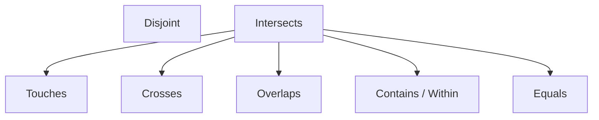

## 空间数据库要点检查

本页把 [空间数据库](index.md) 各章收成**可验收条目**与**易混点**。细节、推导与跟做步骤仍在对应章；本页只钉口径：写对了怎样算过、写错了通常错在哪一格。

主线仍是两条。几何对象模型回答周围有什么：点、线、面、九交、GiST。空间网络模型回答怎么到：边、代价、传递闭包、最短路。同一条道路在前一模型里是 `LINESTRING`，在后一模型里是 `source`–`target`–`cost`。


六条主线按设计流程读完：查询语言、几何谓词、概念到关系、物理索引、路网、运行期约束。

空间分析四类落到谓词：度量（长、面积、距离）；邻近（是否在某距离内）；拓扑（相等、包含、相交、相接、穿越）；方向（方位与转向）。方向关系九交缺少直接表达。LBS 三问与章的对应：Location 落点几何与 SRID；Directory 落几何对象模型与 GiST；Routes 落网络模型、`WITH RECURSIVE` 与 `pgr_dijkstra`。

[OLAP](13-olap.md) 走多维立方体，空间库主线不依赖那一套操作。栅格、注记文本的实现另课。产品函数清单以所安装的 PostgreSQL、PostGIS、pgRouting 官方文档为准。

## 设计网格：各章钉在哪一层

空间数据从世界落到磁盘分成五层，见 [概论](01-overview.md)。每一章钉其中一层，并沿概念 / 逻辑 / 物理 / 实施四格展开。

| 设计阶段 | 关系数据库 | 几何对象模型 | 空间网络 |
| --- | --- | --- | --- |
| 概念 | 概论；扩展 E/R | 几何层次、方法 | 道路网络 E/R、图 |
| 逻辑 | 关系代数、SQL、BCNF | 预定义类型或扩展 Geometry | `CONNECT BY`、`WITH RECURSIVE`、pgRouting |
| 物理 | 存储、B+ 树、三种连接 | WKT / WKB、Z / Hilbert、R 树、GiST | 邻接表 / 邻接矩阵 |
| 实施与运行 | 完整性、PL/pgSQL、OLTP | 空间函数与触发器 | 拓扑构建与最短路 |

**地理空间数据库**＝关系数据库管理系统＋空间扩展。实现并列：Oracle Spatial、SQL Server Spatial、PostGIS、MySQL Spatial、SpatiaLite。本栏目实践栈是 PostgreSQL ＋ PostGIS：类型、约 30 个方法、GiST、pgRouting 都在库内。SQLite 把整个库写成一个文件，不是服务器进程；GeoPackage、MBTiles 建立在 SQLite 上。

两个标准分流：SFA SQL 覆盖几何对象与注记文本，PostGIS 走这一路；SQL/MM 另含空间网络，Oracle Spatial 走这一路。

几何一般不当主码：相等判断贵，精度与多尺度使几何相等不稳定。用代理码（如 `gid`），几何列另建 GiST。

静态几何与动态点要分表。湖、路网中心线是静态，适合 GiST 与拓扑谓词。车、船、用户位置是动态，适合轨迹表加当前视图，空间条件仍用 `ST_DWithin` / `ST_Intersects`。

## 概论：五层、四代、独立性

对应 [概论](01-overview.md)。

### 可验收条目

-   **五层**：现实世界 → 信息 / 概念（对象或场）→ 表示 / 逻辑（矢量、栅格、网络、TIN、DEM）→ 数据库 / 物理（对象关系库）→ 文件结构（索引、数组、顺序文件）。本栏目主攻对象一侧，实现落在 PostgreSQL ＋ PostGIS。
-   **三级模式与两级映象**：外模式 / 模式映象给出**逻辑独立性**（改表结构不必改全部外模式）；模式 / 内模式映象给出**物理独立性**（改索引与文件组织不必改逻辑模式）。视图属于外模式。
-   **设计阶段与 DBMS**：概念设计独立于具体 DBMS；物理设计、实施、运行维护与具体 DBMS 相关。
-   **四代管理技术**：文件系统 → 文件与关系数据库混合（几何走文件、属性走关系，用 OID / 内部连接码）→ 空间数据引擎（坐标以二进制进关系，中间件解析）→ 对象关系 DBMS 扩展 SQL（类型、方法、索引、规则都在库内）。
-   **空间数据五特征**：空间特征、非结构化特征、空间关系特征、时态特征、多尺度特征。
-   **换参考椭球**：Geometry 层次、九交、GiST 过滤–精炼、扩展 E/R → 关系 → BCNF、`WITH RECURSIVE` / 最短路接口可沿用；SRID、测地线长度、`geography` 的地球参数、高程基准必须改。

### 易混点

-   把外模式相对模式的改变说成违背物理独立性：错在独立性种类。
-   把视图上的改动说成物理独立性：视图是外模式。
-   空间库与关系库的差别只写多了几何类型：还要从设计、索引、查询优化、完整性与运行取差，见文末对照。
-   用直线距离替代驾驶距离回答 Routes：Directory 用几何谓词，Routes 必须走网络。

## 关系模型与 SQL

对应 [关系模型与关系代数](02-relational-model.md)、[SQL](03-sql.md)。

### 可验收条目

-   **三类完整性**。实体完整性：主码不能为 `NULL`。参照完整性：外码为 `NULL` 或参照主码 / `UNIQUE`；外码动作 `RESTRICT`、`CASCADE`、`SET NULL`。用户定义完整性：`CHECK`、`DOMAIN`、`NOT NULL`、`DEFAULT`、`UNIQUE`。
-   **外码前提**：被参照列必须是主码或 `UNIQUE`。`PRIMARY KEY` 自动获得 `UNIQUE`。外码列可插入 `NULL`，除非另有 `NOT NULL`。
-   **关系代数与 SQL**：代数按集合语义；SQL 按多重集，用 `ALL` / `DISTINCT` 切换。除法没有专有子句，用双重否定 / `NOT EXISTS` 实现。
-   **空值**：判断必须用 `IS NULL` / `IS NOT NULL`。`COUNT(*)` 计含 `NULL` 的行，`COUNT(列)` 忽略 `NULL`。`NOT IN` 的子查询若含 `NULL`，主查询得到空结果；安全写法是 `NOT EXISTS`。
-   **`SELECT` 语义顺序**：`FROM` → `WHERE` → `GROUP BY` → `HAVING` → `SELECT` → `ORDER BY`。行级谓词进 `WHERE`；分组之后的谓词进 `HAVING`。`SELECT` 列表里未聚集的列必须出现在 `GROUP BY`。
-   **最值**：单表最大值用 `= (SELECT MAX(...))` 或 `>= ALL`；分组最大用子查询按组求 `max` 再按键等值连接。并列最大值全部保留；`ORDER BY LIMIT 1` 丢掉并列。
-   **授权**：`GRANT ... ON ... TO ... [WITH GRANT OPTION]`；`REVOKE ... [CASCADE | RESTRICT]`。`RESTRICT`：下游还在授权则拒绝收回；`CASCADE`：连同下游一起收回。授权图分清直接特权与传播特权。收回后再被授回的特权与从未收回的特权要分开记账。
-   **三种连接选用**：嵌套循环——内表有索引、外表小；排序合并——已有序或非等值比较；哈希——等值、小表建桶。

三值逻辑四行：

| 表达式 | 结果 |
| --- | --- |
| `NULL = NULL` | `NULL` |
| `TRUE AND NULL` | `NULL` |
| `FALSE AND NULL` | `FALSE` |
| `TRUE OR NULL` | `TRUE` |
| `FALSE OR NULL` | `NULL` |

### 易混点

-   `WHERE` 与 `HAVING` 对调：平均分一类组谓词塞进 `WHERE` 时组还不存在；选课细节塞进 `HAVING` 时细节行已经聚合掉。
-   `=` 比较空值：得到 `NULL`，行被 `WHERE` 滤掉。
-   分组最大写成全局 `ORDER BY LIMIT 1`：丢掉并列，也丢掉其他组。

## 几何对象、九交与约 30 个方法

对应 [几何对象与 PostGIS](04-geometry-and-postgis.md)。坐标系、投影与法定精度见 [GIS 与测绘](../geospatial/gis-and-surveying.md)。

### 可验收条目

矢量再分：只关心形状的**几何对象模型**（无拓扑）；形状加拓扑的几何拓扑模型；关心连通的**网络模型**。本栏目实现主线是几何对象模型加网络模型。

坐标维数是 \(x,y\) 或 \(x,y,z\)（及是否带 M）；几何维数是点 0、线 1、面 2。点的边界为空（维数约定为 \(-1\)）；线的边界是端点；面的边界是环。`Polygon` 是 `Surface` 的直接子类。

逻辑实现两条路：预定义类型（numeric 坐标表 ＋ BLOB）要拆 Feature / Geometry 两张用户表；扩展 Geometry 类型则用户表直接有几何列。系统表都是 `GEOMETRY_COLUMNS` 与 `SPATIAL_REF_SYS`。物理交换格式：WKT 与 WKB。列类型形如 `geom geometry(Point, 4326)`。

球面米制：`ST_Length` / `ST_Area` / `ST_Distance` / `ST_DWithin` 的 `use_spheroid` 或 `::geography`。SQL Server 把平面与球面拆成 `geometry` / `geography` 两个类型；PostGIS 常在同一 `geometry` 列上用转换或球面参数切换。选错则距离阈值按平面欧氏算，不是地面距离。

**约 30 个方法**分成三类。

**常规方法（12）**：`Dimension`、`CoordinateDimension`、`GeometryType`、`SRID`、`Envelope`、`AsText`、`AsBinary`、`IsEmpty`、`IsSimple`、`Is3D`、`IsMeasured`、`Boundary`。

**GIS 分析（7）**：`Distance`、`Buffer`、`ConvexHull`、`Intersection`、`Union`、`Difference`、`SymDifference`。

**空间查询（11）**：`Equals`、`Disjoint`、`Intersects`、`Touches`、`Crosses`、`Within`、`Contains`、`Overlaps`、`Relates`、`LocateAlong`、`LocateBetween`。

前 9 个查询方法返回真假；`LocateAlong` / `LocateBetween` 返回几何（沿 M 值取点或子线段）。`Relate(another, matrix)` 用九交串自定义关系。`Relate(..., "T*T***T**")` 为真对应 Overlaps（面 / 面或点 / 点）。

走 GiST 包围盒过滤的谓词：Equals、Intersects、Touches、Crosses、Within、Contains、Overlaps、DWithin。它们只返回真假；包围盒不相交即可在过滤步得假。`ST_Distance`、`ST_Disjoint`、`ST_Relate` 不直接走该过滤。距离谓词用 `ST_DWithin` 替代 `ST_Distance < r`；相离用 `NOT ST_Intersects` 替代 `ST_Disjoint`。`SELECT` 列表里的空间计算通常不走索引。是否真的走索引取决于规划器比较全表扫描与索引扫描的 cost；小表上全表扫描可以赢过索引。索引建在基表上，不建在查询结果上。

### 九交：按行拼接，格位不能错

内部 \(I\)、边界 \(B\)、外部 \(E\) 做 \(3\times 3\) 相交。**行对应 \(A\) 的 \(I,B,E\)，列对应 \(B\) 的 \(I,B,E\)**，按行优先拼成 9 字符。格值：`T` / `F` / `*`（无所谓）。DE-9IM 把每格写成交集维数：\(-1,0,1,2\)，其中 \(-1\) 表示空集（对应 `F`）。



Intersects 最宽：凡非 Disjoint 即相交。Touches 是内部不相交的一支。Crosses 是内部相交但维数下降或线穿面、且互不包含的一支。Contains、Overlaps、Equals 同属 Intersects，同时落在 Touches 与 Crosses 之外。

| 关系 | 定义要点 | 九交 | 适用 |
| --- | --- | --- | --- |
| Equals | 互相包含 | `TFFFTFFFT` | 仅同类 |
| Overlaps | 同维内部相交，且互不包含 | 面 / 面、点 / 点 `T*T***T**`；线 / 线 `1*T***T**` | 仅同类 |
| Disjoint | 交为空 | `FF*FF****` | 一切组合 |
| Intersects | 非 Disjoint | 非 `FF*FF****` | 一切组合 |
| Within | \(a\cap b=a\) 且 \(I(a)\cap E(b)=\varnothing\) | `T*F**F***` | 点线面均可 |
| Contains | 对方 Within | Within 转置 `T*****FF*` | 点线面均可 |
| Touches | 内部不相交但整体相交 | `FT*******` / `F**T*****` / `F***T****` | 点 / 点不适用 |
| Crosses | 内部相交且互不包含 | 点 / 线、点 / 面、线 / 面 `T*T******`；线 / 线 `0********` | 无点 / 点、无面 / 面 |

推导按定义：

-   Contains 与 Within 互逆；Intersects 与 Disjoint 互否。
-   Equals 推不出 Overlaps；Touches 推不出 Crosses。Overlaps / Crosses 要求部分重叠，排除重合与仅边界相接。
-   Touches 或 Crosses 推出 Intersects：成立（整体相交）。

### 易混点

-   九交行列对调：行是 \(A\)，列是 \(B\)；Contains 的串是 Within 的转置，不是同一串。
-   Touches 用在点 / 点：点的边界为空，两点要么相离要么内部重合。
-   两线交于一点写成 Overlaps：维数从 1 降为 0，应走 Crosses；沿线重叠一段才是 Overlaps。
-   面 / 面内部相交写成 Crosses：维数不降，走 Overlaps 或包含。
-   `ST_Within` 与 `ST_DWithin` 互换：前者是拓扑包含，后者是距离阈值。
-   平面欧氏与椭球面米制混用：`geometry`、`::geography`、`use_spheroid` 单位与参考系必须写进数据契约。

## 扩展 E/R 与 BCNF

对应 [空间扩展 E/R](05-spatial-er.md)、[关系设计理论](06-normalization.md)。

### 可验收条目

标准流水线：需求分析 → 概念设计（空间扩展 E/R）→ 逻辑设计（关系 ＋ 规范化）→ 物理设计（存储、索引、权限）→ 实施 → 运行维护。后三步与具体 DBMS 相关。需求分析问四件事：存什么、怎么用、拿数据做什么、谁能访问。需求侧还要拆清几何、属性、行为。

**空间扩展 E/R**。实体集、属性、主码（下划线）；联系是笛卡尔积的子集，有 1:1、1:N、M:N。空间象形图标明几何类型；复合几何旁的 \(1,n\) 表示至少一段、可以多段，\(0,n\) 表示可空。多值属性升成实体或拆成 1:N 联系，以免多值依赖（4NF）。独立存在、有多条实例的，倾向实体；一次购买有日期与数量，倾向把购买做成实体再分别连商品、商店、顾客。

静态几何与动态轨迹分表：主表存账号与静态属性；高频滚动的位置进子表。危险区多边形 ＋ 用户点 ＋ 缓冲区视图，与签到 / 商家库，都是这条口径。

**转换成关系**：

-   实体 → 关系；主码 → 主码；复合属性拆成原子列；象形图 → `geometry` 列。
-   多值属性 → 新关系（带外码）。
-   1:1：可独立成表，或把外码合并到参与更完整的一侧（外码加 `UNIQUE`）。
-   1:N：外码放在 N 端。
-   M:N：必须新建关系，主码为两端主码的并，联系属性放进该表。
-   弱实体：主码含识别实体的主码。

**函数依赖** \(\alpha\to\beta\)：任意两元组在 \(\alpha\) 上相等则在 \(\beta\) 上相等。闭包 \(\alpha^+\) 含全部属性则 \(\alpha\) 是超码；无冗余子集则是候选码。完全非平凡：\(\alpha\cap\beta=\varnothing\)。规则：分解（只拆右部）、合并、平凡、传递。指定关系的函数依赖集合：使该关系上成立的所有 FD 都能从中推出的、完全非平凡 FD 的极小集。

**BCNF**：每个非平凡 \(\alpha\to\beta\) 的左部都是超码。不满足则有冗余与更新 / 插入 / 删除异常。4NF 处理多值依赖；多值属性优先在 E/R 阶段拆掉。

空间上 `shape → 其他属性` 在多数专题里成立（同一几何很少对应两个矛盾属性），设计时要写进 FD 集合。轨迹点位置通常决定不了是哪一辆车。

**分解算法**（无损连接，不一定保持函数依赖）：

1.  由 FD 算码。
2.  若某 \(R'\) 上 \(\alpha\to\beta\) 违反 BCNF，分解为 \(R_1(\alpha\cup\beta)\) 与 \(R_2(R-\beta)\)。
3.  对子关系重算 FD 与码，重复直到都满足 BCNF。课上扩展可按 \(\alpha\to\alpha^+\) 一次收进传递闭包。

分解后用自然连接应能还原，这就是无损。还要检查：是否保持依赖、查询是否被拆得太碎、避免过度分解。BCNF 做不到依赖保持时退到 3NF。

### 易混点

-   1:N 外码放在 1 端：N 端会出现多值，后面就是 4NF 问题。
-   M:N 不建新表：两端主码无法同时做单一关系的主码而不引入冗余。
-   漏写 `shape → 属性`：几何列上的依赖与不当主码是两件事；依赖要写，主码仍用代理码。
-   拆左部：右部可拆成单属性；左部是合取，拆开后依赖一般不成立。
-   一次按原始 FD 切到底、子表不再重算闭包：子关系上的码与违反项会变。

## 存储、Z / Hilbert、R 树与代价

对应 [空间存储与索引](07-storage-and-index.md)、[空间查询处理](08-query-processing.md)。

磁盘顺序读远快于随机读；总代价 ≈ I/O ＋ CPU。文件：堆、有序、哈希、聚集。索引键不必是主键；聚集索引与数据顺序一致，一表通常一个。哈希文件利于点查询，不利于范围查询。空间查询里 CPU 与 I/O 都重，空间选择下推不一定更省。

空间没有天然全序，两条路：空间填充曲线给出全序以重用有序文件 ＋ B+ 树；或新的空间索引（网格、四叉树、R 树）。Geohash（经纬二分比特交叉后再 Base32）与 Z 曲线的 bit interleaving 同构，属于重用 B 树的产品实现。SQL Server 的四级网格细分是重用规则格网。本栏目的四叉树 / R 树 / GiST 是另一条技术路线。

### 可验收条目：Z 曲线

Z / Morton：N 型（**\(x\) 先交错**）与 Z 型（**\(y\) 先交错**）编号不同，计算前先锁定朝向。\(x\) 方向二进制从左到右；差别只在谁当高位。Z 曲线不强制把高位 0 补满到某一阶，位数覆盖当前网格即可、成对出现。

**正算。** 把 \(x,y\) 写成二进制，从高位到低位交错：N 型 \(x_k y_k x_{k-1} y_{k-1}\cdots\)；Z 型 \(y_k x_k y_{k-1} x_{k-1}\cdots\)。得到的串看成无符号整数。

**反算。** 把 Z 值写成偶数位二进制，按同样规则把奇偶位拆回 \(x\) 和 \(y\)。

跟做（N 型）。\(z=57=(111001)_2\)，六位三对，归属 `x y x y x y`，故 \(x=(110)_2=6\)，\(y=(101)_2=5\)。正算复核：\(x=6=(110)_2\)，\(y=5=(101)_2\)，交错 `111001`，即 57。另一组：\(z=43=(101011)_2\)，\(x=(111)_2=7\)，\(y=(001)_2=1\)。

与线性四叉树一致。\(4\times 4\) 上 \(x=0=(00)_2\)，\(y=3=(11)_2\)：N 型交错 `0101`，Z 值 \(=5\)。路径 `WN;WN`（W→0，N→1）同样得到 \((0101)_2=5\)。

### 可验收条目：Hilbert 七步

Hilbert 聚集通常优于 Z：相邻编号的欧氏距离之和更小，从一象限对角跳到另一象限的长边更少。编号相邻而空间很远更容易出现在 Z 曲线。Hilbert 与 N 型一样 x-first 交错。与 Z 的两处关键差别：必须按阶数 \(n\) 把 \(x,y\) 补成**恰好 \(n\) 位**；两比特一组译成 `0,1,2,3` 时不是普通二进制：

\[
\texttt{00}\mapsto 0,\quad \texttt{01}\mapsto 1,\quad \texttt{10}\mapsto 3,\quad \texttt{11}\mapsto 2
\]

网格 \(2^n\times 2^n\) 的七步：

1.  将 \(x\)、\(y\) 写成 \(n\) 位二进制，不足补前导 0。
2.  与 N 型 Z 曲线相同：交错成串 \(S\)（\(x\) 在前、\(y\) 在后）。
3.  将 \(S\) 按 2 比特一组切开，得到长度 \(n\) 的数组。
4.  按上表把每组译成 `0,1,2,3`。
5.  **旋转 / 反射**（从左到右扫描当前值 \(j\)，只改**后面**）：\(j=0\) 则后面所有 1 与 3 互换；\(j=3\) 则后面所有 0 与 2 互换；\(j=1\) 或 \(2\) 不改后面。每处理完一位，后面已经变了，再看下一位时用更新后的值。
6.  把最终数组按普通二进制写回 2 比特：\(0\to\texttt{00}\)，\(1\to\texttt{01}\)，\(2\to\texttt{10}\)，\(3\to\texttt{11}\)。
7.  整串看成二进制整数，即为 \(H\)。

跟做 A。\(X=\texttt{001}\)，\(Y=\texttt{000}\)。交错 `000010` → `[00,00,10]` → `0,0,3`。首位 0：后面 1↔3，得 `0,0,1`；第二位 0：再互换得 `0,0,3`。写回 `000011`，\(H=3\)。

跟做 B。\(X=\texttt{100}\)，\(Y=\texttt{001}\)。交错 `100001` → `3,0,1`。首位 3：后面 0↔2，得 `3,2,1`。写回 `111001`，\(H=57\)。

跟做 C（\(n=4\)，\(x=5\)，\(y=9\)）。\(x=\texttt{0101}\)（不可写成 `101`），\(y=\texttt{1001}\)；交错 `01100011`；分组译码 `1,3,0,2`；第 5 步：1 无规则，3 则后面 0↔2 变成 `1,3,2,0`；写回 `01111000`，\(H=120\)。

跟做 D（\(n=5\)，\(x=0\)，\(y=14\)）。交错后译码 `0,1,1,1,0`；按位从左扫到右做反射，最终 `0,3,3,3,2`；写回 `0011111110`，\(H=254\)。中间位会来回互换，必须逐步更新，禁止按原始数组一次性做完全部规则。

### 可验收条目：四类查询、R 树与代价

填充曲线上的有序文件 ± 以 z/h 为键的 B+ 树。空格子不占记录。

-   **点查询**：算 z/h，B+ 树（或有序文件二分）定位块，块内线性找。
-   **范围查询**：把查询矩形译成一段或多段 z/h 区间，从每段最小键开始扫描直到越界。段差得大时对每一段重新从 B+ 树找下界更省。
-   **最近邻**：先当点查询找一个候选，以其距离为半径做范围查询，再在候选里精确比距离（两阶段）。不缓存时，阶段 2 可能再次计入阶段 1 已读的块。
-   **空间连接**：两表都排序成 z/h 列表后归并，注意前缀 / 通配段；同一对对象只精确计算一次，必须去重。

R 树是 B 树向 \(k\) 维的扩展：节点用 MBR，**节点可重叠、每个对象只存一次**。插入选面积增量最小的子节点；增量相同则选面积更小者。溢出则二次分裂：挑两个种子，其余条目分给扩张更小的一侧。R+ 树区域不重叠、对象可出现在多个叶。点 / 范围查询都要从根走**多条**与查询几何相交的分支。NN：先深度优先得到一个距离估计，再以该距离做范围查询；或一边走一边收缩半径。空间连接：嵌套循环、一侧有空间索引的嵌套循环、空间划分（两表都无索引）、双树同步遍历（两表都有 R 树）。

过滤–精炼：过滤用 MBR 与 Overlap 得候选，精炼才做精确几何。空间索引用于过滤步，不替代精炼。

代价记号：\(T(R)\) 元组数，\(B(R)\) 块数，\(V(R,A)\) 属性 \(A\) 的不同值个数。选择 \(\sigma_{A=a}(R)\) 估计返回 \(T(R)/V(R,A)\) 行。

| 访问路径 | 估计块 I/O |
| --- | --- |
| 无索引扫描 | \(B(R)\) |
| 聚集索引 | \(B(R)/V(R,A)\) |
| 非聚集索引 | \(T(R)/V(R,A)\) |

嵌套循环（外表 \(R\)、内表 \(S\)）：无索引 \(B(R)+B(R)B(S)\)（可交换）；内表有聚集索引时把内表扫描换成 \(T(R)\cdot B(S)/V(S,B)\)；非聚集则 \(T(R)\cdot T(S)/V(S,B)\)。多属性等值可把选择率连乘 \(1/V\)。规划器比较 cost，选小者；cost 是估计。`EXPLAIN` / `EXPLAIN ANALYZE` 用来读计划。无序堆上点查询只能扫全表；按 Hilbert 值聚类后，同一查询读的块数下降。中间结果若假定在内存，分组和选择的 I/O 可记 0。

### 易混点

-   Z 未锁定 N 型还是 Z 型就开始交错：同一格子两种朝向编号不同。
-   Hilbert 漏补前导 0：\(n=4\) 时 \(x=5\) 必须写成 `0101`，写成 `101` 则分组长度错。
-   Hilbert 第 4 步用普通二进制：`10` 译成 3，`11` 译成 2。
-   Hilbert 第 5 步按原始数组一次性互换：必须从左扫到右，每步只改后面，用更新后的值看下一位。
-   第 6 步仍用 Hilbert 译码表写回：写回改回普通二进制。
-   R 树点查询只走一条分支：节点可重叠，必须走所有与查询几何相交的子节点。
-   过滤当精炼：包围盒 Overlap 只给候选超集。
-   把空间选择下推到连接之下一律当更优：中间结果没有 GiST，CPU 也计入代价。

## 空间网络：递归与最短路

对应 [空间网络](09-spatial-network.md)。

LBS 三问里，Routes 落在空间网络。分析三类：路径（起终点）、分配（服务中心与顾客）、选址（顾客集与新建中心个数）。例子：道路、铁路、河流。

概念模型：E/R ＋ 图（道路要考虑转向；河流有向汇流；铁路站点序列）。逻辑：传递闭包；SQL2 的 `CONNECT BY`；SQL3 的 `WITH RECURSIVE`。物理：邻接矩阵、邻接表，目标是减少随机读。内存算法：BFS / DFS 连通，Dijkstra / A* 最短路；外存有层次导航。

### 可验收条目：几何到网络

边表至少要有 `id, source, target, cost`（可选 `reverse_cost`）。折线若在交点不断开，拓扑不连通。流程：

1.  `pgr_nodeNetwork`：相交处打断，生成 `_noded` 表。
2.  `pgr_createTopology(edge_table, tolerance, geom, id, source, target)`：填 `source` / `target`，必要时建顶点表 `*_vertices_pgr`。
3.  `pgr_analyzeGraph`：填顶点的度数 `cnt`、检查标记 `chk`，报告断头（仅 1 个相邻节点）与交点。

`pgr_dijkstra(edges_sql, start_vid, end_vid, directed := true)` 返回 `seq, node, edge, cost, agg_cost`。无向路网第四参必须 `false`。缺省为 `true`，不写就按有向图算。边 SQL 里先过滤淹没区或管制时段，再求最短路；把 `cost` 改成 1 则求最少边数。返回集合再与道路表按 `edge = rid` 连接，投影序号与道路编号。

最短路的边 SQL 通常还要加一个条件：相交区域、某时段管制、某条路施工。无条件的全网最短路很少单独作为产品查询。

### 可验收条目：`CONNECT BY` 与 `WITH RECURSIVE`

河流汇流一般无环，适合 `CONNECT BY PRIOR source = dest START WITH dest = …`。结果集必须包含起点：从目的地为该节点的那一行开始往上游递归。只列出流入该点的河，会丢掉起点。有环的道路 / 地铁必须改用 `WITH RECURSIVE`。

`WITH RECURSIVE` 执行模型：先执行非递归成员（锚点），结果放入工作表；再把工作表与原表连接产生下一层，直到工作表为空。有环图必须用 `UNION`（去重）或 `path` 数组（`end = ANY(path)`）检测环。深度上限是防爆炸的常用写法。

传递闭包的定义含历史元组；实现上工作表每轮只留新元组。填递归查询时先写清锚点成员与递归成员各自往工作表里放什么。

**无向道路上的半径扩张**（例如 10 公里可达）。道路表是无向的：`source` / `target` 只是端点编号。扩散却有方向。因此第一步把无向图展开成有向图：每条边保留一次，再把两端对调复制一次。不展开则递归只能沿表里写死的方向走，会漏掉反向路段。第二步从起点出发：当前边的 `source` 等于已到达的 `target`，且累计长度仍不超过半径才收入工作表。最后 `SELECT DISTINCT rid`。

```sql
WITH RECURSIVE Reachable(rid, node, total_len) AS (
  SELECT e.rid, e.target, e.len
  FROM   (SELECT rid, source, target, len FROM Road
          UNION ALL
          SELECT rid, target, source, len FROM Road) e
  WHERE  e.source = :start AND e.len <= :radius
  UNION
  SELECT e.rid, e.target, r.total_len + e.len
  FROM   Reachable r,
         (SELECT rid, source, target, len FROM Road
          UNION ALL
          SELECT rid, target, source, len FROM Road) e
  WHERE  e.source = r.node
    AND  r.total_len + e.len <= :radius
)
SELECT DISTINCT rid FROM Reachable;
```

`pgr_dijkstra(..., false)` 把无向图交给库内最短路，适合有单一终点。半径约束的连通扩张没有单一终点，用递归更直接。有向化是为了让当前走到的节点 ＝ 下一条边的起点这一连接条件成立。

最少转机、可达地铁站是同一模板：锚点是起点出边（次数 / 深度为 0 或 1，看是否计入起点），递归成员把 `times+1` 或 `depth+1`，最后按终点过滤取 `MIN`。

### 可验收条目：层次导航与全称量词

大图切成岛屿，岛屿之间的边界节点叫港口。预先计算港口之间的最短路，形成摘要图。三点式分解：

\[
\mathrm{SP}(S,E)=\mathrm{SP}(S,\text{LocalPort})+\mathrm{SP}(\text{LocalPort},\text{RemotePort})+\mathrm{SP}(\text{RemotePort},E)
\]

中间一段在港口摘要图上查，两端在岛屿内部查。港口图上只含港口，不含本次查询的起点、终点。同一张港口图服务多次查询；查询端点事后接到最近港口上。

避开全部淹没区要用全称量词：对所有淹没区都不相交。

```sql
SELECT rid AS id, source, target, len AS cost
FROM   Road r
WHERE  NOT EXISTS (
         SELECT *
         FROM   Flood f
         WHERE  ST_Intersects(r.centerline, f.region)
       );
```

把这段作为 `pgr_dijkstra` 的边 SQL，无向路网第四参 `false`。

### 易混点

-   无向路网调用 `pgr_dijkstra` 不写第四参：缺省 `true`，反向边走不通。
-   半径扩张不翻转边：递归只能沿表内方向，漏反向路段。
-   `CONNECT BY` 结果丢掉起点；有环图仍用 `CONNECT BY`。
-   有环图 `UNION ALL` 且不记 `path`：无限递归。
-   港口图把查询起终点画进去：港口图与这一次从哪查到哪无关。
-   双表 `FROM Road r, Flood f WHERE NOT ST_Intersects(...)`：这是存在量词，只要存在一块与该道路不相交的洪水区，道路就会留下。

???+ warning "全称量词"
    避开全部多边形用 `NOT EXISTS` 加 `ST_Intersects`。

    双表 `FROM` 加 `NOT ST_Intersects` 只表达存在一块不相交的区域。

## 权限、完整性、视图与触发器

对应 [安全与完整性](10-security-and-integrity.md)、[服务器编程](11-server-programming.md)。

### 可验收条目

静态完整性：`PRIMARY KEY`、`FOREIGN KEY`、`UNIQUE`、`NOT NULL`、`CHECK`，在插入 / 更新时检查。动态完整性用触发器：事件发生时若条件成立则执行动作。把约束修复逻辑放进 DBMS。审计、复杂约束、轨迹追加这类每次写库都要发生的，适合触发器。应用逻辑放在客户端即可，不必强行堆触发器。

视图用途：藏列、简化查询、模块化访问。物化视图额外用空间换查询时间。对不可更新视图用 `INSTEAD OF` 定义写操作。

可更新视图的 SQL 标准四条：

1.  `SELECT` 无 `DISTINCT`，来自单一基表 \(T\)；
2.  不在视图中的属性允许为 `NULL` 或有默认值；
3.  子查询不得引用 \(T\)；
4.  无 `GROUP BY`、无聚集。

PostgreSQL 还更严：顶层不能有 `WITH` / `UNION` 等，`FROM` 必须恰好一项且为基表或另一可更新视图，选择列表必须是简单列引用。当前轨迹视图带 `GROUP BY max(time)`，本身不可按标准直接更新。

**当前轨迹视图**：子查询按对象分组取 `max(time)`，再与原表按同一对象且时间等于这个最大时间连接。不要写成只按全局最大时间筛一行。时间列有默认值 `CURRENT_TIMESTAMP` 时，插入不必写时间。

视图里只保留当前位置，看起来像状态被更新；基表要保留全部历史点，对视图的 `INSERT` 必须翻译成对基表的 **`INSERT` 一行**。`INSTEAD OF INSERT ON currenttrack FOR EACH ROW` 调用的函数里插入历史行，用户名若需要则从最近历史行取出。

触发器时机：`BEFORE` / `AFTER` / `INSTEAD OF`；`FOR EACH ROW` 才有 `OLD` / `NEW`；`TRUNCATE` 只走语句级且不触发 `DELETE`。表上 `BEFORE` 返回 `NULL` 表示跳过该行；`AFTER` 抛异常则回滚语句。视图上用 `INSTEAD OF`。`BEFORE` 在行写入前，`AFTER` 在写入后；同一事件上可以建多个触发器。

PostgreSQL 函数结构：`DECLARE` 变量；`IF … ELSIF … END IF`；循环；`RETURNS TABLE` / `RETURN QUERY`；`RAISE`；`$$ LANGUAGE plpgsql`。`NEW` / `OLD` / `TG_OP` 随事件有无赋值。

危险区同构：静态多边形 ＋ `ST_Buffer` ＋ 动态点 ＋ 视图列出谁在哪块危险区 ＋ `AFTER INSERT` 刷新。工地缓冲区、台风圈同一写法。缓冲区半径不要写进应用循环里逐条算而不建空间索引。

### 易混点

-   对当前轨迹视图 `UPDATE` 掉旧坐标：基表丢失历史。
-   当前视图按全局 `max(time)` 筛一行：只留下全表最新的那一个对象。
-   触发器固定在完整性检查之后：`BEFORE` 在写入前，`AFTER` 在写入后。
-   把 `GROUP BY max(time)` 的视图当成可更新视图：违反标准第四条。

## 事务、2PL、隔离级别与 WAL

对应 [事务处理](12-transactions.md)。

事务是反映一次现实世界转换的一组读写作。ACID：原子性与持久性靠恢复（日志）；一致性与隔离性靠并发控制。串行调度不交错；可串行化调度等价于某一种串行执行。冲突：不同事务、同一对象、至少一次写——RW、WR、WW。交错异常：不可重复读、脏读、不一致读、部分丢失更新。冲突图无环则冲突可串行化。

OLTP 对照：短事务、简单查询、触碰少量数据、频繁更新。OLAP 操作细节见 [OLAP](13-olap.md)，不进入本页几何对象与网络的验收。

### 可验收条目：锁与两段锁

S 锁共享读，X 锁排他写；相容矩阵：S–S 相容，与 X 均不相容。细粒度（行锁）并发高、死锁检查成本高；粗粒度（库锁，如 SQLite）几乎无死锁、假冲突多。死锁用等待图找环，中止一事务。SQLite 全库一把排他锁，因而不会死锁。

**2PL**：增长阶段只加锁，收缩阶段只放锁。一旦开始放锁，就不再申请新锁。

**严格 2PL**：锁留到 `COMMIT` / `ABORT`；提交记录先刷日志。


两段锁把加锁与放锁分成前后两段；严格 2PL 把放锁推迟到事务结束。

### 可验收条目：隔离级别与 WAL

| 级别 | 脏读 | 不可重复读 | 幻读 | 锁直觉 |
| --- | --- | --- | --- | --- |
| Read Uncommitted | 有 | 有 | 有 | 写 X 长锁，读不加 S |
| Read Committed | 无 | 有 | 有 | 写 X 长锁，读 S 短锁 |
| Repeatable Read | 无 | 无 | 有 | 读写都是长锁 |
| Serializable | 无 | 无 | 无 | 严格 2PL ＋ 谓词锁 |

与封锁协议的对照：一级 ≈ Read Uncommitted（改前加 X，读不加锁，防丢失修改、可恢复，不保证可重复读与不脏读）；二级 ≈ Read Committed（读完即放 S）；三级 ≈ Repeatable Read（S 留到事务结束）。Serializable 还要谓词锁对付幻读：他事务插入新元组不必拿到已有行的锁。

**WAL**。改数据页之前先把更新记录刷入日志（持久性，规则 1）；提交前把该事务全部更新记录与 `COMMIT` 记录刷入日志（原子性，规则 2）。事务一旦 `COMMIT` 记录上了稳定存储，即视为已提交。事务故障 Undo；系统故障 Undo ＋ Redo；介质故障 Redo。先写日志后写数据库。

### 易混点

-   2PL 与严格 2PL 当成同一条：普通 2PL 允许提交前放锁；严格 2PL 锁留到结束。
-   Repeatable Read 当成可串行化：仍可能幻读，缺谓词锁。
-   读已提交仍期望不可重复读消失：读 S 是短锁，提交后再读可以看见他事务已提交的更新。
-   先改数据页再写日志：违背 WAL，崩溃后既不能 Redo 也不能可靠 Undo。
-   把 SQLite 的无死锁推广到行锁系统：无死锁来自全库一把锁，假冲突多。

## 空间库与关系库：对照验收

对照空间库与关系库时，从栏目各段取差。

-   **数据模型。** 关系是元组集合，一维全序上的属性；空间侧增加 Geometry 层次、边界 / 内部 / 外部、九交、网络图、注记。逻辑上有预定义 BLOB 与扩展类型两条路。对象关系库还扩充了结构类型、继承与方法。
-   **设计。** E/R 加象形图与 \(1,n\) / \(0,n\)；FD 上常见 `shape → 属性`；静态几何与动态轨迹分表；多值属性在概念层拆掉以免 4NF 问题。
-   **索引。** B+ / 哈希不够（无全序，范围与 NN 差）；要 Z / Hilbert 重用有序文件，或四叉树 / R 树 / GiST。过滤用 Envelope。R 树节点可重叠、对象存一次。
-   **查询优化。** 新积木（空间选择、空间连接、NN）；策略选择有限；CPU 不可忽略；把空间选择下推到连接之下不一定更优。过滤–精炼是默认范式。
-   **完整性与运行。** 空间谓词进 `CHECK` / 触发器（打卡须在店 50 米内、速度告警、危险区缓冲）；权限仍用 `GRANT`，视图常用来裁剪几何列与按角色拆外模式。事务、WAL、隔离级别与关系库相同，锁粒度随产品而变。
-   **查询语言。** 骨架仍是 `SELECT`–`FROM`–`WHERE`；空间部分是 `ST_` 谓词与 `pgr_dijkstra` 的边 SQL。网络侧还有 `CONNECT BY` / `WITH RECURSIVE`。

工业实现对同一套对象层次：换产品时平面 / 球面用类型还是参数切换、网格 / Geohash / R 树是不同物理路线。不必背各产品的函数别名。

## 跨章易混点总表

按写查询、建库、建索引、跑路网、跑事务五条链收集，细节回上列各节。

| 链 | 写对 | 写错的典型形态 |
| --- | --- | --- |
| 独立性 | 外模式 / 模式 ＝ 逻辑；模式 / 内模式 ＝ 物理 | 视图改动说成物理独立性 |
| SQL | `WHERE` 行、`HAVING` 组；`NOT EXISTS` 避 `NULL` | 组谓词进 `WHERE`；`NOT IN` 遇 `NULL` |
| 九交 | 行是 \(A\)；Contains ＝ Within 转置 | 行列对调；Equals 推出 Overlaps |
| 距离 | `ST_DWithin`；`::geography` / `use_spheroid` | `ST_Distance < r`；平面当球面 |
| GiST | 八谓词走过滤；`ST_Disjoint` 改写 | `ST_Distance` / `ST_Relate` 当走索引 |
| E/R | 1:N 外码在 N 端；M:N 新表 | 外码放 1 端；多值椭圆凑合 |
| BCNF | 非平凡左部是超码；\(R_1(\alpha,\beta),R_2(\alpha,\mathit{rest})\) | 漏 `shape→`；子表不重算 |
| 曲线 | Z 先锁朝向；Hilbert 补 \(n\) 位、`10→3`、只改后面 | 漏补位；一次性互换 |
| R 树 | 多路、过滤–精炼、对象存一次 | 单路；过滤当精炼 |
| 网络 | 无向第四参 `false`；半径先翻转边 | 缺省有向；不展开无向图 |
| 量词 | `NOT EXISTS` 避开全部多边形 | 双表 `NOT ST_Intersects` |
| 递归 | 锚点含起点；有环用 `UNION` 或 `path` | 丢掉起点；`UNION ALL` 死循环 |
| 港口 | 图上只含港口 | 把查询端点画进摘要图 |
| 轨迹 | 分组 `max(time)` 再等值连接；`INSTEAD OF` 只 `INSERT` | 全局最大时间；`UPDATE` 基表 |
| 事务 | 严格 2PL ＋ 四级现象表；WAL 先日志 | Repeatable Read 当 Serializable |

接口清单：SFA 几何对象模型约 30 个方法，加上 pgRouting 的 `pgr_dijkstra`。其余函数以所安装版本的官方文档为准。产品代码优先选用走 GiST 的谓词。

实践侧的题型映射见 [实践路径](15-practice.md)。本页只保留静 / 动态几何这一条轴：静态走 GiST 与拓扑；动态走轨迹表 ＋ 当前视图 ＋ 触发器，空间条件仍用 `ST_DWithin` / `ST_Intersects`。

## 相关阅读

-   [空间数据库](index.md)
-   [概论](01-overview.md)
-   [关系模型与关系代数](02-relational-model.md)
-   [SQL](03-sql.md)
-   [几何对象与 PostGIS](04-geometry-and-postgis.md)
-   [空间扩展 E/R](05-spatial-er.md)
-   [关系设计理论](06-normalization.md)
-   [空间存储与索引](07-storage-and-index.md)
-   [空间查询处理](08-query-processing.md)
-   [空间网络](09-spatial-network.md)
-   [安全与完整性](10-security-and-integrity.md)
-   [服务器编程](11-server-programming.md)
-   [事务处理](12-transactions.md)
-   [OLAP](13-olap.md)
-   [实践路径](15-practice.md)
-   [GIS 与测绘](../geospatial/gis-and-surveying.md)
-   [数据库与数据存储](../../../tech/databases.md)

## 来源说明

本页根据对象关系数据库、OGC Simple Feature Access 与 PostGIS / pgRouting 的公开规范整理，把栏目各章收成可验收条目与易混点，并对照 Silberschatz、Korth 与 Sudarshan《Database System Concepts》第七版，程昌秀《空间数据库管理系统概论》，Shekhar 与 Chawla《Spatial Databases: A Tour》。算法步骤（九交矩阵、Z 值比特交错、Hilbert 七步、BCNF 分解、两段锁、递归查询与 Dijkstra 边 SQL）以教材与官方文档为准；函数名、隔离级别和拓扑接口以所安装版本为准。

-   Abraham Silberschatz, Henry F. Korth, S. Sudarshan, *Database System Concepts*, 7th ed., McGraw-Hill, 2020。配套站点 [db-book.com](https://www.db-book.com/)。重点参见关系模型与 SQL、规范化与 BCNF、存储与索引、查询处理代价、事务与并发控制、恢复与 WAL。
-   程昌秀，《空间数据库管理系统概论》，科学出版社。重点参见空间数据管理技术、几何对象模型、空间扩展 E/R、空间索引与查询。
-   Shekhar, S. and Chawla, S., *Spatial Databases: A Tour*, Prentice Hall, 2003。重点参见空间填充曲线、R 树、过滤–精炼、空间网络。
-   [OGC Simple Feature Access — Part 1: Common Architecture](https://www.ogc.org/standards/sfa/)，现行实现规范 [06-103r4（SFA 1.2.1）](https://docs.ogc.org/is/06-103r4/06-103r4/pdf)。九交与约 30 个方法以该文本为准。访问日期：2026-09-04。
-   [OGC Simple Feature Access — Part 2: SQL Option](https://www.ogc.org/standards/sfs/)，现行实现规范 [06-104r4（SFA 1.2.1）](https://docs.ogc.org/is/06-104r4/06-104r4/pdf)。访问日期：2026-09-04。
-   [PostGIS 文档](https://postgis.net/docs/)；空间索引见 [Building Spatial Indexes](https://postgis.net/docs/using_postgis_dbmanagement.html#gist_indexes) 与 [FAQ：How do I use spatial indexes?](https://postgis.net/documentation/faq/spatial-indexes/)。访问日期：2026-09-04。
-   [pgRouting 文档](https://docs.pgrouting.org/)；`pgr_dijkstra`、`pgr_nodeNetwork`、`pgr_createTopology`、`pgr_analyzeGraph` 以所安装版本为准。访问日期：2026-09-04。
-   [PostgreSQL 文档](https://www.postgresql.org/docs/current/)：`WITH RECURSIVE`、视图可更新性、触发器时机、隔离级别、WAL。访问日期：2026-09-04。

条文、标准与产品功能以官方文本为准；本页核验日期为 2026-09-04。
