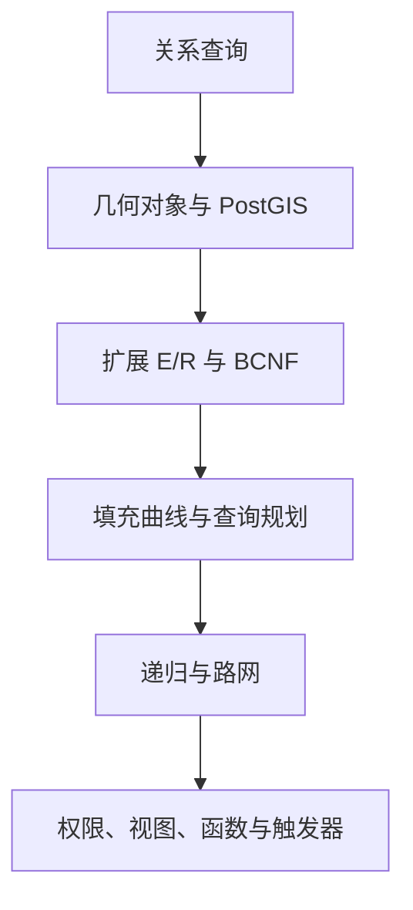
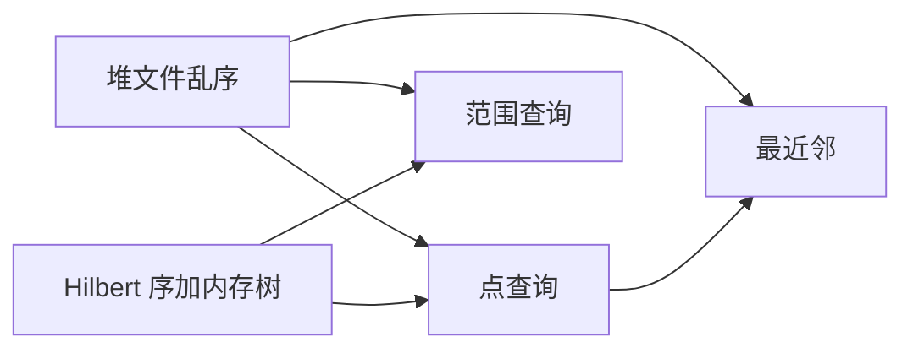
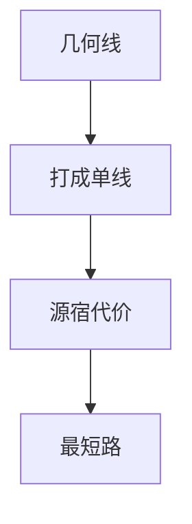

## 空间数据库实践路径

[空间数据库](index.md) 各章按定义、算法与课堂例子展开。本页不另开理论，只把六类练习写成对照：练习类型落在哪一章的哪一块，题面通常怎么问，反复出现哪些易错写法。回翻时按类型打开对应章，按结构抽公式，把六次实践收成一条轨迹。

材料来自题型与各讲实践提示。本页不抄解答，不给可直接粘贴的完整 SQL 或关系代数式。应用模块只记划分与触发器、函数、pgRouting 能力。

图示说明：六类练习按课程主线推进；后一类把前一类的表、几何和索引接到可运行的库。

| 练习类型 | 主题落点 | 主对应章 |
| --- | --- | --- |
| 关系数据库创建与查询 | 关系代数；SQL 定义、导入与查询 | [概论](01-overview.md)；[关系模型与关系代数](02-relational-model.md)；[SQL](03-sql.md) |
| 空间库创建与查询 | OGC SFA；PostGIS 谓词与量测 | [几何对象与 PostGIS](04-geometry-and-postgis.md) |
| 空间数据库设计 | 扩展 E/R；BCNF；ETL | [空间扩展 E/R](05-spatial-er.md)；[关系设计理论](06-normalization.md) |
| 空间查询处理与优化 | 填充曲线；代价；GiST 与规划 | [空间存储与索引](07-storage-and-index.md)；[空间查询处理](08-query-processing.md) |
| 空间网络构建与查询 | 递归；pgRouting；视图更新 | [空间网络](09-spatial-network.md)；[安全与完整性](10-security-and-integrity.md)；[服务器编程](11-server-programming.md) |
| 应用库模块 | 几何、模式、网络、权限接到同一 schema | [几何对象与 PostGIS](04-geometry-and-postgis.md)；[空间扩展 E/R](05-spatial-er.md)；[空间网络](09-spatial-network.md)；[安全与完整性](10-security-and-integrity.md)；[服务器编程](11-server-programming.md)；并发对齐 [事务处理](12-transactions.md) |

可视化优先看独立地图页或 `maps.html`；SQL 报错在图形客户端更完整，乱码时切换 `client_encoding`。

???+ warning "提交物不含连接信息"

    报告、笔记与示意图使用占位符表名与角色名。

    主机、账号、口令与云数据库地址不进入任何提交物。

## 关系数据库创建与查询

### 练习类型

三类题面组成第一条实践：文献阅读、选课库关系代数、有桩公共自行车上的 PostgreSQL。

**文献阅读。** 指定读存储渊源、行存与列存竞争、云原生数据库三类文章。三问分别落在：技术创新领先但创业结果不同的原因；生活中哪些应用属 OLTP、哪些属 OLAP；数据库云服务与云原生数据库各自的特点。OLAP 作为对比词汇出现，六类练习的必做路径不进入多维立方体操作；阅读题仍要求举例，禁止把云原生写成把虚拟机里的库搬上天。

**选课库关系代数。** 模式为 \(\mathrm{Student}(\underline{\mathrm{sid}},\mathrm{name},\mathrm{sex},\mathrm{age},\mathrm{dept})\)，\(\mathrm{Course}(\underline{\mathrm{cid}},\mathrm{cname},\mathrm{credit})\)，\(\mathrm{SC}(\underline{\mathrm{sid}},\underline{\mathrm{cid}},\mathrm{grade})\)，`sid` 与 `cid` 为外码。五类查询与披萨店同套手法，只换库：

| 练习类型 | 集合落点 |
| --- | --- |
| 指定专业选修过的课程名 | 选择、投影、自然连接；重命名只为消歧，无故不换名 |
| 至少选修一门高学分课的 `sid` | 存在量词：先选高学分课再连接，投影 `sid` |
| 两人之一选修过的课程名 | 同一行析取，或先分别投影再并 |
| 两人都选修过的课程名 | 交；一行上的合取表达不了两个人都 |
| 成绩全合格的课程号，含无人选修的新课 | 全称与否定落到差：全部课程减去出现过不及格的课程 |
| 指定课程成绩最高的 `sid` | 自积并重命名，差掉存在更高分的 `sid` |

符号用 \(\sigma,\Pi,\times,\bowtie,\cap,\cup,\rho\)。关系代数是集合，投影即去重。`only`、`all`、没有先译成否定再用差。

**有桩公共自行车。** 域为美国湾区五城。三个关系：站点、行程、天气。站点主码为站点号；行程主码为行程号，起点与终点站点号为外码；天气主码为日期与邮编两列。图中站点与天气虽有邮编箭头，该箭头表示同名属性关联，不构成外码。`dock_count` 是桩数：还车必须落在桩上。

建表与导入之后，模拟最后一次租车必须两条语句：先插入租出，再按**本次**行程号更新还入。查询侧每个问题一条 SQL；除题目已给的公共表表达式外不得再用 `WITH` 和视图，不得改库，不得硬编码。允许先用 `WITH` 构思再嵌回子查询。

| 练习类型 | SQL 落点 |
| --- | --- |
| 车位最多的站点 | 最值用标量子查询；并列全保留 |
| 每城站点数 | `GROUP BY` 加排序；站点按城市关联 |
| 距离最近的站点对 | 自连接；站点号不等式破对称；调用题面距离函数 |
| 租车记录最多的站点对 | 分组加截断；再分析起终点是否对称 |
| 每城最受欢迎站点 | 租与还各计一次，自环计两次 |
| 每站当前可租车辆 | 行程是历史表；当前等于每辆车时间上最近的还车记录 |
| 某邮编区各月气温与日均租车 | 从时间戳取年、月；租出时刻与站点邮编 |
| 不同天气下总租车数 | 字符串函数规范化天气字段；可能性用率，不用次数 |

距离函数在本练习中只要求调用；函数五要素留到 [服务器编程](11-server-programming.md)。附加分析用城市真实位置解释现象。

### 对应章节

阅读题对应 [概论](01-overview.md) 的管理技术阶段、SQL 与 Not Only SQL 的分合，以及 [SQL](03-sql.md) 对标准语言的讨论。选课五题对应 [关系模型与关系代数](02-relational-model.md) 的选择、投影、连接、并、交、差与自积。自行车库对应 [SQL](03-sql.md) 的定义、约束、导入、插入与更新，以及查询全节：最值、分组、自连接、时间抽取、时空当前值。

题面核验行数数量级：站点约七十行，行程约数十万行，天气约三千余行。`COPY` 用绝对路径且路径不含中文。天气文件含空值，须先看文件再在 `COPY` 中声明空值表示法。复合主码必须写在表级。先建被参照表，再建带外码的表。

`SELECT` 的语义顺序是 `FROM` → `WHERE` → `SELECT`。聚集禁止直接写在 `WHERE` 里与当前行比较。最值四种写法里，截断一条会丢掉并列；标量子查询与 `>= ALL` 保留并列。

### 易错点

-   **有桩还车**：还车必须落在站点号上；随处停放的共享单车不在本练习语义内
-   **邮编关联**：天气对站点无外码；邮编可以对不上某站，连接按关联理解
-   **复合主码**：两列各写一个主码不等于复合主码；两个外码写在表级
-   **空值字面**：天气空值是空；字符串 `NULL` 仍是值
-   **还入定位**：禁止再查一遍最大行程号；并发下会还到别人新插入的行程，须记住本条插入的编号
-   **全称用差**：`grade >= 60` 再投影会丢掉未选修的新课，也处理不好有不及格
-   **最值位置**：`MAX` 不进 `WHERE` 与当前行比
-   **公共表表达式**：构思可以用，提交须嵌回子查询
-   **用位置解释**：起终点是否对称、当前车数与桩数对不上、天气与租车的关系，都要用城市位置与出现天数说话；天气题的可能性是率

## 空间库创建与查询

### 练习类型

三类题面组成第二条实践：OGC 简单要素、所装版本的 PostGIS 文档、美国湖与城市、高速公路、事故上的空间 SQL。

**简单要素。** Part 1 是公共几何层次与 SRID；Part 2 是 SQL 选项。要素表两种实现：预定义类型几何表，或带几何类型的 SQL 用户定义类型。PostGIS 走后者。

| 练习类型 | 几何落点 |
| --- | --- |
| 灰色多边形的 WKT | 多边形双层括号；外环加内环 |
| 某图为何禁止用多边形表示 | 环闭合、定向、洞与外环关系、环不相交 |
| 面与线的 DE-9IM | 空为 \(-1\)；交成点、线、面分别记 0、1、2 |
| 模式串为真时的空间关系 | 与八种具名关系对照；星号为无关 |
| Contains 的九交字符串 | 九交按行拼接；Contains 与 Within 对称，注意边界格 |

**文档对照。** 以所安装版本文档为准。

| 练习类型 | 文档落点 |
| --- | --- |
| 几何点上距离函数带或不带球面参数 | `geometry` 平面距离，单位是参考系单位；`4326` 下是度；`geography` 才默认米 |
| 包围盒相等、几何相等、点序相等 | 操作符与函数分属不同层 |
| 距离比较与范围内谓词 | 功能近等价；范围内谓词可走 GiST 过滤 |
| 球面近似、平面、指定椭球体 | 单位与适用类型不同 |
| 多部件拆成单部件 | `ST_Dump`、`ST_GeometryN` 与 `ST_Multi` 方向相反 |

**湖、城市、高速公路、事故。** 建库并创建 PostGIS 扩展。可视化：普通展示要几何与名称；分级设色另加数值列；热力的数值可缺省。shapefile 导入时路径禁止中文，SRID 改为 `4326`；命令行导入须在几何列上建 GiST。事故经纬度大于一千视为错误，查询时忽略。城市表先复制分隔文本，再增几何列、按经纬度更新、建空间索引，SRID 与公路、湖一致。

湖常为多面。分析题覆盖边界、点数、凸包、岛、面积字段与椭球面积、最长公路、质心最近城市、线线连通、最偏僻城市、穿越湖的公路及湖中长度、事故与公路空间关联、网格求交分级、热力图。酒驾分析要区分工作日与周末的日均，并按公路长度归一化密度。

范围内关联必须用 `ST_DWithin`。完整查询在无索引时可达数十分钟。网格关联允许公共表表达式。中美星期起始日不同：美国常把周日算周末且一周从周日计。网上对最长高速的说法与旧几何数据可以不一致。题面中文湖名与括号英文湖名不一致时，以库中名称为准。

### 对应章节

简单要素与 PostGIS 函数对应 [几何对象与 PostGIS](04-geometry-and-postgis.md)。导入、改表、复制文本对应 [SQL](03-sql.md)。范围内谓词可走索引、距离比较难以走索引，正式展开在 [空间存储与索引](07-storage-and-index.md) 与 [空间查询处理](08-query-processing.md)；本练习已要求从文档分析效率。欧氏近邻与路网近邻的分界留给 [空间网络](09-spatial-network.md)。

`AddGeometryColumn` 无 `ST_` 前缀。索引建在基表，谓词写在 `WHERE` 或 `ON`。`SELECT` 列表里的空间函数不走索引。`geometry_columns` 不在普通用户表目录。shapefile 导入用练习库演示，避免误写入目标库。

### 易错点

-   **维数**：几何维数不等于坐标维数；点无边界，故无点与点相接
-   **具名谓词**：重叠、相交、穿越、相接各有定义；洞内的点不满足 Contains
-   **米制距离**：`4326` 下用 `geography` 或文档标明以米计的函数；范围查询优先 `ST_DWithin`
-   **多边形断言**：洞属于内环，不计入多边形内部；环须闭合、定向且不相交
-   **WKT 括号**：带洞多边形两层
-   **多面中的岛**：多面或多内环，单一有洞多边形写不全
-   **面积单位**：同一函数在几何类型与地理类型上单位不同
-   **附加图层**：加图须同步改容器编号与网页编号，否则地图页仍空白

## 空间数据库设计

### 练习类型

四类题面组成第三条实践：选一个定位服务应用列出要存的地理数据；外卖库的空间扩展 E/R 与转换；抽象关系上的 BCNF 分解；礼品销售表上从实例找依赖并做 ETL。

**定位服务数据清单。** 一两句话描述应用，列出可能需要的地理空间数据。对应需求清单，以及定位服务三类问题里的前两问：我在哪儿、周围有什么。本练习只问要存什么，不要求最短路。

**外卖库。** 栈为 PostgreSQL 与 PostGIS。实体词包括顾客、餐厅、菜品、订单、骑手、配送区、道路段。约束含手机号唯一、按名称或当前位置搜附近餐厅、下单、订单分配骑手、工作时间内按间隔上传位置、骑手指定配送区、道路用于配送可行性与路径时间估计。允许按现实语义增补实体与属性，并单独说明增补了什么。

| 练习类型 | 设计落点 |
| --- | --- |
| 实体分析 | 属性、完全非平凡函数依赖、主码、空间属性及其几何类型 |
| 联系分析 | 库中需要体现的联系；一对一、一对多、多对多与理由 |
| 空间扩展 E/R | 象形图在实体左上角；联系标基数；属性可隐含在联系中 |
| 关系转换 | 标出几何列类型；主码外码；联系尽量与实体合并；每张表属于 BCNF |
| 数据库合并 | 两套外卖库集成；至少两类冲突且各举一例 |

设计要点：骑手轨迹是多时刻的点，不宜只留一个当前点却又要求所有经过位置；菜品对餐厅是多值，应升实体；下单、分配是可重复事件，升为实体；道路用线，配送区用面，位置用点。几何可以出现在函数依赖里，河流形状往往反推得到河的标识；几何不适合做主码，值长、比较与更新差。车辆在某时刻的点位置通常不足以标识车辆。一对一与一对多并到弱端或多端；多值属性单独成表。

**抽象 BCNF。** 给定五属性关系与四条依赖，求全部码；按算法分解并说明是否丢失依赖；是否存在不同分解。闭包求码，只切违背 BCNF 的依赖，子表依赖须重算，分解顺序影响模式且不保证依赖保持。

**礼品店逆向设计。** 只有销售表与一份文本实例，无需求访谈。建库、复制、用尽可能短的 SQL 以结果是否为空集判定依赖是否成立，给出最小完全非平凡依赖集。单属性检查须先穷尽，再剪枝；三属性检查可利用已有单依赖减少次数。再按发现的依赖写冗余、更新、插入、删除四类异常并举例，做 BCNF 分解，建分解后的表并把原表导入，用连接结果判断是否无损。

正向设计收尾清单：每关系的码、完全非平凡函数依赖、是否 BCNF、非平凡多值依赖、是否 4NF。多值属性若已在 E/R 阶段拆掉，本章不必再做 4NF 分解。

### 对应章节

数据清单与象形图、多重性、转换规则对应 [空间扩展 E/R](05-spatial-er.md)。几何类型回指 [几何对象与 PostGIS](04-geometry-and-postgis.md)。完全非平凡依赖、从实例找依赖、四种异常、BCNF 算法对应 [关系设计理论](06-normalization.md)。复制与插入选择对应 [SQL](03-sql.md) 的 ETL。局部 E/R 集成的命名冲突、属性冲突、结构冲突在设计章的集成一节。

同一实体对要多次出现则升实体。配送区不存骑手字段，联系属性隐含在联系中。只用点、线、面及复合象形图，不自创图标。

### 易错点

-   **联系是集合**：同一顾客对同一餐厅每天下多单必须升实体，否则菱形装不下时间与金额
-   **一对多合并**：只能并到多端；并到一端会引入多值属性
-   **禁止用好依赖去切**：左部已是码的依赖拿去分解是空操作
-   **无损要留左部**：分解必须保留决定因素，否则有损
-   **从实例找依赖**：用 SQL 空集判定，禁止人工扫表；单属性检查先穷尽
-   **四种异常分开写**：冗余、更新、插入、删除各举一例
-   **集成冲突要具体**：同名不同义、单位不一致、一边把骑手当属性一边当实体
-   **几何与码**：几何可进函数依赖，不当主码

## 空间查询处理与优化

### 练习类型

五类题面组成第四条实践：空间计算综述阅读、关系代价与数值索引、空间填充曲线、关系代数表达式优化、空间索引与执行计划。

**空间计算阅读。** 已有空间计算里空间数据库贡献了类型、操作、R 树等结构，以及范围、最近邻、最短路等算法；近期与长远空间计算如何反过来推动空间库与空间统计。对应多样性动机，以及对象与索引的动机。

**代价估计与数值索引。** 健身俱乐部三表：场馆、会员、到访。给定行数、块数、不同值个数。选择 \(\sigma_{a=?}(R)\) 的行数估计为 \(T(R)/V(R,a)\)。单表合取条件分五档：无索引；城市非聚集；城市聚集；是否学生非聚集；城市与是否学生复合非聚集。连接加分组给左右两棵等价查询树：先连接后选择，或先选择后连接。嵌套循环公式为外层块数加外层块数乘内层块数，内存只容每表一块，中间结果不落盘，分组输入输出计零。索引选择工具给出三个索引的提升分，只能留两个：按前缀与包含关系取舍。聚集索引在到访表的会员号上会拖慢签到插入。两人同时签到、主码上报重复时间戳，对应主码设计与并发插入同一键。

**空间填充曲线。** 给定平面点集，每块最多两点；红点为点查询与最近邻，黑框为范围查询。先估堆文件三类查询各访多少块；再画网格 Hilbert，按 Hilbert 值给出块内顺序；再按 Hilbert 值存并建 B+ 树，树在内存、不缓存已访问数据块，估三类查询最少块数。Hilbert 与 N 型一样按横轴优先交错，须补满位数。曲线上的近邻不等于欧氏近邻。最近邻等于点查询定半径再范围查询。

**关系代数表达式优化。** 用选择、投影、自然连接构造表达式并计代价。选择放在连接内侧反复执行且不缓存会放大输入输出。选择下推、连接次序、投影下推是逻辑变换。构造等价表达式使结果相同且输入输出下降，再写成无多余子查询的 SQL，用执行计划看规划器是否谓词下推、选了嵌套循环还是哈希。小表上建索引可能仍走顺序扫描，须增大数据量，规划器才改走索引扫描。规划器按代价选，有索引不必用。

**空间索引与执行计划。** 导入城市区域、河流与湖中心线、居民点时关掉缺省创建空间索引，再按题建 GiST。无索引时跑线面穿越计数，以及某河一定距离内的城市，距离比较先用 `ST_Distance`。建索引后看索引页数与行数，重跑穿越，把距离比较改成 `ST_DWithin`，再开关索引扫描观察是否用了索引、哪些、如何加速。本练习禁用额外公共表表达式。`ST_Crosses` 可走索引；`ST_Distance` 比较须改写成 `ST_DWithin` 才体现 GiST。附加方向：手写三种连接，或在城市点上做地理哈希且不得调用现成哈希函数。

图示说明：堆文件三类查询都按块扫；Hilbert 把点查询与范围查询变成一维键上的块计数；最近邻先定半径再走范围。

### 对应章节

阅读题对应 [概论](01-overview.md) 与 [几何对象与 PostGIS](04-geometry-and-postgis.md)、[空间存储与索引](07-storage-and-index.md) 的动机。聚集与非聚集、填充曲线对应存储与索引章。六式代价、选择下推、规划器按代价选对应 [空间查询处理](08-query-processing.md)。可走索引的谓词列表与过滤–精炼对应两章的接口：`ST_Crosses` 可走，`ST_Distance` 比较对照改 `ST_DWithin`。重复时间戳主码对齐 [SQL](03-sql.md) 的码设计与 [事务处理](12-transactions.md) 的并发插入；修正方向是复合码或更高分辨率或序列，不在此写具体定义语句。

函数代价填自己库里读到的数。空间函数估计代价在系统目录中查看。

### 易错点

-   **块数取整**：一律向上取整；按行探测时不要先除成小数再当半块乘行数
-   **无索引代价**：等于扫完该表块数；非聚集按行数比不同值；聚集按块数比不同值
-   **低选择率才用非聚集**：是否学生选择率约一半时，非聚集索引可能比全表扫描更差
-   **嵌套循环外层**：让块少的做外层；公式含外层自己那一遍块数
-   **中间结果无基表 GiST**：两边都已经选择过再空间连接，只能划分或嵌套循环
-   **Hilbert 第四步**：二进制 `10` 映到 `3`，`11` 映到 `2`；遇 `0` 或 `3` 旋转后续象限
-   **代价数字**：填本库读到的数，不抄讲义例题
-   **重复键**：毫秒时间戳当全局主码在并发下崩；再建一个索引修不了

## 空间网络构建与查询

### 练习类型

文档、访谈、航空网、地铁网、道路网、视图与触发器组成第五条实践。附加方向是用过程语言按定义实现边界与相接。

**文档。** PostgreSQL 递归查询求值：非递归项写入工作表，工作表非空则递归项写入临时表，并入结果后把临时表当作下一轮工作表。pgRouting 一侧对照建拓扑、分析图、打断网络、最短路四个接口。帮助文档按所装大版本；高版本若删除封装名，须按文档自行组拓扑。

**访谈。** 飓风撤退禁止直接套最短路：全体同一路径导致拥堵，须考虑容量。企业网络与课本网络至少两条差异：动态权、车道与限制、数据规模。几何距离不等于网络距离，这是层次导航的动机。

**美国航空网。** 有向航班图。练习类型包括：单向航班数用差或反连接；从某机场最多一次转机可达用递归，可对比非递归的代价差异；一次转机可达某机场的起点把边反过来走；两机场最少转机次数用深度或层数，过慢可按层枚举；是否不连通看传递闭包相对全点对，并防组合爆炸；最少花费路径返回序号、结点、边、代价，边表须有源、宿、代价，结果末行边号为 `-1` 表示到达。本题不宜用 A*：A* 要坐标启发式，航空网须具备可用坐标且启发式为下界。

**杭州地铁。** 线路、车站、邻接三段关系。不得改表增列，不得用 pgRouting。某线路站点数读关系即可，不用图。从某站可达做成广度优先，工作表尽量只留站号，并用去重检测环；路径长度设上限。站数最少保留站号与路径，外层对终点截断一条，第一次碰到即最短边数。换乘最少禁止套用第一次到达，须把是否换线写入状态，按换乘次数排序。多数起终点上较快捷与少换乘路径相同，部分不同。

**杭州道路网。** 路与兴趣点按无向处理。地理编码失败时用题面给出的校区坐标或节点号。多线先打成单线，递归拆段且禁止硬编码段数。人造路网用三函数建拓扑，边表填长度，相邻节点合并：先建拓扑再分析图，不好则打断网络，对新表再建。点到最近网络顶点后，导航先走路到节点。最短驾驶距离须声明无向。驾驶距离最近的电影院是目录加路径：遍历兴趣点跑最短路，并思考如何减少调用次数。封两条拥堵路后再导航不必重建拓扑，用过滤或改代价。偏离原路线后从当前边与方向的新起点再算。红绿灯最少把边权改成经过节点或边的计数，并可加长度不超过最短路若干倍的约束，禁止改库中路网表。

**视图与触发器。** 边表与车辆轨迹上建当前所在位置及最近道路的视图，查路上车数，分别按 SQL 标准与 PostgreSQL 判断该视图是否可更新，为视图写插入触发器。道路号不必由用户插入。附加题限用列出的数学函数与部分访问函数，按定义实现边界与相接。

图示说明：几何表只有标识、名称、几何时仍须打断交叉口并合并端点，之后才有源、宿、代价。

### 对应章节

递归求值、几何到拓扑、最短路对应 [空间网络](09-spatial-network.md)。单向差集回指 [SQL](03-sql.md)。点到最近顶点回指 [几何对象与 PostGIS](04-geometry-and-postgis.md)。可更新视图四条对应 [安全与完整性](10-security-and-integrity.md)。触发器函数返回触发器类型，以及 `INSTEAD OF`，对应 [服务器编程](11-server-programming.md)。按定义用过程语言实现谓词，对应几何章的边界与相接，加上服务器编程章的过程体。

语句里的递归名看起来读全表，求值时只读上一轮工作表。`WITH` 本身不输出行，最后必须从公共表表达式再选择。列越少越好。地铁长度上限属深度一类。

### 易错点

-   **递归终止**：递归项写错会停不下来；先看执行时间，或加深度、去重、路径环检测
-   **几何须成网**：交叉口须按容差打断，端点须合并；容差太小假分裂，太大把不同路口吸成一点
-   **版本函数集**：以所装版本文档为准
-   **封路**：改权或过滤，不重建拓扑
-   **最少换乘**：不等于最少边数；快捷用第一次到达，少换乘要排序
-   **不用图的题**：一条线上有多少站、谁是终点，读关系即可
-   **无向参数**：无向网最短路须声明无向
-   **标准触发器语法**：标准 SQL 的行引用子句禁止直接贴进 PostgreSQL
-   **A***：没有合法下界启发式时不要用

## 应用库：函数、触发器与路网

### 练习类型

第六条实践把几何、模式、网络、权限与完整性、函数与触发器接到一个面向应用的库：逻辑下推到数据库，查询以 JSON 为接口。两条轨道里，应用轨道按模块验收；索引轨道是四叉树与 R 树框架填空，填充曲线加 B+ 树为附加。本页只按应用模块写能力清单，不抄函数体，不写连接信息，不展开索引实现。

| 模块 | 练习类型 | 对应章节 |
| --- | --- | --- |
| 函数 | 辅助函数与触发器函数 | [服务器编程](11-server-programming.md) |
| 初始化 | 模式、扩展、表、GiST、权限 | [SQL](03-sql.md)；[空间扩展 E/R](05-spatial-er.md)；[空间存储与索引](07-storage-and-index.md)；[安全与完整性](10-security-and-integrity.md) |
| 装载 | 初始用户、路网与兴趣点、步行街 | [SQL](03-sql.md)；[几何对象与 PostGIS](04-geometry-and-postgis.md) |
| 追加更新 | 追加另一城区路网与兴趣点，靠已挂触发器同步 | [服务器编程](11-server-programming.md) |
| 查询接口 | 位置上报、行程、附近街道与兴趣点、轨迹、管理端写入 | [几何对象与 PostGIS](04-geometry-and-postgis.md)；[服务器编程](11-server-programming.md) |
| 路网 | 打成单线、建拓扑、步行路径 | [空间网络](09-spatial-network.md) |

**初始化。** 模式按主题分层：核心、内容、轨迹、路径；扩展单独放一模式。表按用户与实时位置、兴趣点、步行街、轨迹点、行程拆开。几何列 SRID 为 `4326`，位置、轨迹、街道上建 GiST。权限用角色分权：管理端、应用读写、只读职员；函数执行权授在扩展模式上。读位置的权限写进授权，不写进应用分支。

**函数与触发器能力。** 管理员判定用纯 SQL 标量函数，找不到则落到假。兴趣点变动后用范围内谓词找邻近街并改分。步行街属性用长度一类量测初始化。街道插入与兴趣点影响用行级前后触发器，读写新行与旧行。按路名从路网聚合步行街用合并、线融合、转多线。路网语句级同步适合批量导入后刷新，语句级无行变量。挂接必须两步：先创建返回触发器类型的函数，再创建触发器并执行该函数。事后触发器取消操作须抛异常；事前行级可返回空。审计类写用户时用会话用户，不信客户端传入的用户名。

**装载与追加。** 构造点时经度在前，再设 SRID。路网与兴趣点从 shapefile 或复制进入内容层。追加另一行政区数据时，触发器应已在初始化与函数模块配好，导入本身不再手写把分数改一遍。这是事件发生则自动动作的验收标准。

**查询接口。** 应用接口函数返回 JSON：按用户取实时状态并把点拆成横纵坐标；上报位置时写当前点，进行中行程追加轨迹点，并返回附近步行街；行程开始与结束须校验无并行活动行程，结束时把轨迹点收成线并汇总长度；轨迹可简化并带包围盒；附近街道与兴趣点用范围内谓词排序；当前街是唯一语义；管理端写入把权限检查放进函数；进入兴趣点缓冲写播报日志，距离阈值再次用范围内谓词，禁止对全表距离排序。视图对应外模式；通过视图写数据时用 `INSTEAD OF`，禁止假设连接加最近邻视图自动可更新。

**路网。** 多线打成单线边表，加源与宿，再建拓扑、分析图，必要时打断后再拓扑。容差与 SRID 一致；地理坐标下过小会假分裂。路径函数在顶点表上用距离操作符取最近节点，该操作符可走 GiST；网内段用最短路；起终点离网超过阈值则补步行引导线；代价用地理长度。动态拼边 SQL 时语句与数据分离，防止把用户输入拼进语法。

绘图脚本若与数据年份不一致会导致地图空白，以课程最新上传的几何展示文件为准。

### 对应章节

模式与权限对应 [空间扩展 E/R](05-spatial-er.md) 与 [安全与完整性](10-security-and-integrity.md)。GiST 对应 [空间存储与索引](07-storage-and-index.md)。范围内谓词、造点、造线、简化对应 [几何对象与 PostGIS](04-geometry-and-postgis.md)。函数当接口、触发器同步、动态 SQL 对应 [服务器编程](11-server-programming.md)。拓扑与最短路对应 [空间网络](09-spatial-network.md)。未捕获异常中止当前事务，通往 [事务处理](12-transactions.md)；本模块不以事务实验为主。

真实系统多视图、少触发器。触发器挂在每条写入路径上，兴趣点与路网同步这类必须自动的规则才用。

### 易错点

-   **触发器方言**：不要把标准 SQL 触发器语法当 PostgreSQL 可执行文本
-   **视图存储**：物化视图改基表后要刷新；普通视图无存储
-   **赋值与判断**：过程里赋值与相等判断用不同符号；数组与点序号下标从 1 计；丢弃选择结果用 `PERFORM`
-   **异常与事务**：未捕获异常中止当前事务
-   **同步验收**：追加数据后手写更新不算触发器同步
-   **当前街**：唯一匹配
-   **注入**：动态边 SQL 必须语句与数据分离
-   **报告用词**：占位符表名与角色名

## 跨章验收链

练习验收各章已写的结构。回翻用这一条链。

选课关系代数的差集与最值自积，回 [关系模型与关系代数](02-relational-model.md)。SQL 分组、子查询、时间抽取，回 [SQL](03-sql.md)。时空当前，回 [概论](01-overview.md) 的时间对且空间对。九交与范围内谓词，回 [几何对象与 PostGIS](04-geometry-and-postgis.md)。GiST 与执行计划，回 [空间存储与索引](07-storage-and-index.md) 与 [空间查询处理](08-query-processing.md)。象形图与一对多合并，回 [空间扩展 E/R](05-spatial-er.md)。闭包与只切坏依赖，回 [关系设计理论](06-normalization.md)。Hilbert 数块回填充曲线；行数、块数、不同值与选择下推回查询处理。递归与三函数拓扑回 [空间网络](09-spatial-network.md)。视图四条标准回 [安全与完整性](10-security-and-integrity.md)。`INSTEAD OF` 回 [服务器编程](11-server-programming.md)。应用模块把模式、权限、函数接到同一 schema；并发与隔离对齐 [事务处理](12-transactions.md)。栏目总览见 [空间数据库](index.md)。

## 高频结构

下列均来自实践中反复出现的写法，不编新题。

1.  关系代数与 SQL 的量词：或用并或析取，且与都用交，全与没有用差；SQL 最值用标量子查询或 `>= ALL`，截断一条在并列时不够
2.  完整性写在定义语句：复合主码表级；外码先建被参照表；图上的箭头不一定是外码
3.  九交默写与 WKT 括号：带洞多边形两层；Contains 字符串；DE-9IM 的维数禁止随手写成真
4.  范围内谓词替换距离比较；谓词放在 `WHERE` 或 `ON`；导入 shapefile 先关默认索引再按题建 GiST
5.  E/R：多值升实体；可重复事件升实体；象形图左上角；一对多并到多端；几何可进函数依赖、不当主码
6.  BCNF：闭包求码；只分解违背项；块与行代价取整；从实例找依赖用空集 SQL，单属性先穷尽
7.  Hilbert 步骤与最近邻两阶段；聚集索引加速读、拖慢按该键的插入
8.  递归：少列、去重、深度上限；终点截断一条仅对边数最短；换乘最少要换状态
9.  pgRouting：单线、源宿代价、三函数顺序、容差、无向参数、封路改权、到达边号为 `-1`
10. 视图不可直接更新则用 `INSTEAD OF`；PostgreSQL 触发器等于函数加执行

按自己做过的语句结构写。无向网最短路须声明无向。公里级可达用递归时，须先把无向路展开成有向。主线是 SQL 结构、九交、递归终止、最短路接口、视图触发器模板。

## 相关阅读

-   [空间数据库](index.md)
-   [概论](01-overview.md)
-   [关系模型与关系代数](02-relational-model.md)
-   [SQL](03-sql.md)
-   [几何对象与 PostGIS](04-geometry-and-postgis.md)
-   [空间扩展 E/R](05-spatial-er.md)
-   [关系设计理论](06-normalization.md)
-   [空间存储与索引](07-storage-and-index.md)
-   [空间查询处理](08-query-processing.md)
-   [空间网络](09-spatial-network.md)
-   [安全与完整性](10-security-and-integrity.md)
-   [服务器编程](11-server-programming.md)
-   [事务处理](12-transactions.md)

## 来源说明

本页根据对象关系数据库、OGC 简单要素和 PostGIS / pgRouting 的公开规范整理，并对照 Silberschatz、Korth 与 Sudarshan《Database System Concepts》第七版，程昌秀《空间数据库管理系统概论》，Shekhar 与 Chawla《Spatial Databases: A Tour》。练习类型与易错点对照各章实践提示改写。函数名、递归求值、触发器语法、拓扑接口与执行计划以所安装版本的官方文档为准。

-   [PostgreSQL 递归查询](https://www.postgresql.org/docs/current/queries-with.html)
-   [PostgreSQL `EXPLAIN`](https://www.postgresql.org/docs/current/using-explain.html)
-   [PostGIS 文档](https://postgis.net/docs/)
-   [pgRouting 文档](https://docs.pgrouting.org/)
-   [OGC Simple Feature Access](https://www.ogc.org/standards/sfa/)

条文、标准与产品功能以官方文本为准；本页核验日期为 2026-09-04。
