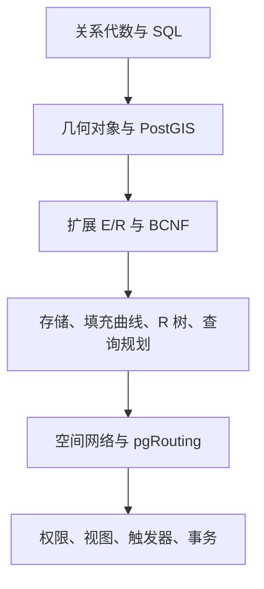

## 空间数据库

空间数据库是带位置参照的数据加上数据库管理系统。实现上通常等于对象关系数据库加上空间扩展：几何类型、空间谓词、空间索引。本栏目按这条链路展开，实践栈以 PostgreSQL、PostGIS、pgRouting 为准。

地球信息科学里的 [GIS 与测绘](../geospatial/gis-and-surveying.md) 交代坐标系、拓扑和法定精度；本栏目交代这些约束如何落进表、查询和事务。通用存储术语见 [数据库与数据存储](../../../tech/databases.md)。

几何对象模型回答周围有什么：点、线、面和九交关系。空间网络模型回答怎么到：边、代价和最短路。同一条道路在前一模型里是 `LINESTRING`，在后一模型里是 `source`–`target`–`cost`。

| 文章 | 说明 |
| --- | --- |
| [概论](01-overview.md) | 五层模型、三级模式、四代空间数据管理、SFA 与 SQL/MM |
| [关系模型与关系代数](02-relational-model.md) | 域、码、三类完整性、选择投影连接除 |
| [SQL](03-sql.md) | 定义、更新、查询语义、嵌套、连接、分组与空值 |
| [几何对象与 PostGIS](04-geometry-and-postgis.md) | 几何层次、九交、约 30 个方法、WKT、PostGIS |
| [空间扩展 E/R](05-spatial-er.md) | 设计阶段、象形图、转到关系 |
| [关系设计理论](06-normalization.md) | 函数依赖、BCNF、多值依赖 |
| [空间存储与索引](07-storage-and-index.md) | 文件组织、B+ 树、Z / Hilbert、R 树、GiST |
| [空间查询处理](08-query-processing.md) | 过滤–精炼、点/范围/最近邻/空间连接、代价模型 |
| [空间网络](09-spatial-network.md) | 传递闭包、`WITH RECURSIVE`、pgRouting |
| [安全与完整性](10-security-and-integrity.md) | 授权、约束、标准触发器、视图 |
| [服务器编程](11-server-programming.md) | PL/pgSQL 函数与 PostgreSQL 触发器 |
| [事务处理](12-transactions.md) | ACID、冲突可串行化、两段锁、隔离级别、WAL |
| [OLAP](13-olap.md) | 多维模型与立方体操作；空间库主线不依赖本篇 |
| [要点检查](14-review.md) | 各章可验收条目与易混点 |
| [实践路径](15-practice.md) | 从建表查询到路网与触发器的练习类型 |

## 产品边界

-   坐标系、SRID 和距离单位写进数据契约；混用地理类型与几何类型会得到错误距离
-   `ST_Intersects` 一类谓词可以走 GiST；`ST_Distance`、`ST_Disjoint` 不能当成同一套过滤路径
-   导航和可达必须走网络，不能用直线距离替代驾驶距离
-   轨迹要保留历史；当前点用视图或查询得到，不要覆盖旧点
-   公开地图精度、审图和涉密地理信息仍按测绘与地图管理规则；本栏目不替代资质成果

## 相关阅读

-   [地球信息科学](../geospatial/index.md)
-   [GIS 与测绘](../geospatial/gis-and-surveying.md)
-   [数据库与数据存储](../../../tech/databases.md)
-   [评估与评测](../../../ai/evaluation.md)

## 来源说明

本栏目根据对象关系数据库、OGC 简单要素和 PostGIS / pgRouting 的公开规范整理，并对照 Silberschatz《Database System Concepts》第七版、程昌秀《空间数据库管理系统概论》、Shekhar 与 Chawla《Spatial Databases: A Tour》。函数名、隔离级别和拓扑接口以所安装版本的官方文档为准。

条文、标准与产品功能以官方文本为准；本页核验日期为 2026-09-04。
