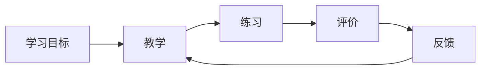

## 教育

教育产品的对象是学习者、教师和机构。效果看是否达到学习目标。阶段不同，同意规则、课程标准和采购主体不同。

划分依据是教育学的基本范畴：学制与教育阶段决定对象与制度；课程论、教学论与教育评价决定教什么、怎么教、如何知道学会了；教育技术是实现手段。企业培训与终身学习按继续教育写入教育阶段。

-   [教育阶段](stages/index.md)：基础教育、高等教育、职业教育、企业培训与终身学习
-   [课程、教学与评价](teaching-assessment/index.md)：课程、教学设计、测评、学习分析
-   [教育技术](edtech/index.md)：自适应学习、智能辅导、教务系统、学术诚信

## 产品约束

练习必须对齐课程标准并具有区分度。未成年人保护、作业负担和考试公平会限制功能。验收用测量学指标：信度、效度、区分度。

## 相关阅读

-   [用户研究](../../pm/user-research.md)
-   [评估与评测](../../ai/evaluation.md)
