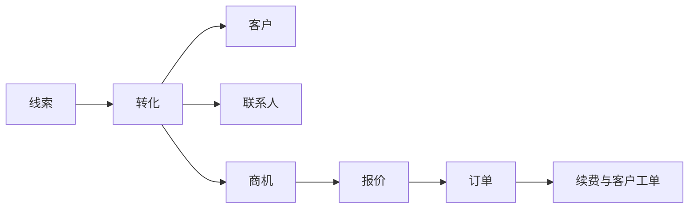
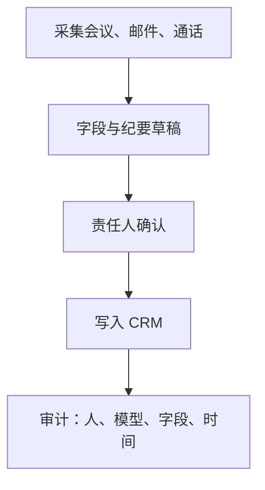

## CRM 与客户运营

客户关系管理（CRM）把获客、跟进、成交和续费写成可检索的对象与阶段。系统记录客户是谁、机会在哪一阶段、谁负责、下一步是什么。邮件、电话和拜访发生在系统外，结论要回到 CRM，预测和交接才成立。

对象模型以公开的销售云数据模型为共同语言，产品名以各厂商官方文档为准。Salesforce 的线索、客户、联系人、商机关系见 [Sales Overview](https://developer.salesforce.com/docs/platform/data-models/guide/sales-cloud-overview.html)。

### 对象

| 术语 | 含义 | 产品经理要写下的规则 |
| --- | --- | --- |
| **线索 / Lead** | 尚未确认是否为客户的潜在对象 | 转化条件、重复合并、转化后禁止继续跟原线索 |
| **客户 / Account** | 成交或目标组织；C 端场景可以是个人客户 | 唯一键、父子客户、归属销售与区域 |
| **联系人 / Contact** | 客户侧的具体人 | 一人可属多客户时写清关系类型；营销触达依赖同意 |
| **商机 / Opportunity** | 一笔在追的收入机会 | 阶段、金额、关闭日期、赢单标准同时有效 |
| **报价 / 订单** | 商务条件与成交单据 | 价格来自价目表；订单是财务事实的上游 |
| **客户工单 / Case** | 成交后的服务请求 | 与 IT 事故工单分清对象；关闭码和满意度要留 |
| **活动 / Campaign** | 市场投放与活动 | 成员状态可追溯到线索或商机，禁止只记曝光 |

线索转化生成客户、联系人和可选商机。商机推进到报价与订单；订单之后的续费、扩购和客诉仍落在同一客户下。

### 漏斗与阶段

漏斗是商机集合的阶段分布。阶段必须带进入条件和退出条件，否则预测只是销售自评。

常见阶段链：发现 → 确认需求 → 方案 → 商务 → 赢单或输单。具体名称跟销售方法走，产品要锁的是每阶段必填字段和禁止回跳的规则。

-   **退出条件**：进入下一阶段前必须具备的证据，如确认预算、指定决策人、书面需求、法务条款闭环
-   **预测分类**：管道、最佳情况、承诺、已关闭等口径决定管理层看见的数字；改分类等于改承诺
-   **关闭日期与金额**：与阶段一起构成预测三元组；模型改其中任一字段必须留审计
-   **赢单 / 输单原因**：用于复盘，不用于惩罚性考核口径时要在方案里写明
-   **MQL / SQL**：市场合格与销售合格是交接契约，定义写在双方共用的字段上，不写在各自报表里

覆盖率、赢率和周期是漏斗健康度。活动量（电话数、邮件数）只证明忙碌，不证明管道质量。

### 角色与四权

B2B 成交把决策、付款、使用、维护拆开，定价含义见 [商业化与增长](../../pm/monetization.md)。CRM 里还要映射销售组织自己的角色。

| 角色 | 对 CRM 的责任 | 产品里要限制的动作 |
| --- | --- | --- |
| **SDR / BDR** | 清洗线索、预约会面 | 可转化线索；默认不能改商机金额 |
| **AE** | 推进商机、对预测负责 | 改阶段、金额、关闭日期；赢单需满足退出条件 |
| **SE / 售前** | 方案与验证 | 写技术方案与验证记录；不改商务条款 |
| **CSM** | 落地、续费、扩购、健康度 | 写采用率与续费商机；不改历史成交订单 |
| **Sales Ops / RevOps** | 流程、字段、预测治理 | 改阶段定义与权限；生产数据变更走审批 |

客户侧还有经济买方、技术买方、使用者、反对者。联系人角色写在商机联系人关系上，否则交接只剩一个手机号。

### 模块边界

CRM 常拆成销售、服务、市场自动化、CPQ（配置价格报价）。边界按对象走：

-   **销售**：线索、商机、预测、活动
-   **服务**：客户工单、知识库、SLA；客服对话形态见 [客服自动化](../../practice/support-bot.md)
-   **市场自动化**：投放、评分、培育；评分只辅助分配，不单独淘汰客户
-   **CPQ**：可售组合、折扣权限、审批；价格真相在价目表，不在聊天记录
-   **客户成功**：健康度、续费商机、QBR 记录；健康分要能拆回产品采用与工单，不能只是主观标签

订单入账、开票、收入确认在 [ERP 与资源计划](erp.md)。CRM 赢单不等于财务确认收入。客户主数据以哪套系统为准，见 [主数据、集成与权限](integration.md)。

国内常见产品包括纷享销客、销售易、用友与金蝶的 CRM 模块；海外常见产品包括 Salesforce、HubSpot、Dynamics 365。模块范围、对象名和权限模型以各产品官方文档为准，本页不对照功能清单。

### 数据质量

CRM 失效几乎都先死在数据，而不是功能缺失。

-   **重复**：同一客户多条记录会拆散管道和工单；合并规则、唯一键（税号、域名、客户编码）要在导入时生效
-   **无主记录**：没有所有人的商机不进入预测
-   **阶段与证据不一致**：方案阶段没有决策人、承诺预测没有关闭计划，报表要标为不可用
-   **活动未回写**：会后纪要只在聊天工具里，预测无法解释
-   **字段膨胀**：自定义字段无负责人、无停用规则，录入成本会压过销售节奏
-   **同意与个人信息**：联系人的电话、邮箱、行踪受《个人信息保护法》约束；营销触达要能证明同意来源，条文以 [全国人大公开文本](http://www.npc.gov.cn/npc/c2/c30834/202108/t20210820_313088.html) 为准

评测集优先覆盖：重复合并对错、转化后原线索是否冻结、越权改金额、无退出条件的阶段跳转。

### 指标

| 指标 | 口径要点 | 误用 |
| --- | --- | --- |
| **管道覆盖** | 未关闭商机 / 目标 | 把早期阶段等权加总，覆盖率虚高 |
| **赢率** | 赢单商机 / 已关闭商机 | 把未关商机算进分母 |
| **周期** | 创建到关闭 | 忽略在同一阶段长期停滞 |
| **NRR / GRR** | 净留存与毛留存 | 把新客计入续费 |
| **采用率** | 关键功能的真实使用 | 用登录次数代替业务结果 |
| **预测偏差** | 承诺与关账差异 | 用模型平滑掉销售改数行为 |

指标定义要和阶段、预测分类一起版本化。换阶段定义等于换历史曲线，报表必须切版本，不能直接对比。

### AI 产品切入点

采集可以自动化，写入默认经所有人确认。

-   **录入**：纪要抽取下一步、联系人、金额候选；低置信字段标空，不猜
-   **评分与分配**：线索评分辅助 SDR 排队；淘汰规则保持人工可解释
-   **预测叙事**：解释管道变化，不直接改承诺分类
-   **下一步建议**：基于阶段退出条件缺什么，而不是生成万能话术
-   **客户成功**：从产品埋点与工单汇总健康度证据，续费结论由 CSM 写
-   **禁止**：无人确认关单；静默改金额或关闭日期；用生成内容覆盖正式报价；把营销点击模型直接当成交概率

嵌入形态见 [Copilot 产品](../../practice/copilot.md) 与 [工作流自动化](../../practice/workflow.md)。企业 Agent 的审计与集成要求见 [Agent 产品设计](../../practice/agent-product.md)。

### 常见误判

-   把 CRM 当通讯录，不记阶段证据
-   让模型直接写系统记录
-   用活动量考核替代赢率与周期
-   服务工单和销售商机抢同一条客户记录的所有权，却没有合并规则
-   赢单后不建续费商机，客户成功与销售断档

### 相关阅读

-   [企业服务](index.md)
-   [ERP 与资源计划](erp.md)
-   [商业化与增长](../../pm/monetization.md)
-   [产品战略与竞争](../../pm/strategy.md)
-   [客服自动化](../../practice/support-bot.md)
-   [B 端产品经理](../../job/product-manager-types/internet-product-manager.md)

## 来源说明

本页把该领域的公开框架转成产品经理可用的判断语言，不替代厂商实施手册或监管解释。

-   销售对象关系以 Salesforce [Sales Overview](https://developer.salesforce.com/docs/platform/data-models/guide/sales-cloud-overview.html) 为准
-   CRM 作为管理客户互动的技术类别，厂商定义见 [Gartner Glossary: CRM](https://www.gartner.com/en/information-technology/glossary/customer-relationship-management-crm)
-   联系人个人信息处理以《个人信息保护法》公开文本为准

条文、标准与产品功能以官方文本为准；本页核验日期为 2026-09-06。
