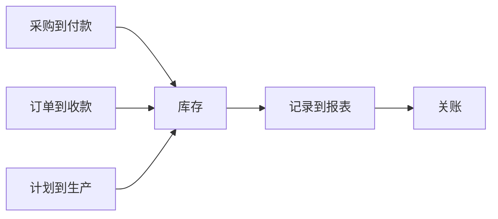

## ERP 与资源计划

企业资源计划（ERP）把采购、库存、生产、销售履行和财务记账放进同一套主数据与单据链。目标是一笔业务只发生一次、在总账里只记一次。SAP 对 ERP 的公开定义见 [What is SAP ERP](https://www.sap.com/products/erp/what-is-sap-erp.html)。

CRM 赢单之后的履约、开票、收款在本页。银行侧的企业授权与司库对接见 [对公与交易银行](../finance/banking/corporate-banking.md)。会计分录原理见 [会计学](../../business/02-accounting/index.md)。

### 对象

| 术语 | 含义 | 产品经理要写下的规则 |
| --- | --- | --- |
| **物料 / 物料主数据** | 可采购、可库存、可销售的物品或服务 | 编码唯一；单位、评估类、是否可库存要在创建时定死 |
| **供应商 / 客户主数据** | 采购与收款对手方 | 与 CRM 客户的映射键；付款条件在 ERP 生效 |
| **科目表** | 总账科目结构 | 产品禁止发明科目；入账必须落到已有科目 |
| **采购订单 / 收货 / 发票** | 采购到付款的三单 | 数量、价格、税码三单匹配才能过账 |
| **销售订单 / 发货 / 开票** | 订单到收款 | 发货过账扣库存；开票生成应收 |
| **库存与仓储** | 数量与货位 | 负库存、寄售、在途要分状态，不能混成一个数 |
| **成本中心 / 内部订单** | 费用归集对象 | 报销和分摊必须带核算对象 |

三条业务链汇入库存与总账。关账之后，本期单据默认只允许更正凭证，不允许悄悄改原单。

### 三条业务链

-   **采购到付款（P2P）**：请购 → 采购订单 → 收货 → 发票校验 → 付款。三单匹配失败时暂停付款，而不是让模型改单价了事
-   **订单到收款（O2C）**：销售订单 → 库存检查 → 发货 → 开票 → 收款核销。CRM 商机金额与 ERP 开票金额不一致时，以 ERP 过账为准做差异说明
-   **记录到报表（R2R）**：日记账、折旧、摊销、合并、关账。关账窗口、冻结科目、调整凭证权限是产品规则，不是财务口头习惯
-   **计划到生产（若有制造）**：独立需求、物料需求、工单、报工、入库。工单报工数量影响成本和库存，禁止聊天工具直接报工

国内常见产品包括用友 BIP、金蝶云；海外常见产品包括 SAP S/4HANA、Oracle Fusion Cloud ERP。模块划分与过账逻辑以官方文档和客户账套配置为准。

### 过账与责任

过账把业务事件变成会计事实。产品要写清：

-   **谁过账**：制单、复核、过账可以分离，对公支付的授权矩阵见交易银行页
-   **何时过账**：收货、发货、开票各有会计时点；提前或延后都会扭曲收入与库存
-   **凭什么过账**：必填核算对象、税码、期间；缺失时拒绝，不默认塞入杂项科目
-   **如何更正**：用红字或调整凭证，保留原链；删除已过账单据等于毁掉审计
-   **关账**：期间关闭后，业务单据接口返回明确错误，而不是写入下期却不提示

### AI 产品切入点

-   发票、采购订单、送货单的要素抽取与三单差异解释
-   费用报销科目与成本中心建议，过账仍由有权限的会计执行
-   关账清单：未清项、差异、缺失核算对象
-   库存差异说明，盘点结论由仓库与财务共同确认
-   禁止模型直接向总账过账、直接改库存数量、直接发出付款指令

对公支付、跨境申报和资金归集若对接银行，制单草稿可以自动化，提交仍走企业授权。

### 常见误判

-   用 CRM 报价覆盖 ERP 价目表
-   把聊天确认当成收货
-   关账后仍允许接口改本期库存
-   一套物料编码服务多个账套却没有评估范围
-   让模型在付款失败后自动重试而不查银行状态，重复付款风险见 [第三方服务与外部依赖](../../tech/third-party-services.md)

### 相关阅读

-   [企业服务](index.md)
-   [CRM 与客户运营](crm.md)
-   [主数据、集成与权限](integration.md)
-   [会计循环](../../business/02-accounting/03-accounting-cycle.md)
-   [财务管理](../../management/18-financial-management/index.md)

## 来源说明

本页把该领域的公开框架转成产品经理可用的判断语言，不替代会计准则、审计意见或厂商实施手册。

-   ERP 覆盖财务、采购、供应链、销售与生产等核心流程的公开表述，以 [SAP ERP](https://www.sap.com/products/erp/what-is-sap-erp.html) 为准
-   收入、存货与期间损益的确认以财政部企业会计准则及 [会计学](../../business/02-accounting/index.md) 课程页为准

条文、标准与产品功能以官方文本为准；本页核验日期为 2026-09-06。
