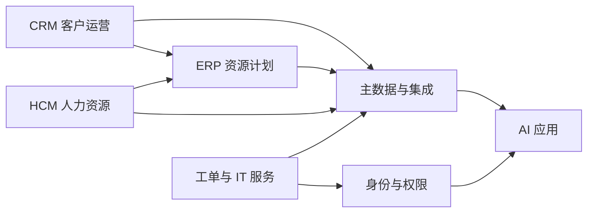

## 企业服务

企业服务处理组织自己用来经营的业务系统：谁是客户、货从哪来、钱如何记账、人如何发薪、内部故障如何闭环。对象跨行业，对错由主数据归属和过账责任定义，不由某个持牌监管口径单独定义。

金融、医疗、法律等行业页回答持牌机构如何展业。本分组回答销售、财务、人事和 IT 日常操作落在哪套系统、字段由谁改、模型输出何时可以写入。

划分依据是企业职能：客户运营对应 CRM，资源与账务对应 ERP，人与组织对应 HCM，内部服务对应工单与 ITSM，横切能力是主数据、集成与权限。同一家公司会同时运行这几套系统。AI 产品嵌进这些系统记录里读写。

客户、物料、员工和权限先在各系统记录里对齐，AI 应用再读这些记录去辅助填写、检查和起草。

-   [CRM 与客户运营](crm.md)：线索、客户、商机、续费与客户工单
-   [ERP 与资源计划](erp.md)：采购、库存、订单、总账与关账
-   [HCM 与人力资源](hcm.md)：组织、招聘、考勤、发薪与离职
-   [工单与 IT 服务](itsm.md)：事故、请求、变更、配置项与服务台
-   [主数据、集成与权限](integration.md)：系统记录、同步、SSO 与最小权限

买家、使用者和维护者经常分离。需求要同时写清谁受益、谁买单、谁决策、谁运维，方法见 [需求分析](../../pm/requirements.md) 与 [B 端产品经理](../../job/product-manager-types/internet-product-manager.md)。

## 产品约束

验收看主数据是否唯一、过账是否留责任人、权限是否按租户和角色执行、模型写入是否可回滚。预测、评分和草稿可以自动化；关单、过账、发薪、生产变更默认由业务责任人确认。

把边界写进 [AI 产品 PRD](../../pm/prd.md) 的范围、拒答、引用和审计。评测集覆盖错写字段、写错对象、越权同步和重复主数据，方法见 [评估与评测](../../ai/evaluation.md)。

???+ warning "系统记录不可旁路"
    财务过账、发薪、关单和客户主数据变更都有业务责任人。

    产品可以辅助填写、检查和起草，不能把模型输出直接写成正式记录。

## 阅读顺序

1.  用本页分清五类系统各自保管什么对象
2.  按任务进入对应篇目，记下对象、阶段、责任人和禁止写入的动作
3.  需要跨系统读写时，先读 [主数据、集成与权限](integration.md)
4.  形态设计仍用 [AI 产品实战](../../practice/index.md)，本分组只提供对象与责任

## 相关阅读

-   [商业化与增长](../../pm/monetization.md)
-   [身份认证与权限](../../tech/identity-access.md)
-   [第三方服务与外部依赖](../../tech/third-party-services.md)
-   [市场营销学](../../management/06-marketing/index.md)
-   [FDE（前沿部署工程师）](../../job/positions/fde.md)
