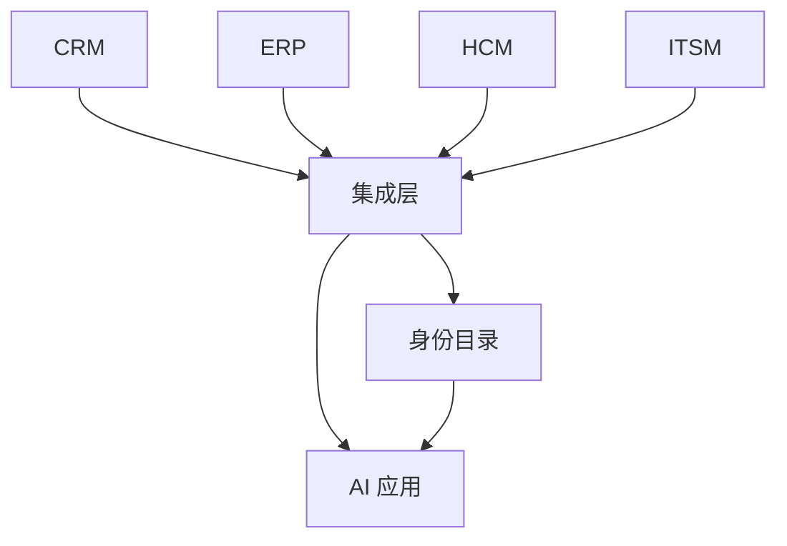

## 主数据、集成与权限

企业同时运行 CRM、ERP、HCM 和 ITSM 时，同一客户、同一员工、同一物料会在多处出现。产品先规定哪套系统是哪类对象的系统记录，再谈同步与 AI 读写。没有归属的集成会在几天内复制出互相矛盾的主数据。

身份与授权机制见 [身份认证与权限](../../tech/identity-access.md)。外部 API、Webhook、超时和数据出域见 [第三方服务与外部依赖](../../tech/third-party-services.md)。

### 系统记录

| 对象 | 默认系统记录 | 其他系统如何用 |
| --- | --- | --- |
| **客户 / 收款对手方** | ERP 客户主数据；销售过程在 CRM | CRM 赢单后把编码回写；开票只用 ERP 编码 |
| **联系人** | CRM | 发货通知可引用；合同签署人要能追溯到联系人 ID |
| **物料 / 可售产品** | ERP | CRM 价目与 CPQ 引用 ERP 物料号，不自建第二套编码 |
| **员工与组织** | HCM | 身份目录、ITSM 请求人和 CRM 所有人引用工号 |
| **账号与权限包** | 身份目录 / IdP | 入职由 HCM 驱动开通；业务系统不各自发明员工 |
| **配置项** | ITSM / CMDB | 变更和事故引用 CI；资产财务信息可在 ERP 资产模块 |

默认可以按客户账套改，但必须写在集成方案第一页。禁止出现「两边都能改、冲突时以最后写入为准」而不留审计。

集成层做映射、验签、重试和冲突记录。AI 应用通过集成层访问，不直连每套生产库各写一份。

### 同步与冲突

-   **方向**：单向（HCM → IdP）或双向（CRM ↔ ERP 客户名）。双向必须定义冲突胜出规则和人工队列
-   **键**：自然键（税号、域名、工号）加系统生成的稳定 ID。只用公司名匹配，重复率不可接受
-   **时序**：Webhook 会乱序和重复，消费端幂等；过账类操作先查状态再重试
-   **最终一致**：报表和模型要能容忍秒到分钟级延迟；把延迟当失败会制造重复单据
-   **失败**：死信队列、可重放、告警到 ITSM 事故。静默丢同步等于静默改主数据
-   **裁剪字段**：只同步下游动作需要的字段。绩效评语、薪资明细、完整通话录音默认不出域

iPaaS、企业服务总线或点对点 API 都可以。产品要验收的是映射表、失败重放和权限范围，而不是中间件品牌。

### 身份与最小权限

人从 HCM 进入，账号在 IdP，授权在各业务系统。

-   **SSO / OIDC**：登录只证明是谁；进 CRM 某条客户、过 ERP 某张凭证，仍要做资源级授权
-   **SCIM 或入职事件**：创建、更新、停用账号随雇佣状态走；离职日当天关闭
-   **角色包**：按职位给默认权限，例外权限有到期日
-   **服务身份**：集成账号和 AI Agent 各自凭据，不借用某个管理员的登录态
-   **代表谁操作**：Agent 写 CRM 字段时，审计里同时留下用户、服务身份、模型版本
-   **租户**：实施、演示、生产数据隔离；跨客户检索是事故

Agent 工具调用的权限与不可逆确认，见 [Agent 产品设计](../../practice/agent-product.md) 与 [工具调用与 MCP](../../ai/agent-tools.md)。

### AI 产品切入点

-   主数据匹配建议：疑似重复客户或员工的合并草稿，合并由主数据责任人执行
-   映射异常解释：为何这条商机没有 ERP 客户编码
-   权限 diff：入职默认包与实际已开通权限的差异
-   禁止 AI 应用各存一份客户或员工副本作为长期系统记录
-   禁止用个人 API Key 在生产做全量同步
-   禁止在未分类的对象上做跨系统级联删除

### 常见误判

-   先接模型，后补主数据键
-   冲突时覆盖写入且无责任人
-   把 IdP 登录成功当成可过账
-   演示环境连生产 CRM
-   为了方便给 Agent 开超级管理员

### 相关阅读

-   [企业服务](index.md)
-   [CRM 与客户运营](crm.md)
-   [ERP 与资源计划](erp.md)
-   [HCM 与人力资源](hcm.md)
-   [工单与 IT 服务](itsm.md)
-   [身份认证与权限](../../tech/identity-access.md)
-   [第三方服务与外部依赖](../../tech/third-party-services.md)

## 来源说明

本页把该领域的公开框架转成产品经理可用的判断语言，不替代客户的集成架构说明书。

-   认证与授权术语以 [身份认证与权限](../../tech/identity-access.md) 及 OAuth / OIDC 提供方文档为准
-   外部回调、重试、幂等与数据出域以 [第三方服务与外部依赖](../../tech/third-party-services.md) 为准
-   各业务对象的系统记录以 CRM、ERP、HCM、ITSM 厂商官方数据模型为准

条文、标准与产品功能以官方文本为准；本页核验日期为 2026-09-06。
