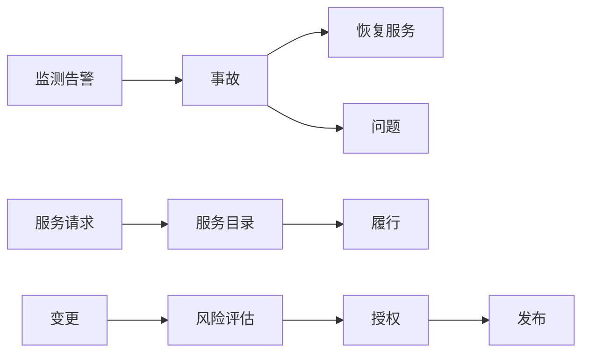

## 工单与 IT 服务

IT 服务管理（ITSM）处理组织内部如何受理故障、履行请求、控制变更并维持配置真实。工单是服务对象的容器。公开实践框架以 ITIL 为准，现行认证与实践说明见 [PeopleCert ITIL](https://www.peoplecert.org/browse-certifications/it-governance-and-service-management/ITIL-1)。

面向外部客户的咨询、退款和投诉工单在 CRM 的客户工单里，设计见 [客服自动化](../../practice/support-bot.md)。本页管内部服务台：账号打不开、系统中断、要装软件、要改生产配置。

### 对象

| 术语 | 含义 | 产品经理要写下的规则 |
| --- | --- | --- |
| **事故 / Incident** | 服务中断或质量下降的一次发生 | 目标是恢复服务，不是做完根因 |
| **问题 / Problem** | 一个或多个事故的根因 | 未关闭问题可以挂多起事故；禁止用事故单当问题单 |
| **服务请求** | 标准、低风险的用户需求 | 走目录与自动化；不走紧急变更 |
| **变更** | 对生产配置或服务的改动 | 标准、正常、紧急分类；紧急也要事后补记录 |
| **配置项 / CI** | 需要管理的服务组件 | 变更必须指向 CI；无 CI 的变更视为无主 |
| **知识条目** | 可复用的处理说明 | 与事故解决绑定；过期条目不得被机器人引用 |
| **SLA / OLA** | 对用户或对内部团队的时限 | 计时从受理开始；等待用户的时间要单独记账 |

事故先恢复，再决定是否建问题。请求走目录。变更走风险与授权。三条链不要并进同一状态机硬套。

### 优先级与变更

优先级由影响范围和紧急程度共同决定，不由提单人职务决定。P1 大面积中断与 P4 个人偏好必须分开队列、分开值班。

-   **事故**：计时、升级、沟通模板、桥接电话规则写进产品；恢复后才能关单
-   **请求**：服务目录给出可点选的标准项（开权限、装软件、要设备）；目录外需求转需求管理，不伪装成事故
-   **变更**：风险、回滚、影响 CI、变更窗口。标准变更可预授权；正常变更进评审；紧急变更缩小范围并在事后复核
-   **配置管理**：CMDB 与真实环境定期核对。机器人按过期 CI 做影响分析会得出错误窗口
-   **知识**：解决步骤回写知识库才算闭环；只把对话摘要塞进工单注释，下次仍要从头问

安全运营里的检测与响应工单会接到本系统，对象与证据要求见 [检测与响应](../cybersecurity/operations/detection-and-response.md) 与 [安全运营中心](../cybersecurity/operations/soc.md)。

### AI 产品切入点

-   事故分类、相似单检索、知识条目推荐；用户可见回复默认经服务台确认
-   请求预填：从身份目录带出岗位与已有权限，减少来回问
-   变更风险草稿：列出影响 CI、最近失败变更、回滚缺失项；授权仍由变更经理或 CAB 做出
-   事故桥接摘要与时间线整理
-   禁止未授权对生产执行变更、禁止把事故自动关单、禁止用生成步骤替代已验证的知识条目、禁止跨租户检索工单

观测信号如何进入事故，见 [可观测性](../../tech/observability.md)。客服机器人的转人工与权限矩阵可复用方法，对象仍要分开。

### 常见误判

-   所有内部需求都建成事故，目录和变更被架空
-   用职务高低覆盖优先级
-   CMDB 长期不核对，影响分析变成摆设
-   让模型直接调发布流水线
-   把外部客户投诉和内部系统中断写进同一套 SLA

### 相关阅读

-   [企业服务](index.md)
-   [主数据、集成与权限](integration.md)
-   [客服自动化](../../practice/support-bot.md)
-   [可观测性](../../tech/observability.md)
-   [身份认证与权限](../../tech/identity-access.md)

## 来源说明

本页把该领域的公开框架转成产品经理可用的判断语言，不替代 ITIL 认证教材或客户的服务目录。

-   ITIL 实践与认证以 [PeopleCert ITIL](https://www.peoplecert.org/browse-certifications/it-governance-and-service-management/ITIL-1) 为准
-   具体事故、问题和变更的流程以组织已采纳的实践指南及 ITSM 产品官方文档为准，例如 [ServiceNow ITSM](https://www.servicenow.com/products/itsm.html)

条文、标准与产品功能以官方文本为准；本页核验日期为 2026-09-06。
